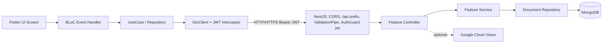
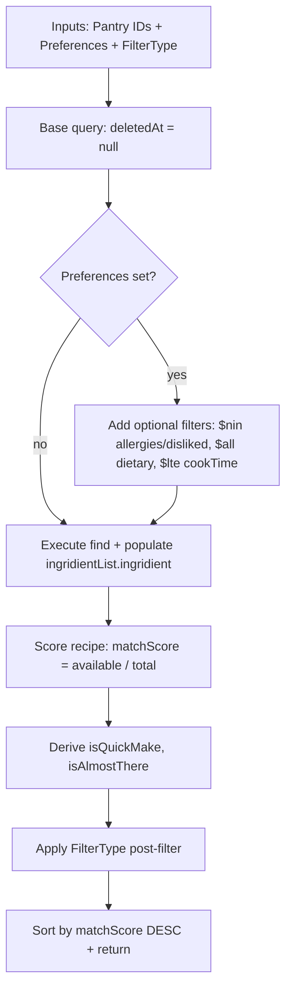

# PantryChef Architecture

PantryChef is a recipe-and-pantry management system split into a Flutter mobile
client and a NestJS backend that live side by side in a single Git repository.
This document explains how the two halves fit together: the monorepo layout, the
technology choices and the reasoning behind them, the cross-cutting concerns that
span every feature (authentication, soft-delete, pagination, state management,
and dependency injection), the end-to-end path a request travels from a tapped
button in the mobile UI down to a MongoDB query or a Google Cloud Vision call,
and finally a deep-dive on the headline Recipe Matching Pipeline. Every
architectural claim below is cited to the source file and line that backs it. For
the persistence schema see [DATA_MODEL.md](DATA_MODEL.md); for the inventory of
gaps that block a production deployment see
[PRODUCTION_READINESS.md](PRODUCTION_READINESS.md).

## Monorepo Structure

The repository is a two-part workspace with three cross-cutting documentation
files at its root:

```text
PantryChef/
├── ARCHITECTURE.md              (this file)
├── DATA_MODEL.md
├── PRODUCTION_READINESS.md
├── backend/                     (NestJS + TypeScript)
│   ├── src/                     (auth, users, pantry, ingridient, recipe, ai, database, config, common, session, utils)
│   ├── test/                    (Jest E2E)
│   ├── Dockerfile, docker-compose.yml
│   └── package.json, env_example
└── mobile/                      (Flutter + Dart)
    ├── lib/
    │   ├── core/                (shared infrastructure)
    │   ├── features/            (authentication, ingredient, pantry, profile, recipe)
    │   ├── env_config.dart
    │   └── main.dart
    └── pubspec.yaml, analysis_options.yaml
```

The backend is a NestJS + TypeScript service named `blitzy-backend` at version
`0.0.1` under an `UNLICENSED` license (Source: backend/package.json:L2-L7). The
mobile client is a Flutter + Dart application named `pantry_chef` at version
`1.0.0+1` (Source: mobile/pubspec.yaml:L1,L19). One naming quirk spans the whole
repository: the backend spells its ingredient module folder `ingridient/` — and
exposes types such as `Ingridient` (spelling preserved verbatim; the misspelling
is an intentional, stable contract throughout the backend and must not be
"corrected") — whereas the mobile side uses the correctly spelled `ingredient/`
feature folder.

Each half follows a consistent layering. The backend uses a
controller → service → repository → domain pattern: a `*.controller.ts` routes
HTTP requests, a `*.service.ts` orchestrates business logic, an abstract
`*.repository.ts` declares the persistence contract, and a concrete
`infrastructure/document/repositories/*.repository.ts` implements that contract
against Mongoose, bound at composition time when `AppModule` assembles its seven
feature modules (Source: backend/src/app.module.ts:L18-L35). The mobile client
uses Flutter clean architecture per feature: a `domain/` layer (use cases,
repository contracts, and models such as `instraction_item.dart`, which defines
the `InstractionItem` class — both the filename and the class name are spellings
preserved verbatim), a `data/` layer (Dio API clients, DTOs, and repository
implementations), and a `presentation/` layer (BLoCs, screens, and widgets).

## Technology Choices and Rationale

**Backend (NestJS).**

- NestJS `^10.0.0` — chosen for its opinionated modular structure, decorator-based
  dependency injection, and first-class OpenAPI support (Source: backend/package.json:L26).
- TypeScript `^5.1.3` — static typing on the server (Source: backend/package.json:L74).
- Mongoose `^8.8.0` with `@nestjs/mongoose` `^10.1.0` — a document store chosen so
  that user `Preferences` can be embedded directly in the `User` document and
  `Recipe` documents can carry flexible nested arrays (Source: backend/package.json:L37,L30).
- `@nestjs/jwt` `^10.2.0` with `passport` `^0.7.0`, `passport-jwt` `^4.0.1`, and
  `passport-anonymous` `^1.0.1` — JWT access/refresh authentication plus an
  anonymous strategy for public endpoints (Source: backend/package.json:L29,L40-L42).
- `@nestjs/swagger` `^8.0.1` — an OpenAPI surface served live at `/docs` via
  `SwaggerModule.setup('docs', app, document)` (Source: backend/package.json:L33; backend/src/main.ts:L31).
- `bcryptjs` `^2.4.3` — password hashing (Source: backend/package.json:L34).
- `@google-cloud/vision` `^4.3.2` — AI ingredient label detection from uploaded
  photos (Source: backend/package.json:L25).
- `multer` `^1.4.5-lts.1` — multipart image-upload handling (Source: backend/package.json:L39).

**Mobile (Flutter).**

- Dart SDK `^3.5.1` — the Flutter toolchain constraint declared in the
  `environment:` block (Source: mobile/pubspec.yaml:L22).
- `bloc` `^8.1.4`, `flutter_bloc` `^8.1.6`, and `hydrated_bloc` `^9.1.5` —
  event-driven state management with optional persistence (Source: mobile/pubspec.yaml:L38-L43).
- `get_it` `^8.0.2` — service-locator dependency injection (Source: mobile/pubspec.yaml:L34).
- `dio` `^5.7.0` — HTTP client with an interceptor chain for JWT injection and
  refresh (Source: mobile/pubspec.yaml:L50).
- `shared_preferences` `^2.3.2` — persistent key/value storage for JWT tokens
  (Source: mobile/pubspec.yaml:L35).
- `camera` `^0.11.0+2` — photo capture feeding AI ingredient recognition
  (Source: mobile/pubspec.yaml:L46).
- `json_serializable` `^6.7.1` with `build_runner` `^2.4.6` — codegen for JSON
  DTOs; the generated `*.g.dart` files are excluded from inline documentation
  (Source: mobile/pubspec.yaml:L62-L63).

**Persistence.** MongoDB runs from the `mongo:latest` image declared in
`docker-compose.yml`, with root credentials hardcoded as `admin`/`123456`
(Source: backend/docker-compose.yml:L5,L9-L10). Those baked-in credentials are a
development convenience and a production gap — see
[PRODUCTION_READINESS.md](PRODUCTION_READINESS.md). The root `AppController`
exposes a single `GET /` returning the literal `'Hello World!'` from
`AppService.getHello()`; it is retained NestJS scaffolding and serves as a trivial
liveness stub (Source: backend/src/app.module.ts:L36-L37).

## Cross-Cutting Concerns

Five concerns cut across every feature module.

### JWT Authentication Flow

1. A client signs in by posting to `POST /api/auth/email/login` with an
   `AuthEmailLoginDto` carrying email and password (Source: backend/src/auth/auth.controller.ts:L56-L62).
   The mobile signup screen reaches the sibling `POST /api/auth/email/register`
   endpoint after navigating through the `Navigation.singup` route (spelling
   preserved verbatim — the route constant is intentionally misspelled and must
   not be renamed) (Source: backend/src/auth/auth.controller.ts:L74-L80).
2. On success the backend returns a `{ token, refreshToken, tokenExpires }`
   payload.
3. The mobile `DioClient` registers a request interceptor that reads
   `_sharedPrefHelper.accessToken` and, when present, appends an
   `Authorization: Bearer <token>` header to every outbound request
   (Source: mobile/lib/core/utils/dio_client.dart:L36-L41).
4. When a response returns `401 Unauthorized` (or the token-expired status), the
   error interceptor delegates to a dedicated `_refreshDio` instance that carries
   no auth interceptor, so the refresh call itself cannot recurse
   (Source: mobile/lib/core/utils/dio_client.dart:L44-L51,L55-L69).
5. `_refreshDio` posts the refresh token to `POST /api/auth/refresh`, which is
   guarded by `AuthGuard('jwt-refresh')` — a `passport-jwt` strategy keyed on the
   separate `AUTH_REFRESH_SECRET`; on success it mints new access and refresh
   tokens, which the client persists before transparently retrying the original
   request (Source: backend/src/auth/auth.controller.ts:L111-L119; mobile/lib/core/utils/dio_client.dart:L71-L97).
6. Session state lives in a dedicated `Session` collection so that
   `POST /api/auth/logout` can invalidate the refresh path by marking the
   session's `deletedAt` (Source: backend/src/auth/auth.controller.ts:L131-L139).

> ⚠️ The default `AUTH_REFRESH_TOKEN_EXPIRES_IN=3650d` (~10 years) shipped in
> `backend/env_example:L23` is far too long for production: a compromised refresh
> token would remain valid for roughly a decade. Remediation is tracked in
> [PRODUCTION_READINESS.md](PRODUCTION_READINESS.md).

### Soft-Delete Contract

Every one of the five document schemas carries a nullable `deletedAt: Date | null`
field. The convention is that `find*` repository methods filter on
`deletedAt: null` to hide removed records, and `softDelete()` methods set
`{ deletedAt: new Date() }` rather than physically deleting. The `Recipe`
repository honours this faithfully — its `softDelete()` issues
`updateOne({ _id: id }, { deletedAt: new Date() })`
(Source: backend/src/recipe/infrastructure/document/repositories/recipe.repository.ts:L288-L290).
The field-level contract is described in [DATA_MODEL.md](DATA_MODEL.md).

> ⚠️ `PantryIngridientDocumentRepository.softDelete()` violates this contract:
> despite its name it calls `deleteOne({ _id: id })`, physically destroying the
> record rather than flagging it
> (Source: backend/src/pantry/infrastructure/document/repositories/pantryIngridient.repository.ts:L200-L204).
> The discrepancy will be flagged inline with a `// FIXME:` when the pantry source is
> annotated in a later checkpoint, and is catalogued in
> [PRODUCTION_READINESS.md](PRODUCTION_READINESS.md).

### Pagination Cap 50

Every list endpoint caps page size defensively. The recipe controller defaults
`limit` to 10 and clamps it with `if (limit > 50) { limit = 50; }` before
querying; the same guard is repeated in the pantry, ingridient, and users
controllers (Source: backend/src/recipe/recipe.controller.ts:L96-L100). Pages are
1-based, and the repository computes the offset as `skip = (page - 1) * limit`
(Source: backend/src/recipe/infrastructure/document/repositories/recipe.repository.ts:L129).

### BLoC State Management

The mobile client manages state with `bloc`/`flutter_bloc` for in-memory
event→state transitions and `hydrated_bloc` for blocs whose state must survive an
app restart (for example pantry contents, profile, and favorite recipes).
Persistence is bootstrapped once in `main()`, which sets `HydratedBloc.storage` to
a `HydratedStorage` backed by `path_provider`'s temporary directory
(Source: mobile/lib/main.dart:L14-L16).

### GetIt Dependency Injection

Dependencies are wired through a GetIt service locator. `setupLocator()`
registers, in order: `SharedPreferences` as an async singleton, a
`SharedPreferencesHelper` that wraps it, and a `DioClient` that depends on that
helper (Source: mobile/lib/core/utils/service_locator.dart:L8-L15). It is awaited
inside `main()` before `runApp(const App())`, so every screen and BLoC can resolve
a fully configured HTTP client (Source: mobile/lib/main.dart:L18-L19).

## Full Request Path



A request begins when the UI dispatches an event to a BLoC (for example
`LoginRequested`). The BLoC calls into the domain layer (`AuthRepository.login`),
which in turn calls the Dio-based data-layer client. `DioClient.dio` runs its
`LogInterceptor` and then the request interceptor that appends
`Authorization: Bearer <token>` whenever a stored access token exists
(Source: mobile/lib/core/utils/dio_client.dart:L36-L41).

The request crosses the network to the NestJS process started by
`app.listen(configService.getOrThrow('app.port'))` (Source: backend/src/main.ts:L33).
The application is created with `NestFactory.create(AppModule, { cors: true })`
(Source: backend/src/main.ts:L11), applies a global prefix so routes are served
under `/api` with `/` excluded (Source: backend/src/main.ts:L14-L19), and installs
a global `ValidationPipe` that validates incoming DTOs
(Source: backend/src/main.ts:L21). Guarded controller methods such as
`RecipeController.matches` run only after `AuthGuard('jwt')` has populated
`request.user` (Source: backend/src/recipe/recipe.controller.ts:L28-L29,L74-L79).
The controller delegates to its service, which calls the document repository; the
repository queries MongoDB through Mongoose. For the AI endpoint,
`AiController.processImageRecognize` additionally forwards the uploaded image
buffer to Google Cloud Vision (Source: backend/src/ai/ai.controller.ts:L65-L73).

> ⚠️ `NestFactory.create(AppModule, { cors: true })` enables fully open CORS
> (Source: backend/src/main.ts:L11); a production deployment should restrict the
> origin allow-list. See [PRODUCTION_READINESS.md](PRODUCTION_READINESS.md).

> ⚠️ The feature controllers declare a version
> (`@Controller({ path: 'recipe', version: '1' })`, Source: backend/src/recipe/recipe.controller.ts:L31-L34),
> but `app.enableVersioning()` is never called during bootstrap
> (Source: backend/src/main.ts:L10-L35), so at runtime the `version` property is
> inert and the effective paths carry only the `/api` prefix (for example
> `/api/auth/refresh`). This document therefore documents the actual runtime paths
> under `/api` (with no `/v1` segment), matching the module READMEs. The mobile
> client confirms this: its endpoint base ends in `/api` with no version segment
> (Source: mobile/lib/env_config.dart:L2; mobile/lib/core/utils/dio_client.dart:L78-L81).
> Wiring up versioning is tracked in [PRODUCTION_READINESS.md](PRODUCTION_READINESS.md).

## Recipe Matching Pipeline

The recipe matching pipeline is PantryChef's headline feature. It answers the
question "what can I cook right now?" by scoring every candidate recipe against
the ingredients currently in a user's pantry, narrowed by that user's dietary
preferences. The whole algorithm lives in a single method
(Source: backend/src/recipe/infrastructure/document/repositories/recipe.repository.ts:L171-L251).

### Algorithm Overview

`matches()` takes the authenticated user's `Preferences`, their current
`PantryIngridient[]`, and a `FilterType` (the shape
`{ isQuickMake?: boolean; isAlmostThere?: boolean }`), and returns a list of
`Recipe` objects scored by ingredient availability and optionally narrowed to
quick or almost-complete recipes
(Source: backend/src/recipe/infrastructure/document/repositories/recipe.repository.ts:L171-L175;
backend/src/recipe/types/filter.types.ts:L10-L13). It first reduces the pantry to a
list of ingredient ids — `pantryIngredients.map((pi) => pi.ingridient.id)` — which
becomes the lookup set used during scoring
(Source: backend/src/recipe/infrastructure/document/repositories/recipe.repository.ts:L176).

### Mongo Pre-Filter Chain

Before touching the database, `matches()` assembles a query object and
conditionally adds four filters:

1. `deletedAt: null` — always applied, to exclude soft-deleted recipes
   (Source: backend/src/recipe/infrastructure/document/repositories/recipe.repository.ts:L178).
2. `ingridientList.ingridient: { $nin: excludedIngredients }` — applied only when
   the union of `preferences.allergies` and `preferences.dislikedIngredients` is
   non-empty
   (Source: backend/src/recipe/infrastructure/document/repositories/recipe.repository.ts:L181-L188).
3. `tags: { $all: preferences.dietary }` — applied only when the user declares
   dietary tags
   (Source: backend/src/recipe/infrastructure/document/repositories/recipe.repository.ts:L191-L193).
4. `cookTime: { $lte: preferences.cookingTime }` — applied only when a cooking-time
   ceiling is set
   (Source: backend/src/recipe/infrastructure/document/repositories/recipe.repository.ts:L196-L198).

The assembled query is then executed with
`.find(query).populate('ingridientList.ingridient').exec()`
(Source: backend/src/recipe/infrastructure/document/repositories/recipe.repository.ts:L202-L205).

### Per-Recipe Scoring Loop

Each returned recipe is scored inside a `.map()`:

```typescript
const totalIngredients = recipe.ingridientList.length;
const availableIngredients = recipe.ingridientList.filter((il) =>
  pantryIngredientIds.includes(il.ingridient._id.toString()),
);
```

Here `ingridientList` (spelling preserved verbatim) is the recipe's embedded
ingredient array. `matchScore` is then `availableIngredients.length / totalIngredients`,
a value in the range `[0, 1]`, and `missingIngredientsCount` is
`totalIngredients - availableIngredients.length`
(Source: backend/src/recipe/infrastructure/document/repositories/recipe.repository.ts:L210-L217).

### isQuickMake / isAlmostThere Derivation

Two boolean flags are derived for every recipe:

- `isQuickMake = totalIngredients <= 5`
  (Source: backend/src/recipe/infrastructure/document/repositories/recipe.repository.ts:L219).
- `isAlmostThere = missingIngredientsCount >= 1 && missingIngredientsCount <= 2`
  (Source: backend/src/recipe/infrastructure/document/repositories/recipe.repository.ts:L221-L222).

### Post-Filter and Sort

A `.filter()` step then applies the request's `FilterType`
(Source: backend/src/recipe/infrastructure/document/repositories/recipe.repository.ts:L232-L246):
a recipe is kept if `filterOptions.isQuickMake && recipe.isQuickMake`, or if
`filterOptions.isAlmostThere && recipe.isAlmostThere`, or if neither flag was
requested (in which case every recipe passes); otherwise it is dropped. Finally the
survivors are sorted by descending score with
`.sort((a, b) => b.matchScore - a.matchScore)` and mapped back to domain objects
(Source: backend/src/recipe/infrastructure/document/repositories/recipe.repository.ts:L247-L248).

### Known Limitations

> ⚠️ **Exact `_id` matching only.** Availability is decided by
> `pantryIngredientIds.includes(il.ingridient._id.toString())`
> (Source: backend/src/recipe/infrastructure/document/repositories/recipe.repository.ts:L211-L213).
> A pantry "tomato" with id `A` will not satisfy a recipe ingredient pointing at
> "tomato" with id `B`, even when the names are identical; substitutes and
> equivalent ingredients are ignored.

> ⚠️ **No unit normalization.** The amount and unit fields on the embedded
> `ingridientList` entries are never consulted, so the algorithm treats "10 grams
> of salt" and "1 ton of salt" identically.

> ⚠️ **No quantity sufficiency check.** An ingredient counts as "available" even
> when the pantry holds far less than the recipe requires — 10 g of tomatoes is
> treated as satisfying a 500 g requirement.



> 🚧 These limitations and their remediation — indexes for matching at scale, unit
> normalization, quantity sufficiency checks, and unit tests for `matches()` — are
> catalogued in [PRODUCTION_READINESS.md](PRODUCTION_READINESS.md).

For endpoint-level usage of this pipeline see the
[recipe module README](backend/src/recipe/README.md); for the backend `IngridientList`
(spelling preserved verbatim) and `Instruction` sub-schemas it relies on, see
[DATA_MODEL.md](DATA_MODEL.md). The mobile client mirrors these with a separately spelled
`InstractionItem` (spelling preserved verbatim) in `instraction_item.dart`, documented when
the mobile recipe feature is in scope.
