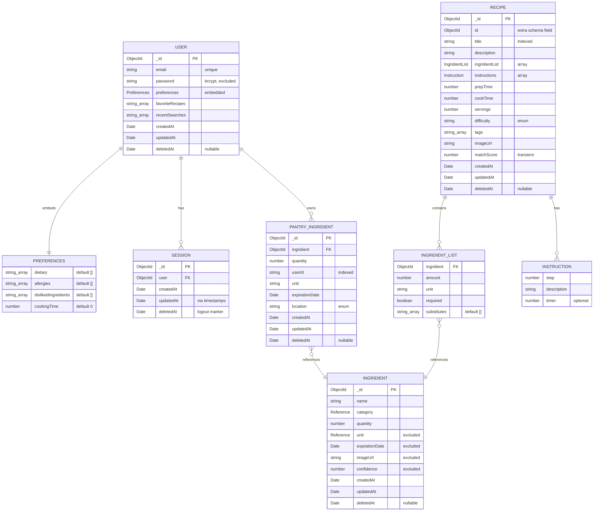

# PantryChef Data Model

This document is the canonical reference for the PantryChef persistence layer. It
describes every MongoDB collection the NestJS backend stores, the relationships
between them, and the schema conventions they share. It is referenced by the
backend module READMEs and by [ARCHITECTURE.md](ARCHITECTURE.md); production
concerns raised here are tracked in
[PRODUCTION_READINESS.md](PRODUCTION_READINESS.md).

## Overview

The backend persists **five MongoDB collections** — `User`, `Session`,
`Ingridient` (spelling preserved verbatim from the codebase), `PantryIngridient`
(spelling preserved verbatim), and `Recipe`. Persistence is implemented with
`@nestjs/mongoose` ^10.1.0 and `mongoose` ^8.8.0
(Source: backend/package.json:L30,L37) using the decorator-driven schema style
(`@Schema`, `@Prop`, and `SchemaFactory.createForClass`).

Four conventions hold across all five schema classes:

- **Shared base class.** Every schema class extends `EntityDocumentHelper`, which
  exposes the Mongoose `_id` as a string and registers a `class-transformer`
  `@Transform` so the ObjectId serialises cleanly through the API
  (Source: backend/src/utils/document-entity-helper.ts).
- **Automatic timestamps.** Each schema is declared with
  `@Schema({ timestamps: true })`, so Mongoose maintains `createdAt` and
  `updatedAt` automatically; the classes additionally declare those fields with
  `@Prop({ default: now })` (Source:
  backend/src/users/infrastructure/document/entities/user.schema.ts:L67-L68).
- **Soft-delete marker.** Every collection carries a nullable `deletedAt` field
  so records can be flagged as removed rather than physically destroyed. See
  [Soft-Delete (deletedAt)](#soft-delete-deletedat) for the one repository that
  violates this contract.
- **Spelling-preservation convention.** The identifiers `Ingridient`,
  `PantryIngridient`, `IngridientList`, and `ingridientList` are misspelled in the
  source but are stable API and file-system contracts. This document preserves
  them verbatim and never "corrects" them; the parenthetical "(spelling preserved
  verbatim)" appears on first use of each.

Mongoose `ObjectId` `_id` is the primary key for all five collections. Where a
schema needs to reference catalogue data (an ingredient's category and unit) it
uses the lightweight `Reference` type rather than a hard relation — see
[Reference Type (id + name pair)](#reference-type-id--name-pair).

## Entity-Relationship Diagram

The diagram below shows the five top-level collections plus three embedded
structures: the `Preferences` subdocument inside `User`, and the `IngridientList`
(spelling preserved verbatim) and `Instruction` sub-schemas inside `Recipe`.
Relationships backed by a stored reference use crow's-foot cardinality; embedded
structures use the `||--||` / `||--o{` composition reading.



> The diagram contains eight entities, within the ≤10-node budget. `PREFERENCES`,
> `INGRIDIENT_LIST` (spelling preserved verbatim), and `INSTRUCTION` are embedded
> subdocuments, not standalone collections. Array-valued fields are annotated as
> `string_array` / `"array"` to keep the rendered attribute types readable.

## Collections

Each collection below is described by the fields its schema class declares. Field
types are the TypeScript types from the `@Prop`-decorated properties; the `Source`
column cites the exact declaration lines.

### User

`User` is the identity root of the system. It stores the login email, the
bcrypt-hashed password, the embedded recipe-matching `Preferences`, and two
string arrays that capture the user's favourite recipes and recent searches. The
password is never serialised to clients: `class-transformer`'s
`@Exclude({ toPlainOnly: true })` strips it from every API response.

```typescript
@Exclude({ toPlainOnly: true })
@Prop()
password?: string;
```

| Field | Type | Notes | Source |
|-------|------|-------|--------|
| `_id` | `ObjectId` | Primary key, inherited from `EntityDocumentHelper`. | document-entity-helper.ts |
| `email` | `string \| null` | Unique index; re-exposed via `@Expose({ toPlainOnly: true })`. | user.schema.ts:L75-L80 |
| `password` | `string?` | bcrypt hash; `@Exclude({ toPlainOnly: true })` keeps it out of responses. | user.schema.ts:L82-L84 |
| `preferences` | `Preferences` | Embedded subdocument; default `{ dietary: [], allergies: [], dislikedIngredients: [], cookingTime: 0 }`. | user.schema.ts:L86-L95 |
| `favoriteRecipes` | `string[]` | Recipe id strings; default `[]`. | user.schema.ts:L97-L101 |
| `recentSearches` | `string[]` | Recent search terms; default `[]`. | user.schema.ts:L103-L104 |
| `createdAt` | `Date` | `@Prop({ default: now })`. | user.schema.ts:L106-L107 |
| `updatedAt` | `Date` | `@Prop({ default: now })`. | user.schema.ts:L109-L110 |
| `deletedAt` | `Date?` | Soft-delete marker; nullable. | user.schema.ts:L112-L113 |

Source: backend/src/users/infrastructure/document/entities/user.schema.ts:L74-L114.

### Preferences (embedded subdocument)

`Preferences` is embedded inside `User` (not a standalone collection) and captures
the dietary profile that drives recipe matching. All four fields are optional and
carry empty/zero defaults, so a freshly created user always has a well-formed,
non-null preferences object.

| Field | Type | Default | Source |
|-------|------|---------|--------|
| `dietary` | `string[]?` | `[]` | user.schema.ts:L28-L29 |
| `allergies` | `string[]?` | `[]` | user.schema.ts:L31-L32 |
| `dislikedIngredients` | `string[]?` | `[]` | user.schema.ts:L34-L35 |
| `cookingTime` | `number?` | `0` | user.schema.ts:L37-L38 |

These fields feed the recipe matching pre-filter chain: `allergies` and
`dislikedIngredients` become `$nin` exclusions, `dietary` becomes a `$all`
requirement on recipe tags, and `cookingTime` bounds the allowable total time. The
full algorithm is documented in
[ARCHITECTURE.md → Recipe Matching Pipeline](ARCHITECTURE.md#recipe-matching-pipeline).
Source: backend/src/users/infrastructure/document/entities/user.schema.ts:L27-L39.

### Session

`Session` records an authenticated login. It holds a single Mongoose reference to
the owning user and is created on login / register; refresh reuses an existing
session rather than creating a new one. Logout does not drop the document; instead
it stamps `deletedAt`, so the field doubles as a logout marker and an audit trail. The collection declares an index on the `user` field to make
"find sessions for this user" lookups efficient.

| Field | Type | Notes | Source |
|-------|------|-------|--------|
| `_id` | `ObjectId` | Primary key, inherited from `EntityDocumentHelper`. | document-entity-helper.ts |
| `user` | `ObjectId` (ref `UserSchemaClass`) | Reference to the owning user. | session.schema.ts:L16-L17 |
| `createdAt` | `Date` | `@Prop({ default: now })`. | session.schema.ts:L19-L20 |
| `updatedAt` | `Date` | Supplied by Mongoose `timestamps: true`; not declared as a class property. | session.schema.ts:L8-L9 |
| `deletedAt` | `Date` | Set on logout; used as a logout marker. | session.schema.ts:L22-L23 |

Index: `SessionSchema.index({ user: 1 })`
(Source: backend/src/session/infrastructure/document/entities/session.schema.ts:L28).
Source: backend/src/session/infrastructure/document/entities/session.schema.ts.

### Ingridient (spelling preserved verbatim)

The `Ingridient` collection (spelling preserved verbatim from the codebase; the
schema class is named `IngridientSchemaClass` and the file is `ingridient.schema.ts`)
is the master catalogue of ingredients known to the system. Its `category` and
`unit` fields use the `Reference` type — a denormalised `{ id, name }` pair — rather
than a relation to a separate collection. Four fields are excluded from API
serialisation via `@Exclude({ toPlainOnly: true })`: `unit`, `expirationDate`,
`imageUrl`, and `confidence` (the AI-vision label-detection confidence score).

| Field | Type | Notes | Source |
|-------|------|-------|--------|
| `_id` | `ObjectId` | Primary key, inherited from `EntityDocumentHelper`. | document-entity-helper.ts |
| `name` | `string` | Human-readable ingredient name. | ingridient.schema.ts:L31-L32 |
| `category` | `Reference` | `{ id, name }`; declared as `@Prop({ type: { id: Number, name: String } })`. | ingridient.schema.ts:L34-L35 |
| `quantity` | `number?` | Optional quantity. | ingridient.schema.ts:L37-L38 |
| `unit` | `Reference?` | `{ id, name }`; `@Exclude({ toPlainOnly: true })`. | ingridient.schema.ts:L40-L42 |
| `expirationDate` | `Date?` | Excluded from serialisation. | ingridient.schema.ts:L44-L46 |
| `imageUrl` | `string?` | Excluded from serialisation. | ingridient.schema.ts:L48-L50 |
| `confidence` | `number` | AI-vision confidence; excluded from serialisation. | ingridient.schema.ts:L52-L54 |
| `createdAt` | `Date` | `@Prop({ default: now })`. | ingridient.schema.ts:L56-L57 |
| `updatedAt` | `Date` | `@Prop({ default: now })`. | ingridient.schema.ts:L59-L60 |
| `deletedAt` | `Date?` | Soft-delete marker; nullable. | ingridient.schema.ts:L62-L63 |

Source: backend/src/ingridient/infrastructure/document/entities/ingridient.schema.ts.

### PantryIngridient (spelling preserved verbatim)

The `PantryIngridient` collection (spelling preserved verbatim) records a concrete
ingredient instance owned by a specific user — the contents of that user's pantry.
It references the catalogue `Ingridient` by `ObjectId`, but scopes ownership through
a plain `userId` **string** rather than a Mongoose `ObjectId` reference. The
`location` field is constrained to the enum `'fridge' | 'freezer' | 'pantry'`. The
collection declares an index on `userId` so user-scoped pantry queries stay fast.

```typescript
@Prop({ enum: ['fridge', 'freezer', 'pantry'] })
location: 'fridge' | 'freezer' | 'pantry';
```

| Field | Type | Notes | Source |
|-------|------|-------|--------|
| `_id` | `ObjectId` | Primary key, inherited from `EntityDocumentHelper`. | document-entity-helper.ts |
| `ingridient` | `ObjectId` (ref `IngridientSchemaClass`) | Reference to the catalogue ingredient. | pantryIngridient.schema.ts:L34-L35 |
| `quantity` | `number` | Amount on hand. | pantryIngridient.schema.ts:L37-L38 |
| `userId` | `string` | Owning user — a scalar string, **not** an ObjectId. | pantryIngridient.schema.ts:L40-L41 |
| `unit` | `string` | Free-text unit for this pantry item. | pantryIngridient.schema.ts:L43-L44 |
| `expirationDate` | `Date?` | Optional expiry. | pantryIngridient.schema.ts:L46-L47 |
| `location` | `'fridge' \| 'freezer' \| 'pantry'` | Storage location enum. | pantryIngridient.schema.ts:L49-L50 |
| `createdAt` | `Date` | `@Prop({ default: now })`. | pantryIngridient.schema.ts:L52-L53 |
| `updatedAt` | `Date` | `@Prop({ default: now })`. | pantryIngridient.schema.ts:L55-L56 |
| `deletedAt` | `Date?` | Soft-delete marker; nullable (see callout below). | pantryIngridient.schema.ts:L58-L59 |

Index: `PantryIngridientSchema.index({ userId: 1 })`. Source:
backend/src/pantry/infrastructure/document/entities/pantryIngridient.schema.ts:L49-L50,L66.

### Recipe

The `Recipe` collection stores the recipe catalogue and is the target of the
pantry-aware matching pipeline. Beyond the scalar fields, it embeds two
class-based sub-schema arrays: `ingridientList` (spelling preserved verbatim), an
array of `IngridientList` (spelling preserved verbatim) entries, and
`instructions`, an array of `Instruction` steps. `title` is required and indexed;
`difficulty` is constrained to the enum `'easy' | 'medium' | 'hard'`.

| Field | Type | Notes | Source |
|-------|------|-------|--------|
| `_id` | `ObjectId` | Primary key, inherited from `EntityDocumentHelper`. | document-entity-helper.ts |
| `id` | `ObjectId` | Extra `@Prop` ObjectId declared alongside the inherited `_id`; unusual but preserved as-is. | recipe.schema.ts:L87-L88 |
| `title` | `string` | Required; indexed. | recipe.schema.ts:L90-L91 |
| `description` | `string` | Free text. | recipe.schema.ts:L93-L94 |
| `ingridientList` | `IngridientList[]` | Required; embedded sub-schema array (spelling preserved verbatim). | recipe.schema.ts:L96-L97 |
| `instructions` | `Instruction[]` | Required; embedded sub-schema array. | recipe.schema.ts:L99-L100 |
| `prepTime` | `number` | Preparation minutes. | recipe.schema.ts:L102-L103 |
| `cookTime` | `number` | Cooking minutes. | recipe.schema.ts:L105-L106 |
| `servings` | `number` | Yield. | recipe.schema.ts:L108-L109 |
| `difficulty` | `'easy' \| 'medium' \| 'hard'` | Required enum. | recipe.schema.ts:L111-L112 |
| `tags` | `string[]` | Dietary / category tags used by `$all` matching. | recipe.schema.ts:L114-L115 |
| `imageUrl` | `string` | Recipe image. | recipe.schema.ts:L117-L118 |
| `matchScore` | `number?` | Computed transiently inside `matches()`; not normally persisted. | recipe.schema.ts:L120-L121 |
| `createdAt` | `Date` | `@Prop({ default: now })`. | recipe.schema.ts:L123-L124 |
| `updatedAt` | `Date` | `@Prop({ default: now })`. | recipe.schema.ts:L126-L127 |
| `deletedAt` | `Date?` | Soft-delete marker; nullable. | recipe.schema.ts:L129-L130 |

**Embedded `IngridientList`** (spelling preserved verbatim) entries hold:
`ingridient` (an `ObjectId` reference, required), `amount` (number, required),
`unit` (string, required), `required` (boolean, required), and `substitutes`
(`string[]`, default `[]`). Source:
backend/src/recipe/infrastructure/document/entities/recipe.schema.ts:L17-L36.

**Embedded `Instruction`** steps hold: `step` (number, required), `description`
(string, required), and `timer` (number, optional). Source:
backend/src/recipe/infrastructure/document/entities/recipe.schema.ts:L47-L56.

Index: `RecipeSchema.index({ title: 1 })`. Source:
backend/src/recipe/infrastructure/document/entities/recipe.schema.ts:L111,L135.

## Cross-Cutting Schema Conventions

Three conventions are applied uniformly across the five collections. Documenting
them once here avoids repeating the same notes in every per-collection table.

### Timestamps

Each schema is declared with `@Schema({ timestamps: true })`, which tells Mongoose
to maintain `createdAt` and `updatedAt` automatically through its built-in
timestamp middleware on every insert and update. In addition, most schema classes
explicitly declare both fields with `@Prop({ default: now })`, so a default value
is present even when a document is constructed outside Mongoose's normal write
path. The exception is `SessionSchemaClass`, which declares only `createdAt`
explicitly (Source: session.schema.ts:L19-L20) and relies on `timestamps: true`
to supply `updatedAt` at runtime.

```typescript
@Prop({ default: now })
createdAt: Date;

@Prop({ default: now })
updatedAt: Date;
```

Source: backend/src/users/infrastructure/document/entities/user.schema.ts:L67-L68
(the `@Schema({ timestamps: true })` declaration) and
backend/src/users/infrastructure/document/entities/user.schema.ts:L106-L110 (the
field declarations, shown above).

### Soft-Delete (deletedAt)

Every collection — `User`, `Session`, `Recipe`, `PantryIngridient` (spelling
preserved verbatim), and `Ingridient` (spelling preserved verbatim) — carries a
`deletedAt: Date | null` field. The intended contract is that repository `find*`
methods filter on `deletedAt: null` to hide removed records, and that
`softDelete()` methods set `{ deletedAt: new Date() }` rather than physically
deleting the document. This preserves history and keeps foreign references intact.

> ⚠️ **The pantry repository violates the soft-delete contract.**
> `PantryIngridientDocumentRepository.softDelete()` (spelling preserved verbatim)
> does **not** stamp `deletedAt`; despite its name it calls
> `this.pantryIngridientModel.deleteOne({ _id: id })`, physically destroying the
> record. This is preserved as-is for this documentation pass; it is flagged
> inline with `// FIXME:` and `// TODO(prod):` in the pantry source
> (Source: backend/src/pantry/infrastructure/document/repositories/pantryIngridient.repository.ts:L184-L186),
> and the production-readiness follow-up is catalogued in
> [PRODUCTION_READINESS.md](PRODUCTION_READINESS.md).
> Source: backend/src/pantry/infrastructure/document/repositories/pantryIngridient.repository.ts:L200-L204.

By contrast, the recipe repository honours the contract, issuing
`updateOne({ _id: id }, { deletedAt: new Date() })` for its `softDelete()`
(Source: backend/src/recipe/infrastructure/document/repositories/recipe.repository.ts:L288-L290).
The same contrast is described from the architecture angle in
[ARCHITECTURE.md → Soft-Delete Contract](ARCHITECTURE.md#soft-delete-contract).

### Reference Type (id + name pair)

The shared `Reference` type alias — `{ id: string; name: string }` — is declared in
`backend/src/common/types.ts` and used by `IngridientSchemaClass.category` and
`IngridientSchemaClass.unit` (spelling preserved verbatim).

```typescript
export type Reference = {
  id: string;
  name: string;
};
```

This is a deliberate denormalisation: rather than relating an ingredient to a
separate `categories` or `units` collection, the schema caches the human-readable
`name` alongside the `id`, so an ingredient document is self-describing without a
join. The reference data itself (the catalogue of valid categories and units, each
with an integer `id` and a display `name`) is hardcoded and served to clients by
`GET /api/v1/ingredient/creation-data`
(Source: backend/src/ingridient/ingridient.controller.ts:L62). Note that although
the catalogue ids are integers, the `Reference.id` field is typed as `string`
(Source: backend/src/common/types.ts:L22-L25).

---

*This document is descriptive only — it modifies no source code. All field types,
defaults, enums, indexes, and line citations reflect the repository as it exists at
the time of writing. Related reading:
[ARCHITECTURE.md](ARCHITECTURE.md) for the system-wide view and the recipe matching
pipeline, and [PRODUCTION_READINESS.md](PRODUCTION_READINESS.md) for the
production-gap inventory.*
