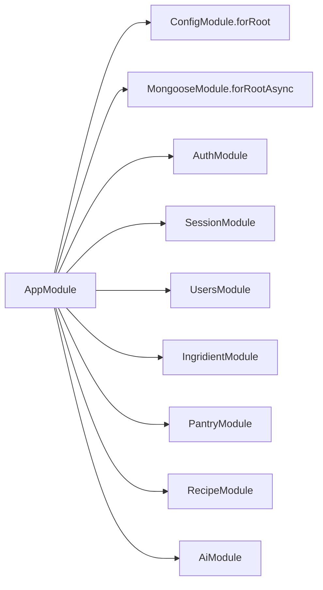

# Backend (NestJS API)

> PantryChef backend HTTP API server.

## Module Purpose

The backend is the HTTP API server for **PantryChef**, built with NestJS `^10.0.0` (Source: `backend/package.json:L26`). Its package identity is `blitzy-backend` version `0.0.1`, marked `private` and licensed `UNLICENSED`, which restricts redistribution (Source: `backend/package.json:L2-L7`). The root `AppModule` composes seven feature modules — auth, session, users, ingridient (spelling preserved verbatim throughout the backend codebase), pantry, recipe, and ai — alongside a global `ConfigModule` and an asynchronous `MongooseModule` (Source: `backend/src/app.module.ts:L18-L35`). The server exposes a versioned REST API under `/api/v1/*` and serves interactive OpenAPI/Swagger documentation at `/docs` (Source: `backend/src/main.ts:L14-L31`). Internal identifiers keep the verbatim `Ingridient` spelling, while the public URL path uses `/api/v1/ingredient`.

## Key Components

| File | Type | Responsibility |
| --- | --- | --- |
| `src/main.ts` | Bootstrap | Creates the Nest app, applies the global prefix `/api`, the global `ValidationPipe`, and the Swagger UI, then listens on the configured port (Source: `backend/src/main.ts:L10-L35`) |
| `src/app.module.ts` | Root Module | Composes 7 feature modules + a global `ConfigModule` + an async `MongooseModule` (Source: `backend/src/app.module.ts:L18-L39`) |
| `src/app.controller.ts` | Root Controller | Single `GET /` endpoint returning `'Hello World!'` — boilerplate (Source: `backend/src/app.controller.ts:L1-L12`) |
| `src/app.service.ts` | Root Service | Returns the literal `'Hello World!'` from `getHello()` (Source: `backend/src/app.service.ts:L4-L7`) |
| `src/auth/` | Feature Module | Authentication, JWT/refresh, session coordination (see [`src/auth/README.md`](src/auth/README.md)) |
| `src/users/` | Feature Module | User CRUD with embedded `Preferences` (see [`src/users/README.md`](src/users/README.md)) |
| `src/pantry/` | Feature Module | User-scoped `PantryIngridient` (spelling preserved verbatim) CRUD (see [`src/pantry/README.md`](src/pantry/README.md)) |
| `src/ingridient/` | Feature Module | `Ingridient` (spelling preserved verbatim) catalogue + reference data (see [`src/ingridient/README.md`](src/ingridient/README.md)) |
| `src/recipe/` | Feature Module | Recipe CRUD + pantry-aware matching pipeline (see [`src/recipe/README.md`](src/recipe/README.md)) |
| `src/ai/` | Feature Module | Google Cloud Vision ingredient detection (see [`src/ai/README.md`](src/ai/README.md)) |
| `src/database/` | Infrastructure | MongoDB connection + seed runner (see [`src/database/README.md`](src/database/README.md)) |
| `src/config/` | Infrastructure | Typed configuration with environment-variable validation (see [`src/config/README.md`](src/config/README.md)) |
| `src/common/` | Shared Types | `Reference` type used across feature schemas (see [`src/common/README.md`](src/common/README.md)) |
| `src/session/` | Feature Module | Session lifecycle (no standalone README; covered in auth) |
| `src/utils/` | Shared Utilities | Validation options, response interceptors, helpers (no standalone README) |
| `package.json` | Manifest | Defines dependencies and scripts: `build`, `dev`, `start:prod`, `seed:run:document`, `lint`, `test` (Source: `backend/package.json:L8-L23`) |
| `Dockerfile` | Container Image | `node:20-alpine`, runs as the `node` user, executes `npm i && npm run dev` (Source: `backend/Dockerfile:L1-L13`) |
| `docker-compose.yml` | Local Stack | MongoDB + NestJS services with hardcoded MongoDB credentials (Source: `backend/docker-compose.yml:L1-L30`) |
| `env_example` | Env Template | 19 environment variables for app, database, file driver, and JWT secrets (Source: `backend/env_example:L1-L23`) |
| `nest-cli.json` | Nest CLI | Source root `src`, asset copying for `config/**/*` |
| `tsconfig.json` / `tsconfig.build.json` | TypeScript | ES2021 CommonJS output to `dist/`, decorator support |
| `.eslintrc.js` / `.prettierrc` | Code Style | TypeScript ESLint + Prettier (single quotes, trailing commas) |
| `.hygen.js` + `.hygen/` | Codegen | Hygen templates for scaffolding seed services |

## Architecture Fit

The NestJS root module wires together the seven feature modules plus a global `ConfigModule.forRoot({ isGlobal: true, load: [databaseConfig, authConfig, appConfig] })` and `MongooseModule.forRootAsync({ useClass: MongooseConfigService })` (Source: `backend/src/app.module.ts:L18-L35`). Each feature module follows a **controller → service → repository → MongoDB** layering: the repository contract is an abstract class in `infrastructure/<module>.repository.ts`, bound to a Mongoose-backed implementation under `infrastructure/document/repositories/*.repository.ts`. The bootstrap entrypoint enables CORS, applies the global prefix `/api` (excluding `/`), installs a global `ValidationPipe`, registers Bearer auth in the Swagger spec, and serves the Swagger UI at `/docs` (Source: `backend/src/main.ts:L10-L35`). For the system-wide request flow and the dedicated Recipe Matching Pipeline deep-dive, see [`../ARCHITECTURE.md`](../ARCHITECTURE.md); for the persistence collections and the embedded `Preferences` subdocument, see [`../DATA_MODEL.md`](../DATA_MODEL.md).

## Dependencies

### Internal

The root module imports the seven feature modules in this exact order (Source: `backend/src/app.module.ts:L28-L34`):

- `AuthModule` — JWT login/register/refresh with three Passport strategies (`jwt`, `jwt-refresh`, `anonymous`).
- `SessionModule` — session lifecycle persistence, referenced by auth refresh and logout.
- `UsersModule` — user CRUD with the embedded `Preferences` subdocument.
- `IngridientModule` (spelling preserved verbatim) — ingredient catalogue and reference data.
- `PantryModule` — user-scoped pantry items in the `PantryIngridient` collection (spelling preserved verbatim).
- `RecipeModule` — recipe CRUD plus the pantry-aware matching pipeline.
- `AiModule` — Google Cloud Vision integration for ingredient detection.

### External

Runtime dependencies, versions verbatim from `backend/package.json:L24-L45`:

| Package | Version | Purpose |
| --- | --- | --- |
| `@nestjs/common` | ^10.0.0 | Core decorators + module system |
| `@nestjs/core` | ^10.0.0 | NestFactory + DI container |
| `@nestjs/config` | ^3.3.0 | Configuration loader with env-var validation |
| `@nestjs/jwt` | ^10.2.0 | JWT signing/verification |
| `@nestjs/mongoose` | ^10.1.0 | Mongoose integration |
| `@nestjs/passport` | ^10.0.3 | Passport.js wrapper |
| `@nestjs/platform-express` | ^10.0.0 | Express HTTP adapter |
| `@nestjs/swagger` | ^8.0.1 | OpenAPI spec at `/docs` |
| `@google-cloud/vision` | ^4.3.2 | Image label detection |
| `bcryptjs` | ^2.4.3 | Password hashing |
| `class-transformer` | ^0.5.1 | DTO ↔ entity transformation |
| `class-validator` | ^0.14.1 | DTO validation |
| `mongoose` | ^8.8.0 | MongoDB ODM |
| `ms` | ^2.1.3 | JWT expiry parsing |
| `multer` | ^1.4.5-lts.1 | Multipart upload handling |
| `passport` | ^0.7.0 | Strategy base |
| `passport-anonymous` | ^1.0.1 | Anonymous strategy |
| `passport-jwt` | ^4.0.1 | JWT extraction strategy |
| `reflect-metadata` | ^0.2.0 | Decorator metadata reflection |
| `rxjs` | ^7.8.1 | Reactive primitives used by Nest interceptors |

### Development

Key dev dependencies from `backend/package.json:L46-L75`:

| Package | Version | Purpose |
| --- | --- | --- |
| `typescript` | ^5.1.3 | Compiler (Source: `backend/package.json:L74`) |
| `@nestjs/cli` | ^10.0.0 | `nest build`, `nest start` (Source: `backend/package.json:L47`) |
| `@nestjs/schematics` | ^10.0.0 | Scaffolding (Source: `backend/package.json:L48`) |
| `@nestjs/testing` | ^10.0.0 | Unit-test harness (Source: `backend/package.json:L49`) |
| `eslint` | ^8.0.0 | Linter (Source: `backend/package.json:L62`) |
| `@typescript-eslint/eslint-plugin` | ^8.0.0 | TypeScript lint rules (Source: `backend/package.json:L59`) |
| `@typescript-eslint/parser` | ^8.0.0 | TypeScript lint parser (Source: `backend/package.json:L60`) |
| `prettier` | ^3.0.0 | Formatter (Source: `backend/package.json:L67`) |
| `eslint-config-prettier` | ^9.0.0 | Disables conflicting lint rules (Source: `backend/package.json:L63`) |
| `eslint-plugin-prettier` | ^5.0.0 | Runs Prettier as a lint rule (Source: `backend/package.json:L64`) |
| `jest` | ^29.5.0 | Test runner (Source: `backend/package.json:L66`) |
| `ts-jest` | ^29.1.0 | TypeScript Jest transform (Source: `backend/package.json:L70`) |
| `ts-node` | ^10.9.1 | TS runtime for the seed runner (Source: `backend/package.json:L72`) |
| `tsconfig-paths` | ^4.2.0 | Path-alias resolution (Source: `backend/package.json:L73`) |
| `hygen` | ^6.2.11 | Codegen for new seed services (Source: `backend/package.json:L65`) |
| `supertest` | ^7.0.0 | E2E HTTP assertions (Source: `backend/package.json:L69`) |
| `env-cmd` | ^10.1.0 | Loads env vars for E2E tests (Source: `backend/package.json:L61`) |

## Primary Use Cases

- **NestJS bootstrap** — `bootstrap()` initializes the app, applies global validation, and starts the HTTP listener (Source: `backend/src/main.ts:L10-L35`).
- **Modular feature composition** — the root `AppModule` aggregates seven feature modules via NestJS dependency injection (Source: `backend/src/app.module.ts:L28-L34`).
- **OpenAPI/Swagger surface** — the Swagger UI is mounted at `/docs` for interactive API exploration (Source: `backend/src/main.ts:L23-L31`).
- **Global API versioning** — `setGlobalPrefix('api', { exclude: ['/'] })` mounts every feature controller under `/api/v1/<feature>`, with `version: '1'` set per `@Controller` (Source: `backend/src/main.ts:L14-L19`).
- **Containerized dev stack** — `docker-compose up` brings up MongoDB and NestJS together with bind-mounted source for live reload (Source: `backend/docker-compose.yml:L1-L30`).
- **Seed runner** — `npm run seed:run:document` orchestrates User → Ingridient → Recipe → Pantry seeding (Source: `backend/package.json:L16`).

## API / Endpoint Reference

Only root-level and cross-cutting endpoints are listed here; per-feature endpoints live in each module's README.

| Method | Path | Guard | Description |
| --- | --- | --- | --- |
| `GET` | `/` | None | Returns the literal `'Hello World!'` from `AppService.getHello()` — boilerplate, retained as-is (Source: `backend/src/app.controller.ts:L8-L11`) |
| `GET` | `/docs` | None | Swagger UI mounted by `SwaggerModule.setup('docs', app, document)` (Source: `backend/src/main.ts:L31`) |
| `GET` | `/docs-json` | None | OpenAPI JSON spec (Nest Swagger default) |
| (other) | `/api/v1/<feature>/*` | varies | See each feature module's README under `src/<feature>/README.md` |

**Note:** the global prefix is `/api` (the default value of `API_PREFIX`) with the version suffix `/v1` set per controller (for example, `@Controller({ path: 'auth', version: '1' })`). The table assumes this prefix on every feature endpoint.

## Data Flows

The composition diagram below shows how the seven feature modules and the two global infrastructure modules are wired into the root `AppModule` at bootstrap. The arrangement is read directly from the `imports` array of the root module (Source: `backend/src/app.module.ts:L18-L35`).



At startup, `bootstrap()` instantiates `AppModule`, applies the global prefix and the `ValidationPipe`, and exposes the Swagger UI at `/docs` (Source: `backend/src/main.ts:L10-L35`). For the full end-to-end request path — Flutter UI → DioClient → bearer JWT → NestJS → feature controller → MongoDB or Google Cloud Vision — see [`../ARCHITECTURE.md`](../ARCHITECTURE.md).

## Configuration

The backend reads its configuration from a `.env` file (created from `env_example`), validated at boot by `EnvironmentVariablesValidator` via `@nestjs/config`. The typed `AllConfigType` aggregate provides namespaced access to `app.*`, `auth.*`, and `database.*` settings.

### Initial Setup

```bash
$ cp env_example .env
```

```bash
$ npm run seed:run:document
```

```bash
$ docker-compose up
```

### Google Cloud Vision Setup

- Enable Cloud Vision in your Google Cloud project.
- Create a key file for the service account.
- Rename it to `ai.json` and copy it to `src/config/`; the `AiService` loads it at boot and gracefully disables Vision if the file is missing (Source: `backend/src/ai/ai.service.ts:L52-L56`).

### Environment Variables

| Variable | Default | Source | Affected Module |
| --- | --- | --- | --- |
| `NODE_ENV` | `development` | `env_example:L1` | Bootstrap |
| `APP_PORT` | `3000` | `env_example:L2` | Bootstrap (`main.ts:L33`) |
| `APP_NAME` | `"NestJS API"` | `env_example:L3` | Swagger title |
| `API_PREFIX` | `api` | `env_example:L4` | Global prefix (`main.ts:L14-L19`) |
| `DATABASE_TYPE` | `mongodb` | `env_example:L6` | Database |
| `DATABASE_PORT` | `27017` | `env_example:L7` | Database |
| `DATABASE_USERNAME` | `admin` | `env_example:L8` | Database |
| `DATABASE_PASSWORD` | `123456` | `env_example:L9` | Database |
| `DATABASE_NAME` | `blitzy` | `env_example:L10` | Database |
| `DATABASE_URL` | `mongodb://localhost:27017` | `env_example:L11` | Database |
| `FILE_DRIVER` | `local` | `env_example:L14` | File storage (S3 driver NOT implemented; `s3`/`s3-presigned` are placeholders) |
| `ACCESS_KEY_ID` / `SECRET_ACCESS_KEY` / `AWS_S3_REGION` / `AWS_DEFAULT_S3_BUCKET` | empty | `env_example:L15-L18` | Placeholders for a future S3 driver |
| `AUTH_JWT_SECRET` | `secret` | `env_example:L20` | Auth |
| `AUTH_JWT_TOKEN_EXPIRES_IN` | `15m` | `env_example:L21` | Auth (access token TTL) |
| `AUTH_REFRESH_SECRET` | `secret_for_refresh` | `env_example:L22` | Auth |
| `AUTH_REFRESH_TOKEN_EXPIRES_IN` | `3650d` | `env_example:L23` | Auth (refresh token TTL — see Known Limitations) |

### Useful npm Scripts

Scripts are defined in `backend/package.json:L8-L23`:

| Script | Command | Purpose |
| --- | --- | --- |
| `npm run build` | `nest build` | Compile TypeScript to `dist/` |
| `npm run dev` | `nest start --watch` | Watch-mode local dev |
| `npm run start:prod` | `node dist/main` | Production launch (requires a prior `build`) |
| `npm run seed:run:document` | `ts-node -r tsconfig-paths/register ./src/database/seeds/run-seed.ts` | Seed the database (User → Ingridient → Recipe → Pantry) |
| `npm run lint` | `eslint "{src,apps,libs,test}/**/*.ts" --fix` | Lint and auto-fix |
| `npm run test` / `test:e2e` | `jest` / `env-cmd jest --config ./test/jest-e2e.json` | Unit and E2E tests |
| `npm run format` | `prettier --write "src/**/*.ts" "test/**/*.ts"` | Format TypeScript source |
| `npm run seed:create:document` | `hygen seeds create-document` | Scaffold a new seed service via Hygen |

## Known Limitations and Implementation Gaps

> ⚠️ **Dev-grade Docker setup** — the container `CMD npm i && npm run dev` installs dependencies on every start and runs the watch-mode dev server, which is unsuitable for production (slow startup, large image, no compiled output). A multi-stage Dockerfile that runs `nest build` then `node dist/main` is required (Source: `backend/Dockerfile:L13`).

> ⚠️ **Hardcoded MongoDB credentials** — `docker-compose.yml` ships `MONGO_INITDB_ROOT_USERNAME: admin` and `MONGO_INITDB_ROOT_PASSWORD: 123456` in plain text; these are also the defaults in `env_example`. They must move to a secrets manager before deployment (Source: `backend/docker-compose.yml:L9-L10`; `backend/env_example:L8-L9`).

> ⚠️ **Open CORS by default** — the Nest app is created with `{ cors: true }`, allowing any origin; production requires an explicit allowlist (Source: `backend/src/main.ts:L11`).

> ⚠️ **Refresh token TTL is ~10 years** — `AUTH_REFRESH_TOKEN_EXPIRES_IN=3650d` is far longer than a sensible production window (e.g., 30 days with rotation). See [`src/auth/README.md`](src/auth/README.md) for the full token flow (Source: `backend/env_example:L23`).

> ⚠️ **Spelling preserved verbatim** — the module path `backend/src/ingridient/` and the identifiers `IngridientModule`, `IngridientService`, `IngridientSchemaClass`, `PantryIngridient`, and `IngridientList` keep their spelling preserved verbatim throughout the backend codebase. The URL path `/api/v1/ingredient` uses the conventional spelling; the internal identifiers are stable API contracts and must not be "fixed".

## Production Readiness Status

> 🚧 See [`../PRODUCTION_READINESS.md`](../PRODUCTION_READINESS.md) for the complete checklist with status (❌/⚠️/✅) across eleven categories: Build & Runtime, Secrets Management, Networking & TLS, Infrastructure & Orchestration, File Storage, Security Hardening, Observability, CI/CD, Database, Testing, and Mobile Release.

> 🚧 **Build & Runtime** — replace the dev-grade Dockerfile with a multi-stage build that runs `nest build` and launches `node dist/main`, removing `npm i && npm run dev` from the container `CMD` (Source: `backend/Dockerfile:L13`).

> 🚧 **Secrets Management** — extract `AUTH_JWT_SECRET`, `AUTH_REFRESH_SECRET`, the MongoDB credentials, and the Google Cloud Vision service-account file (loaded from `src/config/ai.json`) into a secrets manager such as AWS Secrets Manager, HashiCorp Vault, or Kubernetes Secrets (Source: `backend/env_example:L20-L22`; `backend/src/ai/ai.service.ts:L52-L56`).

> 🚧 **Database** — gate `npm run seed:run:document` behind an explicit flag; each seed service calls `dropCollection()` before inserting fixtures (Source: `backend/package.json:L16`; see [`src/database/README.md`](src/database/README.md)).

> 🚧 **Security Hardening** — wire the password-reset endpoints (the `AuthForgotPasswordDto` and `AuthResetPasswordDto` exist but no controller routes are mapped), add a JWT guard to `POST /api/v1/ai/vision`, and uncomment the MIME-type filter in `src/ai/ai.controller.ts` (Source: `backend/src/ai/ai.controller.ts:L20-L28`).
