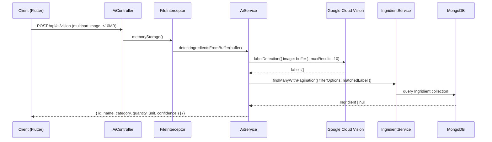

# AI Module

## Module Purpose

The `ai/` directory is a lightweight NestJS feature module that delegates image-based ingredient recognition to a single `AiService`, which integrates Google Cloud Vision label detection with a small hardcoded ingredient dictionary. Its only endpoint, `POST /api/ai/vision`, accepts a multipart image upload and returns the first ingredient match — resolved from the Vision API labels against the MongoDB `Ingridient` (spelling preserved verbatim) collection through `IngridientService.findManyWithPagination` (spelling preserved verbatim). The module is intentionally minimal: a single controller, a single service, and a single module declaration totaling roughly 183 lines of TypeScript. The implementation also prioritizes graceful degradation: if the Google Cloud Vision credentials file at `backend/src/config/ai.json` is missing, the service logs a warning and returns `{}` from every call without throwing.

## Key Components

| Component | File | Responsibility |
| --- | --- | --- |
| `AiController` | `ai.controller.ts:L12-L43` | Single `POST /vision` route with `FileInterceptor` (memoryStorage, 10MB). **No JWT guard, no version prefix.** |
| `AiService` | `ai.service.ts:L7-L128` | Loads GCV credentials from `../config/ai.json`, performs `LABEL_DETECTION` (maxResults: 10), matches labels against the hardcoded dictionary (~36 terms), calls `IngridientService.findManyWithPagination` (spelling preserved verbatim) to resolve to a domain `Ingridient`. |
| `AiModule` | `ai.module.ts` | Imports `IngridientModule` (spelling preserved verbatim). Providers `[AiService]`. Controllers `[AiController]`. |

## Architecture Fit

The AI module is a thin controller that delegates to `AiService`, which in turn fans out to the Google Cloud Vision external API and to `IngridientService.findManyWithPagination` exposed by `IngridientModule` (Ingridient spelling preserved verbatim throughout the backend codebase). This is a deliberate departure from the typical controller → service → abstract repository → document repository pattern used by the other feature modules (auth, users, pantry, ingridient, recipe), because the AI module has no persistence of its own; it owns no schema, DTO, or domain entity and consumes the ingredient repository only indirectly through another module's service.

See [`../../../ARCHITECTURE.md`](../../../ARCHITECTURE.md) § Full Request Path for the end-to-end client → controller → service → external-API trace, and § Cross-Cutting Concerns for the (currently absent) JWT authentication contract that this controller bypasses.

## Dependencies

### Internal

- `IngridientModule` (spelling preserved verbatim) — re-exports `IngridientService`, enabling `AiService` to call `findManyWithPagination` to resolve detected labels to MongoDB-backed `Ingridient` records. Source: `ai.module.ts:L4,L7`.

### External

| Package | Version | Used For |
| --- | --- | --- |
| `@nestjs/common` | ^10.0.0 | `@Injectable`, `@Controller`, `@Post`, `@UploadedFile`, `@UseInterceptors`, `BadRequestException` |
| `@nestjs/platform-express` | ^10.0.0 | `FileInterceptor` for multipart image upload |
| `@google-cloud/vision` | ^4.3.2 | `ImageAnnotatorClient` for `LABEL_DETECTION` |
| `multer` | ^1.4.5-lts.1 | `memoryStorage()` upload storage strategy |

## Primary Use Cases

- A user uploads an image of a pantry item from the mobile camera screen (mobile `IngredientAddBloc` → `ai_api.dart` → `POST /api/ai/vision`).
- Google Cloud Vision returns up to 10 labels via `LABEL_DETECTION` (`maxResults: 10`, Source: `ai.service.ts:L75-L76`).
- The first label whose lowercased description matches an entry in the hardcoded ingredient dictionary (~36 terms, Source: `ai.service.ts:L11-L49`) is selected as `recognizedIngridient` (spelling preserved verbatim, Source: `ai.service.ts:L89`).
- `IngridientService.findManyWithPagination` is invoked with the matched label as the filter, `page: 1, limit: 1` (Source: `ai.service.ts:L106-L113`) to resolve to a single MongoDB `Ingridient` record.
- The resolved `Ingridient` — `{ id, name, category, quantity, unit, confidence }` — is returned to the client for confirmation; if no label matched or the lookup returned nothing, an empty object `{}` is returned (Source: `ai.service.ts:L114-L124`).

## API / Endpoint Reference

> The global API prefix is `/api` (Source: `backend/env_example:L4`). The controller declares `@Controller('ai')` with NO `version` parameter (Source: `ai.controller.ts:L12`), so the route lives at **`/api/ai/vision`** — **NOT** `/api/v1/ai/vision`.

| Method | Path | Guard | Description |
| --- | --- | --- | --- |
| POST | `/api/ai/vision` | **NONE — UNGUARDED** | Multipart image upload (form field `image`, ≤10MB), returns one recognized `Ingridient` (spelling preserved verbatim) or `{}`. Source: `ai.controller.ts:L12-L43`. |

## Data Flows

> The diagram below traces a single `POST /api/ai/vision` request end-to-end, from the Flutter client through the unguarded controller, the in-memory file buffer, Google Cloud Vision's label detection, and the `IngridientService.findManyWithPagination` lookup back to the client.

> If GCV credentials are absent (`backend/src/config/ai.json` missing) or no label matches the dictionary, the service returns `{}` (Source: `ai.service.ts:L64-L67,L84-L86,L114-L124`) without throwing — a graceful-degradation contract documented in § Configuration.

## Configuration

- **GCV credentials**: loaded from `backend/src/config/ai.json` at `AiService` constructor (Source: `ai.service.ts:L52-L56`). If the file is missing, the service sets `isGoogleVisionEnabled = false`, logs an error, and `detectIngredientsFromBuffer` returns `{}` on every call.
- **File upload limit**: `fileSize: 10 * 1024 * 1024` bytes (10 MB) hardcoded in the `FileInterceptor` config (Source: `ai.controller.ts:L29`).
- **Upload field name**: `image` (the multipart form field that `FileInterceptor('image', …)` reads; Source: `ai.controller.ts:L18`).
- **Vision API call**: type `LABEL_DETECTION`, `maxResults: 10` (Source: `ai.service.ts:L74-L77`).
- **No `.env` variables specific to this module.** Inherits the global API prefix from `API_PREFIX` (default `api`, see `backend/env_example:L4`) and global database config from `DATABASE_URL` via the transitive `IngridientModule` dependency.

## Known Limitations and Implementation Gaps

> The AI module ships with several documented gaps. The first three are flagged inline in source with `// TODO(prod):` annotations; the spelling preservations are flagged with `// NOTE:`.

> ⚠️ **No JWT guard on `POST /api/ai/vision`** — Source: `ai.controller.ts:L12-L43`. The class has no `@UseGuards(AuthGuard('jwt'))` decorator. Anonymous clients can upload 10MB images at unlimited rate. Flagged inline with `// TODO(prod): No JWT guard. Add @UseGuards(AuthGuard('jwt')) before production deployment.`

> ⚠️ **MIME-type filter is commented out** — Source: `ai.controller.ts:L20-L28`. The `fileFilter` block restricting uploads to `image/jpeg`, `image/jpg`, and `image/png` is present but commented out. The endpoint will accept arbitrary binary content of up to 10MB. Flagged inline with `// TODO(prod): MIME-type filter commented out. Uncomment to enforce image/jpeg and image/png before production.`

> ⚠️ **Hardcoded ingredient dictionary** — Source: `ai.service.ts:L11-L49`. The `ingredientDictionary` array contains ~36 hardcoded English-language ingredient terms. There is no fuzzy matching, multi-word synonyms, multi-language support, or database-backed resolution. Adding a new term requires a code deployment. Flagged inline with `// TODO(prod): Hardcoded ingredient dictionary (~36 terms). Replace with database-backed lookup before production.`

> ⚠️ **Vision API credentials in source tree** — Source: `ai.service.ts:L52-L56`. GCV credentials are loaded from `backend/src/config/ai.json` (in the source tree), not from environment variables or a secrets manager. The service falls back gracefully if the file is missing but the path is not gated for production deployment.

> ⚠️ **Property name typo `ingirdientService`** — Source: `ai.service.ts:L51`. The injected `IngridientService` is stored on a constructor parameter property named `ingirdientService` (i-n-g-**i-r**-d) — an additional typo *distinct* from the `Ingridient` (i-n-g-**r-i**-d) class spelling that is preserved across the backend. Flagged inline with `// NOTE: Property name 'ingirdientService' is an additional preserved typo (distinct from 'Ingridient'). Do not rename.`

## Production Readiness Status

> Each gap above maps to one or more categories in [`../../../PRODUCTION_READINESS.md`](../../../PRODUCTION_READINESS.md). The most security-relevant blocker is the absent JWT guard combined with the 10MB upload limit on an anonymous endpoint.

> 🚧 **Security Hardening** — Add `@UseGuards(AuthGuard('jwt'))` to `AiController` (Source: `ai.controller.ts:L12`). See [`../../../PRODUCTION_READINESS.md`](../../../PRODUCTION_READINESS.md) § Security Hardening.

> 🚧 **Security Hardening** — Uncomment the `fileFilter` block (Source: `ai.controller.ts:L20-L28`) to enforce MIME-type validation on uploads.

> 🚧 **Coverage** — Replace the hardcoded ingredient dictionary (Source: `ai.service.ts:L11-L49`) with a database-backed lookup or a proper labels-to-ingredients ontology, ideally one that supports synonyms, fuzzy matching, and multi-language descriptions.

> 🚧 **Secrets Management** — Move GCV credentials out of `backend/src/config/ai.json` and into a secrets manager (AWS Secrets Manager, HashiCorp Vault, etc.). Pass the JSON via runtime env or `GOOGLE_APPLICATION_CREDENTIALS`. See [`../../../PRODUCTION_READINESS.md`](../../../PRODUCTION_READINESS.md) § Secrets Management.

> 🚧 **Rate Limiting** — Gate `POST /api/ai/vision` with `@nestjs/throttler` to mitigate abuse (10MB uploads from anonymous clients are a denial-of-service vector even after a JWT guard is added).

> See [`../../../PRODUCTION_READINESS.md`](../../../PRODUCTION_READINESS.md) for the full gap inventory and [`../../../ARCHITECTURE.md`](../../../ARCHITECTURE.md) § Full Request Path for cross-module context. The `Ingridient` schema referenced throughout this README is documented in [`../../../DATA_MODEL.md`](../../../DATA_MODEL.md) § Ingridient.
