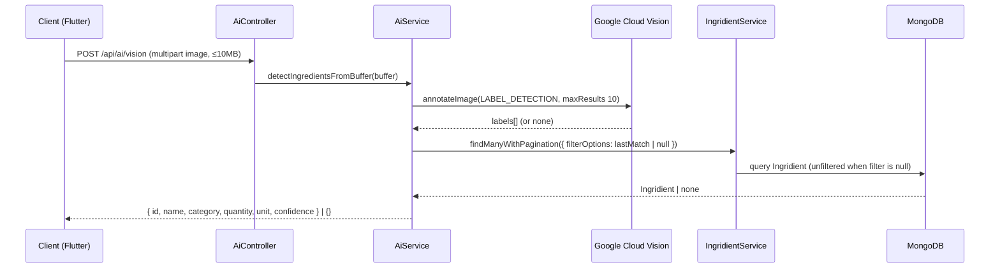

# AI Module

## Module Purpose

The `ai/` directory is a minimal NestJS feature module that delegates image-based ingredient recognition to a single `AiService`, pairing Google Cloud Vision label detection with a small hardcoded dictionary. Its one endpoint, `POST /api/ai/vision`, accepts a multipart image upload and returns a plain object describing one resolved `Ingridient` (spelling preserved verbatim across the backend codebase) from the MongoDB `Ingridient` collection via `IngridientService.findManyWithPagination`. When the credentials file `backend/src/config/ai.json` is missing, the service logs an error, disables Vision, and returns `{}` from every call instead of throwing.

## Key Components

| Component | File | Responsibility |
| --- | --- | --- |
| `AiController` | `ai.controller.ts` | Single `POST /vision` route with `FileInterceptor` (memoryStorage, 10MB). **No JWT guard, no version prefix.** |
| `AiService` | `ai.service.ts` | Loads GCV credentials from `../config/ai.json`, runs `LABEL_DETECTION` (`maxResults: 10`), matches labels against the hardcoded dictionary (~36 terms), then calls `IngridientService.findManyWithPagination` to resolve a domain `Ingridient`. |
| `AiModule` | `ai.module.ts` | Imports `IngridientModule` (spelling preserved verbatim). Providers `[AiService]`; controllers `[AiController]`. |

## Architecture Fit

The AI module is a thin controller delegating to `AiService`, which fans out to Google Cloud Vision and to `IngridientService` from `IngridientModule`. It departs from the controller → service → abstract repository → document repository pattern of the other modules: it owns no schema, DTO, or domain entity, reaching persistence only through another module's service.

See [`../../../ARCHITECTURE.md`](../../../ARCHITECTURE.md) § Full Request Path for the end-to-end trace and § Cross-Cutting Concerns for the (currently absent) JWT contract this controller bypasses.

## Dependencies

### Internal

- `IngridientModule` (spelling preserved verbatim) — re-exports `IngridientService`, letting `AiService` call `findManyWithPagination` to resolve detected labels to MongoDB-backed `Ingridient` records.

### External

| Package | Version | Used For |
| --- | --- | --- |
| `@nestjs/common` | ^10.0.0 | `@Injectable`, `@Controller`, `@Post`, `@UploadedFile`, `@UseInterceptors`, `BadRequestException` |
| `@nestjs/platform-express` | ^10.0.0 | `FileInterceptor` for multipart image upload |
| `@google-cloud/vision` | ^4.3.2 | `ImageAnnotatorClient` for `LABEL_DETECTION` |
| `multer` | ^1.4.5-lts.1 | `memoryStorage()` upload storage strategy |

## Primary Use Cases

- A user uploads a pantry-item photo from the mobile camera screen (`IngredientAddBloc` → `ai_api.dart` → `POST /api/ai/vision`).
- Google Cloud Vision returns up to 10 labels via `LABEL_DETECTION`.
- The service scans every label against the dictionary without breaking, so the **last** matching term (not the first) becomes `recognizedIngridient` (spelling preserved verbatim).
- `findManyWithPagination` resolves a single `Ingridient` from that term (`page: 1, limit: 1`).
- The resolved `{ id, name, category, quantity, unit, confidence }` is returned; `{}` comes back only when Vision is disabled, returns no labels, or the lookup finds no record.

## API / Endpoint Reference

> The global API prefix is `/api` (Source: `backend/env_example:L4`). The controller declares `@Controller('ai')` with NO `version` parameter, so the route lives at **`/api/ai/vision`** — **NOT** `/api/v1/ai/vision`.

| Method | Path | Guard | Description |
| --- | --- | --- | --- |
| POST | `/api/ai/vision` | **NONE — UNGUARDED** | Multipart image upload (form field `image`, ≤10MB); returns one resolved `Ingridient` (spelling preserved verbatim) object or `{}`. |

## Data Flows

> The diagram traces one `POST /api/ai/vision` request from the Flutter client through the unguarded controller, the in-memory buffer, Vision label detection, and the `IngridientService` lookup.

> When no label matches, the lookup is unfiltered and returns the **first non-deleted `Ingridient`** rather than `{}` — see Known Limitations.

## Configuration

- **GCV credentials**: loaded from `backend/src/config/ai.json` in the `AiService` constructor; if absent, `isGoogleVisionEnabled` becomes `false` and every call returns `{}`.
- **File upload limit**: `fileSize: 10 * 1024 * 1024` bytes (10 MB), hardcoded in the `FileInterceptor` config.
- **Upload field name**: `image` (the multipart form field read by `FileInterceptor('image', …)`).
- **Vision API call**: type `LABEL_DETECTION`, `maxResults: 10`.
- **No module-specific `.env` variables.** Inherits the global API prefix `API_PREFIX` (default `api`, `backend/env_example:L4`) and database config via the transitive `IngridientModule` dependency.

## Known Limitations and Implementation Gaps

> Inline tags: `// TODO(prod):` for the first three gaps, `// NOTE:` for preserved spellings, `// FIXME:` for the matching/lookup defects.

> ⚠️ **No JWT guard on `POST /api/ai/vision`** — no `@UseGuards(AuthGuard('jwt'))` decorator, so anonymous clients can upload 10MB images. Flagged inline `// TODO(prod):`.

> ⚠️ **MIME-type filter is commented out** — the `fileFilter` restricting uploads to `image/jpeg`/`image/png` is commented, so arbitrary binary up to 10MB is accepted. Flagged inline `// TODO(prod):`.

> ⚠️ **Hardcoded ingredient dictionary** — ~36 English terms with no fuzzy matching, synonyms, or multi-language support; adding a term requires a deploy. Flagged inline `// TODO(prod):`.

> ⚠️ **Last-match and null-filter resolution defect** — `detectIngredientsFromBuffer` scans all labels without breaking, so the last matching term wins, not the first. When nothing matches, the filter is `null` and the unfiltered lookup returns the first non-deleted `Ingridient` instead of `{}`. Both are flagged inline with `// FIXME:` (documented, not fixed).

> ⚠️ **Vision credentials in the source tree** — loaded from `backend/src/config/ai.json` rather than env or a secrets manager; the path is not production-gated.

> ⚠️ **Property name typo `ingirdientService`** — the injected `IngridientService` is stored on a property named `ingirdientService`, a typo distinct from the `Ingridient` class spelling. Flagged inline `// NOTE:`.

## Production Readiness Status

> Each gap maps to a category in [`../../../PRODUCTION_READINESS.md`](../../../PRODUCTION_READINESS.md); the top blocker is the absent JWT guard on an anonymous 10MB-upload endpoint.

> 🚧 **Security Hardening** — add `@UseGuards(AuthGuard('jwt'))` to `AiController`; uncomment the `fileFilter` block to enforce MIME validation. See [`../../../PRODUCTION_READINESS.md`](../../../PRODUCTION_READINESS.md) § Security Hardening.

> 🚧 **Correctness** — fix the last-match and null-filter defects so a no-match returns `{}` instead of an unrelated `Ingridient`.

> 🚧 **Coverage** — replace the hardcoded dictionary with a database-backed lookup or ontology supporting synonyms, fuzzy matching, and multi-language descriptions.

> 🚧 **Secrets Management** — move GCV credentials out of `backend/src/config/ai.json` into a secrets manager; pass them via runtime env or `GOOGLE_APPLICATION_CREDENTIALS`. See [`../../../PRODUCTION_READINESS.md`](../../../PRODUCTION_READINESS.md) § Secrets Management.

> 🚧 **Rate Limiting** — gate `POST /api/ai/vision` with `@nestjs/throttler`; 10MB uploads from anonymous clients are a DoS vector even after a guard is added.

> See [`../../../PRODUCTION_READINESS.md`](../../../PRODUCTION_READINESS.md) for the full gap inventory and [`../../../DATA_MODEL.md`](../../../DATA_MODEL.md) § Ingridient for the schema.
