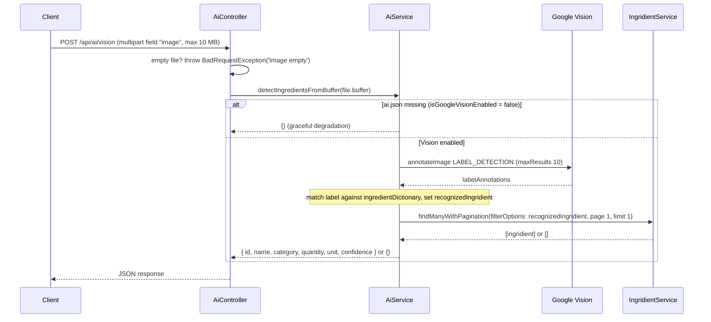

# AI Module (`ai/`)

## Purpose

The `ai/` module provides **image-to-ingredient recognition** for the PantryChef
backend. It accepts an uploaded photo, runs Google Cloud Vision `LABEL_DETECTION`,
maps a recognized label to a known ingredient through an internal dictionary, and
returns that ingredient record. Source: backend/src/ai/ai.service.ts:L63-L126

At a glance, the feature is a single NestJS module (`AiModule`) composed of one
controller and one service. It depends on the backend `ingridient/` (misspelled in
the source tree — preserved verbatim) module to resolve recognized labels into
persisted ingredient records. Source: backend/src/ai/ai.module.ts:L7

## Key components

- `AiModule` (`ai.module.ts`) — the feature composition root. It declares
  `imports: [IngridientModule]`, so the AI feature depends on the Ingridient module
  for ingredient lookups. Source: backend/src/ai/ai.module.ts:L7
- `AiController` (`ai.controller.ts`) — a single-route REST controller that exposes
  the vision endpoint and handles the multipart upload.
  Source: backend/src/ai/ai.controller.ts:L12-L16
- `AiService` (`ai.service.ts`) — holds the `ImageAnnotatorClient`, the
  `isGoogleVisionEnabled` flag, and an internal `ingredientDictionary` (~36 entries)
  used for label matching. Source: backend/src/ai/ai.service.ts:L9-L49

## Architecture fit

The module follows the standard NestJS layering: controller → service → (external
Google Vision API + the Ingridient module). It plugs into the wider system at two
points:

- `AiModule` is wired into the root `AppModule`. Source: backend/src/app.module.ts:L34
- `AiService` delegates ingredient resolution to
  `IngridientService.findManyWithPagination`, passing the recognized label as
  `filterOptions` with `page: 1, limit: 1`.
  Source: backend/src/ai/ai.service.ts:L106-L113

For the system-wide picture see [docs/ARCHITECTURE.md](../../../docs/ARCHITECTURE.md),
and for the dependency that resolves labels to persisted records see the
[Ingridient module README](../ingridient/README.md).

## Data models

This module **owns no schema and no persisted entity**. The endpoint returns a plain
object assembled from the matched ingredient, or an **empty object `{}`** when nothing
matches. Source: backend/src/ai/ai.service.ts:L114-L126

The returned shape is derived from the matched `Ingridient` record (resolved through
the Ingridient module):

| Field        | Source                                            |
|--------------|---------------------------------------------------|
| `id`         | matched `ingridient.id`                           |
| `name`       | matched `ingridient.name`                         |
| `category`   | matched `ingridient.category`                     |
| `quantity`   | matched `ingridient.quantity`                     |
| `unit`       | matched `ingridient.unit`                         |
| `confidence` | matched `ingridient.confidence`                   |

Source: backend/src/ai/ai.service.ts:L114-L126

For the full ingredient/persistence model, defer to
[docs/DATA_MODELS.md](../../../docs/DATA_MODELS.md) and the
[Ingridient module README](../ingridient/README.md).

## API endpoints / public interface

- `POST ai/vision` — served under the global `api` prefix as **`POST /api/ai/vision`**.
  There is **no API-version segment** because `@Controller('ai')` declares no version
  (the route is not served under a versioned path).
  Source: backend/src/ai/ai.controller.ts:L12,L16; prefix
  Source: backend/src/main.ts:L14-L15
- The request is a multipart upload whose file field is named **`image`**, handled by
  `FileInterceptor` with `memoryStorage()` and a **10 MB** size limit
  (`10 * 1024 * 1024`). Source: backend/src/ai/ai.controller.ts:L16-L31 (limit at L29)
- When no file is provided, the handler throws
  `BadRequestException('Image empty')`. Source: backend/src/ai/ai.controller.ts:L33-L34
- The response is the matched ingredient object or `{}` (see **Data models** above).

For the full request/response reference, defer to
[docs/API_REFERENCE.md](../../../docs/API_REFERENCE.md).

## Configuration

- Recognition requires a Google Cloud Vision **service-account key at
  `src/config/ai.json`**, resolved at construction time via
  `path.join(__dirname, '../config/ai.json')`.
  Source: backend/src/ai/ai.service.ts:L52
- When that key file is absent, `isGoogleVisionEnabled` is set to `false`, which
  disables Vision calls (graceful degradation — see **Known limitations / gaps**).
  Source: backend/src/ai/ai.service.ts:L53-L56

For the full Vision provisioning workflow, see
[docs/DEPLOYMENT.md](../../../docs/DEPLOYMENT.md).

## Data flow

A request enters through the controller's multipart upload, is forwarded as a raw
buffer to the service, runs through Google Vision label detection, is matched against
the internal dictionary, and is finally resolved to a persisted ingredient via the
Ingridient module. If Vision is disabled or nothing matches, the service short-circuits
to an empty object.

Flow caption — Source: backend/src/ai/ai.service.ts:L63-L126 and
Source: backend/src/ai/ai.controller.ts:L32-L42

## Design patterns used

- **Interceptor-based file upload** — uploads are handled declaratively with
  `FileInterceptor('image', { storage: memoryStorage(), limits })`.
  Source: backend/src/ai/ai.controller.ts:L17-L31
- **Graceful degradation** — a missing `ai.json` disables Vision and short-circuits
  the pipeline to `{}` instead of failing the request.
  Source: backend/src/ai/ai.service.ts:L64-L67
- **Dependency injection** — `AiService` injects `IngridientService` through its
  constructor (note the misspelled parameter `ingirdientService`).
  Source: backend/src/ai/ai.service.ts:L51
- **Internal lookup dictionary** — recognized labels are matched against the
  hardcoded `ingredientDictionary` to derive `recognizedIngridient`.
  Source: backend/src/ai/ai.service.ts:L11-L49,L88-L104

## Known limitations / gaps

The following behaviors are documented verbatim from the current code. They are
recorded here as-is and are **not** changed by this documentation.

- **SECURITY NOTE:** `POST /api/ai/vision` has **no JWT guard** — it is
  unauthenticated, unlike every other resource controller (which apply
  `@UseGuards(AuthGuard('jwt'))`). Source: backend/src/ai/ai.controller.ts:L12-L16
- **KNOWN ISSUE:** the MIME-type `fileFilter` is **commented out**, so non-image
  uploads are not rejected at the interceptor.
  Source: backend/src/ai/ai.controller.ts:L20-L28
- **Graceful degradation (by design):** when `ai.json` is missing,
  `detectIngredientsFromBuffer` returns `{}` and the endpoint still responds with a
  2xx status (recognition is simply disabled).
  Source: backend/src/ai/ai.service.ts:L64-L67
- **Hardcoded dictionary:** matching relies on an internal `ingredientDictionary` of
  ~36 terms, so labels outside that list never match.
  Source: backend/src/ai/ai.service.ts:L11-L49

## Local development

- Providing `ai.json` is **optional**. Without it, AI recognition is disabled but the
  rest of the stack still runs (graceful degradation).
  Source: backend/src/ai/ai.service.ts:L53-L56
- To enable recognition, place the Google Cloud Vision service-account key at
  `src/config/ai.json`. See the [backend root README](../../README.md) for base
  project setup and [docs/DEPLOYMENT.md](../../../docs/DEPLOYMENT.md) for the full
  Vision + Docker workflow.
- The endpoint is visible in the Swagger UI served at `/docs`.
  Source: backend/src/main.ts:L31
