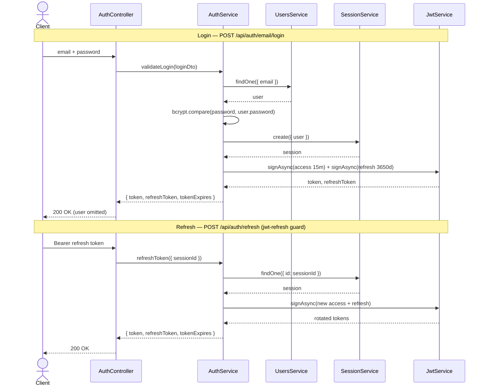

# Auth Module (`backend/src/auth`)

The auth module is the authentication boundary of the PantryChef NestJS
backend. It owns the HTTP routes, Passport strategies, token issuance, and
configuration that protect every other resource controller in the service.

## Purpose

The auth module implements **JWT-based authentication** for the backend. It
exposes user **registration**, **login**, **profile read/update**, **token
refresh** (with session rotation), and **logout**. In practice it is the entry
point that issues and rotates the access and refresh tokens that every other
protected controller relies on, validating credentials and minting the bearer
tokens that downstream guards check.
Source: backend/src/auth/auth.controller.ts:L23-L27

The orchestration of credential checks, session creation, and token signing is
centralized in `AuthService`, which the controller delegates to for all of its
behavior.
Source: backend/src/auth/auth.service.ts:L24-L31

## Key components

The module is organized as a thin HTTP adapter (`AuthController`) over an
application service (`AuthService`), with three Passport strategies, a set of
strongly typed payload/response contracts, request DTOs, and namespaced
configuration.

| Component | File | Responsibility |
|---|---|---|
| `AuthController` | `auth.controller.ts` | HTTP adapter annotated `@ApiTags('Auth')` and `@Controller({ path: 'auth', version: '1' })`; maps routes to `AuthService`. Source: backend/src/auth/auth.controller.ts:L23-L27 |
| `AuthService` | `auth.service.ts` | Credential validation via bcryptjs `compare`, token issuance, refresh, logout, and profile update/delete. Source: backend/src/auth/auth.service.ts:L24-L31 (bcrypt compares at Source: backend/src/auth/auth.service.ts:L64 and Source: backend/src/auth/auth.service.ts:L188) |
| `JwtStrategy` | `strategies/jwt.strategy.ts` | Passport strategy named `'jwt'` guarding access tokens; `validate` rejects payloads without `id`. Source: backend/src/auth/strategies/jwt.strategy.ts:L10-L24 |
| `JwtRefreshStrategy` | `strategies/jwt-refresh.strategy.ts` | Passport strategy named `'jwt-refresh'` guarding refresh tokens; `validate` rejects payloads without `sessionId`. Source: backend/src/auth/strategies/jwt-refresh.strategy.ts:L10-L29 |
| `AnonymousStrategy` | `strategies/anonymous.strategy.ts` | `passport-anonymous` pass-through for optional/unauthenticated access. Source: backend/src/auth/strategies/anonymous.strategy.ts:L6-L13 |
| Strategy payload types | `strategies/types/jwt-payload.type.ts`, `strategies/types/jwt-refresh-payload.type.ts` | Typed shapes for the decoded access and refresh JWT claims. Source: backend/src/auth/strategies/types/jwt-payload.type.ts:L4-L8, Source: backend/src/auth/strategies/types/jwt-refresh-payload.type.ts:L3-L7 |
| Config | `config/auth.config.ts`, `config/auth-config.type.ts` | Namespaced `registerAs('auth')` configuration plus its typed shape. Source: backend/src/auth/config/auth.config.ts:L20 |
| DTOs | `dto/` | Request validation models for login, register, and update. Source: backend/src/auth/auth.controller.ts:L15-L18 |
| `LoginResponseType` | `types/login-response.type.ts` | Token/response contract returned by the auth routes. Source: backend/src/auth/types/login-response.type.ts:L3-L8 |

**Note (factual):** only `AuthEmailLoginDto`, `AuthRegisterLoginDto`, and
`AuthUpdateDto` are wired to routes in this controller. The
`AuthConfirmEmailDto`, `AuthForgotPasswordDto`, and `AuthResetPasswordDto`
classes exist in `dto/` but are not referenced by `AuthController`.
Source: backend/src/auth/auth.controller.ts:L15-L18

## Architecture fit

`AuthModule` is wired into the root application module as the **first feature
import**, so it is composed ahead of the other resource modules.
Source: backend/src/app.module.ts:L28

The module imports `UsersModule` (account data) and `SessionModule`
(refresh-token sessions), enables `PassportModule`, and registers
`JwtModule.register({})` (empty options; signing options are supplied per call).
Source: backend/src/auth/auth.module.ts:L13-L19

Other resource controllers enforce authentication with
`@UseGuards(AuthGuard('jwt'))`, which is backed by this module's `JwtStrategy`.
Auth is therefore the shared dependency that makes the rest of the API
protectable. For the system-wide view of how modules compose, see
[`../../../docs/ARCHITECTURE.md`](../../../docs/ARCHITECTURE.md).

## Data models

This module **owns no Mongoose schema**. Instead, it produces the
response/token contracts that the routes and guards exchange:

- `LoginResponseType = Readonly<{ token; refreshToken; tokenExpires; user }>`.
  Source: backend/src/auth/types/login-response.type.ts:L3-L8
- **Important:** the login, register, and refresh routes return
  `Omit<LoginResponseType, 'user'>` — that is, tokens only, with no `user`
  object in the response body.
  Source: backend/src/auth/auth.controller.ts:L33-L45 and
  Source: backend/src/auth/auth.controller.ts:L59
- `JwtPayloadType = { id, sessionId, iat, exp }` — the decoded access-token
  claims. Source: backend/src/auth/strategies/types/jwt-payload.type.ts:L4-L8
- `JwtRefreshPayloadType = { sessionId, iat, exp }` — the decoded refresh-token
  claims.
  Source: backend/src/auth/strategies/types/jwt-refresh-payload.type.ts:L3-L7

For the persisted `User` and `Session` entities that these tokens reference,
see [`../../../docs/DATA_MODELS.md`](../../../docs/DATA_MODELS.md).

## API endpoints / public interface

All endpoints are served under the global `api` prefix as **`/api/auth/*`**
with **no `/v1/` segment**. Although `AuthController` declares `version: '1'`
in its decorator (Source: backend/src/auth/auth.controller.ts:L24-L27), the
bootstrap only calls `app.setGlobalPrefix(...)` and **never calls
`app.enableVersioning()`**, so NestJS does not insert a `/v1/` URI segment.
The canonical documented base is therefore `/api/auth`.
Source: backend/src/main.ts:L14-L15

Full request/response detail (bodies, validation messages, error payloads) is
catalogued in [`../../../docs/API_REFERENCE.md`](../../../docs/API_REFERENCE.md).

| Method & Path | Auth | Success | Source |
|---|---|---|---|
| `POST /api/auth/email/login` | public | 200 | Source: backend/src/auth/auth.controller.ts:L31-L37 |
| `POST /api/auth/email/register` | public | 200 | Source: backend/src/auth/auth.controller.ts:L39-L45 |
| `GET /api/auth/me` | Bearer `jwt` | 200 | Source: backend/src/auth/auth.controller.ts:L47-L53 |
| `POST /api/auth/refresh` | Bearer `jwt-refresh` | 200 (rotates tokens) | Source: backend/src/auth/auth.controller.ts:L55-L63 |
| `POST /api/auth/logout` | Bearer `jwt` | 204 | Source: backend/src/auth/auth.controller.ts:L65-L73 |
| `PATCH /api/auth/me` | Bearer `jwt` | 200 | Source: backend/src/auth/auth.controller.ts:L75-L84 |
| `DELETE /api/auth/me` | Bearer `jwt` | 204 (calls `service.softDelete`) | Source: backend/src/auth/auth.controller.ts:L86-L92 |

The guards in the table are backed by the module's Passport strategies. Each
strategy is identified by a name that the `AuthGuard(...)` call references:

| Passport name | Guard usage | Purpose | Source |
|---|---|---|---|
| `jwt` | `@UseGuards(AuthGuard('jwt'))` | Validates the access token on protected routes; rejects payloads without `id`. | Source: backend/src/auth/strategies/jwt.strategy.ts:L10-L24 |
| `jwt-refresh` | `@UseGuards(AuthGuard('jwt-refresh'))` | Validates the refresh token on `POST /api/auth/refresh`; rejects payloads without `sessionId`. | Source: backend/src/auth/strategies/jwt-refresh.strategy.ts:L10-L29 |
| `anonymous` | not applied by any guard in this controller | `passport-anonymous` pass-through for optional/unauthenticated access. | Source: backend/src/auth/strategies/anonymous.strategy.ts:L6-L13 |

## Configuration

Configuration is environment-driven through `registerAs('auth')` and is
validated at load time by an `EnvironmentVariablesValidator` that applies
`@IsString()` to each variable.
Source: backend/src/auth/config/auth.config.ts:L20-L28

| Env var | Config key | Meaning | Default |
|---|---|---|---|
| `AUTH_JWT_SECRET` | `auth.secret` | Access-token signing secret | `secret` |
| `AUTH_JWT_TOKEN_EXPIRES_IN` | `auth.expires` | Access-token TTL | `15m` |
| `AUTH_REFRESH_SECRET` | `auth.refreshSecret` | Refresh-token signing secret | `secret_for_refresh` |
| `AUTH_REFRESH_TOKEN_EXPIRES_IN` | `auth.refreshExpires` | Refresh-token TTL | `3650d` |

The environment-variable-to-config-key mapping is defined in the `registerAs`
factory. Source: backend/src/auth/config/auth.config.ts:L23-L28 The shipped
default values come from the example environment file.
Source: backend/env_example:L20-L23

The typed configuration shape is
`AuthConfig { secret?, expires?, refreshSecret?, refreshExpires? }`.
Source: backend/src/auth/config/auth-config.type.ts:L1-L6

The absolute access-token expiry timestamp is computed at issuance time with
the `ms()` helper applied to `auth.expires` (`Date.now() + ms(tokenExpiresIn)`).
Source: backend/src/auth/auth.service.ts:L257-L260

**SECURITY NOTE:** the shipped defaults `AUTH_JWT_SECRET=secret` and
`AUTH_REFRESH_SECRET=secret_for_refresh` are weak placeholder secrets and must
be replaced with strong values before any non-local deployment.
Source: backend/env_example:L20-L23 Full guidance is in
[`../../../docs/DEPLOYMENT.md`](../../../docs/DEPLOYMENT.md).

## Data flow

On **login**, `AuthController` forwards the credentials to
`AuthService.validateLogin`, which looks the user up by email through
`UsersService`, verifies the password with `bcrypt.compare`, creates a session
through `SessionService`, and then signs an access token and a refresh token in
parallel before returning the token bundle (with the `user` field omitted).
Source: backend/src/auth/auth.service.ts:L33-L95

On **refresh**, the `jwt-refresh` guard first validates the incoming refresh
token; `AuthService.refreshToken` then loads the session by `sessionId` and
mints a fresh access/refresh pair tied to the same session, rotating the
credentials.
Source: backend/src/auth/auth.service.ts:L220-L241



Diagram sources: login flow Source: backend/src/auth/auth.service.ts:L33-L95;
token signing and `ms()` expiry computation
Source: backend/src/auth/auth.service.ts:L253-L289; refresh flow
Source: backend/src/auth/auth.service.ts:L220-L241; the `jwt-refresh` guard on
the refresh route Source: backend/src/auth/auth.controller.ts:L55-L63. The
`JwtRefreshStrategy` guard validates the refresh token (rejecting payloads
without `sessionId`) before `refreshToken` runs.
Source: backend/src/auth/strategies/jwt-refresh.strategy.ts:L21-L29

## Design patterns used

- **Passport strategy pattern** — three strategies (`jwt`, `jwt-refresh`,
  `anonymous`) encapsulate the distinct authentication mechanisms.
  Source: backend/src/auth/strategies/jwt.strategy.ts:L10,
  Source: backend/src/auth/strategies/jwt-refresh.strategy.ts:L10-L13,
  Source: backend/src/auth/strategies/anonymous.strategy.ts:L6
- **JWT issuance via `@nestjs/jwt`** — `JwtModule.register({})` provides the
  `JwtService`, with signing options (secret, `expiresIn`) supplied per call.
  Source: backend/src/auth/auth.module.ts:L18,
  Source: backend/src/auth/auth.service.ts:L262-L282
- **Guard-based authorization** — routes opt into protection with
  `@UseGuards(AuthGuard('jwt' | 'jwt-refresh'))`.
  Source: backend/src/auth/auth.controller.ts:L49,L57,L67,L77,L88
- **Session-backed refresh rotation** — refresh issues a new token pair tied to
  the existing session rather than reusing the old credentials.
  Source: backend/src/auth/auth.service.ts:L220-L241
- **DTO validation** — request bodies are validated by `class-validator` /
  `class-transformer` decorated DTOs.
  Source: backend/src/auth/dto/auth-email-login.dto.ts:L6-L15
- **Namespaced config via `registerAs`** — auth settings are grouped under the
  `auth` namespace. Source: backend/src/auth/config/auth.config.ts:L20

## Known limitations / gaps

- **SECURITY NOTE:** the default JWT secrets are insecure placeholders
  (`AUTH_JWT_SECRET=secret`, `AUTH_REFRESH_SECRET=secret_for_refresh`) and are
  unsafe outside local development.
  Source: backend/env_example:L20,L22 See
  [`../../../docs/DEPLOYMENT.md`](../../../docs/DEPLOYMENT.md).
- **KNOWN ISSUE:** the refresh-token TTL is **3650d (~10 years)**, an unusually
  long-lived credential that widens the window of exposure if a refresh token
  leaks. Source: backend/env_example:L23
- **KNOWN ISSUE:** `DELETE /api/auth/me` delegates to `AuthService.softDelete`,
  which calls `UsersService.softDelete`; despite the `softDelete` name, the
  users repository **hard-deletes** the record (`deleteOne`).
  Source: backend/src/auth/auth.service.ts:L243-L245,
  Source: backend/src/auth/auth.controller.ts:L86-L92 The users hard-delete
  behavior is cross-referenced in
  [`../../../docs/DATA_MODELS.md`](../../../docs/DATA_MODELS.md).
- **KNOWN ISSUE:** `AnonymousStrategy` is registered as a provider but is not
  applied by any guard within this module's controller, so it has no effect on
  the auth routes as written.
  Source: backend/src/auth/auth.module.ts:L21,
  Source: backend/src/auth/auth.controller.ts:L47-L92

## Local development

The auth routes are exercised over HTTP against a running backend (default port
`3000`). Source: backend/env_example:L2 A typical flow is to register, then log
in to obtain a bearer token, then attach that token to guarded routes.

Register a new account and then log in to receive the token bundle:

```bash
# 1. Register (public)
curl -X POST http://localhost:3000/api/auth/email/register \
  -H 'Content-Type: application/json' \
  -d '{"email":"test1@example.com","password":"secret6"}'

# 2. Log in (public) — returns { token, refreshToken, tokenExpires }
curl -X POST http://localhost:3000/api/auth/email/login \
  -H 'Content-Type: application/json' \
  -d '{"email":"test1@example.com","password":"secret6"}'
```

Attach the access token as a bearer credential to call a guarded route:

```http
GET /api/auth/me HTTP/1.1
Host: localhost:3000
Authorization: Bearer <access-token>
```

To rotate credentials, send the **refresh** token (not the access token) as the
bearer credential to the refresh route:

```http
POST /api/auth/refresh HTTP/1.1
Host: localhost:3000
Authorization: Bearer <refresh-token>
```

For full backend setup — environment configuration, Docker Compose, and
database seeding — see the backend root README
[`../../README.md`](../../README.md). For the complete endpoint catalogue
including request/response schemas and error codes, see
[`../../../docs/API_REFERENCE.md`](../../../docs/API_REFERENCE.md).
