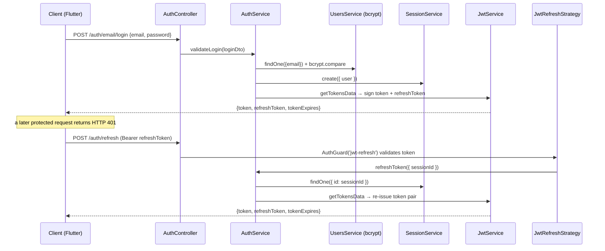

# Auth Module

## Module Purpose

The Auth module owns email-and-password authentication for PantryChef. `AuthController` exposes seven routes under `/api/auth/*` and delegates each one to `AuthService` (Source: backend/src/auth/auth.controller.ts). It issues and rotates JWT access and refresh token pairs through three Passport strategies — `jwt`, `jwt-refresh`, and `anonymous` — and supports current-user introspection (`GET /me`), profile update with old-password verification (`PATCH /me`), session-aware logout, and deletion of the authenticated account (`DELETE /me` — physically destructive, see Known Limitations). Password reset DTOs (`AuthForgotPasswordDto`, `AuthResetPasswordDto`) exist in `dto/` but no endpoints consume them (see Known Limitations).

## Key Components

| Component | File | Responsibility |
| --- | --- | --- |
| `AuthController` | `auth.controller.ts` | 7 routes under `/api/auth` (Source: auth.controller.ts) |
| `AuthService` | `auth.service.ts` | Login validation, session creation, JWT issuance via JwtService, token re-issuance, profile update with `oldPassword` check, soft-delete delegation (Source: auth.service.ts) |
| `AuthModule` | `auth.module.ts` | Composition root — imports UsersModule, SessionModule, PassportModule, JwtModule (Source: auth.module.ts) |
| `JwtStrategy` | `strategies/jwt.strategy.ts` | Passport 'jwt' access-token strategy; secret from `configService.get('auth').secret` (Source: jwt.strategy.ts) |
| `JwtRefreshStrategy` | `strategies/jwt-refresh.strategy.ts` | Passport 'jwt-refresh' refresh-token strategy; separate secret (Source: jwt-refresh.strategy.ts) |
| `AnonymousStrategy` | `strategies/anonymous.strategy.ts` | Passport anonymous strategy for unauthenticated routes (Source: anonymous.strategy.ts) |
| `JwtPayloadType` | `strategies/types/jwt-payload.type.ts` | Type alias `Pick<User, 'id'> & { sessionId, iat, exp }` |
| `JwtRefreshPayloadType` | `strategies/types/jwt-refresh-payload.type.ts` | Type alias `{ sessionId, iat, exp }` |
| `AuthEmailLoginDto` | `dto/auth-email-login.dto.ts` | Login request contract: `{ email, password }` |
| `AuthRegisterLoginDto` | `dto/auth-register-login.dto.ts` | Register request contract: `{ email, password }` (min 6 chars) |
| `AuthUpdateDto` | `dto/auth-update.dto.ts` | Profile update contract: `{ firstName?, lastName?, password?, oldPassword? }` |
| `AuthConfirmEmailDto` | `dto/auth-confirm-email.dto.ts` | Email confirmation contract: `{ hash }` |
| `AuthForgotPasswordDto` | `dto/auth-forgot-password.dto.ts` | **UNWIRED** — DTO exists but no endpoint consumes it |
| `AuthResetPasswordDto` | `dto/auth-reset-password.dto.ts` | **UNWIRED** — DTO exists but no endpoint consumes it |
| `AuthConfig` | `config/auth-config.type.ts` | Typed shape for the `auth` config namespace |
| `authConfig` factory | `config/auth.config.ts` | `registerAs<AuthConfig>('auth', ...)` with `EnvironmentVariablesValidator` |
| `LoginResponseType` | `types/login-response.type.ts` | Readonly `{ token, refreshToken, tokenExpires, user }` |

## Architecture Fit

`AuthController` is a thin HTTP adapter that delegates every route to `AuthService`. `AuthService` coordinates `JwtService` (token signing), `UsersService` (user CRUD), `SessionService` (session lifecycle), and `ConfigService<AllConfigType>` for typed config access (Source: auth.service.ts). This follows the backend's controller → service → repository → domain layering, except that persistence is reached indirectly through `UsersService` and `SessionService` rather than a repository owned by this module. The `jwt` and `jwt-refresh` strategies are registered as providers in `AuthModule` and applied to routes via `AuthGuard('jwt')` / `AuthGuard('jwt-refresh')`. `AnonymousStrategy` is registered as a provider but **not** applied to any route — `POST /email/login` and `POST /email/register` declare no `@UseGuards`, so they are simply unguarded. See [`../../../ARCHITECTURE.md`](../../../ARCHITECTURE.md) §"JWT Authentication Flow" for the end-to-end sequence. `AuthModule` also carries a commented `// MailModule,` import (Source: auth.module.ts), preserved verbatim.

## Dependencies

### Internal

- `UsersModule` — user lookup, creation, profile update, and soft-delete.
- `SessionModule` — session create/find/soft-delete for token rotation and logout.
- `PassportModule` — Passport.js wrapper for strategy registration.
- `JwtModule.register({})` — JWT signing, with per-call options supplied at `signAsync` time.
- ~~`MailModule`~~ — commented out at `auth.module.ts` (intentional; required only if the password reset endpoints were wired).

### External

Exact versions from `backend/package.json:L24-L75`:

| Package | Version | Purpose |
| --- | --- | --- |
| `@nestjs/common` | ^10.0.0 | Decorators, HttpException, UnauthorizedException |
| `@nestjs/jwt` | ^10.2.0 | JwtService.signAsync for token issuance |
| `@nestjs/passport` | ^10.0.3 | PassportStrategy + AuthGuard |
| `@nestjs/swagger` | ^8.0.1 | `@ApiTags`, `@ApiBearerAuth`, `@ApiProperty` |
| `passport` | ^0.7.0 | Strategy framework |
| `passport-jwt` | ^4.0.1 | ExtractJwt + Strategy for `jwt` and `jwt-refresh` |
| `passport-anonymous` | ^1.0.1 | Anonymous strategy for unguarded routes |
| `bcryptjs` | ^2.4.3 | Password hash comparison |
| `class-validator` | ^0.14.1 | DTO validation decorators |
| `class-transformer` | ^0.5.1 | DTO transformations (`lowerCaseTransformer` for email) |
| `ms` | ^2.1.3 | Parse `15m`/`3650d` strings into milliseconds for `tokenExpires` |

## Primary Use Cases

- Sign up with email + password (`POST /email/register`).
- Log in with email + password to receive `{ token, refreshToken, tokenExpires }` (`POST /email/login`).
- Fetch the currently authenticated user (`GET /me`).
- Re-issue access + refresh tokens via a refresh-token bearer (`POST /refresh`).
- Log out, which soft-deletes the current session so the refresh token stops working (`POST /logout`).
- Update profile fields; `oldPassword` is required when changing `password` (`PATCH /me`).
- Delete the authenticated user account (`DELETE /me`) — physically destructive (`UsersService.softDelete` calls `deleteOne`); see Known Limitations.

## API / Endpoint Reference

| Method | Path | Guard | Description |
| --- | --- | --- | --- |
| `POST` | `/api/auth/email/login` | none (unguarded) | Email + password login (Source: auth.controller.ts) |
| `POST` | `/api/auth/email/register` | none (unguarded) | Email + password registration (Source: auth.controller.ts) |
| `GET` | `/api/auth/me` | `AuthGuard('jwt')` | Get current authenticated user (Source: auth.controller.ts) |
| `POST` | `/api/auth/refresh` | `AuthGuard('jwt-refresh')` | Re-issue access + refresh tokens (Source: auth.controller.ts) |
| `POST` | `/api/auth/logout` | `AuthGuard('jwt')` | Invalidate the current session (Source: auth.controller.ts) |
| `PATCH` | `/api/auth/me` | `AuthGuard('jwt')` | Update profile; `oldPassword` required for password change (Source: auth.controller.ts) |
| `DELETE` | `/api/auth/me` | `AuthGuard('jwt')` | Delete authenticated user account — **physically destructive** (`UsersService.softDelete` calls `deleteOne`); see [users README § Known Limitations](../users/README.md) (Source: auth.controller.ts:L165-L178) |

Routes derive from `@Controller({ path: 'auth', version: '1' })` (Source: auth.controller.ts) plus the global `app.setGlobalPrefix('api')` in `backend/src/main.ts`, yielding `/api/auth/<route>`. Note the `version: '1'` argument is **inert at runtime**: NestJS only applies controller versions when `app.enableVersioning()` is called, and `main.ts` does not call it (Source: `backend/src/main.ts:L10-L35`), so the effective paths carry **no** `/v1/` segment — a request to `/api/v1/auth/<route>` returns 404. Login, register, and refresh return `Omit<LoginResponseType, 'user'>`, so the user object must be fetched separately via `GET /me`.

## Data Flows

The diagram below shows the login → bearer-token request → token re-issue cycle. The Flutter `DioClient` injects `Authorization: Bearer <token>` on every request and, on a 401, calls the refresh endpoint with a separate Dio instance to avoid recursion.



The refresh route is the second half of that cycle: `JwtRefreshStrategy` verifies the refresh token with `AUTH_REFRESH_SECRET`, then `AuthService.refreshToken` looks up the session via `SessionService.findOne` and throws `UnauthorizedException` (HTTP 401) when the session is absent before re-issuing a token pair (Source: auth.service.ts). The handler delegates straight to the service:

```typescript
@Post('refresh')
@UseGuards(AuthGuard('jwt-refresh'))
@HttpCode(HttpStatus.OK)
public refresh(@Request() request): Promise<Omit<LoginResponseType, 'user'>> {
```

## Configuration

| Env Var | Default | Source | Purpose |
| --- | --- | --- | --- |
| `AUTH_JWT_SECRET` | `secret` | backend/env_example:L20 | JWT access-token signing secret |
| `AUTH_JWT_TOKEN_EXPIRES_IN` | `15m` | backend/env_example:L21 | Access-token lifetime (parsed by `ms`) |
| `AUTH_REFRESH_SECRET` | `secret_for_refresh` | backend/env_example:L22 | Refresh-token signing secret |
| `AUTH_REFRESH_TOKEN_EXPIRES_IN` | `3650d` (~10 years) | backend/env_example:L23 | Refresh-token lifetime — **unsafe default; see Limitations** |

The `authConfig` factory at `config/auth.config.ts` calls `validateConfig(process.env, EnvironmentVariablesValidator)` (Source: auth.config.ts) to enforce that all four variables are present at boot, and the typed `AuthConfig` is consumed via `configService.getOrThrow('auth')` (Source: auth.service.ts).

## Known Limitations and Implementation Gaps

> ⚠️ **Route versioning is inert** — the controller declares `@Controller({ path: 'auth', version: '1' })`, but `main.ts` never calls `app.enableVersioning()` (Source: `backend/src/main.ts:L10-L35`), so the `version: '1'` argument has no runtime effect. The auth routes resolve at `/api/auth/*` (not `/api/v1/auth/*`); requests to `/api/v1/auth/*` return 404. The repository's own e2e suite still targets `/api/v1/auth/*` and is therefore red. See [PRODUCTION_READINESS.md](../../../PRODUCTION_READINESS.md) § Build & Runtime.

> ⚠️ **Unwired password reset DTOs** — `dto/auth-forgot-password.dto.ts` exports `AuthForgotPasswordDto { email: string }` and `dto/auth-reset-password.dto.ts` exports `AuthResetPasswordDto { password: string; hash: string }`, but `auth.controller.ts` declares no `forgot-password` or `reset-password` endpoint. The corresponding `MailModule` import is commented at `auth.module.ts`.

> ⚠️ **Refresh token TTL is `3650d` (~10 years)** — Source: `backend/env_example:L23`. This is unsafe for production: a stolen refresh token effectively grants permanent access until the session is explicitly soft-deleted via logout.

> ⚠️ **JWT secrets default to `secret` and `secret_for_refresh`** — Source: `backend/env_example:L20`, `:L22`. These must be rotated to high-entropy values for production.

> ⚠️ **No rate limiting on `/email/login` or `/email/register`** — both endpoints are unauthenticated (no guard) and not protected by `@nestjs/throttler`, so brute-force protection is missing.

> ⚠️ **`DELETE /api/auth/me` is physically destructive, not a soft-delete.** Despite the method name, `UsersService.softDelete` calls `deleteOne` and permanently removes the user document — no `deletedAt` timestamp is set (Source: `backend/src/auth/auth.controller.ts:L165-L178`; `backend/src/users/infrastructure/document/repositories/user.repository.ts:L205-L206`). Existing `Session` documents are left untouched, so refresh tokens are not revoked. Mirrors the users module [README § Known Limitations](../users/README.md); tracked in [`../../../PRODUCTION_READINESS.md`](../../../PRODUCTION_READINESS.md).

## Production Readiness Status

See [`../../../PRODUCTION_READINESS.md`](../../../PRODUCTION_READINESS.md) for the complete production readiness checklist.

> 🚧 **Security Hardening** — add rate limiting on `/email/login`, `/email/register`, and `/refresh` via `@nestjs/throttler`. See [`../../../PRODUCTION_READINESS.md`](../../../PRODUCTION_READINESS.md) § Security Hardening.

> 🚧 **Wire password reset endpoints** — implement `POST /api/auth/forgot-password` (consumes `AuthForgotPasswordDto`) and `POST /api/auth/reset-password` (consumes `AuthResetPasswordDto`). Uncomment `MailModule` at `auth.module.ts` and implement the email-delivery integration.

> 🚧 **Secrets Management** — rotate `AUTH_JWT_SECRET` and `AUTH_REFRESH_SECRET` to high-entropy values stored in a secrets manager (AWS Secrets Manager, HashiCorp Vault, Kubernetes Secrets). Reduce `AUTH_REFRESH_TOKEN_EXPIRES_IN` from `3650d` to a sensible window (e.g., `7d` – `30d`) with a documented rotation policy. See [`../../../PRODUCTION_READINESS.md`](../../../PRODUCTION_READINESS.md) § Secrets Management.

> 🚧 **Cookie-based refresh tokens** — consider migrating refresh tokens to `httpOnly` cookies to reduce the XSS theft surface. Currently the refresh token is returned in the JSON response body via `LoginResponseType.refreshToken` (Source: types/login-response.type.ts).
