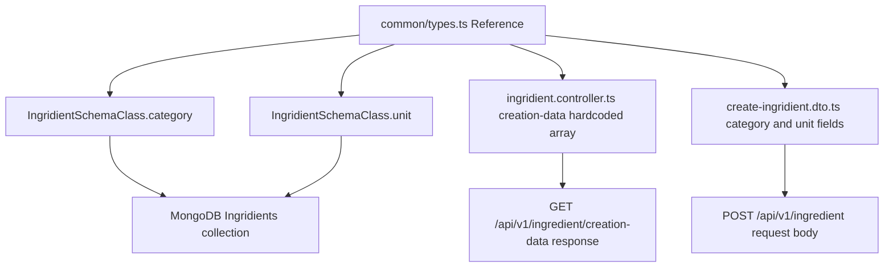

# Common Module

## Module Purpose

The `common/` module is the backend's cross-feature contract layer — shared type primitives that feature modules reuse for consistent data shapes. It contains one file, `types.ts`, declaring a single exported alias, `Reference`: a denormalized `{ id, name }` pair for embedded reference caching in MongoDB documents (Source: `backend/src/common/types.ts:L21-L24`).

Despite its 4-line footprint, the contract is consumed across the `Ingridient` (spelling preserved verbatim throughout the backend codebase) feature: the `IngridientSchemaClass` (spelling preserved verbatim), the `Ingridient` domain entity, and both the `CreateIngridientDto` and `UpdateIngridientDto` rely on `Reference` for their `category` and `unit` fields. Centralising the alias avoids duplication and gives a single editing point.

## Key Components

| Component | File | Responsibility |
| --- | --- | --- |
| `Reference` | `types.ts:L21-L24` | Shared type alias `{ id: string; name: string }` for denormalized reference caching |

```typescript
export type Reference = {
  id: string;
  name: string;
};
```

## Architecture Fit

The `common/` module sits **below** every feature module — a leaf node with no inbound or outbound runtime dependencies, depended on by:

- `IngridientSchemaClass.category` and `IngridientSchemaClass.unit` — embedded reference fields in the Mongoose schema (Source: `backend/src/ingridient/infrastructure/document/entities/ingridient.schema.ts:L21,L28`).
- `Ingridient` domain entity — mirrors the schema shape in the domain layer (Source: `backend/src/ingridient/domain/ingrident.ts:L5,L7`).
- `CreateIngridientDto` and `UpdateIngridientDto` — request contracts accepting embedded references (Source: `backend/src/ingridient/dto/create-ingridient.dto.ts:L22,L31`, `backend/src/ingridient/dto/update-ingridient.dto.ts:L21,L29`).
- Hardcoded creation data from `GET /api/v1/ingredient/creation-data` (Source: `backend/src/ingridient/ingridient.controller.ts:L52-L71`).

`Reference` encodes a denormalization trade-off: schemas embed both `id` and `name` for read efficiency rather than joining at read time. The cost is write-amplification — when a source name changes, embedded `Reference.name` snapshots go stale until reconciled.

See [ARCHITECTURE.md](../../../ARCHITECTURE.md) for backend layering and [DATA_MODEL.md](../../../DATA_MODEL.md) § Cross-Cutting Schema Conventions → Reference Type for the schema diagram. Consumer-side docs live in [backend/src/ingridient/README.md](../ingridient/README.md).

## Dependencies

### Internal

None. `types.ts` declares no imports.

### External

None. `types.ts` is pure type-only — no runtime dependencies, no decorators, and zero executable JavaScript at runtime.

## Primary Use Cases

- **Denormalized category reference** on `IngridientSchemaClass.category` (e.g., `{ id: '1', name: 'spice' }`) — stores the id plus a label snapshot so consumers render lists without a join.
- **Denormalized unit reference** on `IngridientSchemaClass.unit` (e.g., `{ id: '3', name: 'kg' }`) — the same pattern for measurement units.
- **Creation reference data** from `GET /api/v1/ingredient/creation-data` (Source: `backend/src/ingridient/ingridient.controller.ts:L52-L71`) — returns category and unit options in the `Reference` shape so the client populates its dropdowns directly.
- **DTO bodies** in `CreateIngridientDto` and `UpdateIngridientDto` carry embedded `Reference` objects that flow straight to persistence.

## API / Endpoint Reference

N/A — the `common/` module exposes no HTTP endpoints. It is a type-only contract layer with no controller, service, or routes.

## Data Flows

The diagram shows how the single `Reference` type fans out across the backend's `Ingridient` consumers (spelling preserved verbatim):



## Configuration

N/A — the `common/` module reads no environment variables and has no configuration surface, independent of `backend/env_example` and `backend/src/config/`.

## Known Limitations and Implementation Gaps

> ⚠️ **`Reference.id` typed `string` but runtime values are integers.** Creation data from `GET /api/v1/ingredient/creation-data` (Source: `backend/src/ingridient/ingridient.controller.ts:L52-L71`) uses numeric ids, and the schema declares `@Prop({ type: { id: Number, name: String } })` (Source: `backend/src/ingridient/infrastructure/document/entities/ingridient.schema.ts:L20,L27`). Mongoose coerces the mismatch silently, so `Reference.id` cannot be trusted as an ObjectId, UUID, or fixed string format.

> ⚠️ **No validator decorators on `Reference`.** As a `type` alias (not a class), it cannot carry `class-validator` decorators. Consuming DTOs such as `CreateIngridientDto.category` (Source: `backend/src/ingridient/dto/create-ingridient.dto.ts:L20-L22`) apply only `@IsNotEmpty()`; the inner `id` and `name` go unvalidated.

> ⚠️ **Denormalized `name` can drift.** Renaming a source category (e.g., `'spice'` → `'spices'`) does not update existing `Reference.name` snapshots in `IngridientSchemaClass` documents; no reconciliation job exists.

## Production Readiness Status

> 🚧 **Strong typing**: replace the open `Reference` alias with a branded or discriminated union (e.g., `Reference<'category'>` vs `Reference<'unit'>`) to encode the source collection at compile time. See [PRODUCTION_READINESS.md](../../../PRODUCTION_READINESS.md) § Database.

> 🚧 **Data hygiene**: if `name` denormalization remains canonical, add a background job that syncs renamed source values into embedded `Reference.name` fields.

> 🚧 **Validation**: introduce a class-based `ReferenceDto` with `@IsString()`, `@IsNotEmpty()`, and (if `id` becomes an ObjectId) `@IsMongoId()` so DTOs validate the nested shape centrally.
