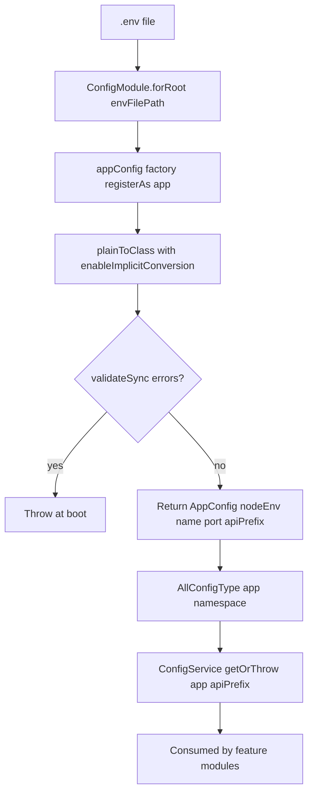

# Config Module

## Module Purpose

The `backend/src/config/` folder is the typed application-configuration layer for the NestJS backend. The factory `app.config.ts` registers an `app` namespace via `registerAs<AppConfig>('app', …)` from `@nestjs/config`, paired with an inline `EnvironmentVariablesValidator` (`class-validator` rules) and two type aliases, `AppConfig` and `AllConfigType` (Source: `backend/src/config/app.config.ts:L28-L44`). `AllConfigType` unifies the `app`, `auth`, and `database` sub-namespaces for type-safe access like `configService.getOrThrow('app.apiPrefix', { infer: true })` (Source: `backend/src/main.ts:L14-L19`). Validation runs once at boot inside `validateConfig()`, so malformed env values abort startup (Source: `backend/src/utils/validate-config.ts:L16-L18`).

## Key Components

| Component | File | Responsibility |
| --- | --- | --- |
| `appConfig` factory | `app.config.ts:L28-L44` | `registerAs<AppConfig>('app', …)` — reads env, validates via `EnvironmentVariablesValidator`, returns the typed `app` namespace |
| `EnvironmentVariablesValidator` | `app.config.ts:L12-L26` | class-validator schema: `@IsEnum(Environment)` on `NODE_ENV`, `@IsInt() @Min(0) @Max(65535)` on `APP_PORT`, `@IsString()` on `API_PREFIX`; all `@IsOptional()` |
| `AppConfig` type | `app-config.type.ts:L24-L30` | Typed shape with five fields: `nodeEnv`, `name`, `workingDirectory`, `port`, `apiPrefix` |
| `AllConfigType` | `config.type.ts:L27-L37` | Aggregate of `app: AppConfig`, `auth: AuthConfig`, `database: DatabaseConfig`; `// mail: MailConfig;` is commented out |

## Architecture Fit

`ConfigModule.forRoot({ isGlobal: true, load: [databaseConfig, authConfig, appConfig], envFilePath: ['.env'] })` is registered once at composition time (Source: `backend/src/app.module.ts:L20-L24`). `isGlobal: true` means every module receives `ConfigService` via DI without re-importing `ConfigModule`. Feature modules consume config via `ConfigService<AllConfigType>` and `getOrThrow('<namespace>.<key>', { infer: true })`, leveraging the aggregate alias for autocomplete and compile-time key validation (Source: `backend/src/main.ts:L13-L19`).

This module is the architecture's foundation: feature modules depend on it, not the reverse. See [ARCHITECTURE.md](../../../ARCHITECTURE.md) and [DATA_MODEL.md](../../../DATA_MODEL.md) for system-level context.

## Dependencies

### Internal

- None. This module is the foundation layer that other modules depend on, not vice versa.

### External

- `@nestjs/config ^3.3.0` (Source: `backend/package.json:L27`) — provides `ConfigModule`, `ConfigService`, and the `registerAs(...)` factory helper.
- `class-validator ^0.14.1` (Source: `backend/package.json:L36`) — supplies `@IsEnum`, `@IsInt`, `@Min`, `@Max`, `@IsString`, `@IsOptional`, and the `validateSync()` driver used by `validateConfig()`.
- `class-transformer ^0.5.1` (Source: `backend/package.json:L35`) — supplies `plainToClass()` with `enableImplicitConversion: true` so string env vars become typed values before validation.

## Primary Use Cases

- **Type-safe env var access** — `configService.getOrThrow('app.apiPrefix', { infer: true })` returns a `string` with no runtime cast (Source: `backend/src/main.ts:L14-L19`).
- **Validate environment variables at boot** — invalid values such as `APP_PORT="not-a-number"` throw inside `validateConfig` (Source: `backend/src/utils/validate-config.ts:L16-L18`).
- **Provide a single shared `AllConfigType` aggregate** consumed by `MongooseConfigService` (database), `JwtModule.registerAsync` (auth), and every feature module (app) (Source: `backend/src/config/config.type.ts:L27-L37`).
- **Support graceful fallbacks** — every validator field is `@IsOptional()` and the factory applies code fallbacks (e.g. `port` → `APP_PORT → PORT → 3000`), so the app boots even with an empty `.env` (Source: `backend/src/config/app.config.ts:L37-L41`).

## API / Endpoint Reference

N/A — the config module is a pure configuration layer with no HTTP endpoints. For per-feature endpoints, see each feature module's README under `backend/src/<module>/README.md`.

## Data Flows

The diagram traces env var resolution from `.env` through the `appConfig` factory into typed access at consumer sites.

Source citations: `backend/src/utils/validate-config.ts:L9-L18` for the validation flow, `backend/src/app.module.ts:L20-L24` for module registration, and `backend/src/main.ts:L14-L19,L33` for consumer call sites.

## Configuration

The `app` namespace reads four env vars from `backend/env_example`.

| Env Var | Default | Source | Validator | Purpose |
| --- | --- | --- | --- | --- |
| `NODE_ENV` | `development` | `backend/env_example:L1` | `@IsEnum(Environment) @IsOptional()` | Runtime environment — accepts `development`, `production`, or `test` (Source: `backend/src/config/app.config.ts:L6-L10`) |
| `APP_PORT` | `3000` | `backend/env_example:L2` | `@IsInt() @Min(0) @Max(65535) @IsOptional()` | HTTP listen port consumed by `app.listen(...)` (Source: `backend/src/main.ts:L33`) |
| `APP_NAME` | `"NestJS API"` (env_example) / `'app'` (code fallback) | `backend/env_example:L3` | (none) | Application display name; the env_example default and the code fallback differ |
| `API_PREFIX` | `api` | `backend/env_example:L4` | `@IsString() @IsOptional()` | Global API prefix consumed by `app.setGlobalPrefix(...)` (Source: `backend/src/main.ts:L14-L19`) |

Other namespaces are documented in `backend/src/auth/README.md` (the `AUTH_*` secrets/TTLs) and `backend/src/database/README.md` (the `DATABASE_*` vars). The `FILE_DRIVER` and `AWS_*` placeholders at `backend/env_example:L13-L18` are surfaced in [PRODUCTION_READINESS.md](../../../PRODUCTION_READINESS.md) § File Storage (S3 driver not yet implemented).

Note a runtime-versus-type discrepancy: the factory also returns `frontendDomain` and `backendDomain` (default `'http://localhost'`), yielding seven fields while `AppConfig` declares only five (Source: `backend/src/config/app.config.ts:L31-L43` versus `backend/src/config/app-config.type.ts:L24-L30`). These extras cannot be fetched type-safely via `getOrThrow`; see Known Limitations.

## Known Limitations and Implementation Gaps

> ⚠️ **Validator catches malformed values at boot but does not enforce strong production policy.** `EnvironmentVariablesValidator` (Source: `backend/src/config/app.config.ts:L12-L26`) rejects `APP_PORT="abc"` or `NODE_ENV="invalid"`, but it does not reject `NODE_ENV=production` paired with `AUTH_JWT_SECRET=secret` (the default in `backend/env_example:L20`) — that policy must be added separately. The auth namespace's `AUTH_REFRESH_TOKEN_EXPIRES_IN=3650d` default (`backend/env_example:L23`) likewise passes validation today.

> ⚠️ **`MailConfig` is intentionally commented out in `AllConfigType`** (Source: `backend/src/config/config.type.ts:L4,L36`). This pairs with the commented `// MailModule,` line in `backend/src/auth/auth.module.ts:L34`. The unwired pair documents a password-reset / mail feature that is not yet implemented — the `AuthForgotPasswordDto` and `AuthResetPasswordDto` exist but no endpoints route to them (see `backend/src/auth/README.md` § Known Limitations).

> ⚠️ **Environment variables load only from a single `.env` file.** `ConfigModule.forRoot({ envFilePath: ['.env'] })` (Source: `backend/src/app.module.ts:L23`) does not layer `.env.production`, `.env.test`, or `.env.local`. Multi-environment workflows require manual `.env` swaps or extending `envFilePath`.

## Production Readiness Status

> 🚧 **Validation policy** (maps to Secrets Management) — enforce stricter validation in production: reject `NODE_ENV=production` when `AUTH_JWT_SECRET=secret` or `AUTH_REFRESH_SECRET=secret_for_refresh` (the defaults at `backend/env_example:L20,L22`), and reject `AUTH_REFRESH_TOKEN_EXPIRES_IN` greater than 30d in production. See [../../../PRODUCTION_READINESS.md](../../../PRODUCTION_READINESS.md) § Secrets Management.

> 🚧 **Layered env loading** (maps to Infrastructure & Orchestration) — add `.env.production` and `.env.test` files to `envFilePath` (`backend/src/app.module.ts:L23`), or migrate runtime secrets to a managed secrets store (AWS Secrets Manager, GCP Secret Manager, HashiCorp Vault) injected via environment at deploy time. See [../../../PRODUCTION_READINESS.md](../../../PRODUCTION_READINESS.md) § Infrastructure & Orchestration.

> 🚧 **Documentation drift** (maps to CI/CD) — keep `backend/env_example`, `EnvironmentVariablesValidator`, and `AllConfigType` synchronized as new env vars are added. Add a CI check that diffs `env_example` against the validator's field list to fail early when they drift. See [../../../PRODUCTION_READINESS.md](../../../PRODUCTION_READINESS.md) § CI/CD.
