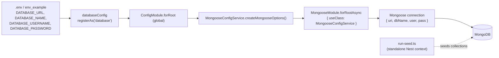

# Database module (`backend/src/database`)

The `database` module centralizes MongoDB/Mongoose connection configuration and database seeding for the NestJS application. It owns no HTTP routes and no domain entities; instead it assembles the Mongoose connection options the rest of the app consumes and provides a CLI-driven seed subsystem.

## Purpose

The `database` module has two responsibilities. First, it produces the Mongoose connection options used to initialize the application's database connection: `MongooseConfigService.createMongooseOptions()` reads the `database` configuration namespace and returns a `{ uri, dbName, user, pass }` object. Source: backend/src/database/mongoose-config.service.ts:L16-L34

Second, the configuration namespace itself is produced by a `registerAs('database', …)` factory that validates environment variables and returns a typed `DatabaseConfig`. Source: backend/src/database/config/database.config.ts:L95-L124

The module also provides a standalone, CLI-driven seeding subsystem that bootstraps a Nest context and runs the per-entity seed services in sequence to populate collections. Source: backend/src/database/seeds/run-seed.ts:L9-L21

## Key components

- **`MongooseConfigService`** — an `@Injectable()` provider that implements `MongooseOptionsFactory`. Its `createMongooseOptions()` method returns a `MongooseModuleOptions` object resolved from the `database` config namespace, mapping `uri` ← `configService.get('database').url`, `dbName` ← `.name`, `user` ← `.username`, and `pass` ← `.password`. Source: backend/src/database/mongoose-config.service.ts:L16-L35 (`uri` Source: backend/src/database/mongoose-config.service.ts:L29; `dbName` Source: backend/src/database/mongoose-config.service.ts:L30; `user` Source: backend/src/database/mongoose-config.service.ts:L31; `pass` Source: backend/src/database/mongoose-config.service.ts:L32)

- **`config/database.config.ts`** — a `registerAs('database', …)` factory that validates `process.env` through an `EnvironmentVariablesValidator`. The validator uses conditional `@ValidateIf` rules to choose between a single `DATABASE_URL` and the granular `DATABASE_TYPE`/`HOST`/`PORT`/`NAME`/`USERNAME`/`PASSWORD` set, then returns the typed `DatabaseConfig`. The factory wires `url: process.env.DATABASE_URL`, defaults the port to `5432` when unset, and defaults `maxConnections` to `100`. Source: backend/src/database/config/database.config.ts:L95-L124 (validator Source: backend/src/database/config/database.config.ts:L21-L83; `url` Source: backend/src/database/config/database.config.ts:L102; port default Source: backend/src/database/config/database.config.ts:L107-L109; `maxConnections` default Source: backend/src/database/config/database.config.ts:L115-L117)

- **`config/database-config.type.ts`** — the `DatabaseConfig` TypeScript contract. `isDocumentDatabase` and `maxConnections` are required; the remaining fields are optional. (Overview only.) Source: backend/src/database/config/database-config.type.ts:L1-L17

- **`seeds/`** — the seeding subsystem, comprising `run-seed.ts` (the CLI entrypoint), `seed.module.ts` (the composition root), and per-entity seed modules and services for `user`, `ingridient` (sic), `recipe`, and `pantry`. The subsystem is run with `npm run seed:run:document`. (Overview only.) Source: backend/src/database/seeds/run-seed.ts:L9-L21; Source: backend/package.json:L16

## Architecture fit

The module is wired into the root application module through `MongooseModule.forRootAsync({ useClass: MongooseConfigService })`, which defers connection setup to the options factory. Source: backend/src/app.module.ts:L62

`ConfigModule.forRoot({ isGlobal: true, load: [databaseConfig, …] })` loads the `database` namespace globally, so any provider in the application can read it. Source: backend/src/app.module.ts:L62

Controllers and services across the app obtain their Mongoose models from the connection this module configures; see the [system architecture guide](../../../docs/ARCHITECTURE.md) for the system-wide picture.

## Data models

This module owns no persisted entities or schemas — it only assembles connection options. The single type it defines is the `DatabaseConfig` configuration contract, which is a config shape rather than a persisted entity. Source: backend/src/database/config/database-config.type.ts:L1-L17

For the Mongoose entities (User, PantryIngridient, Recipe, Ingridient, Session), see the [data models reference](../../../docs/DATA_MODELS.md).

## API endpoints / public interface

This module exposes no REST routes. Its public surface consists of three integration points:

- `MongooseConfigService.createMongooseOptions()` — the factory method Nest calls during Mongoose initialization. Source: backend/src/database/mongoose-config.service.ts:L27
- the `databaseConfig` default export — the `registerAs('database')` factory loaded by `ConfigModule`. Source: backend/src/database/config/database.config.ts:L95
- the seed CLI entrypoint `run-seed.ts`. Source: backend/src/database/seeds/run-seed.ts:L9-L21

## Configuration

The module consumes the following environment variables (example values shown from `backend/env_example`). The `Source` column lists repo-root-relative `path:line` locators.

| Variable | Example (env_example) | Purpose | Source |
|----------|-----------------------|---------|--------|
| `DATABASE_TYPE` | `mongodb` | Selects the driver; `isDocumentDatabase` is `true` when it equals `mongodb` | backend/env_example:L6; backend/src/database/config/database.config.ts:L100 |
| `DATABASE_URL` | `mongodb://localhost:27017` | Full connection URI → Mongoose `uri` (overridden to `mongodb://mongodb:27017` inside Docker Compose) | backend/env_example:L11; backend/src/database/config/database.config.ts:L102; backend/docker-compose.yml:L29 |
| `DATABASE_NAME` | `blitzy` | Database name → Mongoose `dbName` | backend/env_example:L10; backend/src/database/config/database.config.ts:L111 |
| `DATABASE_USERNAME` | `admin` | Auth user → Mongoose `user` | backend/env_example:L8; backend/src/database/config/database.config.ts:L112 |
| `DATABASE_PASSWORD` | `123456` | Auth password → Mongoose `pass` | backend/env_example:L9; backend/src/database/config/database.config.ts:L110 |
| `DATABASE_PORT` | `27017` | Port (parsed base-10; falls back to `5432` if unset) | backend/env_example:L7; backend/src/database/config/database.config.ts:L107-L109 |

Additional optional variables (`DATABASE_MAX_CONNECTIONS`, default `100`; `DATABASE_SSL_ENABLED`; `DATABASE_REJECT_UNAUTHORIZED`; `DATABASE_CA`/`KEY`/`CERT`) are validated and mapped in the same factory. Source: backend/src/database/config/database.config.ts:L56-L123

Full deployment and environment detail is deferred to the [deployment guide](../../../docs/DEPLOYMENT.md).

## Data flow

Configuration flows from environment variables through the `databaseConfig` factory and the global `ConfigModule` into `MongooseConfigService`, which produces the connection options that `MongooseModule.forRootAsync` uses to open the Mongoose connection. The seed CLI connects to the same MongoDB instance independently.



Source: backend/src/database/config/database.config.ts:L95-L124, Source: backend/src/database/mongoose-config.service.ts:L27-L33, Source: backend/src/app.module.ts:L62, Source: backend/src/database/seeds/run-seed.ts:L10

The seed CLI `run-seed.ts` bootstraps a standalone Nest application context (`NestFactory.create(SeedModule)`) to populate collections, then closes it. Source: backend/src/database/seeds/run-seed.ts:L10,L18

## Design patterns used

- **Options-factory provider** — `MongooseConfigService` implements `MongooseOptionsFactory` and is supplied to `MongooseModule.forRootAsync` via `useClass`, deferring connection-option construction to a DI-managed provider. Source: backend/src/database/mongoose-config.service.ts:L17; Source: backend/src/app.module.ts:L43-L44
- **Namespaced configuration via `registerAs`** — the `database` configuration namespace is registered as a discrete, injectable config slice. Source: backend/src/database/config/database.config.ts:L95
- **Dependency injection** — `ConfigService<AllConfigType>` is injected through the constructor and used to resolve the `database` namespace. Source: backend/src/database/mongoose-config.service.ts:L18

## Known limitations / gaps

- KNOWN ISSUE: `DATABASE_PORT` defaults to `5432` (a Postgres-style default) when the variable is unset, even though the stack runs MongoDB. Source: backend/src/database/config/database.config.ts:L107-L109
- Default credentials ship in `env_example` (`DATABASE_USERNAME=admin` / `DATABASE_PASSWORD=123456`); the full SECURITY detail is deferred to the [deployment guide](../../../docs/DEPLOYMENT.md). Source: backend/env_example:L8-L9
- The validator and `DatabaseConfig` type carry RDBMS-oriented options (`synchronize`, `host`, SSL/certificate fields) that the assembled Mongoose connection does not use; `createMongooseOptions()` reads only `url`/`name`/`username`/`password`. Source: backend/src/database/mongoose-config.service.ts:L28-L33; Source: backend/src/database/config/database-config.type.ts:L1-L17

## Local development

Seed the database (bootstraps a standalone Nest context and runs the per-entity seed services):

```bash
npm run seed:run:document
```

This script runs `ts-node -r tsconfig-paths/register ./src/database/seeds/run-seed.ts`. Source: backend/package.json:L16; Source: backend/src/database/seeds/run-seed.ts:L9-L21

Bring up MongoDB (and the application) with Docker Compose:

```bash
docker-compose up
```

Source: backend/docker-compose.yml:L4-L29

For the full project setup, see the [backend root README](../../README.md); for the deployment how-to, see the [deployment guide](../../../docs/DEPLOYMENT.md).
