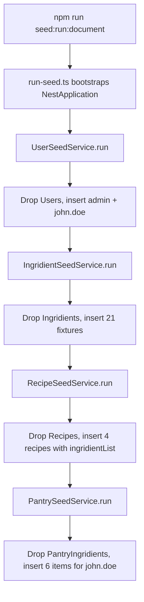

# Database Module

## Module Purpose

The `database/` module is the backend's MongoDB integration layer, owning two concerns:
runtime connection assembly and seed orchestration. At boot, `MongooseConfigService`
materializes Mongoose options from validated env vars, consumed by
`MongooseModule.forRootAsync({ useClass: MongooseConfigService })` in the root module
(Source: `backend/src/app.module.ts:L25-L27`). Separately, the standalone runner
`seeds/run-seed.ts` populates feature collections with deterministic fixtures — the entry
point for `npm run seed:run:document` (Source: `backend/package.json:L16`). It also defines
the typed `DatabaseConfig` contract and the `EnvironmentVariablesValidator` rejecting
malformed `DATABASE_*` config.

## Key Components

The table enumerates the module's runtime and seed-time components. The `Ingridient` seed
feature (spelling preserved verbatim) carries a deliberate second spelling asymmetry,
documented in the final row and under Known Limitations.

| Component | File | Responsibility |
| --- | --- | --- |
| `MongooseConfigService` | `mongoose-config.service.ts` | Implements `MongooseOptionsFactory`; returns `{ uri, dbName, user, pass }` derived from `AllConfigType.database` (Source: `backend/src/database/mongoose-config.service.ts:L24-L43`) |
| `databaseConfig` factory | `config/database.config.ts` | `registerAs<DatabaseConfig>('database', ...)` factory; validates `DATABASE_*` env vars via `EnvironmentVariablesValidator` (Source: `backend/src/database/config/database.config.ts:L123-L147`) |
| `DatabaseConfig` type | `config/database-config.type.ts` | Typed config shape with required `isDocumentDatabase`, `maxConnections` and optional connection/TLS fields (Source: `backend/src/database/config/database-config.type.ts:L14-L30`) |
| Seed runner | `seeds/run-seed.ts` | Bootstraps a standalone Nest context and invokes the four seed services in order (Source: `backend/src/database/seeds/run-seed.ts:L29-L38`) |
| `SeedModule` | `seeds/seed.module.ts` | NestJS module aggregating the four seed sub-modules + `ConfigModule.forRoot` + `MongooseModule.forRootAsync` (Source: `backend/src/database/seeds/seed.module.ts:L28-L44`) |
| `UserSeedService` | `seeds/user/user-seed.service.ts` | Drops the Users collection; inserts admin (`_id: '672c8442346b022fbd49c179'`) and john.doe (`_id: '672c73612ae468b9bb358205'`) with hashed `'secret'` password (Source: `backend/src/database/seeds/user/user-seed.service.ts:L46-L85`) |
| `IngridientSeedService` (spelling preserved verbatim) | `seeds/ingridient/ingridient-seed.service.ts` | Drops the Ingridients collection; inserts 21 ingredient fixtures across spice/vegetable/fruit/dairy/protein/baking/sauce/herb/bread categories (Source: `backend/src/database/seeds/ingridient/ingridient-seed.service.ts:L44-L267`) |
| `RecipeSeedService` | `seeds/recipe/recipe-seed.service.ts` | Drops the Recipes collection; inserts 4 seed recipes (Spaghetti Bolognese, Greek Salad, Pizza Margherita, Caesar Salad) with embedded `ingridientList` (spelling preserved verbatim) referencing the seeded `Ingridient` catalog (Source: `backend/src/database/seeds/recipe/recipe-seed.service.ts:L48-L240`) |
| `PantrySeedService` | `seeds/pantry/pantry-seed.service.ts` | Drops the PantryIngridients collection (spelling preserved verbatim); inserts 6 seed pantry items assigned to john.doe with `location` enum (`'freezer'`, `'pantry'`, `'fridge'`) (Source: `backend/src/database/seeds/pantry/pantry-seed.service.ts:L48-L103`) |
| `UserSeedModule`, `IngdientSeedModule`, `RecipeSeedModule`, `PantrySeedModule` | `seeds/<feature>/<feature>-seed.module.ts` | NestJS sub-modules each calling `MongooseModule.forFeature([{ name, schema }])` and exposing the seed service as a provider. The Ingridient sub-module's class is named `IngdientSeedModule` (spelling preserved verbatim — missing the `ri`, a separate typo distinct from `IngridientSeedService`) (Source: `backend/src/database/seeds/ingridient/ingridient-seed.module.ts:L33`) |

## Architecture Fit

`MongooseConfigService` is the single boot-time wire between configuration and persistence
(Source: `backend/src/app.module.ts:L25-L27`); the same factory is re-used by the seed
subsystem (Source: `backend/src/database/seeds/seed.module.ts:L39-L41`), which assembles its
own standalone Nest context. The runner bootstraps via `NestFactory.create(SeedModule)`,
resolves each seed service from DI, calls `.run()` in dependency order, and closes cleanly
(Source: `backend/src/database/seeds/run-seed.ts:L29-L38`). Seed services follow the
`controller → service → repository → MongoDB` layering only loosely — bypassing feature
controllers/services to operate directly on the Mongoose `Model<>` via `@InjectModel`. See
[`ARCHITECTURE.md`](../../../ARCHITECTURE.md) for system-wide layering and
[`DATA_MODEL.md`](../../../DATA_MODEL.md) for the schema diagram.

## Dependencies

### Internal

- `ConfigModule` (from `@nestjs/config`) — provides the `AllConfigType` injection for
  `MongooseConfigService`; the typed `database` namespace lives on `AllConfigType`
  (Source: `backend/src/config/config.type.ts:L27-L37`).
- `MongooseModule.forFeature` registrations — each seed sub-module binds one
  `Model<SchemaClass>` for `@InjectModel`: `UserSchemaClass`, `IngridientSchemaClass`
  (spelling preserved verbatim), `RecipeSchemaClass`, and `PantryIngridientSchemaClass`.

### External

| Package | Version | Purpose |
| --- | --- | --- |
| `@nestjs/common` | ^10.0.0 | `@Module`, `@Injectable`, DI primitives (Source: `backend/package.json:L26`) |
| `@nestjs/core` | ^10.0.0 | `NestFactory.create(SeedModule)` for the standalone seed runner (Source: `backend/package.json:L28`) |
| `@nestjs/config` | ^3.3.0 | `ConfigModule.forRoot`, `registerAs`, `ConfigService` (Source: `backend/package.json:L27`) |
| `@nestjs/mongoose` | ^10.1.0 | `MongooseModule.forRootAsync`, `MongooseModule.forFeature`, `@InjectModel`, `MongooseOptionsFactory` (Source: `backend/package.json:L30`) |
| `mongoose` | ^8.8.0 | `Model<T>`, `this.model.collection.drop()`, `this.model.insertMany()` (Source: `backend/package.json:L37`) |
| `bcryptjs` | ^2.4.3 | Password hashing in `UserSeedService` (Source: `backend/package.json:L34`) |
| `class-validator` | ^0.14.1 | `EnvironmentVariablesValidator` decorators (`@IsString`, `@IsInt`, `@ValidateIf`, `@IsBoolean`, etc.) (Source: `backend/package.json:L36`) |

## Primary Use Cases

- **Assemble the MongoDB connection at boot** —
  `MongooseModule.forRootAsync({ useClass: MongooseConfigService })` resolves `DATABASE_*`
  into a `MongooseModuleOptions` object (Source: `backend/src/app.module.ts:L25-L27`).
- **Bootstrap or reset a local database** — `npm run seed:run:document` invokes the seed
  runner, dropping and repopulating the four seeded collections
  (Source: `backend/package.json:L16`).
- **Provide deterministic fixtures** — admin and john.doe carry stable hardcoded ObjectIds,
  alongside 21 ingredient, 4 recipe, and 6 pantry fixtures
  (Source: `backend/src/database/seeds/user/user-seed.service.ts:L57-L84`).
- **Validate env vars before connecting** — `EnvironmentVariablesValidator` rejects malformed
  `DATABASE_*` config prior to Mongoose init
  (Source: `backend/src/database/config/database.config.ts:L54-L141`).

## API / Endpoint Reference

> **N/A** — `database/` is an internal infrastructure module with no HTTP endpoints; its only
> externally invokable surface is `npm run seed:run:document` (Source: `backend/package.json:L16`).

## Data Flows

The seed runner executes the four services strictly in order — later collections reference
ObjectIds inserted by earlier ones. The diagram traces one `npm run seed:run:document`
invocation.

This ordering is required: `PantrySeedService` references john.doe's `userId`
(Source: `backend/src/database/seeds/pantry/pantry-seed.service.ts:L86`) and `Ingridient`
ObjectIds via its `ingridient` field
(Source: `backend/src/database/seeds/pantry/pantry-seed.service.ts:L84`); `RecipeSeedService`
references the same in `ingridientList[].ingridient`
(Source: `backend/src/database/seeds/recipe/recipe-seed.service.ts:L87,L89`).

## Configuration

The module reads `DATABASE_*` env vars, validates them through
`EnvironmentVariablesValidator`, and exposes them via the `database` namespace of
`AllConfigType`. The table lists only variables present in `backend/env_example`.

| Env Var | Default | Source | Purpose |
| --- | --- | --- | --- |
| `DATABASE_TYPE` | `mongodb` | `backend/env_example:L6` | Database driver identifier; consumed to derive `isDocumentDatabase` (Source: `backend/src/database/config/database.config.ts:L127`) |
| `DATABASE_PORT` | `27017` | `backend/env_example:L7` | DB port; the factory falls back to `5432` if this is unset (Source: `backend/src/database/config/database.config.ts:L131-L133`) |
| `DATABASE_USERNAME` | `admin` | `backend/env_example:L8` | DB user — insecure default for production |
| `DATABASE_PASSWORD` | `123456` | `backend/env_example:L9` | DB password — insecure default for production |
| `DATABASE_NAME` | `blitzy` | `backend/env_example:L10` | DB name |
| `DATABASE_URL` | `mongodb://localhost:27017` | `backend/env_example:L11` | Connection URL; when set, the granular `DATABASE_TYPE/HOST/NAME/USERNAME` fields become optional per `@ValidateIf` (Source: `backend/src/database/config/database.config.ts:L55-L85`) |

> The validator also recognizes `DATABASE_HOST`, `DATABASE_SYNCHRONIZE`,
> `DATABASE_MAX_CONNECTIONS`, `DATABASE_SSL_ENABLED`, `DATABASE_REJECT_UNAUTHORIZED`,
> `DATABASE_CA`, `DATABASE_KEY`, and `DATABASE_CERT`
> (Source: `backend/src/database/config/database.config.ts:L54-L141`). These are NOT in
> `backend/env_example`; set them in `.env` only if needed.

## Known Limitations and Implementation Gaps

> ⚠️ **Destructive seed pattern** — every seed service calls `this.model.collection.drop()`
> at the start of `run()`, then re-inserts fixtures. Running `npm run seed:run:document`
> against a populated database WIPES all data in those collections
> (Source: `backend/src/database/seeds/user/user-seed.service.ts:L60-L75`; the `ingridient/`,
> `recipe/`, `pantry/` services do the same).

> ⚠️ **No migration versioning** — schema changes apply implicitly via Mongoose's loose mode —
> no version history, rollback path, or schema-diff log; consumers rely on git history.

> ⚠️ **Hardcoded ObjectIds** — `UserSeedService.run()` inserts admin
> (`_id: '672c8442346b022fbd49c179'`) and john.doe (`_id: '672c73612ae468b9bb358205'`) with
> hardcoded ObjectIds (Source: `backend/src/database/seeds/user/user-seed.service.ts:L57-L84`).
> Re-runs reproduce the same ids (idempotent locally), not gated for production.

> ⚠️ **Insecure credential defaults** — `DATABASE_USERNAME=admin` and `DATABASE_PASSWORD=123456`
> (Source: `backend/env_example:L8-L9`), echoed as
> `MONGO_INITDB_ROOT_USERNAME`/`MONGO_INITDB_ROOT_PASSWORD` in
> `backend/docker-compose.yml:L9-L10`. Rotate before any non-local deployment.

> ⚠️ **Preserved spelling variants** — `IngridientSeedService`, the `ingridientList` arrays in
> `RecipeSeedService`, and the `PantryIngridient` records from `PantrySeedService` all carry
> the project's variant spelling (preserved verbatim). The Ingridient sub-module exports its
> class as `IngdientSeedModule` (preserved verbatim — missing the `ri`), a SECOND distinct typo
> (Source: `backend/src/database/seeds/ingridient/ingridient-seed.module.ts:L33`). Neither may
> be corrected.

> ⚠️ **Port fallback inconsistency** — when `DATABASE_PORT` is unset, the factory falls back to
> `5432` (PostgreSQL's default) though the project targets MongoDB (default `27017`)
> (Source: `backend/src/database/config/database.config.ts:L131-L133`). The
> `backend/env_example:L7` value of `27017` masks this locally.

## Production Readiness Status

> 🚧 **Database** — gate `seeds/run-seed.ts` behind a `--force-reseed` flag or
> `NODE_ENV !== 'production'` guard; it currently drops collections unconditionally. See
> [`PRODUCTION_READINESS.md`](../../../PRODUCTION_READINESS.md) § Database.

> 🚧 **Database** — adopt `migrate-mongo` or similar for schema versioning; `timestamps: true`
> plus Mongoose's loose mode produce no version log. See
> [`PRODUCTION_READINESS.md`](../../../PRODUCTION_READINESS.md) § Database.

> 🚧 **Secrets Management** — rotate `DATABASE_USERNAME`/`DATABASE_PASSWORD` into a secrets
> manager (AWS Secrets Manager, Vault, or Kubernetes Secrets) rather than committing defaults.
> See [`PRODUCTION_READINESS.md`](../../../PRODUCTION_READINESS.md) § Secrets Management.

> 🚧 **Backup / PITR** — provision MongoDB Atlas or self-hosted backups with point-in-time
> recovery. The current `backend/docker-compose.yml` runs a single-container Mongo with a
> bind-mounted volume — no replication, no PITR.

> 🚧 **Indexes** — add compound indexes for recipe matching at scale; see
> [`../recipe/README.md`](../recipe/README.md) § Production Readiness Status for the
> pipeline's index needs.
