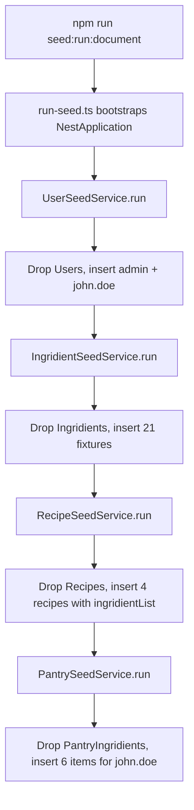

# Database Module

## Module Purpose

The `database/` module is the backend's MongoDB integration layer, and it owns two
distinct concerns: runtime connection assembly and development-time seed orchestration.
At application boot, `MongooseConfigService` materializes the Mongoose connection options
from validated environment variables and is consumed by
`MongooseModule.forRootAsync({ useClass: MongooseConfigService })` in the root application
module (Source: `backend/src/app.module.ts:L25-L27`). Separately, a standalone seed runner
(`seeds/run-seed.ts`) bootstraps a throwaway Nest context and populates the feature
collections with deterministic fixture data; it is the entry point for the
`npm run seed:run:document` script (Source: `backend/package.json:L16`). Every seed service
follows a destructive `dropCollection()` → re-insert pattern, wiping its target collection
before inserting fixtures. The module additionally defines the typed `DatabaseConfig`
contract and the `EnvironmentVariablesValidator` that rejects malformed `DATABASE_*`
configuration before Mongoose initializes.

## Key Components

The table below enumerates the module's runtime and seed-time components. Note that the
`Ingridient` seed feature (spelling preserved verbatim throughout the backend codebase)
carries a deliberate second spelling asymmetry, documented in the final row and again under
Known Limitations.

| Component | File | Responsibility |
| --- | --- | --- |
| `MongooseConfigService` | `mongoose-config.service.ts` | Implements `MongooseOptionsFactory`; returns `{ uri, dbName, user, pass }` derived from `AllConfigType.database` (Source: `backend/src/database/mongoose-config.service.ts:L9-L21`) |
| `databaseConfig` factory | `config/database.config.ts` | `registerAs<DatabaseConfig>('database', ...)` factory; validates `DATABASE_*` env vars via `EnvironmentVariablesValidator` (Source: `backend/src/database/config/database.config.ts:L76-L100`) |
| `DatabaseConfig` type | `config/database-config.type.ts` | Typed config shape with required `isDocumentDatabase`, `maxConnections` and optional connection/TLS fields (Source: `backend/src/database/config/database-config.type.ts:L1-L17`) |
| Seed runner | `seeds/run-seed.ts` | Bootstraps a standalone Nest context and invokes the four seed services in order (Source: `backend/src/database/seeds/run-seed.ts:L9-L21`) |
| `SeedModule` | `seeds/seed.module.ts` | NestJS module aggregating the four seed sub-modules + `ConfigModule.forRoot` + `MongooseModule.forRootAsync` (Source: `backend/src/database/seeds/seed.module.ts:L12-L28`) |
| `UserSeedService` | `seeds/user/user-seed.service.ts` | Drops the Users collection; inserts admin (`_id: '672c8442346b022fbd49c179'`) and john.doe (`_id: '672c73612ae468b9bb358205'`) with hashed `'secret'` password (Source: `backend/src/database/seeds/user/user-seed.service.ts:L18-L57`) |
| `IngridientSeedService` (spelling preserved verbatim) | `seeds/ingridient/ingridient-seed.service.ts` | Drops the Ingridients collection; inserts 21 ingredient fixtures across spice/vegetable/fruit/dairy/protein/baking/sauce/herb/bread categories (Source: `backend/src/database/seeds/ingridient/ingridient-seed.service.ts:L17-L240`) |
| `RecipeSeedService` | `seeds/recipe/recipe-seed.service.ts` | Drops the Recipes collection; inserts 4 seed recipes (Spaghetti Bolognese, Greek Salad, Pizza Margherita, Caesar Salad) with embedded `ingridientList` (spelling preserved verbatim) referencing the seeded `Ingridient` catalog (Source: `backend/src/database/seeds/recipe/recipe-seed.service.ts:L17-L209`) |
| `PantrySeedService` | `seeds/pantry/pantry-seed.service.ts` | Drops the PantryIngridients collection (spelling preserved verbatim); inserts 6 seed pantry items assigned to john.doe with `location` enum (`'freezer'`, `'pantry'`, `'fridge'`) (Source: `backend/src/database/seeds/pantry/pantry-seed.service.ts:L17-L72`) |
| `UserSeedModule`, `IngdientSeedModule`, `RecipeSeedModule`, `PantrySeedModule` | `seeds/<feature>/<feature>-seed.module.ts` | NestJS sub-modules each calling `MongooseModule.forFeature([{ name, schema }])` and exposing the seed service as a provider. The Ingridient sub-module's class is named `IngdientSeedModule` (spelling preserved verbatim — missing the `ri`, a separate typo distinct from `IngridientSeedService`) (Source: `backend/src/database/seeds/ingridient/ingridient-seed.module.ts:L21`) |

## Architecture Fit

`MongooseConfigService` is the single boot-time wire between configuration and persistence:
it is instantiated by `MongooseModule.forRootAsync({ useClass: MongooseConfigService })` in
the root module, the only place in the application boot path where database connection
options are materialized (Source: `backend/src/app.module.ts:L25-L27`). The same factory is
re-used by the seed subsystem at `backend/src/database/seeds/seed.module.ts:L23-L25`, which
assembles its own standalone Nest context so the seed runner can resolve services without
starting the HTTP server. That runner script bootstraps the context via
`NestFactory.create(SeedModule)`, fetches each seed service from the DI container, calls
`.run()` in dependency order, and closes the context cleanly
(Source: `backend/src/database/seeds/run-seed.ts:L9-L21`). The seed services follow the
project's `controller → service → repository → MongoDB` layering only loosely: they bypass
the feature modules' controllers and services entirely and operate directly on the Mongoose
`Model<>` injected via `@InjectModel`. For the system-wide layering narrative see
[`../../../ARCHITECTURE.md`](../../../ARCHITECTURE.md), and for the canonical schema diagram
see [`../../../DATA_MODEL.md`](../../../DATA_MODEL.md).

## Dependencies

### Internal

- `ConfigModule` (from `@nestjs/config`) — provides the `AllConfigType` injection consumed by
  `MongooseConfigService`; the typed `database` namespace is declared on `AllConfigType`
  (Source: `backend/src/config/config.type.ts:L36-L41`).
- `MongooseModule.forFeature` registrations of the schema classes — each seed sub-module binds
  one `Model<SchemaClass>` for `@InjectModel`: `UserSchemaClass`, `IngridientSchemaClass`
  (spelling preserved verbatim), `RecipeSchemaClass`, and `PantryIngridientSchemaClass`
  (spelling preserved verbatim).

### External

| Package | Version | Purpose |
| --- | --- | --- |
| `@nestjs/common` | ^10.0.0 | `@Module`, `@Injectable`, DI primitives (Source: `backend/package.json:L26`) |
| `@nestjs/core` | ^10.0.0 | `NestFactory.create(SeedModule)` for the standalone seed runner (Source: `backend/package.json:L28`) |
| `@nestjs/config` | ^3.3.0 | `ConfigModule.forRoot`, `registerAs`, `ConfigService` (Source: `backend/package.json:L27`) |
| `@nestjs/mongoose` | ^10.1.0 | `MongooseModule.forRootAsync`, `MongooseModule.forFeature`, `@InjectModel`, `MongooseOptionsFactory` (Source: `backend/package.json:L30`) |
| `mongoose` | ^8.8.0 | `Model<T>`, `this.model.collection.drop()`, `this.model.insertMany()` (Source: `backend/package.json:L37`) |
| `bcryptjs` | ^2.4.3 | Password hashing in `UserSeedService` (Source: `backend/package.json:L34`) |
| `class-validator` | ^0.14.1 | `EnvironmentVariablesValidator` decorators (`@IsString`, `@IsInt`, `@ValidateIf`, `@IsBoolean`, etc.) (Source: `backend/package.json:L36`) |

## Primary Use Cases

- **Assemble the MongoDB connection at boot** — the root module imports
  `MongooseModule.forRootAsync({ useClass: MongooseConfigService })`, which resolves the
  `DATABASE_*` variables into a `MongooseModuleOptions` object
  (Source: `backend/src/app.module.ts:L25-L27`).
- **Bootstrap or reset a local database** — `npm run seed:run:document` invokes the seed
  runner, which drops and repopulates the four seeded feature collections
  (Source: `backend/package.json:L16`).
- **Provide deterministic development fixtures** — the admin and john.doe users carry stable
  hardcoded ObjectIds, alongside 21 ingredient fixtures, 4 recipe fixtures, and 6 pantry items
  owned by john.doe (Source: `backend/src/database/seeds/user/user-seed.service.ts:L29-L56`).
- **Validate environment variables before connecting** — `EnvironmentVariablesValidator`
  rejects malformed `DATABASE_*` configuration prior to Mongoose initialization
  (Source: `backend/src/database/config/database.config.ts:L14-L77`).

## API / Endpoint Reference

> **N/A** — `database/` is an internal infrastructure module with no HTTP endpoints. Its only
> externally invokable surface is the `npm run seed:run:document` script
> (Source: `backend/package.json:L16`).

## Data Flows

The seed runner executes the four seed services strictly in order, because later collections
reference ObjectIds inserted by earlier ones. The diagram below traces a single
`npm run seed:run:document` invocation from the npm script through each destructive
drop-and-insert step.

The seed order is significant: `PantrySeedService` depends on john.doe's seeded `userId`
(Source: `backend/src/database/seeds/pantry/pantry-seed.service.ts:L24`) and on `Ingridient`
catalog ObjectIds referenced through its `ingridient` field
(Source: `backend/src/database/seeds/pantry/pantry-seed.service.ts:L22`). `RecipeSeedService`
likewise references `Ingridient` catalog ObjectIds inside its `ingridientList[].ingridient`
entries (Source: `backend/src/database/seeds/recipe/recipe-seed.service.ts:L27,L34`).

## Configuration

The module reads `DATABASE_*` environment variables, validates them through
`EnvironmentVariablesValidator`, and exposes them via the `database` namespace of
`AllConfigType`. The table lists only the variables actually present in `backend/env_example`.

| Env Var | Default | Source | Purpose |
| --- | --- | --- | --- |
| `DATABASE_TYPE` | `mongodb` | `backend/env_example:L6` | Database driver identifier; consumed to derive `isDocumentDatabase` (Source: `backend/src/database/config/database.config.ts:L80`) |
| `DATABASE_PORT` | `27017` | `backend/env_example:L7` | DB port; the factory falls back to `5432` if this is unset (Source: `backend/src/database/config/database.config.ts:L84-L86`) |
| `DATABASE_USERNAME` | `admin` | `backend/env_example:L8` | DB user — insecure default for production |
| `DATABASE_PASSWORD` | `123456` | `backend/env_example:L9` | DB password — insecure default for production |
| `DATABASE_NAME` | `blitzy` | `backend/env_example:L10` | DB name |
| `DATABASE_URL` | `mongodb://localhost:27017` | `backend/env_example:L11` | Connection URL; when set, the granular `DATABASE_TYPE/HOST/NAME/USERNAME` fields become optional per `@ValidateIf` (Source: `backend/src/database/config/database.config.ts:L15-L45`) |

> The validator also recognizes `DATABASE_HOST`, `DATABASE_SYNCHRONIZE`,
> `DATABASE_MAX_CONNECTIONS`, `DATABASE_SSL_ENABLED`, `DATABASE_REJECT_UNAUTHORIZED`,
> `DATABASE_CA`, `DATABASE_KEY`, and `DATABASE_CERT`
> (Source: `backend/src/database/config/database.config.ts:L23-L73`), but these are NOT
> pre-populated in `backend/env_example`. Set them in `.env` only if needed.

## Known Limitations and Implementation Gaps

> ⚠️ **Destructive seed pattern** — every seed service calls `this.model.collection.drop()`
> at the start of `run()`, then re-inserts its fixtures. Running `npm run seed:run:document`
> against a populated database would WIPE all existing data in the seeded collections
> (Source: `backend/src/database/seeds/user/user-seed.service.ts:L14-L19`, with equivalent
> `dropCollection()` calls in the `ingridient/`, `recipe/`, and `pantry/` seed services).

> ⚠️ **No migration versioning** — schema changes are applied implicitly through Mongoose's
> loose document mode. There is no version history, no rollback path, and no schema-diff log;
> consumers must rely on git history to understand how the document shapes evolved.

> ⚠️ **Hardcoded ObjectIds in seed data** — `UserSeedService.run()` inserts admin with
> `_id: '672c8442346b022fbd49c179'` and john.doe with `_id: '672c73612ae468b9bb358205'` using
> arbitrary, hardcoded ObjectIds
> (Source: `backend/src/database/seeds/user/user-seed.service.ts:L29-L46`). Repeated runs
> reproduce the same ids (an idempotency benefit for local development) but the chosen ids are
> not gated for production use.

> ⚠️ **Insecure database credential defaults** — `DATABASE_USERNAME=admin` and
> `DATABASE_PASSWORD=123456` (Source: `backend/env_example:L8-L9`). The same credentials are
> echoed as `MONGO_INITDB_ROOT_USERNAME` and `MONGO_INITDB_ROOT_PASSWORD` in
> `backend/docker-compose.yml:L9-L10`. These must be rotated before any non-local deployment.

> ⚠️ **Preserved spelling variants in seed code and data** — `IngridientSeedService`
> (spelling preserved verbatim), the `ingridientList` arrays embedded by `RecipeSeedService`
> (spelling preserved verbatim), and the `PantryIngridient` records inserted by
> `PantrySeedService` (spelling preserved verbatim) all carry the project's variant spelling.
> Critically, the Ingridient sub-module exports its class as `IngdientSeedModule` (spelling
> preserved verbatim — missing the `ri`), a SECOND, distinct typo from the otherwise
> project-wide `Ingridient` spelling
> (Source: `backend/src/database/seeds/ingridient/ingridient-seed.module.ts:L21`). Neither
> spelling may be corrected during documentation.

> ⚠️ **Port fallback inconsistency** — when `DATABASE_PORT` is unset, the config factory falls
> back to `5432` (the PostgreSQL default) even though the project targets MongoDB, whose
> default port is `27017` (Source: `backend/src/database/config/database.config.ts:L84-L86`).
> The `backend/env_example:L7` value of `27017` masks this quirk for typical local setups.

## Production Readiness Status

> 🚧 **Database** — gate `seeds/run-seed.ts` behind an explicit `--force-reseed` flag or a
> `NODE_ENV !== 'production'` guard before deployment, since it currently drops collections
> unconditionally. See [`../../../PRODUCTION_READINESS.md`](../../../PRODUCTION_READINESS.md)
> § Database.

> 🚧 **Database** — adopt `migrate-mongo` or a comparable migration framework for schema
> versioning; `@Schema({ timestamps: true })` plus Mongoose's loose mode produce no version
> log. See [`../../../PRODUCTION_READINESS.md`](../../../PRODUCTION_READINESS.md) § Database.

> 🚧 **Secrets Management** — rotate `DATABASE_USERNAME` and `DATABASE_PASSWORD` and move them
> into a secrets manager (AWS Secrets Manager, HashiCorp Vault, or Kubernetes Secrets) rather
> than committing defaults. See
> [`../../../PRODUCTION_READINESS.md`](../../../PRODUCTION_READINESS.md) § Secrets Management.

> 🚧 **Backup / PITR** — provision MongoDB Atlas or self-hosted backups with point-in-time
> recovery before production. The current `backend/docker-compose.yml` runs a single-container
> Mongo with a bind-mounted data directory — no replication and no PITR.

> 🚧 **Indexes** — add compound indexes to support recipe matching at scale; see
> [`../recipe/README.md`](../recipe/README.md) § Production Readiness Status for the matching
> pipeline's specific index needs.
