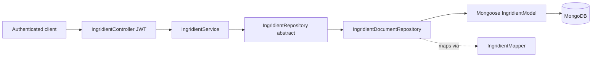

# Ingridient Module

The Ingridient module is the NestJS feature that owns the shared ingredient
catalog for the PantryChef API. It provides full CRUD over ingredient
definitions plus a small reference-data endpoint that clients use to populate the
ingredient-creation UI (the fixed category and unit lists). Like its sibling
backend modules it is organized in a layered shape — a thin JWT-guarded REST
controller, an application service, an abstract persistence contract, and a
Mongoose-backed document implementation. This README orients you to the module
before you read the source; cross-cutting detail lives in the repository-level
[architecture](../../../docs/ARCHITECTURE.md),
[API reference](../../../docs/API_REFERENCE.md), and
[data models](../../../docs/DATA_MODELS.md) documents.

## Purpose

The module provides an ingredient **catalog** — full CRUD over ingredient
definitions — together with a **reference-data endpoint** that returns the
hardcoded category and unit lists a client needs to render an
ingredient-creation form. It exposes a JWT-guarded REST surface and persists each
record to MongoDB through Mongoose.
Source: backend/src/ingridient/ingridient.controller.ts:L34-L37,
backend/src/ingridient/ingridient.service.ts:L11-L13.

**Spelling note (a deliberate, preserved fact — not a defect):** the module
directory and every code identifier are misspelled `ingridient` / `Ingridient`,
while the **served REST route base is the correctly-spelled `ingredient`**. Both
spellings are intentional and are reproduced verbatim throughout this document;
they are stable identifiers and are never renamed. The domain-model file is named
`domain/ingrident.ts` — misspelled *differently again* (`ingrident`, not
`ingridient`).
Source: backend/src/ingridient/domain/ingrident.ts:L12,
backend/src/ingridient/ingridient.controller.ts:L34-L37.

## Key components

Moving from the HTTP edge inward to persistence:

- **`IngridientModule`** — the feature composition root; it imports the
  persistence module, provides the service, registers the controller, and exports
  the service plus the persistence module for reuse.
  Source: backend/src/ingridient/ingridient.module.ts:L6-L12.
- **`IngridientController`** — the JWT-guarded REST controller, tagged
  `Ingredient` for Swagger.
  Source: backend/src/ingridient/ingridient.controller.ts:L31-L38.
- **`IngridientService`** — the application-layer coordinator that holds the
  existence checks and delegates persistence to the repository contract.
  Source: backend/src/ingridient/ingridient.service.ts:L11-L13.
- **`IngridientRepository`** (abstract) — the persistence contract the service
  depends on, free of any database details.
  Source: backend/src/ingridient/infrastructure/ingridient.repository.ts:L8-L33.
- **`IngridientDocumentRepository`** — the Mongoose-backed implementation of that
  contract.
  Source: backend/src/ingridient/infrastructure/document/repositories/ingridient.repository.ts:L13-L14.
- **`IngridientSchemaClass`** / **`IngridientSchema`** — the Mongoose entity and
  the schema built from it.
  Source: backend/src/ingridient/infrastructure/document/entities/ingridient.schema.ts:L16,
  backend/src/ingridient/infrastructure/document/entities/ingridient.schema.ts:L52-L54.
- **`IngridientMapper`** — maps between the document entity and the domain model.
  Source: backend/src/ingridient/infrastructure/document/mappers/ingridient.mapper.ts:L4-L5.
- **`DocumentIngridientPersistenceModule`** — registers the Mongoose model and
  binds the abstract repository to the document implementation.
  Source: backend/src/ingridient/infrastructure/document/document-persistence.module.ts:L10-L24.
- **`Ingridient`** (domain model) — the plain domain representation, declared in
  `domain/ingrident.ts` (note this filename is misspelled differently from the
  module).
  Source: backend/src/ingridient/domain/ingrident.ts:L2.
- **DTOs** — `create-ingridient.dto.ts`, `update-ingridient.dto.ts`, and
  `query-ingridient.dto.ts` define the request shapes (spellings preserved as in
  the codebase).
  Source: backend/src/ingridient/dto/create-ingridient.dto.ts:L21,
  backend/src/ingridient/dto/update-ingridient.dto.ts:L16,
  backend/src/ingridient/dto/query-ingridient.dto.ts:L45.

## Architecture fit

- The module is registered in the application root module as `IngridientModule`.
  Source: backend/src/app.module.ts:L31.
- It **exports** both `IngridientService` and
  `DocumentIngridientPersistenceModule`, so other modules can reuse the service
  and the bound repository without re-declaring them.
  Source: backend/src/ingridient/ingridient.module.ts:L10.
- The only module that currently imports `IngridientModule` is **`AiModule`**,
  which looks ingredients up while turning image-recognition results into known
  catalog entries.
  Source: backend/src/ai/ai.module.ts:L7.
- The internal flow follows the standard NestJS layering used across the backend:
  controller → service → abstract repository → document repository → Mongoose. For
  the system-wide view, see
  [docs/ARCHITECTURE.md](../../../docs/ARCHITECTURE.md).

## Data models

The in-memory domain representation is the `Ingridient` class, declared in
`domain/ingrident.ts`. `Reference` is the shared `{ id, name }` shape imported
from `src/common/types`.
Source: backend/src/ingridient/domain/ingrident.ts:L1,
backend/src/ingridient/domain/ingrident.ts:L2-L14.

| Field | Type | Notes |
|-------|------|-------|
| `id` | string | Document identifier (Mongo `_id` as a string). Source: backend/src/ingridient/domain/ingrident.ts:L3 |
| `name` | string | Ingredient name; uniqueness is enforced by the service on create. Source: backend/src/ingridient/domain/ingrident.ts:L4 |
| `category` | Reference | `{ id, name }` category descriptor. Source: backend/src/ingridient/domain/ingrident.ts:L5 |
| `quantity` | number (optional) | Optional quantity on hand. Source: backend/src/ingridient/domain/ingrident.ts:L6 |
| `unit` | Reference (optional) | `{ id, name }` unit descriptor. Source: backend/src/ingridient/domain/ingrident.ts:L7 |
| `expirationDate` | Date (optional) | Optional expiry date. Source: backend/src/ingridient/domain/ingrident.ts:L8 |
| `imageUrl` | string (optional) | Optional image URL. Source: backend/src/ingridient/domain/ingrident.ts:L9 |
| `confidence` | number | A 0–1 confidence score (set by AI capture). Source: backend/src/ingridient/domain/ingrident.ts:L10 |
| `createdAt` | Date | Creation timestamp. Source: backend/src/ingridient/domain/ingrident.ts:L11 |
| `updatedAt` | Date | Last-update timestamp. Source: backend/src/ingridient/domain/ingrident.ts:L12 |
| `deletedAt` | Date (optional) | Soft-delete marker. Source: backend/src/ingridient/domain/ingrident.ts:L13 |

The persisted entity `IngridientSchemaClass` mirrors these fields. Four of them —
`unit`, `expirationDate`, `imageUrl`, and `confidence` — are annotated
`@Exclude({ toPlainOnly: true })`, so they are omitted from the serialized JSON
returned to clients (they remain stored in MongoDB).
Source: backend/src/ingridient/infrastructure/document/entities/ingridient.schema.ts:L26-L40.

`confidence` is a 0–1 score: the schema stores it as a number and the create DTO
validates it with `@Min(0)` / `@Max(1)`.
Source: backend/src/ingridient/infrastructure/document/entities/ingridient.schema.ts:L38-L40,
backend/src/ingridient/dto/create-ingridient.dto.ts:L46-L55.

For the full, cross-module schema reference, see
[docs/DATA_MODELS.md](../../../docs/DATA_MODELS.md).

## API endpoints / public interface

All routes are served under the global `api` prefix with the route base
**`ingredient`** (correctly spelled) — there is **no version segment**. The
controller declares `version: '1'`, but `main.ts` never calls
`app.enableVersioning()`, so versioning is inactive and the version never appears
in the path.
Source: backend/src/main.ts:L14-L15,
backend/src/ingridient/ingridient.controller.ts:L34-L37.
Every route requires a Bearer JWT (`AuthGuard('jwt')` at controller scope).
Source: backend/src/ingridient/ingridient.controller.ts:L31-L32.
Full request/response detail lives in
[docs/API_REFERENCE.md](../../../docs/API_REFERENCE.md).

| Method & path | Description | Source |
|---------------|-------------|--------|
| `GET /api/ingredient/creation-data` | Returns the hardcoded categories and units used to populate the creation UI (see tables below). | backend/src/ingridient/ingridient.controller.ts:L41, L54-L69 |
| `POST /api/ingredient` | Create an ingredient; a duplicate `name` is rejected with `422 Unprocessable Entity`. | backend/src/ingridient/ingridient.controller.ts:L74-L80, backend/src/ingridient/ingridient.service.ts:L24-L34 |
| `GET /api/ingredient` | List ingredients; default `limit` is 10 and pagination is capped at 50 per page. | backend/src/ingridient/ingridient.controller.ts:L89-L90 |
| `GET /api/ingredient/:id` | Fetch a single ingredient by id. | backend/src/ingridient/ingridient.controller.ts:L106-L117 |
| `PATCH /api/ingredient/:id` | Partial update; a missing id is rejected with `422`. | backend/src/ingridient/ingridient.controller.ts:L119-L131, backend/src/ingridient/ingridient.service.ts:L69-L79 |
| `DELETE /api/ingredient/:id` | Soft-delete an ingredient; responds `204 No Content`. | backend/src/ingridient/ingridient.controller.ts:L133-L142 |

`GET /api/ingredient/creation-data` returns five hardcoded categories:

| id | name |
|----|------|
| 1 | spice |
| 2 | vegetable |
| 3 | fruit |
| 4 | dairy |
| 5 | protein |

…and nine hardcoded units:

| id | name |
|----|------|
| 1 | kg |
| 2 | g |
| 3 | lb |
| 4 | oz |
| 5 | ml |
| 6 | l |
| 7 | cup |
| 8 | tbsp |
| 9 | tsp |

Source: backend/src/ingridient/ingridient.controller.ts:L41,
backend/src/ingridient/ingridient.controller.ts:L54-L69.

## Configuration

The module defines no configuration of its own. It relies entirely on the shared
Mongoose connection (provided application-wide via `MongooseModule.forRootAsync`)
and the application-level JWT authentication; the feature only registers its model
with `MongooseModule.forFeature`.
Source: backend/src/ingridient/infrastructure/document/document-persistence.module.ts:L11-L15.
For environment setup (env copy, Docker Compose, seeding), see the
[backend README](../../README.md).

## Data flow

An authenticated request reaches `IngridientController`, which delegates to
`IngridientService`. The service calls the abstract `IngridientRepository`, which
dependency injection binds to `IngridientDocumentRepository`. That document
repository uses the Mongoose `IngridientModel` and converts documents to and from
the domain model with `IngridientMapper`.
Source: backend/src/ingridient/ingridient.controller.ts:L51,
backend/src/ingridient/ingridient.service.ts:L21,
backend/src/ingridient/infrastructure/document/repositories/ingridient.repository.ts:L22.

## Design patterns used

- **Repository pattern** — the abstract `IngridientRepository` is decoupled from
  its Mongoose implementation through a `provide` / `useClass` DI binding.
  Source: backend/src/ingridient/infrastructure/document/document-persistence.module.ts:L16-L22.
- **Mapper pattern** — `IngridientMapper.toDomain` and `toPersistence` translate
  between the persistence entity and the domain model.
  Source: backend/src/ingridient/infrastructure/document/mappers/ingridient.mapper.ts:L5,
  backend/src/ingridient/infrastructure/document/mappers/ingridient.mapper.ts:L27.
- **DTO validation** — class-validator / class-transformer decorators guard
  incoming payloads (for example, `confidence` is bounded to 0–1).
  Source: backend/src/ingridient/dto/create-ingridient.dto.ts:L46-L55.
- **Hardcoded reference-data endpoint** — `GET /creation-data` returns the
  category and unit lists straight from the controller rather than the database.
  Source: backend/src/ingridient/ingridient.controller.ts:L41-L72.
- **Pagination clamping** — the list `limit` is capped at 50.
  Source: backend/src/ingridient/ingridient.controller.ts:L89-L90.

## Known limitations / gaps

- Duplicate-`name` creation is rejected with `422 Unprocessable Entity`; there is
  no idempotent upsert, so the caller must handle the conflict.
  Source: backend/src/ingridient/ingridient.service.ts:L24-L34.
- The `creation-data` categories and units are **hardcoded in the controller**,
  not database-driven; changing the lists requires a code change and redeploy.
  Source: backend/src/ingridient/ingridient.controller.ts:L54-L69.
- **KNOWN ISSUE:** the `422` validation error payload is keyed under `email` (a
  copy-paste artifact) rather than `name` or `id`, on both the duplicate-create
  and the missing-id update paths. This is recorded as a documented fact; the code
  is left unchanged.
  Source: backend/src/ingridient/ingridient.service.ts:L29,
  backend/src/ingridient/ingridient.service.ts:L74.
- The misspellings `ingridient` / `Ingridient` (module, directory, types) and the
  differently-misspelled `ingrident.ts` (domain file) are intentional, stable
  identifiers — documented facts, not defects to be renamed.
  Source: backend/src/ingridient/domain/ingrident.ts:L2.

## Local development

- The ingredient catalog is seeded together with the rest of the document data:
  `npm run seed:run:document`.
  Source: backend/package.json:L16.
- The module's routes appear in the Swagger UI, which is mounted at **`/docs`**
  (not `/api/docs`). See
  [docs/API_REFERENCE.md](../../../docs/API_REFERENCE.md) for the full contract.
  Source: backend/src/main.ts:L31.
- Exercising the endpoints requires a running MongoDB instance and a valid Bearer
  JWT (obtain one through the Auth module). See the
  [backend README](../../README.md) for full setup — env copy, Docker Compose, and
  seeding.
