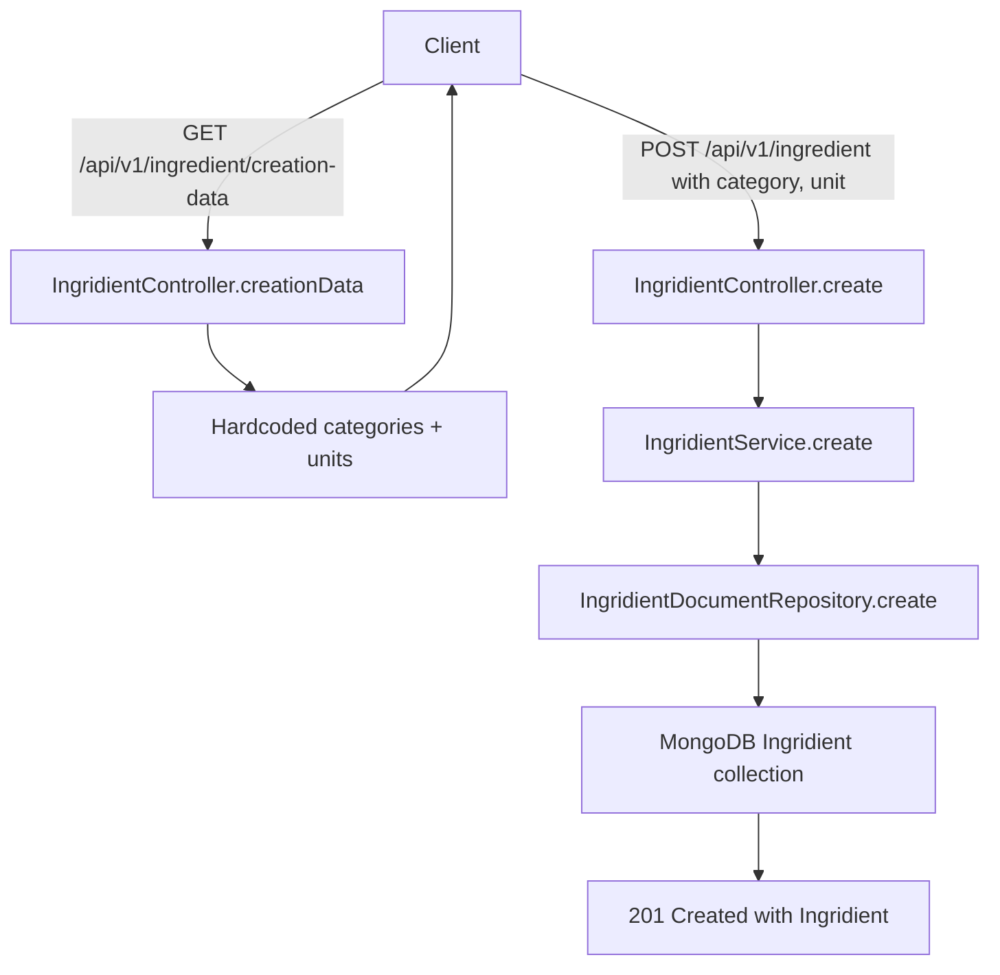

# Ingridient Module

## Module Purpose

The `Ingridient` module (spelling preserved verbatim throughout the backend
codebase — note the URL path uses the correct `ingredient` spelling at
`/api/v1/ingredient/*`) manages the catalog of base ingredients used by both the
`PantryIngridient` (spelling preserved verbatim) and `Recipe` modules. The
controller exposes six routes — five CRUD endpoints plus a `GET /creation-data`
route that returns hardcoded reference data (5 categories, 9 units) used by the
mobile client to populate ingredient-creation forms. Persistence runs through
`IngridientService` (spelling preserved verbatim) to the abstract
`IngridientRepository` (spelling preserved verbatim), with
`IngridientDocumentRepository` (spelling preserved verbatim) providing the
Mongoose backing; soft-delete is implemented properly via
`updateOne({ deletedAt: new Date() })` (Source:
`infrastructure/document/repositories/ingridient.repository.ts`), in contrast to
the destructive `softDelete` in the pantry module — both tracked in
[`../../../PRODUCTION_READINESS.md`](../../../PRODUCTION_READINESS.md) § Database.
The domain entity lives at `domain/ingrident.ts` — note the **filename** carries
an additional typo distinct from the `Ingridient` class spelling; both are
preserved verbatim.

## Key Components

| Component | File | Responsibility |
| --- | --- | --- |
| `IngridientController` | `ingridient.controller.ts` | Six endpoints under `/api/v1/ingredient` (URL spelling is correct `ingredient`) |
| `IngridientService` | `ingridient.service.ts` | Business orchestration; duplicate-name check and existence check before persistence |
| `IngridientRepository` (abstract) | `infrastructure/ingridient.repository.ts` | Abstract contract: create, findManyWithPagination, findOne, update, softDelete |
| `IngridientDocumentRepository` | `infrastructure/document/repositories/ingridient.repository.ts` | Mongoose implementation; proper soft-delete via `updateOne({ deletedAt: new Date() })` |
| `IngridientSchemaClass` | `infrastructure/document/entities/ingridient.schema.ts` | Mongoose schema with `Reference` typed `category` and `unit` |
| `IngridientMapper` | `infrastructure/document/mappers/ingridient.mapper.ts` | Static `toDomain` / `toPersistence` translation |
| `Ingridient` (domain) | `domain/ingrident.ts` | Domain entity. **Filename `ingrident.ts` carries an additional typo distinct from the `Ingridient` class spelling — preserved verbatim.** |
| DTOs | `dto/create-ingridient.dto.ts`, `dto/update-ingridient.dto.ts`, `dto/query-ingridient.dto.ts` | Validation contracts (create, partial update, paginated query) |

## Architecture Fit

Requests enter through `IngridientController` (spelling preserved verbatim) and
flow controller → service → abstract repository → document repository → MongoDB:
the controller delegates to `IngridientService` for business orchestration, which
calls the abstract `IngridientRepository` contract, bound at composition time to
`IngridientDocumentRepository` for Mongoose persistence. The one deviation from
this layering is the `GET /creation-data` endpoint, which returns hardcoded
category and unit data directly from the controller method without any database
lookup (Source: `ingridient.controller.ts`).

This module is consumed by:

- `AiModule` — calls `IngridientService.findManyWithPagination` to resolve labels detected by Google Cloud Vision into known Ingridients.
- `PantryModule` — each `PantryIngridient` (spelling preserved verbatim) embeds a `Reference` to an `Ingridient`.
- `RecipeModule` — the `IngridientList` (spelling preserved verbatim) sub-schema embeds a `Reference` to an `Ingridient`.

See [`../../../ARCHITECTURE.md`](../../../ARCHITECTURE.md) for the full system context and [`../../../DATA_MODEL.md`](../../../DATA_MODEL.md) § Ingridient for the schema reference.

## Dependencies

### Internal

- `MongooseModule.forFeature([{ name: IngridientSchemaClass.name, schema: IngridientSchema }])` — registered inside `DocumentIngridientPersistenceModule` (Source: `infrastructure/document/document-persistence.module.ts`).
- `DocumentIngridientPersistenceModule` — bound to provide `IngridientRepository` via `useClass: IngridientDocumentRepository` (Source: `infrastructure/document/document-persistence.module.ts`).

### External

| Package | Version | Used For |
|---|---|---|
| `@nestjs/common` | ^10.0.0 | `@Injectable`, `@Controller`, `HttpException`, `HttpStatus` |
| `@nestjs/mongoose` | ^10.1.0 | `@Prop`, `@Schema`, `SchemaFactory`, `InjectModel` |
| `@nestjs/swagger` | ^8.0.1 | `@ApiBearerAuth`, `@ApiOperation`, `@ApiParam`, `@ApiResponse`, `@ApiTags`, `PartialType` |
| `@nestjs/passport` | ^10.0.3 | `AuthGuard('jwt')` on the controller |
| `mongoose` | ^8.8.0 | Schema persistence, `HydratedDocument`, `Model`, `now` |
| `class-validator` | ^0.14.1 | DTO request validation (`IsNotEmpty`, `IsString`, `IsNumber`, `IsOptional`, `Min`, `Max`, `IsUrl`, `IsDateString`, `ValidateNested`) |
| `class-transformer` | ^0.5.1 | DTO transforms (`Transform`, `Type`, `plainToInstance`, `Exclude`) |

## Primary Use Cases

- Fetch the hardcoded creation reference data (5 categories + 9 units) via `GET /api/v1/ingredient/creation-data`.
- Create an `Ingridient` — validates uniqueness by `name` and throws HTTP 422 on conflict (error marker `ingridientAlreadyExists`).
- List/search `Ingridient` records (paginated, hard cap of 50 per page) with an optional name regex filter and sort directives.
- Fetch a single `Ingridient` by id.
- Update an `Ingridient` — an existence check throws HTTP 422 (`ingridientNotExists`) if the id is unknown.
- Soft-delete an `Ingridient` (proper `updateOne({ deletedAt })`, not destructive).

## API / Endpoint Reference

The global API prefix is `/api` (Source: `backend/env_example:L4`). The controller
declares `@Controller({ path: 'ingredient', version: '1' })` (Source:
`ingridient.controller.ts`) so all routes live at `/api/v1/ingredient/*`. The URL
spelling is the **correct** `ingredient` (English); only the class/module/file
identifiers carry the `Ingridient` variant spelling. The decorator is verbatim
from source (Source: `ingridient.controller.ts`):

```typescript
@Controller({
  path: 'ingredient',
  version: '1',
})
```

| Method | Path | Guard | Description |
| --- | --- | --- | --- |
| GET | `/api/v1/ingredient/creation-data` | `AuthGuard('jwt')` | Hardcoded categories + units reference data (Source: `ingridient.controller.ts`) |
| POST | `/api/v1/ingredient` | `AuthGuard('jwt')` | Create an Ingridient (Source: `ingridient.controller.ts`) |
| GET | `/api/v1/ingredient` | `AuthGuard('jwt')` | List/search with pagination (cap 50, Source: `ingridient.controller.ts`) |
| GET | `/api/v1/ingredient/:id` | `AuthGuard('jwt')` | Get an Ingridient by id (Source: `ingridient.controller.ts`) |
| PATCH | `/api/v1/ingredient/:id` | `AuthGuard('jwt')` | Update an Ingridient (Source: `ingridient.controller.ts`) |
| DELETE | `/api/v1/ingredient/:id` | `AuthGuard('jwt')` | Soft-delete (proper `updateOne({ deletedAt })`, Source: `ingridient.controller.ts`) |

## Data Flows

The diagram below shows the dual flow exercised by an ingredient-creation client: it first fetches the hardcoded reference data, then submits a new Ingridient that traverses controller → service → repository → MongoDB.



- **Categories** (5): `spice`, `vegetable`, `fruit`, `dairy`, `protein` (Source: `ingridient.controller.ts`)
- **Units** (9): `kg`, `g`, `lb`, `oz`, `ml`, `l`, `cup`, `tbsp`, `tsp` (Source: `ingridient.controller.ts`)

The Reference type used for `category` and `unit` fields is defined at `backend/src/common/types.ts` as `{ id: string; name: string }` — see [`../../../DATA_MODEL.md`](../../../DATA_MODEL.md) § Reference Type.

## Configuration

There are no module-specific environment variables; the `Ingridient` module relies on the global backend configuration:

- `DATABASE_URL` — the MongoDB connection consumed by the `IngridientSchemaClass` (spelling preserved verbatim) registration (Source: `backend/env_example:L11`).
- `API_PREFIX` — the global prefix `api` applied by `app.setGlobalPrefix(...)` in `backend/src/main.ts` (Source: `backend/env_example:L4`).

## Known Limitations and Implementation Gaps

> ⚠️ **Spelling `Ingridient` preserved verbatim** — every class, file, DTO, mapper, and schema in this module uses the variant spelling. The URL path uses the correct `ingredient` spelling. Do not rename — it is a stable API and database collection contract.

> ⚠️ **Additional filename typo `ingrident.ts`** — the domain entity file at `backend/src/ingridient/domain/ingrident.ts` carries an additional typo distinct from the `Ingridient` class spelling. The class is `Ingridient`; the filename drops the second `i`. Preserved verbatim.

> ⚠️ **Hardcoded category/unit reference data** — Source:
> `ingridient.controller.ts`. The 5 categories and 9 units are hardcoded inside
> the controller method; they are not seedable, not configurable, and not
> localized. Adding a new category requires a code deployment and full release
> cycle. No i18n support.

> ⚠️ **`Reference.id` typed as `string` but populated with integer** — the
> `Reference` type at `backend/src/common/types.ts` declares `id: string`, but the
> hardcoded reference data at `ingridient.controller.ts` emits integer ids (e.g.,
> `{ id: 1, name: 'spice' }`). Downstream code coerces as needed. See
> [`../../../DATA_MODEL.md`](../../../DATA_MODEL.md) § Reference Type for context.

## Production Readiness Status

> 🚧 **Data Model** — move the category and unit reference data out of the
> controller into a dedicated MongoDB collection or a configuration file. This
> enables i18n, operator-controlled extension, and decoupling reference data
> churn from code deploys. See
> [`../../../PRODUCTION_READINESS.md`](../../../PRODUCTION_READINESS.md) § Database.

> 🚧 **Validation** — consider replacing the free-text `category` and `unit` fields with strong enums or branded types. The current schema accepts any `Reference` payload, which permits arbitrary client-side category strings that diverge from the server-side hardcoded list.

> 🚧 **Migration** — the spelling `Ingridient` is a stable contract embedded in
> MongoDB collection names, TypeScript identifiers, and any external API consumers
> that depend on the JSON envelope. A future rename to the correct `Ingredient`
> spelling would require a coordinated migration of: collection rename (or alias),
> every backend identifier and file rename, mobile DTO updates, and (optionally)
> the URL path if API consumers depend on the verbatim spelling elsewhere. See
> [`../../../PRODUCTION_READINESS.md`](../../../PRODUCTION_READINESS.md) for
> migration considerations.
