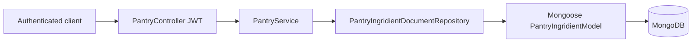

# Pantry Module

The Pantry module owns everything about the ingredients a user currently keeps
on hand. It is one of the backend feature modules of the PantryChef API and is
organized in the same layered shape as its siblings: a thin REST controller, an
application service, an abstract persistence contract, and a Mongoose-backed
document implementation. This README orients you to the module before you dive
into the source; deeper, cross-cutting detail lives in the repository-level
[architecture](../../../docs/ARCHITECTURE.md),
[API reference](../../../docs/API_REFERENCE.md), and
[data models](../../../docs/DATA_MODELS.md) documents.

## Purpose

The module provides per-user pantry management — full CRUD over the ingredients a
user has on hand, with every record scoped by `userId`. It exposes a JWT-guarded
REST surface and persists each entry to MongoDB through Mongoose.
Source: backend/src/pantry/pantry.controller.ts:L47,
backend/src/pantry/pantry.service.ts:L25.

## Key components

The module is composed of the following building blocks, moving from the HTTP
edge inward to persistence:

- **`PantryModule`** — the NestJS feature module that wires the persistence
  layer, service, and controller together.
  Source: backend/src/pantry/pantry.module.ts:L25.
- **`PantryController`** — the JWT-guarded REST controller that exposes the
  pantry routes.
  Source: backend/src/pantry/pantry.controller.ts:L47.
- **`PantryService`** — the application-layer coordinator that delegates to the
  repository contract.
  Source: backend/src/pantry/pantry.service.ts:L25.
- **`PantryRepository`** (abstract) — the persistence contract the service
  depends on, free of any database details.
  Source: backend/src/pantry/infrastructure/pantry.repository.ts:L11-L41.
- **`PantryIngridientDocumentRepository`** — the Mongoose-backed implementation
  of that contract.
  Source: backend/src/pantry/infrastructure/document/repositories/pantryIngridient.repository.ts:L23-L28.
- **`PantryIngridientSchemaClass`** — the Mongoose entity (persisted schema).
  Source: backend/src/pantry/infrastructure/document/entities/pantryIngridient.schema.ts:L16-L43.
- **`PantryIngridientMapper`** — maps between the domain model and the
  persistence entity.
  Source: backend/src/pantry/infrastructure/document/mappers/pantryIngridient.mapper.ts:L6-L48.
- **`PantryIngridient`** (domain model) — the plain domain representation used by
  the service and controller.
  Source: backend/src/pantry/domain/pantryIngridient.ts:L3-L14.
- **DTOs** — `create-pantry-ingridient.dto.ts`, `update-pantry-ingridient.dto.ts`,
  and `query-pantry-ingridient.dto.ts` define the request shapes (spellings
  preserved as in the codebase).
  Source: backend/src/pantry/dto/create-pantry-ingridient.dto.ts:L14,
  backend/src/pantry/dto/update-pantry-ingridient.dto.ts:L13,
  backend/src/pantry/dto/query-pantry-ingridient.dto.ts:L32.
- **`DocumentPantryPersistenceModule`** — binds the abstract `PantryRepository`
  to the document implementation and registers the schema.
  Source: backend/src/pantry/infrastructure/document/document-persistence.module.ts:L52.

## Architecture fit

- The module is registered in the application root module as `PantryModule`.
  Source: backend/src/app.module.ts:L62.
- Each pantry entry references the Ingridient catalog by ObjectId through its
  `ingridient` field (`ref: 'IngridientSchemaClass'`), so a pantry record points
  at a shared ingredient definition rather than duplicating it.
  Source: backend/src/pantry/infrastructure/document/entities/pantryIngridient.schema.ts:L17-L18.
  Those ingredient ids are read indirectly by the recipe matching engine; see
  [docs/ARCHITECTURE.md](../../../docs/ARCHITECTURE.md) for the cross-module view.
- Every route is JWT-guarded at controller scope via
  `@UseGuards(AuthGuard('jwt'))`.
  Source: backend/src/pantry/pantry.controller.ts:L47.

## Data models

The persisted entity is `PantryIngridientSchemaClass`, declared with
`@Schema({ timestamps: true, toJSON: { virtuals: true, getters: true } })`.
Source: backend/src/pantry/infrastructure/document/entities/pantryIngridient.schema.ts:L9-L15.
The in-memory domain representation is the `PantryIngridient` class.
Source: backend/src/pantry/domain/pantryIngridient.ts:L3-L14.

| Field | Type | Notes |
|-------|------|-------|
| `ingridient` | ObjectId | Reference to `IngridientSchemaClass` (the Ingridient catalog). Source: backend/src/pantry/infrastructure/document/entities/pantryIngridient.schema.ts:L24 |
| `quantity` | number | Amount of the ingredient on hand. Source: backend/src/pantry/infrastructure/document/entities/pantryIngridient.schema.ts:L28 |
| `userId` | string | Owner of the entry; all queries scope on this value. Source: backend/src/pantry/infrastructure/document/entities/pantryIngridient.schema.ts:L32 |
| `unit` | string | Unit of measure for the quantity. Source: backend/src/pantry/infrastructure/document/entities/pantryIngridient.schema.ts:L36 |
| `expirationDate` | Date (optional) | When the item expires. Source: backend/src/pantry/infrastructure/document/entities/pantryIngridient.schema.ts:L40 |
| `location` | enum | Storage location; see the enum table below. Source: backend/src/pantry/infrastructure/document/entities/pantryIngridient.schema.ts:L45 |
| `createdAt` | Date | Creation timestamp (`default: now`). Source: backend/src/pantry/infrastructure/document/entities/pantryIngridient.schema.ts:L49 |
| `updatedAt` | Date | Last-update timestamp (`default: now`). Source: backend/src/pantry/infrastructure/document/entities/pantryIngridient.schema.ts:L53 |
| `deletedAt` | Date (optional) | Soft-delete marker field (see Known limitations). Source: backend/src/pantry/infrastructure/document/entities/pantryIngridient.schema.ts:L57 |

A single-field index on `{ userId: 1 }` supports the per-user lookups described
above.
Source: backend/src/pantry/infrastructure/document/entities/pantryIngridient.schema.ts:L65.

The `location` field accepts exactly three values:

| Value | Meaning |
|-------|---------|
| `fridge` | Stored in the refrigerator |
| `freezer` | Stored in the freezer |
| `pantry` | Stored in the dry pantry |

The same three values are also declared on the create DTO and on the domain
model.
Source: backend/src/pantry/dto/create-pantry-ingridient.dto.ts:L34-L40,
backend/src/pantry/domain/pantryIngridient.ts:L11.
For the full, cross-module schema reference, see
[docs/DATA_MODELS.md](../../../docs/DATA_MODELS.md).

## API endpoints / public interface

All routes are served under the global `api` prefix as **`/api/pantry`** — there
is no version segment. The controller declares `version: '1'`, but `main.ts` never
calls `app.enableVersioning()`, so versioning is inactive.
Source: backend/src/main.ts:L26-L35,
backend/src/pantry/pantry.controller.ts:L47.
Every endpoint requires a Bearer JWT.

| Method & path | Description | Source |
|---------------|-------------|--------|
| `POST /api/pantry` | Create a pantry entry; `userId` is taken from the authenticated request, not the body. | backend/src/pantry/pantry.controller.ts:L59-L68 (userId at L66) |
| `GET /api/pantry` | List entries; pagination is capped at 50 items per page (default 10); the filter is scoped to `userId`. | backend/src/pantry/pantry.controller.ts:L79-L107 |
| `GET /api/pantry/:id` | Fetch a single entry by id. | backend/src/pantry/pantry.controller.ts:L115-L126 |
| `PATCH /api/pantry/:id` | Partial update; throws `422` when the record does not exist. | backend/src/pantry/pantry.controller.ts:L138-L150, backend/src/pantry/pantry.service.ts:L108-L133 |
| `DELETE /api/pantry/:id` | Delete an entry; responds `204 No Content`. | backend/src/pantry/pantry.controller.ts:L158-L171 |

For the complete request/response catalog, see
[docs/API_REFERENCE.md](../../../docs/API_REFERENCE.md).

## Configuration

The module defines no environment variables of its own. It relies entirely on the
shared Mongoose connection and the JWT authentication configured at the
application level. Incoming request bodies are validated by the global
`ValidationPipe`, and the schema is registered through
`MongooseModule.forFeature`.
Source: backend/src/pantry/infrastructure/document/document-persistence.module.ts:L52.
For environment setup (env copy, Docker Compose, seeding), see the
[backend README](../../README.md).

## Data flow

An authenticated HTTP request reaches `PantryController`, which delegates to
`PantryService`.
Source: backend/src/pantry/pantry.controller.ts:L47.
The service calls the abstract `PantryRepository`.
Source: backend/src/pantry/pantry.service.ts:L25.
That contract is bound to `PantryIngridientDocumentRepository` through dependency
injection.
Source: backend/src/pantry/infrastructure/document/document-persistence.module.ts:L52.
The document repository then uses the Mongoose `PantryIngridientModel` and
converts results with `PantryIngridientMapper`.
Source: backend/src/pantry/infrastructure/document/repositories/pantryIngridient.repository.ts:L18-L30.

## Design patterns used

- **Repository pattern** — the abstract `PantryRepository` is decoupled from its
  Mongoose implementation through a DI token binding.
  Source: backend/src/pantry/infrastructure/document/document-persistence.module.ts:L52.
- **Mapper pattern** — `PantryIngridientMapper.toDomain` and `toPersistence`
  translate between the domain and persistence shapes.
  Source: backend/src/pantry/infrastructure/document/mappers/pantryIngridient.mapper.ts:L10,
  backend/src/pantry/infrastructure/document/mappers/pantryIngridient.mapper.ts:L25.
- **DTO validation** — class-validator decorators guard incoming payloads.
  Source: backend/src/pantry/dto/create-pantry-ingridient.dto.ts:L11-L41.
- **`userId` scoping** — the owner id is injected from the JWT request rather
  than trusted from the client payload.
  Source: backend/src/pantry/pantry.controller.ts:L41, L52.
- **Pagination clamping** — the list `limit` is capped at 50.
  Source: backend/src/pantry/pantry.controller.ts:L59.
- **JWT guard** — `AuthGuard('jwt')` is applied at controller scope.
  Source: backend/src/pantry/pantry.controller.ts:L47.

## Known limitations / gaps

- **KNOWN ISSUE:** the document repository's `softDelete(id)` performs a **hard
  delete** via `deleteOne({ _id: id })` — the record is physically removed even
  though the schema declares a `deletedAt` field, so it is **not** a true soft
  delete.
  Source: backend/src/pantry/infrastructure/document/repositories/pantryIngridient.repository.ts:L184
  (method spans L119-L123). See the soft-delete-vs-hard-delete matrix in
  [docs/DATA_MODELS.md](../../../docs/DATA_MODELS.md).
- **KNOWN ISSUE:** the list filter is scoped **only by `userId`**.
  `FilterPantryIngridientDto` declares an `id` field, but the document
  repository's `findManyWithPagination` does **not** apply it — `id` is
  declared-but-unused.
  Source: backend/src/pantry/infrastructure/document/repositories/pantryIngridient.repository.ts:L142-L143,
  backend/src/pantry/dto/query-pantry-ingridient.dto.ts:L13-L17.

## Local development

- Sample pantry data is provided by the document seed: `npm run seed:run:document`.
  Source: backend/package.json:L16.
- Exercising the endpoints requires a running MongoDB instance and a valid Bearer
  JWT (obtain a token through the Auth module). See the
  [backend README](../../README.md) for full setup — env copy, Docker Compose,
  and seeding — and [docs/API_REFERENCE.md](../../../docs/API_REFERENCE.md) for
  the authentication flow.
