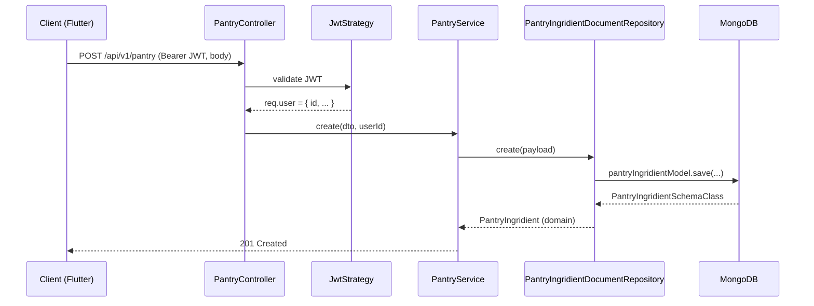

# Pantry Module

## Module Purpose

The `pantry/` module manages `PantryIngridient` (spelling preserved verbatim throughout the backend codebase) records keyed by `userId`. It supports full CRUD plus location categorization (`fridge` / `freezer` / `pantry`), feeding both the HTTP surface at `/api/v1/pantry/*` and the pantry-aware recipe matching pipeline in `RecipeService.matches()`. The module exposes five authenticated endpoints, scopes every query to `req.user?.id` (populated by `JwtStrategy`), and caps page sizes at 50. It is notable for a **destructive `softDelete` that calls `deleteOne` (physically destructive despite its name)** — see [Known Limitations](#known-limitations-and-implementation-gaps).

## Key Components

| Component | File | Responsibility |
| --- | --- | --- |
| `PantryController` | `pantry.controller.ts` | Routes `/api/v1/pantry/*`, all guarded by `AuthGuard('jwt')`. `userId` injected from `req.user?.id`; pagination cap 50 (Source: `pantry.controller.ts`). |
| `PantryService` | `pantry.service.ts` | Business orchestration over `PantryRepository`; throws `UNPROCESSABLE_ENTITY` on update of missing records (Source: `pantry.service.ts`). |
| `PantryRepository` (abstract) | `infrastructure/pantry.repository.ts` | Abstract repository contract (Source: `infrastructure/pantry.repository.ts`). |
| `PantryIngridientDocumentRepository` | `infrastructure/document/repositories/pantryIngridient.repository.ts` | Mongoose-backed implementation. **`softDelete` is physically destructive — see Known Limitations.** |
| `PantryIngridientSchemaClass` | `infrastructure/document/entities/pantryIngridient.schema.ts` | `@Schema({ timestamps: true })`, `location` enum (`fridge` / `freezer` / `pantry`), `userId` index. |
| `PantryIngridientMapper` | `infrastructure/document/mappers/pantryIngridient.mapper.ts` | Bidirectional mapping between schema document and domain entity. |
| `PantryIngridient` (domain) | `domain/pantryIngridient.ts` | Domain entity returned by the service to the controller. |
| DTOs | `dto/create-pantry-ingridient.dto.ts`, `dto/update-pantry-ingridient.dto.ts`, `dto/query-pantry-ingridient.dto.ts` | Validation contracts via `class-validator` and Swagger metadata. |
| `DocumentPantryPersistenceModule` | `infrastructure/document/document-persistence.module.ts` | Wires `PantryRepository` ↔ `PantryIngridientDocumentRepository`. |

## Architecture Fit

This module follows the canonical NestJS layering: **controller → service → abstract repository → document repository → MongoDB**. `PantryController` accepts validated DTOs and delegates to `PantryService`, which composes business rules — e.g., the pre-flight `findOne` in `update` that throws `UNPROCESSABLE_ENTITY` for a missing target (Source: `pantry.service.ts`). The service depends on the abstract `PantryRepository`, bound at composition time inside `DocumentPantryPersistenceModule` to its Mongoose implementation `PantryIngridientDocumentRepository` (spelling preserved verbatim) (Source: `document-persistence.module.ts`). User scoping derives from `req.user?.id` (populated by `JwtStrategy`), propagated through `filterOptions.userId` and the create payload (Source: `pantry.service.ts`). `findAllByUserId(userId)` is consumed by `RecipeService.matches()` to seed the matching pipeline — a data-provider role beyond this module's HTTP surface. The `index({ userId: 1 })` supports user-scoped queries, since `userId` is a String scalar, not an `ObjectId` (Source: `pantryIngridient.schema.ts`). See [`../../../ARCHITECTURE.md`](../../../ARCHITECTURE.md) § JWT Authentication Flow and § Soft-Delete Contract — the contract this module violates.

## Dependencies

### Internal
- `MongooseModule.forFeature([PantryIngridientSchemaClass])` (spelling preserved verbatim) and the abstract→concrete `PantryRepository` binding are registered in `DocumentPantryPersistenceModule` (Source: `infrastructure/document/document-persistence.module.ts`).
- `PantryModule` is consumed by `RecipeModule`: `RecipeService.matches()` invokes `PantryService.findAllByUserId(userId)`. See [`../../../ARCHITECTURE.md`](../../../ARCHITECTURE.md) § Recipe Matching Pipeline.

### External
| Package | Version | Source |
| --- | --- | --- |
| `@nestjs/common` | `^10.0.0` | `backend/package.json` |
| `@nestjs/mongoose` | `^10.1.0` | `backend/package.json` |
| `mongoose` | `^8.8.0` | `backend/package.json` |
| `class-validator` | `^0.14.1` | `backend/package.json` |
| `@nestjs/swagger` | `^8.0.1` | `backend/package.json` |
| `@nestjs/passport` | `^10.0.3` | `backend/package.json` (used for `AuthGuard('jwt')`) |

## Primary Use Cases

- **Add pantry item** — `POST /api/v1/pantry` with body `CreatePantryIngridientDto` (spelling preserved verbatim); `userId` comes from the JWT, not the request body (Source: `pantry.controller.ts`).
- **List the authenticated user's pantry** — `GET /api/v1/pantry`, paginated and capped at 50 records (Source: `pantry.controller.ts`).
- **Fetch a specific pantry item** — `GET /api/v1/pantry/:id` (Source: `pantry.controller.ts`).
- **Update a pantry item** — `PATCH /api/v1/pantry/:id` with a partial body; throws `UNPROCESSABLE_ENTITY` (message `pantryIngridientNotExists`) when the id does not exist (Source: `pantry.service.ts`).
- **"Soft"-delete a pantry item** — `DELETE /api/v1/pantry/:id` — **currently DESTRUCTIVE; see [Known Limitations](#known-limitations-and-implementation-gaps)**.

Separately, `findAllByUserId(userId)` feeds `RecipeService.matches()`; it is not an HTTP endpoint (Source: `pantry.service.ts`).

## API / Endpoint Reference

| Method | Path | Guard | Description |
| --- | --- | --- | --- |
| `POST` | `/api/v1/pantry` | `AuthGuard('jwt')` | Add a pantry item. Body: `CreatePantryIngridientDto`. |
| `GET` | `/api/v1/pantry` | `AuthGuard('jwt')` | List user's pantry. Query: `QueryPantryIngridientDto` (pagination, filters, sort). Cap 50. |
| `GET` | `/api/v1/pantry/:id` | `AuthGuard('jwt')` | Fetch one pantry item. |
| `PATCH` | `/api/v1/pantry/:id` | `AuthGuard('jwt')` | Partially update a pantry item. Body: `UpdatePantryIngridientDto`. |
| `DELETE` | `/api/v1/pantry/:id` | `AuthGuard('jwt')` | "Soft"-delete a pantry item — **currently DESTRUCTIVE** (Source: `infrastructure/document/repositories/pantryIngridient.repository.ts`). |

All routes are under `@Controller({ path: 'pantry', version: '1' })` with class-level `@UseGuards(AuthGuard('jwt'))` and `@ApiBearerAuth()` (Source: `pantry.controller.ts`).

## Data Flows



The diagram shows the canonical create path. `findAll`, `findOne`, `update`, and `softDelete` share the same controller → service → repository → MongoDB topology; `softDelete` notably calls `deleteOne` instead of the expected `updateOne({ deletedAt: new Date() })` — see [Known Limitations](#known-limitations-and-implementation-gaps).

## Configuration

The pantry module declares no module-specific environment variables; it inherits these globals:

| Env Var | Default | Source | Effect |
| --- | --- | --- | --- |
| `DATABASE_URL` | `mongodb://localhost:27017` | `backend/env_example:L11` | Mongoose connection used by `PantryIngridientSchema`. |
| `API_PREFIX` | `api` | `backend/env_example:L4` | Global route prefix prepended to `/pantry`. |

The `location` enum values `'fridge' | 'freezer' | 'pantry'` are validated at the Mongoose schema level (Source: `infrastructure/document/entities/pantryIngridient.schema.ts`); the `index({ userId: 1 })` in the same file backs user-scoped queries.

## Known Limitations and Implementation Gaps

> ⚠️ **Destructive `softDelete`** — Source: `backend/src/pantry/infrastructure/document/repositories/pantryIngridient.repository.ts`. `softDelete(id)` calls `deleteOne({ _id: id })`, NOT `updateOne({ deletedAt: new Date() })`, so the item is **physically removed** from MongoDB despite its name. This violates the soft-delete contract in [`../../../ARCHITECTURE.md`](../../../ARCHITECTURE.md) § Soft-Delete Contract and the `deletedAt` convention shared across all five schemas (see [`../../../DATA_MODEL.md`](../../../DATA_MODEL.md)). Flagged inline with `// FIXME:` and `// TODO(prod):` — **DO NOT FIX in this documentation pass**.
>
> Verbatim excerpt (Source: `pantryIngridient.repository.ts`):
>
> ```typescript
>   async softDelete(id: PantryIngridient['id']): Promise<void> {
>     await this.pantryIngridientModel.deleteOne({
>       _id: id,
>     });
>   }
> ```

> ⚠️ **`location` enum validation is Mongoose-level only** — Source: `dto/create-pantry-ingridient.dto.ts` and `dto/update-pantry-ingridient.dto.ts`. The DTOs apply `@IsString()` to `location` but not `@IsEnum(['fridge', 'freezer', 'pantry'])`. Invalid values are caught by Mongoose at write time, not by `ValidationPipe` — yielding a 500-class persistence error instead of a 400 at the request layer.

> ⚠️ **`PantryIngridient` spelling preserved verbatim** — every class (`PantryIngridient`, `PantryIngridientSchemaClass`, `PantryIngridientDocumentRepository`, `PantryIngridientMapper`), every module file (`pantry.*.ts`, `pantryIngridient.*.ts`, `pantry.repository.ts`), and all three DTOs embed the misspelled `Ingridient`. Do not rename — these identifiers are stable contracts. Each affected `.ts` file carries an inline `// NOTE:` annotation at its first preserved-spelling occurrence.

## Production Readiness Status

> 🚧 **Database — Implement true soft-delete.** Replace `deleteOne({ _id: id })` at `infrastructure/document/repositories/pantryIngridient.repository.ts` with `updateOne({ _id: id }, { deletedAt: new Date() })`. All `find*` queries already filter `deletedAt: null` (`findManyWithPagination` and `findAllByUserId`). See [`../../../PRODUCTION_READINESS.md`](../../../PRODUCTION_READINESS.md) § Database for the consolidated checklist.

> 🚧 **Validation — Enforce `location` enum at the request layer.** Add `@IsEnum(['fridge', 'freezer', 'pantry'])` to `location` on both `CreatePantryIngridientDto` and `UpdatePantryIngridientDto` so `ValidationPipe` rejects invalid values with a 400 before they reach the service. See [`../../../PRODUCTION_READINESS.md`](../../../PRODUCTION_READINESS.md) § Security Hardening for related guidance.

> 🚧 **Data recovery — until soft-delete is implemented, deleted pantry items are unrecoverable.** The development `docker-compose.yml` MongoDB volume has no backup or point-in-time recovery. Production must pair the soft-delete fix with managed backups (e.g., MongoDB Atlas). See [`../../../PRODUCTION_READINESS.md`](../../../PRODUCTION_READINESS.md) § Infrastructure & Orchestration and § Database.
