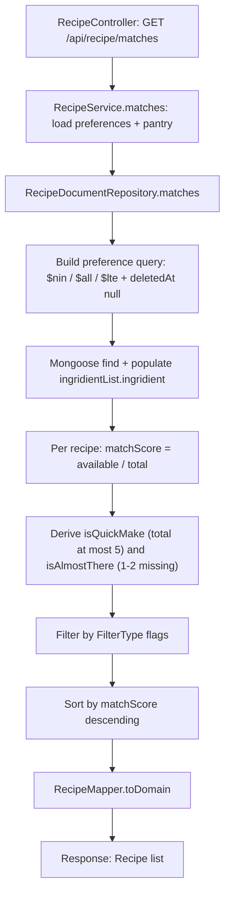

# Recipe Module

The Recipe module is the NestJS feature that stores recipes and ranks them against a
user's pantry and dietary preferences. This README explains what the module does, how it
is wired into the wider backend, and where each behavior lives in the source. For the
system-wide picture, the full REST contract, and the persistence reference, follow the
links into the [`docs/`](../../../docs/ARCHITECTURE.md) knowledge base from the relevant
sections below.

## Purpose

The Recipe module owns recipe persistence (full CRUD) and the **ingredient-matching
engine** that ranks stored recipes by how well they match a user's pantry contents and
dietary preferences. The matching engine is the module's most intricate logic: it scores
each recipe by ingredient availability and derives quick-make and almost-there hints.
Source: backend/src/recipe/infrastructure/document/repositories/recipe.repository.ts:L166-L271.
The HTTP surface that exposes both the CRUD routes and the matching route is the
`RecipeController`. Source: backend/src/recipe/recipe.controller.ts:L34-L107.

## Key components

| Component | Responsibility | Source |
|-----------|----------------|--------|
| `RecipeModule` | Feature module / DI composition root wiring the controller, service, and persistence module. | Source: backend/src/recipe/recipe.module.ts:L32 |
| `RecipeController` | JWT-guarded HTTP surface for the recipe routes. | Source: backend/src/recipe/recipe.controller.ts:L49 |
| `RecipeService` | Business orchestration: duplicate-title guard, and preference/pantry loading for matching. | Source: backend/src/recipe/recipe.service.ts:L24 |
| `RecipeRepository` (abstract) | Persistence contract that decouples the service from Mongoose. | Source: backend/src/recipe/infrastructure/recipe.repository.ts:L24 |
| `RecipeDocumentRepository` | Mongoose implementation of the contract; hosts the matching engine. | Source: backend/src/recipe/infrastructure/document/repositories/recipe.repository.ts:L32 |
| `RecipeSchemaClass` | Mongoose schema with the embedded subdocuments `IngridientList` (sic) and `Instruction`. | Source: backend/src/recipe/infrastructure/document/entities/recipe.schema.ts:L81,L12,L45 |
| `RecipeMapper` | Maps persistence documents to and from the domain model. | Source: backend/src/recipe/infrastructure/document/mappers/recipe.mapper.ts:L12 |
| `Recipe` (domain) | Framework-free domain model; references the `Ingridient` type imported from `src/ingridient/domain/ingrident` (sic). | Source: backend/src/recipe/domain/recipe.ts:L15,L15 |
| DTOs | `create-recipe.dto.ts`, `update-recipe.dto.ts`, and `query-recipe.dto.ts` define request shapes and validation. | Source: backend/src/recipe/dto/create-recipe.dto.ts:L86, backend/src/recipe/dto/update-recipe.dto.ts:L16, backend/src/recipe/dto/query-recipe.dto.ts:L57 |
| `FilterType` | Query shape for `GET /matches` (`isQuickMake` / `isAlmostThere`). | Source: backend/src/recipe/types/filter.types.ts:L9 |
| `DocumentPantryPersistenceModule` | Binds the abstract repository token to the document implementation and registers the Mongoose model. The class name retains "Pantry" although it belongs to the recipe feature, and is preserved as a stable identifier. | Source: backend/src/recipe/infrastructure/document/document-persistence.module.ts:L39 |

## Architecture fit

`RecipeModule` is registered in the application root module alongside the other feature
modules. Source: backend/src/app.module.ts:L32. It imports
`DocumentPantryPersistenceModule`, `UsersModule`, and `PantryModule`.
Source: backend/src/recipe/recipe.module.ts:L32. These imports exist because the matching
engine depends on **Users** (to read the caller's `preferences`) and on **Pantry** (to
read the caller's available ingredients) before delegating the scoring to the repository.
Source: backend/src/recipe/recipe.service.ts:L66-L75.

Every route is JWT-guarded by a class-level `@UseGuards(AuthGuard('jwt'))`, so all
endpoints require a valid bearer token. Source: backend/src/recipe/recipe.controller.ts:L49.

For the system-wide layering (Flutter client to NestJS REST to MongoDB) and how this
module sits within it, see [`../../../docs/ARCHITECTURE.md`](../../../docs/ARCHITECTURE.md).

## Data models

The persisted entity is `RecipeSchemaClass`. The misspelled property `ingridientList`
and the embedded class `IngridientList` are stable identifiers and are preserved exactly
as they appear in the source. The full cross-module schema reference lives in
[`../../../docs/DATA_MODELS.md`](../../../docs/DATA_MODELS.md).

**`Recipe` entity fields:**

| Field | Type | Notes | Source |
|-------|------|-------|--------|
| `title` | `string` | Required; unique titles are enforced at the service layer. | Source: backend/src/recipe/infrastructure/document/entities/recipe.schema.ts:L88 |
| `description` | `string` | Free-text description. | Source: backend/src/recipe/infrastructure/document/entities/recipe.schema.ts:L92 |
| `ingridientList` (sic) | `IngridientList[]` | Embedded ingredient lines; required. | Source: backend/src/recipe/infrastructure/document/entities/recipe.schema.ts:L96 |
| `instructions` | `Instruction[]` | Embedded ordered steps; required. | Source: backend/src/recipe/infrastructure/document/entities/recipe.schema.ts:L100 |
| `prepTime` | `number` | Preparation time in minutes. | Source: backend/src/recipe/infrastructure/document/entities/recipe.schema.ts:L104 |
| `cookTime` | `number` | Cooking time in minutes; used by the `$lte` preference filter. | Source: backend/src/recipe/infrastructure/document/entities/recipe.schema.ts:L108 |
| `servings` | `number` | Number of servings. | Source: backend/src/recipe/infrastructure/document/entities/recipe.schema.ts:L112 |
| `difficulty` | `Difficulty` | Required; one of the enum values listed below. | Source: backend/src/recipe/infrastructure/document/entities/recipe.schema.ts:L116 |
| `tags` | `string[]` | Free-form tags; matched by the dietary `$all` filter. | Source: backend/src/recipe/infrastructure/document/entities/recipe.schema.ts:L120 |
| `imageUrl` | `string` | Image URL. | Source: backend/src/recipe/infrastructure/document/entities/recipe.schema.ts:L124 |
| `matchScore?` | `number` | Optional; populated by the matching engine (range 0 to 1). | Source: backend/src/recipe/infrastructure/document/entities/recipe.schema.ts:L91-L92 |
| `createdAt` / `updatedAt` | `Date` | Mongoose timestamps. | Source: backend/src/recipe/infrastructure/document/entities/recipe.schema.ts:L132 |
| `deletedAt?` | `Date` | Soft-delete marker; `null` for live records. | Source: backend/src/recipe/infrastructure/document/entities/recipe.schema.ts:L100-L101 |

**`IngridientList` (sic) subdocument fields:**

| Field | Type | Notes | Source |
|-------|------|-------|--------|
| `ingridient` | ObjectId ref `IngridientSchemaClass` | Reference to an ingredient document; required. | Source: backend/src/recipe/infrastructure/document/entities/recipe.schema.ts:L19 |
| `amount` | `number` | Required. | Source: backend/src/recipe/infrastructure/document/entities/recipe.schema.ts:L23 |
| `unit` | `string` | Required. | Source: backend/src/recipe/infrastructure/document/entities/recipe.schema.ts:L27 |
| `required` | `boolean` | Whether the ingredient is mandatory. | Source: backend/src/recipe/infrastructure/document/entities/recipe.schema.ts:L31 |
| `substitutes?` | `string[]` | Optional; defaults to `[]`. | Source: backend/src/recipe/infrastructure/document/entities/recipe.schema.ts:L34-L35 |

**`Instruction` subdocument fields:**

| Field | Type | Notes | Source |
|-------|------|-------|--------|
| `step` | `number` | Step number; required. | Source: backend/src/recipe/infrastructure/document/entities/recipe.schema.ts:L48 |
| `description` | `string` | Step text; required. | Source: backend/src/recipe/infrastructure/document/entities/recipe.schema.ts:L52 |
| `timer?` | `number` | Optional per-step timer. | Source: backend/src/recipe/infrastructure/document/entities/recipe.schema.ts:L38-L39 |

**`difficulty` enum values:**

| Enum | Allowed values | Source |
|------|----------------|--------|
| `Difficulty` | `easy`, `medium`, `hard` | Source: backend/src/recipe/infrastructure/document/entities/recipe.schema.ts:L60,L115 |

A single secondary index is declared on `{ title: 1 }`.
Source: backend/src/recipe/infrastructure/document/entities/recipe.schema.ts:L108.

## API endpoints / public interface

All routes are served under the global `api` prefix as `/api/recipe`. The
controller declares `@Controller({ path: 'recipe', version: '1' })`, but `main.ts`
sets only a global prefix and never enables versioning, so the `version: '1'`
declaration is inert and no version segment appears in the served path.
Source: backend/src/main.ts:L26-L35.

| Method | Path | Description | Notes / Source |
|--------|------|-------------|----------------|
| `POST` | `/api/recipe` | Create a recipe. | A duplicate `title` returns **422 Unprocessable Entity**. Source: backend/src/recipe/recipe.service.ts:L30-L40; controller Source: backend/src/recipe/recipe.controller.ts:L63-L67 |
| `GET` | `/api/recipe/matches` | Run the matching engine; query is `FilterType` (`isQuickMake` / `isAlmostThere`). | Declared **before** `:id` so the literal path is not shadowed by the parameter route. Source: backend/src/recipe/recipe.controller.ts:L85-L90 |
| `GET` | `/api/recipe` | Paginated list of live recipes. | **Pagination is capped at 50** (Source: backend/src/recipe/recipe.controller.ts:L111-L113); soft-deleted recipes are excluded via `deletedAt: null` (Source: backend/src/recipe/infrastructure/document/repositories/recipe.repository.ts:L127). |
| `GET` | `/api/recipe/:id` | Fetch a single recipe by id. | Source: backend/src/recipe/recipe.controller.ts:L138-L147 |
| `PATCH` | `/api/recipe/:id` | Update a recipe. | Returns **422** when the id does not exist. Source: backend/src/recipe/recipe.service.ts:L131-L151 |
| `DELETE` | `/api/recipe/:id` | Soft-delete a recipe; responds **204 No Content**. | Source: backend/src/recipe/recipe.controller.ts:L187-L196 |

Full request and response payloads for each endpoint are documented in
[`../../../docs/API_REFERENCE.md`](../../../docs/API_REFERENCE.md).

## Configuration

The module carries no module-specific configuration. It relies on the application-wide
Mongoose connection — its persistence module registers the `RecipeSchemaClass` model with
`MongooseModule.forFeature` against the shared connection — and on the global JWT
`AuthGuard('jwt')` applied at the controller.
Source: backend/src/recipe/infrastructure/document/document-persistence.module.ts:L39.

## Data flow

Two request paths exist. Standard CRUD flows controller to service to repository to
Mongoose: the controller delegates to `RecipeService`, which delegates to the abstract
`RecipeRepository` that the DI container resolves to `RecipeDocumentRepository`.

The matching pipeline behind `GET /api/recipe/matches` is the module's defining logic.
`RecipeService.matches` first loads the caller's `preferences` from Users and the caller's
pantry ingredients from Pantry, then calls the repository.
Source: backend/src/recipe/recipe.service.ts:L66-L75. Inside
`RecipeDocumentRepository.matches` the pipeline proceeds as follows.

The repository first collects the pantry ingredient ids up front
(Source: backend/src/recipe/infrastructure/document/repositories/recipe.repository.ts:L173),
then composes a Mongoose query from the caller's preferences. The table below lists every
query filter the module builds, including the two filters used by the paginated list route.

| Filter | Mongo operator | Applied to field | Used by | Source |
|--------|----------------|------------------|---------|--------|
| Excluded ingredients (allergies + disliked) | `$nin` | `ingridientList.ingridient` | `GET /api/recipe/matches` | Source: backend/src/recipe/infrastructure/document/repositories/recipe.repository.ts:L189 |
| Dietary tags | `$all` | `tags` | `GET /api/recipe/matches` | Source: backend/src/recipe/infrastructure/document/repositories/recipe.repository.ts:L195 |
| Cooking-time bound | `$lte` | `cookTime` | `GET /api/recipe/matches` | Source: backend/src/recipe/infrastructure/document/repositories/recipe.repository.ts:L201 |
| Soft-delete exclusion | equals `null` | `deletedAt` | `GET /api/recipe/matches` and list | Source: backend/src/recipe/infrastructure/document/repositories/recipe.repository.ts:L177 (matches), L127 (list) |
| Name search (KNOWN ISSUE) | `$regex` (case-insensitive) on a `name` key that `RecipeSchemaClass` does not declare (its title field is `title`), so it matches no recipes by title | `GET /api/recipe` list | Source: backend/src/recipe/infrastructure/document/repositories/recipe.repository.ts:L115, backend/src/recipe/infrastructure/document/entities/recipe.schema.ts:L86-L88 |
| Id set | `$in` | `_id` | `GET /api/recipe` list | Source: backend/src/recipe/infrastructure/document/repositories/recipe.repository.ts:L119 |

After the query runs, the repository scores each returned recipe in application code:

- For each recipe, `totalIngredients = ingridientList.length`. Source: backend/src/recipe/infrastructure/document/repositories/recipe.repository.ts:L215.
- An ingredient counts as available by **exact `_id` match**, `pantryIngredientIds.includes(il.ingridient._id.toString())`. Source: backend/src/recipe/infrastructure/document/repositories/recipe.repository.ts:L222-L224.
- `matchScore = availableIngredients.length / totalIngredients` (range 0 to 1). Source: backend/src/recipe/infrastructure/document/repositories/recipe.repository.ts:L231.
- `isQuickMake = totalIngredients <= 5`. Source: backend/src/recipe/infrastructure/document/repositories/recipe.repository.ts:L234.
- `isAlmostThere` is true when 1 to 2 ingredients are missing. Source: backend/src/recipe/infrastructure/document/repositories/recipe.repository.ts:L237-L238.
- Filter by the `FilterType` flags. Source: backend/src/recipe/infrastructure/document/repositories/recipe.repository.ts:L152-L166.
- **Sort by `matchScore` descending**. Source: backend/src/recipe/infrastructure/document/repositories/recipe.repository.ts:L266.
- Map documents to domain via `RecipeMapper.toDomain`. Source: backend/src/recipe/infrastructure/document/repositories/recipe.repository.ts:L268.

*Recipe-match flow from controller to Mongoose and back.
Source: backend/src/recipe/recipe.controller.ts:L43-L48 and
backend/src/recipe/infrastructure/document/repositories/recipe.repository.ts:L92-L167.*

## Design patterns used

- **Repository pattern with an abstract contract.** `RecipeService` depends on the
  abstract `RecipeRepository`; `RecipeDocumentRepository` is the Mongoose adapter, bound by
  the persistence module. Source: backend/src/recipe/infrastructure/recipe.repository.ts:L24.
- **Mapper pattern.** `RecipeMapper` converts between persistence documents and the
  framework-free domain model. Source: backend/src/recipe/infrastructure/document/mappers/recipe.mapper.ts:L12.
- **Embedded subdocuments.** `IngridientList` (sic) and `Instruction` are embedded in the
  recipe document rather than referenced as separate collections. Source: backend/src/recipe/infrastructure/document/entities/recipe.schema.ts:L12,L45.
- **Query-builder filtering.** The list query builds a `$regex` constraint on a
  `name` key — a KNOWN ISSUE, since `RecipeSchemaClass` declares no `name` field
  (its title field is `title`), so the filter matches no recipes by title
  (Source: backend/src/recipe/infrastructure/document/repositories/recipe.repository.ts:L115,
  backend/src/recipe/infrastructure/document/entities/recipe.schema.ts:L86-L88) —
  plus an `$in` constraint on `_id`
  (Source: backend/src/recipe/infrastructure/document/repositories/recipe.repository.ts:L119).
  The match query composes `$nin`, `$all`, and `$lte` constraints
  (Source: backend/src/recipe/infrastructure/document/repositories/recipe.repository.ts:L189,L195,L201).
- **In-memory scoring and sort.** Availability scoring and the descending sort run in
  application code after the query returns. Source: backend/src/recipe/infrastructure/document/repositories/recipe.repository.ts:L231,L266.
- **Pagination clamping.** The list route caps `limit` at 50. Source: backend/src/recipe/recipe.controller.ts:L109-L113.
- **Route-level authorization.** A class-level JWT guard protects every endpoint. Source: backend/src/recipe/recipe.controller.ts:L49.

## Known limitations / gaps

- **KNOWN ISSUE:** the recipe list's `name` search builds a `$regex` on a `name`
  key, but `RecipeSchemaClass` declares no `name` field (its title field is
  `title`), so the filter matches no recipes by title — the query is not
  synchronized with the schema.
  Source: backend/src/recipe/infrastructure/document/repositories/recipe.repository.ts:L115,
  backend/src/recipe/infrastructure/document/entities/recipe.schema.ts:L86-L88.
- **KNOWN ISSUE:** matching is by **exact ingredient `_id`** with **no unit or quantity
  normalization** — an ingredient counts as "available" whenever its id is present in the
  pantry, regardless of the amount or unit the recipe actually requires.
  Source: backend/src/recipe/infrastructure/document/repositories/recipe.repository.ts:L222-L231.
- Recipe is the **only module with a true soft delete**: `DELETE` sets `deletedAt` via
  `updateOne({ _id: id }, { deletedAt: new Date() })`
  (Source: backend/src/recipe/infrastructure/document/repositories/recipe.repository.ts:L310-L312),
  and list reads filter `deletedAt: null`
  (Source: backend/src/recipe/infrastructure/document/repositories/recipe.repository.ts:L127). This
  contrasts with the hard-delete behavior in Users, Pantry, and Session — see the
  soft-delete matrix in [`../../../docs/DATA_MODELS.md`](../../../docs/DATA_MODELS.md).
- A pre-existing Russian-language comment is retained as-is at
  backend/src/recipe/infrastructure/document/repositories/recipe.repository.ts:L129 and is
  intentionally left unchanged. It is preserved verbatim in the source and is neither
  reproduced nor translated in this README.

## Local development

- Recipes are seeded into MongoDB with `npm run seed:run:document`.
  Source: backend/package.json:L16.
- For full backend setup (`cp env_example .env`, then `docker-compose up`), follow the
  backend root guide: [`../../README.md`](../../README.md).
- Every recipe route requires a JWT bearer token, so obtain one first via
  `POST /api/auth/email/login`; the request and response contract is documented in
  [`../../../docs/API_REFERENCE.md`](../../../docs/API_REFERENCE.md).
