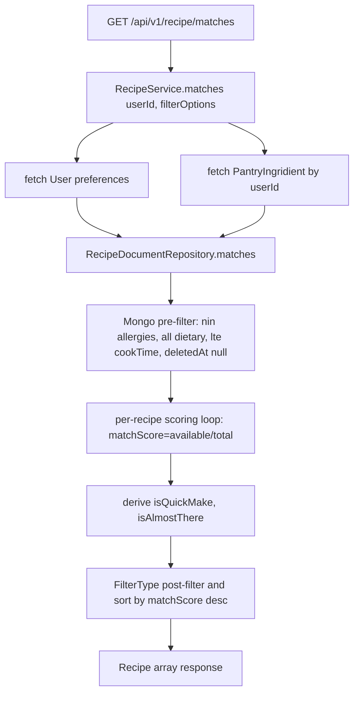

# Recipe Module

## Module Purpose

The `recipe/` module is the headline feature of the PantryChef backend. It exposes
CRUD endpoints for recipes plus the pantry-aware `GET /api/v1/recipe/matches`
endpoint that scores recipes based on the authenticated user's current pantry
contents and `Preferences`. The matching algorithm — a Mongo pre-filter chain
followed by a per-recipe scoring loop — lives at
`infrastructure/document/repositories/recipe.repository.ts:L92-L171`. Recipes
embed an `IngridientList` (spelling preserved verbatim throughout the backend codebase)
sub-schema describing required ingredients, plus an `Instruction[]` array
describing cooking steps.

## Key Components

| Component | File | Responsibility |
| --- | --- | --- |
| `RecipeController` | `recipe.controller.ts` | Routes under `/api/v1/recipe`, all guarded by `AuthGuard('jwt')` |
| `RecipeService` | `recipe.service.ts` | Orchestrates CRUD plus `matches(userId, filterOptions)`, delegating to `UsersService`, `PantryService`, and `RecipeRepository` |
| `RecipeRepository` (abstract) | `infrastructure/recipe.repository.ts` | Abstract repository contract with six methods |
| `RecipeDocumentRepository` | `infrastructure/document/repositories/recipe.repository.ts` | Mongoose-backed implementation; hosts the `matches()` algorithm at L92-L171 |
| `RecipeMapper` | `infrastructure/document/mappers/recipe.mapper.ts` | Maps `RecipeSchemaClass` ↔ `Recipe` domain entity |
| `RecipeSchemaClass` | `infrastructure/document/entities/recipe.schema.ts` | Mongoose schema; embeds `IngridientList[]` (L7-L26, spelling preserved verbatim) and `Instruction[]` (L31-L40); `difficulty` enum `'easy' \| 'medium' \| 'hard'` (L82); `title` index (L106) |
| `IngridientList` (sub-schema) | `recipe.schema.ts:L7-L26` | Embedded sub-schema (spelling preserved verbatim). Fields: `ingridient` (Reference), `amount`, `unit`, `required`, `substitutes?` |
| `Instruction` (sub-schema) | `recipe.schema.ts:L31-L40` | Embedded sub-schema for cooking instructions: `step`, `description`, optional `timer` |
| `Recipe` (domain) | `domain/recipe.ts` | Domain entity returned by service methods |
| DTOs | `dto/create-recipe.dto.ts`, `dto/update-recipe.dto.ts`, `dto/query-recipe.dto.ts` | class-validator + class-transformer validation contracts |
| `FilterType` | `types/filter.types.ts` | Post-filter flags `isQuickMake?` and `isAlmostThere?` used by `matches()` |
| `DocumentPantryPersistenceModule` | `infrastructure/document/document-persistence.module.ts` | Binds the abstract `RecipeRepository` to `RecipeDocumentRepository` at DI time |

## Architecture Fit

The module follows the standard backend layering: controller → service → abstract
repository → concrete document repository → MongoDB. `RecipeController` delegates
to `RecipeService` for all business orchestration. `RecipeService` additionally
injects `UsersService` (to fetch the authenticated user's `Preferences`) and
`PantryService` to fetch the user's `PantryIngridient[]` records
(spelling preserved verbatim throughout the backend codebase) for the
pantry-aware `matches()` flow. The abstract `RecipeRepository` is bound to
`RecipeDocumentRepository` at composition time inside
`DocumentPantryPersistenceModule`.

See [../../../ARCHITECTURE.md](../../../ARCHITECTURE.md) § Recipe Matching Pipeline
for the full algorithm deep-dive, and [../../../DATA_MODEL.md](../../../DATA_MODEL.md)
§ Recipe for the canonical schema reference.

## Dependencies

### Internal

- `DocumentPantryPersistenceModule` — declared in
  `infrastructure/document/document-persistence.module.ts`; binds the abstract
  `RecipeRepository` to the Mongoose-backed `RecipeDocumentRepository`.
- `UsersModule` — `RecipeService` injects `UsersService` to fetch the
  authenticated user's `Preferences` for the matches flow.
- `PantryModule` — `RecipeService` injects `PantryService` to fetch the user's
  `PantryIngridient[]` (spelling preserved verbatim) for the matches flow.

### External

Versions pinned exactly per `backend/package.json`:

- `@nestjs/common ^10.0.0`
- `@nestjs/mongoose ^10.1.0`
- `@nestjs/passport ^10.0.3` (transitively via `AuthGuard('jwt')`)
- `@nestjs/swagger ^8.0.1`
- `mongoose ^8.8.0`
- `class-validator ^0.14.1`
- `class-transformer ^0.5.1`

## Primary Use Cases

- Create a recipe with the embedded `IngridientList` (spelling preserved
  verbatim) array and the `Instruction` step list.
- List recipes with pagination (page + limit, hard-capped at 50 per page in the
  controller).
- Fetch a single recipe by id.
- Update a recipe (partial payload validated against the `UpdateRecipeDto`).
- **Soft-delete a recipe** via the *proper* contract: a Mongoose
  `updateOne({ _id }, { deletedAt: new Date() })` at
  `recipe.repository.ts:L184-L186`. The document is preserved on disk and the
  pagination query filters `deletedAt: null` out of subsequent listings.
- **Pantry-aware matches** (headline): rank recipes by how well the user's
  current pantry covers the recipe's `ingridientList`, honouring the user's
  `Preferences` (allergies, disliked ingredients, dietary tags, cooking time).

## API / Endpoint Reference

| Method | Path | Guard | Description |
| --- | --- | --- | --- |
| `POST` | `/api/v1/recipe` | `AuthGuard('jwt')` | Create a recipe |
| `GET` | `/api/v1/recipe/matches` | `AuthGuard('jwt')` | **Headline**: pantry-aware matches sorted by `matchScore` desc |
| `GET` | `/api/v1/recipe` | `AuthGuard('jwt')` | List recipes with pagination (cap 50) |
| `GET` | `/api/v1/recipe/:id` | `AuthGuard('jwt')` | Fetch a single recipe by id |
| `PATCH` | `/api/v1/recipe/:id` | `AuthGuard('jwt')` | Partial update; 422 when recipe is not found |
| `DELETE` | `/api/v1/recipe/:id` | `AuthGuard('jwt')` | Proper soft-delete (`updateOne({ deletedAt: new Date() })`) |

## Data Flows

The diagram below summarises the pantry-aware matching pipeline that powers
`GET /api/v1/recipe/matches`. The full deep-dive (with all four Mongo pre-filter
clauses, the scoring loop, and the post-filter algebra) lives in
[../../../ARCHITECTURE.md](../../../ARCHITECTURE.md) § Recipe Matching Pipeline.

## Configuration

The Recipe module declares no module-specific environment variables. It
inherits the global runtime configuration:

| Env Var | Default | Source |
| --- | --- | --- |
| `DATABASE_URL` | `mongodb://localhost:27017` | `backend/env_example:L11` |
| `API_PREFIX` | `api` | `backend/env_example:L4` |

The controller path prefix `/api/v1/recipe` is derived from the global
`API_PREFIX`, the `version: '1'` argument to `@Controller(...)`, and the
controller path `'recipe'`.

## Known Limitations and Implementation Gaps

> ⚠️ **Exact `_id` matching only** — the per-recipe scoring loop at
> `infrastructure/document/repositories/recipe.repository.ts:L128-L150` uses
> `il.ingridient._id.toString()` equality against pantry ingredient ids.
> Substitutes (the `substitutes` array on `IngridientList`) and equivalent
> ingredients (e.g., fresh vs dried) are not consulted at match time.

> ⚠️ **No unit normalization** — the `il.amount` and `il.unit` fields on the
> `IngridientList` (spelling preserved verbatim throughout the backend
> codebase) sub-schema are not consulted during matching. A recipe calling for
> "500g flour" matches the same way as one calling for "1 tsp flour" if the
> user's pantry contains any quantity of flour.

> ⚠️ **No quantity sufficiency check** — having 10g of an ingredient that a
> recipe requires 500g of still counts as "available" for the scoring loop.
> `matchScore = availableIngredients.length / totalIngredients` is purely a
> count ratio that ignores quantity.

> ⚠️ **No fuzzy ingredient matching** —
> `Ingridient` (spelling preserved verbatim throughout the backend codebase)
> substitutions, category-level matching, and equivalent-form handling are all
> out of scope of the current algorithm.

## Production Readiness Status

> 🚧 **Database** — add a compound index on `(deletedAt, tags, cookTime)` and an
> index on `ingridientList.ingridient` (spelling preserved verbatim) to keep
> the `matches()` query performant at scale. See
> [../../../PRODUCTION_READINESS.md](../../../PRODUCTION_READINESS.md)
> § Database.

> 🚧 **Testing** — no unit tests exist for `RecipeDocumentRepository.matches()`.
> Add coverage for: empty pantry (`matchScore` = 0), full pantry
> (`matchScore` = 1), allergy / dislike exclusion, dietary tag filter, and
> `isQuickMake` / `isAlmostThere` derivation. Use `mongodb-memory-server` for
> integration tests of the pre-filter clauses.

> 🚧 **Performance** — matching cost grows linearly with `pantry × recipe`
> count. Consider caching, precomputed indexes, or an aggregation-pipeline
> rewrite for large catalogues.

> 🚧 **Algorithmic correctness** — implement unit normalization and quantity
> sufficiency as a follow-up task. The current ratio-based `matchScore`
> over-reports matches when the user has only trace amounts of an ingredient.
