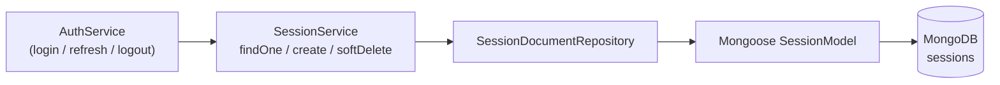

# Session Module

The `session` module is the persistence-backed building block for authenticated
login state. It is a small, infrastructure-focused module that the
authentication layer relies on to track and rotate refresh tokens.

## Purpose

The `session` module manages the **Session lifecycle that backs JWT
refresh-token rotation**. Each session record represents one authenticated
login and moves through three states driven entirely by the auth layer:
a session is **created on login, looked up and validated on refresh, and
removed on logout**. Source: backend/src/session/session.service.ts:L12-L28

The module deliberately exposes **no REST surface of its own**. It is an
internal application service — the only public entry point is the
`SessionService` class, which the authentication layer injects and calls
directly rather than over HTTP. Source: backend/src/session/session.service.ts:L9

## Key components

The module follows the backend's per-module layered layout: a thin application
service over an abstract repository contract, with a Mongoose-backed
implementation and a domain↔persistence mapper sitting behind it.

| Component | File | Responsibility | Source |
|-----------|------|----------------|--------|
| `SessionModule` | `session.module.ts` | Feature module / composition root wiring the service and persistence layer | Source: backend/src/session/session.module.ts:L10 |
| `SessionService` | `session.service.ts` | `@Injectable` application service exposing `findOne` / `create` / `softDelete` | Source: backend/src/session/session.service.ts:L9 |
| `SessionRepository` (abstract) | `infrastructure/session.repository.ts` | Persistence contract that decouples the service from storage | Source: backend/src/session/infrastructure/session.repository.ts:L6 |
| `SessionDocumentRepository` | `infrastructure/document/repositories/session.repository.ts` | Mongoose-backed implementation of the contract | Source: backend/src/session/infrastructure/document/repositories/session.repository.ts:L13 |
| `SessionSchemaClass` / `SessionSchema` | `infrastructure/document/entities/session.schema.ts` | Mongoose schema class and generated schema definition | Source: backend/src/session/infrastructure/document/entities/session.schema.ts:L15,L26 |
| `SessionMapper` | `infrastructure/document/mappers/session.mapper.ts` | Domain↔persistence mapping (`toDomain` / `toPersistence`) | Source: backend/src/session/infrastructure/document/mappers/session.mapper.ts:L6 |
| `Session` (domain) | `domain/session.ts` | In-memory domain model used by the service layer | Source: backend/src/session/domain/session.ts:L3 |
| `DocumentSessionPersistenceModule` | `infrastructure/document/document-persistence.module.ts` | Registers the Mongoose model and binds the abstract repository to its concrete implementation | Source: backend/src/session/infrastructure/document/document-persistence.module.ts:L21 |

## Architecture fit

The `session` module sits between the authentication layer and the MongoDB
persistence layer, providing durable storage for active login sessions.

- It is registered in the root application module, so it is instantiated for
  the whole application. Source: backend/src/app.module.ts:L51
- It is consumed by `AuthModule` / `AuthService` for refresh-token flows: a
  session is created at login, validated when a refresh token is presented,
  and removed at logout. Source: backend/src/session/session.service.ts:L12-L28
- Each `Session` references its owning user through the `UserSchemaClass`
  relationship. Source: backend/src/session/infrastructure/document/entities/session.schema.ts:L16-L17

For how this module fits into the wider system (the Flutter client, the NestJS
backend, and MongoDB), see the
[system architecture overview](../../../docs/ARCHITECTURE.md). The auth REST
endpoints that drive these flows are documented in the
[API reference](../../../docs/API_REFERENCE.md).

## Data models

Sessions are persisted as a small Mongoose document. The schema enables
`timestamps` and JSON virtuals/getters, then declares the fields below.
Source: backend/src/session/infrastructure/document/entities/session.schema.ts:L8-L14

The persisted `SessionSchemaClass` exposes these fields:

| Field | Type | Notes | Source |
|-------|------|-------|--------|
| `user` | `ObjectId` (ref `UserSchemaClass`) | Reference to the owning user | Source: backend/src/session/infrastructure/document/entities/session.schema.ts:L16-L17 |
| `createdAt` | `Date` | Defaults to `now` | Source: backend/src/session/infrastructure/document/entities/session.schema.ts:L19-L20 |
| `deletedAt` | `Date` | Declared for soft deletion but NOT honored at runtime (see Known limitations / gaps) | Source: backend/src/session/infrastructure/document/entities/session.schema.ts:L22-L23 |
| `_id` / `id` | `string` | Inherited from `EntityDocumentHelper`; mapped to the domain `Session.id` | Source: backend/src/session/infrastructure/document/mappers/session.mapper.ts:L9 |

The in-memory domain `Session` mirrors these fields with an `id` that may be a
`number` or `string`: `id: number | string`, `user: User`, `createdAt: Date`,
`deletedAt: Date`. Source: backend/src/session/domain/session.ts:L3-L8

A secondary index is declared on the `user` field (`{ user: 1 }`) to support
lookups by owner. Source: backend/src/session/infrastructure/document/entities/session.schema.ts:L28

The full cross-module schema catalog — including how sessions relate to users
and the soft-delete versus hard-delete matrix — lives in the
[data models reference](../../../docs/DATA_MODELS.md).

## API endpoints / public interface

This module exposes **no public REST controller**. Its public surface is the
`SessionService` method set, which the authentication layer calls internally.

| Method | Signature | Description | Source |
|--------|-----------|-------------|--------|
| `findOne` | `findOne(options: EntityCondition<Session>): Promise<NullableType<Session>>` | Looks up a single session by the given conditions; resolves to the session or `null` | Source: backend/src/session/session.service.ts:L12-L14 |
| `create` | `create(data: Omit<Session, 'id' \| 'createdAt' \| 'deletedAt'>): Promise<Session>` | Persists a new session and returns the created domain model | Source: backend/src/session/session.service.ts:L16-L20 |
| `softDelete` | `softDelete(criteria: { id?; user?; excludeId? }): Promise<void>` | Removes sessions matching the supplied criteria | Source: backend/src/session/session.service.ts:L22-L28 |

The user-facing authentication routes (login, refresh, and logout) that invoke
these methods are described in the
[API reference](../../../docs/API_REFERENCE.md).

## Configuration

The module requires **no module-specific configuration** beyond the shared
MongoDB connection. The session model is registered locally with
`MongooseModule.forFeature(...)`
(Source: backend/src/session/infrastructure/document/document-persistence.module.ts:L9-L11),
while the global database connection is configured once at the application root
via `MongooseModule.forRootAsync({ useClass: MongooseConfigService })`.
Source: backend/src/app.module.ts:L44-L46

Connection strings and other environment settings are covered in the
[deployment guide](../../../docs/DEPLOYMENT.md).

## Data flow

A session change always originates in the authentication layer. `AuthService`
calls the `SessionService` API, which delegates to the
`SessionDocumentRepository`; the repository uses the injected Mongoose
`SessionModel` to read from or write to the `sessions` collection in MongoDB.

The service-layer entry points are defined in
Source: backend/src/session/session.service.ts:L12-L28, and the repository-level
persistence operations (find, create, and delete) are implemented in
Source: backend/src/session/infrastructure/document/repositories/session.repository.ts:L19-L55.

## Design patterns used

- **Repository pattern** — an abstract `SessionRepository`
  (Source: backend/src/session/infrastructure/session.repository.ts:L6) defines
  the persistence contract, and a document implementation is bound to it via DI
  (Source: backend/src/session/infrastructure/document/document-persistence.module.ts:L14-L17).
- **Mapper pattern** — `SessionMapper.toDomain` and `SessionMapper.toPersistence`
  translate between the domain model and the Mongoose document, keeping storage
  concerns out of the service layer
  (Source: backend/src/session/infrastructure/document/mappers/session.mapper.ts:L7,L19).
- **Dependency injection** — NestJS `@Module` / `@Injectable` wiring composes
  the module and injects the repository into the service
  (Source: backend/src/session/session.module.ts:L5-L10,
  Source: backend/src/session/session.service.ts:L8-L10).

## Known limitations / gaps

> **KNOWN ISSUE:** Session removal in the repository's `softDelete` path performs
> a **HARD delete** via `deleteMany(transformedCriteria)` — sessions are
> physically removed from the collection, not soft-deleted, despite the schema
> declaring a `deletedAt` field.
> Source: backend/src/session/infrastructure/document/repositories/session.repository.ts:L54
> (and the unused schema field
> Source: backend/src/session/infrastructure/document/entities/session.schema.ts:L22-L23).

Because the `deletedAt` field is never populated, queries cannot distinguish
"deleted" sessions from absent ones; the field exists in the model but carries
no runtime meaning today. The cross-module
[soft-delete versus hard-delete matrix](../../../docs/DATA_MODELS.md) records
this divergence alongside the other repositories that share the behavior.

## Local development

- The session module needs no special local setup. Follow the standard backend
  workflow in the [backend root README](../../README.md) for install,
  environment configuration, database seeding, and the Docker Compose bring-up.
- There is no manual session setup or dedicated endpoint to exercise here:
  **sessions are created automatically during the auth login flow** through
  `SessionService.create`, and they are read and removed during the refresh and
  logout flows. Source: backend/src/session/session.service.ts:L16-L20
