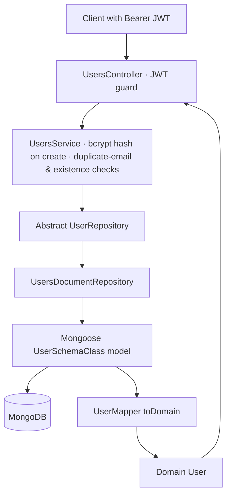

# Users Module

The Users module owns user-account management for the PantryChef backend. It
exposes a JWT-guarded REST surface for creating, listing, reading, updating, and
removing users; hashes passwords on create; stores an embedded
`Preferences` subdocument for dietary settings; and tracks each user's favorite
recipes and recent searches.

## Purpose

This module provides the system's user record and the operations that act on it.
It performs user CRUD through a dedicated controller and service
(`Source: backend/src/users/users.controller.ts:L41-L47`,
`Source: backend/src/users/users.service.ts:L22`), hashes passwords with bcryptjs
on create (`Source: backend/src/users/users.service.ts:L44-L46`), and persists an
embedded dietary `Preferences` object alongside `favoriteRecipes` and
`recentSearches` arrays (`Source: backend/src/users/infrastructure/document/entities/user.schema.ts:L79-L99`).
It is the authoritative source of identity data that the authentication flow
builds on, and every route it serves requires a valid Bearer JWT
(`Source: backend/src/users/users.controller.ts:L41-L46`).

## Key components

- **`UsersModule`** — NestJS module that imports `DocumentUserPersistenceModule`,
  registers `UsersController` and `UsersService`, and re-exports `UsersService`
  plus `DocumentUserPersistenceModule` for consumers such as auth.
  `Source: backend/src/users/users.module.ts:L24-L33`.
- **`UsersController`** — HTTP layer that maps REST routes to service calls and
  applies the class-level JWT guard. `Source: backend/src/users/users.controller.ts:L41-L47`.
- **`UsersService`** — business rules: password hashing on create, duplicate-email
  rejection, and existence checks on update. `Source: backend/src/users/users.service.ts:L22`.
- **Abstract `UserRepository`** — persistence contract
  (`create` / `findManyWithPagination` / `findOne` / `update` / `softDelete`)
  that decouples the service from the storage technology.
  `Source: backend/src/users/infrastructure/user.repository.ts:L22-L95`.
- **`UsersDocumentRepository`** — Mongoose-backed implementation of the contract,
  bound to the abstract token via DI. `Source: backend/src/users/infrastructure/document/repositories/user.repository.ts:L33`.
- **`UserSchemaClass`** (with embedded `Preferences`) — the Mongoose entity that
  defines the persisted shape of a user. `Source: backend/src/users/infrastructure/document/entities/user.schema.ts:L17-L34`,
  `Source: backend/src/users/infrastructure/document/entities/user.schema.ts:L53-L60`.
- **`UserMapper`** — converts between the Mongoose schema document and the domain
  `User` in both directions. `Source: backend/src/users/infrastructure/document/mappers/user.mapper.ts:L12`.
- **Domain `User`** — framework-agnostic user type returned by the service.
  `Source: backend/src/users/domain/user.ts:L11-L41`.
- **DTOs** — `CreateUserDto`, `UpdateUserDto`, and `QueryUserDto` define and
  validate request payloads and query parameters.
  `Source: backend/src/users/dto/create-user.dto.ts:L55`,
  `Source: backend/src/users/dto/update-user.dto.ts:L23`,
  `Source: backend/src/users/dto/query-user.dto.ts:L55`.

## Architecture fit

The module is wired into the application root as `UsersModule`
(`Source: backend/src/app.module.ts:L52`). It is consumed by the authentication
subsystem: `AuthModule` imports `UsersModule`
(`Source: backend/src/auth/auth.module.ts:L24`) and `AuthService` injects
`UsersService` to look up and register users during login and registration
(`Source: backend/src/auth/auth.service.ts:L37`). The session subsystem also
references this module's `User` domain type together with `UserSchemaClass` and
`UserMapper`.

All routes are protected at the class level with a JWT guard
(`@UseGuards(AuthGuard('jwt'))` plus `@ApiBearerAuth()`), so a caller must present
a valid Bearer token to reach any endpoint
(`Source: backend/src/users/users.controller.ts:L41-L46`). For the system-wide
layering (controller → service → repository → Mongoose) and how this module sits
within the monorepo, see [../../../docs/ARCHITECTURE.md](../../../docs/ARCHITECTURE.md).

## Data models

A user is persisted as `UserSchemaClass`, declared with
`@Schema({ timestamps: true, toJSON: { virtuals: true, getters: true } })` and
extending `EntityDocumentHelper`
(`Source: backend/src/users/infrastructure/document/entities/user.schema.ts:L53-L60`).
The fields are:

| Field | Type | Notes | Source |
|-------|------|-------|--------|
| `email` | `string \| null` | Unique index (`unique: true`) | `user.schema.ts:L63-L68` |
| `password` | `string?` | Annotated `@Exclude({ toPlainOnly: true })` — omitted from serialized output | `user.schema.ts:L72-L74` |
| `preferences` | embedded `Preferences` | Defaults to an object with empty arrays and `cookingTime: 0` | `user.schema.ts:L79-L88` |
| `favoriteRecipes` | `string[]` | Default `[]` | `user.schema.ts:L91-L95` |
| `recentSearches` | `string[]` | Default `[]` | `user.schema.ts:L98-L99` |
| `createdAt` | `Date` | Default `now` | `user.schema.ts:L102-L103` |
| `updatedAt` | `Date` | Default `now` | `user.schema.ts:L106-L107` |
| `deletedAt` | `Date?` | Declared for soft deletion (see Known limitations) | `user.schema.ts:L112-L113` |

The embedded `Preferences` subdocument captures dietary settings
(`Source: backend/src/users/infrastructure/document/entities/user.schema.ts:L17-L34`):

| Field | Type | Default | Source |
|-------|------|---------|--------|
| `dietary` | `string[]` | `[]` | `user.schema.ts:L19-L20` |
| `allergies` | `string[]` | `[]` | `user.schema.ts:L24-L25` |
| `dislikedIngredients` | `string[]` | `[]` | `user.schema.ts:L28-L29` |
| `cookingTime` | `number` | `0` | `user.schema.ts:L32-L33` |

The framework-agnostic domain `User` type mirrors these fields, with its
identifier typed as `id: number | string`
(`Source: backend/src/users/domain/user.ts:L11-L41`). For the cross-entity model
reference and indexes, see [../../../docs/DATA_MODELS.md](../../../docs/DATA_MODELS.md).

## API endpoints / public interface

The controller declares `@Controller({ path: 'users', version: '1' })`
(`Source: backend/src/users/users.controller.ts:L43-L46`). Effective paths are
served under the global `api` prefix as **`/api/users...`** with **no `/v1/`
segment**: `main.ts` sets the global prefix but never calls
`app.enableVersioning()`, so the declared controller version is inactive
(`Source: backend/src/main.ts:L32-L37`).

| Method | Path | Success | Description |
|--------|------|---------|-------------|
| `POST` | `/api/users` | `201 Created` | Create a user; hashes password and rejects duplicate emails. `Source: backend/src/users/users.controller.ts:L61-L65` |
| `GET` | `/api/users` | `200 OK` | List users with pagination (default `limit=10`, capped at 50). `Source: backend/src/users/users.controller.ts:L79-L103` |
| `GET` | `/api/users/me` | `200 OK` | Return the authenticated user from the request principal. `Source: backend/src/users/users.controller.ts:L114-L120` |
| `PATCH` | `/api/users` | `200 OK` | Update the authenticated user. `Source: backend/src/users/users.controller.ts:L133-L142` |
| `DELETE` | `/api/users/:id` | `204 No Content` | Remove a user by id. `Source: backend/src/users/users.controller.ts:L153-L166` |

The list endpoint defaults to `page=1` and `limit=10`, and clamps the page size
to a maximum of 50 (`if (limit > 50) limit = 50;`)
(`Source: backend/src/users/users.controller.ts:L88-L90`). For full request and
response payloads, validation rules, and error bodies, see
[../../../docs/API_REFERENCE.md](../../../docs/API_REFERENCE.md).

## Configuration

This module has no module-specific configuration. It relies on shared
infrastructure provided elsewhere: the Mongoose connection (registered through the
database module and bound here via `MongooseModule.forFeature`,
`Source: backend/src/users/infrastructure/document/document-persistence.module.ts:L30-L46`)
and the JWT authentication enforced by the controller's class-level guard
(`Source: backend/src/users/users.controller.ts:L41-L46`). Connection strings and
auth secrets are environment-driven; see the backend root README at
[../../README.md](../../README.md) for the shared environment and setup details.

## Data flow

A request enters the JWT-guarded controller, which delegates to the service. The
service applies business rules — bcrypt password hashing **on create only** and
duplicate-email / existence checks — then calls the abstract repository. The
update path forwards its payload without re-hashing (see Known limitations). The
document repository executes the operation against the Mongoose model and, for
reads and writes, returns a domain `User` produced by `UserMapper`.



Flow sources: controller routing and guard
(`Source: backend/src/users/users.controller.ts:L41-L65`), password hashing on
create (`Source: backend/src/users/users.service.ts:L44-L46`), and persistence
plus mapping (`Source: backend/src/users/infrastructure/document/repositories/user.repository.ts:L49-L59`).

## Design patterns used

- **Repository pattern** — an abstract `UserRepository` defines the contract and a
  document adapter implements it, keeping the service storage-agnostic.
  `Source: backend/src/users/infrastructure/user.repository.ts:L22-L95`.
- **Dependency inversion via DI binding** — the abstract token is bound to the
  concrete implementation with `{ provide: UserRepository, useClass: UsersDocumentRepository }`.
  `Source: backend/src/users/infrastructure/document/document-persistence.module.ts:L38-L43`.
- **Mapper pattern** — `UserMapper` translates between the Mongoose schema and the
  domain `User` in both directions. `Source: backend/src/users/infrastructure/document/mappers/user.mapper.ts:L26`.
- **Embedded subdocument** — dietary settings are modeled as an embedded
  `Preferences` document rather than a separate collection.
  `Source: backend/src/users/infrastructure/document/entities/user.schema.ts:L79-L88`.
- **DTO validation** — request payloads are validated with class-validator and
  transformed with class-transformer decorators.
  `Source: backend/src/users/dto/create-user.dto.ts:L55-L95`.
- **Password hashing** — passwords are salted and hashed with bcryptjs (10 salt
  rounds) on create. `Source: backend/src/users/users.service.ts:L44-L46`.
- **Field exclusion on serialization** — `password` carries
  `@Exclude({ toPlainOnly: true })` so it is omitted from serialized responses.
  `Source: backend/src/users/infrastructure/document/entities/user.schema.ts:L72-L74`.
- **Pagination clamping** — the list endpoint caps the page size at 50.
  `Source: backend/src/users/users.controller.ts:L88-L90`.

## Known limitations / gaps

**KNOWN ISSUE:** The document repository's `softDelete(id)` performs a **hard
delete**: it calls `deleteOne({ _id: id })`, physically removing the user document
even though the schema declares a `deletedAt` field intended for soft deletion
(`Source: backend/src/users/infrastructure/document/repositories/user.repository.ts:L183`;
the method spans L174-L186). The schema's `deletedAt` column is therefore never set
by this operation (`Source: backend/src/users/infrastructure/document/entities/user.schema.ts:L112-L113`).
This behavior is documented as-is and is not changed here; for how it compares to
other entities, see the soft-delete-vs-hard-delete matrix in
[../../../docs/DATA_MODELS.md](../../../docs/DATA_MODELS.md).

**KNOWN ISSUE:** Password hashing is applied **only on create**. `UsersService.create`
hashes the password with bcryptjs (10 salt rounds) before persistence
(`Source: backend/src/users/users.service.ts:L44-L46`), but `UsersService.update`
forwards its payload to the repository without re-hashing
(`Source: backend/src/users/users.service.ts:L116-L142`). `AuthService.update`
verifies `oldPassword` and then delegates to `UsersService.update`
(`Source: backend/src/auth/auth.service.ts:L192-L269`), so a changed password is
persisted in plaintext rather than as a bcrypt hash. This behavior is documented
as-is and is not changed here.

## Local development

Seed user data into a running database with the document seeder
(`Source: backend/package.json:scripts`):

```bash
npm run seed:run:document
```

Exercising this module's routes requires a running MongoDB instance and a valid
Bearer JWT, because every endpoint is JWT-guarded at the class level
(`Source: backend/src/users/users.controller.ts:L41-L46`); obtain a token through
the authentication module. For the full environment configuration, Docker Compose
bring-up, and shared setup, see the backend root README at
[../../README.md](../../README.md).
