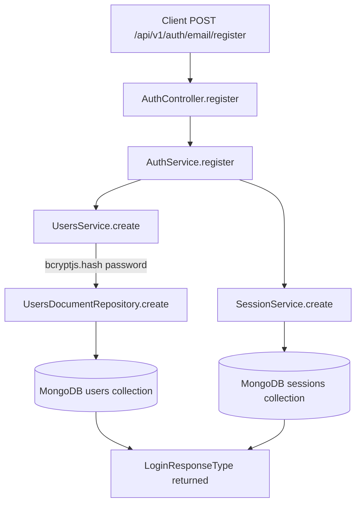

# Users Module

## Module Purpose

The `users/` module manages user accounts and their embedded `Preferences` subdocument
(dietary restrictions, allergies, disliked ingredients, and a `cookingTime` cap) used to
filter the recipe matching pipeline. It exposes a JWT-protected CRUD API under
`/api/v1/users` plus a `/me` route for the authenticated principal, and is consumed by
`AuthModule` for register/login/me flows and by `RecipeService.matches` to fetch the
current user's `Preferences`. Password hashing with `bcryptjs` is performed inside
`UsersService.create` (`users.service.ts`); `AuthService.update` verifies the
old password upstream and forwards the new value to this module without re-hashing.

## Key Components

| Component | File | Responsibility |
| --- | --- | --- |
| `UsersController` | `users.controller.ts` | Five routes under `/api/v1/users`, all `AuthGuard('jwt')`. |
| `UsersService` | `users.service.ts` | Business orchestration; hashes passwords on create, enforces unique emails. |
| `UserRepository` (abstract) | `infrastructure/user.repository.ts` | Abstract persistence contract for the User aggregate. |
| `UsersDocumentRepository` | `infrastructure/document/repositories/user.repository.ts` | Mongoose-backed implementation. **`softDelete` currently calls `deleteOne`** — physically destructive (see § Known Limitations). |
| `UserSchemaClass` | `infrastructure/document/entities/user.schema.ts` | Mongoose schema: `email` (unique), `password` (`@Exclude` `toPlainOnly`), embedded `Preferences`, `favoriteRecipes[]`, `recentSearches[]`, `deletedAt`. |
| `Preferences` (embedded) | `user.schema.ts` | Subdocument: `dietary[]`, `allergies[]`, `dislikedIngredients[]`, `cookingTime`. |
| `UserMapper` | `infrastructure/document/mappers/user.mapper.ts` | Schema ↔ domain mapping (preserves the embedded `Preferences`). |
| `User` (domain) | `domain/user.ts` | Domain entity returned by the service. |
| DTOs | `dto/create-user.dto.ts`, `dto/update-user.dto.ts`, `dto/query-user.dto.ts` | Validation contracts; `email` is normalized via the lower-case transformer. |

## Architecture Fit

The module follows the standard backend layering — controller → service → abstract
repository → document repository — with `DocumentUserPersistenceModule` binding the
`UserRepository` token to `UsersDocumentRepository` at composition time
(`document-persistence.module.ts`). `UsersModule` re-exports `UsersService` and
the persistence module; `AuthModule` consumes `UsersService` for
login/register/me/refresh/update flows, and `RecipeService.matches` loads the
authenticated user's `Preferences` to drive its pre-filter chain. See
[ARCHITECTURE.md](../../../ARCHITECTURE.md) §§ JWT Authentication Flow and Recipe
Matching Pipeline, and [DATA_MODEL.md](../../../DATA_MODEL.md) §§ User and Preferences.

## Dependencies

### Internal

- `MongooseModule.forFeature([UserSchemaClass])` — registers the Mongoose model inside
  `DocumentUserPersistenceModule`.
- `DocumentUserPersistenceModule` — provides the `UserRepository` →
  `UsersDocumentRepository` binding; re-exported by `UsersModule`.

### External

Versions pinned exactly as declared in `backend/package.json`:

- `@nestjs/common` `^10.0.0`
- `@nestjs/mongoose` `^10.1.0`
- `@nestjs/passport` `^10.0.3`
- `@nestjs/swagger` `^8.0.1`
- `mongoose` `^8.8.0`
- `bcryptjs` `^2.4.3` (used in `UsersService.create`)
- `class-validator` `^0.14.1`
- `class-transformer` `^0.5.1`

The following package is **not** declared in `backend/package.json` but is imported
directly by this module's `update-user.dto.ts`; it is resolved transitively and its
version is pinned in `package-lock.json` rather than `package.json`:

- `@nestjs/mapped-types` `2.0.5` — sourced from `package-lock.json` (transitive,
  via `@nestjs/swagger`); imported by `update-user.dto.ts` for `PartialType` in
  `UpdateUserDto extends PartialType(CreateUserDto)`.

## Primary Use Cases

- **Register a user** — typically invoked through `AuthService.register`, which
  delegates to `UsersService.create` (where `bcryptjs` hashes the password).
- **List users** — paginated browsing with a hard cap of 50 records per page.
- **Fetch the current user** — `GET /api/v1/users/me` returns the principal extracted
  from `request.user.id`.
- **Update user profile** — `PATCH /api/v1/users` accepts a `PartialType(CreateUserDto)`
  payload; password changes are intended to flow through `AuthService.update`.
- **"Soft"-delete a user** — `DELETE /api/v1/users/:id` currently uses `deleteOne`
  (destructive — see § Known Limitations).

## API / Endpoint Reference

| Method | Path | Guard | Description |
| --- | --- | --- | --- |
| `POST` | `/api/v1/users` | `AuthGuard('jwt')` | Create a user. Body: `CreateUserDto`. Returns `201 Created` with the new `User`. |
| `GET` | `/api/v1/users` | `AuthGuard('jwt')` | Paginated list. Query: `page`, `limit` (capped at 50), `filters`, `sort`. Returns `{ data, hasNextPage }`. |
| `GET` | `/api/v1/users/me` | `AuthGuard('jwt')` | Fetch the authenticated user via `request.user.id`. |
| `PATCH` | `/api/v1/users` | `AuthGuard('jwt')` | Partial update of the authenticated user. Body: `UpdateUserDto`. |
| `DELETE` | `/api/v1/users/:id` | `AuthGuard('jwt')` | "Soft"-delete a user (currently physically destructive — see § Known Limitations). Returns `204 No Content`. |

Paths derive from `@Controller({ path: 'users', version: '1' })`
(`users.controller.ts`) combined with the global `/api` prefix in `main.ts`,
so routes resolve at `/api/v1/users/*`. The
Swagger surface is published at `/docs`.

## Data Flows

The registration flow showing embedded `Preferences` default and `Session` linkage:



`UsersService.create` hashes the password before delegating to
`UsersDocumentRepository.create`; the persisted document carries the default
`Preferences` (`dietary: []`, `allergies: []`, `dislikedIngredients: []`,
`cookingTime: 0`) defined in `user.schema.ts`. The hashing step is performed
inline in `UsersService.create` (Source: `users.service.ts`):

```typescript
const salt = await bcrypt.genSalt(10);
clonedPayload.password = await bcrypt.hash(clonedPayload.password, salt);
```

## Configuration

The module has no module-specific environment variables. It inherits the global
`DATABASE_URL` (`backend/env_example:L11`), `DATABASE_USERNAME` / `DATABASE_PASSWORD`
(`backend/env_example:L8-L9`), and `DATABASE_NAME` (`backend/env_example:L10`) for the
Mongoose connection, plus `API_PREFIX` (`backend/env_example:L4`, default `api`). JWT
authentication is configured by upstream `AuthModule` via `AUTH_JWT_SECRET` and
`AUTH_JWT_TOKEN_EXPIRES_IN` (`backend/env_example:L20-L21`).

## Known Limitations and Implementation Gaps

> ⚠️ **`UsersDocumentRepository.softDelete` uses destructive `deleteOne`** — Source:
> `infrastructure/document/repositories/user.repository.ts`. Despite the method
> name, the document is physically removed rather than marked with a `deletedAt`
> timestamp. This mirrors the destructive `softDelete` in the pantry module
> (`backend/src/pantry/`); both occurrences are tracked centrally in
> [`PRODUCTION_READINESS.md`](../../../PRODUCTION_READINESS.md) § Database.

> ⚠️ **Password hashing is asymmetric across write paths** — `UsersService.create`
> hashes via `bcryptjs` (`users.service.ts`), but `UsersService.update`
> (`users.service.ts`) forwards the payload verbatim without re-hashing. The
> intended path is `AuthService.update`, which verifies the old password upstream;
> direct callers of `PATCH /api/v1/users` with a `password` field will persist plaintext.

> ⚠️ **`findManyWithPagination` ignores `filterOptions`** —
> `infrastructure/document/repositories/user.repository.ts`. The Mongo `where`
> clause is always `{}`.

> ⚠️ **No profile picture or avatar field** — the schema has no image column. Adding
> one would require the S3 driver (currently `FILE_DRIVER=local` with placeholder
> `AWS_*` env vars at `backend/env_example:L14-L18`).

> ⚠️ **`favoriteRecipes[]` and `recentSearches[]` are unbounded arrays** — no
> server-side cap or rotation.

> ⚠️ **No email verification flow** — `AuthConfirmEmailDto` exists under
> `backend/src/auth/dto/` but no controller endpoint wires the confirmation flow and
> the schema lacks an `emailConfirmed` flag.

## Production Readiness Status

> 🚧 **Database** — implement true soft-delete in `UsersDocumentRepository.softDelete`
> per [`ARCHITECTURE.md`](../../../ARCHITECTURE.md) § Soft-Delete Contract and
> [`PRODUCTION_READINESS.md`](../../../PRODUCTION_READINESS.md) § Database.

> 🚧 **Security Hardening** — close the asymmetric-password-hash path either by adding
> a re-hash step in `UsersService.update` or by removing the `password` field from
> `UpdateUserDto`. See
> [`PRODUCTION_READINESS.md`](../../../PRODUCTION_READINESS.md) § Security Hardening.

> 🚧 **File Storage** — implement the S3 driver if profile picture uploads are added,
> using the existing `AWS_*` env vars at `backend/env_example:L15-L18`.

> 🚧 **Data Hygiene** — cap or paginate `favoriteRecipes[]` and `recentSearches[]` to
> prevent unbounded document growth.

> 🚧 **Email Verification** — wire `AuthConfirmEmailDto` to a controller endpoint and
> add an `emailConfirmed` boolean to `UserSchemaClass`.
