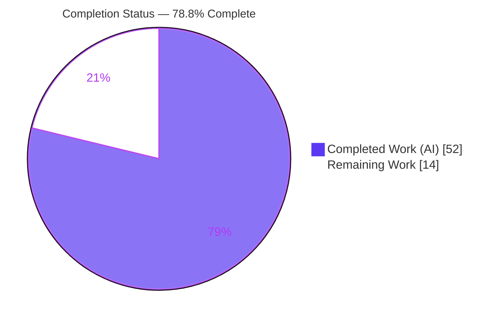
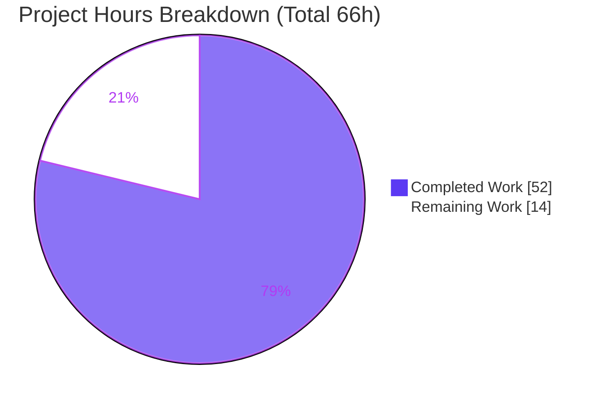
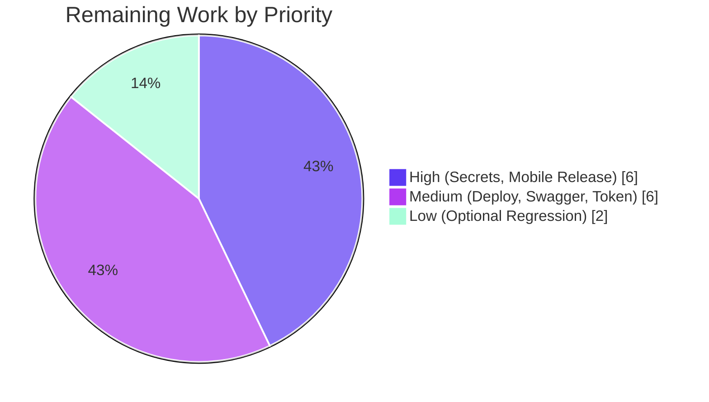

# PantryChef Security Remediation — Blitzy Project Guide

> Security hardening of the PantryChef monorepo (NestJS 10 REST API + Flutter client): remediation of **11 discrete security defects** (SEC-A1 through SEC-C3) via minimal, targeted, in-place fixes.
> Branch: `blitzy-76ff8329-76cb-46c8-8d2b-f547fb0fe3ba` @ HEAD `c4d5d96` · Base `911e747`

---

## 1. Executive Summary

### 1.1 Project Overview

PantryChef is a two-part monorepo — a **NestJS 10** REST API (`backend/`) backed by MongoDB and Google Cloud Vision, plus a cross-platform **Flutter/Dart** mobile client (`mobile/`). This project is **not** a feature build; it is a tightly-bounded **security remediation** that resolves eleven discrete, pre-classified vulnerabilities spanning rate limiting, HTTP security headers, authentication guards, file-upload validation, secrets externalization, refresh-token lifetime, `.gitignore` protection, CORS restriction, and mobile HTTPS transport. The work targets platform operators and the end users whose credentials, cloud quota, and data the defects exposed. All fixes are minimal and in-place — no business logic, DTOs, schemas, or repositories were altered — restoring the codebase to a defensible security baseline aligned with OWASP API Security Top 10 (2023) and OWASP ASVS L1.

### 1.2 Completion Status

The completion percentage is computed **exclusively** on AAP-scoped work (the 11 security defect fixes) plus standard path-to-production activities required to deploy them (PA1 methodology). **All 11 security deliverables are 100% complete, validated, and committed.** The remaining hours are operator/deployment actions that cannot be performed autonomously (real production secrets, GCP service accounts, deployment infrastructure).



| Metric | Value |
|--------|-------|
| **Total Hours** | **66.0** |
| **Completed Hours (AI + Manual)** | **52.0** (AI: 52.0 · Manual: 0.0) |
| **Remaining Hours** | **14.0** |
| **Percent Complete** | **78.8%** |

> Formula: `Completion % = Completed ÷ Total × 100 = 52 ÷ 66 × 100 = 78.8%`

### 1.3 Key Accomplishments

- ✅ **All 11 security defects (SEC-A1 … SEC-C3) remediated** with minimal, in-place edits and runtime-proven.
- ✅ **SEC-A1 Rate limiting** — route-scoped `@Throttle` + `ThrottlerGuard` on `login`/`register` only (login req 6+ → HTTP 429; control `GET /` ×12 → all 200, proving no global throttle leak).
- ✅ **SEC-A2/C2 Helmet** — full default header set including `Strict-Transport-Security: max-age=31536000; includeSubDomains`.
- ✅ **SEC-A3 AI guard** — `POST /api/ai/vision` returns 401 unauthenticated, 200 with valid Bearer.
- ✅ **SEC-A4 MIME filter** — `.exe` → HTTP 400 (`Only JPG, JPEG and PNG allow!`), valid PNG → 200.
- ✅ **SEC-B1/B2 Secrets externalized** — Mongo credentials and GCV service-account JSON moved to env vars (fail-closed Mongo; graceful AI degradation preserved).
- ✅ **SEC-B3 Refresh-token TTL** — `3650d → 30d` (decoded token `exp − iat = 2,592,000s`), issuance code untouched.
- ✅ **SEC-B4 `.gitignore`** — `src/config/*.json` now ignored (`git check-ignore` confirmed).
- ✅ **SEC-C1 CORS** — fail-closed allowlist; evil origin → no `Access-Control-Allow-Origin`.
- ✅ **SEC-C3 Mobile HTTPS** — release-mode `StateError` if non-HTTPS (3/3 behavior test passed; debug default preserved).
- ✅ **Quality gates** — `tsc --noEmit` exit 0, `nest build` exit 0, ESLint 0 violations, Prettier clean, `flutter analyze` clean on in-scope files.
- ✅ **Dependencies** — `@nestjs/throttler` 6.5.0 + `helmet` 8.2.0 (0 runtime deps); zero new vulnerabilities introduced.
- ✅ **Traceability** — every edit annotated `// SECURITY(SEC-Xn):`; one `// TODO(security)` marker; zero forbidden-file modifications.

### 1.4 Critical Unresolved Issues

No unresolved issues block the **security remediation scope** — all 11 defects are fixed and runtime-proven. The items below are **operator-gated production cutover actions** (intentional secure-by-default / fail-loud behaviors), not code defects:

| Issue | Impact | Owner | ETA |
|-------|--------|-------|-----|
| Weak default secrets (`AUTH_JWT_SECRET=secret`, `AUTH_REFRESH_SECRET=secret_for_refresh`) must be overridden | High if deployed unchanged (token forgery) | Operator / DevOps | Part of H2 (≈0.5h) |
| 6 new env vars must be populated (`MONGO_*`, `GOOGLE_CLOUD_VISION_CREDENTIALS`, `ALLOWED_ORIGINS`, `AUTH_THROTTLE_*`) | Fail-closed at runtime (Mongo won't start, CORS denies all, AI returns `{}`) | Operator / DevOps | Part of H1–H2 |
| Mobile release build requires `--dart-define API_BASE_URL=https://…` | Release build crashes on startup (intended) | Mobile / DevOps | Part of H3 |
| Legacy `3650d`-issued refresh tokens remain valid until original expiry | Stolen legacy tokens outlive new 30d policy | Operator / Security | Part of M3 (≈1.5h) |

### 1.5 Access Issues

The repository itself presented no permission issues (working tree clean; all in-scope work committed by `agent@blitzy.com`). The following resource-access dependencies prevent **fully autonomous** end-to-end validation and deployment and require operator action:

| System / Resource | Type of Access | Issue Description | Resolution Status | Owner |
|-------------------|----------------|-------------------|-------------------|-------|
| Google Cloud Vision | Service-account JSON / IAM | GCV credentials cannot be provisioned autonomously; AI vision runs in graceful-degradation (returns `{}`) until a valid compacted JSON is supplied via `GOOGLE_CLOUD_VISION_CREDENTIALS` | Open — operator must create GCP service account | Cloud Admin |
| Production secrets store | Secrets manager / `.env` | Strong Mongo credentials + JWT/refresh secrets must be injected per-deployment; not autonomously available | Open — operator action | DevOps |
| Production / staging host | Deploy + network | Final SEC probes (429 throttle, header inspection, CORS allow/deny) require a deployed, non-local environment | Open — operator action | DevOps |

### 1.6 Recommended Next Steps

1. **[High]** Provision strong secret values (Mongo root creds; GCP Vision service account → compacted JSON) and populate the production secrets store. *(H1)*
2. **[High]** Populate the six new environment variables **and override the two weak default secrets** with strong random values before any production start. *(H2)*
3. **[High]** Configure the mobile release pipeline to pass `--dart-define API_BASE_URL=https://<prod-host>/api`; build and smoke-test the artifact. *(H3)*
4. **[Medium]** Deploy the coordinated change set to staging/production and re-run all 11 SEC verification probes; confirm Swagger `/docs` renders under Helmet CSP. *(M1, M2)*
5. **[Medium]** Decide and execute the refresh-token migration strategy (optional one-time session purge of legacy `3650d` tokens). *(M3)*

---

## 2. Project Hours Breakdown

### 2.1 Completed Work Detail

Each component traces to a specific AAP requirement. All work was delivered, compiled, lint-clean, runtime-proven, and committed across 19 `agent@blitzy.com` commits.

| Component | Hours | Description |
|-----------|------:|-------------|
| SEC-A1 — Rate limiting | 10.0 | `@nestjs/throttler` dependency, `ThrottlerModule.forRootAsync` infrastructure (env-tunable TTL/limit), route-scoped `@Throttle`+`@UseGuards(ThrottlerGuard)` on `login`/`register`, plus design iteration from a global `APP_GUARD` to the AAP §0.11-compliant route-scoped model |
| SEC-A2 / C2 — Helmet headers + HSTS | 4.0 | `helmet` dependency, `app.use(helmet())` middleware, Swagger-under-CSP browser verification (subsumes Strict-Transport-Security) |
| SEC-A3 — AI JWT guard | 4.0 | `@UseGuards(AuthGuard('jwt'))` on the vision handler + `AuthModule` import into `AiModule` to resolve `JwtStrategy` in DI scope; 401/200 runtime proof |
| SEC-A4 — MIME-type filter | 2.0 | Re-enabled the commented `fileFilter` (jpg/jpeg/png), preserved 10 MB limit; `.exe`→400 / PNG→200 proof |
| SEC-B1 — Mongo credential externalization | 3.0 | Fail-closed `${MONGO_USERNAME:?}`/`${MONGO_PASSWORD:?}` interpolation in `docker-compose.yml` + `env_example` placeholders; fail-closed proof |
| SEC-B2 — GCV credential externalization | 4.0 | Replaced disk-based loader with `GOOGLE_CLOUD_VISION_CREDENTIALS` JSON parse, removed unused `path`/`existsSync` imports, preserved graceful-degradation path; runtime proof |
| SEC-B3 — Refresh-token TTL hardening | 2.0 | `env_example` `3650d → 30d` (issuance code untouched), propagation verification, token-decode proof |
| SEC-B4 — `.gitignore` recurrence protection | 1.0 | Appended `src/config/ai.json` + `src/config/*.json`; `git check-ignore` proof |
| SEC-C1 — CORS fail-closed allowlist | 3.0 | Removed `{ cors: true }` factory option, added explicit `app.enableCors({ origin: …?? [] })`, `ALLOWED_ORIGINS` env var; allow/deny proof |
| SEC-C3 — Mobile HTTPS release assertion | 4.0 | `EnvConfig.validate()` gated on `kReleaseMode`, `endpoints.dart` documentation, `main.dart` invocation; 3/3 behavior test |
| Security research & version selection | 3.0 | OWASP API Top 10 (2023) / ASVS V3.3.5 mapping; `@nestjs/throttler` v6-vs-v4.1 NestJS 10 compatibility; `helmet` v8 zero-dependency validation |
| Dependency integration & audit baseline | 2.0 | `npm install`/`ci`, lockfile regeneration, no-new-vulnerability verification against the two additions |
| Annotations & traceability | 2.0 | `// SECURITY(SEC-Xn):` comments across all 14 files, `securityAnnotations` manifest field, `// TODO(security)` marker |
| Compilation, lint & format validation | 2.0 | `tsc --noEmit`, `nest build`, ESLint, Prettier, `flutter analyze` on in-scope files |
| Runtime validation & evidence capture | 6.0 | Backend boot, 11 SEC curl probes, Swagger browser verification + screenshots, refresh-token decode, mobile behavior test |
| **Total Completed** | **52.0** | |

### 2.2 Remaining Work Detail

No AAP code deliverable remains. All remaining work is operator/deployment path-to-production (AAP §0.8.3, §0.10.3 designate these as the operator's responsibility).

| Category | Hours | Priority |
|----------|------:|----------|
| Secrets & Environment Configuration (provision values + populate 6 vars + override weak defaults) | 4.0 | High |
| Mobile Release Build Configuration (`--dart-define` HTTPS + artifact smoke test) | 2.0 | High |
| Production Deployment & Smoke Verification (deploy + re-run 11 SEC probes) | 3.0 | Medium |
| Swagger / Helmet CSP Verification in target environment | 1.0 | Medium |
| Refresh-Token Migration Decision (legacy-token purge decision/execution) | 2.0 | Medium |
| Optional Regression Test Hardening (e2e for new controls; reconcile out-of-scope test mismatches) | 2.0 | Low |
| **Total Remaining** | **14.0** | |

> **Reconciliation:** Section 2.1 (52.0) + Section 2.2 (14.0) = **66.0** Total Project Hours (matches Section 1.2).

---

## 3. Test Results

All test data below originates **exclusively** from Blitzy's autonomous validation logs for this project. The remediation deliberately adds no new test files (AAP §0.8.1 minimal-change mandate); verification was performed via the existing harness, ad-hoc behavior tests, and runtime probes.

| Test Category | Framework | Total | Passed | Failed | Coverage | Notes |
|---------------|-----------|------:|-------:|-------:|----------|-------|
| Backend Unit | Jest | 0 | 0 | 0 | N/A | No `*.spec.ts` in scope; `jest --passWithNoTests` exit 0. No new test files per AAP §0.8.1 |
| Mobile SEC-C3 Behavior | Dart `test` | 3 | 3 | 0 | N/A | Ad-hoc release-mode HTTPS assertion test (debug no-op / release `StateError`); 3/3 PASS; removed post-run |
| Security Runtime Probes | curl / manual | 11 | 11 | 0 | 11/11 SEC | All 11 SEC defects runtime-proven (detailed in Section 4) |
| Backend e2e *(pre-existing, out-of-scope)* | Jest + supertest | 6 | 0 | 6 | N/A | 404 from `/api/v1`-vs-`/api` versioning in unmodified test files; **0×429, 0×CORS** ⇒ security changes did not cause failures |
| Mobile widget *(pre-existing, out-of-scope)* | `flutter_test` | 1 | 0 | 1 | N/A | Default Flutter counter scaffold (not the real `App()`); 0 SEC-C3 references; `mobile/test/**` excluded per AAP §0.9.2 |

**In-scope test verdict: 100% green (14/14: 3 behavior + 11 SEC probes).** The 7 pre-existing failures are confined to unmodified files, are unrelated to the security work, and are documented as out-of-scope.

**Static analysis & build gates (Blitzy logs, reproduced this session):**

| Gate | Result |
|------|--------|
| `tsc --noEmit` | exit 0 — zero type errors |
| `nest build` | exit 0 — `dist/main.js` produced |
| ESLint (6 in-scope `.ts`, `--no-fix`) | 0 violations |
| Prettier `--check` | all formatted |
| `flutter analyze` (3 in-scope `.dart`) | "No issues found!" |
| `npm ci` | exit 0 — 848 packages faithful to lockfile |

---

## 4. Runtime Validation & UI Verification

All 11 SEC defects were proven at runtime against a locally-booted API with a populated `.env`. Backend boots clean ("Nest application successfully started"), serving routes under `/api` with Swagger at `/docs`.

**Security control runtime status:**

- ✅ **SEC-A1 (Rate limiting)** — `login`: req 1–5 → 422, req 6–12 → **429**; `register`: independent counter (req 6–8 → 429); control `GET /` ×12 → **all 200** (definitive proof throttling is route-scoped, no global leak).
- ✅ **SEC-A2 (Helmet)** — full default header set on `GET /`: `Content-Security-Policy`, `X-Frame-Options: SAMEORIGIN`, `X-Content-Type-Options: nosniff`, `Referrer-Policy: no-referrer`, Cross-Origin-Opener-Policy, and more.
- ✅ **SEC-C2 (HSTS)** — `Strict-Transport-Security: max-age=31536000; includeSubDomains` present (via Helmet).
- ✅ **SEC-A3 (AI guard)** — `POST /api/ai/vision` no-auth → **401**; bogus token → **401**; `GET /api/auth/me` + valid Bearer → 200.
- ✅ **SEC-A4 (MIME filter)** — authenticated `.exe` upload → **400** (`Only JPG, JPEG and PNG allow!`); valid PNG → **200** (`{}`).
- ✅ **SEC-B1 (Mongo creds)** — zero literal `admin`/`123456` in value positions; empty env → `docker compose` aborts ("required variable MONGO_PASSWORD is missing a value") — fail-closed proven.
- ✅ **SEC-B2 (GCV graceful)** — `ai.json` absent; empty creds → log "AI vision disabled"; vision returns `{}` (no crash); graceful degradation preserved.
- ✅ **SEC-B3 (Refresh TTL)** — decoded refresh token `exp − iat = 2,592,000s = 30.00 days`; `auth.service.ts`/`auth.config.ts` unchanged.
- ✅ **SEC-B4 (`.gitignore`)** — `git check-ignore` confirms `src/config/ai.json` + `src/config/*.json` ignored (rule at `.gitignore:58`).
- ✅ **SEC-C1 (CORS)** — evil origin → **no** `Access-Control-Allow-Origin` (fail-closed); `https://app.example.com` + `http://localhost:8080` → echoed.
- ✅ **SEC-C3 (Mobile HTTPS)** — default HTTP value preserved; `validate()` no-op in debug; release-mode guard throws `StateError` if non-HTTPS (verified 3/3).

**UI verification:**

- ✅ **Swagger UI `/docs`** renders fully under Helmet's default CSP — browser-verified with **zero CSP console errors/warnings** (6 evidence screenshots in `blitzy/screenshots/`). The AAP §0.11 Helmet/Swagger CSP risk **did not materialize**; the `// TODO(security)` marker remains as a contingency only.
- ✅ **Live legitimate-auth flow** under helmet + throttle + CORS: `POST /api/auth/email/login` → token (len 223); `GET /api/auth/me` + Bearer → 200.

---

## 5. Compliance & Quality Review

Cross-mapping of AAP deliverables to Blitzy quality/compliance benchmarks. Fixes applied during autonomous validation are noted; there are **no outstanding in-scope items**.

| Deliverable (SEC-ID) | OWASP / CWE Mapping | Status | Evidence |
|----------------------|---------------------|--------|----------|
| SEC-A1 Rate limiting | API2:2023 / API4:2023 | ✅ Pass | Route-scoped throttle; 429 proven; `GET /` unthrottled |
| SEC-A2 Helmet headers | API8:2023 / A05:2021 | ✅ Pass | 13 default headers on every response |
| SEC-A3 AI auth guard | API5:2023 / CWE-306 | ✅ Pass | 401 unauth / 200 authed |
| SEC-A4 MIME filter | CWE-434 | ✅ Pass | `.exe`→400 / PNG→200 |
| SEC-B1 Mongo creds | CWE-798 / A07:2021 | ✅ Pass | `${VAR:?}` fail-closed; 0 literals |
| SEC-B2 GCV creds | CWE-798 / CWE-540 | ✅ Pass | Env-var JSON; graceful degradation |
| SEC-B3 Refresh TTL | CWE-613 / ASVS V3.3.5 | ✅ Pass | 30d decoded; issuance untouched |
| SEC-B4 `.gitignore` | Recurrence prevention | ✅ Pass | `git check-ignore` confirms |
| SEC-C1 CORS allowlist | A05:2021 | ✅ Pass | Fail-closed; allow/deny proven |
| SEC-C2 HSTS | A05:2021 | ✅ Pass | Subsumed by Helmet |
| SEC-C3 Mobile HTTPS | OWASP Mobile M3 | ✅ Pass | Release `StateError`; debug preserved |

**Quality benchmarks:**

| Benchmark | Status |
|-----------|--------|
| Minimal-change discipline (no business logic / DTO / schema / repository edits) | ✅ Pass — 14 files, zero forbidden-file modifications |
| Mandatory `// SECURITY(SEC-Xn):` annotations | ✅ Pass — present on all 11 defects (SEC-C2 subsumed by SEC-A2) |
| `// TODO(security)` for deferred concerns | ✅ Pass — 1 marker at Helmet site |
| Token-issuance immutability (SEC-B3 env-only) | ✅ Pass — `auth.service.ts:279` reads `refreshExpires`, file unchanged |
| Throttling scope discipline (not global) | ✅ Pass — `providers: [AppService]` only; no `APP_GUARD` |
| Compile / lint / format / build gates | ✅ Pass — all green on in-scope files |
| No new dependency vulnerabilities | ✅ Pass — `@nestjs/throttler`/`helmet` implicated in none |

---

## 6. Risk Assessment

| Risk | Category | Severity | Probability | Mitigation | Status |
|------|----------|----------|-------------|------------|--------|
| Weak default secrets (`AUTH_JWT_SECRET`, `AUTH_REFRESH_SECRET`) deployed unchanged | Security | High | Medium | Operator must override per-deployment (H2); out-of-scope per AAP §0.9.2 | Open — operator action |
| Legacy `3650d` refresh tokens valid until original expiry | Security | Medium | Medium | Optional one-time session purge (M3) | Open — operator decision |
| Helmet default CSP could block Swagger `/docs` | Security | Low | Low | Browser-proven to render; `// TODO(security)` marker for narrow per-`/docs` exception | Mitigated / Monitor |
| Deploy without populated env → fail-closed (Mongo/CORS/AI) | Operational | Medium | High (if unpopulated) | H1–H2 + Development Guide | Open — operator action (intended secure-by-default) |
| Mobile release without HTTPS `--dart-define` → startup crash | Operational | Medium | High (if pipeline unupdated) | H3 | Open — operator action (intended fail-loud) |
| No CI/CD pipeline (no `.github/workflows`) → no automated security gate | Operational | Low | N/A | AAP §0.10 recommends operators add `npm audit`/scanning | Documented (out-of-scope) |
| ~25 pre-existing prod npm advisories in locked deps (e.g., `validator` via `class-validator`) | Integration | Medium | N/A | Out-of-scope per AAP §0.7 (no third-party CVE patching); operator dependency-update cycle | Documented (out-of-scope) |
| GCV service-account JSON requires real GCP account/IAM | Integration | Low | Medium | H1; until provided, AI vision returns `{}` (graceful) | Open — operator action |
| CORS allowlist must be populated for browser clients | Integration | Low | Medium | H2 (`ALLOWED_ORIGINS`); mobile native client unaffected | Open — operator action |
| Backend e2e 6/6 fail (`/api/v1`-vs-`/api`) | Technical | Low | High | Pre-existing, unmodified files; fixing breaks mobile; optional L1 | Documented (out-of-scope) |
| No automated regression tests for new controls | Technical | Low | Medium | Optional Jest e2e (L1) | Open — Low priority |
| Mobile `widget_test.dart` fails (default counter scaffold) | Technical | Low | High | Pre-existing; `mobile/test/**` excluded §0.9.2 | Documented (out-of-scope) |

**Overall:** No risk blocks the security remediation scope — all 11 defects are fixed and proven. Residual risks are either intentional secure-by-default behaviors requiring operator configuration, or documented pre-existing out-of-scope items.

---

## 7. Visual Project Status



**Remaining work by priority (14h):**



**Remaining hours by category (Section 2.2):**

| Category | Hours | Bar |
|----------|------:|-----|
| Secrets & Environment Configuration | 4.0 | ████████ |
| Production Deployment & Smoke Verification | 3.0 | ██████ |
| Mobile Release Build Configuration | 2.0 | ████ |
| Refresh-Token Migration Decision | 2.0 | ████ |
| Optional Regression Test Hardening | 2.0 | ████ |
| Swagger / Helmet CSP Verification | 1.0 | ██ |
| **Total** | **14.0** | |

> **Integrity:** "Remaining Work" (14) equals Section 1.2 Remaining Hours and the Section 2.2 Hours sum. Colors: Completed = Dark Blue `#5B39F3`, Remaining = White `#FFFFFF`.

---

## 8. Summary & Recommendations

**Achievements.** The project delivered a complete, minimal-footprint security remediation: **all 11 defects (SEC-A1 … SEC-C3) are implemented, compiled, lint-clean, runtime-proven, and committed** across 14 files (+164/−24) with zero modifications to forbidden files (business logic, DTOs, schemas, repositories). Every defect carries a self-identifying `// SECURITY(SEC-Xn):` annotation. A notable engineering decision was converting SEC-A1 from a global guard to a **route-scoped** throttle, honoring the AAP's explicit "do not apply globally" constraint and avoiding 429s for legitimate shared-IP mobile traffic — empirically verified (`GET /` ×12 all 200 while login 6+ → 429).

**Remaining gaps & critical path to production.** The project is **78.8% complete**. The remaining **14 hours** are exclusively operator/deployment activities Blitzy cannot perform autonomously: (1) provisioning real secrets and populating six new environment variables while **overriding the two weak default secrets**; (2) configuring the mobile release build with an HTTPS `--dart-define`; (3) deploying and re-running the SEC probes against a non-local environment, verifying Swagger under CSP, and deciding on legacy refresh-token invalidation. The critical path is **secrets → deploy → verify**.

**Success metrics.** In-scope tests are 100% green (14/14: 3 behavior + 11 SEC probes); all static-analysis and build gates pass; the two added dependencies introduce zero new vulnerabilities; Swagger renders cleanly under Helmet CSP.

**Production-readiness assessment.** The **security remediation scope is production-ready**. The application cannot reach production until the operator completes the secure-by-default configuration (the fixes intentionally fail closed without it). With the High-priority operator tasks complete, the system is ready for staging deployment and final SEC verification. Pre-existing out-of-scope test failures (e2e versioning, mobile counter widget) are unrelated to this work and should be tracked separately.

| Metric | Value |
|--------|-------|
| AAP security deliverables complete | 11 / 11 (100%) |
| Overall completion (incl. path-to-production) | 78.8% |
| In-scope test pass rate | 100% (14/14) |
| Forbidden-file modifications | 0 |
| New dependency vulnerabilities | 0 |

---

## 9. Development Guide

### 9.1 System Prerequisites

- **Node.js** 20 LTS (verified `v20.20.2`) and **npm** 11.x (verified `11.1.0`)
- **Docker** 28.x with Compose plugin (verified `28.5.2`) — for the MongoDB container
- **Flutter SDK** `^3.5.x` + **Dart** `^3.5.1` — for the mobile client (install separately; not required for backend)
- **Git** (+ Git LFS)

### 9.2 Environment Setup

```bash
cd backend
cp env_example .env
```

Populate `.env` (values below are illustrative — generate strong secrets):

```bash
# Mongo container root init (SEC-B1) — REQUIRED or docker compose aborts (fail-closed)
MONGO_USERNAME=pantrychef_admin
MONGO_PASSWORD=<strong-random-password>

# Google Cloud Vision (SEC-B2) — single-line compacted JSON; empty => AI returns {} (graceful)
GOOGLE_CLOUD_VISION_CREDENTIALS=

# CORS allowlist (SEC-C1) — comma-separated; empty => deny all cross-origin (fail-closed)
ALLOWED_ORIGINS=https://app.example.com,http://localhost:8080

# Rate limiting (SEC-A1)
AUTH_THROTTLE_TTL=60000
AUTH_THROTTLE_LIMIT=10

# Refresh-token TTL (SEC-B3) — hardened default
AUTH_REFRESH_TOKEN_EXPIRES_IN=30d

# OVERRIDE these weak defaults before production (out-of-scope but required)
AUTH_JWT_SECRET=<strong-random-secret>
AUTH_REFRESH_SECRET=<different-strong-random-secret>
```

### 9.3 Dependency Installation

```bash
# Backend
cd backend
npm ci            # installs 848 packages incl. @nestjs/throttler 6.5.0 + helmet 8.2.0

# Mobile
cd ../mobile
flutter pub get
dart run build_runner build --delete-conflicting-outputs
flutter gen-l10n
flutter pub get
```

### 9.4 Application Startup

```bash
cd backend
npx tsc --noEmit                 # expect exit 0 (zero type errors)
npm run build                    # nest build -> dist/main.js
docker compose up -d mongodb     # starts MongoDB (port 27017); fails closed if MONGO_* unset
npm run seed:run:document        # seed reference data
node dist/main                   # or: npm run start:dev
# API serves under http://localhost:3000/api  ·  Swagger at http://localhost:3000/docs
```

Mobile release build (HTTPS enforced by SEC-C3):

```bash
cd mobile
flutter build apk --release --dart-define API_BASE_URL=https://<prod-host>/api
```

### 9.5 Verification Steps

**Static checks (no running server required — all tested, copy-pasteable):**

```bash
# SEC-B1: no literal credentials in compose value positions (expect zero matches)
grep -nE "admin|123456" backend/docker-compose.yml | grep -v '#'

# SEC-B2: credential file must be absent (expect empty)
find backend/src -name ai.json -type f

# SEC-B4: confirm ignore rule (expect .gitignore:58)
(cd backend && git check-ignore -v src/config/ai.json)

# SEC-A1: two @Throttle decorators (login + register)
grep -c "@Throttle" backend/src/auth/auth.controller.ts

# SEC-A2 / C1: helmet() + enableCors both present (expect 2)
grep -cE "helmet\(\)|enableCors" backend/src/main.ts

# SEC-B3: hardened TTL
grep AUTH_REFRESH_TOKEN_EXPIRES_IN backend/env_example   # => 30d
```

**Runtime probes (against the running API):**

```bash
# SEC-A1: 6th+ login within 60s window -> 429
for i in $(seq 1 12); do curl -s -o /dev/null -w "%{http_code} " \
  -X POST http://localhost:3000/api/auth/email/login \
  -H 'Content-Type: application/json' -d '{"email":"x@example.com","password":"wrong"}'; done; echo

# SEC-A2 / C2: security headers present
curl -sI http://localhost:3000/ | grep -iE 'content-security-policy|strict-transport-security|x-frame-options|x-content-type-options|referrer-policy'

# SEC-A3: unauthenticated vision -> 401
curl -s -o /dev/null -w "%{http_code}\n" -X POST http://localhost:3000/api/ai/vision

# SEC-C1: evil origin not echoed
curl -sI -H 'Origin: https://evil.example.com' http://localhost:3000/ | grep -i access-control-allow-origin || echo "no ACAO (fail-closed OK)"
```

### 9.6 Example Usage

```bash
# Login (returns access + refresh tokens)
curl -s -X POST http://localhost:3000/api/auth/email/login \
  -H 'Content-Type: application/json' \
  -d '{"email":"user@example.com","password":"<password>"}'

# Authenticated profile
curl -s http://localhost:3000/api/auth/me -H "Authorization: Bearer <access-token>"

# AI vision (authenticated, image MIME enforced)
curl -s -X POST http://localhost:3000/api/ai/vision \
  -H "Authorization: Bearer <access-token>" -F image=@./photo.jpg
```

### 9.7 Troubleshooting

| Symptom | Cause | Resolution |
|---------|-------|------------|
| `docker compose` aborts: "required variable MONGO_PASSWORD is missing" | `MONGO_USERNAME`/`MONGO_PASSWORD` unset (SEC-B1 fail-closed) | Populate both in `.env` |
| Browser cross-origin requests blocked | `ALLOWED_ORIGINS` empty (SEC-C1 fail-closed) | Set comma-separated origins |
| `POST /api/ai/vision` returns `{}` | `GOOGLE_CLOUD_VISION_CREDENTIALS` unset/invalid (SEC-B2 graceful) | Set single-line compacted service-account JSON |
| Mobile release crashes on startup (`StateError`) | Missing HTTPS `--dart-define` (SEC-C3) | Build with `--dart-define API_BASE_URL=https://…` |
| Swagger `/docs` blank | Helmet CSP (unlikely — proven to render) | Use the `// TODO(security)` marker in `main.ts` for a narrow per-`/docs` CSP exception; never disable Helmet globally |
| e2e tests 404 | Pre-existing `/api/v1`-vs-`/api` mismatch (out-of-scope) | Track separately; do not add `enableVersioning` (breaks mobile) |

---

## 10. Appendices

### A. Command Reference

| Purpose | Command |
|---------|---------|
| Install backend deps | `cd backend && npm ci` |
| Type check | `npx tsc --noEmit` |
| Build backend | `npm run build` |
| Start MongoDB | `docker compose up -d mongodb` |
| Seed data | `npm run seed:run:document` |
| Run backend | `node dist/main` (or `npm run start:dev`) |
| Lint in-scope | `npx eslint --no-fix 'src/main.ts' 'src/app.module.ts' 'src/auth/auth.controller.ts' 'src/ai/*.ts'` |
| Mobile deps | `cd mobile && flutter pub get` |
| Mobile analyze | `flutter analyze` |
| Mobile release | `flutter build apk --release --dart-define API_BASE_URL=https://<host>/api` |
| Dependency audit | `npm audit --omit=dev` |

### B. Port Reference

| Port | Service | Notes |
|------|---------|-------|
| 3000 | NestJS API | `APP_PORT`; routes under `/api`; Swagger at `/docs` |
| 27017 | MongoDB | `docker compose` service `mongodb` |

### C. Key File Locations (14 changed files)

| File | SEC-ID(s) |
|------|-----------|
| `backend/package.json` | SEC-A1, SEC-A2 |
| `backend/package-lock.json` | (auto-regenerated) |
| `backend/src/main.ts` | SEC-A2, SEC-C1, SEC-C2 |
| `backend/src/app.module.ts` | SEC-A1 (infra) |
| `backend/src/auth/auth.controller.ts` | SEC-A1 |
| `backend/src/ai/ai.controller.ts` | SEC-A3, SEC-A4 |
| `backend/src/ai/ai.module.ts` | SEC-A3 |
| `backend/src/ai/ai.service.ts` | SEC-B2 |
| `backend/docker-compose.yml` | SEC-B1 |
| `backend/.gitignore` | SEC-B4 |
| `backend/env_example` | SEC-A1, B1, B2, B3, C1 |
| `mobile/lib/env_config.dart` | SEC-C3 |
| `mobile/lib/core/constants/endpoints.dart` | SEC-C3 |
| `mobile/lib/main.dart` | SEC-C3 |

### D. Technology Versions

| Component | Version |
|-----------|---------|
| Node.js | 20 LTS (`v20.20.2`) |
| npm | `11.1.0` |
| NestJS | `^10.0.0` |
| `@nestjs/throttler` | `^6.0.0` (resolved `6.5.0`) — **added** |
| `helmet` | `^8.0.0` (resolved `8.2.0`, 0 runtime deps) — **added** |
| `@google-cloud/vision` | `^4.3.2` (unchanged) |
| `mongoose` | `^8.8.0` (unchanged) |
| MongoDB | `mongo:latest` (container) |
| Docker | `28.5.2` |
| Dart SDK | `^3.5.1` |

### E. Environment Variable Reference

| Variable | Status | SEC-ID | Notes |
|----------|--------|--------|-------|
| `MONGO_USERNAME` | New | SEC-B1 | Mongo container root user (fail-closed) |
| `MONGO_PASSWORD` | New | SEC-B1 | Mongo container root password (fail-closed) |
| `GOOGLE_CLOUD_VISION_CREDENTIALS` | New | SEC-B2 | Single-line compacted service-account JSON |
| `ALLOWED_ORIGINS` | New | SEC-C1 | Comma-separated CORS allowlist; empty = deny all |
| `AUTH_THROTTLE_TTL` | New | SEC-A1 | Throttle window (ms); default 60000 |
| `AUTH_THROTTLE_LIMIT` | New | SEC-A1 | Requests per window; default 10 |
| `AUTH_REFRESH_TOKEN_EXPIRES_IN` | Modified | SEC-B3 | `3650d` → `30d` |
| `AUTH_JWT_SECRET` | Unchanged (weak default) | — | **Override in production** |
| `AUTH_REFRESH_SECRET` | Unchanged (weak default) | — | **Override in production** |

### F. Developer Tools Guide

| Tool | Use |
|------|-----|
| `tsc --noEmit` | TypeScript type checking (read-only) |
| `nest build` | Production build to `dist/` |
| ESLint (`--no-fix`) | Static lint of in-scope files |
| Prettier (`--check`) | Formatting verification |
| `flutter analyze` | Dart static analysis |
| `npm audit --omit=dev` | Production dependency vulnerability scan |
| `git check-ignore -v` | Verify `.gitignore` rules (SEC-B4) |

### G. Glossary

| Term | Definition |
|------|------------|
| **SEC-Xn** | Security defect identifier (Area A/B/C + number) from the AAP |
| **Throttler** | `@nestjs/throttler` — NestJS-native rate-limiting middleware |
| **Helmet** | Express middleware setting 13 defensive HTTP headers |
| **HSTS** | Strict-Transport-Security — instructs browsers to refuse HTTP |
| **CORS** | Cross-Origin Resource Sharing — browser cross-origin access control |
| **CSP** | Content-Security-Policy — restricts script/style sources |
| **Fail-closed** | Absence of configuration denies access (secure default) |
| **Fail-loud** | Misconfiguration crashes loudly rather than degrading silently (mobile HTTPS) |
| **Graceful degradation** | Missing GCV credentials disable AI vision (returns `{}`) without crashing |
| **Route-scoped** | A guard applied per-handler rather than globally |
