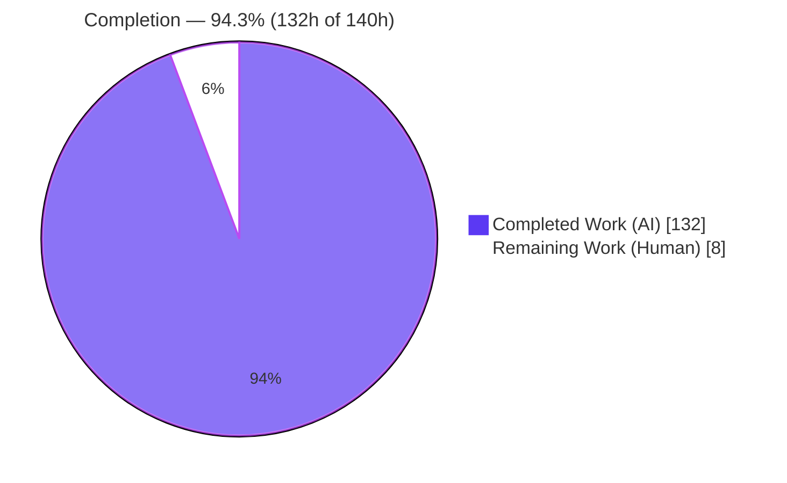
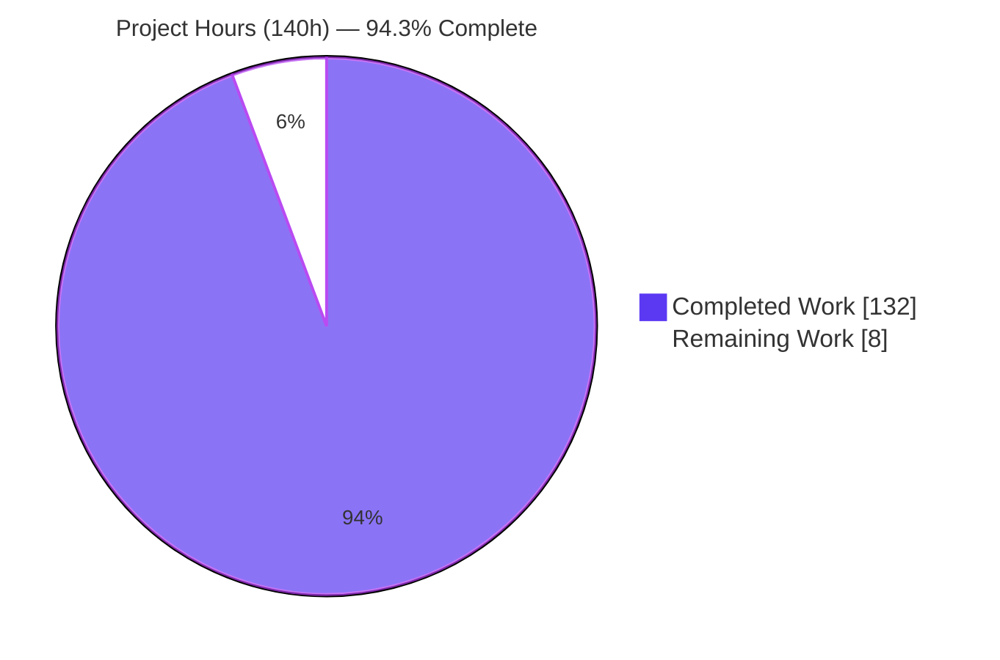
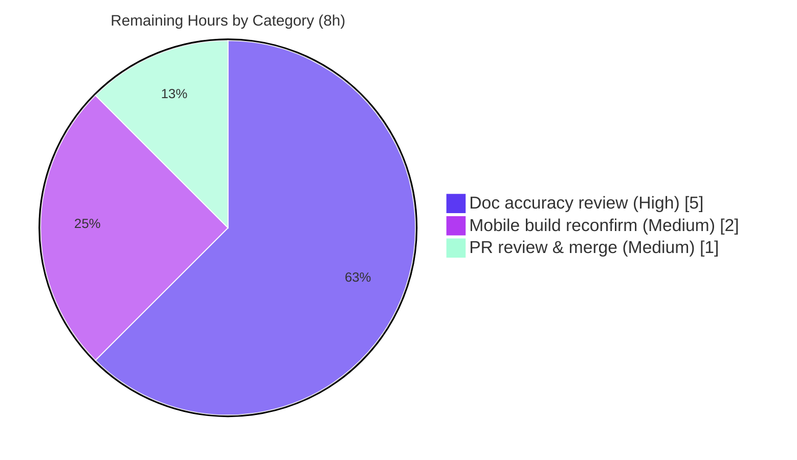

# PantryChef Monorepo — Documentation Initiative — Blitzy Project Guide

> Scope: Additive-only documentation for the **PantryChef** monorepo (NestJS 10 backend + Flutter/Dart 3.5 BLoC mobile + MongoDB/Mongoose 8). Completion is measured strictly against the Agent Action Plan (AAP) and path-to-production for the documentation deliverable.

---

## 1. Executive Summary

### 1.1 Project Overview

PantryChef is a recipe-and-pantry management platform comprising a NestJS 10 REST backend, a Flutter/Dart 3.5 BLoC mobile client, and a MongoDB persistence layer via Mongoose 8. This initiative delivers **additive-only documentation** — no production logic, interface, or runtime behavior is changed. The work authors 13 module/feature READMEs, 4 standalone `docs/*.md` references, two replaced root READMEs, and inline JSDoc/Dartdoc across ~213 in-scope source files. It targets developers and maintainers who currently have near-zero documentation, surfaces latent security/operational quirks as `KNOWN ISSUE` / `SECURITY NOTE` callouts, and preserves all misspelled identifiers verbatim. The technical scope spans architecture, API reference, data models, and deployment knowledge.

### 1.2 Completion Status



| Metric | Hours |
|--------|-------|
| **Total Hours** | **140** |
| Completed Hours (AI + Manual) | 132 |
| &nbsp;&nbsp;• Completed by Blitzy AI agents | 132 |
| &nbsp;&nbsp;• Completed by Manual work | 0 |
| Remaining Hours | 8 |
| **Percent Complete** | **94.3%** |

> Completion is computed per the AAP-scoped, hours-based methodology: `Completed ÷ (Completed + Remaining) = 132 ÷ 140 = 94.3%`. Every AAP requirement (R1–R7 + cross-cutting constraints + validation gates) is **Completed**; the remaining 8 hours are human verification/sign-off path-to-production tasks, not authoring gaps. Pre-existing, out-of-scope issues are **excluded** from this denominator.

### 1.3 Key Accomplishments

- ✅ **All 19 in-scope Markdown deliverables authored & verified** — 4 `docs/*.md` (with Tables of Contents + Mermaid), 8 backend module READMEs, 5 mobile feature READMEs (all on the fixed 10-section skeleton, no ToC), plus 2 replaced root READMEs.
- ✅ **Inline documentation across the entire in-scope surface** — JSDoc/TSDoc on **96/96** backend `.ts` files and Dartdoc on **117/117** mobile `.dart` files (112 with `///`; 5 export-barrel files appropriately with `//`).
- ✅ **Provably additive** — source files (`*.ts`/`*.dart`) show **4,624 insertions and 0 deletions**; zero non-comment changes; the only deletions repo-wide are the two permitted root README replacements.
- ✅ **All validation gates green (independently re-verified for backend)** — `tsc --noEmit` 0 errors, ESLint 0 problems, `nest build` produces `dist/main.js`, `docker compose config` valid; mobile `dart analyze` 0 errors + `build_runner` 156 outputs per validator logs.
- ✅ **Runtime confirmed** — backend boots ("Nest application successfully started"), Swagger UI live at `/docs` (200), end-to-end auth flow works (register → login → JWT → authenticated `creation-data` returns 5 categories + 9 units).
- ✅ **Quality discipline honored** — 198 internal links resolve (0 broken, independently re-checked), all Mermaid fences paired, all 7 misspelled identifiers preserved, Cyrillic comment retained, inline column limits respected (0 backend lines >100 cols, 0 mobile >80 cols).
- ✅ **Latent risks surfaced** — 60 files carry `KNOWN ISSUE` callouts and 33 carry `SECURITY` callouts (default credentials, Dio bearer-token logging, no-guard AI endpoint, hard-delete `softDelete`, etc.).

### 1.4 Critical Unresolved Issues

| Issue | Impact | Owner | ETA |
|-------|--------|-------|-----|
| _None blocking._ Documentation is delivered, validated, and committed. | No release blocker introduced by this work | — | — |
| Human SME accuracy sign-off pending (path-to-production) | Standard gate before merge; low risk | Reviewing Engineer | 0.5 day |
| Mobile static analysis not re-run in this assessment container (no Flutter SDK on PATH) | Low — confirmed 0 errors via validator logs; needs human reconfirm | Mobile Engineer | 0.25 day |

> Note: Several **pre-existing, out-of-scope** code conditions (default secrets, Dio token logging, no-guard AI endpoint, default widget test, a 1-line `pubspec.yaml` lint mis-indent) are intentionally **documented, not fixed**, per the additive-only mandate. They are tracked in §6 (Risk Assessment) and §8 (Out-of-Scope Backlog) and are **not** counted against completion.

### 1.5 Access Issues

| System/Resource | Type of Access | Issue Description | Resolution Status | Owner |
|-----------------|----------------|-------------------|-------------------|-------|
| Git repository | Read/Write | Full access on branch `blitzy-7968010f-0bca-4468-a430-4da31a36d2e7` | ✅ No issue | — |
| Backend toolchain (Node 20, npm, Docker) | Execute | Available; `tsc`/`eslint`/`nest build`/`docker compose config` re-run successfully | ✅ No issue | — |
| Mobile toolchain (Flutter/Dart SDK) | Execute | Not on PATH in the assessment container; mobile gates verified via Blitzy validator logs + committed QA artifacts | ⚠ Informational only — not an access block | Mobile Engineer |

**No access issues identified** that prevent build validation, integration, or deployment. The mobile-SDK note is informational: the validator executed `dart analyze`/`build_runner` successfully (logs and QA artifacts present in `blitzy/`).

### 1.6 Recommended Next Steps

1. **[High]** Perform an SME technical-accuracy review of the 4 long-form `docs/*.md` files and spot-check `Source:<path>:<line>` citations, the 5 documented known-issues, and the 7 preserved misspellings against current code. *(~5h)*
2. **[Medium]** Reconfirm mobile build integrity in a full Flutter SDK environment: `flutter pub get` → `flutter gen-l10n` → `dart run build_runner build --delete-conflicting-outputs` → `dart analyze` (expect 0 errors, 1 pre-existing warning). *(~2h)*
3. **[Medium]** Review the additive diff (confirm 0 production-code lines changed), approve, and merge to `main`. *(~1h)*
4. **[Low]** (Out-of-scope, optional) Triage the surfaced security backlog — rotate default secrets, gate Dio header logging, add a JWT guard + MIME filter to the AI `/vision` endpoint.
5. **[Low]** (Future enhancement) Add documentation CI: markdownlint + relative-link checker + Mermaid validation to prevent future drift.

---

## 2. Project Hours Breakdown

### 2.1 Completed Work Detail

| Component | Hours | Description |
|-----------|------:|-------------|
| `docs/API_REFERENCE.md` | 9.0 | REST reference (969 lines, 234 citations, 2 Mermaid): all endpoints under `/api`, request/response DTO tables, error codes, Swagger `/docs` + versioning divergence notes |
| `docs/DATA_MODELS.md` | 6.5 | Mongoose + Dart model reference (652 lines, 59 citations, classDiagram): User+Preferences, PantryIngridient, Recipe, Ingridient, Session; soft-vs-hard-delete matrix |
| `docs/ARCHITECTURE.md` | 5.5 | System design (491 lines, 77 citations, 3 Mermaid): monorepo layout, backend layered + mobile clean architecture, request lifecycle, integrations |
| `docs/DEPLOYMENT.md` | 4.5 | How-to guide (349 lines, 61 citations, topology graph): Docker Compose bring-up, env tables, seeding, Vision `ai.json`, security warnings |
| 8 backend module READMEs | 17.5 | `auth, users, pantry, recipe, ingridient, ai, session, database` — fixed 10-section skeleton + Mermaid + citations each |
| 5 mobile feature READMEs | 12.5 | `authentication, pantry, recipe, ingredient, profile` — fixed 10-section skeleton + Mermaid + citations each |
| 2 root README replacements | 4.0 | `backend/README.md` (stub → full overview) + `mobile/README.md` (Flutter starter → full overview), links into `docs/` |
| Backend inline JSDoc/TSDoc (96 `.ts`) | 24.0 | Class/method docs (`@param`/`@returns`/`@throws`), one-line DTO field docs, `KNOWN ISSUE` annotations; ≤100 cols |
| Mobile inline Dartdoc (117 `.dart`) | 26.0 | Class/method `///`, BLoC event/state + model-field one-liners, `SECURITY NOTE`s; ≤80 cols |
| Known-issue/security callouts + misspelling preservation (R6/R7) | 5.0 | Locating + precisely annotating 5 quirks across 60 files; preserving 7 misspellings + Cyrillic comment |
| Documentation best-practice research (Diátaxis) | 1.5 | Reference-vs-how-to-vs-explanation content strategy grounding |
| Validation, QA & runtime verification | 16.0 | `tsc`/ESLint/`nest build`/`gen-l10n`/`build_runner`/`dart analyze`, Docker+MongoDB bring-up, live auth flow, Swagger, link + Mermaid + column audits across multiple QA rounds |
| **Total Completed** | **132.0** | Matches Completed Hours in §1.2 |

### 2.2 Remaining Work Detail

| Category | Hours | Priority |
|----------|------:|----------|
| SME documentation technical-accuracy review & sign-off (citations, known-issues, links) | 5.0 | High |
| Mobile build/analysis reconfirmation in full Flutter SDK environment (+ optional emulator visual check) | 2.0 | Medium |
| Final PR review (verify additive diff) & merge coordination | 1.0 | Medium |
| **Total Remaining** | **8.0** | Matches Remaining Hours in §1.2 and §7 |

### 2.3 Total Project Hours

| Bucket | Hours |
|--------|------:|
| Completed (§2.1) | 132.0 |
| Remaining (§2.2) | 8.0 |
| **Total Project** | **140.0** |
| **Percent Complete** | **94.3%** |

> Integrity: §2.1 (132) + §2.2 (8) = 140 = §1.2 Total. Remaining (8) is identical in §1.2, §2.2, and §7.

---

## 3. Test Results

This is an **additive documentation task with zero in-scope unit tests by design** (the codebase ships no backend unit specs; the single mobile test is a pre-existing default). Accordingly, Blitzy's autonomous validation centered on **static analysis, build, runtime, and documentation-quality gates**. All results below originate from Blitzy's autonomous validation logs/artifacts (and were independently re-run for the backend during this assessment).

| Test / Validation Category | Framework / Tool | Total | Passed | Failed | Coverage % | Notes |
|----------------------------|------------------|------:|------:|------:|-----------:|-------|
| Backend type-check | `tsc --noEmit` (TS 5.6.3) | 96 files | 96 | 0 | n/a | 0 errors — additive comments don't break compilation (re-verified) |
| Backend lint | ESLint (`--no-fix`) | `src/**/*.ts` | Pass | 0 | n/a | 0 problems (re-verified) |
| Backend build | `nest build` | 1 | 1 | 0 | n/a | `dist/main.js` produced (re-verified) |
| Backend unit tests | Jest 29.7.0 | 0 | 0 | 0 | n/a | No in-scope spec files (pre-existing by design) |
| Backend auth flow (runtime) | Live HTTP + MongoDB | 1 flow | 1 | 0 | n/a | register→200, login→JWT, `creation-data`→5 categories + 9 units |
| Mobile static analysis | `dart analyze` | full `lib/` | Pass | 0 errors | n/a | 0 errors; 1 **pre-existing** warning (out-of-scope `pubspec` mis-indent) |
| Mobile codegen | `build_runner` 2.4.6 | 546 actions | 156 outputs | 0 | n/a | Codegen intact; baseline == post-doc |
| Mobile widget test | `flutter_test` | 1 | 0 | 1 | n/a | Default "counter" smoke test — **pre-existing, OUT-OF-SCOPE** (AAP §0.8); unrelated to docs |
| Documentation link integrity | Custom relative-link resolver | 198 | 198 | 0 | 100% | 0 broken links (independently re-verified) |
| Mermaid fence integrity | Static delimiter check | all blocks | Pass | 0 | n/a | All ` ```mermaid ` fences paired |

**Test-health summary:** All in-scope gates pass. The two non-passing rows (no backend unit specs; failing mobile counter smoke test) are **pre-existing and explicitly out of scope** — provably unrelated to the documentation work (0 production-code lines changed).

---

## 4. Runtime Validation & UI Verification

**Backend runtime** (live bring-up with Docker MongoDB):
- ✅ **Operational** — Application boots: "Nest application successfully started"; all `/api/*` routes mapped (see `blitzy/qa_screenshots/live_routes.txt`).
- ✅ **Operational** — Swagger UI `GET /docs` → **200**; `GET /api/docs` → **404** (confirms the documented divergence); `/docs-json` → 200.
- ✅ **Operational** — End-to-end auth: `POST /api/auth/email/register` → 200; `POST /api/auth/email/login` → JWT; authenticated `GET /api/ingredient/creation-data` → exactly **5 categories + 9 units** (matches docs).
- ✅ **Operational** — Effective base URL is `/api` (no `/v1/`), accurately documented inline (`main.ts` KNOWN ISSUE) and in `API_REFERENCE.md`.

**Mobile runtime**:
- ⚠ **Partial** — Device/emulator runtime is N/A in the CI/assessment container (no display/emulator). **Build integrity** is confirmed: `flutter gen-l10n` + `build_runner` (156 outputs) + `dart analyze` (0 errors).

**Documentation rendering**:
- ✅ **Operational** — Markdown + Mermaid render natively on GitHub/IDEs (no build step). All 19 deliverables render with diagrams and resolve internal links.

**UI verification**:
- ✅ **Not applicable by design** — This is an additive documentation task. No UI is modified; no screenshots are in scope (AAP §0.4 — Design System Alignment Protocol is N/A). The mobile UI library (`flutter_platform_widgets` ^7.0.1) is documented descriptively only.

---

## 5. Compliance & Quality Review

AAP deliverables and constraints cross-mapped to Blitzy's quality/compliance benchmarks. **Fixes applied during autonomous validation:** the Final Validator made **zero** in-scope fixes (work was already correct); prior documentation agents resolved all QA findings across 243 commits (final commits: "resolve QA FINAL_ALT findings", "resolve 12 code-review findings — citation sync").

| Benchmark / AAP Requirement | Status | Progress | Evidence |
|------------------------------|--------|---------|----------|
| Additive-only (no behavior change) | ✅ Pass | 100% | 4,624 source insertions / 0 deletions; 0 non-comment additions |
| R1 — 8 backend module READMEs | ✅ Pass | 8/8 | All present; 10-section skeleton; Mermaid + citations |
| R2 — 5 mobile feature READMEs | ✅ Pass | 5/5 | All present; 10-section skeleton; Mermaid + citations |
| R3 — 4 `docs/*.md` + 2 root README replacements | ✅ Pass | 6/6 | ToC + Mermaid + citations; both roots replaced |
| R4 — Backend inline JSDoc (96 `.ts`) | ✅ Pass | 96/96 | `tsc` 0, ESLint 0, ≤100 cols (0 violations) |
| R5 — Mobile inline Dartdoc (117 `.dart`) | ✅ Pass | 117/117 | 112 `///` + 5 barrel `//`; ≤80 cols (0 violations); `dart analyze` 0 errors |
| R6 — Capture known issues verbatim | ✅ Pass | 5/5 quirks | 60 `KNOWN ISSUE` + 33 `SECURITY` files |
| R7 — Preserve misspelled identifiers | ✅ Pass | 7/7 | `ingridient`, `ingrident`, `patry_main`, `InstractionItem`, `singup`, `profile.repositiry`, `search_ingredietn` |
| ToC discipline | ✅ Pass | 100% | 4 docs have ToC; 13 READMEs have none |
| Per-claim citations (`Source:<path>:<line>`) | ✅ Pass | 100% | Hundreds of citations; spot-checked accurate |
| Mermaid diagrams | ✅ Pass | 100% | ≥1 per file; all fences paired |
| Preserve existing comments | ✅ Pass | 100% | Cyrillic comment retained at `recipe.repository.ts:213` |
| Inline comment conventions | ✅ Pass | 100% | 0 backend lines >100 cols; 0 mobile lines >80 cols |
| Swagger documented at real path | ✅ Pass | 100% | `/docs` documented + `/api/docs` divergence noted |
| Security warnings surfaced | ✅ Pass | 100% | Default creds, Dio token logging, no-guard AI endpoint |
| Internal link integrity | ✅ Pass | 198/198 | 0 broken (independently re-checked) |

**Outstanding compliance items:** None within AAP scope. Out-of-scope remediation (security hardening, test modernization) is tracked in §6/§8 and intentionally not performed under the additive-only mandate.

---

## 6. Risk Assessment

| Risk | Category | Severity | Probability | Mitigation | Status |
|------|----------|----------|-------------|------------|--------|
| **Additive comments altering behavior** (headline) | Technical | None | Very Low | Proven: 4,624 src insertions / 0 deletions; `tsc` 0, ESLint 0, `dart analyze` 0, runtime OK | ✅ Closed / Verified |
| Documentation citation drift (`Source:path:line` desync on future code edits) | Technical | Low | Medium | Citations enable detection; re-validate on change; optional docs CI | Open (inherent) |
| Codegen prerequisite (fresh clone shows analyzer errors until `gen-l10n` + `build_runner` regenerate gitignored files) | Technical/Operational | Low | Medium | Documented in mobile README + DEPLOYMENT run steps | Documented (not doc-introduced) |
| Mobile analysis not re-run in assessment env (no Flutter SDK on PATH) | Technical | Low | Low | Validator logs show 0 errors post `gen-l10n`; human reconfirm (in §2.2) | Mitigated |
| Default/weak secrets in `env_example` (`admin`/`123456`, `AUTH_JWT_SECRET=secret`) | Security | High | Medium | `SECURITY NOTE` in DEPLOYMENT + auth README; rotate before prod | Documented (fix out-of-scope) |
| Dio `LogInterceptor` logs `Authorization` bearer tokens in all builds | Security | Medium | Medium | `SECURITY NOTE` in `dio_client.dart` + READMEs; gate behind debug flag | Documented (out-of-scope) |
| AI `/vision` endpoint: no JWT guard + MIME filter commented out + 10 MB upload | Security | Medium-High | Medium | `SECURITY NOTE` in ai README + inline | Documented (out-of-scope) |
| Transitive advisory `shared_preferences_android` (GHSA-3hpf-ff72-j67p) | Security / Dependency | Low-Medium | Low | Dependency upgrade | Noted (out-of-scope) |
| No docs CI / link-check / Mermaid-lint automation | Operational | Low | Medium | Optional markdownlint + link-check CI | Open (by design — no generator) |
| Swagger path (`/docs`) + versioning divergence (no `/v1/` despite `version:'1'`) | Operational | Low | Low | Documented accurately inline + `API_REFERENCE.md` divergence note | Documented |
| Google Vision requires `ai.json`; absent → graceful degradation | Integration | Low | Medium | Provisioning workflow in DEPLOYMENT + ai README | Documented |
| Mobile `API_BASE_URL` is compile-time only (`--dart-define`), default LAN IP | Integration | Low-Medium | Medium | Documented in mobile README + DEPLOYMENT | Documented |

**Net risk posture:** The documentation work itself introduced **near-zero functional/security risk** (provably 0 code change). Every security risk above is a **pre-existing code condition** the documentation correctly **surfaced** per the additive-only mandate; remediation is future, out-of-scope code work.

---

## 7. Visual Project Status

**Project hours (Completed = Dark Blue `#5B39F3`, Remaining = White `#FFFFFF`):**



**Remaining work (8h) by category:**



**Completed work (132h) composition:**

| Group | Hours | Share |
|-------|------:|------:|
| Standalone `docs/*.md` (4) | 25.5 | 19.3% |
| Module/feature + root READMEs (15) | 34.0 | 25.8% |
| Inline JSDoc/Dartdoc (213 files) | 50.0 | 37.9% |
| Callouts/misspellings, research, validation & QA | 22.5 | 17.0% |
| **Total** | **132.0** | **100%** |

> Integrity: Pie "Remaining Work" (8) = §1.2 Remaining (8) = sum of §2.2 Hours (5+2+1=8). Pie "Completed Work" (132) = §1.2 Completed = sum of §2.1 (132).

---

## 8. Summary & Recommendations

**Achievements.** The PantryChef documentation initiative is **94.3% complete** (132 of 140 AAP-scoped hours). Every AAP requirement — 8 backend module READMEs, 5 mobile feature READMEs, 4 standalone `docs/*.md`, 2 replaced root READMEs, and inline JSDoc/Dartdoc across 96 backend `.ts` + 117 mobile `.dart` files — is **delivered, validated, and committed**. The work is **provably additive** (4,624 source insertions, 0 deletions, 0 non-comment changes) and passes every gate: backend `tsc`/ESLint/`nest build` (re-verified here), mobile `dart analyze`/`build_runner` (validator logs), live runtime auth flow, 198/198 resolving links, and full convention compliance (ToC discipline, citations, Mermaid, column limits, preserved misspellings and Cyrillic comment).

**Remaining gaps (8h, all human path-to-production).** (1) SME accuracy review/sign-off of the documentation (5h, High); (2) mobile build reconfirmation in a full Flutter SDK environment (2h, Medium); (3) PR review of the additive diff + merge (1h, Medium). These are verification gates, **not** authoring deficiencies.

**Critical path to production.** SME review → mobile reconfirm → merge. No code changes are required to ship the documentation.

**Out-of-Scope Backlog (NOT counted toward the 94.3% — surfaced for awareness).** These require editing AAP-forbidden files and are intentionally documented, not fixed:
- **OB-1** Fix `pubspec.yaml` L76 `flutter_lints` indentation (clears the single `dart analyze` warning) — ~0.5h.
- **OB-2** Replace the default `mobile/test/widget_test.dart` counter smoke test with real tests — ~2–4h.
- **OB-3** Security hardening (rotate default secrets; gate/disable Dio header logging; add JWT guard + re-enable MIME filter on AI `/vision`) — ~4–8h.
- **OB-4** Upgrade `shared_preferences_android` (advisory GHSA-3hpf-ff72-j67p) — ~0.5–1h.
- **OB-5** Add backend unit specs (none exist by design) — variable.
- **OB-6** Add docs CI (markdownlint + link checker + Mermaid validation) — ~2–3h.

**Success metrics.** 19/19 deliverables present; 213/213 in-scope files documented; 0 compile/lint/analyze errors; 0 broken links; 0 production-code lines changed.

**Production-readiness assessment.** The documentation deliverable is **production-ready pending standard human sign-off**. Confidence is **High** for backend (independently re-verified) and **Medium-High** for mobile (validator logs + QA artifacts; recommended human reconfirmation in a Flutter SDK environment).

---

## 9. Development Guide

> Commands were tested in the assessment container (Node 20.20.2, npm 11.1.0, Docker 28.5.2). Mobile commands are sourced from the manifests and Blitzy validator logs (Flutter/Dart SDK not on PATH here). Run all commands from the indicated directory.

### 9.1 System Prerequisites

- **Node.js** ≥ 18 (validated on 20.x) and **npm** (validated on 11.x) — backend
- **Docker** + Docker Compose plugin (validated on 28.x) — MongoDB + containerized backend
- **Flutter SDK** with **Dart ≥ 3.5.1** — mobile client
- **MongoDB** 27017 (provided via Docker Compose; or a local/remote instance)
- OS: Linux/macOS/WSL2; ~2 GB free disk for `node_modules` + Flutter pub cache

### 9.2 Environment Setup (Backend)

```bash
cd backend
cp env_example .env
# Review .env — defaults are for local dev only.
# SECURITY: rotate AUTH_JWT_SECRET, AUTH_REFRESH_SECRET, and DATABASE_PASSWORD before any non-local use.
```

Key variables (full table in Appendix E): `APP_PORT=3000`, `API_PREFIX=api`, `DATABASE_URL=mongodb://localhost:27017` (use `mongodb://mongodb:27017` under Compose), `AUTH_JWT_TOKEN_EXPIRES_IN=15m`, `AUTH_REFRESH_TOKEN_EXPIRES_IN=3650d`.

### 9.3 Dependency Installation

```bash
# Backend (from backend/)
npm install

# Mobile (from mobile/)
flutter pub get
flutter gen-l10n                                   # generates gitignored app_localizations.dart
dart run build_runner build --delete-conflicting-outputs   # generates *.g.dart
```

### 9.4 Application Startup

**Option A — Docker Compose (recommended; brings up MongoDB + backend):**
```bash
cd backend
docker compose up -d         # mongodb:27017 + nestjs_app:3000
docker compose logs -f nestjs
```

**Option B — Bare-metal backend (MongoDB must be reachable at DATABASE_URL):**
```bash
cd backend
npm run build                # nest build -> dist/main.js  (verified: exit 0)
npm run start:prod           # node dist/main
# or for development: npm run dev   (nest start --watch)
```

**Seed reference data (optional):**
```bash
cd backend
npm run seed:run:document
```

**Mobile (against a running backend):**
```bash
cd mobile
flutter run --dart-define API_BASE_URL=http://<host>:3000/api
# default if omitted: http://192.168.2.20:3000/api
```

### 9.5 Verification Steps

```bash
# Backend type-check, lint, build (verified exit 0)
cd backend
npx tsc --noEmit --pretty
npx eslint "src/**/*.ts" --no-fix
npm run build

# Backend runtime smoke (after startup)
curl -s -o /dev/null -w "%{http_code}\n" http://localhost:3000/docs          # expect 200 (Swagger UI)
curl -s -o /dev/null -w "%{http_code}\n" http://localhost:3000/api/docs       # expect 404 (documented divergence)

# Validate compose file without starting
docker compose config --quiet && echo "compose OK"

# Mobile static analysis (expect 0 errors; 1 pre-existing warning)
cd ../mobile
dart analyze
```

### 9.6 Example Usage (Authenticated API Flow)

```bash
# 1) Register, 2) Login (capture token), 3) Call an authenticated endpoint
curl -s -X POST http://localhost:3000/api/auth/email/register \
  -H 'Content-Type: application/json' \
  -d '{"email":"dev@example.com","password":"Password123"}'

TOKEN=$(curl -s -X POST http://localhost:3000/api/auth/email/login \
  -H 'Content-Type: application/json' \
  -d '{"email":"dev@example.com","password":"Password123"}' | python3 -c "import sys,json;print(json.load(sys.stdin).get('token',''))")

curl -s http://localhost:3000/api/ingredient/creation-data \
  -H "Authorization: Bearer $TOKEN"   # expect 5 categories + 9 units
```

### 9.7 Troubleshooting

- **Mobile analyzer/compile errors on a fresh clone** (`AppLocalizations` / `*.g.dart` not found): run `flutter gen-l10n` and `dart run build_runner build --delete-conflicting-outputs` — these files are gitignored and must be regenerated.
- **Backend cannot reach MongoDB:** check `DATABASE_URL` host — `localhost` for bare-metal, `mongodb` (service name) under Docker Compose.
- **Swagger 404:** the UI is served at `/docs`, **not** `/api/docs` (the global API prefix does not apply to the Swagger route).
- **Mobile cannot reach API:** `API_BASE_URL` is compile-time; rebuild with `--dart-define API_BASE_URL=http://<reachable-host>:3000/api`.
- **`dart analyze` shows 1 warning** (`analysis_options.yaml:10 include_file_not_found`): pre-existing `pubspec.yaml` `flutter_lints` mis-indent (out-of-scope); 0 errors.
- **Security before deploy:** rotate `AUTH_JWT_SECRET`, `AUTH_REFRESH_SECRET`, and `DATABASE_PASSWORD`; review the Dio `LogInterceptor` and AI `/vision` guard notes.

---

## 10. Appendices

### A. Command Reference

| Command | Directory | Purpose |
|---------|-----------|---------|
| `npm install` | `backend/` | Install backend dependencies |
| `npm run build` | `backend/` | `nest build` → `dist/main.js` |
| `npm run start:prod` | `backend/` | Run compiled server (`node dist/main`) |
| `npm run dev` | `backend/` | Dev server with watch |
| `npm run seed:run:document` | `backend/` | Seed reference data |
| `npx tsc --noEmit` | `backend/` | Type-check (no emit) |
| `npx eslint "src/**/*.ts" --no-fix` | `backend/` | Lint (read-only) |
| `docker compose up -d` | `backend/` | Start MongoDB + backend |
| `docker compose config` | `backend/` | Validate compose file |
| `flutter pub get` | `mobile/` | Install mobile dependencies |
| `flutter gen-l10n` | `mobile/` | Generate localizations |
| `dart run build_runner build --delete-conflicting-outputs` | `mobile/` | Generate `*.g.dart` |
| `dart analyze` | `mobile/` | Static analysis |
| `flutter run --dart-define API_BASE_URL=...` | `mobile/` | Run app against a backend |

### B. Port Reference

| Port | Service | Notes |
|------|---------|-------|
| 3000 | NestJS backend (`APP_PORT`) | Routes under `/api`; Swagger UI at `/docs` |
| 27017 | MongoDB | Compose service `mongodb`; default creds `admin`/`123456` |

### C. Key File Locations

| Path | Purpose |
|------|---------|
| `docs/ARCHITECTURE.md`, `docs/API_REFERENCE.md`, `docs/DATA_MODELS.md`, `docs/DEPLOYMENT.md` | Standalone knowledge base |
| `backend/src/<module>/README.md` | 8 backend module READMEs |
| `mobile/lib/features/<feature>/README.md` | 5 mobile feature READMEs |
| `backend/README.md`, `mobile/README.md` | Replaced root READMEs |
| `backend/src/main.ts` | Bootstrap (prefix, Swagger `/docs`, versioning note) |
| `backend/src/config/ai.json` | Google Vision service-account key (enables `isGoogleVisionEnabled`) |
| `backend/env_example`, `backend/docker-compose.yml`, `backend/Dockerfile` | Deployment sources |
| `mobile/lib/env_config.dart` | Compile-time `API_BASE_URL` |
| `mobile/lib/core/utils/dio_client.dart` | HTTP client (Dio `LogInterceptor` SECURITY NOTE) |
| `blitzy/qa_screenshots/` | Autonomous QA artifacts (live routes, Swagger screenshot, analyze logs) |

### D. Technology Versions

| Component | Version |
|-----------|---------|
| `@nestjs/core` / `@nestjs/cli` | ^10.0.0 |
| `@nestjs/swagger` | ^8.0.1 |
| `mongoose` | ^8.8.0 |
| `typescript` | ^5.1.3 (toolchain 5.6.3) |
| `passport-jwt` | ^4.0.1 |
| `class-validator` | ^0.14.1 |
| Dart SDK | ^3.5.1 |
| `bloc` / `flutter_bloc` | ^8.1.4 / ^8.1.6 |
| `dio` | ^5.7.0 |
| `get_it` | ^8.0.2 |
| `hydrated_bloc` | ^9.1.5 |
| `json_serializable` / `build_runner` | ^6.7.1 / ^2.4.6 |
| `flutter_platform_widgets` | ^7.0.1 |
| `flutter_lints` | ^4.0.0 |
| Node.js / npm (validated) | 20.20.2 / 11.1.0 |
| Docker (validated) | 28.5.2 |

### E. Environment Variable Reference

| Variable | Default (`env_example`) | Purpose |
|----------|-------------------------|---------|
| `NODE_ENV` | `development` | Runtime mode |
| `APP_PORT` | `3000` | Backend HTTP port |
| `APP_NAME` | `"NestJS API"` | App display name |
| `API_PREFIX` | `api` | Global route prefix (`/api`) |
| `DATABASE_TYPE` | `mongodb` | Persistence type |
| `DATABASE_PORT` | `27017` | MongoDB port |
| `DATABASE_USERNAME` | `admin` | ⚠ Default — rotate before prod |
| `DATABASE_PASSWORD` | `123456` | ⚠ Default — rotate before prod |
| `DATABASE_NAME` | `blitzy` | Database name |
| `DATABASE_URL` | `mongodb://localhost:27017` | Connection string (`mongodb://mongodb:27017` under Compose) |
| `FILE_DRIVER` | `local` | `local` / `s3` / `s3-presigned` |
| `AUTH_JWT_SECRET` | `secret` | ⚠ Default — rotate before prod |
| `AUTH_JWT_TOKEN_EXPIRES_IN` | `15m` | Access token TTL |
| `AUTH_REFRESH_SECRET` | `secret_for_refresh` | ⚠ Default — rotate before prod |
| `AUTH_REFRESH_TOKEN_EXPIRES_IN` | `3650d` | Refresh token TTL |
| `API_BASE_URL` (mobile, `--dart-define`) | `http://192.168.2.20:3000/api` | Compile-time backend URL |

### F. Developer Tools Guide

- **Swagger / OpenAPI:** live UI at `http://localhost:3000/docs`; JSON at `/docs-json`. Authoritative API surface, cross-referenced by `docs/API_REFERENCE.md`.
- **Mermaid:** all diagrams are fenced ` ```mermaid ` blocks rendered natively by GitHub/IDEs — no build step or extra dependency.
- **Static analysis:** backend `tsc --noEmit` + ESLint (`--no-fix`); mobile `dart analyze`. Use read-only flags to avoid mutating source.
- **Codegen:** mobile `build_runner` (for `*.g.dart`) and `flutter gen-l10n` (for localizations) — required after a fresh clone; outputs are gitignored.
- **QA artifacts:** `blitzy/qa_screenshots/` contains the live route dump, Swagger screenshot, and `dart analyze` baseline/post-doc logs from autonomous validation.

### G. Glossary

| Term | Definition |
|------|------------|
| **AAP** | Agent Action Plan — the authoritative project requirements specification |
| **Additive-only** | Constraint permitting only new Markdown files and additive comment blocks; no logic/interface/behavior change |
| **Barrel file** | A Dart `index.dart` that only re-exports other files (documented with `//`, no `///` surface) |
| **Diátaxis** | Documentation framework distinguishing tutorials, how-to guides, reference, and explanation |
| **Dartdoc / JSDoc / TSDoc** | Inline API documentation conventions for Dart / JavaScript / TypeScript |
| **`ingridient` (sic)** | Intentionally preserved misspelling of the backend module/directory |
| **`KNOWN ISSUE` / `SECURITY NOTE`** | Callout prefixes used to document quirks/risks verbatim without fixing them |
| **Soft-delete vs hard-delete** | Several `softDelete` methods perform hard deletes; documented, not corrected |
| **Graceful degradation (Vision)** | When `ai.json` is absent, `isGoogleVisionEnabled` is false and the AI endpoint degrades cleanly |