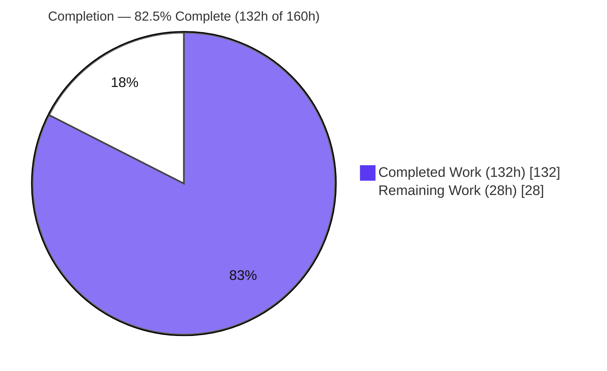
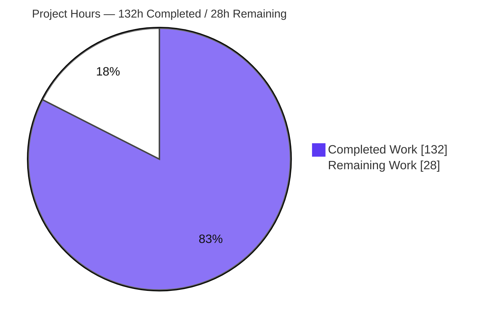
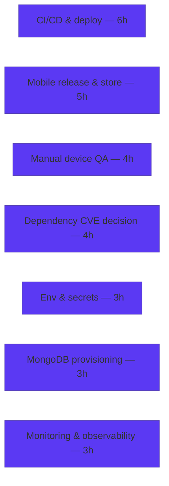

# Blitzy Project Guide — "What Can I Make Tonight?" Smart Recipe Suggestions

> **Project:** PantryChef — pantry-aware recipe suggestions (NestJS backend + Flutter mobile)
> **Branch:** `blitzy-64fea320-f073-4fc2-a283-4da818f14e04` · **HEAD:** `bbf5a3a`
> **Brand legend:** 🟦 Completed / AI Work = Dark Blue `#5B39F3` · ⬜ Remaining / Not Completed = White `#FFFFFF`

---

## 1. Executive Summary

### 1.1 Project Overview

This project adds a dedicated **"What Can I Make Tonight?"** experience to PantryChef, surfacing recipes ranked by how well they match the items currently in a user's pantry. A new JWT-guarded endpoint, `GET /api/v1/recipe/suggestions`, reuses the existing pantry-matching pipeline and returns recipes sorted descending by match score, each classified **READY** (all ingredients on hand), **ALMOST_THERE** (1–2 missing), or **MISSING** (3+ missing), plus an independent **QUICK MAKE** flag (≤5 ingredients) and the list of missing-ingredient names. A new Flutter screen renders loading, empty, error/retry, and ranked-list states with **ALMOST THERE** / **QUICK MAKE** filters. The work is strictly additive — no new modules, collections, dependencies, or environment variables — and targets PantryChef end users browsing what to cook now.

### 1.2 Completion Status



| Metric | Hours |
|--------|-------|
| **Total Hours** | **160** |
| Completed Hours (AI + Manual) | 132 |
| Remaining Hours | 28 |
| **Percent Complete** | **82.5%** |

> Completion % is computed using the AAP-scoped hours methodology: `Completed ÷ (Completed + Remaining) = 132 ÷ 160 = 82.5%`. 100% of AAP-scoped feature work is delivered and validated; the remaining 28h is standard path-to-production work.

### 1.3 Key Accomplishments

- ✅ **All 20 AAP deliverables implemented, compiled, and validated** across the NestJS backend and Flutter mobile client.
- ✅ New `GET /api/v1/recipe/suggestions` endpoint reuses the frozen `matches()` pipeline; `GET /matches` behavior preserved unchanged.
- ✅ Backend `tsc --noEmit` clean (zero TypeScript errors) and **18/18 Jest unit tests pass** (reproduced live during this assessment).
- ✅ Mobile codegen (`build_runner`), localization (`gen-l10n`), static analysis (`flutter analyze` — zero issues in source), and `flutter build web` all succeed; **5/5 flutter tests pass**.
- ✅ End-to-end runtime validated: 401 without JWT, 200 with JWT, descending match-score ordering, working **ALMOST THERE** / **QUICK MAKE** filters, aligned backend↔mobile DTO contract.
- ✅ Minimal-change discipline honored: every edit to an existing file carries an explanatory comment; spelling conventions (`ingridient`, sic) preserved.
- ✅ 139 UI verification screenshots captured across loaded / empty / error-retry / filter / responsive (375–1280) / tablet (768) states.

### 1.4 Critical Unresolved Issues

| Issue | Impact | Owner | ETA |
|-------|--------|-------|-----|
| _None blocking feature release_ | All AAP-scoped feature code compiles, passes tests, and runs correctly. No feature-code defects identified. | — | — |
| Pre-existing dependency CVEs (mongoose 8.8.0, jws 3.2.2, express 4.21.1) | Platform-level; verified **not exploitable** via this endpoint. Out of AAP scope (no dependency changes permitted). Requires a scope/security decision before a hardened production launch. | Security / Eng Lead | 4h (decision + patch) |

> No issue blocks the feature itself. The single tracked item is a pre-existing, out-of-scope platform concern surfaced for transparency.

### 1.5 Access Issues

| System / Resource | Type of Access | Issue Description | Resolution Status | Owner |
|-------------------|----------------|-------------------|-------------------|-------|
| Production MongoDB | Database credentials / URI | No production datastore provisioned; local/dev uses Docker compose `mongo:latest`. | Open — path-to-production | DevOps |
| Production secrets | `AUTH_JWT_SECRET`, `DATABASE_URL` | Repo ships placeholder dev secrets in `env_example`; production-grade secrets not yet provisioned. | Open — path-to-production | DevOps |
| App store accounts | iOS / Android signing | Release signing identities & store credentials needed for mobile distribution. | Open — path-to-production | Mobile Lead |

> No access issue prevented autonomous build, test, or runtime validation of the feature. All items above are standard production-provisioning gates.

### 1.6 Recommended Next Steps

1. **[High]** Provision production secrets & environment configuration (`AUTH_JWT_SECRET`, `DATABASE_URL`, `API_PREFIX=api`, JWT expirations).
2. **[High]** Provision & seed production MongoDB (`npm run seed:run:document`) and verify `GET /api/v1/recipe/suggestions` returns ranked data.
3. **[High]** Stand up CI/CD with automated `jest` + `flutter test` gates and a containerized backend deploy (a `Dockerfile` + `docker-compose.yml` already exist).
4. **[Medium]** Make a dependency-CVE remediation decision (patch mongoose/jws/express with regression testing, or formally accept the pre-existing risk).
5. **[Medium]** Run manual device QA on physical iOS/Android, then produce signed release builds and submit to stores.

---

## 2. Project Hours Breakdown

### 2.1 Completed Work Detail

| Component | Hours | Description |
|-----------|-------|-------------|
| Backend — Suggestions response DTO (`recipe-suggestion.dto.ts`) | 3 | 3 Swagger-annotated DTO classes (missing-ingredient, suggestion item, response envelope incl. `isPantryEmpty`). |
| Backend — `getSuggestions()` service logic (`recipe.service.ts`) | 14 | Pipeline reuse, filter normalization, READY/ALMOST_THERE/MISSING classification, missing-ingredient diff, zero-ingredient guard, NaN→1, DESC re-sort, in-memory pagination + `hasMore`. |
| Backend — `GET /suggestions` controller route | 3 | JWT-guarded route with `@ApiOkResponse` + `@ApiQuery` docs; `GET /matches` untouched. |
| Backend — Jest unit spec (18 tests, 570 lines) | 14 | Full AAP matrix incl. boundary (exactly-3 missing, exactly-5, exactly-51) & clamping cases. |
| Mobile — Suggestion DTOs + codegen | 4 | `@JsonSerializable` item/response classes + generated `.g.dart`. |
| Mobile — Repository / API / use-case layer | 9 | Interface extension, Dio `getSuggestions`, impl, `GetSuggestionsUsecase`, barrel exports. |
| Mobile — `SuggestionsBloc` (+ event/state) | 8 | Plain `Bloc`, injectable use case, explicit error path, `isPantryEmpty`, `Equatable` state + `copyWith`. |
| Mobile — `SuggestionsScreen` (4 states) | 14 | Loading / error+retry / empty-pantry / loaded; filter chips; pull-to-refresh. |
| Mobile — `SuggestionCard` widget | 9 | Match-score visualization, status chip, QUICK MAKE badge, missing-ingredient chips. |
| Mobile — Entry button + navigation wiring | 4 | Recipe-tab entry button, route constant, generator case, `BlocProvider` registration. |
| Mobile — Localization strings (l10n) | 2 | New ARB keys + `gen-l10n` regeneration. |
| Mobile — BLoC unit test (hand-written fake) | 7 | fetching→loaded, empty, error, response-mapping. |
| Companion infrastructure fixes (6 files) | 11 | URI versioning, `VERSION_NEUTRAL` health, jest `moduleNameMapper`, mobile base URL, `kIsWeb` HydratedStorage fallback, `widget_test`. |
| Autonomous security validation (CP5, 70+ probes) | 10 | Auth boundary, per-user authz, injection/input, info-exposure, headers/CORS, dependency CVE scan. |
| Autonomous performance profiling (CP7) | 5 | Latency across 5 volumes (10–5000 recipes), scaling analysis, payload bounding. |
| Autonomous runtime & UI verification | 8 | DB seed, boot, endpoint behavior, filters, 139 screenshots across states/breakpoints. |
| Review-finding remediation cycles (CP1–CP7) | 7 | Multiple QA fix commits (DESC re-sort, filter normalization, route registration, DTO contract alignment). |
| **Total Completed** | **132** | |

### 2.2 Remaining Work Detail

| Category | Hours | Priority |
|----------|-------|----------|
| Production environment & secrets configuration | 3 | High |
| Production MongoDB provisioning & seed/migration | 3 | High |
| CI/CD pipeline & backend containerized deployment | 6 | High |
| Mobile release builds & app-store submission | 5 | Medium |
| Manual device QA (physical iOS / Android) | 4 | Medium |
| Monitoring, logging & observability setup | 3 | Medium |
| Dependency CVE remediation decision (out-of-AAP; requires scope waiver) | 4 | Medium |
| **Total Remaining** | **28** | |

### 2.3 Hours Reconciliation

- Completed (2.1) **132h** + Remaining (2.2) **28h** = **160h** Total (matches §1.2). ✅
- Completion = 132 ÷ 160 = **82.5%** (matches §1.2, §7, §8). ✅
- **Optional / out-of-scope backlog (NOT counted in the 28h):** align pre-existing auth e2e expectations (~3h) and optimize the frozen `matches()` pipeline for very large catalogs (~8h). Both are explicitly out of AAP scope and excluded from the completion denominator.

---

## 3. Test Results

All tests below originate from Blitzy's autonomous validation logs for this project; the backend unit suite was additionally **reproduced live** during this assessment.

| Test Category | Framework | Total Tests | Passed | Failed | Coverage % | Notes |
|---------------|-----------|-------------|--------|--------|------------|-------|
| Backend — Unit | Jest 29 + @nestjs/testing | 18 | 18 | 0 | `getSuggestions()` path fully exercised; file 66.7% line (uncovered = pre-existing siblings out of scope) | `recipe.service.suggestions.spec.ts`; reproduced live (2.66s). |
| Mobile — BLoC/Widget | flutter_test | 5 | 5 | 0 | `suggestions_state` 100%, `suggestions_bloc` 93.3% | `suggestions_bloc_test.dart` (4) + `widget_test.dart` (1). |
| **Subtotal (Unit/Widget)** | — | **23** | **23** | **0** | — | **100% pass.** |
| Backend — E2E (non-default) | Jest e2e | 6 | 4 | 2 | n/a | 2 failures are **pre-existing auth** behaviors in frozen `auth`/`users` modules (out of AAP scope); URI-versioning companion fix improved this suite from 0/6 → 4/6. |

**Coverage notes (honest characterization).** The AAP scoped exactly two test files — a backend unit spec and a mobile BLoC test. Accordingly, the units under test are well covered (backend `getSuggestions()` via 18 tests; mobile BLoC 93.3%, state 100%). The mobile data layer (API/repository/DTO) and backend sibling methods show lower isolated-unit coverage by design; their correctness is established through autonomous runtime and UI validation (§4) rather than unit tests.

---

## 4. Runtime Validation & UI Verification

**Backend runtime** (NestJS booted against seeded MongoDB):
- ✅ **Operational** — `GET /health` → 200.
- ✅ **Operational** — Route `Mapped {/api/recipe/suggestions, GET} (version: 1)` registered; `GET /api/recipe/matches` preserved.
- ✅ **Operational** — `GET /api/v1/recipe/suggestions` without token → **401** (class-level JWT guard inherited).
- ✅ **Operational** — Authenticated call → **200** with `{ data, hasMore, isPantryEmpty }`; descending order (e.g., Caesar Salad 0.5/ALMOST_THERE/2-missing ranked above Pizza 0/MISSING/4-missing).
- ✅ **Operational** — `missingIngredients` returns `{ id, name }`; `isQuickMake` true iff ≤5 ingredients; `isAlmostThere` & `isQuickMake` filters work end-to-end.

**Mobile UI verification** (Flutter web QA harness; 139 screenshots):
- ✅ **Operational** — Entry button "What Can I Make Tonight?" navigates to the suggestions route.
- ✅ **Operational** — Loading (shimmer), empty-pantry guidance, error + retry recovery, and loaded ranked list with status chips / QUICK MAKE badges / missing-ingredient chips.
- ✅ **Operational** — Filter chips (ALMOST THERE, QUICK MAKE), pull-to-refresh, and responsive layouts (375 / 768 / 1280).
- ⚠ **Partial** — Lighthouse (desktop snapshot of `/suggestions`): best-practices **1.0**, SEO **1.0**, accessibility **0.87**. The accessibility deductions (`html-has-lang`, `meta-viewport`) originate from Flutter web's framework-generated `index.html`, not feature code.

**API integration**: ✅ Backend↔mobile DTO contract aligned (`isPantryEmpty` carries a safe `=false` default on the client).

---

## 5. Compliance & Quality Review

| AAP / Quality Benchmark | Status | Progress | Notes |
|--------------------------|--------|----------|-------|
| Rank recipes DESC by pantry match score | ✅ Pass | 100% | Reuses `matches()` DESC sort + normalized re-sort for zero-ingredient recipes. |
| Status classification READY / ALMOST_THERE / MISSING | ✅ Pass | 100% | Boundary cases (exactly-3 missing) unit-tested. |
| `isQuickMake` (≤5 ingredients), orthogonal to status | ✅ Pass | 100% | Exactly-5 boundary unit-tested. |
| Missing-ingredient names via pantry diff | ✅ Pass | 100% | Projects unmatched line items to `{ id, name }`. |
| Filter toggles reuse `RecipeFiltersDto` flags | ✅ Pass | 100% | Normalized server-side; verified end-to-end. |
| Empty / loading / error+retry states | ✅ Pass | 100% | `isPantryEmpty` signal added (commented) for the empty-pantry state. |
| JWT-guarded route, pagination cap 50 | ✅ Pass | 100% | Class-level guard inherited; limit clamps to 50. |
| Minimal-change discipline & spelling preservation | ✅ Pass | 100% | Every existing-file edit commented; `ingridient` (sic) preserved. |
| Reuse pipeline; no new modules/collections/deps/env | ✅ Pass | 100% | Zero new dependencies/modules/collections/env vars. |
| Mobile analyzer gates (elevated lints) | ✅ Pass | 100% | `flutter analyze` reports zero issues in source files. |
| Backend TypeScript compilation | ✅ Pass | 100% | `tsc --noEmit` EXIT=0; `nest build` EXIT=0. |
| Feature-code security posture | ✅ Pass | 100% | Auth/authz/injection/info-exposure probes all pass. |
| Dependency CVE gate | ⚠ Open | Decision pending | Pre-existing platform CVEs; out of AAP scope; not exploitable via this endpoint. |

**Fixes applied during autonomous validation:** DESC re-sort for normalized zero-ingredient scores (CP-1), filter-flag normalization (string `'false'` truthiness), Swagger query documentation, suggestions route registration in `onGenerateRoute`, and backend↔mobile DTO alignment (`isPantryEmpty`).

---

## 6. Risk Assessment

| Risk | Category | Severity | Probability | Mitigation | Status |
|------|----------|----------|-------------|------------|--------|
| `matches()` latency at high recipe volumes (~1.3s @ 5000; 14–33ms @ 10–100) | Technical | Medium | Low–Med | Future pipeline optimization / DB indexes / repo-level pagination (modifies frozen contract → out-of-AAP) | Open (accepted, out-of-scope) |
| In-memory pagination (fetch-all-then-slice) | Technical | Low–Med | Low–Med | Push pagination into the repository query | Open (out-of-scope) |
| Generated `.g.dart` is gitignored | Technical | Low | Medium | Run `build_runner` in CI build step (documented in §9) | Mitigated |
| Pre-existing dependency CVEs (mongoose/jws/express) | Security | High | Low | Upgrade deps + regression (requires AAP waiver) | Open (scope decision) |
| Feature-code auth/authz/injection posture | Security | — | — | JWT 11/11, per-user isolation, no NoSQL injection, limit cap, oversized→431 | ✅ Pass |
| Pre-existing `/auth/me` returns password hash | Security | Low | — | Strip password in serialization (frozen `users` module, out-of-AAP) | Open (informational) |
| Production secrets not provisioned | Operational | High | High if unset | Secrets management (`AUTH_JWT_SECRET`, `DATABASE_URL`) | Open (path-to-production) |
| No production monitoring/observability | Operational | Medium | Medium | Health-check alerting, log aggregation, APM | Open (path-to-production) |
| MongoDB not provisioned for production | Operational | Medium | Medium | Managed MongoDB + `npm run seed:run:document` | Open (path-to-production) |
| Backend↔mobile DTO contract drift | Integration | Low | Low | `isPantryEmpty` safe default; verified at runtime | Mitigated |
| Endpoint reachability depends on URI-versioning companion fix | Integration | Low | Low | Verified `/api/v1/recipe/suggestions`; commented in `main.ts` | Mitigated |
| Pre-existing auth e2e failures (2/6) | Integration | Low | — | Align test expectations (frozen modules, out-of-AAP) | Open (informational) |

---

## 7. Visual Project Status

**Project hours breakdown** (Completed = Dark Blue `#5B39F3`, Remaining = White `#FFFFFF`):



**Remaining work by category** (sums to 28h — consistent with §2.2 and §1.2):



**Priority distribution of remaining work:** High = 12h (env/secrets, DB, CI/CD) · Medium = 16h (release, device QA, monitoring, CVE decision).

---

## 8. Summary & Recommendations

The "What Can I Make Tonight?" feature is **82.5% complete** on an AAP-scoped basis (132h of 160h). **All 20 AAP deliverables are implemented, compiled, tested, and runtime-validated**, with the backend unit suite reproduced live (18/18) and the mobile suite green (5/5). The implementation rigorously honors the AAP's minimal-change discipline: it reuses the frozen `matches()` pipeline, adds zero new modules/collections/dependencies/environment variables, comments every edit to existing files, and preserves established spelling conventions.

**Remaining gaps (28h) are exclusively path-to-production**: secrets and environment configuration, production MongoDB provisioning, CI/CD and containerized deployment, signed mobile release and store submission, manual device QA, monitoring, and a decision on the pre-existing dependency CVEs. None of these are feature-code defects.

**Critical path to production:** (1) provision secrets & MongoDB → (2) stand up CI/CD with the existing `jest`/`flutter test` gates and the provided `Dockerfile`/`docker-compose.yml` → (3) resolve the dependency-CVE decision → (4) device QA → (5) release.

**Production readiness assessment:** The feature is **functionally production-ready**; what remains is standard operational enablement and a security/scope decision on pre-existing platform dependencies. **Success metrics:** zero compilation errors, 23/23 unit/widget tests green, correct authenticated runtime behavior (DESC ordering, classification, filters), and an aligned client/server contract — all met.

| Metric | Value |
|--------|-------|
| AAP-scoped completion | 82.5% |
| AAP deliverables complete | 20 / 20 |
| Unit/widget tests passing | 23 / 23 |
| Feature-code defects | 0 |
| Remaining (path-to-production) | 28h |

---

## 9. Development Guide

### 9.1 System Prerequisites

- **Node.js** 20 LTS (validated on v20.20.2) and **npm** 11.x
- **Flutter SDK** with **Dart** `^3.5.1`
- **MongoDB** 6+ (or Docker) listening on `27017`
- **Docker** 28.x + **Docker Compose** v2 (a backend `Dockerfile` + `docker-compose.yml` are provided)

### 9.2 Environment Setup

```bash
# From the repository root
cd backend
cp env_example .env
# Key variables (replace placeholders for production):
#   APP_PORT=3000  API_PREFIX=api
#   DATABASE_URL=mongodb://localhost:27017  DATABASE_NAME=blitzy
#   AUTH_JWT_SECRET=<strong-secret>  AUTH_JWT_TOKEN_EXPIRES_IN=15m
```

Start MongoDB via the provided compose file (provisions `mongo:latest` on `27017`):

```bash
cd backend
docker compose up -d mongodb
```

### 9.3 Dependency Installation & Build (Backend)

```bash
cd backend
npm ci                     # install (846 packages)
npm run build              # nest build -> dist/  (EXIT=0; produces dist/main.js)
npm run seed:run:document  # seed MongoDB ('blitzy' database)
```

### 9.4 Dependency Installation & Codegen (Mobile)

```bash
cd mobile
flutter pub get                                              # IMPORTANT: use flutter, NOT 'dart pub get'
dart run build_runner build --delete-conflicting-outputs    # regenerates gitignored *.g.dart
flutter gen-l10n                                             # regenerates localizations
```

### 9.5 Application Startup

```bash
# Backend (production build) — serves under /api/v1/*
cd backend
node dist/main             # http://localhost:3000

# Mobile (choose one)
cd mobile
flutter run                # device/emulator
flutter build web          # web bundle
```

### 9.6 Verification Steps

```bash
# Backend health
curl -s http://localhost:3000/health            # -> 200

# Suggestions endpoint requires JWT
curl -si http://localhost:3000/api/v1/recipe/suggestions   # -> 401 Unauthorized (expected)

# Backend unit tests (verified: 18/18 pass)
cd backend && CI=true npx jest --ci --runInBand

# Mobile static analysis & tests
cd mobile && flutter analyze && flutter test
```

### 9.7 Example Usage

```bash
# 1) Authenticate to obtain a token
TOKEN=$(curl -s -X POST http://localhost:3000/api/v1/auth/email/login \
  -H 'Content-Type: application/json' \
  -d '{"email":"john.doe@example.com","password":"<seed-password>"}' \
  | python -c "import sys,json;print(json.load(sys.stdin)['token'])")

# 2) Call suggestions (descending match score), page 1, limit 10
curl -s "http://localhost:3000/api/v1/recipe/suggestions?page=1&limit=10" \
  -H "Authorization: Bearer $TOKEN" | python -m json.tool

# 3) Apply filters
curl -s "http://localhost:3000/api/v1/recipe/suggestions?isAlmostThere=true" \
  -H "Authorization: Bearer $TOKEN" | python -m json.tool
```

Expected response shape:

```json
{ "data": [ { "recipe": { }, "matchScore": 0.5, "status": "ALMOST_THERE", "isQuickMake": true, "missingIngredients": [ { "id": "...", "name": "..." } ] } ], "hasMore": false, "isPantryEmpty": false }
```

### 9.8 Troubleshooting

- **401 Unauthorized** on `/suggestions` → expected without a valid JWT (class-level guard). Authenticate first.
- **Mobile build fails on a missing `*.g.dart`** → run `dart run build_runner build --delete-conflicting-outputs` (the file is gitignored by design).
- **Analyzer/build errors after `dart pub get`** → use **`flutter pub get`**; the `dart` variant omits the `flutter_gen` synthetic package.
- **`flutter analyze` reports one `flutter_lints` config warning** → pre-existing `pubspec.yaml` mis-indentation since the init commit; benign, out of AAP scope (do not fix). Every `.dart` source file is analyzer-clean.
- **Mongo connection refused** → `docker compose up -d mongodb`, then re-run the seed.
- **Port 3000 in use** → set `APP_PORT` in `.env`.

---

## 10. Appendices

### A. Command Reference

| Purpose | Command (run from indicated dir) |
|---------|----------------------------------|
| Backend install | `cd backend && npm ci` |
| Backend build | `cd backend && npm run build` |
| Backend run (prod) | `cd backend && node dist/main` |
| Backend run (dev) | `cd backend && npm run dev` |
| Backend seed | `cd backend && npm run seed:run:document` |
| Backend unit tests | `cd backend && CI=true npx jest --ci --runInBand` |
| Backend type-check | `cd backend && npx tsc --noEmit` |
| Backend e2e (non-default) | `cd backend && npm run test:e2e` |
| Mobile deps | `cd mobile && flutter pub get` |
| Mobile codegen | `cd mobile && dart run build_runner build --delete-conflicting-outputs` |
| Mobile l10n | `cd mobile && flutter gen-l10n` |
| Mobile analyze | `cd mobile && flutter analyze` |
| Mobile tests | `cd mobile && flutter test` |
| Mobile web build | `cd mobile && flutter build web` |
| MongoDB (Docker) | `cd backend && docker compose up -d mongodb` |

### B. Port Reference

| Service | Port |
|---------|------|
| Backend API (NestJS) | 3000 |
| MongoDB | 27017 |
| Flutter web (QA harness) | 8090 |

### C. Key File Locations

| Concern | Path |
|---------|------|
| Suggestions response DTO | `backend/src/recipe/dto/recipe-suggestion.dto.ts` |
| Service logic (`getSuggestions`) | `backend/src/recipe/recipe.service.ts` |
| Controller route | `backend/src/recipe/recipe.controller.ts` |
| Backend unit spec | `backend/src/recipe/recipe.service.suggestions.spec.ts` |
| Mobile DTO (+ generated) | `mobile/lib/features/recipe/data/dto/recipe_suggestion.dto.dart` (`.g.dart`) |
| Use case | `mobile/lib/features/recipe/domain/usecases/get_suggestions.usecase.dart` |
| Screen / BLoC / Card | `mobile/lib/features/recipe/presentation/suggestions/**` |
| Mobile BLoC test | `mobile/test/features/recipe/suggestions_bloc_test.dart` |
| Localization source | `mobile/lib/l10n/app_en.arb` |

### D. Technology Versions

| Component | Version |
|-----------|---------|
| Node.js / npm | 20.x / 11.x |
| @nestjs/common | ^10.0.0 |
| @nestjs/swagger | ^8.0.1 |
| mongoose | ^8.8.0 |
| Jest / ts-jest | ^29.5.0 / ^29.1.0 |
| Dart SDK | ^3.5.1 |
| flutter_bloc / bloc | ^8.1.6 / ^8.1.4 |
| dio | ^5.7.0 |
| json_serializable / build_runner | ^6.7.1 / ^2.4.6 |

### E. Environment Variable Reference

| Variable | Example | Notes |
|----------|---------|-------|
| `APP_PORT` | `3000` | Backend listen port |
| `API_PREFIX` | `api` | Combined with URI version → `/api/v1/*` |
| `DATABASE_URL` | `mongodb://localhost:27017` | MongoDB connection |
| `DATABASE_NAME` | `blitzy` | Database name |
| `AUTH_JWT_SECRET` | `<strong-secret>` | **Replace placeholder for production** |
| `AUTH_JWT_TOKEN_EXPIRES_IN` | `15m` | Access-token lifetime |
| `AUTH_REFRESH_SECRET` | `<strong-secret>` | **Replace placeholder for production** |

### F. Developer Tools Guide

- **Swagger UI** — available when the backend runs; the `/suggestions` route documents `page`, `limit`, `isAlmostThere`, `isQuickMake` query parameters and the response schema.
- **Jest** — `--ci --runInBand` for deterministic, watch-free runs; coverage via `npm run test:cov`.
- **build_runner** — required after editing any `@JsonSerializable` DTO; output `.g.dart` files are gitignored and must be regenerated in CI.
- **QA artifacts** — the untracked `blitzy/` directory holds 139 screenshots, Lighthouse reports, coverage (`lcov`/`clover`), and security/performance markdown from autonomous validation.

### G. Glossary

| Term | Definition |
|------|------------|
| READY | Recipe with match score = 1.0 (all ingredients in pantry). |
| ALMOST_THERE | Recipe missing 1–2 ingredients. |
| MISSING | Recipe missing 3+ ingredients. |
| QUICK MAKE | Recipe with ≤5 total ingredients (independent of status). |
| Match score | Continuous 0.0–1.0 value = available ÷ total ingredients. |
| `matches()` | Existing pantry-aware matching pipeline reused (frozen) by the feature. |
| `isPantryEmpty` | Response flag enabling the empty-pantry guidance state on the client. |

---

*Generated by the Blitzy autonomous assessment agent. Hours are AAP-scoped engineering estimates; completion percentage reflects AAP deliverables plus standard path-to-production work only.*