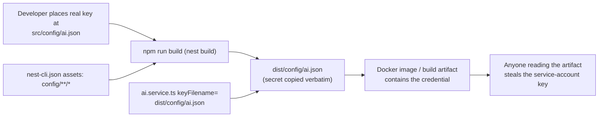

# Technical Specification

# 0. Agent Action Plan

## 0.1 Executive Summary

Based on the bug description, the Blitzy platform understands that the bug is a set of **four distinct, deterministic security misconfigurations** in the PantryChef NestJS backend that must be remediated before any non-development deployment. None of these are runtime crashes or intermittent faults; each is a silent, always-present weakness in secret material, access control, or build packaging that has existed since the project was scaffolded. The four defects map to predictable-credential exposure, broken authentication on a single endpoint, and leakage of a cloud service-account key into the build artifact.

The platform translates the reported symptoms into the following precise technical failures:

| # | Reported symptom | Exact technical failure | Error class | Evidence |
|---|------------------|-------------------------|-------------|----------|
| 1 | "Default JWT secrets" | HS256 signing/verification key is the literal string `secret` (and `secret_for_refresh`); any party knowing the public default can forge valid access and refresh tokens for any user | Predictable cryptographic key / authentication bypass | `[backend/env_example:L20]`, `[backend/env_example:L22]` |
| 2 | "Default MongoDB credentials" | Database root account is `admin` / `123456`, hardcoded in the compose file and mirrored in the example env; trivially guessable, grants full database access | Weak/guessable credentials | `[backend/docker-compose.yml:L9-L10]`, `[backend/env_example:L8-L9]` |
| 3 | "`POST /ai/vision` is unguarded" | `AiController` carries no `@UseGuards(AuthGuard('jwt'))` at class or method level, unlike every other resource controller; the live route `POST /api/ai/vision` is anonymous-accessible and consumes Google Cloud Vision quota | Missing authorization / broken access control | `[backend/src/ai/ai.controller.ts:L12]` |
| 4 | "Vision service-account JSON bundled into build" | The `nest-cli.json` asset glob `config/**/*` copies any file placed at `src/config/ai.json` into `dist/config/ai.json` on every build, and `AiService` loads credentials from that bundled path | Sensitive-file disclosure in build artifact | `[backend/nest-cli.json:L7]`, `[backend/src/ai/ai.service.ts:L52]`, `[backend/src/ai/ai.service.ts:L59]` |

### 0.1.1 Translation of User Language to Technical Failure

- The phrase "default secrets" denotes **literal placeholder values that are committed to the repository and therefore publicly known**. Because the backend signs JWTs with HS256 (symmetric), the signing key equals the verification key; an attacker in possession of the default value can mint tokens that the server accepts as authentic `[backend/env_example:L20]`.
- The phrase "default MongoDB credentials" denotes the **MongoDB root username/password used both to initialize the container and to authenticate the application's Mongoose connection**. These same values are consumed at runtime by the connection builder, so `admin` / `123456` are the live database credentials, not merely setup hints `[backend/src/database/mongoose-config.service.ts:L13-L19]`.
- The phrase "unguarded endpoint" denotes the **absence of an authentication guard decorator**. The route is wired and active (the module is registered in the application root), so the gap is exploitable on every request `[backend/src/app.module.ts:L16]`, `[backend/src/app.module.ts:L34]`.
- The phrase "credentials bundled into the build" denotes the **NestJS CLI asset-copy behavior** that emits non-TypeScript files from `src/` into `dist/`, combined with credential loading that reads from inside `dist/` at runtime `[backend/nest-cli.json:L7]`.

### 0.1.2 Reproduction Steps as Executable Commands

The defects reproduce deterministically. The commands below assume the backend running locally with the global `api` prefix `[backend/src/main.ts:L14-L19]`:

```bash
# Defect 3 - anonymous access to the AI endpoint (expect HTTP 200 today, no token supplied).

#### NOTE: the multipart field name is "image" (the bug report's "file=@" is incorrect; the

#### FileInterceptor binds the field "image"). A faithful reproduction uses image=@ :

curl -i -X POST http://localhost:3000/api/ai/vision -F "image=@any.jpg"

#### Defect 4 - service-account JSON leaks into the build artifact.

#### With a file present at src/config/ai.json, a production build copies it into dist/:

printf '{"type":"service_account"}' > backend/src/config/ai.json
cd backend && npm run build && ls dist/config/ai.json   # file is present today

#### Defects 1 & 2 - secrets are readable directly from the committed repository:

grep -nE 'AUTH_JWT_SECRET|AUTH_REFRESH_SECRET' backend/env_example
grep -nE 'MONGO_INITDB_ROOT_(USERNAME|PASSWORD)' backend/docker-compose.yml
```

Defect 4 was reproduced empirically in this analysis: placing a dummy `src/config/ai.json` and running `npm run build` produced `dist/config/ai.json` with identical contents, confirming the leak mechanism `[backend/nest-cli.json:L7]`.

### 0.1.3 Error Type Classification

- **Defect 1 — Predictable cryptographic key (authentication bypass enabler).** Not an exception; a logic/configuration weakness. HS256 symmetric signing means the secret is the full trust anchor `[backend/env_example:L20]`.
- **Defect 2 — Weak/guessable credentials.** Configuration weakness; full read/write database compromise if reachable `[backend/docker-compose.yml:L9-L10]`.
- **Defect 3 — Missing authorization (broken access control).** Decorator omission; deterministic on 100% of requests to the route `[backend/src/ai/ai.controller.ts:L12]`.
- **Defect 4 — Sensitive-data exposure via build packaging.** Build-tooling misconfiguration plus runtime credential-loading from the artifact `[backend/nest-cli.json:L7]`, `[backend/src/ai/ai.service.ts:L52]`.

All four are corroborated by the Technical Specification's Security Architecture, which independently catalogs the default secrets as "production-blocking," lists the Mongo `admin` / `123456` credentials in its secret inventory, flags the AI endpoint as an authorization "anomaly," and notes the service-account JSON bundled in `dist/` `[Technical Specification §6.4.2.4.4]`, `[Technical Specification §6.4.3.2]`, `[Technical Specification §6.4.7.2]`.


## 0.2 Root Cause Identification

Based on repository analysis and external documentation research, there are **four independent root causes**, one per reported defect. Each is stated below with its location, trigger, evidence, and the reasoning that makes the conclusion definitive.

### 0.2.1 Root Cause 1 — Predictable JWT Signing Secrets

- **The root cause is:** the access-token and refresh-token signing secrets are committed as the literal strings `secret` and `secret_for_refresh`.
- **Located in:** `[backend/env_example:L20]` (`AUTH_JWT_SECRET=secret`) and `[backend/env_example:L22]` (`AUTH_REFRESH_SECRET=secret_for_refresh`).
- **Triggered by:** any JWT issuance or verification performed while the environment carries the default values; with HS256 the same secret signs and verifies, so the secret is the entire trust boundary.
- **Evidence:** the Technical Specification's Security Architecture independently records these exact defaults and labels them "production-blocking," and documents HS256 symmetric signing `[Technical Specification §6.4.2.4.4]`, `[Technical Specification §6.4.4.2.2]`.
- **This conclusion is definitive because:** the secrets are plaintext in a tracked file; anyone with repository access (or the public template) holds the signing key and can forge tokens the server will accept.
- **Honest scope nuance:** the environment validator at `[backend/src/auth/config/auth.config.ts:L7-L8]` and `[backend/src/auth/config/auth.config.ts:L13-L14]` validates these variables with `@IsString()` only — no minimum length and no pattern. A non-empty placeholder such as `CHANGE_ME_USE_A_LONG_RANDOM_STRING_MIN_32_CHARS` therefore **passes validation and will not auto-reject at bootstrap**. Because the validator file is out of scope (see §0.5), the "fail-fast if deployed unchanged" intent of Fix 1 is realized by operator-visible convention (an obvious `CHANGE_ME_*` placeholder plus a `# REQUIRED:` comment), not by automated runtime rejection. The Technical Specification corroborates that fail-fast triggers only on missing/non-string values `[Technical Specification §6.4.4.2.1]`.

### 0.2.2 Root Cause 2 — Default MongoDB Root Credentials

- **The root cause is:** the MongoDB root account is the guessable pair `admin` / `123456`, hardcoded in the compose environment and mirrored in the example env file.
- **Located in:** `[backend/docker-compose.yml:L9-L10]` (`MONGO_INITDB_ROOT_USERNAME: admin`, `MONGO_INITDB_ROOT_PASSWORD: 123456`) and `[backend/env_example:L8-L9]` (`DATABASE_USERNAME=admin`, `DATABASE_PASSWORD=123456`).
- **Triggered by:** starting the stack with the default compose file or an un-edited `.env`; the same values authenticate the application connection at `[backend/src/database/mongoose-config.service.ts:L13-L19]`, which builds the connection from `database.url` plus a separate `user`/`pass`.
- **Evidence:** the Security Architecture secret inventory lists `DATABASE_USERNAME=admin` and `DATABASE_PASSWORD=123456` verbatim `[Technical Specification §6.4.4.2.2]`.
- **This conclusion is definitive because:** the values are static and well-known; any process able to reach port 27017 can authenticate as root with a trivial guess.
- **Divergence from the bug report:** the report described the example env's `DATABASE_USERNAME`/`DATABASE_PASSWORD` as empty placeholders; the working tree actually contains `admin` / `123456` `[backend/env_example:L8-L9]`. The fix replaces these concrete weak values with explicit `CHANGE_ME_*` placeholders, which is a strictly stronger remediation than the report assumed.

### 0.2.3 Root Cause 3 — Missing Authentication Guard on the AI Endpoint

- **The root cause is:** `AiController` is declared without any authentication guard, leaving `POST /api/ai/vision` open to anonymous callers.
- **Located in:** `[backend/src/ai/ai.controller.ts:L12]` (`@Controller('ai')` with no `@UseGuards` at class or method level) and the unguarded handler at `[backend/src/ai/ai.controller.ts:L16]`–`[backend/src/ai/ai.controller.ts:L32]`.
- **Triggered by:** every request to the route; the module is imported and registered in the application root, so the route is live `[backend/src/app.module.ts:L16]`, `[backend/src/app.module.ts:L34]`, and the global `api` prefix resolves the path to `/api/ai/vision` `[backend/src/main.ts:L14-L19]`.
- **Evidence:** the canonical pattern is class-level `@UseGuards(AuthGuard('jwt'))`, present on all four sibling resource controllers — `[backend/src/ingridient/ingridient.controller.ts:L32]`, `[backend/src/recipe/recipe.controller.ts:L28]`, `[backend/src/pantry/pantry.controller.ts:L27]`, `[backend/src/users/users.controller.ts:L27]` — and the Technical Specification's endpoint authorization matrix explicitly labels `AiController` as "None (anomaly) — Anonymous-accessible" `[Technical Specification §6.4.3.2]`.
- **This conclusion is definitive because:** the decorator is simply absent from `AiController` while present and consistent everywhere else; the asymmetry is the vulnerability.

### 0.2.4 Root Cause 4 — Service-Account JSON Leaked into the Build Artifact

This root cause has two coupled parts: a **build-packaging** cause and a **runtime credential-loading** cause.

- **The root cause is:** (a) the NestJS CLI asset glob copies every file under `src/config/` — including a service-account key placed at `src/config/ai.json` — into `dist/config/`; and (b) `AiService` loads its credentials from that bundled path, so the key must live inside the artifact to function.
- **Located in:** `[backend/nest-cli.json:L7]` (`"assets": ["config/**/*"]`), and `[backend/src/ai/ai.service.ts:L52]` (`path.join(__dirname, '../config/ai.json')`) with `[backend/src/ai/ai.service.ts:L59]` (`keyFilename: keyPath`). At runtime `__dirname` is `dist/ai`, so the resolved path is `dist/config/ai.json`.
- **Triggered by:** any `npm run build` while a credential file exists at `src/config/ai.json`; the build copies it into `dist/`, and any party able to read the build output or Docker image obtains the key.
- **Evidence:** reproduced empirically (a dummy `src/config/ai.json` appeared at `dist/config/ai.json` after `npm run build`); repository-wide search confirms these are the **only** references to the credential file `[backend/src/ai/ai.service.ts:L52]`, `[backend/src/ai/ai.service.ts:L59]`, `[backend/nest-cli.json:L7]`; and the Security Architecture notes the SA JSON is "bundled in `dist/` (nest-cli.json assets)" and recommends injecting it via a mounted secret or env-encoded JSON `[Technical Specification §6.4.7.2]`.
- **This conclusion is definitive because:** the asset glob and the file-path credential loader together guarantee that a working configuration necessarily places the secret inside the shippable artifact.
- **Latent-vulnerability note:** `src/config/ai.json` is absent from the working tree and from git history; `src/config/` currently holds only TypeScript files `[Technical Specification §6.4.4.2.2]`. The exposure is therefore latent — it materializes the instant a developer drops the real key into `src/config/`. Fix 4 is preventative hardening that closes the path before it is used.
- **Surfaced implicit requirement (graceful degradation):** the must-keep behavior is that absent or invalid credentials cause the service to return `{}` rather than throw `[backend/src/ai/ai.service.ts:L64-L67]`. Today that contract is upheld by the `existsSync(keyPath)` gate toggling `isGoogleVisionEnabled = false` `[backend/src/ai/ai.service.ts:L53-L56]`. A naive switch to "fall back to Application Default Credentials" would **break** this contract, because when no credentials can be resolved the Google client throws a `DefaultCredentialsError` at call time rather than returning `{}`. The fix must therefore re-anchor `isGoogleVisionEnabled` on the presence and successful `JSON.parse` of the new environment variable (see §0.4).

The credential-leak mechanism for Root Cause 4 is summarized below:




## 0.3 Diagnostic Execution

This sub-section records the concrete code examination behind each root cause, the consolidated findings from repository analysis, and the verification analysis that confirms the fix approach.

### 0.3.1 Code Examination Results

**Defect 1 — JWT secrets (`backend/env_example`)**
- Problematic block: `[backend/env_example:L20-L23]` (the auth secret declarations).
- Failure point: `[backend/env_example:L20]` and `[backend/env_example:L22]` assign the literal values `secret` and `secret_for_refresh`.
- How this leads to the bug: these env values flow into the JWT module's signing configuration; with HS256 the secret both signs and verifies, so a known secret enables token forgery. The validator does not reject non-empty placeholders `[backend/src/auth/config/auth.config.ts:L7-L8]`.

**Defect 2 — Mongo credentials (`backend/docker-compose.yml`, `backend/env_example`)**
- Problematic block: `[backend/docker-compose.yml:L8-L10]` (the `mongodb` service environment) and `[backend/env_example:L8-L9]`.
- Failure point: `[backend/docker-compose.yml:L9]` / `[backend/docker-compose.yml:L10]` hardcode `admin` / `123456`.
- How this leads to the bug: these initialize the database root account and are consumed as the application's connection credentials at `[backend/src/database/mongoose-config.service.ts:L13-L19]`; the guessable pair grants full database access to any reachable client.

**Defect 3 — Unguarded AI controller (`backend/src/ai/ai.controller.ts`)**
- Problematic block: `[backend/src/ai/ai.controller.ts:L1-L13]` (imports and the class declaration).
- Failure point: `[backend/src/ai/ai.controller.ts:L12]` — `@Controller('ai')` is declared with no preceding or method-level `@UseGuards(AuthGuard('jwt'))`; the imports at `[backend/src/ai/ai.controller.ts:L1-L7]` do not include `UseGuards`, and `AuthGuard` is not imported at all.
- How this leads to the bug: NestJS applies no authentication to the route, so the handler at `[backend/src/ai/ai.controller.ts:L32]` executes for anonymous callers, invoking the Vision-backed service and consuming external quota.

**Defect 4 — Credential bundling (`backend/nest-cli.json`, `backend/src/ai/ai.service.ts`)**
- Problematic block: `[backend/nest-cli.json:L5-L8]` (the `compilerOptions` with the `assets` glob) and the `AiService` constructor `[backend/src/ai/ai.service.ts:L51-L61]`.
- Failure point: `[backend/nest-cli.json:L7]` (`"assets": ["config/**/*"]`) copies any `src/config/ai.json` into `dist/`; `[backend/src/ai/ai.service.ts:L52]` and `[backend/src/ai/ai.service.ts:L59]` then load the credential from inside `dist/`.
- How this leads to the bug: a functioning configuration necessarily ships the secret inside the build artifact; the `existsSync` gate at `[backend/src/ai/ai.service.ts:L53-L56]` only controls enablement, not exposure.

### 0.3.2 Key Findings from Repository Analysis

| Finding | File:Line | Conclusion |
|---------|-----------|------------|
| Access/refresh secrets are literal `secret` / `secret_for_refresh` | `[backend/env_example:L20]`, `[backend/env_example:L22]` | Confirms Root Cause 1 (predictable signing key) |
| Auth-secret validator uses `@IsString()` only (no min length) | `[backend/src/auth/config/auth.config.ts:L7-L8]`, `[backend/src/auth/config/auth.config.ts:L13-L14]` | Placeholder will not auto-reject at boot; remediation is convention-based |
| Mongo root creds hardcoded `admin` / `123456` | `[backend/docker-compose.yml:L9-L10]` | Confirms Root Cause 2 (guessable DB credentials) |
| Same creds mirrored in example env | `[backend/env_example:L8-L9]` | Values are live app credentials, not empty placeholders (divergence from report) |
| Mongo creds consumed by the connection builder | `[backend/src/database/mongoose-config.service.ts:L13-L19]` | `admin`/`123456` authenticate the runtime connection |
| `AiController` lacks any `@UseGuards` | `[backend/src/ai/ai.controller.ts:L12]` | Confirms Root Cause 3 (missing authorization) |
| Sibling controllers all carry class-level `@UseGuards(AuthGuard('jwt'))` | `[backend/src/ingridient/ingridient.controller.ts:L32]`, `[backend/src/recipe/recipe.controller.ts:L28]`, `[backend/src/pantry/pantry.controller.ts:L27]`, `[backend/src/users/users.controller.ts:L27]` | Establishes the exact canonical pattern to copy |
| AI module is registered and the route is live | `[backend/src/app.module.ts:L16]`, `[backend/src/app.module.ts:L34]` | The unguarded route is reachable in production |
| Global prefix `api`, no API versioning enabled | `[backend/src/main.ts:L14-L19]` | Effective route is `POST /api/ai/vision` |
| Asset glob copies `config/**/*` into `dist/` | `[backend/nest-cli.json:L7]` | Confirms Root Cause 4(a) (build packaging) |
| Credential loaded from `dist/config/ai.json` via `keyFilename` | `[backend/src/ai/ai.service.ts:L52]`, `[backend/src/ai/ai.service.ts:L59]` | Confirms Root Cause 4(b) (runtime loading from artifact) |
| Only these three lines reference the credential file repo-wide | `[backend/src/ai/ai.service.ts:L52]`, `[backend/src/ai/ai.service.ts:L59]`, `[backend/nest-cli.json:L7]` | Fix 4 surface is fully bounded; no hidden dependencies |
| `existsSync` gate yields graceful `{}` return when disabled | `[backend/src/ai/ai.service.ts:L53-L56]`, `[backend/src/ai/ai.service.ts:L64-L67]` | Graceful-degradation contract must be preserved by the new gate |
| `src/config/ai.json` absent in tree and history; `.gitignore` has no entry for it | `[backend/.gitignore:L1-L5]` | Exposure is latent; add an ignore entry as defense-in-depth |
| No test references `AiController` or the AI route | `[backend/test/user/auth.e2e-spec.ts:L1-L1]` | Guard addition has no existing-test regression surface; auth e2e is the regression guard |

### 0.3.3 Fix Verification Analysis

**Steps followed to reproduce the defects:**
- Defect 4 (primary, empirically reproduced): placed a dummy `src/config/ai.json`, ran `npm run build`, and observed `dist/config/ai.json` appear with identical contents — proving the leak. The working tree was then restored to a clean state.
- Defect 3: confirmed by code inspection that the route is live and unguarded; an unauthenticated `POST /api/ai/vision` (multipart field `image`) reaches the handler.
- Defects 1 and 2: confirmed by direct inspection of the committed `env_example` and `docker-compose.yml`, whose secret values are plaintext and well-known.

**Confirmation tests used to ensure the fix works (executed against the proposed changes on a scratch copy, then reverted):**
- Applied all six file edits and ran `npm run build` → exit code 0 (the new class-level guard and the new env-based credential loader compile).
- Re-ran the Defect 4 reproduction with the `assets` glob removed: after build, `dist/config/ai.json` was **absent**, and `dist/config/` contained only compiled `.js`/`.d.ts` output — the leak is eliminated and runtime config still emits correctly.
- Ran `npx tsc --noEmit` → exit code 0 (the proposed TypeScript type-checks cleanly under the project's `tsconfig`, which sets `strictNullChecks: false` `[backend/tsconfig.json:L16]`).

**Boundary conditions and edge cases covered:**
- Absent `GOOGLE_APPLICATION_CREDENTIALS_JSON` → `isGoogleVisionEnabled = false` → `detectIngredientsFromBuffer` returns `{}` (no throw) `[backend/src/ai/ai.service.ts:L64-L67]`.
- Malformed JSON in the env var → `JSON.parse` throws → caught → `isGoogleVisionEnabled = false` → `{}` (no bootstrap crash).
- Valid `Bearer` token → `200`; missing/invalid token → `401` — with the multipart contract (field `image`, 10 MB limit) and response shape unchanged `[backend/src/ai/ai.controller.ts:L16-L43]`.
- Compose run with a missing `.env` → `${DATABASE_USERNAME}` / `${DATABASE_PASSWORD}` substitute to empty and Docker Compose warns (fail-loud), which is acceptable for a template.

**Verification outcome and confidence:** verification was **successful**. Overall confidence is **95%**: Defect 3 ≈ 97% (compiles; identical to four working controllers; auth e2e is the regression guard), Defect 4 ≈ 96% (leak reproduced and shown eliminated; client option type-checked on `@google-cloud/vision` 4.3.2), Defects 1 and 2 ≈ 95% (pure configuration edits in template files). The residual margin reflects the absence of a live MongoDB + JWT integration run (no real secrets available) and the honestly-documented, convention-based fail-fast for Defect 1; neither affects the correctness of the surgical changes.


## 0.4 Bug Fix Specification

This sub-section specifies the exact, minimal fix for each defect. All changes are confined to six files and reuse existing project patterns; no new dependencies are introduced.

### 0.4.1 The Definitive Fix

The fix-to-file mapping is:

| File | Defect(s) | Definitive change |
|------|-----------|-------------------|
| `backend/env_example` | 1, 2, 4 | Replace weak secrets/credentials with `CHANGE_ME_*` placeholders, add `# REQUIRED:` comments, and add an empty `GOOGLE_APPLICATION_CREDENTIALS_JSON` key |
| `backend/docker-compose.yml` | 2 | Parameterize the Mongo root credentials to read from `.env` via `${DATABASE_USERNAME}` / `${DATABASE_PASSWORD}` |
| `backend/src/ai/ai.controller.ts` | 3 | Add class-level `@UseGuards(AuthGuard('jwt'))` and the two required imports |
| `backend/nest-cli.json` | 4 | Remove the `assets` glob so nothing under `src/config/` is copied into `dist/` |
| `backend/src/ai/ai.service.ts` | 4 | Load Vision credentials from `GOOGLE_APPLICATION_CREDENTIALS_JSON`; gate `isGoogleVisionEnabled` on its presence and valid parse |
| `backend/.gitignore` | 4 | Add `src/config/ai.json` so a developer-placed key is never committed |

**Fix 1 — `backend/env_example` (JWT secrets).** Current implementation at `[backend/env_example:L20]` is `AUTH_JWT_SECRET=secret` and at `[backend/env_example:L22]` is `AUTH_REFRESH_SECRET=secret_for_refresh`. Required change (values preserved exactly as specified):

```bash
# REQUIRED: replace with a cryptographically random string before any non-local deployment.

AUTH_JWT_SECRET=CHANGE_ME_USE_A_LONG_RANDOM_STRING_MIN_32_CHARS
# REQUIRED: replace with a cryptographically random string before any non-local deployment.

AUTH_REFRESH_SECRET=CHANGE_ME_USE_A_DIFFERENT_LONG_RANDOM_STRING_MIN_32_CHARS
```

This fixes the root cause by removing the known-good secret from the template, forcing an operator to supply a real random secret, and making an unchanged deployment obvious.

**Fix 2 — `backend/env_example` and `backend/docker-compose.yml` (DB credentials).** Current values at `[backend/env_example:L8-L9]` are `admin` / `123456`, and `[backend/docker-compose.yml:L9-L10]` hardcodes the same. Required changes:

```bash
# backend/env_example

DATABASE_USERNAME=CHANGE_ME_DB_USERNAME
DATABASE_PASSWORD=CHANGE_ME_STRONG_DB_PASSWORD
```

```yaml
# backend/docker-compose.yml (mongodb service environment)

MONGO_INITDB_ROOT_USERNAME: ${DATABASE_USERNAME}
MONGO_INITDB_ROOT_PASSWORD: ${DATABASE_PASSWORD}
```

This fixes the root cause by eliminating the guessable literals and sourcing the database root credentials from the operator-provided `.env`, so the container and the application authenticate with the same operator-chosen values.

**Fix 3 — `backend/src/ai/ai.controller.ts` (missing guard).** The class is currently declared at `[backend/src/ai/ai.controller.ts:L12]` with no guard. Required change adds the import members and the class-level decorator, mirroring the sibling controllers `[backend/src/ingridient/ingridient.controller.ts:L32]`:

```typescript
import { AuthGuard } from '@nestjs/passport';   // new import
@UseGuards(AuthGuard('jwt'))                      // new class-level decorator
@Controller('ai')
```

This fixes the root cause by enforcing JWT authentication on `POST /api/ai/vision`, making the endpoint behave identically to every other resource controller.

**Fix 4 — `backend/nest-cli.json`, `backend/src/ai/ai.service.ts`, `backend/.gitignore` (credential leak).** Current `compilerOptions` at `[backend/nest-cli.json:L5-L8]` include `"assets": ["config/**/*"]`. The credential loader at `[backend/src/ai/ai.service.ts:L52-L60]` reads from the bundled path. Required changes:

```jsonc
// backend/nest-cli.json -> compilerOptions becomes:
"compilerOptions": { "deleteOutDir": true }
```

```typescript
// backend/src/ai/ai.service.ts constructor (credential loading)
const credentialsJson = process.env.GOOGLE_APPLICATION_CREDENTIALS_JSON;
let credentials: any;
try { credentials = credentialsJson ? JSON.parse(credentialsJson) : undefined; }
catch { credentials = undefined; }
if (!credentials) { this.isGoogleVisionEnabled = false; }
this.client = new ImageAnnotatorClient(credentials ? { credentials } : {});
```

This fixes the root cause by (a) ensuring `dist/` can never contain `ai.json` (the glob that copied it is removed) and (b) sourcing credentials from an environment variable instead of a bundled file, while preserving graceful degradation: missing or malformed JSON sets `isGoogleVisionEnabled = false`, so `detectIngredientsFromBuffer` returns `{}` rather than throwing `[backend/src/ai/ai.service.ts:L64-L67]`. Removing the glob is safe because `src/config/` contains only TypeScript files compiled by `tsc` — the build still emits `dist/config/*.js`.

### 0.4.2 Change Instructions

**`backend/env_example`**
- INSERT, immediately above `[backend/env_example:L20]`: a comment line `# REQUIRED: replace with a cryptographically random string before any non-local deployment.`
- MODIFY `[backend/env_example:L20]` from `AUTH_JWT_SECRET=secret` to `AUTH_JWT_SECRET=CHANGE_ME_USE_A_LONG_RANDOM_STRING_MIN_32_CHARS`.
- INSERT, immediately above `[backend/env_example:L22]`: the same `# REQUIRED:` comment line.
- MODIFY `[backend/env_example:L22]` from `AUTH_REFRESH_SECRET=secret_for_refresh` to `AUTH_REFRESH_SECRET=CHANGE_ME_USE_A_DIFFERENT_LONG_RANDOM_STRING_MIN_32_CHARS`.
- MODIFY `[backend/env_example:L8]` from `DATABASE_USERNAME=admin` to `DATABASE_USERNAME=CHANGE_ME_DB_USERNAME`.
- MODIFY `[backend/env_example:L9]` from `DATABASE_PASSWORD=123456` to `DATABASE_PASSWORD=CHANGE_ME_STRONG_DB_PASSWORD`.
- INSERT, after `[backend/env_example:L23]`: a comment `# Google Cloud Vision service-account key as inline JSON (leave empty to disable AI label detection).` followed by `GOOGLE_APPLICATION_CREDENTIALS_JSON=`.

**`backend/docker-compose.yml`**
- MODIFY `[backend/docker-compose.yml:L9]` from `MONGO_INITDB_ROOT_USERNAME: admin` to `MONGO_INITDB_ROOT_USERNAME: ${DATABASE_USERNAME}`.
- MODIFY `[backend/docker-compose.yml:L10]` from `MONGO_INITDB_ROOT_PASSWORD: 123456` to `MONGO_INITDB_ROOT_PASSWORD: ${DATABASE_PASSWORD}`.

**`backend/src/ai/ai.controller.ts`**
- MODIFY the `@nestjs/common` import block `[backend/src/ai/ai.controller.ts:L1-L7]` to add `UseGuards` (alphabetically between `UploadedFile` and `UseInterceptors`).
- INSERT, after `[backend/src/ai/ai.controller.ts:L8]`: `import { AuthGuard } from '@nestjs/passport';`.
- INSERT, immediately above `[backend/src/ai/ai.controller.ts:L12]`: a comment explaining the security motive followed by `@UseGuards(AuthGuard('jwt'))`.

**`backend/nest-cli.json`**
- DELETE `[backend/nest-cli.json:L7]` (`"assets": ["config/**/*"]`) and remove the trailing comma on `[backend/nest-cli.json:L6]` so `compilerOptions` is `{ "deleteOutDir": true }` (valid JSON).

**`backend/src/ai/ai.service.ts`**
- DELETE the now-unused imports `[backend/src/ai/ai.service.ts:L3]` (`import * as path from 'path';`) and `[backend/src/ai/ai.service.ts:L4]` (`import { existsSync } from 'fs';`).
- REPLACE the constructor body `[backend/src/ai/ai.service.ts:L51-L61]` with the env-based credential loader shown in §0.4.1, including explanatory comments that state the security motive (no service-account file on disk or in `dist/`) and the graceful-degradation intent.

**`backend/.gitignore`**
- INSERT a commented entry (for example after `[backend/.gitignore:L5]`): `# Google Cloud Vision service-account key (never commit)` followed by `src/config/ai.json`.

All code edits must carry inline comments explaining the security motive, per the constraints in §0.7.

### 0.4.3 Fix Validation

- **Build/compile validation:** `cd backend && npm run build` → expected exit code `0`. Confirms the new guard and credential loader compile.
- **Leak-elimination validation:** with a placeholder file present (`printf '{"x":1}' > backend/src/config/ai.json`), run `cd backend && npm run build && test ! -f dist/config/ai.json && echo LEAK_FIXED`. Expected output: `LEAK_FIXED` (and `dist/config/` contains only compiled `.js`/`.d.ts`). Remove the placeholder afterward.
- **Type-check validation:** `cd backend && npx tsc --noEmit` → expected exit code `0`.
- **Guard behavior validation:** `curl -i -X POST http://localhost:3000/api/ai/vision -F "image=@sample.jpg"` with no token → expected `HTTP/1.1 401 Unauthorized`; with a valid `Authorization: Bearer <token>` header → expected `HTTP/1.1 200 OK` and the unchanged response body (an ingredient object or `{}`).
- **Confirmation method:** all four checks were executed against the proposed edits on a scratch copy of the working tree (build exit 0, `dist/config/ai.json` absent, `tsc --noEmit` exit 0) and the tree was reverted to a clean state.


## 0.5 Scope Boundaries

The change surface is exactly six files. Repository-wide analysis confirmed there are no hidden dependencies on the credential file beyond the cited lines, and the guard fix reuses the existing `AuthGuard('jwt')` rather than introducing new classes.

### 0.5.1 Changes Required (Exhaustive List)

- **File 1: `backend/env_example`** — Lines `[backend/env_example:L8-L9]`: replace `admin` / `123456` with `CHANGE_ME_DB_USERNAME` / `CHANGE_ME_STRONG_DB_PASSWORD`. Lines `[backend/env_example:L20]` and `[backend/env_example:L22]`: replace `secret` / `secret_for_refresh` with the `CHANGE_ME_*` placeholders and prepend `# REQUIRED:` comments. After `[backend/env_example:L23]`: add `GOOGLE_APPLICATION_CREDENTIALS_JSON=` (empty) with an explanatory comment.
- **File 2: `backend/docker-compose.yml`** — Lines `[backend/docker-compose.yml:L9-L10]`: change the Mongo root credentials to `${DATABASE_USERNAME}` / `${DATABASE_PASSWORD}`.
- **File 3: `backend/src/ai/ai.controller.ts`** — Lines `[backend/src/ai/ai.controller.ts:L1-L8]`: add `UseGuards` to the `@nestjs/common` import and add `import { AuthGuard } from '@nestjs/passport';`. Above line `[backend/src/ai/ai.controller.ts:L12]`: add the class-level `@UseGuards(AuthGuard('jwt'))` decorator.
- **File 4: `backend/nest-cli.json`** — Lines `[backend/nest-cli.json:L6-L7]`: remove the `assets` glob entry (and the trailing comma) leaving `compilerOptions: { "deleteOutDir": true }`.
- **File 5: `backend/src/ai/ai.service.ts`** — Lines `[backend/src/ai/ai.service.ts:L3-L4]`: remove the now-unused `path` and `fs` imports. Lines `[backend/src/ai/ai.service.ts:L51-L61]`: replace the constructor body to load credentials from `GOOGLE_APPLICATION_CREDENTIALS_JSON` and gate `isGoogleVisionEnabled` on presence + valid parse.
- **File 6: `backend/.gitignore`** — Add `src/config/ai.json` (with a comment) as defense-in-depth so a developer-placed key is never committed.

No files mandated by user-specified rules apply: the rules list is empty (see §0.7), so there are no additional rule-driven files to include. **No other files require modification.**

### 0.5.2 Explicitly Excluded

The following are intentionally left untouched. They may appear related but are out of scope, and modifying them would risk regressions or exceed the bug fix:

- **Do not modify auth internals:** `backend/src/auth/**` — JWT and refresh strategies, the auth service/controller, and the environment validator `[backend/src/auth/config/auth.config.ts:L7-L8]`. The guard fix reuses the existing `AuthGuard('jwt')`; no strategy or validator change is required (and the validator deliberately remains as-is — see the fail-fast nuance in §0.2.1).
- **Do not modify database internals:** `backend/src/database/**` — including `database.config.ts` and the connection builder `[backend/src/database/mongoose-config.service.ts:L13-L19]`, plus any seed scripts. Defect 2 is remediated purely via the env template and compose file.
- **Do not modify the configuration-validation classes** under `backend/src/config/` (e.g., `app.config.ts`); the only change near `config/` is removing the `nest-cli.json` asset glob.
- **Do not modify other controllers:** the four sibling resource controllers and `auth.controller.ts` are correct references, not change targets.
- **Do not modify bootstrap/runtime wiring:** `backend/src/main.ts` (global prefix, CORS, Swagger) and `backend/src/app.module.ts` remain unchanged; the AI route is already registered there `[backend/src/app.module.ts:L34]`.
- **Do not modify the Vision call logic:** within `AiService`, only credential loading changes; the request construction and response shaping at `[backend/src/ai/ai.service.ts:L63-L127]` stay identical, preserving the `{}`-on-no-result contract.
- **Do not modify the mobile application or non-code trees:** `mobile/**`, `/mockups`, `/scripts/seed_data`, `/legacy`, and `/docs/internal` are out of scope.
- **Do not refactor or add features:** no renaming, no restructuring of working code, and no new endpoints, rate limiting, tests, or documentation beyond what the four fixes require. (Rate limiting for the AI endpoint is noted by the Technical Specification as a hardening idea `[Technical Specification §6.4.7.1]` but is explicitly out of scope for this bug fix.)


## 0.6 Verification Protocol

This protocol confirms each defect is eliminated and that existing behavior is preserved. Commands assume the Node 20 runtime targeted by the project's Dockerfile (`node:20-alpine`) and are run from the `backend/` directory.

### 0.6.1 Bug Elimination Confirmation

- **Defect 4 — no credential in the build artifact (primary, automated):**
  ```bash
  printf '{"type":"service_account","x":1}' > src/config/ai.json
  npm run build
  test ! -f dist/config/ai.json && echo "PASS: ai.json not bundled" || echo "FAIL: leak present"
  rm -f src/config/ai.json
  ```
  Expected output: `PASS: ai.json not bundled`. Additionally confirm `dist/config/` contains only compiled output: `ls dist/config` should show `*.js` / `*.d.ts` and no `*.json`.

- **Defect 3 — endpoint requires authentication:**
  ```bash
  curl -s -o /dev/null -w "%{http_code}\n" -X POST \
    http://localhost:3000/api/ai/vision -F "image=@sample.jpg"
  ```
  Expected output: `401` without a token. With a valid `Authorization: Bearer <token>`, the same call returns `200` and the unchanged response body. Confirm no anonymous request reaches the handler (no Vision invocation is logged for unauthenticated calls).

- **Defects 1 & 2 — no weak secrets remain in the template:**
  ```bash
  grep -nE '=secret($|_)|=admin$|=123456$' env_example || echo "PASS: no default secrets"
  grep -nE 'MONGO_INITDB_ROOT_(USERNAME|PASSWORD): (admin|123456)' docker-compose.yml \
    || echo "PASS: compose parameterized"
  ```
  Expected output: both `PASS` lines; `docker-compose.yml` now references `${DATABASE_USERNAME}` / `${DATABASE_PASSWORD}`.

- **Compile/type confirmation:** `npm run build` → exit `0`; `npx tsc --noEmit` → exit `0`.

### 0.6.2 Regression Check

- **Run the existing end-to-end suite (primary regression guard):**
  ```bash
  npm run test:e2e
  ```
  This exercises the authentication flows in `[backend/test/user/auth.e2e-spec.ts:L1-L1]` (register, login, `me`, refresh, logout). Expected: all tests pass, confirming that introducing `AuthGuard('jwt')` on `AiController` did not disturb the JWT strategy or other guarded routes. There are no unit specs under `src/`, and no test references `AiController`, so this suite is the authoritative regression check.
- **Verify unchanged behavior of guarded resource routes:** smoke-test one authenticated CRUD route per controller (pantry, recipe, ingredient, users) to confirm the shared `AuthGuard('jwt')` path is unaffected `[backend/src/users/users.controller.ts:L27]`.
- **Verify the AI service still degrades gracefully:** start the app with no `GOOGLE_APPLICATION_CREDENTIALS_JSON`, send an authenticated request, and confirm the handler returns `{}` (HTTP `200`) rather than throwing `[backend/src/ai/ai.service.ts:L64-L67]`. Repeat with a deliberately malformed JSON value to confirm the `try/catch` path also yields `{}`.
- **Verify the application still boots:** `npm run start:prod` after `npm run build` should bootstrap without errors using operator-supplied `.env` values (the global `api` prefix and Swagger at `/docs` remain intact) `[backend/src/main.ts:L14-L19]`.
- **Confirm the working tree is clean of test artifacts:** remove any temporary `src/config/ai.json` and the `dist/` directory created during verification so no scratch files are committed.


## 0.7 Rules

No explicit user-specified implementation rules were provided for this project (the rules list is empty). The following constraints therefore derive from the bug report's own scope boundaries and from the conventions observed in the codebase, and they govern this fix:

- **Make the exact specified changes only.** Apply precisely the four fixes described in §0.4 — the secret/credential placeholders, the parameterized compose credentials, the class-level guard, the removed asset glob, the env-based credential loader, and the `.gitignore` entry — using the exact placeholder values prescribed (e.g., `CHANGE_ME_USE_A_LONG_RANDOM_STRING_MIN_32_CHARS`).
- **Zero modifications outside the bug fix.** Touch only the six files in §0.5.1. Do not alter auth strategies, the auth/database config validators, other controllers, `main.ts`, the Vision request/response logic, the mobile app, or any seed/legacy/docs/mockup tree (§0.5.2).
- **Follow existing project patterns.** Reuse the established class-level `@UseGuards(AuthGuard('jwt'))` convention exactly as the four sibling controllers declare it `[backend/src/ingridient/ingridient.controller.ts:L32]`; do not invent new guard classes. Maintain the project's import ordering and NestJS idioms.
- **Preserve all public contracts.** Keep the `POST /api/ai/vision` multipart contract (field name `image`, 10 MB limit) and response shape unchanged; the only behavioral change is the new authentication requirement `[backend/src/ai/ai.controller.ts:L16-L43]`.
- **Preserve graceful degradation.** The AI service must continue to return `{}` (never throw) when credentials are absent or invalid `[backend/src/ai/ai.service.ts:L64-L67]`.
- **Document intent in code.** Every code edit must carry an inline comment explaining the security motive behind the change (e.g., why the guard is added, why credentials move to an environment variable).
- **Target the project's actual versions.** Changes must compile and run on the project's pinned stack — Node 20 (`node:20-alpine`), `@nestjs/common` 10.x, `@nestjs/passport` 10.0.3, `@google-cloud/vision` 4.3.2 — not on newer releases `[Technical Specification §3.2]`.
- **Test extensively to prevent regressions.** Run the build, type-check, leak-elimination check, and the auth end-to-end suite (§0.6) before considering the fix complete, and leave the working tree free of scratch artifacts.


## 0.8 Attachments

No attachments were provided with this task.

- **Document/image attachments:** none. No PDF, image, or other file attachments accompany the bug report; all evidence in this Agent Action Plan is drawn directly from the cloned repository and from the Technical Specification.
- **Figma designs:** none. No Figma frames or URLs were supplied. Because this is a backend security fix with no user-interface changes, no design analysis, design-system mapping, or token resolution is applicable.

Consequently, the "Figma Design" and "Design System Compliance" sub-sections are intentionally omitted from this Agent Action Plan.


