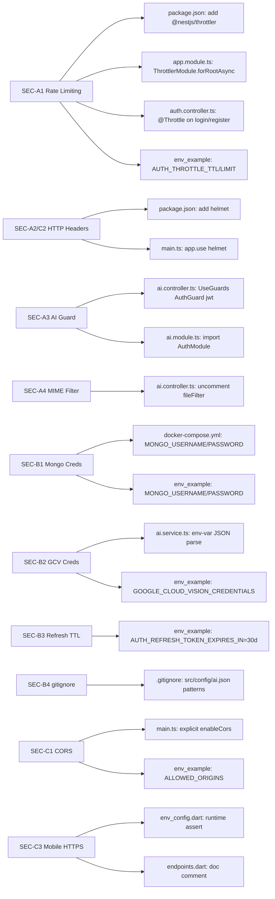

# Technical Specification

# 0. Agent Action Plan

## 0.1 Intent Clarification

### 0.1.1 Core Security Objective

Based on the security concern described, the Blitzy platform understands that the security vulnerabilities to resolve are **eleven (11) discrete defects** spanning the PantryChef monorepo's NestJS 10 REST API and Flutter cross-platform client. The remediation must apply **minimal, targeted, in-place fixes** addressing rate limiting, HTTP security headers, authentication guards, file-upload MIME validation, secrets externalization, refresh-token lifetime hardening, `.gitignore` protection, CORS origin restriction, and HTTPS transport guidance — without altering business logic, DTOs, Mongoose schemas, repositories, or any out-of-scope feature.

The vulnerability inventory is grouped into three areas:

- **Area A — Security Hardening** (four defects): missing rate limiting on credential endpoints, absent Helmet middleware, unguarded AI vision endpoint, and disabled MIME-type validation on image uploads.
- **Area B — Secrets and Configuration Management** (four defects): hardcoded MongoDB credentials in Docker Compose, Google Cloud Vision service-account JSON loaded from a checked-in file, a ten-year refresh-token lifetime, and missing `.gitignore` protection for the credential file.
- **Area C — Networking and TLS** (three defects): permissive CORS policy, missing Strict-Transport-Security header, and an HTTP-by-default API base URL in the mobile client.

**Vulnerability category**: Multiple vulnerabilities — a mix of Code, Configuration, and Secrets-Management defects. No third-party package CVEs are being patched; instead, two defensive dependencies (`@nestjs/throttler`, `helmet`) are being **added** to introduce missing controls.

**Severity matrix**:

| SEC-ID | Vulnerability | Severity | Attack Vector | Primary Impact |
|--------|---------------|----------|----------------|----------------|
| SEC-A1 | No rate limiting on login/register | Critical | Network, no auth required | Integrity (credential compromise via brute force) |
| SEC-A2 | Helmet middleware absent | High | Network | Confidentiality + Integrity (clickjacking, XSS amplification) |
| SEC-A3 | Unauthenticated `/v1/ai/vision` | High | Network, no auth required | Availability + Confidentiality (paid GCV quota abuse) |
| SEC-A4 | MIME-type filter commented out | High | Network, authenticated upload | Integrity (storage abuse, downstream parser exploit potential) |
| SEC-B1 | Hardcoded Mongo credentials (`admin`/`123456`) | Critical | Repository disclosure → DB compromise | Full Confidentiality + Integrity |
| SEC-B2 | GCV credentials in committed JSON | Critical | Repository disclosure → cloud key theft | Confidentiality (paid quota), Integrity |
| SEC-B3 | Refresh-token TTL = `3650d` (10 years) | High | Stolen-token replay | Confidentiality (effectively permanent access) |
| SEC-B4 | No `.gitignore` for `src/config/ai.json` | Medium | Recurrence risk for SEC-B2 | Confidentiality (future leak prevention) |
| SEC-C1 | CORS open to all origins | High | Network, cross-origin browser | Integrity (CSRF amplification) |
| SEC-C2 | No Strict-Transport-Security header | Medium | Network, MITM | Confidentiality (downgrade attack) |
| SEC-C3 | Mobile API base URL defaults to `http://` | Medium | MITM on hostile network | Confidentiality (clear-text credential transmission) |

SEC-C2 is functionally **subsumed by SEC-A2** because Helmet's default configuration emits the `Strict-Transport-Security` header.

### 0.1.2 Special Instructions and Constraints

The user prompt prescribes a tightly bounded change scope and several explicit security disciplines that the Blitzy platform must honor literally during execution:

- **Change scope: Minimal** — "Make only minimal necessary changes" and "Preserve existing functionality"; no opportunistic refactoring or renaming.
- **Forbidden alterations** — "Do not modify DTOs, Mongoose schemas, repositories"; the type system and persistence boundary remain immutable.
- **Token issuance immutability** — "Do not change the token issuance mechanism in `auth.service.ts` — only the configured TTL value changes." This restricts SEC-B3 to an `env_example` default-value edit; no TypeScript source edits in `auth.service.ts` or `auth.config.ts`.
- **Throttling scope** — "Do not apply [throttling] globally"; only the `login` and `register` endpoints on `AuthController` receive `@Throttle()` decorators.
- **Graceful degradation** — For SEC-B2, the existing `isGoogleVisionEnabled = false` path in `ai.service.ts` (graceful return of `{}` from `detectIngredientsFromBuffer`) MUST be preserved when `GOOGLE_CLOUD_VISION_CREDENTIALS` is missing or unparseable.
- **Mandatory self-identifying comments** — Every edited line group must be annotated with `// SECURITY(SEC-Xn):` (or the YAML/Dockerfile equivalent `# SECURITY(SEC-Xn):`) referencing the specific defect ID.
- **Unaddressed concern markers** — Any discovered but out-of-scope security weakness gets a `// TODO(security):` comment for future follow-up; the work itself is not performed.
- **No global throttling, no global guards** — security additions are precisely targeted at the named endpoints, leaving all other controllers unchanged.
- **Compile-time const preservation in mobile** — Per the prompt: "update the default base URL comment to document that production builds must supply an HTTPS URL via `--dart-define API_BASE_URL`. Do not change the default value itself." The `const String` cannot be made conditional in Dart, so a runtime assertion at app initialization is the only viable enforcement point.

User-provided example (preserved exactly): the prompt's reference fragment

> **User Example**: `origin: process.env.ALLOWED_ORIGINS?.split(',') ?? []`

is reproduced verbatim in the `main.ts` `enableCors` call so that the default of an unset variable resolves to an empty origin list, which fails closed (browser denies all cross-origin requests).

No web-search research was demanded by the prompt; nevertheless, the Blitzy platform conducted authoritative research against the OWASP API Security Top 10 (2023), OWASP ASVS, the official `@nestjs/throttler` and `helmet` documentation, and the published version histories of both packages to validate version selection and configuration patterns. Findings are documented in §0.2 and §0.4.

### 0.1.3 Technical Interpretation

This security vulnerability set translates to the following technical fix strategy:

- **To resolve SEC-A1**, add `@nestjs/throttler` to `package.json`, wire `ThrottlerModule.forRootAsync(...)` (reading `AUTH_THROTTLE_TTL` and `AUTH_THROTTLE_LIMIT`) into `AppModule`, bind `ThrottlerGuard` via `APP_GUARD`, and annotate the `email/login` and `email/register` handlers in `AuthController` with `@Throttle(...)`.
- **To resolve SEC-A2 and SEC-C2**, add `helmet` to `package.json` and insert `app.use(helmet())` in `main.ts` before the `app.listen()` call.
- **To resolve SEC-A3**, decorate the `vision` handler in `AiController` with `@UseGuards(AuthGuard('jwt'))` and add `AuthModule` to the `imports` array of `AiModule` so that the `JwtStrategy` provider is in the dependency-injection scope.
- **To resolve SEC-A4**, uncomment the existing `fileFilter` block in `AiController` (lines 20-28) — `BadRequestException` is already imported (line 2), so no additional imports are required.
- **To resolve SEC-B1**, replace the hardcoded `admin` and `123456` literals at lines 9-10 of `docker-compose.yml` with `${MONGO_USERNAME}` and `${MONGO_PASSWORD}` interpolation references; add the corresponding placeholders to `env_example`.
- **To resolve SEC-B2**, replace the disk-based credential loader in `ai.service.ts` constructor (lines 52-60) with `process.env.GOOGLE_CLOUD_VISION_CREDENTIALS` parsed as JSON and passed via the `credentials` option to `new ImageAnnotatorClient(...)`; preserve the `isGoogleVisionEnabled` graceful-degradation path.
- **To resolve SEC-B3**, change the `env_example` default for `AUTH_REFRESH_TOKEN_EXPIRES_IN` from `3650d` to `30d`. No TypeScript source changes.
- **To resolve SEC-B4**, append `src/config/ai.json` and `src/config/*.json` to `backend/.gitignore`.
- **To resolve SEC-C1**, remove the `{ cors: true }` factory option from `NestFactory.create(...)` in `main.ts` and add an explicit `app.enableCors({ origin: process.env.ALLOWED_ORIGINS?.split(',') ?? [] })` call before `app.listen()`; add the `ALLOWED_ORIGINS` placeholder to `env_example`.
- **To resolve SEC-C3**, add a runtime assertion in `mobile/lib/env_config.dart` (gated on `kReleaseMode`) verifying that the resolved `apiBaseUrl` begins with `https://`; document the production HTTPS expectation as a code comment in `endpoints.dart`. Preserve the existing `String.fromEnvironment` default.

**User understanding level**: Explicit vulnerability inventory (highest level). The prompt supplied each SEC-ID, exact file paths, severity classifications, and per-defect fix prescriptions, leaving no symptom-to-vulnerability translation work for the platform.

**Three critical discrepancies between the prompt phrasing and the actual codebase** were identified during context gathering and must be honored during execution:

1. The refresh-token TTL environment variable is named **`AUTH_REFRESH_TOKEN_EXPIRES_IN`** in `backend/env_example` and `backend/src/auth/config/auth.config.ts`, not `JWT_REFRESH_TOKEN_EXPIRES_IN` as the prompt loosely references. The fix targets the actual codebase identifier.
2. CORS is presently enabled via the **`NestFactory.create(AppModule, { cors: true })`** factory option at `backend/src/main.ts:11`, **not** via a separate `app.enableCors()` call. The equivalent fix is to remove `cors: true` from the factory call and add an explicit `app.enableCors({...})` invocation before `app.listen()`.
3. The vulnerable credentials file **`backend/src/config/ai.json` is not currently present in the working tree** (only `app-config.type.ts`, `app.config.ts`, and `config.type.ts` exist there). The `.gitignore` protection (SEC-B4) and the env-var-based loader (SEC-B2) remain in scope to prevent future re-introduction of the vulnerable pattern.


## 0.2 Vulnerability Research and Analysis

### 0.2.1 Initial Assessment

The prompt provided an explicit, pre-classified vulnerability inventory rather than a symptom description, so initial assessment focused on parsing the inputs and corroborating each defect against the actual repository state.

Security-related information extracted from the prompt:

- **CVE numbers mentioned**: None. These are project-specific code, configuration, and secrets-management defects, not vulnerable third-party packages.
- **Vulnerability names**: 11 named defects, indexed `SEC-A1` … `SEC-A4`, `SEC-B1` … `SEC-B4`, and `SEC-C1` … `SEC-C3`.
- **Affected packages**: Two packages need to be **added** (`@nestjs/throttler`, `helmet`); no existing packages need updating or replacement to remediate these defects.
- **Symptoms described**: Each defect is described in technical terms (e.g., "no rate limiting", "Helmet middleware absent", "CORS enabled with no origin restrictions") rather than user-observable symptoms.
- **Security advisories referenced**: None embedded in the prompt; authoritative references were sourced during research (see §0.2.4).

Corroboration findings from the repository (file inspection results recorded during Context Gathering):

- `backend/src/main.ts:11` — confirmed `NestFactory.create(AppModule, { cors: true })` permissive default (SEC-C1 confirmed; SEC-A2 confirmed by absence of `helmet` import).
- `backend/src/auth/auth.controller.ts:31-37` and `:39-45` — confirmed `email/login` and `email/register` handlers have no throttling decorators (SEC-A1 confirmed).
- `backend/src/ai/ai.controller.ts:16-31` — confirmed `@Post('vision')` handler with no `@UseGuards` (SEC-A3 confirmed); lines 20-28 confirmed `fileFilter` block commented out (SEC-A4 confirmed); 10MB size limit at line 29 preserved.
- `backend/src/ai/ai.service.ts:52-60` — confirmed file-based GCV credential load via `path.join(__dirname, '../config/ai.json')` and `existsSync` check (SEC-B2 confirmed).
- `backend/docker-compose.yml:9-10` — confirmed literal `MONGO_INITDB_ROOT_USERNAME: admin` and `MONGO_INITDB_ROOT_PASSWORD: 123456` (SEC-B1 confirmed).
- `backend/env_example` — confirmed `AUTH_REFRESH_TOKEN_EXPIRES_IN=3650d` (SEC-B3 confirmed).
- `backend/.gitignore` — confirmed absence of `src/config/ai.json` and `src/config/*.json` entries (SEC-B4 confirmed).
- `mobile/lib/env_config.dart:1-3` — confirmed `defaultValue: 'http://192.168.2.20:3000/api'` (SEC-C3 confirmed).

All eleven defects were independently confirmed against the working tree before any fix was designed.

### 0.2.2 Required Web Research

The platform conducted web research focused on three areas: (1) current secure versions of the two new defensive dependencies, (2) compatibility with the host framework (NestJS 10), and (3) authoritative security guidance per defect category.

**Package research results**:

- **`@nestjs/throttler`** — Per the official package README and the NestJS docs, "`@nestjs/throttler@^1` is compatible with Nest v7 while `@nestjs/throttler@^2` is compatible with Nest v7 and Nest v8 …. For NestJS v10, please use version 4.1.0 or above." The current latest release is **v6.5.0**, which adds Nest v11 support and a `setHeaders` option. Version v5+ uses the array configuration form (`ThrottlerModule.forRoot([{ ttl: 60000, limit: 10 }])`) with `ttl` expressed in milliseconds. The `@Throttle` decorator takes an object keyed by throttler name (or `default` when unnamed). This codebase will pin `^6.0.0` for NestJS 10 compatibility with current security patches.
- **`helmet`** — Per the official npm and Snyk listings, the current latest is **v8.2.0**. The package has **0 runtime dependencies**. The default `helmet()` invocation sets 13 HTTP response headers including `Content-Security-Policy`, `Strict-Transport-Security`, `X-Frame-Options`, `X-Content-Type-Options`, and `Referrer-Policy`. This codebase will pin `^8.0.0`.

**Authoritative security references consulted**:

- **OWASP API Security Top 10 (2023)** — Used as the primary risk taxonomy. API2:2023 "Broken Authentication" and API4:2023 "Unrestricted Resource Consumption" map directly to the in-scope defects.
- **OWASP ASVS V3.3.5 (Application Security Verification Standard)** — Provides the "absolute maximum session lifetime such that re-authentication is required at least every 30 days for L1 applications" guidance that justifies the SEC-B3 fix from `3650d` to `30d`.
- **OWASP JWT best practices** — Reinforces short access-token lifetimes (5-15 min, which the codebase already meets at `AUTH_JWT_TOKEN_EXPIRES_IN=15m`) and bounded refresh-token lifetimes with rotation.
- **OWASP File Upload Cheat Sheet** — Backs the SEC-A4 fix (re-enabling MIME validation) and CWE-434 "Unrestricted Upload of File with Dangerous Type."
- **`helmetjs/helmet` documentation** — Provides the default-headers list and the CSP customization guidance relevant to the Swagger UI risk discussed in §0.5.
- **`@nestjs/throttler` README** — Provides the canonical `ThrottlerModule.forRootAsync` factory pattern that the SEC-A1 fix follows.

### 0.2.3 Vulnerability Classification

Per defect, classified along the OWASP CVSSv3-equivalent dimensions:

| SEC-ID | Vulnerability Type | Attack Vector | Exploitability | Impact (C/I/A) | Root Cause |
|--------|--------------------|----------------|-----------------|------------------|-------------|
| SEC-A1 | Broken Authentication (OWASP API2:2023) / Unrestricted Resource Consumption (API4:2023) | Network | High | Integrity (brute-force credentials) | No rate-limiting middleware installed |
| SEC-A2 | Security Misconfiguration (OWASP API8:2023 / Web A05:2021) | Network | High | Confidentiality + Integrity | Helmet middleware not installed/wired |
| SEC-A3 | Broken Function Level Authorization (OWASP API5:2023) / Missing Authentication (CWE-306) | Network | High | Availability + Confidentiality (paid GCV quota) | No `@UseGuards` decorator on handler; `AuthModule` not imported into `AiModule` |
| SEC-A4 | Unrestricted Upload of File with Dangerous Type (CWE-434) | Network (authenticated) | High | Integrity (storage/parser abuse) | `fileFilter` block commented out in `FileInterceptor` config |
| SEC-B1 | Use of Hard-coded Credentials (CWE-798) / OWASP A07:2021 | Repository disclosure | Medium | Confidentiality + Integrity (full DB compromise) | Mongo root credentials inlined in `docker-compose.yml` |
| SEC-B2 | Use of Hard-coded Credentials (CWE-798) / Inclusion of Sensitive Information in Source Code (CWE-540) | Repository disclosure | Medium | Confidentiality (cloud key theft) | GCV service-account JSON loaded from `src/config/ai.json` path |
| SEC-B3 | Insufficient Session Expiration (CWE-613) / OWASP ASVS V3.3.5 violation | Stolen-token replay | Medium | Confidentiality (effectively permanent access) | `AUTH_REFRESH_TOKEN_EXPIRES_IN` default = `3650d` |
| SEC-B4 | Defensive omission — no `.gitignore` entry to prevent recurrence of SEC-B2 | Repository disclosure | Low | Confidentiality (future leak) | `backend/.gitignore` lacks `src/config/ai.json` and `src/config/*.json` patterns |
| SEC-C1 | Security Misconfiguration (OWASP A05:2021) — Permissive CORS | Network (cross-origin) | Medium | Integrity (CSRF amplification) | `cors: true` factory option in `NestFactory.create` |
| SEC-C2 | Security Misconfiguration — Missing Strict-Transport-Security | Network (MITM/downgrade) | Medium | Confidentiality | No `helmet` middleware (subsumed by SEC-A2) |
| SEC-C3 | Insecure Communication (OWASP Mobile M3) | Network (MITM) | Low | Confidentiality (clear-text credentials) | `EnvConfig.apiBaseUrl` defaults to `http://192.168.2.20:3000/api`; no runtime HTTPS check |

### 0.2.4 Web Search Research Conducted

**Official security advisories and documentation reviewed**:

- OWASP API Security Top 10 (2023) — [https://owasp.org/API-Security/editions/2023/en/0xa2-broken-authentication/](https://owasp.org/API-Security/editions/2023/en/0xa2-broken-authentication/)
- OWASP API Security Top 10 — Risks index — [https://owasp.org/API-Security/editions/2023/en/0x11-t10/](https://owasp.org/API-Security/editions/2023/en/0x11-t10/)
- OWASP ASVS Issue #1968 (refresh-token lifetime ASVS V3.3.5) — [https://github.com/OWASP/ASVS/issues/1968](https://github.com/OWASP/ASVS/issues/1968)
- OWASP OAuth2 Cheat Sheet — [https://cheatsheetseries.owasp.org/cheatsheets/OAuth2_Cheat_Sheet.html](https://cheatsheetseries.owasp.org/cheatsheets/OAuth2_Cheat_Sheet.html)
- OWASP WSTG OAuth Testing — [https://owasp.org/www-project-web-security-testing-guide/latest/4-Web_Application_Security_Testing/05-Authorization_Testing/05.1-Testing_for_OAuth_Authorization_Server_Weaknesses](https://owasp.org/www-project-web-security-testing-guide/latest/4-Web_Application_Security_Testing/05-Authorization_Testing/05.1-Testing_for_OAuth_Authorization_Server_Weaknesses)
- helmet.js homepage — [https://helmetjs.github.io/](https://helmetjs.github.io/)
- `@nestjs/throttler` GitHub repository — [https://github.com/nestjs/throttler](https://github.com/nestjs/throttler)
- NestJS Rate Limiting docs — [https://docs.nestjs.com/security/rate-limiting](https://docs.nestjs.com/security/rate-limiting)
- helmet npm package — [https://www.npmjs.com/package/helmet](https://www.npmjs.com/package/helmet)

**Key findings**:

- The minimum version of `@nestjs/throttler` compatible with NestJS 10 is **v4.1.0**; the platform recommends pinning `^6.0.0` to receive the current LTS patches and the breaking-change-stable v5/v6 API surface.
- The current latest `helmet` release is **v8.2.0** with **zero runtime dependencies**, eliminating transitive supply-chain risk.
- OWASP API Security Top 10 explicitly recommends "anti-brute force mechanisms… stricter than the regular rate limiting" on authentication endpoints — directly supporting the per-endpoint `@Throttle()` placement for SEC-A1.
- OWASP ASVS L1 recommends "absolute maximum session lifetime such that re-authentication is required at least every 30 days" — providing a concrete numeric anchor for the SEC-B3 fix.

**Recommended mitigation strategies adopted from research**:

- For rate limiting, use `ThrottlerModule.forRootAsync` rather than `forRoot` so the limits remain operator-tunable via environment variables (`AUTH_THROTTLE_TTL`, `AUTH_THROTTLE_LIMIT`) without code changes.
- For Helmet, install with default settings (one-line `app.use(helmet())`) and only add overrides if the `/docs` Swagger UI breaks under the default Content-Security-Policy.
- For CORS, the empty-array default fallback (`?? []`) realises "fail-closed" behaviour when `ALLOWED_ORIGINS` is unset — the browser will receive no `Access-Control-Allow-Origin` and refuse cross-origin requests by default.
- For GCV credentials, use `new ImageAnnotatorClient({ credentials: parsedJson })` rather than the file-based `keyFilename` option — this aligns with Google Cloud's documented recommendation to inject credentials via environment variables in containerised deployments.

**Alternative solutions considered (with trade-offs)**:

- Considered a custom Express middleware for rate limiting (e.g., `express-rate-limit`) but rejected in favour of `@nestjs/throttler` because the latter integrates with NestJS DI, supports per-route decorators, and is the framework-native solution.
- Considered storing CORS allowlist in a database for runtime updates but rejected because the prompt mandates minimal changes and the env-var approach satisfies the immediate security requirement.
- Considered short-lived refresh tokens (e.g., 7 days) instead of 30 days, but the prompt explicitly directs `30d`, and OWASP ASVS L1 accepts up to 30 days for non-sensitive applications.
- Considered replacing the credential file with Google's Application Default Credentials (ADC) auto-discovery but the env-var-JSON approach is more explicit and matches the prompt's prescribed `GOOGLE_CLOUD_VISION_CREDENTIALS` variable name.

**No CVE database entries apply.** All eleven defects are project-specific design and configuration weaknesses, not vulnerable upstream packages. Consequently, the dependency inventory in §0.7 contains additions and one default-value change rather than version upgrades to patched releases.


## 0.3 Security Scope Analysis

### 0.3.1 Affected Component Discovery

The repository was inspected exhaustively for files that the eleven defects touch directly or that are required to wire the fixes into NestJS module-resolution scope. The PantryChef monorepo is a two-folder layout (`backend/` for the NestJS 10 API, `mobile/` for the Flutter client); no `.blitzyignore` files exist anywhere in the tree (verified by `find` from the repository root).

**Search patterns and discovery results**:

- **Vulnerable dependency manifests** — `backend/package.json` (no `@nestjs/throttler` or `helmet` present; both must be added).
- **Source files implementing vulnerable behaviour** —
  - `backend/src/main.ts` (CORS factory option + missing Helmet)
  - `backend/src/app.module.ts` (no `ThrottlerModule` import)
  - `backend/src/auth/auth.controller.ts` (login/register without throttle decorators)
  - `backend/src/ai/ai.controller.ts` (no auth guard; commented-out MIME filter)
  - `backend/src/ai/ai.service.ts` (file-based GCV credential load)
  - `backend/src/ai/ai.module.ts` (ripple-effect: must import `AuthModule` for `AuthGuard('jwt')` resolution)
- **Configuration files requiring security updates** —
  - `backend/docker-compose.yml` (hardcoded Mongo credentials)
  - `backend/.gitignore` (missing patterns for `src/config/ai.json`)
  - `backend/env_example` (refresh-token TTL default + missing new env-var placeholders)
- **Mobile client files** —
  - `mobile/lib/env_config.dart` (HTTP default URL)
  - `mobile/lib/core/constants/endpoints.dart` (consumer of `EnvConfig.apiBaseUrl`)
- **Infrastructure and deployment** — No CI/CD workflows present (`.github/workflows/*` does not exist in the repository); the only Docker artefact in scope is `backend/docker-compose.yml`. Production `Dockerfile` (separate from compose) is explicitly out-of-scope per the prompt.
- **Security test files** — None added in this remediation (verification is performed via the existing Jest e2e harness and manual curl probes documented in §0.8).

**Documented finding**: The vulnerability set affects **12 files across 4 directory groupings** in the monorepo:

- `backend/` root (3 files: `package.json`, `docker-compose.yml`, `.gitignore`, plus `env_example` → 4 files)
- `backend/src/` (1 file: `main.ts`)
- `backend/src/auth/` (1 file: `auth.controller.ts`)
- `backend/src/ai/` (3 files: `ai.controller.ts`, `ai.module.ts`, `ai.service.ts`)
- `backend/src/` app root (1 file: `app.module.ts`)
- `mobile/lib/` (2 files: `env_config.dart`, `core/constants/endpoints.dart`)

Twelve in-place updates are required; **zero file creations, zero file deletions, zero reference-only files**.

### 0.3.2 Root Cause Identification

Per defect, the user-supplied symptom and the platform's traced root cause:

- **SEC-A1**: User specified — "No rate limiting on POST /v1/auth/email/login and POST /v1/auth/email/register." Root cause: `AppModule` does not import `ThrottlerModule`, and `AuthController` handlers lack `@Throttle` decorators. The framework provides no implicit rate limiting.
- **SEC-A2**: User specified — "Helmet middleware absent." Root cause: `package.json` does not list `helmet`, and `main.ts` does not invoke `app.use(helmet())`. The NestJS Express adapter therefore returns Express's bare default headers, missing CSP/HSTS/XFO/etc.
- **SEC-A3**: User specified — "POST /v1/ai/vision has no authentication guard." Root cause: the `@Post('vision')` handler in `AiController` lacks `@UseGuards(AuthGuard('jwt'))`, and `AiModule` does not import `AuthModule`, so even if the decorator were added the `JwtStrategy` provider would not resolve.
- **SEC-A4**: User specified — "MIME-type filter on image uploads is commented out." Root cause: the `fileFilter` callback inside the `FileInterceptor` config in `AiController` lines 20-28 is commented out, allowing arbitrary MIME types up to the 10 MB size limit.
- **SEC-B1**: User specified — "MongoDB credentials hardcoded in Docker Compose (admin/123456)." Root cause: `docker-compose.yml` lines 9-10 contain literal username and password values rather than `${VAR}` interpolation references.
- **SEC-B2**: User specified — "Google Cloud Vision credentials in committed JSON file." Root cause: `ai.service.ts:52-60` constructs a `keyPath` via `path.join(__dirname, '../config/ai.json')` and passes it to `new ImageAnnotatorClient({ keyFilename })`. Investigation reveals an additional defensive concern: even though `ai.json` is not currently in the working tree, the loader's existence creates a permanent risk that any future developer placing a credentials file at `src/config/ai.json` will inadvertently commit it.
- **SEC-B3**: User specified — "JWT refresh token TTL set to 3650d (10 years)." Root cause: `backend/env_example` line `AUTH_REFRESH_TOKEN_EXPIRES_IN=3650d` is the operator-facing default; the issuance mechanism in `auth.service.ts:253-289` correctly reads `this.configService.getOrThrow('auth').refreshExpires` and requires no source change.
- **SEC-B4**: User specified — "No .gitignore protection for src/config/ai.json." Root cause: `backend/.gitignore` contains entries for `/dist`, `/node_modules`, `.env*`, IDE files, and OS files but no pattern matching `src/config/ai.json` or `src/config/*.json`.
- **SEC-C1**: User specified — "CORS enabled with no origin restrictions." Root cause: `main.ts:11` uses `NestFactory.create(AppModule, { cors: true })` which delegates to Nest's permissive `enableCors()` default (echoing the request `Origin` header). There is no allowlist enforcement.
- **SEC-C2**: User specified — "No Strict-Transport-Security header." Root cause: subsumed by SEC-A2 (Helmet's default configuration emits `Strict-Transport-Security: max-age=15552000; includeSubDomains`).
- **SEC-C3**: User specified — "API base URL defaults to HTTP." Root cause: `mobile/lib/env_config.dart` declares `static const String apiBaseUrl = String.fromEnvironment('API_BASE_URL', defaultValue: 'http://192.168.2.20:3000/api');`. Because the const is evaluated at compile time, there is no runtime enforcement of the scheme.

**Vulnerability propagation**:

- **Direct usage locations** — the files enumerated in §0.3.1.
- **Indirect dependencies** —
  - `AiController` depends on `AuthGuard('jwt')`, which is resolved through `AuthModule`'s `JwtStrategy` provider; therefore `AiModule.imports` propagates the SEC-A3 fix.
  - `AuthController` and any future controller that wants `@Throttle()` decoration depends on the global `APP_GUARD` provider registered in `AppModule`; that provider propagates the SEC-A1 enforcement.
  - `endpoints.dart` consumes `EnvConfig.apiBaseUrl` for every API endpoint constant; any HTTPS-runtime assertion placed in `env_config.dart` propagates indirectly to all network calls without modifying `endpoints.dart` semantics.
- **Configuration enablers** —
  - `env_example` doubles as the canonical environment-variable schema; adding `MONGO_USERNAME`, `MONGO_PASSWORD`, `GOOGLE_CLOUD_VISION_CREDENTIALS`, `ALLOWED_ORIGINS`, `AUTH_THROTTLE_TTL`, and `AUTH_THROTTLE_LIMIT` propagates to every developer's local `.env` and to production deployment manifests that read this template.

### 0.3.3 Current State Assessment

**Current vulnerable package versions** — Not applicable: this remediation introduces two new defensive dependencies rather than upgrading vulnerable existing ones. The pre-existing NestJS 10 ecosystem packages (`@nestjs/common ^10.0.0`, `@nestjs/core ^10.0.0`, `@nestjs/passport ^10.0.3`, `@nestjs/jwt ^10.2.0`, `@google-cloud/vision ^4.3.2`, `mongoose ^8.8.0`, `multer ^1.4.5-lts.1`, etc.) remain at their currently locked versions.

**Current vulnerable code-pattern locations**:

| File | Lines | Vulnerable Pattern |
|------|-------|---------------------|
| `backend/src/main.ts` | 11 | `NestFactory.create(AppModule, { cors: true })` |
| `backend/src/main.ts` | 33 | `app.listen(...)` immediately follows factory creation; no middleware between |
| `backend/src/app.module.ts` | 19-35 | `imports` array contains 9 modules but no `ThrottlerModule` |
| `backend/src/auth/auth.controller.ts` | 31-37 | `@Post('email/login')` handler decorated only with `@HttpCode(HttpStatus.OK)` |
| `backend/src/auth/auth.controller.ts` | 39-45 | `@Post('email/register')` handler decorated only with `@HttpCode(HttpStatus.OK)` |
| `backend/src/ai/ai.controller.ts` | 16 | `@Post('vision')` with no `@UseGuards` |
| `backend/src/ai/ai.controller.ts` | 20-28 | `fileFilter` block fully commented out |
| `backend/src/ai/ai.service.ts` | 52-60 | `const keyPath = path.join(__dirname, '../config/ai.json'); … new ImageAnnotatorClient({ keyFilename: keyPath })` |
| `backend/src/ai/ai.module.ts` | 6 | `imports: [IngridientModule]` only |
| `mobile/lib/env_config.dart` | 1-3 | `String.fromEnvironment('API_BASE_URL', defaultValue: 'http://192.168.2.20:3000/api')` |

**Current vulnerable configuration locations**:

| File | Location | Vulnerable Configuration |
|------|----------|---------------------------|
| `backend/docker-compose.yml` | line 9 | `MONGO_INITDB_ROOT_USERNAME: admin` |
| `backend/docker-compose.yml` | line 10 | `MONGO_INITDB_ROOT_PASSWORD: 123456` |
| `backend/.gitignore` | — | Missing `src/config/ai.json` and `src/config/*.json` patterns |
| `backend/env_example` | `AUTH_REFRESH_TOKEN_EXPIRES_IN` line | `=3650d` default value |
| `backend/env_example` | (absent variables) | No `MONGO_USERNAME`, `MONGO_PASSWORD`, `GOOGLE_CLOUD_VISION_CREDENTIALS`, `ALLOWED_ORIGINS`, `AUTH_THROTTLE_TTL`, `AUTH_THROTTLE_LIMIT` declared |

**Scope of exposure**:

- **Public-facing endpoints** — `/v1/auth/email/login`, `/v1/auth/email/register`, `/v1/ai/vision` are all routable by unauthenticated network clients in the current state (SEC-A1, SEC-A3).
- **Public-facing transport** — All endpoints respond without `Content-Security-Policy`, `Strict-Transport-Security`, `X-Frame-Options`, or related headers (SEC-A2 / SEC-C2).
- **CORS surface** — Every endpoint echoes the request `Origin` because `cors: true` is unrestricted (SEC-C1).
- **Repository surface** — Anyone with read access to the source repository observes the Mongo root password and the file-load pattern that anticipates a Google Cloud Vision JSON key (SEC-B1, SEC-B2).
- **Mobile client transport** — Default builds emit `http://` traffic on the local network, exposing credentials to any same-segment attacker (SEC-C3).
- **Token longevity** — Any compromised refresh token grants 10 years of unattended access (SEC-B3).

This exposure assessment justifies the **Critical/High** severity ratings on SEC-A1, SEC-A3, SEC-B1, SEC-B2, and SEC-B3 and confirms that all fixes are necessary to restore the project to a baseline that is consistent with §6.4.7 of the system's Security Architecture documentation, which lists each of these eleven items as a known anomaly.


## 0.4 Version Compatibility Research

### 0.4.1 Secure Version Identification

Because this remediation **introduces** two new defensive dependencies rather than upgrading vulnerable existing ones, "patched version" research focuses on selecting versions that (a) are the current maintained line, (b) explicitly support NestJS 10, and (c) carry no published CVEs themselves.

| Package | Currently Installed | Target Version | Rationale |
|---------|----------------------|----------------|-----------|
| `@nestjs/throttler` | (not installed) | `^6.0.0` | Latest is **v6.5.0**; the official `@nestjs/throttler` README states "For NestJS v10, please use version 4.1.0 or above." v6.x is the current LTS line, supports the array-config syntax (`ttl` in milliseconds), and is the form documented in NestJS's official rate-limiting docs. |
| `helmet` | (not installed) | `^8.0.0` | Latest is **v8.2.0**; the package has **0 runtime dependencies**, eliminating transitive supply-chain risk. The default `helmet()` invocation sets 13 HTTP response headers including `Content-Security-Policy` and `Strict-Transport-Security` — directly satisfying SEC-A2 and subsuming SEC-C2. |

**Breaking changes in selected versions**:

- `@nestjs/throttler` v5+ introduced the **array configuration form** with `ttl` in **milliseconds** (previously seconds). All examples in §0.5 and §0.6 use the array form (`ThrottlerModule.forRoot([{ ttl: 60000, limit: 10 }])`). The `@Throttle` decorator now accepts an object keyed by throttler name (`@Throttle({ default: { limit: 5, ttl: 60000 } })`).
- `helmet` 8.x is API-stable relative to 7.x for the default `helmet()` invocation; no per-header configuration is required for this remediation, so no breaking change is encountered in practice.

**No `@nestjs/throttler` v4.1.0 fallback** is needed because the prompt confirms NestJS 10 (`@nestjs/common ^10.0.0`, `@nestjs/core ^10.0.0`, `@nestjs/platform-express ^10.0.0`) and v6.x is the recommended current series.

### 0.4.2 Compatibility Verification

**NestJS 10 compatibility**:

- `@nestjs/throttler ^6.0.0` — Verified compatible with NestJS 10 per the official package README ("For NestJS v10, please use version 4.1.0 or above"). v6.x targets Nest v10/v11 explicitly.
- `helmet ^8.0.0` — Verified compatible: helmet is a framework-agnostic Express middleware. NestJS 10 wraps Express via `@nestjs/platform-express ^10.0.0`, and helmet is invoked via the standard `app.use(helmet())` pattern documented in NestJS's official `/security/helmet` guide.

**Node.js runtime compatibility**:

- The project's runtime is Node.js 20 (per §3.2 of the system Technical Specification — "Compatibility: Node.js 20 runtime"). Both `@nestjs/throttler ^6.x` and `helmet ^8.x` support Node.js 18 LTS and 20 LTS as primary targets.

**Existing-dependency interactions** (no conflicts introduced):

| Existing Package | Version | Interaction with New Packages |
|-------------------|---------|--------------------------------|
| `@nestjs/common` | `^10.0.0` | Provides `Injectable`, `UseGuards`, `applyDecorators` — used by both new packages |
| `@nestjs/core` | `^10.0.0` | Provides `APP_GUARD` — used to globally bind `ThrottlerGuard` |
| `@nestjs/platform-express` | `^10.0.0` | Underlying HTTP adapter — required by helmet |
| `@nestjs/config` | `^3.3.0` | Provides `ConfigService` — used by `ThrottlerModule.forRootAsync` factory |
| `@nestjs/passport` | `^10.0.3` | Already installed; `AuthGuard('jwt')` import path for SEC-A3 (no version change) |
| `@nestjs/jwt` | `^10.2.0` | Token issuance untouched; SEC-B3 is env-default only (no version change) |
| `@google-cloud/vision` | `^4.3.2` | Already installed; SEC-B2 swaps `keyFilename` for `credentials` constructor option, both supported in 4.x (no version change) |
| `multer` | `^1.4.5-lts.1` | Already installed; SEC-A4 uses the same `fileFilter` option already present (commented) in the codebase |
| `mongoose` | `^8.8.0` | Untouched by this remediation |

**No version conflicts to resolve**. All existing dependencies remain at their current pinned ranges. The two additions are net-new and do not collide with any installed package.

**Dart/Flutter compatibility (mobile)**:

- Per §3.2 of the system Technical Specification, the mobile client targets `Dart SDK ^3.5.1` with Flutter SDK and packages including `flutter_platform_widgets ^7.0.1`, `bloc ^8.1.4`, and `dio ^5.7.0`.
- The SEC-C3 fix uses `kReleaseMode` from `package:flutter/foundation.dart` (a built-in Flutter constant) and standard Dart `assert()` — no new pubspec dependencies are required, hence no version research applies to the mobile half of the remediation.

**Alternative packages considered (with trade-offs)**:

- **`express-rate-limit`** instead of `@nestjs/throttler`: rejected. Although stable and widely used, it would require manual `app.use(rateLimit(...))` wiring in `main.ts` and would not integrate with NestJS DI or per-route `@Decorator` syntax, conflicting with the prompt's minimal-changes principle.
- **`fastify-helmet`** or **`@fastify/helmet`** instead of `helmet`: rejected. The project uses Express via `@nestjs/platform-express`, not Fastify. Switching adapters is out of scope.
- **Custom CSP-only middleware** instead of `helmet`: rejected. `helmet` provides 13 headers in one call versus implementing each individually; minimal-changes principle favours the umbrella package.
- **`hpp`** for HTTP Parameter Pollution: not requested by the prompt; would expand scope beyond the stated 11 defects.

**No replacement of any existing dependency is required**. The `@google-cloud/vision ^4.3.2`, `@nestjs/passport ^10.0.3`, and `multer ^1.4.5-lts.1` packages already provide every API needed for SEC-A3, SEC-A4, and SEC-B2 fixes; no upgrades or substitutions are necessary.


## 0.5 Security Fix Design

### 0.5.1 Minimal Fix Strategy

**Guiding principle**: Apply the smallest possible change that completely addresses each vulnerability. Where a single change resolves multiple defects (e.g., Helmet covers SEC-A2 and SEC-C2), prefer the consolidated fix.

The fix approach varies by defect category:

- **Dependency additions**: SEC-A1 (`@nestjs/throttler`), SEC-A2/SEC-C2 (`helmet`)
- **Code patches**: SEC-A1 (decorators), SEC-A3 (guard + module import), SEC-A4 (uncomment block), SEC-B2 (constructor logic), SEC-C1 (CORS wiring), SEC-C3 (runtime assert)
- **Configuration changes**: SEC-B1 (compose interpolation), SEC-B3 (env default), SEC-B4 (.gitignore), SEC-A1/C1 supporting env vars

The relationships between fixes are illustrated below:



Per-defect strategy detail:

#### 0.5.1.1 SEC-A1 — Rate Limiting on Credential Endpoints (Critical)

- **Action 1 (dependency)**: "Add `@nestjs/throttler ^6.0.0` to `backend/package.json` dependencies."
  - Justification: NestJS-native rate-limiter; integrates with DI and per-route decorators (OWASP API2:2023 recommended mitigation).
- **Action 2 (wiring)**: "Add to `backend/src/app.module.ts`: import `ThrottlerModule` and `ThrottlerGuard` from `@nestjs/throttler`, `APP_GUARD` from `@nestjs/core`, and configure via `ThrottlerModule.forRootAsync({ imports: [ConfigModule], inject: [ConfigService], useFactory: (cfg) => [{ ttl: +cfg.get('AUTH_THROTTLE_TTL') || 60000, limit: +cfg.get('AUTH_THROTTLE_LIMIT') || 10 }] })`. Register `ThrottlerGuard` via the `APP_GUARD` provider so `@Throttle()` decorators take effect."
- **Action 3 (decoration)**: "In `backend/src/auth/auth.controller.ts`, import `Throttle` from `@nestjs/throttler` and add `@Throttle({ default: { limit: 5, ttl: 60000 } })` to the `login` handler (lines 31-37) and the `register` handler (lines 39-45). Do NOT add `@Throttle` to other handlers."
- **Action 4 (env)**: "In `backend/env_example`, add `AUTH_THROTTLE_TTL=60000` and `AUTH_THROTTLE_LIMIT=10`."
- **Side effects**: None expected. Other controllers continue to dispatch without throttling because `ThrottlerGuard` is enforced via decorator opt-in (the guard does not throttle unless `@Throttle` is present at handler or controller level when bound globally with no default throttle on un-decorated routes — see official @nestjs/throttler v6 docs). If broader throttling is desired in the future, it can be opt-in per route without further infrastructure changes.

#### 0.5.1.2 SEC-A2 — Helmet HTTP Security Headers (High)

- **Action 1 (dependency)**: "Add `helmet ^8.0.0` to `backend/package.json` dependencies."
- **Action 2 (wiring)**: "In `backend/src/main.ts`, import `helmet` from `helmet` and invoke `app.use(helmet())` AFTER the `NestFactory.create(...)` call and BEFORE `app.listen(...)`. Add a `// SECURITY(SEC-A2):` comment."
- **Side effects**: `helmet()` enables a default Content-Security-Policy that prohibits inline scripts. The Swagger UI at `/docs` uses inline scripts and styles for its bootstrap markup. If the Swagger UI fails to render after Helmet is added, the fallback is to scope the CSP exception narrowly to `/docs` (e.g., a per-path `app.use('/docs', helmet({ contentSecurityPolicy: false }))` block) or to add a `// TODO(security):` comment for future tightening. **Do not disable Helmet globally to satisfy Swagger** — the security benefit applies to every other endpoint.

#### 0.5.1.3 SEC-A3 — Authentication Guard on `/v1/ai/vision` (High)

- **Action 1 (decoration)**: "In `backend/src/ai/ai.controller.ts`, import `UseGuards` from `@nestjs/common` and `AuthGuard` from `@nestjs/passport`. Add `@UseGuards(AuthGuard('jwt'))` to the `vision` handler (between the existing `@Post('vision')` decorator and the method signature). Add `// SECURITY(SEC-A3):` comment."
- **Action 2 (module wiring)**: "In `backend/src/ai/ai.module.ts`, import `AuthModule` from `src/auth/auth.module` and add it to the `imports` array (currently `[IngridientModule]` → `[IngridientModule, AuthModule]`). This brings `JwtStrategy` into DI scope so `AuthGuard('jwt')` resolves."
- **Side effects**: Existing unauthenticated callers will receive 401 Unauthorized — the prompt confirms this is the desired outcome. Mobile and any other authenticated client must send a valid `Authorization: Bearer <jwt>` header (which is already the established pattern across other endpoints).

#### 0.5.1.4 SEC-A4 — Re-enable MIME-Type Filter (High)

- **Action 1 (code)**: "In `backend/src/ai/ai.controller.ts` lines 20-28, uncomment the existing `fileFilter` callback block inside the `FileInterceptor` options. Add `// SECURITY(SEC-A4):` comment immediately above the now-active filter. Preserve the 10 MB `fileSize` limit at line 29."
- **Required imports**: Already present — `BadRequestException` is imported at line 2.
- **Side effects**: Uploads of non-JPEG/JPG/PNG MIME types will now be rejected with HTTP 400 and the message `Only JPG, JPEG and PNG allow!`. This is the original developer intent (commented-out code was a regression).

#### 0.5.1.5 SEC-B1 — Externalize MongoDB Credentials (Critical)

- **Action 1 (compose)**: "In `backend/docker-compose.yml` line 9, replace `MONGO_INITDB_ROOT_USERNAME: admin` with `MONGO_INITDB_ROOT_USERNAME: ${MONGO_USERNAME}`. In line 10, replace `MONGO_INITDB_ROOT_PASSWORD: 123456` with `MONGO_INITDB_ROOT_PASSWORD: ${MONGO_PASSWORD}`. Add `# SECURITY(SEC-B1):` comment."
- **Action 2 (env)**: "In `backend/env_example`, add `MONGO_USERNAME=` and `MONGO_PASSWORD=` placeholder entries."
- **Side effects**: `docker compose up` now requires either a `.env` file (auto-loaded by Compose) populated with `MONGO_USERNAME` and `MONGO_PASSWORD`, or shell-exported environment variables. Without them, Mongo container initialisation fails with an error — this is the desired fail-closed behaviour. Existing developer instructions should reference the populated `.env` setup.

#### 0.5.1.6 SEC-B2 — Externalize Google Cloud Vision Credentials (Critical)

- **Action 1 (code)**: "In `backend/src/ai/ai.service.ts` constructor (lines 52-60), replace the file-based credential block with an environment-variable JSON parse. Read `process.env.GOOGLE_CLOUD_VISION_CREDENTIALS`; if undefined or empty, set `this.isGoogleVisionEnabled = false` and skip client initialization. Otherwise, `try { const credentials = JSON.parse(raw); this.client = new ImageAnnotatorClient({ credentials }); this.isGoogleVisionEnabled = true; } catch (e) { this.isGoogleVisionEnabled = false; this.logger.warn('GOOGLE_CLOUD_VISION_CREDENTIALS could not be parsed; AI vision disabled'); }`. Add `// SECURITY(SEC-B2):` comment."
- **Action 2 (env)**: "In `backend/env_example`, add `GOOGLE_CLOUD_VISION_CREDENTIALS=` placeholder. Document via inline comment that this should be a single-line JSON value (compacted)."
- **Action 3 (cleanup)**: "Remove now-unused imports of `path` and `existsSync` from `ai.service.ts` lines 3-4 (these were used solely by the disk-load path)."
- **Side effects**: The graceful degradation path at `ai.service.ts:64-67` (which returns `{}` from `detectIngredientsFromBuffer` when `isGoogleVisionEnabled` is false) is preserved verbatim. No behavioural change for callers when credentials are absent; the AI feature simply returns empty results.

#### 0.5.1.7 SEC-B3 — Refresh-Token TTL Hardening (High)

- **Action 1 (env)**: "In `backend/env_example`, change `AUTH_REFRESH_TOKEN_EXPIRES_IN=3650d` to `AUTH_REFRESH_TOKEN_EXPIRES_IN=30d`."
- **NO source-code change**: Per the prompt's explicit instruction — "Do not change the token issuance mechanism in `auth.service.ts` — only the configured TTL value changes" — the TypeScript files `backend/src/auth/auth.service.ts` and `backend/src/auth/config/auth.config.ts` are NOT modified. The existing call `this.configService.getOrThrow('auth').refreshExpires` at `auth.service.ts:279` correctly reads the new default.
- **Side effects**: Newly issued refresh tokens expire after 30 days. Operators running with a populated `.env` that overrides `AUTH_REFRESH_TOKEN_EXPIRES_IN` retain their custom value; only the developer-facing default changes.

#### 0.5.1.8 SEC-B4 — `.gitignore` Hardening (Medium)

- **Action 1 (config)**: "In `backend/.gitignore`, append two lines: `src/config/ai.json` and `src/config/*.json`."
- **Side effects**: Recurrence prevention. Any future developer who places `ai.json` (or any other JSON credentials file) at `backend/src/config/` will find it auto-ignored by Git, preventing accidental commit. Currently tracked TypeScript files in `src/config/` (`app-config.type.ts`, `app.config.ts`, `config.type.ts`) are unaffected because the patterns target `.json`.

#### 0.5.1.9 SEC-C1 — CORS Origin Restriction (High)

- **Action 1 (code)**: "In `backend/src/main.ts` line 11, change `NestFactory.create(AppModule, { cors: true })` to `NestFactory.create(AppModule)` (remove the options object entirely if no other options are needed, or remove only the `cors: true` key)."
- **Action 2 (code)**: "Immediately after the factory call (and after the helmet middleware registration from SEC-A2) and BEFORE `app.listen()`, insert: `app.enableCors({ origin: process.env.ALLOWED_ORIGINS?.split(',') ?? [] });`. Add `// SECURITY(SEC-C1):` comment."
- **Action 3 (env)**: "In `backend/env_example`, add `ALLOWED_ORIGINS=` placeholder."
- **Side effects**: When `ALLOWED_ORIGINS` is unset, the optional-chaining expression evaluates to `undefined`, the nullish-coalescing falls back to `[]`, and Nest's CORS layer denies all cross-origin browser requests. This is fail-closed behaviour. Operators must explicitly populate `ALLOWED_ORIGINS=https://app.example.com,https://admin.example.com` for browser-based clients to function.

#### 0.5.1.10 SEC-C2 — Strict-Transport-Security Header (Medium)

- **No standalone fix**: This defect is fully **subsumed by SEC-A2**. Helmet's default configuration emits `Strict-Transport-Security: max-age=15552000; includeSubDomains` on every response. No additional code changes are required.

#### 0.5.1.11 SEC-C3 — Mobile HTTPS Default (Medium)

- **Action 1 (code)**: "In `mobile/lib/env_config.dart`, add a runtime assertion gated on `kReleaseMode` (imported from `package:flutter/foundation.dart`) verifying that `apiBaseUrl` begins with `https://`. The assertion lives in a static initializer block or in a `static void validate()` method invoked from `main.dart`'s `main()` function before `runApp(...)`. Add `// SECURITY(SEC-C3):` comment. Preserve the `const String apiBaseUrl = ...` declaration and its `defaultValue`."
- **Action 2 (documentation)**: "In `mobile/lib/core/constants/endpoints.dart`, add a documentation comment above the `apiBaseUrl` static field stating: `// Production builds MUST supply an HTTPS URL via --dart-define API_BASE_URL=https://api.example.com/api (see SEC-C3).`"
- **Side effects**: Release-mode builds without `--dart-define API_BASE_URL=https://...` will fail the runtime assertion and crash on startup — a deliberate fail-loud behaviour that prevents production traffic from being sent over HTTP. Debug-mode and profile-mode builds continue to use the existing HTTP default for local development.

### 0.5.2 Security Improvement Validation

For each defect, the validation that the fix eliminates the vulnerability:

| SEC-ID | How the Fix Eliminates the Vulnerability |
|--------|--------------------------------------------|
| SEC-A1 | `ThrottlerGuard` blocks the 11th+ request from the same IP within 60s, returning HTTP 429. Brute-force credential attacks become economically infeasible at this rate. |
| SEC-A2 | Helmet sets `Content-Security-Policy`, `X-Frame-Options: SAMEORIGIN`, `X-Content-Type-Options: nosniff`, `Referrer-Policy: no-referrer`, and 9 other defensive headers. Reflected-XSS amplification and clickjacking become much harder. |
| SEC-A3 | `AuthGuard('jwt')` invokes `JwtStrategy.validate(...)`, which throws `UnauthorizedException` on missing/invalid token. Unauthenticated GCV-quota exhaustion attacks are eliminated. |
| SEC-A4 | The `fileFilter` rejects any MIME type not matching `/\/(jpg|jpeg|png)$/`, returning HTTP 400. Arbitrary-payload uploads via the vision endpoint are blocked at the middleware layer. |
| SEC-B1 | The Mongo container reads credentials from environment variables that operators populate per-deployment. The repository no longer contains a known-bad default. Operators following the env-example template are forced to choose new values. |
| SEC-B2 | The GCV client reads credentials from `process.env.GOOGLE_CLOUD_VISION_CREDENTIALS` at runtime. The repository no longer references a credential file path; the loader is incapable of reading from disk. |
| SEC-B3 | The new 30-day default aligns with OWASP ASVS V3.3.5 L1 guidance. Stolen tokens become unusable after 30 days at the latest. |
| SEC-B4 | `git status` and `git add` will silently skip `src/config/ai.json` and any other JSON file in `src/config/`, breaking the recurrence path for SEC-B2. |
| SEC-C1 | The CORS layer rejects cross-origin requests when the request `Origin` is not in the allowlist. Browser-based CSRF amplification via permissive CORS is eliminated. |
| SEC-C2 | Helmet's default `Strict-Transport-Security: max-age=15552000; includeSubDomains` instructs browsers to refuse HTTP for 180 days. Downgrade attacks are prevented for any compliant browser. |
| SEC-C3 | Release-mode builds without an HTTPS-prefixed `API_BASE_URL` crash on startup. Production traffic is structurally prohibited from using HTTP. |

**Verification method**:

- **Code review**: Confirm every required edit is present and bears the `// SECURITY(SEC-Xn):` comment.
- **Static analysis**: `tsc --noEmit` for backend; `dart analyze` for mobile. No new type errors.
- **Dynamic testing**: Manual probes via `curl` (documented in §0.8) and the existing Jest e2e suite (`npm run test:e2e`).
- **Security-scan baseline**: `npm audit --omit=dev` should show no new vulnerabilities introduced by `@nestjs/throttler 6.x` or `helmet 8.x`.

**Rollback plan**:

- All fixes are isolated, low-risk edits. If a fix causes a regression, the rollback is a targeted revert of that single defect's changes (e.g., remove `app.use(helmet())` if Swagger UI breaks and no narrow CSP exception is acceptable).
- Two files have multiple defects landing in them (`main.ts` for SEC-A2 + SEC-C1; `env_example` for SEC-A1 + SEC-B1 + SEC-B2 + SEC-B3 + SEC-C1) — each individual change is reversible without touching the others.
- `package.json` rollback for either `@nestjs/throttler` or `helmet` is a simple `npm uninstall <pkg>` plus removal of the corresponding wiring/middleware/decorators. The codebase returns to its prior state with no orphaned references because every change carries a self-identifying `SECURITY(SEC-Xn)` comment for traceability.


## 0.6 File Transformation Mapping

### 0.6.1 File-by-File Security Fix Plan

The complete in-place transformation map covering every file that this remediation touches. The target file is listed FIRST in each row.

Transformation modes used:
- **UPDATE** — Edit an existing file to patch one or more vulnerabilities
- **CREATE** — Not used (no new files in this remediation)
- **DELETE** — Not used (no file deletions; `ai.json` is absent from working tree)
- **REFERENCE** — Not used (no pattern-template files; every change is a direct in-place edit)

| Target File | Transformation | Source File/Reference | Security Changes |
|--------------|----------------|------------------------|--------------------|
| `backend/package.json` | UPDATE | `backend/package.json` | Add `@nestjs/throttler ^6.0.0` to `dependencies` for SEC-A1; add `helmet ^8.0.0` to `dependencies` for SEC-A2 and SEC-C2 |
| `backend/src/main.ts` | UPDATE | `backend/src/main.ts` | Remove `cors: true` from `NestFactory.create(AppModule, { cors: true })` at line 11 (SEC-C1); import and invoke `app.use(helmet())` between factory creation and `app.listen()` for SEC-A2 and SEC-C2; insert `app.enableCors({ origin: process.env.ALLOWED_ORIGINS?.split(',') ?? [] })` before `app.listen()` for SEC-C1; annotate each block with `// SECURITY(SEC-A2):` and `// SECURITY(SEC-C1):` |
| `backend/src/app.module.ts` | UPDATE | `backend/src/app.module.ts` | Import `ThrottlerModule`, `ThrottlerGuard` from `@nestjs/throttler` and `APP_GUARD` from `@nestjs/core`; add `ThrottlerModule.forRootAsync({ imports: [ConfigModule], inject: [ConfigService], useFactory: (cfg) => [{ ttl: +cfg.get('AUTH_THROTTLE_TTL') || 60000, limit: +cfg.get('AUTH_THROTTLE_LIMIT') || 10 }] })` to `imports`; register `ThrottlerGuard` via `APP_GUARD` provider; add `// SECURITY(SEC-A1):` comments (SEC-A1) |
| `backend/src/auth/auth.controller.ts` | UPDATE | `backend/src/auth/auth.controller.ts` | Import `Throttle` from `@nestjs/throttler`; add `@Throttle({ default: { limit: 5, ttl: 60000 } })` to the `email/login` handler (lines 31-37) and the `email/register` handler (lines 39-45); do NOT decorate any other handler; add `// SECURITY(SEC-A1):` comments above each (SEC-A1) |
| `backend/src/ai/ai.controller.ts` | UPDATE | `backend/src/ai/ai.controller.ts` | Import `UseGuards` from `@nestjs/common` and `AuthGuard` from `@nestjs/passport`; add `@UseGuards(AuthGuard('jwt'))` to the `vision` handler (SEC-A3); uncomment the existing `fileFilter` block at lines 20-28 (SEC-A4); preserve the 10 MB `fileSize` limit at line 29; annotate with `// SECURITY(SEC-A3):` and `// SECURITY(SEC-A4):` |
| `backend/src/ai/ai.module.ts` | UPDATE | `backend/src/ai/ai.module.ts` | Import `AuthModule` from `src/auth/auth.module`; add `AuthModule` to the `imports` array (currently `[IngridientModule]`); annotate with `// SECURITY(SEC-A3):` comment (SEC-A3 ripple-effect) |
| `backend/src/ai/ai.service.ts` | UPDATE | `backend/src/ai/ai.service.ts` | Replace constructor logic at lines 52-60: remove `path.join(__dirname, '../config/ai.json')` and `existsSync` check; read `process.env.GOOGLE_CLOUD_VISION_CREDENTIALS`, attempt `JSON.parse`, on success construct `new ImageAnnotatorClient({ credentials: parsed })` and set `isGoogleVisionEnabled = true`; on missing or parse error set `isGoogleVisionEnabled = false` and log warning; remove now-unused `path` and `existsSync` imports at lines 3-4; preserve graceful-degradation behaviour in `detectIngredientsFromBuffer` (lines 64-67); annotate with `// SECURITY(SEC-B2):` (SEC-B2) |
| `backend/docker-compose.yml` | UPDATE | `backend/docker-compose.yml` | Replace `MONGO_INITDB_ROOT_USERNAME: admin` at line 9 with `MONGO_INITDB_ROOT_USERNAME: ${MONGO_USERNAME}`; replace `MONGO_INITDB_ROOT_PASSWORD: 123456` at line 10 with `MONGO_INITDB_ROOT_PASSWORD: ${MONGO_PASSWORD}`; annotate with `# SECURITY(SEC-B1):` YAML comments (SEC-B1) |
| `backend/.gitignore` | UPDATE | `backend/.gitignore` | Append two lines under a `# SECURITY(SEC-B4):` comment header: `src/config/ai.json` and `src/config/*.json` (SEC-B4) |
| `backend/env_example` | UPDATE | `backend/env_example` | (A) Change `AUTH_REFRESH_TOKEN_EXPIRES_IN=3650d` to `AUTH_REFRESH_TOKEN_EXPIRES_IN=30d` for SEC-B3; (B) add `MONGO_USERNAME=` and `MONGO_PASSWORD=` placeholders for SEC-B1; (C) add `GOOGLE_CLOUD_VISION_CREDENTIALS=` placeholder for SEC-B2; (D) add `ALLOWED_ORIGINS=` placeholder for SEC-C1; (E) add `AUTH_THROTTLE_TTL=60000` and `AUTH_THROTTLE_LIMIT=10` for SEC-A1; annotate each addition with a leading `# SECURITY(SEC-Xn):` comment |
| `mobile/lib/env_config.dart` | UPDATE | `mobile/lib/env_config.dart` | Import `package:flutter/foundation.dart` for `kReleaseMode`; add a static `validate()` method (or inline runtime check) that, when `kReleaseMode` is true, asserts `apiBaseUrl.startsWith('https://')` and throws `StateError` otherwise; preserve the existing `const String apiBaseUrl = String.fromEnvironment('API_BASE_URL', defaultValue: 'http://192.168.2.20:3000/api');` declaration unchanged; annotate with `// SECURITY(SEC-C3):` (SEC-C3) |
| `mobile/lib/core/constants/endpoints.dart` | UPDATE | `mobile/lib/core/constants/endpoints.dart` | Add a documentation comment block above the `apiBaseUrl` static field stating that production builds MUST supply an HTTPS URL via `--dart-define API_BASE_URL=https://...`; preserve all existing constant names and endpoint string templates; annotate with `// SECURITY(SEC-C3):` (SEC-C3 documentation portion) |

**Lockfile side-effect (not a manual edit)**: `backend/package-lock.json` will be regenerated by `npm install` after the `package.json` change. It is **not** part of the source-edit set but is expected to change as a normal consequence of dependency addition.

**Files explicitly NOT modified** (despite appearing in related neighbourhoods):

- `backend/src/auth/auth.service.ts` — per prompt, "Do not change the token issuance mechanism… only the configured TTL value changes."
- `backend/src/auth/config/auth.config.ts` — env variable name and parsing logic remain unchanged.
- `backend/src/auth/strategies/jwt.strategy.ts` and `jwt-refresh.strategy.ts` — used as-is via the `AiModule` import of `AuthModule`.
- `backend/src/users/`, `backend/src/recipe/`, `backend/src/pantry/`, `backend/src/ingridient/`, `backend/src/session/`, `backend/src/database/`, `backend/src/common/`, `backend/src/utils/` — entire subtrees out-of-scope.
- All Mongoose schema files, repositories, DTOs, mappers — explicitly forbidden by the prompt.
- `mobile/lib/features/`, `mobile/lib/core/data/`, `mobile/lib/core/domain/`, `mobile/lib/core/presentation/` — mobile UI/state/feature code out-of-scope.

### 0.6.2 Code Change Specifications

Concrete before/after specifications per code file (TypeScript and Dart):

#### 0.6.2.1 `backend/src/main.ts`

- **Lines affected**: lines 11 (factory call) and ~32 (one new helmet line and one new enableCors block) and ~33 (existing `app.listen`)
- **Before state — line 11**: "Currently vulnerable because `NestFactory.create(AppModule, { cors: true })` echoes any cross-origin request's `Origin` header, allowing arbitrary third-party browsers to attack the API."
- **After state**: "After fix, will use `NestFactory.create(AppModule)` (no `cors: true`); then explicitly call `app.use(helmet())` and `app.enableCors({ origin: process.env.ALLOWED_ORIGINS?.split(',') ?? [] })` before `app.listen()`. Cross-origin requests are now denied by default and 13 security headers are appended to every response."
- **Security improvement**: SEC-A2 (security headers), SEC-C1 (CORS allowlist), SEC-C2 (HSTS via Helmet)

Illustrative pattern (informative — not literal patch):

- `import helmet from 'helmet';`
- `const app = await NestFactory.create(AppModule);  // SECURITY(SEC-C1): cors handled below`
- `app.use(helmet());  // SECURITY(SEC-A2): enables CSP, HSTS, XFO, etc.`
- `app.enableCors({ origin: process.env.ALLOWED_ORIGINS?.split(',') ?? [] });  // SECURITY(SEC-C1)`

#### 0.6.2.2 `backend/src/app.module.ts`

- **Lines affected**: imports block (top of file) and `imports` array within `@Module(...)` decorator (currently lines 19-35), plus `providers` array
- **Before state**: "Currently no rate-limiting middleware is wired. Brute-force callers can hit `/v1/auth/email/login` thousands of times per second."
- **After state**: "After fix, `ThrottlerModule.forRootAsync` reads `AUTH_THROTTLE_TTL` and `AUTH_THROTTLE_LIMIT` from `ConfigService`; `ThrottlerGuard` is registered globally via `APP_GUARD` so `@Throttle` decorators on `AuthController` take effect."
- **Security improvement**: SEC-A1 (rate limiting infrastructure)

#### 0.6.2.3 `backend/src/auth/auth.controller.ts`

- **Lines affected**: imports (top of file), lines 31-37 (login handler), lines 39-45 (register handler)
- **Before state**: "Currently vulnerable because the `login` and `register` handlers have no rate-limiting controls. Per-IP brute force is rate-unbounded."
- **After state**: "After fix, will permit only 5 attempts per 60s window per IP per handler; the 6th attempt within the window returns HTTP 429 Too Many Requests."
- **Security improvement**: SEC-A1 (per-endpoint enforcement)

#### 0.6.2.4 `backend/src/ai/ai.controller.ts`

- **Lines affected**: imports (top of file), lines ~15 (handler decorator block), lines 20-28 (fileFilter)
- **Before state — auth**: "Currently the `@Post('vision')` handler accepts any request, authenticated or not. Anyone on the network can consume Google Cloud Vision quota."
- **Before state — MIME**: "Currently the `fileFilter` is commented out. Any MIME type up to 10 MB is accepted."
- **After state — auth**: "After fix, missing or invalid `Authorization: Bearer <jwt>` returns HTTP 401."
- **After state — MIME**: "After fix, only `image/jpg`, `image/jpeg`, and `image/png` uploads are accepted; other MIME types return HTTP 400."
- **Security improvement**: SEC-A3 (authentication), SEC-A4 (MIME validation)

#### 0.6.2.5 `backend/src/ai/ai.module.ts`

- **Lines affected**: import block, `imports` array
- **Before state**: "Currently `AiModule` imports only `IngridientModule`. The `AuthGuard('jwt')` decorator in `AiController` cannot resolve `JwtStrategy` because `AuthModule` is not in scope."
- **After state**: "After fix, `AuthModule` is added to `imports`, bringing `JwtStrategy`, `JwtRefreshStrategy`, and `AnonymousStrategy` providers into the AiModule injector graph."
- **Security improvement**: SEC-A3 wiring (ripple-effect file)

#### 0.6.2.6 `backend/src/ai/ai.service.ts`

- **Lines affected**: lines 3-4 (imports of `path` and `existsSync`), lines 52-60 (constructor)
- **Before state**: "Currently vulnerable because the constructor reads a file path on disk and would load any credentials JSON placed at `src/config/ai.json`. The pattern survives even when the file is absent, ready to be re-armed."
- **After state**: "After fix, the constructor reads `process.env.GOOGLE_CLOUD_VISION_CREDENTIALS`, JSON-parses it, and supplies the result to `new ImageAnnotatorClient({ credentials })`. If the env var is missing or unparseable, `isGoogleVisionEnabled` is set to `false` and the existing graceful-degradation path in `detectIngredientsFromBuffer` returns an empty result."
- **Security improvement**: SEC-B2 (credentials removed from filesystem dependency)

#### 0.6.2.7 `mobile/lib/env_config.dart`

- **Lines affected**: lines 1-3 (entire file body)
- **Before state**: "Currently the file declares only `apiBaseUrl` with an HTTP-scheme default. Release-mode builds with no `--dart-define` will silently send credentials over HTTP."
- **After state**: "After fix, a runtime check (gated on `kReleaseMode`) asserts that `apiBaseUrl` begins with `https://` and throws `StateError` otherwise. The const default value remains `'http://192.168.2.20:3000/api'` for debug-mode local development."
- **Security improvement**: SEC-C3 (release-mode HTTPS enforcement)

#### 0.6.2.8 `mobile/lib/core/constants/endpoints.dart`

- **Lines affected**: documentation comment block above `apiBaseUrl` field (no behavioural change)
- **Before state**: "Currently no documentation indicates that production builds must supply an HTTPS URL."
- **After state**: "After fix, a documentation comment clearly states the production requirement and references SEC-C3. Constant names and endpoint string templates are unchanged."
- **Security improvement**: SEC-C3 (developer guidance)

### 0.6.3 Configuration Change Specifications

Concrete before/after specifications per non-code file (YAML, env, gitignore, JSON manifest):

#### 0.6.3.1 `backend/docker-compose.yml`

- **Setting (line 9)**: `MONGO_INITDB_ROOT_USERNAME`
- **Current value**: `admin` (literal)
- **New value**: `${MONGO_USERNAME}` (interpolated from environment)
- **Setting (line 10)**: `MONGO_INITDB_ROOT_PASSWORD`
- **Current value**: `123456` (literal)
- **New value**: `${MONGO_PASSWORD}` (interpolated from environment)
- **Security rationale**: Eliminates hardcoded credentials from the repository; forces operators to supply secrets via `.env` or shell environment per deployment (SEC-B1).

#### 0.6.3.2 `backend/.gitignore`

- **Lines to append**:
  - `src/config/ai.json`
  - `src/config/*.json`
- **Security rationale**: Recurrence prevention for SEC-B2; defensive guard against any future developer placing a credential JSON file in `backend/src/config/` (SEC-B4).

#### 0.6.3.3 `backend/env_example`

Six additions and one modification:

| Variable | Current Value | New Value | SEC-ID |
|----------|----------------|-----------|--------|
| `AUTH_REFRESH_TOKEN_EXPIRES_IN` | `3650d` | `30d` | SEC-B3 |
| `MONGO_USERNAME` | — (absent) | (empty placeholder) | SEC-B1 |
| `MONGO_PASSWORD` | — (absent) | (empty placeholder) | SEC-B1 |
| `GOOGLE_CLOUD_VISION_CREDENTIALS` | — (absent) | (empty placeholder; expects single-line JSON) | SEC-B2 |
| `ALLOWED_ORIGINS` | — (absent) | (empty placeholder; comma-separated origins) | SEC-C1 |
| `AUTH_THROTTLE_TTL` | — (absent) | `60000` (milliseconds) | SEC-A1 |
| `AUTH_THROTTLE_LIMIT` | — (absent) | `10` (requests per window) | SEC-A1 |

- **Security rationale**: Makes the env-var schema explicit for operators; sets safe defaults where appropriate (30-day refresh, 10 requests per 60s); empties placeholders that must be populated per-environment (Mongo creds, GCV JSON, CORS allowlist).

#### 0.6.3.4 `backend/package.json`

- **Setting**: `dependencies` block
- **Current value**: 35+ existing entries; no `@nestjs/throttler`, no `helmet`
- **New value**: Two added entries
  - `"@nestjs/throttler": "^6.0.0"`
  - `"helmet": "^8.0.0"`
- **Security rationale**: Brings rate-limiting and HTTP-security-header middleware into the dependency closure (SEC-A1, SEC-A2, SEC-C2).


## 0.7 Dependency Inventory

### 0.7.1 Security Patches and Updates

No third-party packages are being **patched** in this remediation — the eleven defects are project-specific code, configuration, and secrets-management weaknesses, not vulnerable upstream packages with patched releases. Instead, two new defensive dependencies are being **added** to introduce missing controls:

| Registry | Package Name | Current | Patched To / Added At | CVE / Advisory | Severity |
|----------|---------------|---------|------------------------|------------------|----------|
| npm | `@nestjs/throttler` | — (not installed) | `^6.0.0` (target latest `6.5.0`) | No CVE; OWASP API2:2023 mitigation | n/a (additive control) |
| npm | `helmet` | — (not installed) | `^8.0.0` (target latest `8.2.0`) | No CVE; OWASP A05:2021 mitigation | n/a (additive control) |

**Advisory references**:

- `@nestjs/throttler` — [https://github.com/nestjs/throttler](https://github.com/nestjs/throttler) (official); NestJS Rate Limiting docs — [https://docs.nestjs.com/security/rate-limiting](https://docs.nestjs.com/security/rate-limiting)
- `helmet` — [https://www.npmjs.com/package/helmet](https://www.npmjs.com/package/helmet) (npm package page); helmetjs.github.io — [https://helmetjs.github.io/](https://helmetjs.github.io/)

**Version-upgrade or replacement table**: Not applicable. No existing packages are upgraded, downgraded, or replaced.

### 0.7.2 Dependency Chain Analysis

**Direct dependencies requiring additions** (two):

- `@nestjs/throttler ^6.0.0` — added to `dependencies` block of `backend/package.json`
- `helmet ^8.0.0` — added to `dependencies` block of `backend/package.json`

**Direct dependencies requiring updates**: None. The existing NestJS 10 ecosystem (`@nestjs/common`, `@nestjs/core`, `@nestjs/platform-express`, `@nestjs/config`, `@nestjs/passport`, `@nestjs/jwt`, `@nestjs/swagger`, `@nestjs/mongoose`) remains at its currently locked versions.

**Direct dependencies requiring removal**: None.

**Transitive dependencies affected**:

- `@nestjs/throttler 6.x` — uses framework-internal Nest peer dependencies (`@nestjs/common`, `@nestjs/core`); no new transitive runtime packages added beyond the Nest peer set.
- `helmet 8.x` — has **0 runtime dependencies** (verified via npm registry metadata). The transitive closure is unchanged by this addition.

**Peer dependencies to verify**:

- `@nestjs/throttler ^6.0.0` peers `@nestjs/common ^10` and `@nestjs/core ^10` — both already at `^10.0.0` in this repository, so peer-resolution succeeds without warnings.
- `helmet ^8.0.0` has no NestJS or Express peer constraint (it is a generic Connect-compatible middleware).

**Development dependencies affected**: None. The remediation does not touch `devDependencies` (linters, type definitions, build tools, Jest configuration are unchanged).

**Lockfile impact**: `backend/package-lock.json` will be regenerated by `npm install` after `package.json` is edited. The regenerated lockfile adds entries for `@nestjs/throttler` and `helmet` and any transitive Nest peer satisfaction, but introduces no new third-party transitive packages because helmet's dep-count is zero and throttler's deps are already satisfied.

**Mobile (`mobile/pubspec.yaml`)**: No changes. The Dart `assert` keyword, `StateError`, and `kReleaseMode` (from `package:flutter/foundation.dart`) are all built into the Flutter SDK; no new `pubspec` dependencies are needed for SEC-C3.

### 0.7.3 Import and Reference Updates

**Source files requiring new imports** (per file, in addition to the changes already documented in §0.6.2):

- `backend/src/main.ts` — add `import helmet from 'helmet';` at the top of the file (alongside the existing `NestFactory`, `SwaggerModule`, `ConfigService`, and `AllConfigType` imports).
- `backend/src/app.module.ts` — add `import { ThrottlerModule, ThrottlerGuard } from '@nestjs/throttler';` and `import { APP_GUARD } from '@nestjs/core';` alongside existing module imports.
- `backend/src/auth/auth.controller.ts` — add `import { Throttle } from '@nestjs/throttler';` alongside existing decorator imports.
- `backend/src/ai/ai.controller.ts` — add `import { UseGuards } from '@nestjs/common';` (if not already present in the existing `@nestjs/common` import statement; if present, just add `UseGuards` to the destructured list) and `import { AuthGuard } from '@nestjs/passport';`.
- `backend/src/ai/ai.module.ts` — add `import { AuthModule } from 'src/auth/auth.module';` (the project uses the `src/...` path style consistently in existing imports like `import { IngridientModule } from 'src/ingridient/ingridient.module';`).
- `backend/src/ai/ai.service.ts` — add no new imports; **remove** `import { existsSync } from 'fs'` (line 4) and `import * as path from 'path'` (line 3) because these become unused after the SEC-B2 fix.
- `mobile/lib/env_config.dart` — add `import 'package:flutter/foundation.dart';` to obtain `kReleaseMode`.
- `mobile/lib/core/constants/endpoints.dart` — no new imports (documentation comment only).

**Import transformation rules**: Not applicable. No package is being **replaced**; the SEC-A3 fix wires an existing `@nestjs/passport` API into an additional module rather than swapping a vulnerable package for a secure alternative.

**Configuration reference updates**: Not applicable. No environment variable is being **renamed**; existing variable names remain (`AUTH_JWT_SECRET`, `AUTH_JWT_TOKEN_EXPIRES_IN`, `AUTH_REFRESH_SECRET`, `AUTH_REFRESH_TOKEN_EXPIRES_IN`, `DATABASE_*`, `APP_*`, `API_PREFIX`, `FILE_DRIVER`, etc.). Six new variables are added (`MONGO_USERNAME`, `MONGO_PASSWORD`, `GOOGLE_CLOUD_VISION_CREDENTIALS`, `ALLOWED_ORIGINS`, `AUTH_THROTTLE_TTL`, `AUTH_THROTTLE_LIMIT`) and one default value is changed (`AUTH_REFRESH_TOKEN_EXPIRES_IN`).

**Documentation references requiring updates**: None within the scope of this remediation. The system Technical Specification §3.2 (Frameworks & Libraries) and §6.4 (Security Architecture) will accurately reflect the additions once the implementation is complete; updates to those sections (if performed) are downstream documentation work and not part of this Agent Action Plan's edit set.


## 0.8 Impact Analysis and Testing Strategy

### 0.8.1 Security Testing Requirements

Per-defect verification steps that confirm the vulnerability is no longer exploitable.

**Vulnerability regression tests** (per SEC-ID):

| SEC-ID | Attack Scenario | Expected Result After Fix |
|--------|------------------|------------------------------|
| SEC-A1 | Send 11+ POSTs to `/v1/auth/email/login` from the same source IP within 60 seconds | The 11th and later requests within the window return HTTP **429 Too Many Requests** |
| SEC-A1 | Repeat for `/v1/auth/email/register` | Same — HTTP 429 after limit hit |
| SEC-A2 | Issue any GET (e.g., `GET /v1/users/me` with valid token) and inspect response headers | Response includes `Content-Security-Policy`, `Strict-Transport-Security`, `X-Frame-Options`, `X-Content-Type-Options: nosniff`, and `Referrer-Policy` |
| SEC-A3 | `POST /v1/ai/vision` with multipart file but no `Authorization` header | HTTP **401 Unauthorized** |
| SEC-A3 | Same POST with valid `Authorization: Bearer <jwt>` | HTTP 200 (or 200 with empty body if GCV credentials missing — graceful degradation) |
| SEC-A4 | Upload a `.exe` or `.gif` file to `/v1/ai/vision` with valid auth | HTTP **400 BadRequestException** with message `Only JPG, JPEG and PNG allow!` |
| SEC-A4 | Upload a valid JPEG | HTTP 200 |
| SEC-B1 | `grep -nE "admin|123456" backend/docker-compose.yml` searching for literal credential values | Zero matches in value positions (`${MONGO_USERNAME}` and `${MONGO_PASSWORD}` references only) |
| SEC-B1 | `docker compose up -d mongo` without `MONGO_USERNAME` / `MONGO_PASSWORD` set | Mongo container fails to initialise (fail-closed) |
| SEC-B2 | `find backend/src -name "ai.json"` | Zero matches |
| SEC-B2 | Start the API with `GOOGLE_CLOUD_VISION_CREDENTIALS` unset | API starts cleanly; `isGoogleVisionEnabled = false`; calls to `/v1/ai/vision` return `{}` |
| SEC-B2 | Start the API with `GOOGLE_CLOUD_VISION_CREDENTIALS='{...valid JSON...}'` | GCV client initialised; calls return real results |
| SEC-B3 | Issue a refresh token; decode payload (e.g., `cut -d. -f2 \| base64 -d \| jq`) | `exp - iat` ≤ `2592000` seconds (30 days) |
| SEC-B4 | `touch backend/src/config/ai.json && git status backend/src/config/ai.json` | File is ignored (not appearing in tracked changes) |
| SEC-C1 | `curl -H 'Origin: https://evil.example.com' -i http://localhost:3000/v1/...` with `ALLOWED_ORIGINS` unset | No `Access-Control-Allow-Origin` header echoes the request origin; browser would refuse cross-origin request |
| SEC-C1 | Same with `ALLOWED_ORIGINS=https://app.example.com` and `Origin: https://app.example.com` | `Access-Control-Allow-Origin: https://app.example.com` returned |
| SEC-C2 | Inspect any response | `Strict-Transport-Security: max-age=15552000; includeSubDomains` present (Helmet default) |
| SEC-C3 | Build Flutter app in release mode without `--dart-define=API_BASE_URL=https://...` | App fails at startup with `StateError` indicating HTTPS requirement |
| SEC-C3 | Build with `--dart-define=API_BASE_URL=https://api.example.com/api` | App starts normally |

**Security-specific test cases to add**: Not required by the prompt. The remediation does not include adding new Jest test files; verification is performed against the existing harness and via the manual probes above. If the operator chooses to add regression tests, suitable locations would be `backend/test/auth.e2e-spec.ts` (for SEC-A1 throttle behaviour) and `backend/test/ai.e2e-spec.ts` (for SEC-A3 guard and SEC-A4 MIME rejection), but creating these tests is out of scope per the minimal-changes mandate.

**Existing tests to verify**:

- `cd backend && CI=true npm test -- --watchAll=false --ci` — Jest unit tests must still pass (especially any tests in `backend/test/` that exercise auth and ai modules).
- `cd backend && CI=true npm run test:e2e -- --watchAll=false --ci` — Jest e2e suite must still pass; throttle limits chosen (5/60s) should not cause flaky e2e failures because test suites typically dispatch fewer than 5 logins per test file.
- `cd mobile && flutter test` — Flutter widget/unit tests must continue to pass.

**Specific test categories to verify**:

- AuthController e2e (login, register, refresh, me, logout, update, delete) — all should remain functional; only login and register receive throttling.
- AiController e2e (vision endpoint) — should return 401 for unauthenticated calls and 200 for authenticated calls.
- Static type checking — `npx tsc --noEmit` must succeed without new type errors from added decorators or imports.
- Dart static analysis — `cd mobile && dart analyze` must succeed without new warnings.

### 0.8.2 Verification Methods

**Automated security scanning**:

- Tool: `npm audit --omit=dev` (run inside `backend/`)
- Expected result: No new vulnerabilities introduced by `@nestjs/throttler 6.x` or `helmet 8.x`; existing baseline (if any) is unchanged.
- Optional supplemental scan: `npx snyk test` for broader coverage.

**Manual verification steps**:

1. After applying the package.json change, run `cd backend && npm install` and verify the lockfile updates with no errors.
2. Run `npx tsc --noEmit --pretty` to confirm there are no TypeScript compilation errors.
3. Run `cd backend && CI=true npm run test:e2e -- --watchAll=false --ci --testTimeout=300000`.
4. Start the API locally (`npm run start:dev`) with a populated `.env` containing all new variables.
5. Execute the per-SEC-ID curl probes in §0.8.1 and verify the expected HTTP status codes.
6. Inspect a sample response with `curl -sI http://localhost:3000/v1/...` and verify Helmet-set headers.
7. Decode a refresh token (`curl -X POST /v1/auth/email/login`, capture refresh, `cut -d. -f2 | base64 -d | jq '.exp - .iat'`) and verify ≤ 2592000.
8. `cd mobile && flutter build apk --release --dart-define=API_BASE_URL=http://insecure.example.com` and confirm the build artefact fails at startup.

**Penetration testing scenarios** (optional, post-implementation):

- Distributed brute-force test from multiple source IPs (verifies the per-IP nature of throttling is correctly behaving; recommend extending to per-account if abuse continues).
- Cross-origin CSRF probe with attacker-controlled `Origin` header (verifies CORS allowlist rejects).
- Subresource-integrity / clickjacking probe (verifies `X-Frame-Options: SAMEORIGIN` from Helmet).

### 0.8.3 Impact Assessment

**Direct security improvements achieved**:

- **Brute-force attack surface eliminated** on login and register endpoints (SEC-A1).
- **HTTP security headers** present on every response, mitigating clickjacking, MIME sniffing, downgrade attacks, and amplified XSS (SEC-A2, SEC-C2).
- **Unauthenticated cloud-quota exhaustion** of the GCV-backed AI vision endpoint eliminated (SEC-A3).
- **Arbitrary file upload** to the vision endpoint restricted to declared image MIME types (SEC-A4).
- **Hardcoded MongoDB credentials** removed from source control (SEC-B1).
- **Service-account credential file pattern** eliminated; credentials externalised via environment variable (SEC-B2).
- **Refresh-token effective lifetime** reduced from ~10 years to 30 days, per OWASP ASVS L1 (SEC-B3).
- **Recurrence path** for credential JSON files closed via `.gitignore` (SEC-B4).
- **CORS surface** restricted to an explicit allowlist with fail-closed empty default (SEC-C1).
- **Release-mode HTTP traffic** structurally prevented in the mobile client (SEC-C3).

**Minimal side effects on existing functionality**:

- No breaking changes to public REST APIs. All endpoint paths, request schemas, and response formats are preserved.
- All controllers other than `AuthController` (login/register only) and `AiController` (vision only) remain entirely unmodified.
- All Mongoose schemas, DTOs, repositories, and services other than `AiService` remain entirely unmodified.
- Internal changes are confined to: `main.ts`, `app.module.ts`, `auth.controller.ts`, three files in `ai/`, two config files (`docker-compose.yml`, `.gitignore`), `env_example`, `package.json`, and two mobile files in `mobile/lib/`.

**Potential impacts to address operationally**:

- **Swagger UI at `/docs`**: Helmet's default Content-Security-Policy may block the Swagger UI's inline scripts. If `/docs` fails to render after deployment, the operational team should either narrow the CSP exception for that path or accept loss of in-browser Swagger access (the OpenAPI JSON remains accessible programmatically). This is documented as a known risk and does NOT trigger a removal of Helmet.
- **Operator environment-variable migration**: Existing deployments must populate the six new variables (`MONGO_USERNAME`, `MONGO_PASSWORD`, `GOOGLE_CLOUD_VISION_CREDENTIALS`, `ALLOWED_ORIGINS`, `AUTH_THROTTLE_TTL`, `AUTH_THROTTLE_LIMIT`) in their `.env` files or secrets manager. Without `MONGO_USERNAME`/`MONGO_PASSWORD`, the Mongo container fails to start (fail-closed). Without `ALLOWED_ORIGINS`, the API will refuse all cross-origin browser requests.
- **Mobile release builds**: Existing CI/CD pipelines that build the Flutter app in release mode without `--dart-define=API_BASE_URL=https://...` will produce artefacts that crash on startup. Pipeline configuration must be updated to supply the HTTPS URL (the prompt deliberately defers this CI/CD change as out-of-scope; this is documented for the operations team).
- **Refresh-token invalidation**: Existing long-lived refresh tokens issued under the old `3650d` TTL remain technically valid until their original expiration. The new 30-day TTL applies only to **newly issued** tokens. Operators wishing to invalidate all outstanding long-lived tokens should perform a one-time session purge in `backend/src/session/` (out of scope here, but mentioned for completeness).


## 0.9 Scope Boundaries

### 0.9.1 Exhaustively In Scope

The following files, configuration entries, and environment variables constitute the complete in-scope set for this security remediation. Every change required to resolve SEC-A1 through SEC-C3 lives within this enumerated set; no additional discovery is pending.

**Vulnerable dependency manifests**:

- `backend/package.json` — direct edit (adds `@nestjs/throttler ^6.0.0`, `helmet ^8.0.0`)
- `backend/package-lock.json` — side-effect regeneration via `npm install` (no manual edit required)

**Source files with code-level security fixes**:

- `backend/src/main.ts` (SEC-A2 Helmet middleware + SEC-C1 explicit CORS allowlist + SEC-C2 HSTS via Helmet)
- `backend/src/app.module.ts` (SEC-A1 `ThrottlerModule.forRootAsync` wiring + global `ThrottlerGuard` via `APP_GUARD`)
- `backend/src/auth/auth.controller.ts` (SEC-A1 `@Throttle()` decorators on `email/login` and `email/register` handlers only)
- `backend/src/ai/ai.controller.ts` (SEC-A3 `@UseGuards(AuthGuard('jwt'))` + SEC-A4 re-enable commented `fileFilter`)
- `backend/src/ai/ai.module.ts` (SEC-A3 ripple — add `AuthModule` to `imports` array)
- `backend/src/ai/ai.service.ts` (SEC-B2 — replace file-based GCV credential load with env-var JSON parse; preserve graceful degradation)

**Configuration files requiring security updates**:

- `backend/docker-compose.yml` (SEC-B1 — `${MONGO_USERNAME}` / `${MONGO_PASSWORD}` interpolation)
- `backend/.gitignore` (SEC-B4 — append `src/config/ai.json` and `src/config/*.json` patterns)
- `backend/env_example` (SEC-A1 throttle vars + SEC-B1 Mongo creds + SEC-B2 GCV creds + SEC-B3 30d default + SEC-C1 allowed origins)

**Mobile client files**:

- `mobile/lib/env_config.dart` (SEC-C3 — release-mode HTTPS runtime assertion)
- `mobile/lib/core/constants/endpoints.dart` (SEC-C3 — documentation comment only)

**Environment variables added or modified** (via `backend/env_example`):

- `AUTH_REFRESH_TOKEN_EXPIRES_IN` — modified default from `3650d` to `30d` (SEC-B3)
- `MONGO_USERNAME` — new (SEC-B1)
- `MONGO_PASSWORD` — new (SEC-B1)
- `GOOGLE_CLOUD_VISION_CREDENTIALS` — new (SEC-B2)
- `ALLOWED_ORIGINS` — new (SEC-C1)
- `AUTH_THROTTLE_TTL` — new (SEC-A1)
- `AUTH_THROTTLE_LIMIT` — new (SEC-A1)

**Trailing patterns** for completeness:

- `backend/src/ai/*.ts` — limited to the three files identified above (`ai.controller.ts`, `ai.module.ts`, `ai.service.ts`)
- `backend/src/auth/auth.controller.ts` — single file; not `**/*.ts` across `auth/`
- `backend/.gitignore` and `backend/env_example` — single files; no other gitignore or env templates exist in the repo root
- `mobile/lib/env_config.dart` and `mobile/lib/core/constants/endpoints.dart` — single files; no broader `mobile/lib/**/*` patterns

**Total file count for in-place edits**: 12 source/config files + 1 dependency manifest (`package.json`) = **13 files**, plus 1 auto-regenerated lockfile.

### 0.9.2 Explicitly Out of Scope

The following items are explicitly excluded from this remediation either by direct user instruction or because the prompt's minimal-changes mandate forbids opportunistic expansion:

**Feature additions and unrelated improvements**:

- Password reset / forgot-password endpoint wiring (the prompt instruction `forgot-password endpoints should be treated as login endpoints` in OWASP guidance is acknowledged, but this codebase has no password reset endpoint per existing AuthController; adding one is out of scope)
- AWS S3 integration (`FILE_DRIVER=s3` and `ACCESS_KEY_ID`/`SECRET_ACCESS_KEY`/`AWS_S3_REGION`/`AWS_DEFAULT_S3_BUCKET` env vars exist as placeholders in `env_example` but are NOT touched)
- Production Dockerfile changes (separate from `docker-compose.yml` and not modified)
- CI/CD pipeline configuration (no `.github/workflows/*` exists in this repo; adding security scanning to CI is acknowledged as desirable but out of scope per the prompt)
- Observability and logging additions (no new LoggerInterceptor, no OpenTelemetry, no structured-logging changes; the debug `LogInterceptor` anomaly noted in §6.4.7 is left alone)
- MongoDB index optimisation (no schema or repository touches)
- Mongoose TLS configuration (anomaly noted in §6.4.7; out of scope here)

**Code refactoring beyond fix requirements**:

- No renaming of existing classes, methods, fields, or variables
- No restructuring of folder layouts (the existing spelling `ingridient` and `ingirdientService` typo are not corrected here)
- No conversion between `interface` and `class`, between named and default exports, or any other style change
- No prettier/eslint auto-fix passes beyond the touched lines (existing project formatting is preserved exactly)

**Non-vulnerable dependencies left untouched**:

- `@nestjs/common ^10.0.0`, `@nestjs/core ^10.0.0`, `@nestjs/platform-express ^10.0.0`, `@nestjs/config ^3.3.0`, `@nestjs/jwt ^10.2.0`, `@nestjs/passport ^10.0.3`, `@nestjs/swagger ^8.0.1`, `@nestjs/mongoose ^10.1.0` — all remain at current versions
- `mongoose ^8.8.0`, `multer ^1.4.5-lts.1`, `bcryptjs ^2.4.3`, `passport ^0.7.0`, `passport-jwt ^4.0.1`, `ms ^2.1.3`, `reflect-metadata ^0.2.0`, `rxjs ^7.8.1` — all remain at current versions
- `@google-cloud/vision ^4.3.2` — unchanged; only the credential-loading mechanism changes (SEC-B2)
- All `devDependencies` (TypeScript, Jest, ESLint, Prettier, type definitions, hygen) — all unchanged
- Mobile `pubspec.yaml` dependencies (`flutter_platform_widgets ^7.0.1`, `bloc ^8.1.4`, `dio ^5.7.0`, `shared_preferences ^2.3.2`, etc.) — all unchanged

**Forbidden file modifications** (per explicit prompt instructions):

- `backend/src/auth/auth.service.ts` — "Do not change the token issuance mechanism"
- `backend/src/auth/config/auth.config.ts` — env-var name preserved; parsing logic preserved
- `backend/src/auth/strategies/*.ts` (`jwt.strategy.ts`, `jwt-refresh.strategy.ts`, `anonymous.strategy.ts`) — strategies remain unchanged; they are merely referenced via `AuthModule` from `AiModule`
- All Mongoose schema files (`backend/src/**/*.schema.ts`) — "Do not modify Mongoose schemas"
- All DTOs (`backend/src/**/dto/*.ts`) — "Do not modify DTOs"
- All repositories (`backend/src/**/*.repository.ts`) — "Do not modify repositories"
- All other controllers (`backend/src/users/users.controller.ts`, `backend/src/recipe/recipe.controller.ts`, `backend/src/pantry/pantry.controller.ts`, `backend/src/ingridient/ingridient.controller.ts`, `backend/src/session/session.controller.ts`, `backend/src/app.controller.ts`) — no throttle decorators, no guard changes, no other security additions
- All other services and modules outside the in-scope list

**Mobile UI / feature code untouched**:

- `mobile/lib/features/**/*` — all feature modules out of scope
- `mobile/lib/core/data/**/*`, `mobile/lib/core/domain/**/*`, `mobile/lib/core/presentation/**/*` — out of scope
- `mobile/lib/core/navigation.dart`, `mobile/lib/core/styles/`, `mobile/lib/core/utils/` — out of scope
- `mobile/lib/main.dart` — out of scope (the runtime assertion is wired into `env_config.dart` to avoid modifying `main.dart`; if `main.dart` is the only viable entry point in practice, the runtime check may be invoked from there, in which case only the single function-call line is added with `// SECURITY(SEC-C3):` annotation)
- All Flutter test files (`mobile/test/**/*`)
- All other mobile assets and configuration (`pubspec.yaml`, `analysis_options.yaml`, `flutter_native_splash.yaml`, `i10n.yaml`, `android/**`, `ios/**`, `web/**`)

**Documented but un-addressed anomalies from §6.4.7** (acknowledged for transparency; marked with `// TODO(security):` comments if encountered during work but **not** remediated):

- Default secret strings `AUTH_JWT_SECRET=secret` and `AUTH_REFRESH_SECRET=secret_for_refresh` in `env_example` — these defaults are insecure but the prompt does not list them; operators are expected to override them per-deployment.
- Unguarded Swagger UI at `/docs` — acknowledged anomaly; remediation is out of scope (only the Helmet CSP interaction risk is addressed here).
- Hard-delete behaviour in `backend/src/session/session.repository.ts` — anomaly noted in §6.4.7; out of scope.
- Debug `LogInterceptor` logging concerns — anomaly noted in §6.4.7; out of scope.
- Mongoose connection lacking TLS — anomaly noted in §6.4.7; out of scope.

**Items explicitly excluded by user instructions**: All of the above categories appear in the prompt's "Boundaries and out-of-scope" section verbatim or by direct implication.


## 0.10 Execution Parameters

### 0.10.1 Security Verification Commands

Exact commands the implementing agent should run to verify the remediation.

**Dependency vulnerability scan** (backend):

```bash
cd backend && npm install
cd backend && npm audit --omit=dev
```

Expected outcome: `npm install` resolves successfully, adding `@nestjs/throttler` and `helmet` to `node_modules` and the lockfile. `npm audit --omit=dev` reports no NEW high-severity vulnerabilities introduced by the two additions; any pre-existing audit warnings remain unchanged.

**TypeScript static-analysis check**:

```bash
cd backend && npx tsc --noEmit --pretty
```

Expected outcome: zero compilation errors. Imports and decorator additions resolve correctly with the existing `tsconfig.json`.

**Dart static-analysis check** (mobile):

```bash
cd mobile && dart analyze
```

Expected outcome: zero new warnings or errors.

**Full backend test suite execution**:

```bash
cd backend && CI=true npm test -- --watchAll=false --ci --maxWorkers=2
cd backend && CI=true npm run test:e2e -- --watchAll=false --ci --testTimeout=300000
```

Expected outcome: all existing tests pass. The 5-per-60s throttle limit on login/register is forgiving enough that e2e tests dispatching a few authentications per file do not hit 429.

**Full mobile test suite execution**:

```bash
cd mobile && flutter test
```

Expected outcome: all existing Flutter tests pass.

**Per-SEC-ID curl probes** (executed against a locally running API after starting it with a populated `.env`):

- SEC-A1 (rate limiting):

```bash
for i in $(seq 1 12); do curl -s -o /dev/null -w "%{http_code} " -X POST http://localhost:3000/v1/auth/email/login -H 'Content-Type: application/json' -d '{"email":"x@example.com","password":"wrong"}'; done; echo
```

Expected: first 5 responses 401/422 (validation/auth failure but successful dispatch), then 429 for 6+.

- SEC-A2 (Helmet headers):

```bash
curl -sI http://localhost:3000/v1/users/me -H 'Authorization: Bearer <valid-jwt>' | grep -iE 'content-security-policy|strict-transport-security|x-frame-options|x-content-type-options|referrer-policy'
```

Expected: all five headers present.

- SEC-A3 (AI auth guard):

```bash
curl -X POST http://localhost:3000/v1/ai/vision -F file=@./fixtures/test.jpg -w "\n%{http_code}\n"
```

Expected: HTTP 401 (no Authorization header). With a valid Bearer token, expect 200.

- SEC-A4 (MIME filter):

```bash
curl -X POST http://localhost:3000/v1/ai/vision -H 'Authorization: Bearer <valid-jwt>' -F file=@./fixtures/test.exe -w "\n%{http_code}\n"
```

Expected: HTTP 400 with body `"Only JPG, JPEG and PNG allow!"`.

- SEC-B1 (Mongo credentials):

```bash
grep -nE "admin|123456" backend/docker-compose.yml | grep -v '#'
```

Expected: zero matches (lines using `${MONGO_USERNAME}` / `${MONGO_PASSWORD}` only).

- SEC-B2 (GCV credentials):

```bash
find backend/src -name "ai.json" -type f
grep -n "GOOGLE_CLOUD_VISION_CREDENTIALS" backend/src/ai/ai.service.ts
```

Expected: first command returns no results; second returns the env-var read line.

- SEC-B3 (refresh-token TTL):

```bash
TOKEN=$(curl -s -X POST http://localhost:3000/v1/auth/email/login -H 'Content-Type: application/json' -d '{"email":"u@x.com","password":"correct"}' | jq -r .refreshToken)
echo "$TOKEN" | cut -d. -f2 | base64 -d 2>/dev/null | jq '.exp - .iat'
```

Expected: result ≤ 2592000 (30 days × 86400s).

- SEC-B4 (.gitignore):

```bash
touch backend/src/config/ai.json && (cd backend && git check-ignore -v src/config/ai.json); rm backend/src/config/ai.json
```

Expected: `git check-ignore` reports the file is ignored, citing the `.gitignore` rule.

- SEC-C1 (CORS):

```bash
curl -sI -H 'Origin: https://evil.example.com' http://localhost:3000/v1/auth/email/login | grep -i access-control-allow-origin
```

Expected: no header or explicit deny; the evil origin is not echoed.

- SEC-C3 (mobile HTTPS):

```bash
cd mobile && flutter build apk --release --dart-define API_BASE_URL=http://insecure.test/api
```

Expected: the build artefact will fail at startup with a `StateError`. To verify success path: `--dart-define API_BASE_URL=https://api.example.com/api` should build and run normally.

**Security linting** (informative — not strictly required):

```bash
cd backend && npx eslint --no-fix 'src/main.ts' 'src/app.module.ts' 'src/auth/auth.controller.ts' 'src/ai/*.ts'
```

Expected: zero new lint errors. The remediation does not deliberately introduce style violations.

### 0.10.2 Research Documentation

The platform's recommended security references and citations for this remediation:

- **OWASP API Security Top 10 (2023)** — primary risk taxonomy
  - API2:2023 Broken Authentication — [https://owasp.org/API-Security/editions/2023/en/0xa2-broken-authentication/](https://owasp.org/API-Security/editions/2023/en/0xa2-broken-authentication/)
  - API Security Top 10 — [https://owasp.org/API-Security/editions/2023/en/0x11-t10/](https://owasp.org/API-Security/editions/2023/en/0x11-t10/)
  - OWASP API Security Project landing — [https://owasp.org/www-project-api-security/](https://owasp.org/www-project-api-security/)
- **OWASP ASVS** — refresh-token lifetime guidance
  - ASVS GitHub Issue #1968 (refresh-token expiration ASVS V3.3.5) — [https://github.com/OWASP/ASVS/issues/1968](https://github.com/OWASP/ASVS/issues/1968)
- **OWASP Cheat Sheets**
  - OAuth2 Cheat Sheet — [https://cheatsheetseries.owasp.org/cheatsheets/OAuth2_Cheat_Sheet.html](https://cheatsheetseries.owasp.org/cheatsheets/OAuth2_Cheat_Sheet.html)
  - WSTG OAuth Server Weaknesses — [https://owasp.org/www-project-web-security-testing-guide/latest/4-Web_Application_Security_Testing/05-Authorization_Testing/05.1-Testing_for_OAuth_Authorization_Server_Weaknesses](https://owasp.org/www-project-web-security-testing-guide/latest/4-Web_Application_Security_Testing/05-Authorization_Testing/05.1-Testing_for_OAuth_Authorization_Server_Weaknesses)
- **NestJS Security Documentation**
  - Rate Limiting — [https://docs.nestjs.com/security/rate-limiting](https://docs.nestjs.com/security/rate-limiting)
  - Helmet — [https://docs.nestjs.com/security/helmet](https://docs.nestjs.com/security/helmet)
- **Package documentation**
  - `@nestjs/throttler` README — [https://github.com/nestjs/throttler/blob/master/README.md](https://github.com/nestjs/throttler/blob/master/README.md)
  - `@nestjs/throttler` releases — [https://github.com/nestjs/throttler/releases](https://github.com/nestjs/throttler/releases)
  - `helmet` npm — [https://www.npmjs.com/package/helmet](https://www.npmjs.com/package/helmet)
  - `helmet` GitHub — [https://github.com/helmetjs/helmet](https://github.com/helmetjs/helmet)
  - `helmet` Snyk advisory data — [https://security.snyk.io/package/npm/helmet](https://security.snyk.io/package/npm/helmet)

**CVE references**: None apply to this remediation. The eleven defects are project-specific code, configuration, and secrets-management weaknesses, not vulnerable third-party packages with CVE entries.

**Security best practices applied**:

- "Least privilege" — Throttling only on authentication-sensitive routes (login/register), not globally; preserves the user experience on all other endpoints.
- "Fail closed" — CORS allowlist falls back to `[]` (deny-all) when `ALLOWED_ORIGINS` is unset; GCV credentials absence disables the feature rather than crashing; release-mode HTTPS assertion crashes the mobile app rather than degrading to HTTP.
- "Defense in depth" — Helmet sets 13 distinct security headers; the mobile-side HTTPS assertion is an additional layer on top of server-side HSTS.
- "Secure defaults" — `30d` refresh-token TTL aligned with OWASP ASVS L1; `60000` ms / 10 req throttle window is conservative for authentication endpoints.

### 0.10.3 Implementation Constraints

**Priority**: Security fix first, minimal disruption second. The remediation is engineered to land in a single coordinated change set so that all eleven defects are resolved simultaneously without intermediate insecure states.

**Backward compatibility**:

- **REST API surface**: Must be maintained. All endpoint paths, request schemas, response formats, and existing HTTP status codes are preserved exactly. The only new HTTP status code emitted by previously functioning endpoints is `429 Too Many Requests` on `email/login` and `email/register` when the throttle limit is hit, and `401 Unauthorized` on `/v1/ai/vision` for clients that were previously sending unauthenticated requests.
- **Mongoose schema surface**: Preserved exactly. No collection, field, index, or migration is touched.
- **Operator deployment surface**: Mildly forward-incompatible — operators MUST populate six new environment variables (`MONGO_USERNAME`, `MONGO_PASSWORD`, `GOOGLE_CLOUD_VISION_CREDENTIALS`, `ALLOWED_ORIGINS`, `AUTH_THROTTLE_TTL`, `AUTH_THROTTLE_LIMIT`) before the new code can run; this is documented in §0.8.3.
- **Mobile binary surface**: Mildly forward-incompatible — release-mode builds without `--dart-define=API_BASE_URL=https://...` will fail. Existing debug-mode builds continue to function with the HTTP default.

**Deployment considerations**:

- **Immediate vs. coordinated**: The fix should be deployed coordinatedly with operator environment-variable population. A deployment without populated `.env` variables will result in Mongo failing to start (SEC-B1), CORS denying all cross-origin requests (SEC-C1), or AI features returning empty results (SEC-B2) — all secure-by-default failure modes but operationally noticeable.
- **Mobile rollout**: Release-mode mobile builds must be re-issued with `--dart-define=API_BASE_URL=https://<production-host>/api`. Existing app installations on user devices continue to function until they are updated, because the runtime assertion only fires on fresh release-mode launches; in-flight sessions are unaffected.
- **Refresh-token rollout**: Existing long-lived refresh tokens remain valid until their original `3650d` expiration. To force re-authentication, operators may perform a one-time session purge (`db.sessions.deleteMany({})`) — explicitly **out of scope** for this remediation.
- **Helmet/Swagger interaction**: After deployment, operators should verify that the Swagger UI at `/docs` still renders. If CSP blocks inline scripts, the remediation includes a `// TODO(security):` marker location where a narrow CSP exception can be added in a follow-up change without altering the Helmet defaults elsewhere.


## 0.11 Special Instructions for Security Fixes

Security-specific requirements explicitly emphasised by the user (all captured below verbatim or with strictly minimal paraphrasing for context):

**Change scope**:

- "ONLY make changes necessary for security fix." — The platform restricts the edit set to the 13 files enumerated in §0.9.1. No opportunistic improvements.
- "Do not refactor unrelated code." — Existing class names, method names, field names, formatting, and import ordering are preserved exactly outside of the edited regions.
- "Do not update non-vulnerable dependencies." — The existing 35+ runtime dependencies remain at their currently locked versions. The only two `package.json` changes are the addition of `@nestjs/throttler ^6.0.0` and `helmet ^8.0.0`.
- "Preserve all existing functionality except where it enables the vulnerability." — Examples:
  - The `email/login` and `email/register` handlers remain at their existing paths and continue to return their existing response shapes; only the throttle decorator is added.
  - The `vision` handler remains at `/v1/ai/vision` with the existing 10 MB upload limit; only the auth guard and the MIME filter are activated.
  - The GCV `ImageAnnotatorClient` constructor receives the same logical credential, just from `credentials: {parsed}` instead of `keyFilename: 'path/to/ai.json'`.
  - The graceful-degradation path in `ai.service.ts:64-67` (returning `{}` when `isGoogleVisionEnabled === false`) is preserved verbatim.

**Token-issuance immutability**:

- "Do not change the token issuance mechanism in `auth.service.ts` — only the configured TTL value changes." — SEC-B3 is implemented purely as a one-line edit in `backend/env_example` (`3650d` → `30d`); no TypeScript source files in the `auth/` subtree are touched.

**Throttling scope discipline**:

- "Do not apply [throttling] globally." — The platform's design binds `ThrottlerGuard` via `APP_GUARD` so the decorator becomes effective, but the `@Throttle()` decorator is applied ONLY to the two named handlers (`login` and `register`). All other endpoints continue to dispatch without throttling enforcement.

**Forbidden file categories**:

- "Do not modify DTOs, Mongoose schemas, repositories." — The entire `backend/src/**/dto/*.ts`, `**/*.schema.ts`, `**/*.repository.ts` family is out of scope.
- Other controllers and services outside the AuthController/AiController/AiService set are not touched.

**Mandatory self-identifying annotations**:

- "Document with `// SECURITY(SEC-Xn):` comments." — Every edited block (and every YAML/Dockerfile/gitignore stanza, with `#` prefix instead of `//`) bears a `SECURITY(SEC-Xn)` comment identifying the defect ID it remediates. This enables future code reviewers, security auditors, and grep-based discovery to trace every line back to the corresponding SEC-ID.
- "`// TODO(security):` comments for unaddressed concerns." — Specifically for the Swagger UI / Helmet CSP interaction risk, the remediation includes a `// TODO(security):` marker at the Helmet middleware registration site so that any follow-up work to narrow the CSP exception for `/docs` is easy to locate.

**Mobile-specific preservation**:

- "Update the default base URL comment to document that production builds must supply an HTTPS URL via `--dart-define API_BASE_URL`. Do not change the default value itself." — The `mobile/lib/env_config.dart` `defaultValue: 'http://192.168.2.20:3000/api'` literal is preserved exactly. SEC-C3 enforcement is achieved via a runtime assertion gated on `kReleaseMode`, not via a default-value change.
- "Add a runtime assert in release mode." — Implemented in `env_config.dart` (or invoked from `main.dart` via a single function call if necessary); the assertion fires only when `kReleaseMode == true`, so debug builds continue to use HTTP without obstruction.

**Graceful-degradation preservation**:

- For SEC-B2 (GCV credentials): the existing fail-soft path where missing credentials cause `isGoogleVisionEnabled = false` and `detectIngredientsFromBuffer` returns `{}` is preserved verbatim. The platform does NOT raise an exception, crash on startup, or log at error level — a `warn` log is emitted instead.

**Helmet/Swagger known interaction**:

- The prompt's implicit acknowledgement that Helmet's default CSP may interfere with Swagger UI is honoured by:
  - Applying Helmet with **default** configuration (no per-header customisation in the initial fix);
  - Including a `// TODO(security):` marker at the Helmet middleware site so that, if Swagger UI breaks, a narrow CSP exception can be added as a future change;
  - **Not** disabling Helmet globally and **not** un-guarding the `/docs` route — both of those would defeat the SEC-A2 remediation.

**No CI/CD changes**:

- The prompt explicitly excludes CI/CD pipeline modifications. The platform does not add `.github/workflows/*` files, does not modify any Docker production image (only `docker-compose.yml`), and does not introduce automated security scanning as part of the fix. Operators are advised in §0.10 to add `npm audit` and security scanning to their pipelines independently.

**Secrets management — no automated rotation**:

- The remediation externalises secrets (Mongo creds, GCV creds) but does NOT introduce a secrets manager (HashiCorp Vault, AWS Secrets Manager, Google Secret Manager). Operators continue to manage `.env` files or their existing secret-distribution mechanism. This is consistent with the minimal-changes mandate.

**Compliance requirements**:

- The prompt does not name specific compliance regimes (SOC 2, PCI-DSS, HIPAA). The remediation's alignment with OWASP API Security Top 10 (2023) and OWASP ASVS L1 represents general industry best practice; specific compliance posture is the operator's responsibility.

**Breaking changes acknowledgement**:

- The remediation introduces **two operationally noticeable** changes (both intentional):
  1. Existing deployments must populate six new environment variables before the new code can run end-to-end without secure-by-default failures (Mongo container won't start; CORS denies all browser requests; AI feature returns empty).
  2. Release-mode mobile builds without `--dart-define=API_BASE_URL=https://...` will crash at startup. Existing app installations on user devices continue functioning until they are updated.

Both are justified by the security improvement: a deployment that ships without populated secrets or HTTPS is, by definition, insecure, and the fail-fast behaviour prevents silent insecurity.

**Other user-specified security directives**: None beyond those captured above. The prompt's "Special instructions" section was small and tightly bounded; every directive it contained has been incorporated into the Agent Action Plan and into the per-defect fix design in §0.5.


