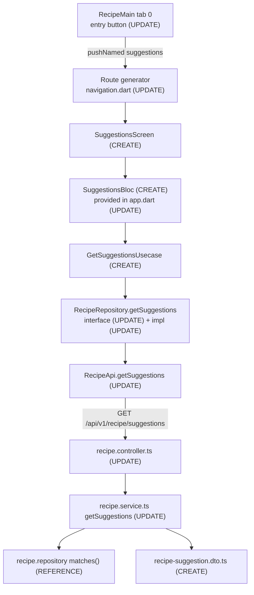

# Technical Specification

# 0. Agent Action Plan

## 0.1 Intent Clarification

### 0.1.1 Core Feature Objective

Based on the prompt, the Blitzy platform understands that the new feature requirement is to add a dedicated **"What Can I Make Tonight?"** smart-suggestions experience to the PantryChef application (a NestJS backend plus a Flutter mobile client) that surfaces recipe recommendations ranked by how well they match the items currently in a user's pantry. Today, users must browse the full recipe list and manually cross-check each recipe against their pantry; there is no single ranked view of what they can cook right now. This feature closes that gap by reusing the existing pantry-aware matching pipeline and presenting its results through a purpose-built screen.

The discrete feature requirements, restated with technical precision, are:

- Return a list of recipes ranked in descending order by pantry match score (a continuous value in the range 0.0–1.0), with fully-matched recipes appearing first.
- Classify each recipe with a **status** of `READY` (match score = 1.0, every ingredient on hand), `ALMOST_THERE` (only 1–2 ingredients missing), or `MISSING` (3 or more ingredients missing).
- Flag each recipe with an independent **isQuickMake** boolean that is `true` when the recipe has 5 or fewer total ingredients.
- For each recipe, compute the list of missing ingredients (names only) by diffing the recipe's ingredient list against the user's pantry contents.
- Expose two client-side filter toggles — **ALMOST THERE** and **QUICK MAKE** — that reuse the existing `RecipeFiltersDto` flags (`isAlmostThere`, `isQuickMake`) [mobile/lib/features/recipe/data/dto/recipe_filters.dto.dart:L6-L13].
- Render an empty state when the pantry contains no items, using the user-supplied copy. **User Example:** "Add items to your pantry to get suggestions."
- Render loading and error states in the mobile UI, including a retry affordance on failure.
- Provide a gap drill-down flow: tapping an `ALMOST_THERE` recipe reveals which 1–2 ingredients are missing.

The three UI callouts described by the user — **Ready Now**, **Almost There**, and **Quick Make** — map onto two distinct backend concepts. This distinction is an explicit interpretation the platform surfaces to prevent conflation:

| UI Callout | Backend Concept | Definition |
|------------|-----------------|------------|
| Ready Now | `status = READY` | match score = 1.0 (all ingredients in pantry) |
| Almost There | `status = ALMOST_THERE` | 1–2 ingredients missing |
| Quick Make | `isQuickMake = true` | ≤ 5 total ingredients (orthogonal to status) |

#### 0.1.1.1 Surfaced Implicit Requirements

The following requirements are not stated verbatim in the prompt but are necessary for a correct, complete implementation and were confirmed during repository inspection:

- **Endpoint path resolution.** The recipe controller is mounted with `@Controller({ path: 'recipe', version: '1' })` [backend/src/recipe/recipe.controller.ts:L31-L34] and the application applies a global `API_PREFIX=api` [backend/env_example:API_PREFIX]. The new route is therefore reachable at `/api/v1/recipe/suggestions`.
- **Derived fields must be recomputed.** The repository's `matches()` method computes `isQuickMake`, `isAlmostThere`, and `missingIngredientsCount` [backend/src/recipe/infrastructure/document/repositories/recipe.repository.ts:L139-L150], but `RecipeMapper.toDomain` maps only `matchScore` and drops the derived booleans [backend/src/recipe/infrastructure/document/mappers/recipe.mapper.ts:L41]. The new service method must therefore recompute `status`, `isQuickMake`, and the missing-ingredient list from the returned `Recipe[]` and the pantry contents.
- **Missing-ingredient names require the populated reference.** `matches()` populates `ingridientList.ingridient` [backend/src/recipe/infrastructure/document/repositories/recipe.repository.ts:L124], so ingredient `id` and `name` are available on each line item [backend/src/ingridient/domain/ingrident.ts:L2-L4].
- **Pagination envelope rename.** The prompt's response shape uses `hasMore`, whereas the existing `infinityPagination` utility emits `hasNextPage` [backend/src/utils/infinity-pagination.ts:L4-L11]. The new response DTO deliberately uses `hasMore`, built directly by the service.
- **Code generation step.** The new mobile DTO uses `@JsonSerializable`, mirroring `recipe_filters.dto.dart` [mobile/lib/features/recipe/data/dto/recipe_filters.dto.dart:L3-L5], which requires running `dart run build_runner build --delete-conflicting-outputs` to emit the `.g.dart` part file.
- **Localization.** All existing user-facing strings are resolved through `AppLocalizations.of(context)!` (for example `recipeEmptyMessage` in `recipe_main.dart` [mobile/lib/features/recipe/presentation/widgets/screens/recipe_main.dart:L52]), so new copy should be added as l10n keys.
- **State persistence.** `RecipeBloc` extends the plain `Bloc` base (not `HydratedBloc`) [mobile/lib/features/recipe/presentation/bloc/recipe/recipe_bloc.dart:L10-L11], so the new suggestions BLoC follows the same non-persisted, refetch-per-session pattern.

#### 0.1.1.2 Feature Dependencies and Prerequisites

The feature depends on three existing capabilities that are reused unchanged:

- The pantry-aware matching pipeline `RecipeRepository.matches()` [backend/src/recipe/infrastructure/document/repositories/recipe.repository.ts:L92-L171], which applies the user's dietary preferences and computes the per-recipe match score.
- `PantryService.findAllByUserId(userId)` [backend/src/pantry/pantry.service.ts:L47-L49], which supplies the user's pantry items.
- `UsersService.findOne({ id })` [backend/src/users/users.service.ts:L62-L64], which supplies the user's preferences. Authentication is a prerequisite; the route inherits the class-level JWT guard [backend/src/recipe/recipe.controller.ts:L27-L29].

### 0.1.2 Special Instructions and Constraints

The prompt imposes a strict **minimal-change discipline** that governs every decision in this plan:

- Make only the changes absolutely necessary to deliver the feature; do not refactor, optimize, or modify existing code unless directly required.
- Isolate new code in dedicated files wherever possible; document any change to an existing file with an explanatory comment.
- Note but do not fix unrelated issues discovered during implementation.

The following **must remain untouched** (explicit directive):

- All pantry CRUD (`/v1/pantry/*`), all recipe CRUD (`/v1/recipe/*` except the new endpoint), the existing `GET /v1/recipe/matches` endpoint and its behavior, authentication and session management (`/v1/auth/*`), and the AI vision endpoint.
- All existing mobile screens (recipe list, pantry, authentication, profile), except for the additive entry-point button on the recipe tab.

The following **contracts are frozen** and must be reused as-is:

- `GET /v1/recipe/matches` request signature and response shape [backend/src/recipe/recipe.controller.ts:L43-L48].
- `CreateRecipeDto`, `UpdateRecipeDto`, and `RecipeFiltersDto` (reused, not modified).
- The `Recipe` domain model and its Mongoose schema.
- The abstract `RecipeRepository` interface — **extend only**, never alter existing members [mobile/lib/features/recipe/domain/repositories/recipe.repository.dart].
- `PantryService.findAllByUserId` and `UsersService.findOne` signatures.

Architectural requirements derived from repository conventions:

- **Reuse the existing matching pipeline** rather than duplicating scoring logic; the new service method calls `matches()` and post-processes its output.
- **Follow the layered backend pattern** (controller → service → repository) and the **clean mobile architecture** (domain use case → data repository → API client).
- **No new NestJS modules and no new MongoDB collections**; **no new dependencies and no new environment variables.**

**Web search requirements:** none. The feature is a pure additive reuse of patterns and dependencies already present in the repository; there are no new libraries or frameworks to research. This rationale is documented in §0.2.3.

### 0.1.3 Technical Interpretation

These feature requirements translate to the following technical implementation strategy:

- To **rank recipes by pantry match**, we will add a `getSuggestions()` method to `recipe.service.ts` that invokes the existing `matches()` pipeline (which already sorts by `matchScore` descending) and post-processes the result, rather than introducing any new scoring logic.
- To **classify each recipe**, we will recompute `status` (`READY`/`ALMOST_THERE`/`MISSING`) and `isQuickMake` in the service from the returned `Recipe[]` and pantry contents, because the domain mapper drops the derived booleans.
- To **list missing ingredients by name**, we will diff each recipe's `ingridientList` against the set of pantry ingredient IDs and project the unmatched line items to `{ id, name }`.
- To **expose the data over HTTP**, we will create a new `recipe-suggestion.dto.ts` response contract and add a JWT-guarded `GET /suggestions` route to `recipe.controller.ts`.
- To **consume the endpoint on mobile**, we will extend the `RecipeRepository` interface, add a `getSuggestions` method to the `RecipeApi` client and its implementation, create a `GetSuggestionsUsecase`, and add a response DTO.
- To **render the experience**, we will create a `SuggestionsScreen`, a `SuggestionsBloc` (with loading/loaded/error/empty handling), and a `SuggestionCard` widget, wiring the BLoC into the global provider and registering a named route.
- To **provide an entry point**, we will add a "What Can I Make Tonight?" button to the recipe tab, keeping the change within the recipe feature boundary.
- To **guarantee correctness**, we will add a backend Jest unit spec and a mobile BLoC test, both using the patterns and tooling already present in the repository.

## 0.2 Repository Scope Discovery

This section catalogs every existing file the feature interacts with, the integration points it attaches to, and the new files it introduces. The repository is a two-root monorepo at `/tmp/blitzy/pantry-chef-traditional/main_0d6e40/` containing `backend/` (NestJS/TypeScript) and `mobile/` (Flutter/Dart); no `.blitzyignore` files exist.

### 0.2.1 Comprehensive File Analysis

#### 0.2.1.1 Backend — Existing Files in the Matching Pipeline (Reuse Target)

The feature reuses the existing pantry-aware matching pipeline end to end. The relevant files and their roles are:

| File | Role | Disposition |
|------|------|-------------|
| `backend/src/recipe/recipe.controller.ts` | REST surface; class guarded by `@UseGuards(AuthGuard('jwt'))` and versioned `path: 'recipe'` [recipe.controller.ts:L27-L34] | UPDATE (add route) |
| `backend/src/recipe/recipe.service.ts` | Orchestrates `matches()` via `userService.findOne` + `pantryService.findAllByUserId` + `recipeRepository.matches` [recipe.service.ts:L67-L76] | UPDATE (add method) |
| `backend/src/recipe/infrastructure/document/repositories/recipe.repository.ts` | The scoring pipeline `matches()` [recipe.repository.ts:L92-L171] | REFERENCE |
| `backend/src/recipe/infrastructure/document/mappers/recipe.mapper.ts` | `toDomain` maps `matchScore` only; drops derived booleans [recipe.mapper.ts:L41] | REFERENCE |
| `backend/src/recipe/types/filter.types.ts` | `FilterType { isQuickMake?, isAlmostThere? }` | REFERENCE |
| `backend/src/recipe/domain/recipe.ts` | `Recipe` domain model (`ingridientList`, `matchScore`, etc.) | REFERENCE |
| `backend/src/ingridient/domain/ingrident.ts` | `Ingridient { id, name, ... }` [ingrident.ts:L2-L4] | REFERENCE |
| `backend/src/pantry/domain/pantryIngridient.ts` | `PantryIngridient { ingridient, userId, ... }` [pantryIngridient.ts:L3-L4] | REFERENCE |
| `backend/src/pantry/pantry.service.ts` | `findAllByUserId(userId)` [pantry.service.ts:L47-L49] | REFERENCE (unchanged) |
| `backend/src/users/users.service.ts` | `findOne(fields)` [users.service.ts:L62-L64] | REFERENCE (unchanged) |
| `backend/src/recipe/dto/create-recipe.dto.ts` | DTO/Swagger convention model [create-recipe.dto.ts:L1-L141] | REFERENCE |

The decisive finding is the pipeline's behavior: `matches()` builds the pantry ID set [recipe.repository.ts:L97], pre-filters by preferences (`$nin` allergies/disliked, `$all` dietary, `$lte` cooking time, `deletedAt: null`) [recipe.repository.ts:L102-L119], populates the ingredient reference [recipe.repository.ts:L124], computes `matchScore = available / total` [recipe.repository.ts:L137], derives `isQuickMake`/`isAlmostThere` [recipe.repository.ts:L139-L142], post-filters by `FilterType` flags [recipe.repository.ts:L152-L166], and **sorts by `matchScore` descending** [recipe.repository.ts:L167] before mapping to domain objects [recipe.repository.ts:L168]. Because the mapper discards the derived booleans [recipe.mapper.ts:L41], the new service recomputes `status`, `isQuickMake`, and the missing list from the domain `Recipe[]` plus the pantry IDs.

#### 0.2.1.2 Mobile — Existing Files and Patterns (Templates for New Code)

| File | Pattern to Mirror | Disposition |
|------|-------------------|-------------|
| `mobile/lib/features/recipe/domain/repositories/recipe.repository.dart` | Abstract `RecipeRepository` (4 `Future` methods) | UPDATE (extend) |
| `mobile/lib/features/recipe/domain/usecases/recipe_matching.usecase.dart` | `UseCaseWithParams` wrapper instantiating `RecipeRepositoryImpl()` [recipe_matching.usecase.dart:L7-L12] | REFERENCE |
| `mobile/lib/features/recipe/domain/usecases/index.dart` | Barrel of use cases [index.dart:L1-L3] | UPDATE (export) |
| `mobile/lib/core/utils/usercase.dart` | `UseCase` / `UseCaseWithParams` contracts [usercase.dart:L1-L7] | REFERENCE |
| `mobile/lib/features/recipe/data/api/recipe.api.dart` | `RecipeApi` Dio wrapper; inline `/matches` path [recipe.api.dart:L22-L25] | UPDATE (add method) |
| `mobile/lib/features/recipe/data/repositories/recipe.repository.dart` | `RecipeRepositoryImpl` mapping JSON via `fromJson` [recipe.repository.dart:L21-L26] | UPDATE (implement) |
| `mobile/lib/features/recipe/data/dto/recipe_filters.dto.dart` | `@JsonSerializable` codegen pattern [recipe_filters.dto.dart:L1-L16] | REFERENCE |
| `mobile/lib/features/recipe/data/dto/index.dart` | DTO barrel | UPDATE (export) |
| `mobile/lib/features/recipe/presentation/bloc/recipe/recipe_bloc.dart` | Plain `Bloc` handler pattern (try/finally) [recipe_bloc.dart:L10-L41] | REFERENCE |
| `mobile/lib/features/recipe/presentation/widgets/recipe_card.dart` | Match-score visualization [recipe_card.dart:L22-L30,L129-L134] | REFERENCE |
| `mobile/lib/features/recipe/presentation/widgets/screens/recipe_main.dart` | Tab-0 list screen; entry-point host [recipe_main.dart:L1-L84] | UPDATE (entry button) |
| `mobile/lib/core/presentation/widgets/app.dart` | Global `MultiBlocProvider` [app.dart:L40-L55] | UPDATE (register BLoC) |
| `mobile/lib/core/navigation.dart` | Route generator switch [navigation.dart:L26-L47] | UPDATE (add case) |
| `mobile/lib/core/constants/navigation.dart` | Named route constants [navigation.dart:L1-L14] | UPDATE (add constant) |
| `mobile/lib/core/utils/service_locator.dart` | GetIt infra singletons only [service_locator.dart:L8-L15] | NO CHANGE |
| `mobile/lib/core/constants/endpoints.dart` | Endpoint base constants [endpoints.dart:L18-L19] | OPTIONAL (inline path used) |

Two corrections to common assumptions were confirmed by inspection: feature BLoCs are provided in `app.dart`'s `MultiBlocProvider` [mobile/lib/core/presentation/widgets/app.dart:L40-L55], **not** in `service_locator.dart` (which registers only `SharedPreferences`, `SharedPreferencesHelper`, and `DioClient` [mobile/lib/core/utils/service_locator.dart:L8-L15]); and use cases self-instantiate `RecipeRepositoryImpl()` rather than resolving it from GetIt [mobile/lib/features/recipe/domain/usecases/recipe_matching.usecase.dart:L10].

### 0.2.2 Integration Point Discovery

- **API endpoint:** new `GET /api/v1/recipe/suggestions` added to the existing recipe controller, inheriting its JWT guard [backend/src/recipe/recipe.controller.ts:L27-L34].
- **Service layer:** new `getSuggestions()` reuses the already-injected `recipeRepository`, `pantryService`, and `userService` collaborators [backend/src/recipe/recipe.service.ts:L67-L76]; no constructor or DI change.
- **Database/models:** none. No new collections, schema changes, or migrations; the feature is read-only over existing data.
- **Mobile HTTP client:** new method on `RecipeApi` reusing the shared `DioClient` and JWT interceptor [mobile/lib/features/recipe/data/api/recipe.api.dart:L11-L13].
- **Mobile DI / state:** new `SuggestionsBloc` registered in the global `MultiBlocProvider` [mobile/lib/core/presentation/widgets/app.dart:L40-L55].
- **Mobile navigation:** new route constant [mobile/lib/core/constants/navigation.dart:L1-L14] and generator case [mobile/lib/core/navigation.dart:L26-L47].
- **Mobile entry point:** new button on the recipe tab (`RecipeMain`, tab 0 of the home shell [mobile/lib/core/presentation/widgets/home.dart:L50-L52]).
- **Barrels:** `usecases/index.dart` and `data/dto/index.dart` gain one export each.



### 0.2.3 Web Search Research Conducted

No web research was warranted for this feature. The implementation is a purely additive reuse of patterns and dependencies already present in the repository: the backend reuses the existing `matches()` pipeline [backend/src/recipe/infrastructure/document/repositories/recipe.repository.ts:L92-L171] and the established DTO/Swagger conventions [backend/src/recipe/dto/create-recipe.dto.ts:L1-L141], while the mobile client reuses the established `@JsonSerializable` DTO, `UseCaseWithParams`, BLoC, and reusable-widget patterns. Every required package is already declared in `backend/package.json` and `mobile/pubspec.yaml`, so there are no new libraries, frameworks, or version-compatibility questions to investigate.

### 0.2.4 New File Requirements

New backend source and test files:

- `backend/src/recipe/dto/recipe-suggestion.dto.ts` — response contract: `MissingIngredientDto`, `RecipeSuggestionDto`, `RecipeSuggestionsResponseDto`.
- `backend/src/recipe/recipe.service.suggestions.spec.ts` — first Jest unit test under `src/`, auto-discovered by the embedded config (`rootDir: src`, `testRegex: '.*\.spec\.ts$'`).

New mobile source and test files (all under `mobile/lib/features/recipe/`):

- `data/dto/recipe_suggestion.dto.dart` (+ generated `recipe_suggestion.dto.g.dart`) — JSON deserialization for the suggestion item and response envelope.
- `domain/usecases/get_suggestions.usecase.dart` — `UseCaseWithParams` wrapper over the repository.
- `presentation/suggestions/suggestions_screen.dart` — the new screen.
- `presentation/suggestions/bloc/suggestions_bloc.dart`, `suggestions_event.dart`, `suggestions_state.dart` — feature BLoC.
- `presentation/suggestions/widgets/suggestion_card.dart` — the suggestion card widget.
- `mobile/test/features/recipe/suggestions_bloc_test.dart` — BLoC unit test using a hand-written fake (no mocking library is present in `pubspec.yaml`).

## 0.3 Dependency Inventory and Integration Analysis

### 0.3.1 Package Dependency Posture

**No dependency changes are required — no packages are added, updated, or removed.** Every capability the feature needs is already declared in the existing manifests. For context, the key packages the feature relies on (all already present, all unchanged) are:

| Registry | Package | Version | Purpose for this feature |
|----------|---------|---------|--------------------------|
| npm | `@nestjs/common` | `^10.0.0` | Controller/route decorators for the new endpoint |
| npm | `@nestjs/swagger` | `^8.0.1` | `@ApiProperty` annotations on the new response DTO |
| npm | `class-validator` / `class-transformer` | `^0.14.1` / `^0.5.1` | DTO conventions (reused) |
| npm | `mongoose` | `^8.8.0` | Existing `matches()` query layer (reused, read-only) |
| npm | `jest` / `ts-jest` / `@nestjs/testing` | `^29.5.0` / `^29.1.0` / `^10.0.0` | New backend unit spec (`@nestjs/testing` installed but previously unused) |
| pub.dev | `flutter_bloc` / `bloc` | `^8.1.6` / `^8.1.4` | New `SuggestionsBloc` |
| pub.dev | `dio` | `^5.7.0` | New `RecipeApi.getSuggestions` call (via shared `DioClient`) |
| pub.dev | `json_annotation` | `^4.9.0` | New `@JsonSerializable` DTO |
| pub.dev | `json_serializable` / `build_runner` | `^6.7.1` / `^2.4.6` | Code generation of the DTO `.g.dart` part |
| pub.dev | `equatable` | `^2.0.5` | BLoC event/state value equality |
| pub.dev | `shimmer` / `cached_network_image` | `^3.0.0` / `^3.4.1` | Loading skeleton and recipe imagery (reused) |

Two non-dependency build artifacts are implied and must be regenerated:

- **DTO code generation:** the new `@JsonSerializable` DTO requires `dart run build_runner build --delete-conflicting-outputs` to emit `recipe_suggestion.dto.g.dart`, exactly as `recipe_filters.dto.dart` does today [mobile/lib/features/recipe/data/dto/recipe_filters.dto.dart:L3].
- **Localization:** new copy added to `mobile/lib/l10n/app_en.arb` requires the Flutter l10n generator to regenerate `app_localizations.dart`.

No new environment variables are needed; the existing `.env` derived from `backend/env_example` is sufficient [backend/env_example:AUTH_JWT_SECRET].

### 0.3.2 Import and External Reference Updates

Import changes are minimal and strictly local — there is no project-wide import sweep. The three existing files that are modified each gain a single new import, and two barrel files gain a single export each:

- `mobile/lib/core/presentation/widgets/app.dart` — import the new `SuggestionsBloc` (for the `MultiBlocProvider` entry).
- `mobile/lib/core/navigation.dart` — import the new `SuggestionsScreen` (for the route case).
- `mobile/lib/features/recipe/presentation/widgets/screens/recipe_main.dart` — import `core/constants/navigation.dart` for the entry-button navigation (the file does not currently import it).
- `mobile/lib/features/recipe/domain/usecases/index.dart` — add `export './get_suggestions.usecase.dart';` [index.dart:L1-L3].
- `mobile/lib/features/recipe/data/dto/index.dart` — add `export './recipe_suggestion.dto.dart';`.

No external reference updates are required: there are no changes to `package.json`, `pubspec.yaml`, configuration files, CI/CD workflows, Docker files, or documentation build inputs.

### 0.3.3 Existing Code Touchpoints

Every touchpoint below is additive and preserves existing signatures.

- `backend/src/recipe/recipe.service.ts` — add `getSuggestions()` reusing the injected `recipeRepository`, `pantryService`, and `userService` [recipe.service.ts:L67-L76]; existing `matches()` untouched.
- `backend/src/recipe/recipe.controller.ts` — add `@Get('suggestions')` after the existing `matches` handler [recipe.controller.ts:L43-L48]; reuses the class-level JWT guard.
- `mobile/lib/features/recipe/domain/repositories/recipe.repository.dart` — add the `getSuggestions(...)` method to the abstract interface (extend only).
- `mobile/lib/features/recipe/data/api/recipe.api.dart` — add `getSuggestions(...)`, mirroring the inline-path style of `recipeMatching` [recipe.api.dart:L22-L25].
- `mobile/lib/features/recipe/data/repositories/recipe.repository.dart` — implement `getSuggestions(...)`, mirroring the `fromJson` mapping of `recipeMatching` [recipe.repository.dart:L21-L26].
- `mobile/lib/core/presentation/widgets/app.dart` — add `BlocProvider(create: (context) => SuggestionsBloc())` to the existing provider list [app.dart:L41-L55].
- `mobile/lib/core/navigation.dart` — add a `case Navigation.suggestions` to the route switch [navigation.dart:L26-L47].
- `mobile/lib/core/constants/navigation.dart` — add `static const String suggestions = '/suggestions';` [navigation.dart:L1-L14].
- `mobile/lib/features/recipe/presentation/widgets/screens/recipe_main.dart` — add the "What Can I Make Tonight?" entry button above the existing list [recipe_main.dart:L29-L82].
- `mobile/lib/l10n/app_en.arb` — add the new UI string keys.

Explicitly **not** modified: `backend/src/recipe/recipe.module.ts`, `mobile/lib/core/utils/service_locator.dart`, `mobile/lib/core/constants/endpoints.dart` (the suggestions path is built inline to match the existing `/matches` precedent), `PantryService`, `UsersService`, `RecipeMapper`, and the `infinityPagination` utility.

## 0.4 Technical Implementation

### 0.4.1 File-by-File Execution Plan

Every file below must be created or modified. Modes are CREATE (new file), UPDATE (additive edit to an existing file), and REFERENCE (read for context, not modified).

#### 0.4.1.1 Group 1 — Backend Core

| Mode | File | Change |
|------|------|--------|
| CREATE | `backend/src/recipe/dto/recipe-suggestion.dto.ts` | `MissingIngredientDto`, `RecipeSuggestionDto`, `RecipeSuggestionsResponseDto` with `@ApiProperty` |
| UPDATE | `backend/src/recipe/recipe.service.ts` | Add `getSuggestions(userId, filters, page?, limit?)` |
| UPDATE | `backend/src/recipe/recipe.controller.ts` | Add JWT-guarded `@Get('suggestions')` |
| CREATE | `backend/src/recipe/recipe.service.suggestions.spec.ts` | Jest unit spec for `getSuggestions()` |

#### 0.4.1.2 Group 2 — Mobile Data and Domain

| Mode | File | Change |
|------|------|--------|
| CREATE | `mobile/lib/features/recipe/data/dto/recipe_suggestion.dto.dart` | `@JsonSerializable` item + response DTOs (+ generated `.g.dart`) |
| UPDATE | `mobile/lib/features/recipe/data/dto/index.dart` | Export the new DTO |
| UPDATE | `mobile/lib/features/recipe/domain/repositories/recipe.repository.dart` | Add `getSuggestions(...)` to the interface |
| UPDATE | `mobile/lib/features/recipe/data/api/recipe.api.dart` | Add `getSuggestions(...)` Dio call |
| UPDATE | `mobile/lib/features/recipe/data/repositories/recipe.repository.dart` | Implement `getSuggestions(...)` |
| CREATE | `mobile/lib/features/recipe/domain/usecases/get_suggestions.usecase.dart` | `GetSuggestionsUsecase` |
| UPDATE | `mobile/lib/features/recipe/domain/usecases/index.dart` | Export the new use case |

#### 0.4.1.3 Group 3 — Mobile Presentation and Wiring

| Mode | File | Change |
|------|------|--------|
| CREATE | `mobile/lib/features/recipe/presentation/suggestions/suggestions_screen.dart` | New screen with loading/empty/error/loaded states |
| CREATE | `mobile/lib/features/recipe/presentation/suggestions/bloc/suggestions_bloc.dart` (+ `suggestions_event.dart`, `suggestions_state.dart`) | Feature BLoC |
| CREATE | `mobile/lib/features/recipe/presentation/suggestions/widgets/suggestion_card.dart` | Suggestion card widget |
| UPDATE | `mobile/lib/core/presentation/widgets/app.dart` | Register `SuggestionsBloc` |
| UPDATE | `mobile/lib/core/navigation.dart` | Add route generator case |
| UPDATE | `mobile/lib/core/constants/navigation.dart` | Add `suggestions` route constant |
| UPDATE | `mobile/lib/features/recipe/presentation/widgets/screens/recipe_main.dart` | Add entry-point button |
| UPDATE | `mobile/lib/l10n/app_en.arb` | Add UI string keys |

#### 0.4.1.4 Group 4 — Tests

| Mode | File | Change |
|------|------|--------|
| CREATE | `mobile/test/features/recipe/suggestions_bloc_test.dart` | BLoC test with hand-written fake use case |

### 0.4.2 Implementation Approach per File

#### 0.4.2.1 Backend

- **`recipe-suggestion.dto.ts` (CREATE).** Define `MissingIngredientDto { id: string; name: string }`, `RecipeSuggestionDto { recipe: Recipe; matchScore: number; status: 'READY' | 'ALMOST_THERE' | 'MISSING'; isQuickMake: boolean; missingIngredients: MissingIngredientDto[] }`, and `RecipeSuggestionsResponseDto { data: RecipeSuggestionDto[]; hasMore: boolean }`. Annotate each field with `@ApiProperty` (the `matchScore` field uses `{ minimum: 0, maximum: 1 }`), following the existing DTO convention [backend/src/recipe/dto/create-recipe.dto.ts:L131-L140]. Import `Recipe` from `../domain/recipe`.

- **`recipe.service.ts` (UPDATE).** Add `getSuggestions()` that mirrors `matches()`'s collaborator usage [backend/src/recipe/recipe.service.ts:L67-L76]: load the user, fetch the pantry, and call `recipeRepository.matches(preferences, pantry, filters)`. Build the pantry ID set and post-process each returned recipe:

```typescript
const pantryIds = new Set(pantry.map((pi) => pi.ingridient.id));
const missing = recipe.ingridientList.filter((il) => !pantryIds.has(il.ingridient.id));
const status = recipe.matchScore === 1 ? 'READY' : missing.length <= 2 ? 'ALMOST_THERE' : 'MISSING';
```

  Derive `isQuickMake = recipe.ingridientList.length <= 5`, guard zero-ingredient recipes to `READY`, and paginate the already-sorted list in memory (slice by `page`/`limit`, default `limit` capped at 50 to match `findAll` [backend/src/recipe/recipe.controller.ts:L57-L60]). Set `hasMore = page * limit < total`. The existing `matches()` method is not modified.

- **`recipe.controller.ts` (UPDATE).** Add `@Get('suggestions')` returning `Promise<RecipeSuggestionsResponseDto>`, reading the user id from `req.user?.id` and accepting `@Query() filters: RecipeFiltersDto` plus optional `page`/`limit`, mirroring the existing `matches` handler [backend/src/recipe/recipe.controller.ts:L43-L48]. The route inherits the class-level JWT guard; add `@ApiOkResponse` for Swagger.

- **`recipe.service.suggestions.spec.ts` (CREATE).** Use `Test.createTestingModule` with mock providers for `RecipeRepository`, `PantryService`, and `UsersService`. Cover: descending sort preserved; all-in-pantry → `READY` with empty missing list; 1–2 missing → `ALMOST_THERE` with correct names; 3+ missing → `MISSING`; `isQuickMake` when `ingridientList.length <= 5`; empty pantry → recipes still returned at score 0; preferences forwarded to `matches()`.

#### 0.4.2.2 Mobile

- **`recipe_suggestion.dto.dart` (CREATE).** Define `@JsonSerializable` classes mirroring the backend response, with a `part 'recipe_suggestion.dto.g.dart';` directive and `fromJson`/`toJson` delegating to the generated functions, exactly as `recipe_filters.dto.dart` does [mobile/lib/features/recipe/data/dto/recipe_filters.dto.dart:L1-L16]. Run `build_runner` to generate the part file.

- **`recipe.repository.dart` interface (UPDATE).** Add `Future<RecipeSuggestionsResponseDto> getSuggestions(RecipeFiltersDto filters, {int page, int limit});` to the abstract `RecipeRepository`.

- **`recipe.api.dart` (UPDATE).** Add a method building the path inline, mirroring `recipeMatching` [mobile/lib/features/recipe/data/api/recipe.api.dart:L22-L25]:

```dart
final response = await _dio.get('${Endpoints.recipe}/suggestions',
    queryParameters: {...filters.toJson(), 'page': page, 'limit': limit});
return response.data; // {data, hasMore}
```

- **`recipe.repository.dart` impl (UPDATE).** Implement `getSuggestions` by calling the API and deserializing the envelope via `RecipeSuggestionsResponseDto.fromJson(response)`, mirroring the existing `fromJson` mapping [mobile/lib/features/recipe/data/repositories/recipe.repository.dart:L21-L26].

- **`get_suggestions.usecase.dart` (CREATE).** Implement `UseCaseWithParams<RecipeSuggestionsResponseDto, RecipeFiltersDto>` [mobile/lib/core/utils/usercase.dart:L5-L7], instantiating `RecipeRepositoryImpl()` and delegating, exactly as `recipe_matching.usecase.dart` does [mobile/lib/features/recipe/domain/usecases/recipe_matching.usecase.dart:L7-L12].

- **`suggestions_bloc.dart` + parts (CREATE).** Extend the plain `Bloc` base (not `HydratedBloc`), mirroring `RecipeBloc` [mobile/lib/features/recipe/presentation/bloc/recipe/recipe_bloc.dart:L10-L11]. The fetch handler follows the `emit(isFetching: true) → await use case → emit(items) → finally emit(isFetching: false)` shape [recipe_bloc.dart:L23-L32], but **adds a `catch` clause** that emits an error message, because the existing handler has no error path [recipe_bloc.dart:L26-L31] and the prompt explicitly requires an error state. The constructor accepts an optional `GetSuggestionsUsecase` (defaulting to `GetSuggestionsUsecase()`) so the unit test can inject a fake. The state extends `Equatable` with `items`, `isFetching`, `error`, `hasMore`, and the active `filters`, with a `copyWith` and full `props`.

- **`suggestion_card.dart` (CREATE).** Mirror `RecipeCard` [mobile/lib/features/recipe/presentation/widgets/recipe_card.dart:L1-L162]: an `ImageWidget` thumbnail, a `semiBold18` title, and the match-score `LinearProgressIndicator` reusing the exact color thresholds (`>= 0.7` light green, `0.3–0.7` light orange, else bright red) [recipe_card.dart:L22-L30,L129-L134]. Add a color-coded status chip, a "QUICK MAKE" badge when `isQuickMake` is true, and a `Wrap` of missing-ingredient name chips.

- **`suggestions_screen.dart` (CREATE).** A `StatefulWidget` whose `initState` dispatches the fetch event when items are null, mirroring `RecipeMain` [mobile/lib/features/recipe/presentation/widgets/screens/recipe_main.dart:L20-L26]. Render `PlatformScaffold` with `getAppBarWidget`, and within a `BlocBuilder<SuggestionsBloc>` switch between `ShimmerList(cardHeight: 200)` (loading) [recipe_main.dart:L37], an error column with a retry `ActionButton`, an empty state, and the loaded list of `SuggestionCard` widgets behind `RefreshIndicator.adaptive`.

- **Wiring files (UPDATE).** Add the route constant, the generator case building `const SuggestionsScreen()`, the `BlocProvider` entry, and the `RecipeMain` entry button as described in §0.3.3.

- **`suggestions_bloc_test.dart` (CREATE).** Use `flutter_test` only with a hand-written `_FakeGetSuggestionsUsecase` injected through the BLoC constructor — no mocking package exists in `pubspec.yaml`. Cover: emits fetching then loaded with items; empty result; thrown error sets the error field. Comply with the analyzer's elevated lints (trailing commas, package imports, no `print`).

### 0.4.3 User Interface Design

The feature adds one screen, one card, and one entry button, all composed from the in-repo design system (detailed in §0.5).

- **Entry point.** A full-width "What Can I Make Tonight?" `ActionButton` is placed at the top of the recipe tab (`RecipeMain`), above the existing recipe list, and navigates to the suggestions route. This keeps the change inside the recipe feature boundary [mobile/lib/features/recipe/presentation/widgets/screens/recipe_main.dart:L29-L82].

- **SuggestionsScreen states.**
  - *Loading:* `ShimmerList(cardHeight: 200)` skeleton, matching the recipe list's loading treatment [recipe_main.dart:L37].
  - *Empty:* the declared-but-unused `assets/images/empty_pantry.webp` illustration with the user's copy — "Add items to your pantry to get suggestions."
  - *Error:* a message styled with the error token plus a retry `ActionButton` that re-dispatches the fetch (a new pattern, since the recipe list surfaces no errors).
  - *Loaded:* a row of filter chips (**ALMOST THERE**, **QUICK MAKE**) above a pull-to-refresh `ListView` of `SuggestionCard` widgets, ordered `READY` first.

- **SuggestionCard.** Recipe image, title, match-score progress bar (reusing the recipe card's threshold colors), a color-coded status chip (`READY`/`ALMOST_THERE`/`MISSING`), a "QUICK MAKE" badge when applicable, and chips listing the missing-ingredient names for the gap drill-down.

- **Filter behavior.** Toggling a chip updates the active `RecipeFiltersDto` and re-dispatches the fetch, reusing the backend's existing `FilterType` post-filter [backend/src/recipe/types/filter.types.ts] rather than filtering client-side.

## 0.5 Design System Compliance

The mobile client uses a proprietary, in-repo design system rather than a third-party component library. All new UI must resolve every value to a system token and prefer existing reusable widgets over raw Flutter primitives.

### 0.5.1 System Identification

- **Library:** PantryChef proprietary design system (in-repo). **Status:** installed (no dependency to add).
- **Tokens:** colors exposed via a `ThemeExtension` at `mobile/lib/core/styles/app_palette.dart` and typography at `mobile/lib/core/styles/app_typography.dart`, both accessed through `context.theme.appColors.<token>` and `context.theme.appTextTheme.<token>` [mobile/lib/features/recipe/presentation/widgets/recipe_card.dart:L24,L61].
- **Layout constants:** `mobile/lib/core/constants/common.dart` (`pagePadding = 16.0`).
- **Adaptive primitives:** `flutter_platform_widgets` `^7.0.1` (e.g., `PlatformScaffold`) plus Flutter Material; no third-party UI kit.
- **Source inspected:** the design-system files above and the reusable widget library under `mobile/lib/core/presentation/widgets/`.

### 0.5.2 Component Mapping

| UI Element | System Component | Import / Path | Notes |
|------------|------------------|---------------|-------|
| Page scaffold | `PlatformScaffold` | `flutter_platform_widgets` | Adaptive shell, as used by `RecipeMain` |
| App bar | `getAppBarWidget` | `core/presentation/widgets` | `semiBold18` title, `darkBeige` background |
| Entry & retry buttons | `ActionButton` | `core/presentation/widgets/action_button.dart` | Themed, full-width |
| Loading skeleton | `ShimmerList` | `core/presentation/widgets/shimmer_list.dart` | `cardHeight: 200`, matches recipe list |
| Recipe image | `ImageWidget` | `core/presentation/widgets/image_widget.dart` | `CachedNetworkImage` + fallback |
| Match-score bar | `LinearProgressIndicator` (Material) | Flutter | Colors via `_getProgressBarColor` thresholds [recipe_card.dart:L22-L30] |
| Suggestion card | New `SuggestionCard` (modeled on `RecipeCard`) | feature widget | Reuses card structure [recipe_card.dart:L34-L160] |
| Status chip | — | — | GAP: no chip component; compose `Chip`/`Container` with tokens |
| Missing-ingredient chips | — | — | GAP: compose `Wrap` of `Chip` with tokens |
| Filter toggle chips | — | — | GAP: compose Material `FilterChip` with tokens |
| Empty-state illustration | `Image.asset` | `assets/images/empty_pantry.webp` | Declared-but-unused asset, repurposed |

### 0.5.3 Token Mapping

No Figma assets were provided, so this table resolves the feature's semantic requirements to existing system tokens.

| Category | Semantic Need | System Token | Resolution |
|----------|---------------|--------------|------------|
| Color | High match / READY | `appColors.lightGreen` (`#E4F0D0`), `appColors.green` (`#76B50E`) | Exact match (reuses recipe card logic) |
| Color | Medium match / ALMOST_THERE | `appColors.lightOrange` (`#FCF6E9`) | Exact match |
| Color | Low match / MISSING | `appColors.brightRed` (`#FF5E4D`) | Exact match |
| Color | Error text | `appColors.red` (`#ED3C3C`) | Exact match |
| Color | Scaffold background | `appColors.beige` | Exact match |
| Color | App-bar / chip surface | `appColors.darkBeige`, `appColors.grey` | Exact match |
| Typography | Card title | `appTextTheme.semiBold18` | Exact match |
| Typography | Labels / chips | `appTextTheme.semiBold14`, `semiBold12` | Exact match |
| Typography | Body text | `appTextTheme.regular14` | Exact match |
| Spacing | Page padding / list gaps | `pagePadding` (16.0), 12 px item gap | Exact match |

### 0.5.4 Gaps Inventory

- **Status chip** — no pre-built badge/chip component exists in the reusable library. *Resolution:* compose a Material `Chip` (or styled `Container`) using `appColors` for the fill and `appTextTheme` for the label; no hardcoded values.
- **Missing-ingredient chips** — same gap. *Resolution:* a `Wrap` of token-styled `Chip` widgets.
- **Filter toggle chips** — no system toggle component. *Resolution:* Material `FilterChip` styled with `appColors`, selected state using `appColors.green`.

All three gaps are resolved at graceful-degradation level 3 (generic system-styled container), require no new dependency, and introduce no hardcoded color, spacing, or typography values.

### 0.5.5 Compliance Summary

The existing reusable widgets and tokens cover the large majority of the feature's UI: the scaffold, app bar, buttons, loading skeleton, imagery, and — critically — the match-score visualization, which the new `SuggestionCard` reproduces using `RecipeCard`'s exact threshold colors [mobile/lib/features/recipe/presentation/widgets/recipe_card.dart:L22-L30]. Only three small elements (status chip, missing-ingredient chips, filter toggle chips) lack a pre-built component; each is composed from Material primitives styled exclusively with system tokens. No design-system dependency needs to be added, and no token gaps remain unresolved.

## 0.6 Scope Boundaries

### 0.6.1 Exhaustively In Scope

Backend:

- `backend/src/recipe/dto/recipe-suggestion.dto.ts` — CREATE (response contract).
- `backend/src/recipe/recipe.service.ts` — UPDATE (`getSuggestions()` only).
- `backend/src/recipe/recipe.controller.ts` — UPDATE (`GET 'suggestions'` route only).
- `backend/src/recipe/recipe.service.suggestions.spec.ts` — CREATE (unit spec).

Mobile source (feature):

- `mobile/lib/features/recipe/data/dto/recipe_suggestion.dto.dart` and its generated `recipe_suggestion.dto.g.dart` — CREATE.
- `mobile/lib/features/recipe/data/dto/index.dart` — UPDATE (barrel export).
- `mobile/lib/features/recipe/domain/repositories/recipe.repository.dart` — UPDATE (extend interface).
- `mobile/lib/features/recipe/data/api/recipe.api.dart` — UPDATE (add method).
- `mobile/lib/features/recipe/data/repositories/recipe.repository.dart` — UPDATE (implement method).
- `mobile/lib/features/recipe/domain/usecases/get_suggestions.usecase.dart` — CREATE.
- `mobile/lib/features/recipe/domain/usecases/index.dart` — UPDATE (barrel export).
- `mobile/lib/features/recipe/presentation/suggestions/**/*.dart` — CREATE (screen, `bloc/*`, `widgets/suggestion_card.dart`).
- `mobile/lib/features/recipe/presentation/widgets/screens/recipe_main.dart` — UPDATE (entry-point button).

Mobile core wiring, localization, and tests:

- `mobile/lib/core/constants/navigation.dart` — UPDATE (route constant).
- `mobile/lib/core/navigation.dart` — UPDATE (route generator case).
- `mobile/lib/core/presentation/widgets/app.dart` — UPDATE (register `SuggestionsBloc`).
- `mobile/lib/l10n/app_en.arb` — UPDATE (UI string keys; regenerated `app_localizations*.dart` follows).
- `mobile/test/features/recipe/suggestions_bloc_test.dart` — CREATE.

Conditional / optional:

- `mobile/lib/core/constants/endpoints.dart` — OPTIONAL only; not required because the suggestions path is built inline to match the existing `/matches` precedent [mobile/lib/features/recipe/data/api/recipe.api.dart:L23].

### 0.6.2 Explicitly Out of Scope

Frozen contracts (reused as-is, never modified):

- `GET /v1/recipe/matches` request signature and response [backend/src/recipe/recipe.controller.ts:L43-L48].
- `CreateRecipeDto`, `UpdateRecipeDto`, `RecipeFiltersDto`; the `Recipe` domain model and Mongoose schema.
- The existing members of the abstract `RecipeRepository` and the `matches()` implementation pipeline [backend/src/recipe/infrastructure/document/repositories/recipe.repository.ts:L92-L171].
- `RecipeMapper`, the `infinityPagination` utility, `PantryService.findAllByUserId` [backend/src/pantry/pantry.service.ts:L47-L49], and `UsersService.findOne` [backend/src/users/users.service.ts:L62-L64].

Untouched modules, features, and files:

- Backend `auth`, `pantry`, `ingredient`, `users`, and `ai` modules; `backend/src/recipe/recipe.module.ts`.
- Mobile `authentication`, `pantry`, `ingredient`, and `profile` features; `mobile/lib/core/utils/service_locator.dart`.
- All existing mobile screens except the additive entry button on `RecipeMain`.

Functional exclusions (per the prompt):

- Unit normalization and quantity-sufficiency checks; ingredient aliasing or fuzzy name matching.
- Shopping-list creation or export; expiration-date-aware ranking.
- Multi-user or cloud synchronization; nutrition information or dietary scoring beyond the existing preference filter.

Architecture constraints:

- No new NestJS modules, no new MongoDB collections, no new environment variables, and no new dependencies.

## 0.7 Rules for Feature Addition

No separate user-specified implementation rules were provided for this project (the rules set is empty). The governing rules below are the conventions and constraints the user emphasized within the prompt, augmented by repository conventions confirmed during inspection. They are binding on the implementation.

- **Minimal-change discipline.** Make only the changes strictly necessary for the feature. Do not refactor, reformat, or optimize existing code. Isolate new logic in dedicated files, and annotate every edit to an existing file with an explanatory comment.

- **Reuse the matching pipeline; do not duplicate scoring.** The new `getSuggestions()` must call the existing `matches()` pipeline [backend/src/recipe/infrastructure/document/repositories/recipe.repository.ts:L92-L171] and post-process its output. No new query, scoring, or sorting logic may be introduced.

- **Extend, never alter, the repository interfaces.** The abstract `RecipeRepository` (backend and mobile) may gain new members only; existing signatures are frozen, as are `PantryService.findAllByUserId` and `UsersService.findOne`.

- **Preserve existing spelling conventions verbatim.** The backend deliberately uses `ingridient` / `ingridientList` / `PantryIngridient` (sic); the mobile codebase uses the correct `ingredient` spelling and the route key `singup` (sic). New code must match the spelling of whatever layer it touches and must not "fix" these names.

- **Follow the established architectural layering.** Backend changes flow controller → service → repository; mobile changes flow screen → BLoC → use case → repository → API client. The new BLoC extends the plain `Bloc` base (non-persisted), mirroring `RecipeBloc` [mobile/lib/features/recipe/presentation/bloc/recipe/recipe_bloc.dart:L10-L11].

- **Add an explicit error path.** Because the existing recipe handler has no error branch [recipe_bloc.dart:L26-L31] but the prompt requires an error state, the suggestions BLoC adds a `catch` clause and an error field — an additive enhancement, not a change to existing behavior.

- **Honor the security and pagination conventions.** The new route inherits the class-level JWT guard [backend/src/recipe/recipe.controller.ts:L27-L34], and pagination caps `limit` at 50 to match `findAll` [backend/src/recipe/recipe.controller.ts:L57-L60].

- **Comply with the mobile analyzer gates.** New Dart code must satisfy the lints elevated to errors in `analysis_options.yaml` (`require_trailing_commas`, `always_use_package_imports`, `avoid_dynamic_calls`, `avoid_print`, `cancel_subscriptions`).

- **Use repository-native tooling for tests.** The backend spec uses Jest with `@nestjs/testing` (already installed); the mobile test uses `flutter_test` with a hand-written fake, because no mocking package is declared in `pubspec.yaml`. No new test dependency may be added.

- **Localize user-facing copy.** New strings are added as keys in `mobile/lib/l10n/app_en.arb` and consumed via `AppLocalizations`, consistent with existing screens [mobile/lib/features/recipe/presentation/widgets/screens/recipe_main.dart:L52].

- **No new infrastructure.** No new NestJS modules, MongoDB collections, environment variables, or runtime dependencies.

## 0.8 Attachments

No attachments were provided for this project. The `review_attachments` check returned no files, so there are no PDFs, images, or other documents to summarize, and there are no Figma frames or URLs to enumerate. All requirements were derived from the prompt text and validated against the existing repository; the visual design therefore conforms to the in-repo design system catalogued in §0.5 rather than to any external mockup.

