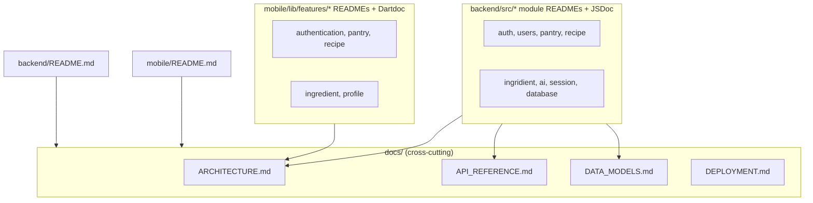

# Technical Specification

# 0. Agent Action Plan

## 0.1 Intent Clarification

#### Core Documentation Objective

Based on the provided requirements, the Blitzy platform understands that the documentation objective is to produce comprehensive, **additive-only** documentation for the **PantryChef** monorepo — a NestJS 10 + Express REST backend [backend/package.json:dependencies], a Flutter / Dart 3.5 BLoC mobile client [mobile/pubspec.yaml:environment], and a MongoDB persistence layer accessed through Mongoose 8 [backend/package.json:dependencies] — **without altering any production logic, interface, or runtime behavior**.

The work resolves into three deliverable categories:

- Author module-level and project-level Markdown documentation (READMEs and a new `docs/` knowledge base).
- Add inline API documentation comments — JSDoc / TSDoc on the backend, Dartdoc on the mobile client — across all in-scope production source.
- Honor strict system boundaries and a minimal-change clause: the only permitted edits are (a) adding `/** */`, `//`, or `///` comment blocks to existing source files, and (b) creating new `README.md` and `docs/*.md` files.

**Request categorization (multi-mode):**

- **CREATE** new documentation — 13 module/feature READMEs + 4 `docs/*.md` files = 17 net-new files.
- **UPDATE** existing documentation — replace the two root READMEs (`backend/README.md`, `mobile/README.md`).
- **IMPROVE** documentation coverage — add inline JSDoc/Dartdoc to ~96 backend `.ts` and ~117 mobile `.dart` in-scope files.
- **FIX** documentation gaps — every backend module and mobile feature currently has zero README, the backend root README is a minimal 4-step stub [backend/README.md], and the mobile root README is a default Flutter starter [mobile/README.md].

**Documentation types identified:** README files (module + root), Architecture documentation, Data-model reference, API reference, Deployment guide, and inline API documentation (JSDoc/Dartdoc).

The table below restates each high-level requirement with enhanced technical clarity:

| # | Stated Requirement | Clarified Technical Objective |
|---|--------------------|-------------------------------|
| R1 | Module READMEs (backend) | Create eight READMEs under `backend/src/{auth,users,pantry,recipe,ingridient,ai,session,database}/`, each following the fixed 10-section skeleton |
| R2 | Feature READMEs (mobile) | Create five READMEs under `mobile/lib/features/{authentication,pantry,recipe,ingredient,profile}/`, each following the fixed 10-section skeleton |
| R3 | Top-level documentation | Replace `backend/README.md` and `mobile/README.md`; create `docs/ARCHITECTURE.md`, `docs/DATA_MODELS.md`, `docs/API_REFERENCE.md`, `docs/DEPLOYMENT.md` |
| R4 | Inline comments (backend) | Add JSDoc/TSDoc to all `.ts` in the in-scope backend modules plus `main.ts` and `app.module.ts` |
| R5 | Inline comments (mobile) | Add Dartdoc to all `.dart` in the in-scope mobile features plus `core/utils/`, `core/constants/`, `main.dart`, `env_config.dart` |
| R6 | Capture known issues verbatim | Document (never fix) the hard-delete `softDelete`, exact-ID recipe matching, empty `PreferencesScreen`, `copyWith` `inFavorite` no-op, and the Dio log-interceptor token exposure |
| R7 | Preserve misspelled identifiers | Treat `Ingridient`, `ingrident.ts`, `patry_main.dart`, `InstractionItem`, `singup`, `profile.repositiry.dart`, and `search_ingredietn.usecase.dart` as stable identifiers — document, never rename |

#### Special Instructions and Constraints

The prompt carries several explicit directives that govern every downstream documentation action:

- **Minimal-change / additive-only clause:** no production logic, interface, or behavior may change. Documentation is delivered exclusively through new Markdown files and additive comment blocks.
- **Preserve documented known issues verbatim:** quirks are captured as `KNOWN ISSUE:` / `SECURITY NOTE:` callouts and annotations, **not** corrected.
- **Preserve misspelled identifiers exactly:** the backend uses the misspelled directory `ingridient/` while the mobile client uses the correctly spelled `ingredient/` — both are honored as-is [backend/src/ingridient/, mobile/lib/features/ingredient/].
- **Table of Contents discipline:** the four long-form `docs/*.md` files include a ToC; module/feature READMEs do not.
- **Per-claim citation requirement:** every technical statement in the generated documentation must cite its source file and line/locator (`Source: <path>:<line>`).
- **Mermaid by default:** workflows and relationships are expressed as fenced `mermaid` diagrams (rendered natively by GitHub/IDEs; no build step exists in the repository).

The prompt prescribes the exact section order for every module/feature README and the exact inline-comment conventions. These are preserved here verbatim:

USER PROVIDED TEMPLATE (module / feature README section order):

<pre>
Purpose -> Key components -> Architecture fit -> Data models -> API endpoints / public interface -> Configuration -> Data flow -> Design patterns used -> Known limitations / gaps -> Local development
</pre>

USER PROVIDED TEMPLATE (inline comment conventions):

<pre>
TypeScript (backend): JSDoc/TSDoc.
  - /** */ blocks for classes (@Controller / @Injectable / @Schema / abstract repositories) and public methods (@param / @returns / @throws).
  - // for private members and method bodies.
  - one-line // per DTO/model field.
  - max 100 characters per line.
  - prefixes: // TODO: and // KNOWN ISSUE:

Dart (mobile): Dartdoc.
  - /// for classes (BLoC / repository / use case / screen / service locator) and public methods with [paramName] references.
  - /// one-liner per BLoC event/state and per model field.
  - // for method bodies.
  - max 80 characters per line.
  - prefixes: // TODO: and // KNOWN ISSUE:
</pre>

**Style preferences:** present-tense, neutral, factual tone for reference material (API/data models); explanatory orientation tone for architecture and module READMEs; progressive disclosure (overview before detail); consistent terminology aligned with the codebase's own naming.

**Web search requirements:** the prompt directs validation of documentation best practices. Research was conducted on the Diátaxis documentation framework (see Section 0.2) to ground the reference-vs-explanation-vs-how-to content strategy; tool versions are pinned directly from the dependency manifests, so no version look-ups were required.

No user-supplied free-form examples beyond the two templates above were provided in the prompt; the prompt's own structural specifications are the authoritative templates and are reproduced exactly.

#### Technical Interpretation

These documentation requirements translate to the following technical documentation strategy:

- To document the **backend modules**, we will create a README per module under `backend/src/<module>/` populated from each module's `*.controller.ts`, `*.service.ts`, `*.module.ts`, `dto/`, and `infrastructure/document/` sources.
- To document the **mobile features**, we will create a README per feature under `mobile/lib/features/<feature>/` populated from each feature's `domain/`, `data/`, and `presentation/` layers.
- To document the **system architecture**, we will create `docs/ARCHITECTURE.md` from `backend/src/main.ts`, `backend/src/app.module.ts`, `mobile/lib/main.dart`, and `mobile/lib/core/utils/service_locator.dart`.
- To document the **REST API**, we will create `docs/API_REFERENCE.md` from the controllers and DTOs, cross-checked against the live Swagger surface.
- To document the **persistence model**, we will create `docs/DATA_MODELS.md` from the Mongoose `*.schema.ts` entities and the Dart `@JsonSerializable` models.
- To document **deployment**, we will create `docs/DEPLOYMENT.md` from `backend/docker-compose.yml`, `backend/Dockerfile`, and `backend/env_example`.
- To **replace the root READMEs**, we will update `backend/README.md` and `mobile/README.md` with full project overviews that link into `docs/`.
- To **improve inline coverage**, we will extend each in-scope source file with JSDoc/Dartdoc per the conventions above, preserving all existing comments (including the Russian-language comment at `backend/src/recipe/infrastructure/document/repositories/recipe.repository.ts:L129`).

#### Inferred Documentation Needs

Beyond the explicit list, repository analysis surfaces the following implicit documentation needs:

- **Based on structure:** the `docs/` folder does not exist at the repository root and must be created before the four standalone documents can be added.
- **Based on code analysis:** several documented behaviors diverge from their names and require explicit `KNOWN ISSUE`/`SECURITY NOTE` annotations — the hard-delete `softDelete` in three repositories [backend/src/pantry/infrastructure/document/repositories/pantryIngridient.repository.ts:L120, backend/src/users/infrastructure/document/repositories/user.repository.ts:L81, backend/src/session/infrastructure/document/repositories/session.repository.ts:L54], exact `_id` recipe matching with no unit normalization [backend/src/recipe/infrastructure/document/repositories/recipe.repository.ts:L137], the `copyWith` `inFavorite` no-op [mobile/lib/features/recipe/domain/models/recipe.dart:L37-L38], and the empty `PreferencesScreen` [mobile/lib/features/profile/presentation/widgets/screens/preferences.dart:L10-L16].
- **Based on dependencies:** the Google Cloud Vision integration requires a service-account key at `backend/src/config/ai.json`, so deployment documentation must include the Vision key-provisioning workflow [backend/README.md].
- **Based on security posture:** the Dio client attaches a verbose `LogInterceptor` unconditionally (logging `Authorization` bearer tokens in all builds) [mobile/lib/core/utils/dio_client.dart:L27-L34,L61-L68], and several default credentials ship in `env_example` (`admin`/`123456`, `AUTH_JWT_SECRET=secret`) [backend/env_example] — both warrant prominent SECURITY callouts.
- **Based on the user journey:** the deployment guide needs a clean-machine quick start (Docker Compose two-service stack, seed command, mobile `--dart-define API_BASE_URL` override) so a new contributor can reach a running system [backend/docker-compose.yml, mobile/lib/env_config.dart:L2].
- **Based on cross-referencing:** internal Markdown links between READMEs and `docs/*.md` must resolve, and the Swagger UI path must be documented at its actual location `/docs` with a note on the prompt's `/api/docs` divergence [backend/src/main.ts:L14-L15,L31].

## 0.2 Documentation Discovery and Analysis

#### Existing Documentation Infrastructure Assessment

Repository analysis reveals a **two-package monorepo** (`backend/` + `mobile/`) with **minimal existing documentation and no documentation-site tooling**. The findings below were derived from direct inspection of the working tree.

| Aspect | Finding | Evidence |
|--------|---------|----------|
| Root layout | Only `backend/` and `mobile/` exist at the repository root; no `docs/` folder | repository root listing |
| Backend root README | Minimal stub — four fenced setup steps plus a Google Cloud Vision key note | [backend/README.md] |
| Mobile root README | Default Flutter starter ("A new Flutter project") with a stray `# blitzy-project` line | [mobile/README.md] |
| Module/feature READMEs | None exist — 0/13 coverage | backend/src tree, mobile/lib/features tree |
| Documentation generator | None — no `mkdocs.yml`, `docusaurus.config.js`, or `sphinx conf.py` | repository search |
| API documentation tool | `@nestjs/swagger` ^8.0.1 — live OpenAPI UI with `@ApiTags`/`@ApiOperation`/`@ApiProperty` already on controllers and DTOs | [backend/package.json:dependencies] |
| Swagger UI path | Served at `/docs` (the global API prefix does not apply to the Swagger route) | [backend/src/main.ts:L14-L15,L31] |
| Diagram tooling | None installed; Mermaid will be authored as fenced mermaid code blocks rendered by GitHub/IDEs | repository search |
| Doc hosting/deploy | None configured (no `.readthedocs.yml`, no docs CI) | repository search |
| Lint constraints (mobile) | `analysis_options.yaml` excludes `**/*.g.dart` and elevates `always_use_package_imports`, `require_trailing_commas`, `avoid_print` to errors | [mobile/analysis_options.yaml] |

**Current documentation framework:** none (plain Markdown only). **API documentation tool in use:** `@nestjs/swagger` 8.0.1. The implication is decisive — because the repository ships no documentation generator, all deliverables are **plain Markdown with embedded Mermaid and inline JSDoc/Dartdoc**, and **no new documentation dependency is required**.

#### Repository Code Analysis for Documentation

The following directories were examined to source the documentation. The backend follows a per-module layered layout (`controller.ts` / `service.ts` / `module.ts` + `domain/` + `dto/` + `infrastructure/document/`); the mobile client follows per-feature clean architecture (`domain/` + `data/` + `presentation/`).

| Area | Directories Examined | Public Surface to Document |
|------|----------------------|----------------------------|
| Backend feature modules | `backend/src/{auth,users,pantry,recipe,ingridient,ai,session}/` | Controllers (REST routes), services (business logic), DTOs, Mongoose entities, repositories |
| Backend database | `backend/src/database/` | `mongoose-config.service.ts`, `config/database.config.ts` (seeds excluded from inline scope) |
| Backend bootstrap | `backend/src/main.ts`, `backend/src/app.module.ts` | CORS, global `ValidationPipe`, API prefix, Swagger bootstrap, `MongooseModule.forRootAsync` |
| Mobile features | `mobile/lib/features/{authentication,pantry,recipe,ingredient,profile}/` | BLoCs/events/states, repositories, use cases, models, screens/widgets |
| Mobile core utilities | `mobile/lib/core/utils/`, `mobile/lib/core/constants/` | `service_locator.dart`, `dio_client.dart`, `endpoints.dart`, `navigation.dart` constants |
| Mobile bootstrap | `mobile/lib/main.dart`, `mobile/lib/env_config.dart` | `runZonedGuarded`, `HydratedBloc` storage, splash/orientation, compile-time `API_BASE_URL` |

Key facts confirmed during analysis (each will carry an inline citation in the generated documentation):

- REST routes are served under `/<apiPrefix>/v1/*` (default prefix `api`) [backend/src/main.ts:L14-L15].
- Recipe and pantry list endpoints cap pagination at 50 items [backend/src/recipe/recipe.controller.ts:L57-L58, backend/src/pantry/pantry.controller.ts:L55-L56], as does the ingredient listing [backend/src/ingridient/ingridient.controller.ts:L89-L90].
- The recipe matcher computes `matchScore = availableIngredients.length / totalIngredients` and derives `isQuickMake`/`isAlmostThere` [backend/src/recipe/infrastructure/document/repositories/recipe.repository.ts:L137,L139,L141-L142].
- `GET /v1/ingredient/creation-data` returns five hardcoded categories and nine hardcoded units [backend/src/ingridient/ingridient.controller.ts:L41,L54-L69].
- The AI vision endpoint accepts a 10 MB upload, has its MIME filter commented out, and carries no JWT guard [backend/src/ai/ai.controller.ts].

**Related documentation found:** the backend root README's existing setup steps and Vision key instructions serve as a content reference for `docs/DEPLOYMENT.md` [backend/README.md]; the existing Swagger decorators serve as a content reference for `docs/API_REFERENCE.md` [backend/package.json:dependencies].

#### Web Search Research Conducted

Research validated current documentation best practices and confirmed that the planned conventions are industry-standard:

- **Documentation structure (Diátaxis framework, diataxis.fr).** The framework's core idea is that there are four identifiable kinds of documentation answering four distinct needs — tutorials, how-to guides, reference, and explanation — each written differently. This maps directly onto the planned deliverables: `API_REFERENCE.md` and `DATA_MODELS.md` are **reference** (neutral, factual, table-driven), `DEPLOYMENT.md` is a **how-to guide** (goal-oriented steps), and `ARCHITECTURE.md` plus the module/feature READMEs are **explanation/orientation**.
- **API reference conventions.** Reference documentation is most useful when isolated from tutorials and written in neutral present tense with parameter/field tables — reinforcing the prompt's own directive to use tables for endpoint and field descriptions.
- **Inline documentation conventions.** JSDoc/TSDoc for TypeScript public APIs and Dartdoc (`///`) for Dart public APIs are the established, stable standards for the respective ecosystems; Mermaid fenced blocks are the de-facto standard for diagrams rendered without a build step. These are mature conventions, so no version research was required — the relevant tool versions are already pinned in the manifests (`@nestjs/swagger` 8.0.1; no separate documentation generator).

The net research conclusion is that the prompt's structural and stylistic rules already align with current best practice, and the documentation can be produced entirely with the repository's existing toolchain.

## 0.3 Documentation Scope Analysis

#### Code-to-Documentation Mapping

The following tables map every in-scope module/feature to its public surface, current documentation status, and the documentation to be produced.

**Backend modules** (`backend/src/`):

| Module | Public Surface | Current Doc | Documentation Needed |
|--------|----------------|-------------|----------------------|
| `auth/` | Login/refresh routes; `JwtStrategy`, `JwtRefreshStrategy`, `AnonymousStrategy`; token issuance (15m access / 3650d refresh) | Missing | README + inline JSDoc + API reference entries [backend/src/auth/] |
| `users/` | User CRUD; bcryptjs (10 salt rounds); embedded `Preferences`; favorites/recent searches | Missing | README + inline JSDoc + KNOWN ISSUE (hard-delete) [backend/src/users/infrastructure/document/repositories/user.repository.ts:L81] |
| `pantry/` | Pantry-ingredient CRUD; `location` enum; pagination cap 50 | Missing | README + inline JSDoc + KNOWN ISSUE (hard-delete) [backend/src/pantry/infrastructure/document/repositories/pantryIngridient.repository.ts:L120] |
| `recipe/` | Recipe CRUD; `GET /matches` matching engine; filters; pagination cap 50; true soft-delete | Missing | README + inline JSDoc + matching-flow diagram [backend/src/recipe/infrastructure/document/repositories/recipe.repository.ts:L137,L167] |
| `ingridient/` (sic) | Ingredient CRUD; `GET /creation-data` (5 categories + 9 units); `confidence` 0–1; duplicate-name rejection | Missing | README + inline JSDoc; preserve misspelled identifier [backend/src/ingridient/ingridient.controller.ts:L41,L54-L69] |
| `ai/` | `POST ai/vision`; `FileInterceptor` memoryStorage 10 MB; graceful degradation when `ai.json` absent; no JWT guard | Missing | README + inline JSDoc + SECURITY note (no guard) [backend/src/ai/ai.controller.ts] |
| `session/` | Session lifecycle backing refresh tokens | Missing | README + inline JSDoc + KNOWN ISSUE (hard-delete `deleteMany`) [backend/src/session/infrastructure/document/repositories/session.repository.ts:L54] |
| `database/` | `MongooseConfigService` async config; `database.config.ts` | Missing | README + inline JSDoc (only `mongoose-config.service.ts` + `config/database.config.ts` in scope) [backend/src/database/] |

**Mobile features** (`mobile/lib/features/`):

| Feature | Public Surface | Current Doc | Documentation Needed |
|---------|----------------|-------------|----------------------|
| `authentication/` | Login/signup BLoC; token persistence; `singup` (sic) route | Missing | README + inline Dartdoc; preserve misspelled route [mobile/lib/core/constants/navigation.dart:L6] |
| `pantry/` | Pantry list/add/edit BLoC; repository → Dio data flow | Missing | README + inline Dartdoc + data-flow diagram [mobile/lib/features/pantry/] |
| `recipe/` | Recipe browse/match/detail; `RecipeFiltersDto`; `InstractionItem` (sic) | Missing | README + inline Dartdoc + KNOWN ISSUE (`copyWith` `inFavorite` no-op) [mobile/lib/features/recipe/domain/models/recipe.dart:L37-L38] |
| `ingredient/` | Ingredient search + camera/AI capture BLoC; `search_ingredietn.usecase.dart` (sic) | Missing | README + inline Dartdoc; preserve misspelled file [mobile/lib/features/ingredient/] |
| `profile/` | Profile + preferences `HydratedBloc`; `profile.repositiry.dart` (sic) | Missing | README + inline Dartdoc + KNOWN ISSUE (empty `PreferencesScreen`) [mobile/lib/features/profile/presentation/widgets/screens/preferences.dart:L10-L16] |

#### Configuration Options Requiring Documentation

Configuration is concentrated in the backend environment file and the mobile compile-time define; both must be documented in full (primarily within `docs/DEPLOYMENT.md` and the root READMEs).

| Config Source | Options | Status | Target Doc |
|---------------|---------|--------|------------|
| `backend/env_example` | `NODE_ENV`, `APP_PORT`, `APP_NAME`, `API_PREFIX`, `DATABASE_*`, `DATABASE_URL`, `FILE_DRIVER` (`local`/`s3`/`s3-presigned`), `AUTH_JWT_SECRET`, `AUTH_JWT_TOKEN_EXPIRES_IN`, `AUTH_REFRESH_SECRET`, `AUTH_REFRESH_TOKEN_EXPIRES_IN` | Referenced only in stub README | `docs/DEPLOYMENT.md` + `backend/README.md` [backend/env_example] |
| `backend/src/config/ai.json` | Google Cloud Vision service-account key (enables `isGoogleVisionEnabled`) | Setup mentioned in stub README | `docs/DEPLOYMENT.md` + `backend/src/ai/README.md` [backend/README.md] |
| `mobile/lib/env_config.dart` | `API_BASE_URL` via `String.fromEnvironment` (default `http://192.168.2.20:3000/api`) | Undocumented | `mobile/README.md` + `docs/DEPLOYMENT.md` [mobile/lib/env_config.dart:L2] |
| `backend/docker-compose.yml` | Two-service stack (`mongodb` + `nestjs`); ports 27017/3000; default Mongo credentials | Undocumented | `docs/DEPLOYMENT.md` [backend/docker-compose.yml] |

#### Features Requiring User/Developer Guides

- **Authentication flow** — JWT issuance and refresh-token rotation span `auth/` and `session/` on the backend and the `authentication/` feature on mobile; this requires a consolidated narrative in `docs/ARCHITECTURE.md` and an endpoint walkthrough in `docs/API_REFERENCE.md`.
- **Recipe matching** — the match scoring, quick-make/almost-there derivation, and preference-based pre-filtering are the system's most intricate logic and require a dedicated explanation plus a sequence diagram [backend/src/recipe/infrastructure/document/repositories/recipe.repository.ts:L108-L167].
- **AI ingredient capture** — the camera-to-Vision pipeline crosses the mobile `ingredient/` feature and the backend `ai/` module and requires interface documentation plus the graceful-degradation behavior when `ai.json` is absent [backend/src/ai/ai.service.ts].
- **Deployment** — bringing up the Docker Compose stack, seeding data (`npm run seed:run:document`), and configuring the mobile API base URL require a clean-machine how-to guide [backend/package.json:scripts].

#### Documentation Gap Analysis

Given the requirements and repository analysis, the documentation gaps are:

- **Undocumented module/feature surface:** all 8 backend modules and all 5 mobile features lack READMEs (0/13 → 13/13 target).
- **Missing standalone references:** no architecture, data-model, API, or deployment document exists; only the partial Swagger surface covers the API.
- **Sparse inline documentation:** JSDoc/Dartdoc coverage is minimal; existing comments (e.g., the Russian-language comment at `recipe.repository.ts:L129`) must be preserved and augmented.
- **Outdated root READMEs:** the backend README is a 4-step stub and the mobile README is an unmodified Flutter starter — both require full replacement.
- **Unsurfaced operational risks:** default credentials, the unconditional Dio `LogInterceptor` token logging, and the no-guard AI endpoint are undocumented and must be flagged.
- **Undocumented quirks:** the hard-delete `softDelete`, exact-ID recipe matching, `copyWith` `inFavorite` no-op, and empty `PreferencesScreen` are nowhere recorded for maintainers.

## 0.4 Documentation Implementation Design

#### Documentation Structure Planning

Documentation is co-located with the code it describes (module/feature READMEs) and consolidated for cross-cutting concerns (a new repository-root `docs/` knowledge base). The complete target layout:

<pre>
&lt;repo-root&gt;/
├── docs/                              (CREATE — new knowledge base)
│   ├── ARCHITECTURE.md                (system design + Mermaid; ToC)
│   ├── API_REFERENCE.md               (REST reference; ToC)
│   ├── DATA_MODELS.md                 (Mongoose + Dart models; ToC)
│   └── DEPLOYMENT.md                  (Docker/env/seed how-to; ToC)
├── backend/
│   ├── README.md                      (UPDATE — replace stub)
│   └── src/
│       ├── auth/README.md             (CREATE)
│       ├── users/README.md            (CREATE)
│       ├── pantry/README.md           (CREATE)
│       ├── recipe/README.md           (CREATE)
│       ├── ingridient/README.md       (CREATE — misspelling preserved)
│       ├── ai/README.md               (CREATE)
│       ├── session/README.md          (CREATE)
│       └── database/README.md         (CREATE)
└── mobile/
    ├── README.md                      (UPDATE — replace starter)
    └── lib/features/
        ├── authentication/README.md   (CREATE)
        ├── pantry/README.md           (CREATE)
        ├── recipe/README.md           (CREATE)
        ├── ingredient/README.md       (CREATE — correct spelling)
        └── profile/README.md          (CREATE)
</pre>

Each module/feature README follows the fixed 10-section skeleton (Purpose → Key components → Architecture fit → Data models → API endpoints/public interface → Configuration → Data flow → Design patterns used → Known limitations/gaps → Local development) and omits a Table of Contents; each `docs/*.md` opens with a Table of Contents.

#### Content Generation Strategy

**Information extraction approach:**

- Extract REST signatures, route prefixes, and status codes from `backend/src/*/*.controller.ts` and request/response shapes from `dto/*.ts`.
- Extract persistence models from `backend/src/*/infrastructure/document/entities/*.schema.ts` and the mobile `@JsonSerializable` models under each feature's `domain/models/`.
- Extract business rules (match scoring, pagination caps, salt rounds, token TTLs) from the corresponding service/repository methods, citing line numbers.
- Derive request/response examples from the controller routes and the mobile `endpoints.dart` constants [mobile/lib/core/constants/endpoints.dart].

**Template application:** the 10-section module/feature README skeleton and the JSDoc/Dartdoc conventions defined in Section 0.1 are applied uniformly; every README populates all ten sections (no "TBD" placeholders), and every standalone document opens with a ToC.

**Documentation standards:**

- Markdown headings (`#`/`##`/`###`) with present-tense, factual phrasing for reference docs and explanatory phrasing for orientation docs.
- Mermaid diagrams authored as fenced `mermaid` blocks (no build step required).
- Code/endpoint examples in fenced language blocks kept to a few lines.
- Inline source citations in the form `Source: <path>:<line>` on every technical claim.
- Tables for parameter, field, enum, and environment-variable descriptions.
- Misspelled identifiers reproduced exactly; known issues annotated with `KNOWN ISSUE:` / `SECURITY NOTE:` / `TODO:` rather than corrected.

#### Diagram and Visual Strategy

Mermaid is the default visual medium. The diagrams to be produced:

| Document | Diagram | Type | Purpose |
|----------|---------|------|---------|
| `docs/ARCHITECTURE.md` | System context | `graph` | Flutter client ↔ NestJS REST ↔ MongoDB + Google Vision |
| `docs/ARCHITECTURE.md` | Backend module dependencies | `graph` | How feature modules import `auth`, `database`, shared infra |
| `docs/ARCHITECTURE.md` | Request lifecycle | `sequenceDiagram` | Controller → service → repository → Mongoose |
| `docs/API_REFERENCE.md` | Recipe match flow | `sequenceDiagram` | `GET /v1/recipe/matches` filter + score pipeline |
| `docs/API_REFERENCE.md` | Auth/refresh flow | `sequenceDiagram` | Login, access/refresh issuance, token rotation |
| `docs/DATA_MODELS.md` | Entity relationships | `classDiagram` | User+Preferences, PantryIngridient→Ingridient, Recipe, Session |
| `docs/DEPLOYMENT.md` | Compose topology | `graph` | `mongodb` + `nestjs` services, ports, volumes |
| Each module/feature README | Data flow | `sequenceDiagram` / `graph` | Per-module request or BLoC event → repository → API |

The following illustrative diagram conveys the documentation coverage strategy across the monorepo:

**Screenshot/image requirements:** none — the documentation relies on Mermaid diagrams and code/text; no UI screenshots are in scope for this additive task.

**Design system note:** the prompt names no component library or design system, and no Figma attachments were provided. The Design System Alignment Protocol is therefore **Not Applicable**, and no "Design System Compliance" sub-section is produced. The mobile UI is built with `flutter_platform_widgets` ^7.0.1 [mobile/pubspec.yaml:dependencies]; this is documented descriptively within the relevant feature READMEs and `docs/ARCHITECTURE.md` but entails no token/component compliance mapping.

## 0.5 Documentation File Transformation Mapping

#### File-by-File Documentation Plan

The table below maps **every** documentation artifact, with the **target file listed first**. Transformation modes: **CREATE** (new file), **UPDATE** (replace/extend existing), **DELETE** (remove obsolete), **REFERENCE** (style/content exemplar, not modified). Inline-comment groups are **UPDATE** operations on existing source files (additive comments only).

| Target Documentation File | Transformation | Source Code / Docs | Content / Changes |
|---------------------------|----------------|--------------------|-------------------|
| `docs/ARCHITECTURE.md` | CREATE | `backend/src/main.ts`, `backend/src/app.module.ts`, `mobile/lib/main.dart`, `mobile/lib/core/utils/service_locator.dart` | System context, monorepo layout, backend layered + mobile clean architecture, module-dependency & request-lifecycle Mermaid, cross-cutting concerns, external integrations (MongoDB, Google Vision). Includes ToC |
| `docs/API_REFERENCE.md` | CREATE | `backend/src/*/*.controller.ts`, `backend/src/*/dto/**`, `backend/src/main.ts` | All REST endpoints under `/api/v1/*` (auth, users, pantry, recipe incl. `/matches`, ingredient incl. `/creation-data`, `ai/vision`), request/response DTO tables, JWT bearer auth, error codes (e.g., 422 duplicate title), Swagger `/docs` note. Includes ToC |
| `docs/DATA_MODELS.md` | CREATE | `backend/src/*/infrastructure/document/entities/*.schema.ts`, mobile `domain/models/*.dart` | Mongoose schemas (User + embedded Preferences, PantryIngridient, Recipe, Ingridient, Session) and Dart models; field tables, indexes, ER Mermaid, soft-delete vs hard-delete note. Includes ToC |
| `docs/DEPLOYMENT.md` | CREATE | `backend/docker-compose.yml`, `backend/Dockerfile`, `backend/env_example`, `backend/README.md` | Compose two-service topology, env-var table, `ai.json` Vision setup, seed command, default-credential SECURITY warnings, mobile `--dart-define API_BASE_URL` build. Includes ToC |
| `backend/README.md` | UPDATE | `backend/README.md`, `backend/package.json`, `backend/env_example` | Replace stub: overview, stack (NestJS 10 / Mongoose 8 / Swagger 8.0.1), module map, local-dev steps, Vision `ai.json`, links into `docs/` |
| `mobile/README.md` | UPDATE | `mobile/README.md`, `mobile/pubspec.yaml` | Replace Flutter starter: overview, stack (Flutter / Dart 3.5 / BLoC / Dio / get_it), feature map, run steps (`flutter pub get`, `build_runner`, `--dart-define`), links into `docs/` |
| `backend/src/auth/README.md` | CREATE | `backend/src/auth/**` | JWT auth, three Passport strategies, login/refresh, 15m/3650d tokens, bcryptjs |
| `backend/src/users/README.md` | CREATE | `backend/src/users/**` | User CRUD, bcryptjs 10 rounds, embedded Preferences, favorites/recent searches; KNOWN ISSUE hard-delete `[user.repository.ts:L81]` |
| `backend/src/pantry/README.md` | CREATE | `backend/src/pantry/**` | PantryIngridient CRUD, `location` enum, pagination cap 50; KNOWN ISSUE hard-delete `[pantryIngridient.repository.ts:L120]` |
| `backend/src/recipe/README.md` | CREATE | `backend/src/recipe/**` | Recipe CRUD + matching engine, filters `$nin`/`$all`/`$lte`, exact-ID limitation, pagination 50, true soft-delete |
| `backend/src/ingridient/README.md` | CREATE | `backend/src/ingridient/**` | Ingredient CRUD, `GET /creation-data` (5 categories + 9 units), `confidence` 0–1, duplicate rejection; misspelling preserved |
| `backend/src/ai/README.md` | CREATE | `backend/src/ai/**` | `POST ai/vision`, FileInterceptor memoryStorage 10 MB, MIME filter commented out, `isGoogleVisionEnabled` degrade, no JWT guard, internal dictionary |
| `backend/src/session/README.md` | CREATE | `backend/src/session/**` | Session lifecycle for refresh tokens; KNOWN ISSUE hard-delete `deleteMany` `[session.repository.ts:L54]` |
| `backend/src/database/README.md` | CREATE | `backend/src/database/mongoose-config.service.ts`, `backend/src/database/config/database.config.ts` | Async Mongoose config, `DATABASE_URL`, seeds overview (seeds excluded from inline scope) |
| `mobile/lib/features/authentication/README.md` | CREATE | `mobile/lib/features/authentication/**` | Login/signup BLoC, token storage, `singup` (sic) route note |
| `mobile/lib/features/pantry/README.md` | CREATE | `mobile/lib/features/pantry/**` | Pantry list/add/edit BLoC, repository → Dio data flow |
| `mobile/lib/features/recipe/README.md` | CREATE | `mobile/lib/features/recipe/**` | Recipe browse/match/detail, `RecipeFiltersDto`, `InstractionItem` (sic); KNOWN ISSUE `copyWith` `inFavorite` no-op `[recipe.dart:L37-L38]` |
| `mobile/lib/features/ingredient/README.md` | CREATE | `mobile/lib/features/ingredient/**` | Ingredient search + camera/AI capture BLoC, `search_ingredietn.usecase.dart` (sic) |
| `mobile/lib/features/profile/README.md` | CREATE | `mobile/lib/features/profile/**` | Profile + preferences HydratedBloc; KNOWN ISSUE empty `PreferencesScreen` `[preferences.dart:L10-L16]`, `profile.repositiry.dart` (sic) |
| `backend/src/{auth,users,pantry,recipe,ingridient,ai,session,utils}/**/*.ts` | UPDATE (inline) | same files | Additive JSDoc/TSDoc on classes, public methods, DTO fields; preserve existing comments (incl. Russian comment `recipe.repository.ts:L129`) |
| `backend/src/database/mongoose-config.service.ts`, `backend/src/database/config/database.config.ts` | UPDATE (inline) | same files | Additive JSDoc (only these two files in the database module are in inline scope) |
| `backend/src/main.ts`, `backend/src/app.module.ts` | UPDATE (inline) | same files | Additive JSDoc on bootstrap and root module wiring |
| `mobile/lib/features/{authentication,pantry,recipe,ingredient,profile}/**/*.dart` | UPDATE (inline) | same files | Additive Dartdoc on BLoCs/events/states, repositories, use cases, screens, model fields |
| `mobile/lib/core/utils/**/*.dart`, `mobile/lib/core/constants/**/*.dart` | UPDATE (inline) | same files | Additive Dartdoc; SECURITY NOTE on `dio_client.dart` LogInterceptor `[dio_client.dart:L27-L34,L61-L68]` |
| `mobile/lib/main.dart`, `mobile/lib/env_config.dart` | UPDATE (inline) | same files | Additive Dartdoc on startup and compile-time `API_BASE_URL` |
| `backend/README.md` (existing setup steps), `backend/env_example`, Swagger decorators | REFERENCE | as listed | Existing setup steps, env keys, and `@nestjs/swagger` decorators used as content exemplars for `docs/DEPLOYMENT.md` and `docs/API_REFERENCE.md` |
| — | DELETE | — | None — additive task; no obsolete documentation to remove |

All documentation files are enumerated above; **nothing is left as "pending" or "to be discovered."**

#### New Documentation Files Detail

Representative detail blocks for the four standalone documents and the README skeleton follow.

<pre>
File: docs/ARCHITECTURE.md
Type: Architecture / Explanation
Sources: backend/src/main.ts, backend/src/app.module.ts, mobile/lib/main.dart, mobile/lib/core/utils/service_locator.dart
Sections: Table of Contents; System context; Monorepo layout; Backend layered architecture;
          Mobile clean architecture; Cross-cutting concerns (CORS, ValidationPipe, config, auth guards);
          External integrations (MongoDB via Mongoose, Google Cloud Vision); Bootstrap sequence
Diagrams: system-context graph; backend module-dependency graph; request-lifecycle sequence
Key Citations: backend/src/main.ts:L14-L15,L31; backend/src/app.module.ts; mobile/lib/main.dart
</pre>

<pre>
File: docs/API_REFERENCE.md
Type: API Reference
Sources: backend/src/*/*.controller.ts, backend/src/*/dto/**, backend/src/main.ts
Sections: Table of Contents; Base URL & versioning (/api/v1); Authentication (Bearer JWT);
          Auth endpoints; Users; Pantry; Recipe (incl. /matches); Ingredient (incl. /creation-data);
          AI vision; Error codes; Swagger UI location (/docs)
Diagrams: recipe-match sequence; auth login/refresh sequence
Key Citations: backend/src/recipe/recipe.controller.ts:L57-L58; backend/src/ingridient/ingridient.controller.ts:L41; backend/src/ai/ai.controller.ts
</pre>

<pre>
File: docs/DATA_MODELS.md
Type: Data-model Reference
Sources: backend/src/*/infrastructure/document/entities/*.schema.ts, mobile domain/models/*.dart
Sections: Table of Contents; User + embedded Preferences; PantryIngridient; Recipe (ingridientList,
          instructions, difficulty); Ingridient; Session; Indexes; Soft-delete vs hard-delete matrix
Diagrams: entity-relationship classDiagram
Key Citations: backend/src/users/infrastructure/document/entities/user.schema.ts; backend/src/recipe/.../recipe.schema.ts
</pre>

<pre>
File: docs/DEPLOYMENT.md
Type: How-to Guide
Sources: backend/docker-compose.yml, backend/Dockerfile, backend/env_example, backend/README.md
Sections: Table of Contents; Prerequisites; Environment variables; Docker Compose bring-up;
          Database seeding (npm run seed:run:document); Google Vision ai.json setup;
          Mobile build & API_BASE_URL; SECURITY: default credentials
Diagrams: docker-compose topology graph
Key Citations: backend/docker-compose.yml; backend/env_example; mobile/lib/env_config.dart:L2
</pre>

<pre>
File: backend/src/&lt;module&gt;/README.md  and  mobile/lib/features/&lt;feature&gt;/README.md
Type: Module / Feature README (10-section skeleton, no ToC)
Sections (fixed order): Purpose; Key components; Architecture fit; Data models;
          API endpoints / public interface; Configuration; Data flow; Design patterns used;
          Known limitations / gaps; Local development
Diagrams: one per-module data-flow diagram (backend: controller→service→repository→Mongoose;
          mobile: UI→BLoC event→use case→repository→DioClient→API)
Module-specific content & citations: as enumerated per row in the transformation table above
</pre>

#### Documentation Files to Update Detail

- `backend/README.md` — replace the minimal stub with a full overview while preserving the substance of the existing setup steps (`cp env_example .env`, `npm run seed:run:document`, `docker-compose up`) and the Vision `ai.json` instructions; add a module map and links into `docs/` [backend/README.md].
- `mobile/README.md` — replace the default Flutter starter and the stray `# blitzy-project` line with a project overview, stack summary, feature map, run steps (`flutter pub get`, `dart run build_runner build`, `--dart-define API_BASE_URL=...`), and links into `docs/` [mobile/README.md, mobile/pubspec.yaml].

#### Documentation Configuration Updates

None required. The repository has no documentation-site generator (no `mkdocs.yml`, `docusaurus.config.js`, `sphinx conf.py`, or `.readthedocs.yml`), so there is no navigation or sidebar configuration to edit. `package.json`/`pubspec.yaml` build scripts are not modified (additive-only clause).

#### Cross-Documentation Dependencies

- **Internal links:** root READMEs link to `docs/*.md`; module/feature READMEs link to `docs/ARCHITECTURE.md`, `docs/API_REFERENCE.md`, and `docs/DATA_MODELS.md` where relevant. All links are plain relative Markdown paths and must resolve within the repository tree.
- **Shared references:** `docs/DEPLOYMENT.md` references `backend/env_example` and `backend/src/config/ai.json`; `docs/API_REFERENCE.md` references the Swagger UI at `/docs`.
- **No index/glossary file** exists or is required; cross-references are handled entirely by relative links.

## 0.6 Dependency Inventory

#### Documentation Dependencies

This is an additive documentation task delivered as plain Markdown, embedded Mermaid, and inline JSDoc/Dartdoc. **No new dependencies are required, added, upgraded, or removed.** The table below lists the existing, already-installed tooling that the documentation effort leverages; all versions are taken verbatim from the dependency manifests.

| Registry | Package | Version | Purpose (for this documentation effort) |
|----------|---------|---------|------------------------------------------|
| npm | `@nestjs/swagger` | ^8.0.1 | Existing live OpenAPI/Swagger UI at `/docs`; authoritative source cross-checked when authoring `docs/API_REFERENCE.md` [backend/package.json:dependencies] |
| npm | `typescript` | ^5.1.3 | Compiler whose TSDoc/JSDoc comment syntax governs backend inline comments [backend/package.json:devDependencies] |
| npm | `@nestjs/cli` | ^10.0.0 | Existing `nest build`/`nest start` toolchain referenced in `docs/DEPLOYMENT.md` [backend/package.json:devDependencies] |
| pub.dev | `flutter_lints` | ^4.0.0 | Lint ruleset the mobile Dartdoc comments must not violate (e.g., `always_use_package_imports`) [mobile/pubspec.yaml:dev_dependencies] |
| pub.dev | `json_serializable` | ^6.7.1 | Existing codegen for `@JsonSerializable` models described in `docs/DATA_MODELS.md` [mobile/pubspec.yaml:dev_dependencies] |
| pub.dev | `build_runner` | ^2.4.6 | Existing codegen runner referenced in `mobile/README.md` run steps [mobile/pubspec.yaml:dev_dependencies] |

Mermaid diagrams render natively in GitHub and common IDEs from fenced ` mermaid ` blocks and therefore introduce **no** package, CLI, or build-step dependency. No documentation-site generator (mkdocs, Docusaurus, Sphinx, TypeDoc) is present or being introduced.

#### Documentation Reference Updates

- **Link updates:** because the module/feature READMEs and the `docs/` knowledge base are all net-new, there are no pre-existing internal documentation links to rewrite. The only existing documents are the two root READMEs, whose replacement content will introduce new relative links into `docs/` rather than transform old ones.
- **Transformation rule applied to new content:** all cross-document references use repository-relative Markdown paths (for example, a backend module README links to `../../../docs/API_REFERENCE.md`) so that links resolve both on the hosting platform and in local checkouts.

## 0.7 Coverage and Quality Targets

#### Documentation Coverage Metrics

Coverage is measured against the additive-only objective and tracked across three dimensions: Markdown deliverables, inline-comment file groups, and public-API/schema coverage.

| Coverage Dimension | Current | Target | Notes |
|--------------------|---------|--------|-------|
| Module/feature READMEs | 0 / 13 (0%) | 13 / 13 (100%) | 8 backend modules + 5 mobile features |
| Standalone `docs/*.md` | 0 / 4 (0%) | 4 / 4 (100%) | ARCHITECTURE, API_REFERENCE, DATA_MODELS, DEPLOYMENT |
| Root READMEs | 2 stubs | 2 replaced (100%) | `backend/README.md`, `mobile/README.md` |
| Backend inline JSDoc | Sparse | 100% of in-scope `.ts` (~96 files) | Public classes, methods, DTO fields |
| Mobile inline Dartdoc | Sparse | 100% of in-scope `.dart` (~117 files) | Classes, public methods, BLoC events/states, model fields |
| REST endpoint reference | Partial (Swagger only) | 100% in `docs/API_REFERENCE.md` | Cross-checked against the live `/docs` surface |
| Persisted-schema reference | None | 100% in `docs/DATA_MODELS.md` | All Mongoose entities + Dart models |

**Coverage gaps to address (focus areas):** every backend module and mobile feature (currently 0% README coverage); the recipe-matching engine and AI vision pipeline (most complex, highest documentation value); operational risks (default credentials, Dio token logging, no-guard AI endpoint); and the documented quirks that currently exist only in code.

#### Documentation Quality Criteria

- **Completeness:** every module/feature README fully populates all ten skeleton sections with no "TBD"; each `docs/*.md` includes a Table of Contents and at least one Mermaid diagram; every public REST endpoint and persisted schema appears in the reference docs.
- **Accuracy:** every API signature, route, port (3000), token TTL (15m / 3650d), enum value, and numeric cap (pagination 50, upload 10 MB, `matchScore` 0–1) matches the code and carries a `Source: <path>:<line>` citation; misspelled identifiers are reproduced exactly; the Swagger path is documented at its actual location `/docs` with the prompt's `/api/docs` divergence noted.
- **Clarity:** reference documents use neutral present-tense, table-driven phrasing; architecture and module READMEs use explanatory orientation prose with progressive disclosure (overview before detail); terminology stays consistent with the codebase's own naming.
- **Maintainability:** source citations on every technical claim provide traceability; known issues are annotated (`KNOWN ISSUE:` / `SECURITY NOTE:` / `TODO:`) rather than corrected; the uniform README skeleton makes the documentation easy to extend as the code evolves.

#### Example and Diagram Requirements

- **Examples:** at least one representative request/response example per endpoint group in `docs/API_REFERENCE.md`; an AI-vision graceful-degradation example (empty response when `ai.json` is absent); and local-development command examples in each README's "Local development" section.
- **Diagrams:** at least one Mermaid diagram per standalone `docs/*.md` and one data-flow diagram per module/feature README, per the diagram plan in Section 0.4.
- **Example verification:** endpoint paths, request shapes, and commands are validated against the controllers, DTOs, `package.json` scripts, and `endpoints.dart`; because the additive-only clause forbids running code changes, examples are verified by static cross-reference to source rather than by execution.
- **Visual freshness:** diagrams reflect the current code structure at authoring time and cite the source files they depict, so divergence is detectable on future code changes.

## 0.8 Scope Boundaries

#### Exhaustively In Scope

New Markdown documentation:

- `docs/ARCHITECTURE.md`, `docs/API_REFERENCE.md`, `docs/DATA_MODELS.md`, `docs/DEPLOYMENT.md` (the `docs/` folder is created)
- `backend/src/auth/README.md`, `backend/src/users/README.md`, `backend/src/pantry/README.md`, `backend/src/recipe/README.md`, `backend/src/ingridient/README.md`, `backend/src/ai/README.md`, `backend/src/session/README.md`, `backend/src/database/README.md`
- `mobile/lib/features/authentication/README.md`, `mobile/lib/features/pantry/README.md`, `mobile/lib/features/recipe/README.md`, `mobile/lib/features/ingredient/README.md`, `mobile/lib/features/profile/README.md`

Replaced root READMEs:

- `backend/README.md`
- `mobile/README.md`

Additive inline comments (existing files; comments only, no logic change):

- `backend/src/{auth,users,pantry,recipe,ingridient,ai,session,utils}/**/*.ts`
- `backend/src/database/mongoose-config.service.ts`, `backend/src/database/config/database.config.ts`
- `backend/src/main.ts`, `backend/src/app.module.ts`
- `mobile/lib/features/{authentication,pantry,recipe,ingredient,profile}/**/*.dart`
- `mobile/lib/core/utils/**/*.dart`, `mobile/lib/core/constants/**/*.dart`
- `mobile/lib/main.dart`, `mobile/lib/env_config.dart`

#### Explicitly Out of Scope

- **Any production behavior change** — no modification to logic, interfaces, signatures, routes, schemas, or configuration values; deliverables are new Markdown files and additive comment blocks only.
- **Test files** — `backend/test/**`, `mobile/test/**`, and all `*.spec.ts` (inline-comment scope is production source only).
- **Generated files** — all `**/*.g.dart` (build_runner output; also lint-excluded) [mobile/analysis_options.yaml].
- **Database seeds** — `backend/src/database/seeds/**` (only `mongoose-config.service.ts` and `config/database.config.ts` are in the database module's inline scope).
- **Platform/build output** — `mobile/{android,ios,web}/**`, `backend/dist/**`.
- **Excluded paths named by the prompt** — `/mockups`, `/legacy`, `/scripts/seed_data`, `/docs/internal`.
- **Backend files outside the named inline scope** — `app.controller.ts`, `app.service.ts`, `common/**`, and `config/**` (`app.config.ts`, `app-config.type.ts`, `config.type.ts`) receive neither a README nor inline comments.
- **Mobile core areas outside the named inline scope** — `mobile/lib/core/data/**`, `core/domain/**`, `core/presentation/**`, `core/styles/**`, and `core/navigation.dart` receive neither a README nor inline comments (only the five `features/` directories get READMEs).
- **Dependency, documentation-site, and CI configuration** — no `package.json`/`pubspec.yaml` script changes, no doc-generator/navigation config (none exists), and no DELETE operations.

**Boundary note for downstream agents:** the prompt states the Swagger UI is at `/api/docs`, but the code serves it at `/docs` because the global API prefix is not applied to the Swagger route [backend/src/main.ts:L14-L15,L31]. Documentation records the actual `/docs` path and notes the divergence; the code is not changed.

## 0.9 Execution Parameters

#### Documentation-Specific Instructions

Because the repository has no documentation-site generator, there is no documentation build, preview, or deploy pipeline; Markdown and Mermaid render directly on the hosting platform and in IDEs. The parameters below govern authoring and validation.

| Parameter | Value |
|-----------|-------|
| Documentation build command | None — Markdown requires no build step (no mkdocs/Docusaurus/Sphinx present) |
| Documentation preview command | None — rendered natively by GitHub/IDE Markdown + Mermaid preview |
| Diagram generation command | None — Mermaid is authored as fenced ` mermaid ` blocks rendered in place |
| Documentation deployment command | Not applicable — no docs hosting configured |
| Default format | Markdown with embedded Mermaid diagrams |
| Citation requirement | Every technical claim cites its source as `Source: <path>:<line>` |
| Style guide | Repository-aligned: 10-section README skeleton; ToC only in `docs/*.md`; present-tense reference tone; JSDoc/TSDoc (backend) and Dartdoc (mobile) conventions from Section 0.1 |

#### Validation Approach

Validation is read-only and confirms that additive comments do not alter behavior or break tooling. No watch modes or servers are started.

- **Backend type safety (comments must not break compilation):** `cd backend && npx tsc --noEmit --pretty`
- **Backend lint (no auto-fix):** `cd backend && npx eslint "src/**/*.ts" --no-fix`
- **Mobile static analysis (Dartdoc must satisfy elevated lints):** `cd mobile && dart analyze` (equivalently `flutter analyze`), respecting `analysis_options.yaml` rules such as `always_use_package_imports` and `require_trailing_commas` [mobile/analysis_options.yaml]
- **Mobile codegen integrity (unchanged by docs):** `cd mobile && dart run build_runner build --delete-conflicting-outputs`
- **Markdown link/structure check:** manual relative-link verification against the repository tree (no markdown linter is configured in the repository); ensure every `docs/`/README cross-link resolves and every fenced ` mermaid ` block is delimiter-paired.

#### Reference Commands Documented (not executed by this task)

These commands are documented inside the deliverables (`docs/DEPLOYMENT.md`, root READMEs) for end users but are not run as part of producing the documentation:

- Backend bring-up: `cp env_example .env && docker-compose up` [backend/README.md, backend/docker-compose.yml]
- Database seeding: `npm run seed:run:document` [backend/package.json:scripts]
- Mobile run with API override: `flutter run --dart-define API_BASE_URL=http://<host>:3000/api` [mobile/lib/env_config.dart:L2]

## 0.10 Rules for Documentation

No separate user-specified implementation rules were provided for this project (the rules list is empty). The directives below are the documentation rules extracted from the task prompt itself and are binding on every deliverable:

- **Additive / minimal change only** — produce documentation exclusively by adding new Markdown files and additive comment blocks; never change production logic, interfaces, signatures, routes, schemas, or configuration values.
- **Capture documented known issues verbatim, do not fix** — annotate them as `KNOWN ISSUE:` / `SECURITY NOTE:` and leave the code untouched. This applies to the hard-delete `softDelete` in Pantry/User/Session, exact-`_id` recipe matching, the empty `PreferencesScreen`, the `copyWith` `inFavorite` no-op, and the Dio `LogInterceptor` token exposure.
- **Preserve misspelled identifiers exactly** — `Ingridient`/`ingrident.ts`/`ingridient.schema.ts` (backend), `patry_main.dart`, `InstractionItem`, `singup`, `profile.repositiry.dart`, and `search_ingredietn.usecase.dart` are stable identifiers; document them as-is and never rename.
- **Follow the fixed README section order** — every module/feature README uses the 10-section skeleton (Purpose → Key components → Architecture fit → Data models → API endpoints/public interface → Configuration → Data flow → Design patterns used → Known limitations/gaps → Local development).
- **Table-of-Contents discipline** — include a ToC in the four `docs/*.md` files; do not add a ToC to module/feature READMEs.
- **Include Mermaid diagrams** — use fenced ` mermaid ` blocks for workflows and relationships, per the diagram plan in Section 0.4.
- **Cite sources for every technical claim** — use `Source: <path>:<line>` so each statement is traceable to code.
- **Honor inline-comment conventions** — JSDoc/TSDoc on the backend (`/** */` for classes and public methods with `@param`/`@returns`/`@throws`; `//` for bodies; one-line `//` per DTO field; ≤100 columns) and Dartdoc on mobile (`///` for classes and public methods with `[param]` refs; `///` one-liners for BLoC events/states and model fields; `//` for bodies; ≤80 columns), using the `// TODO:` and `// KNOWN ISSUE:` prefixes.
- **Preserve existing comments** — retain in-code comments already present, including the Russian-language comment at `recipe.repository.ts:L129`.
- **Respect mobile lint rules** — added Dartdoc and any incidental formatting must not violate the elevated lints in `mobile/analysis_options.yaml` (e.g., `always_use_package_imports`, `require_trailing_commas`, `avoid_print`).
- **Surface operational warnings** — prominently flag default credentials (`admin`/`123456`, `AUTH_JWT_SECRET=secret`, `AUTH_REFRESH_SECRET=secret_for_refresh`) and the no-guard AI endpoint in deployment/security documentation.
- **Document the Swagger UI at its real path** — record `/docs` (not `/api/docs`) and note the divergence from the prompt wording.
- **Keep documentation synchronized with code** — content reflects the current codebase state and cites the exact files it describes.

## 0.11 Attachments

No attachments were provided for this project.

- **File attachments (PDFs, images, documents):** none — `review_attachments` returned "No attachments found for this project."
- **Figma frames/screens:** none — no Figma design files, frame names, or URLs were provided; the Design System Alignment Protocol is therefore not applicable (see Section 0.4).

All documentation is sourced directly from the repository codebase and the task prompt; there are no external reference materials, examples, or templates beyond the structural specifications captured verbatim in Section 0.1.

