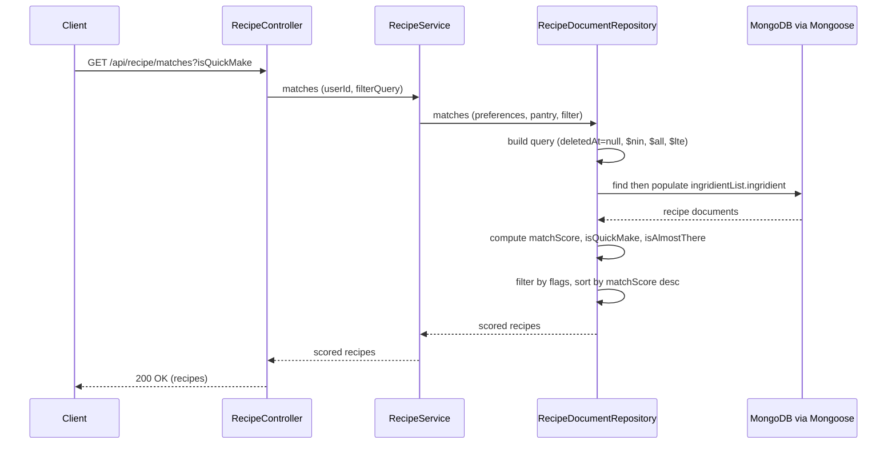
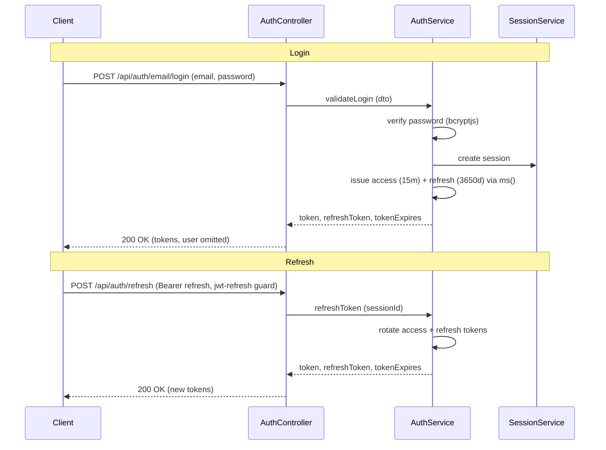

# PantryChef REST API Reference

This document is the **REST API reference** for the PantryChef NestJS backend.
It is **reference material**: neutral, present-tense, and table-driven. Each
endpoint is documented exactly as the code serves it, with an inline
`Source: <path>:<line>` citation on every technical claim so that each
statement is traceable to the implementation.

The backend is built on NestJS 10 running on Express and exposes its routes
under a configurable global prefix — `api` by default
(`Source: backend/src/main.ts:L30-L35`, `Source: backend/env_example:L4`). The
API is documented by an existing live Swagger UI; this reference complements it
with stable, version-controlled prose. For the system-level picture of how
requests flow through the layers, see
[./ARCHITECTURE.md](./ARCHITECTURE.md); for the persisted entity shapes
referenced throughout, see [./DATA_MODELS.md](./DATA_MODELS.md).

> This reference documents the system **as built**. Where behavior diverges
> from a name or from the project plan, the divergence is recorded with a
> `KNOWN ISSUE:` or `SECURITY NOTE:` callout rather than corrected.

## Table of Contents

- [1. Base URL and Versioning](#1-base-url-and-versioning)
- [2. Authentication](#2-authentication)
- [3. Auth Endpoints](#3-auth-endpoints)
- [4. Users Endpoints](#4-users-endpoints)
- [5. Pantry Endpoints](#5-pantry-endpoints)
- [6. Recipe Endpoints](#6-recipe-endpoints)
- [7. Ingredient Endpoints](#7-ingredient-endpoints)
- [8. AI Vision Endpoint](#8-ai-vision-endpoint)
- [9. Error Codes](#9-error-codes)
- [10. Swagger UI Location](#10-swagger-ui-location)
- [11. Diagrams](#11-diagrams)
- [12. Related Documentation](#12-related-documentation)

## 1. Base URL and Versioning

All routes are served under a single global prefix. The prefix is applied at
bootstrap with `app.setGlobalPrefix(...)`, reading the value from configuration
and excluding only the root path `/`
(`Source: backend/src/main.ts:L30-L35`). The configured prefix is `api`
(`Source: backend/env_example:L4`), and the server listens on the configured
port, `3000` by default (`Source: backend/env_example:L2`,
`Source: backend/src/main.ts:L54`).

The effective base URL is therefore:

```
http://<host>:3000/api
```

Every endpoint in this reference is documented relative to that base — for
example `POST /api/auth/email/login`, `GET /api/recipe/matches`,
`GET /api/ingredient/creation-data`, and `POST /api/ai/vision`.

### Versioning note

> **KNOWN ISSUE — no `/v1/` segment is served.** Each resource controller
> declares a version in its decorator, e.g.
> `@Controller({ path: 'auth', version: '1' })`
> (`Source: backend/src/auth/auth.controller.ts:L35-L39`). However, `main.ts`
> never calls `app.enableVersioning()` (`Source: backend/src/main.ts:L20-L55`).
> Without URI versioning enabled, NestJS ignores the `version` property and
> does **not** add a `/v1/` segment to the path. The served paths contain no
> version segment.
>
> The mobile client confirms the real paths: every endpoint is built as
> `"$apiBaseUrl/<resource>"` with no `/v1/` — for example the login route is
> `"$apiBaseUrl/auth/email/login"`
> (`Source: mobile/lib/core/constants/endpoints.dart:L29`), the recipe route is
> `"$apiBaseUrl/recipe"` (`Source: mobile/lib/core/constants/endpoints.dart:L44`),
> and the ingredient creation-data route is `"$ingredient/creation-data"`
> (`Source: mobile/lib/core/constants/endpoints.dart:L51`), where `apiBaseUrl`
> defaults to `http://192.168.2.20:3000/api`
> (`Source: mobile/lib/env_config.dart:L19`).
>
> The canonical documented path is `/api/<resource>`. Some project planning
> material refers to `/api/v1/*`; that form is **not** served by the code.

| Property | Value | Source |
|----------|-------|--------|
| Protocol | HTTP/JSON | `Source: mobile/lib/core/utils/dio_client.dart:L34-L41` |
| Global prefix | `api` | `Source: backend/src/main.ts:L30-L35`, `backend/env_example:L4` |
| Port | `3000` (configurable) | `Source: backend/env_example:L2`, `backend/src/main.ts:L56` |
| URI version segment | none (versioning not enabled) | `Source: backend/src/main.ts:L20-L55` |
| Effective base URL | `http://<host>:3000/api` | `Source: mobile/lib/env_config.dart:L19` |

## 2. Authentication

Protected endpoints use **Bearer JWT** authentication. The OpenAPI document
registers a bearer scheme via `addBearerAuth()`
(`Source: backend/src/main.ts:L45`), and protected controllers enforce it with
the Passport JWT guard `@UseGuards(AuthGuard('jwt'))` — applied either at the
class level (Users, Pantry, Recipe, Ingredient) or per route (Auth).

Clients send the access token in the `Authorization` header:

```http
Authorization: Bearer <access_token>
```

### Tokens and lifetimes

The login and register endpoints return an access token, a refresh token, and
the access-token expiry timestamp. Token issuance signs the access token with
the `auth.secret` and an expiry of `auth.expires`, and the refresh token with
`auth.refreshSecret` and an expiry of `auth.refreshExpires`, computing the
absolute expiry with `ms()`
(`Source: backend/src/auth/auth.service.ts:L337-L378`).

| Token | Lifetime | Env variable | Source |
|-------|----------|--------------|--------|
| Access token | `15m` | `AUTH_JWT_TOKEN_EXPIRES_IN` | `Source: backend/env_example:L21` |
| Refresh token | `3650d` | `AUTH_REFRESH_TOKEN_EXPIRES_IN` | `Source: backend/env_example:L23` |

### Passport strategies

The backend registers three Passport strategies that back the guards above:

| Strategy | Guard name | Purpose | Source |
|----------|-----------|---------|--------|
| JWT | `jwt` | Validates the access token on protected routes | `Source: backend/src/auth/auth.module.ts:L31`, `backend/src/auth/auth.controller.ts:L93` |
| JWT refresh | `jwt-refresh` | Validates the refresh token on `POST /api/auth/refresh` | `Source: backend/src/auth/auth.module.ts:L31`, `backend/src/auth/auth.controller.ts:L113` |
| Anonymous | `anonymous` | Registered Passport strategy for anonymous access | `Source: backend/src/auth/auth.module.ts:L31`, `backend/src/auth/strategies/anonymous.strategy.ts:L10` |

For the end-to-end authentication design and the login/refresh sequence
diagram, see [11. Diagrams](#11-diagrams),
[./ARCHITECTURE.md](./ARCHITECTURE.md), and the auth module source at
[`backend/src/auth/`](../backend/src/auth/).

## 3. Auth Endpoints

The auth controller is tagged `@ApiTags('Auth')` and mounted at base `auth`
(`Source: backend/src/auth/auth.controller.ts:L35-L39`). The login and register
routes are public; the remaining routes require a Bearer token. The login,
register, and refresh routes return token payloads that **omit** the `user`
object (typed `Omit<LoginResponseType, 'user'>`)
(`Source: backend/src/auth/auth.controller.ts:L56-L62`,
`Source: backend/src/auth/auth.controller.ts:L74-L80`,
`Source: backend/src/auth/auth.controller.ts:L111-L119`). The protected `GET` and
`PATCH /api/auth/me` routes return the user object
(`Source: backend/src/auth/auth.controller.ts:L91-L97`,
`Source: backend/src/auth/auth.controller.ts:L149-L158`), while `POST
/api/auth/logout` and `DELETE /api/auth/me` return `204 No Content`
(`Source: backend/src/auth/auth.controller.ts:L130-L138`,
`Source: backend/src/auth/auth.controller.ts:L167-L175`).

| Method | Path | Auth | Success | Source |
|--------|------|------|---------|--------|
| `POST` | `/api/auth/email/login` | public | `200 OK` | `Source: backend/src/auth/auth.controller.ts:L56-L62` |
| `POST` | `/api/auth/email/register` | public | `200 OK` | `Source: backend/src/auth/auth.controller.ts:L74-L80` |
| `GET` | `/api/auth/me` | Bearer `jwt` | `200 OK` | `Source: backend/src/auth/auth.controller.ts:L91-L97` |
| `POST` | `/api/auth/refresh` | Bearer `jwt-refresh` | `200 OK` | `Source: backend/src/auth/auth.controller.ts:L111-L119` |
| `POST` | `/api/auth/logout` | Bearer `jwt` | `204 No Content` | `Source: backend/src/auth/auth.controller.ts:L130-L138` |
| `PATCH` | `/api/auth/me` | Bearer `jwt` | `200 OK` | `Source: backend/src/auth/auth.controller.ts:L149-L158` |
| `DELETE` | `/api/auth/me` | Bearer `jwt` | `204 No Content` | `Source: backend/src/auth/auth.controller.ts:L167-L175` |

### 3.1 `POST /api/auth/email/login`

Authenticates a user by email and password and returns tokens. Public route;
no Bearer token required. Returns `200 OK`
(`Source: backend/src/auth/auth.controller.ts:L56-L62`).

Request body — `AuthEmailLoginDto`:

| Field | Type | Required | Validation | Source |
|-------|------|----------|------------|--------|
| `email` | `string` | yes | `@IsEmail`, lower-cased via transformer | `Source: backend/src/auth/dto/auth-email-login.dto.ts:L11-L15` |
| `password` | `string` | yes | `@IsNotEmpty` | `Source: backend/src/auth/dto/auth-email-login.dto.ts:L18-L20` |

```http
POST /api/auth/email/login HTTP/1.1
Content-Type: application/json

{ "email": "test1@example.com", "password": "secret" }
```

```json
{
  "token": "<access_jwt>",
  "refreshToken": "<refresh_jwt>",
  "tokenExpires": 1700000000000
}
```

A non-existent email or an incorrect password returns
`422 Unprocessable Entity` (see [9. Error Codes](#9-error-codes);
`Source: backend/src/auth/auth.service.ts:L52-L116`).

### 3.2 `POST /api/auth/email/register`

Registers a new user and returns tokens. Public route. Returns `200 OK`
(`Source: backend/src/auth/auth.controller.ts:L74-L80`).

Request body — `AuthRegisterLoginDto`:

| Field | Type | Required | Validation | Source |
|-------|------|----------|------------|--------|
| `email` | `string` | yes | `@IsEmail`, lower-cased via transformer | `Source: backend/src/auth/dto/auth-register-login.dto.ts:L11-L14` |
| `password` | `string` | yes | `@MinLength(6)` | `Source: backend/src/auth/dto/auth-register-login.dto.ts:L17-L19` |

```http
POST /api/auth/email/register HTTP/1.1
Content-Type: application/json

{ "email": "test1@example.com", "password": "secret6" }
```

### 3.3 `GET /api/auth/me`

Returns the authenticated user's profile. Requires a Bearer `jwt` token.
Returns `200 OK` (`Source: backend/src/auth/auth.controller.ts:L91-L97`).

```http
GET /api/auth/me HTTP/1.1
Authorization: Bearer <access_token>
```

### 3.4 `POST /api/auth/refresh`

Rotates the session's tokens. Requires a Bearer **refresh** token validated by
the `jwt-refresh` guard; the session id is read from the refresh payload and
new tokens are issued (`Source: backend/src/auth/auth.controller.ts:L111-L119`).
Returns `200 OK`.

```http
POST /api/auth/refresh HTTP/1.1
Authorization: Bearer <refresh_token>
```

### 3.5 `POST /api/auth/logout`

Invalidates the current session. Requires a Bearer `jwt` token. Returns
`204 No Content` (`Source: backend/src/auth/auth.controller.ts:L130-L138`).

### 3.6 `PATCH /api/auth/me`

Updates the authenticated user's profile from an `AuthUpdateDto` body. Requires
a Bearer `jwt` token. Returns `200 OK`
(`Source: backend/src/auth/auth.controller.ts:L149-L158`).

### 3.7 `DELETE /api/auth/me`

Deletes the authenticated user's account via `service.softDelete`. Requires a
Bearer `jwt` token. Returns `204 No Content`
(`Source: backend/src/auth/auth.controller.ts:L167-L175`).

> **KNOWN ISSUE — `softDelete` is a hard delete.** The underlying user
> repository implements `softDelete` with `deleteOne`, permanently removing the
> document rather than setting a `deletedAt` marker
> (`Source: backend/src/users/infrastructure/document/repositories/user.repository.ts:L174-L186`).
> See the soft-delete vs hard-delete matrix in
> [./DATA_MODELS.md](./DATA_MODELS.md).


## 4. Users Endpoints

The users controller is tagged `@ApiTags('Users')` and mounted at base `users`.
The entire controller is protected: `@ApiBearerAuth()` and
`@UseGuards(AuthGuard('jwt'))` are applied at the class level, so every route
requires a Bearer `jwt` token
(`Source: backend/src/users/users.controller.ts:L40-L46`).

| Method | Path | Auth | Success | Source |
|--------|------|------|---------|--------|
| `POST` | `/api/users` | Bearer `jwt` | `201 Created` | `Source: backend/src/users/users.controller.ts:L60-L64` |
| `GET` | `/api/users` | Bearer `jwt` | `200 OK` | `Source: backend/src/users/users.controller.ts:L77-L101` |
| `GET` | `/api/users/me` | Bearer `jwt` | `200 OK` | `Source: backend/src/users/users.controller.ts:L112-L118` |
| `PATCH` | `/api/users` | Bearer `jwt` | `200 OK` | `Source: backend/src/users/users.controller.ts:L131-L140` |
| `DELETE` | `/api/users/:id` | Bearer `jwt` | `204 No Content` | `Source: backend/src/users/users.controller.ts:L151-L164` |

### 4.1 `POST /api/users`

Creates a user from a `CreateUserDto` body. Returns `201 Created`
(`Source: backend/src/users/users.controller.ts:L60-L64`).

Request body — `CreateUserDto`:

| Field | Type | Required | Validation / Notes | Source |
|-------|------|----------|--------------------|--------|
| `email` | `string \| null` | yes | `@IsEmail`, lower-cased via transformer | `Source: backend/src/users/dto/create-user.dto.ts:L58-L62` |
| `password` | `string` | optional | `@MinLength(6)` | `Source: backend/src/users/dto/create-user.dto.ts:L65-L67` |
| `preferences` | `PreferencesDto` | optional | nested, validated | `Source: backend/src/users/dto/create-user.dto.ts:L70-L74` |
| `pantry` | `string[]` | optional | array of strings | `Source: backend/src/users/dto/create-user.dto.ts:L77-L81` |
| `favoriteRecipes` | `string[]` | optional | array | `Source: backend/src/users/dto/create-user.dto.ts:L84-L87` |
| `recentSearches` | `string[]` | optional | array of strings | `Source: backend/src/users/dto/create-user.dto.ts:L90-L94` |

The embedded `PreferencesDto` supplies the inputs consumed by the recipe
matching engine (see [6. Recipe Endpoints](#6-recipe-endpoints)):

| Field | Type | Required | Source |
|-------|------|----------|--------|
| `dietary` | `string[]` | optional | `Source: backend/src/users/dto/create-user.dto.ts:L22-L26` |
| `allergies` | `string[]` | optional | `Source: backend/src/users/dto/create-user.dto.ts:L29-L33` |
| `dislikedIngredients` | `string[]` | optional | `Source: backend/src/users/dto/create-user.dto.ts:L36-L40` |
| `cookingTime` | `number` | optional | `Source: backend/src/users/dto/create-user.dto.ts:L43-L46` |

```http
POST /api/users HTTP/1.1
Authorization: Bearer <access_token>
Content-Type: application/json

{
  "email": "chef@example.com",
  "password": "secret6",
  "preferences": { "dietary": ["vegetarian"], "allergies": ["peanuts"] }
}
```

### 4.2 `GET /api/users`

Returns a paginated list of users from a `QueryUserDto` query (page, limit,
filters, sort). Returns `200 OK`
(`Source: backend/src/users/users.controller.ts:L77-L101`).

| Parameter | Type | Required | Description | Source |
|-----------|------|----------|-------------|--------|
| `page` | `number` | optional | Page number; defaults to `1` | `Source: backend/src/users/users.controller.ts:L83` |
| `limit` | `number` | optional | Items per page; defaults to `10` | `Source: backend/src/users/users.controller.ts:L84` |
| `filters` | object | optional | Filter options applied to the query | `Source: backend/src/users/users.controller.ts:L92` |
| `sort` | object | optional | Sort options | `Source: backend/src/users/users.controller.ts:L93` |

> **KNOWN ISSUE — pagination is capped at 50.** When the requested `limit`
> exceeds `50` it is silently reduced to `50`
> (`Source: backend/src/users/users.controller.ts:L86-L88`). The same cap
> applies to the pantry, recipe, and ingredient list endpoints.

```http
GET /api/users?page=1&limit=20 HTTP/1.1
Authorization: Bearer <access_token>
```

### 4.3 `GET /api/users/me`

Returns the authenticated user, resolved from `req.user?.id`. Returns
`200 OK` (`Source: backend/src/users/users.controller.ts:L112-L118`).

### 4.4 `PATCH /api/users`

Updates the authenticated user from an `UpdateUserDto` body; the target id is
taken from `req.user?.id` rather than the path. Returns `200 OK`
(`Source: backend/src/users/users.controller.ts:L131-L140`).

### 4.5 `DELETE /api/users/:id`

Deletes the user identified by the `:id` path parameter via
`usersService.softDelete`. Returns `204 No Content`
(`Source: backend/src/users/users.controller.ts:L151-L164`).

| Parameter | Type | Description | Source |
|-----------|------|-------------|--------|
| `id` | `string` | User id to delete (path) | `Source: backend/src/users/users.controller.ts:L151-L164` |

> **KNOWN ISSUE — `softDelete` is a hard delete.** The user repository
> implements `softDelete` with `deleteOne`, permanently removing the document
> (`Source: backend/src/users/infrastructure/document/repositories/user.repository.ts:L174-L186`).
> See the soft-delete vs hard-delete matrix in
> [./DATA_MODELS.md](./DATA_MODELS.md).


## 5. Pantry Endpoints

The pantry controller is tagged `@ApiTags('Pantry')` and mounted at base
`pantry`. The whole controller is protected by class-level `@ApiBearerAuth()`
and `@UseGuards(AuthGuard('jwt'))`
(`Source: backend/src/pantry/pantry.controller.ts:L47`). Pantry items are
scoped to the authenticated user: the `userId` is taken from the request rather
than the body (`Source: backend/src/pantry/pantry.controller.ts:L41`).

| Method | Path | Auth | Success | Source |
|--------|------|------|---------|--------|
| `POST` | `/api/pantry` | Bearer `jwt` | `201 Created` | `Source: backend/src/pantry/pantry.controller.ts:L59-L68` |
| `GET` | `/api/pantry` | Bearer `jwt` | `200 OK` | `Source: backend/src/pantry/pantry.controller.ts:L79-L107` |
| `GET` | `/api/pantry/:id` | Bearer `jwt` | `200 OK` | `Source: backend/src/pantry/pantry.controller.ts:L115-L126` |
| `PATCH` | `/api/pantry/:id` | Bearer `jwt` | `200 OK` | `Source: backend/src/pantry/pantry.controller.ts:L138-L150` |
| `DELETE` | `/api/pantry/:id` | Bearer `jwt` | `204 No Content` | `Source: backend/src/pantry/pantry.controller.ts:L158-L171` |

### 5.1 `POST /api/pantry`

Adds an ingredient to the authenticated user's pantry from a
`CreatePantryIngridientDto` body. Returns `201 Created`; the `userId` is taken
from `req.user?.id` (`Source: backend/src/pantry/pantry.controller.ts:L35-L43`).

Request body — `CreatePantryIngridientDto` (filename misspelled as
`create-pantry-ingridient.dto.ts`, preserved verbatim):

| Field | Type | Required | Validation / Notes | Source |
|-------|------|----------|--------------------|--------|
| `ingridient` | `Ingridient` | yes | ingredient reference (`ingridient`, sic) | `Source: backend/src/pantry/dto/create-pantry-ingridient.dto.ts:L18` |
| `quantity` | `number` | yes | `@IsNumber` | `Source: backend/src/pantry/dto/create-pantry-ingridient.dto.ts:L24` |
| `unit` | `string` | yes | `@IsString` | `Source: backend/src/pantry/dto/create-pantry-ingridient.dto.ts:L30` |
| `expirationDate` | `Date` | optional | `@IsDateString` | `Source: backend/src/pantry/dto/create-pantry-ingridient.dto.ts:L39` |
| `location` | `'fridge' \| 'freezer' \| 'pantry'` | yes | enum | `Source: backend/src/pantry/dto/create-pantry-ingridient.dto.ts:L48` |

```http
POST /api/pantry HTTP/1.1
Authorization: Bearer <access_token>
Content-Type: application/json

{
  "ingridient": { "id": "<ingredientId>", "name": "Tomato",
    "category": { "id": "1", "name": "Vegetable" }, "confidence": 1 },
  "quantity": 2, "unit": "kg", "location": "fridge"
}
```

The `ingridient` field is an `Ingridient` object, not a bare id string: the DTO
declares `ingridient: Ingridient`, so the client serializes the full ingredient
reference (`Source: backend/src/pantry/dto/create-pantry-ingridient.dto.ts:L11-L14`,
`Source: backend/src/ingridient/domain/ingrident.ts:L2-L13`).

### 5.2 `GET /api/pantry`

Returns a paginated list of the authenticated user's pantry items from a
`QueryPantryIngridientDto` query. The filter is scoped to `userId`
(`Source: backend/src/pantry/pantry.controller.ts:L60`). Returns `200 OK`.

| Parameter | Type | Required | Description | Source |
|-----------|------|----------|-------------|--------|
| `page` | `number` | optional | Page number; defaults to `1` | `Source: backend/src/pantry/pantry.controller.ts:L87` |
| `limit` | `number` | optional | Items per page; defaults to `10`, capped at `50` | `Source: backend/src/pantry/pantry.controller.ts:L89-L92` |
| `filters` | object | optional | Merged with `{ userId }` scope | `Source: backend/src/pantry/pantry.controller.ts:L98` |
| `sort` | object | optional | Sort options | `Source: backend/src/pantry/pantry.controller.ts:L99` |

> **KNOWN ISSUE — pagination is capped at 50.** A requested `limit` above `50`
> is reduced to `50` (`Source: backend/src/pantry/pantry.controller.ts:L59`).

### 5.3 `GET /api/pantry/:id`

Returns a single pantry item by `:id`. Returns `200 OK`
(`Source: backend/src/pantry/pantry.controller.ts:L71-L82`).

| Parameter | Type | Description | Source |
|-----------|------|-------------|--------|
| `id` | `string` | Pantry item id (path) | `Source: backend/src/pantry/pantry.controller.ts:L71-L81` |

### 5.4 `PATCH /api/pantry/:id`

Updates a pantry item by `:id` from an `UpdatePantryIngridientDto` body. Returns
`200 OK` (`Source: backend/src/pantry/pantry.controller.ts:L84-L96`).

### 5.5 `DELETE /api/pantry/:id`

Deletes a pantry item by `:id` via `pantryService.softDelete`. Returns
`204 No Content` (`Source: backend/src/pantry/pantry.controller.ts:L98-L107`).

> **KNOWN ISSUE — `softDelete` is a hard delete.** The pantry repository
> implements `softDelete` with `deleteOne`, permanently removing the document
> (`Source: backend/src/pantry/infrastructure/document/repositories/pantryIngridient.repository.ts:L179-L185`).
> See the soft-delete vs hard-delete matrix in
> [./DATA_MODELS.md](./DATA_MODELS.md).


## 6. Recipe Endpoints

The recipe controller is tagged `@ApiTags('Recipe')` and mounted at base
`recipe`. The whole controller is protected by class-level `@ApiBearerAuth()`
and `@UseGuards(AuthGuard('jwt'))`
(`Source: backend/src/recipe/recipe.controller.ts:L42-L43`).

| Method | Path | Auth | Success | Source |
|--------|------|------|---------|--------|
| `POST` | `/api/recipe` | Bearer `jwt` | `201 Created` | `Source: backend/src/recipe/recipe.controller.ts:L63-L67` |
| `GET` | `/api/recipe/matches` | Bearer `jwt` | `200 OK` | `Source: backend/src/recipe/recipe.controller.ts:L85-L90` |
| `GET` | `/api/recipe` | Bearer `jwt` | `200 OK` | `Source: backend/src/recipe/recipe.controller.ts:L104-L127` |
| `GET` | `/api/recipe/:id` | Bearer `jwt` | `200 OK` | `Source: backend/src/recipe/recipe.controller.ts:L138-L147` |
| `PATCH` | `/api/recipe/:id` | Bearer `jwt` | `200 OK` | `Source: backend/src/recipe/recipe.controller.ts:L161-L173` |
| `DELETE` | `/api/recipe/:id` | Bearer `jwt` | `204 No Content` | `Source: backend/src/recipe/recipe.controller.ts:L187-L196` |

> **Note on routing order.** `GET /api/recipe/matches` is declared **before**
> `GET /api/recipe/:id`
> (`Source: backend/src/recipe/recipe.controller.ts:L43-L48`,
> `Source: backend/src/recipe/recipe.controller.ts:L85`), so `matches` is
> matched as a literal route and is not shadowed by the `:id` parameter route.

### 6.1 `POST /api/recipe`

Creates a recipe from a `CreateRecipeDto` body. Returns `201 Created`
(`Source: backend/src/recipe/recipe.controller.ts:L63-L67`).

Request body — `CreateRecipeDto`:

| Field | Type | Required | Validation / Notes | Source |
|-------|------|----------|--------------------|--------|
| `title` | `string` | yes | `@IsNotEmpty`, `@IsString` | `Source: backend/src/recipe/dto/create-recipe.dto.ts:L91` |
| `description` | `string` | yes | `@IsNotEmpty`, `@IsString` | `Source: backend/src/recipe/dto/create-recipe.dto.ts:L97` |
| `ingridientList` | `IngridientListDto[]` | yes | nested array (`ingridient`, sic) | `Source: backend/src/recipe/dto/create-recipe.dto.ts:L108` |
| `instructions` | `InstructionDto[]` | yes | nested array | `Source: backend/src/recipe/dto/create-recipe.dto.ts:L119` |
| `prepTime` | `number` | yes | `@IsNumber` (minutes) | `Source: backend/src/recipe/dto/create-recipe.dto.ts:L125` |
| `cookTime` | `number` | yes | `@IsNumber` (minutes) | `Source: backend/src/recipe/dto/create-recipe.dto.ts:L131` |
| `servings` | `number` | yes | `@IsNumber` | `Source: backend/src/recipe/dto/create-recipe.dto.ts:L137` |
| `difficulty` | `'easy' \| 'medium' \| 'hard'` | yes | `@IsIn` enum | `Source: backend/src/recipe/dto/create-recipe.dto.ts:L146` |
| `tags` | `string[]` | optional | array of strings | `Source: backend/src/recipe/dto/create-recipe.dto.ts:L156` |
| `imageUrl` | `string` | optional | `@IsUrl` | `Source: backend/src/recipe/dto/create-recipe.dto.ts:L162` |
| `matchScore` | `number` | optional | `@Min(0)`, range `0`–`1` | `Source: backend/src/recipe/dto/create-recipe.dto.ts:L174` |

Each `ingridientList` entry (`IngridientListDto`) carries `ingridient`
(reference, sic), `amount`, `unit`, `required`, and optional `substitutes`
(`Source: backend/src/recipe/dto/create-recipe.dto.ts:L16-L44`). Each
`instructions` entry (`InstructionDto`) carries `step`, `description`, and an
optional `timer` (`Source: backend/src/recipe/dto/create-recipe.dto.ts:L77`).

```http
POST /api/recipe HTTP/1.1
Authorization: Bearer <access_token>
Content-Type: application/json

{
  "title": "Tomato Pasta",
  "description": "Simple pasta",
  "ingridientList": [{
    "ingridient": { "id": "<id>", "name": "Pasta",
      "category": { "id": "1", "name": "Grains" }, "confidence": 1 },
    "amount": 2, "unit": "cup", "required": true }],
  "instructions": [{ "step": 1, "description": "Boil pasta" }],
  "prepTime": 5, "cookTime": 15, "servings": 2, "difficulty": "easy",
  "tags": ["dinner"]
}
```

Each `ingridientList` entry's `ingridient` field is an `Ingridient` object, not
a bare id string: `IngridientListDto` declares `ingridient: Ingridient`
(`Source: backend/src/recipe/dto/create-recipe.dto.ts:L26`,
`Source: backend/src/ingridient/domain/ingrident.ts:L2-L13`).

> **KNOWN ISSUE — duplicate `title` returns `422`.** Creating a recipe whose
> `title` already exists throws `422 Unprocessable Entity`
> (`Source: backend/src/recipe/recipe.service.ts:L26-L41`). The error payload
> uses the key `recipeAlreadyExists` (nested under an `email` errors key in the
> response shape).

### 6.2 `GET /api/recipe/matches`

Runs the recipe matching engine for the authenticated user against their pantry
and preferences and returns scored recipes. Returns `200 OK`
(`Source: backend/src/recipe/recipe.controller.ts:L43-L48`). The query uses the
`FilterType` shape (`Source: backend/src/recipe/types/filter.types.ts:L9`).

| Parameter | Type | Required | Description | Source |
|-----------|------|----------|-------------|--------|
| `isQuickMake` | `boolean` | optional | Keep only quick-make recipes (≤ 5 ingredients) | `Source: backend/src/recipe/types/filter.types.ts:L12` |
| `isAlmostThere` | `boolean` | optional | Keep only recipes missing 1–2 ingredients | `Source: backend/src/recipe/types/filter.types.ts:L15` |

**Matching algorithm** (`RecipeDocumentRepository.matches`):

1. Collect the user's pantry ingredient ids
   (`Source: backend/src/recipe/infrastructure/document/repositories/recipe.repository.ts:L173`)
   and seed the query with `deletedAt: null`
   (`Source: backend/src/recipe/infrastructure/document/repositories/recipe.repository.ts:L177`).
2. Apply preference pre-filters: excluded ingredients (allergies +
   `dislikedIngredients`) via `ingridientList.ingridient: { $nin }`
   (`Source: backend/src/recipe/infrastructure/document/repositories/recipe.repository.ts:L189`);
   dietary tags via `tags: { $all }`
   (`Source: backend/src/recipe/infrastructure/document/repositories/recipe.repository.ts:L195`);
   cooking time via `cookTime: { $lte }`
   (`Source: backend/src/recipe/infrastructure/document/repositories/recipe.repository.ts:L201`).
3. For each recipe, `totalIngredients = ingridientList.length`
   (`Source: backend/src/recipe/infrastructure/document/repositories/recipe.repository.ts:L215`);
   availability is determined by an exact id check
   `pantryIngredientIds.includes(il.ingridient._id.toString())`
   (`Source: backend/src/recipe/infrastructure/document/repositories/recipe.repository.ts:L222-L224`).
4. Derive `matchScore = availableIngredients.length / totalIngredients`
   (range `0`–`1`)
   (`Source: backend/src/recipe/infrastructure/document/repositories/recipe.repository.ts:L231`),
   `isQuickMake = totalIngredients <= 5`
   (`Source: backend/src/recipe/infrastructure/document/repositories/recipe.repository.ts:L234`),
   and `isAlmostThere` when 1–2 ingredients are missing
   (`Source: backend/src/recipe/infrastructure/document/repositories/recipe.repository.ts:L237-L238`).
5. Filter by the `isQuickMake` / `isAlmostThere` query flags
   (`Source: backend/src/recipe/infrastructure/document/repositories/recipe.repository.ts:L152-L166`)
   and sort by `matchScore` descending
   (`Source: backend/src/recipe/infrastructure/document/repositories/recipe.repository.ts:L266`).

See the [recipe-match sequence diagram](#11-diagrams) in section 11.

```http
GET /api/recipe/matches?isQuickMake=true HTTP/1.1
Authorization: Bearer <access_token>
```

> **KNOWN ISSUE — matching is by exact ingredient `_id` only.** Availability is
> decided purely by whether the pantry contains the exact ingredient `_id`,
> with no unit or quantity normalization — an ingredient counts as present
> regardless of amount
> (`Source: backend/src/recipe/infrastructure/document/repositories/recipe.repository.ts:L222-L231`).
> An existing developer comment documents the scoring intent at
> `backend/src/recipe/infrastructure/document/repositories/recipe.repository.ts:L129`.

### 6.3 `GET /api/recipe`

Returns a paginated list of recipes from a `QueryRecipeDto` query. The list
excludes soft-deleted recipes via `deletedAt: null`
(`Source: backend/src/recipe/infrastructure/document/repositories/recipe.repository.ts:L127`).
Returns `200 OK` (`Source: backend/src/recipe/recipe.controller.ts:L50-L72`).

| Parameter | Type | Required | Description | Source |
|-----------|------|----------|-------------|--------|
| `page` | `number` | optional | Page number; defaults to `1` | `Source: backend/src/recipe/recipe.controller.ts:L109` |
| `limit` | `number` | optional | Items per page; defaults to `10`, capped at `50` | `Source: backend/src/recipe/recipe.controller.ts:L110` |
| `query` | `string` | optional | Name filter, applied as case-insensitive `$regex` | `Source: backend/src/recipe/infrastructure/document/repositories/recipe.repository.ts:L114-L115` |
| `ids` | `string[]` | optional | Restrict to ids via `$in` | `Source: backend/src/recipe/infrastructure/document/repositories/recipe.repository.ts:L118-L119` |
| `sort` | `SortRecipeDto[]` | optional | Sort options (JSON) | `Source: backend/src/recipe/dto/query-recipe.dto.ts:L100` |

> **KNOWN ISSUE — pagination is capped at 50.** A requested `limit` above `50`
> is reduced to `50` (`Source: backend/src/recipe/recipe.controller.ts:L63`).

```http
GET /api/recipe?query=pasta&limit=20 HTTP/1.1
Authorization: Bearer <access_token>
```

### 6.4 `GET /api/recipe/:id`

Returns a single recipe by `:id`. Returns `200 OK`
(`Source: backend/src/recipe/recipe.controller.ts:L85`).

### 6.5 `PATCH /api/recipe/:id`

Updates a recipe by `:id` from an `UpdateRecipeDto` body. Returns `200 OK`
(`Source: backend/src/recipe/recipe.controller.ts:L85-L97`).

### 6.6 `DELETE /api/recipe/:id`

Deletes a recipe by `:id`. Returns `204 No Content`
(`Source: backend/src/recipe/recipe.controller.ts:L99-L107`).

Unlike the user and pantry deletes, the recipe `softDelete` is a **true soft
delete**: it sets `deletedAt` with `updateOne` rather than removing the
document
(`Source: backend/src/recipe/infrastructure/document/repositories/recipe.repository.ts:L310-L312`).
See the soft-delete vs hard-delete matrix in
[./DATA_MODELS.md](./DATA_MODELS.md).


## 7. Ingredient Endpoints

The ingredient controller is tagged `@ApiTags('Ingredient')` and the served
route base is the correctly-spelled `ingredient`
(`Source: backend/src/ingridient/ingridient.controller.ts:L51`).

> **Preserved misspelling.** The module directory is spelled `ingridient/` and
> the DTO files are `create-ingridient.dto.ts` / `update-ingridient.dto.ts`
> (sic), with the controller class `IngridientController`
> (`Source: backend/src/ingridient/ingridient.controller.ts:L29-L38`). These
> code identifiers are reproduced exactly here and are not renamed. Only the
> URI route base is the correctly-spelled `ingredient`.

The whole controller is protected by class-level `@ApiBearerAuth()` and
`@UseGuards(AuthGuard('jwt'))`
(`Source: backend/src/ingridient/ingridient.controller.ts:L44-L45`).

| Method | Path | Auth | Success | Source |
|--------|------|------|---------|--------|
| `GET` | `/api/ingredient/creation-data` | Bearer `jwt` | `200 OK` | `Source: backend/src/ingridient/ingridient.controller.ts:L62-L95` |
| `POST` | `/api/ingredient` | Bearer `jwt` | `201 Created` | `Source: backend/src/ingridient/ingridient.controller.ts:L106-L112` |
| `GET` | `/api/ingredient` | Bearer `jwt` | `200 OK` | `Source: backend/src/ingridient/ingridient.controller.ts:L121-L145` |
| `GET` | `/api/ingredient/:id` | Bearer `jwt` | `200 OK` | `Source: backend/src/ingridient/ingridient.controller.ts:L153-L164` |
| `PATCH` | `/api/ingredient/:id` | Bearer `jwt` | `200 OK` | `Source: backend/src/ingridient/ingridient.controller.ts:L176-L188` |
| `DELETE` | `/api/ingredient/:id` | Bearer `jwt` | `204 No Content` | `Source: backend/src/ingridient/ingridient.controller.ts:L198-L207` |

### 7.1 `GET /api/ingredient/creation-data`

Returns the reference data used by clients when creating an ingredient: a fixed
list of categories and a fixed list of units, each as `{ id, name }`. Returns
`200 OK` (`Source: backend/src/ingridient/ingridient.controller.ts:L41-L71`).
This route is declared before `:id`, so it is not shadowed by the parameter
route.

The **5 categories** are hardcoded
(`Source: backend/src/ingridient/ingridient.controller.ts:L77-L81`):

| id | name | Source |
|----|------|--------|
| 1 | `spice` | `Source: backend/src/ingridient/ingridient.controller.ts:L77` |
| 2 | `vegetable` | `Source: backend/src/ingridient/ingridient.controller.ts:L78` |
| 3 | `fruit` | `Source: backend/src/ingridient/ingridient.controller.ts:L79` |
| 4 | `dairy` | `Source: backend/src/ingridient/ingridient.controller.ts:L80` |
| 5 | `protein` | `Source: backend/src/ingridient/ingridient.controller.ts:L81` |

The **9 units** are hardcoded
(`Source: backend/src/ingridient/ingridient.controller.ts:L84-L92`):

| id | name | Source |
|----|------|--------|
| 1 | `kg` | `Source: backend/src/ingridient/ingridient.controller.ts:L84` |
| 2 | `g` | `Source: backend/src/ingridient/ingridient.controller.ts:L85` |
| 3 | `lb` | `Source: backend/src/ingridient/ingridient.controller.ts:L86` |
| 4 | `oz` | `Source: backend/src/ingridient/ingridient.controller.ts:L87` |
| 5 | `ml` | `Source: backend/src/ingridient/ingridient.controller.ts:L88` |
| 6 | `l` | `Source: backend/src/ingridient/ingridient.controller.ts:L89` |
| 7 | `cup` | `Source: backend/src/ingridient/ingridient.controller.ts:L90` |
| 8 | `tbsp` | `Source: backend/src/ingridient/ingridient.controller.ts:L91` |
| 9 | `tsp` | `Source: backend/src/ingridient/ingridient.controller.ts:L92` |

```json
{
  "categories": [{ "id": 1, "name": "spice" }, { "id": 2, "name": "vegetable" }],
  "units": [{ "id": 1, "name": "kg" }, { "id": 7, "name": "cup" }]
}
```

### 7.2 `POST /api/ingredient`

Creates an ingredient from a `CreateIngridientDto` (sic) body. Returns
`201 Created` (`Source: backend/src/ingridient/ingridient.controller.ts:L73-L79`).

Request body — `CreateIngridientDto` (filename `create-ingridient.dto.ts`, sic):

| Field | Type | Required | Validation / Notes | Source |
|-------|------|----------|--------------------|--------|
| `name` | `string` | yes | `@IsNotEmpty`, `@IsString` | `Source: backend/src/ingridient/dto/create-ingridient.dto.ts:L26` |
| `category` | `Reference` | yes | `{ id, name }` reference | `Source: backend/src/ingridient/dto/create-ingridient.dto.ts:L31` |
| `quantity` | `number` | optional | `@IsNumber` | `Source: backend/src/ingridient/dto/create-ingridient.dto.ts:L37` |
| `unit` | `Reference` | optional | `{ id, name }` reference | `Source: backend/src/ingridient/dto/create-ingridient.dto.ts:L42` |
| `expirationDate` | `Date` | optional | `@IsDateString` | `Source: backend/src/ingridient/dto/create-ingridient.dto.ts:L51` |
| `imageUrl` | `string` | optional | `@IsUrl` | `Source: backend/src/ingridient/dto/create-ingridient.dto.ts:L57` |
| `confidence` | `number` | yes | `@Min(0)`, `@Max(1)` — range `0`–`1` | `Source: backend/src/ingridient/dto/create-ingridient.dto.ts:L69` |

The `confidence` field models AI-recognition certainty and is constrained to
the `0`–`1` range; on the persisted entity it is excluded from JSON output by
default (`Source: backend/src/ingridient/infrastructure/document/entities/ingridient.schema.ts:L38-L40`).

```http
POST /api/ingredient HTTP/1.1
Authorization: Bearer <access_token>
Content-Type: application/json

{ "name": "tomato", "category": { "id": 2, "name": "vegetable" },
  "confidence": 0.92 }
```

> **KNOWN ISSUE — duplicate `name` returns `422`.** Creating an ingredient with
> a `name` that already exists throws `422 Unprocessable Entity`
> (`Source: backend/src/ingridient/ingridient.service.ts:L20-L35`).

### 7.3 `GET /api/ingredient`

Returns a paginated list of ingredients from a `QueryIngridientDto` query.
Returns `200 OK` (`Source: backend/src/ingridient/ingridient.controller.ts:L81-L103`).

| Parameter | Type | Required | Description | Source |
|-----------|------|----------|-------------|--------|
| `page` | `number` | optional | Page number; defaults to `1` | `Source: backend/src/ingridient/ingridient.controller.ts:L127` |
| `limit` | `number` | optional | Items per page; defaults to `10`, capped at `50` | `Source: backend/src/ingridient/ingridient.controller.ts:L128-L131` |
| `query` | object | optional | Filter options | `Source: backend/src/ingridient/ingridient.controller.ts:L136` |
| `sort` | object | optional | Sort options | `Source: backend/src/ingridient/ingridient.controller.ts:L137` |

> **KNOWN ISSUE — pagination is capped at 50.** A requested `limit` above `50`
> is reduced to `50`
> (`Source: backend/src/ingridient/ingridient.controller.ts:L88-L90`).

### 7.4 `GET /api/ingredient/:id`

Returns a single ingredient by `:id`. Returns `200 OK`
(`Source: backend/src/ingridient/ingridient.controller.ts:L105-L116`).

### 7.5 `PATCH /api/ingredient/:id`

Updates an ingredient by `:id` from an `UpdateIngridientDto` (sic) body. Returns
`200 OK` (`Source: backend/src/ingridient/ingridient.controller.ts:L176-L188`).

### 7.6 `DELETE /api/ingredient/:id`

Deletes an ingredient by `:id` via `ingridientService.softDelete`. Returns
`204 No Content` (`Source: backend/src/ingridient/ingridient.controller.ts:L131-L140`).


## 8. AI Vision Endpoint

The AI controller is mounted at base `ai` with `@Controller('ai')` — it declares
**no** version and **no** `@ApiTags`
(`Source: backend/src/ai/ai.controller.ts:L26-L27`).

| Method | Path | Auth | Success | Source |
|--------|------|------|---------|--------|
| `POST` | `/api/ai/vision` | **none** | `200 OK` | `Source: backend/src/ai/ai.controller.ts:L43-L77` |

### 8.1 `POST /api/ai/vision`

Accepts a single multipart image upload and returns the recognized ingredient.
The upload field is named `image` and is handled by a `FileInterceptor` backed
by `memoryStorage()`, with a file-size limit of **10 MB**
(`10 * 1024 * 1024`) (`Source: backend/src/ai/ai.controller.ts:L43-L61`,
limit at `Source: backend/src/ai/ai.controller.ts:L59`). When no file is
supplied, the endpoint throws `BadRequestException('Image empty')`, producing a
`400 Bad Request` (`Source: backend/src/ai/ai.controller.ts:L64-L65`).

| Field | In | Type | Required | Description | Source |
|-------|----|------|----------|-------------|--------|
| `image` | multipart form-data | file | yes | Image to analyze (≤ 10 MB) | `Source: backend/src/ai/ai.controller.ts:L45-L61` |

> **SECURITY NOTE — this endpoint is unauthenticated.** Unlike every other
> resource controller, the AI controller applies **no** JWT guard, so
> `POST /api/ai/vision` is reachable without a Bearer token
> (`Source: backend/src/ai/ai.controller.ts:L26-L43`). This is documented as a
> deviation, not a recommendation.

> **KNOWN ISSUE — the MIME-type filter is commented out.** The interceptor's
> `fileFilter` (which would reject non-JPG/JPEG/PNG uploads) is commented out,
> so non-image uploads are not rejected at the interceptor layer
> (`Source: backend/src/ai/ai.controller.ts:L49-L57`).

**Behavior.** On success the service returns the matched ingredient object
`{ id, name, category, quantity, unit, confidence }`
(`Source: backend/src/ai/ai.service.ts:L161-L175`). It returns an **empty
object `{}`** when Google Cloud Vision is disabled — for example when the
`ai.json` service-account key is absent
(`Source: backend/src/ai/ai.service.ts:L70-L76`) — or when no label matches the
internal dictionary (`Source: backend/src/ai/ai.service.ts:L126-L128`). For the
`ai.json` provisioning workflow, see [./DEPLOYMENT.md](./DEPLOYMENT.md).

```http
POST /api/ai/vision HTTP/1.1
Content-Type: multipart/form-data; boundary=----boundary

------boundary
Content-Disposition: form-data; name="image"; filename="fridge.jpg"
Content-Type: image/jpeg

<binary image bytes>
------boundary--
```

Successful match:

```json
{
  "id": "665f...",
  "name": "tomato",
  "category": { "id": 2, "name": "vegetable" },
  "quantity": 1,
  "unit": { "id": 1, "name": "kg" },
  "confidence": 0.92
}
```

Graceful degradation (Vision disabled or no match):

```json
{}
```


## 9. Error Codes

The API returns standard HTTP status codes. Validation and domain conflicts use
`422 Unprocessable Entity`; missing or invalid Bearer tokens use `401`; the AI
endpoint uses `400` for an empty upload.

| Status | Meaning | Triggered by | Source |
|--------|---------|--------------|--------|
| `200 OK` | Success (read / login / update) | GET, login, register, refresh, PATCH routes | `Source: backend/src/auth/auth.controller.ts:L56-L62` |
| `201 Created` | Resource created | `POST /api/users`, `/api/pantry`, `/api/recipe`, `/api/ingredient` | `Source: backend/src/users/users.controller.ts:L60-L64` |
| `204 No Content` | Success with no body | logout and `DELETE` routes | `Source: backend/src/auth/auth.controller.ts:L130-L138` |
| `400 Bad Request` | AI vision called with no file | `POST /api/ai/vision` | `Source: backend/src/ai/ai.controller.ts:L64-L65` |
| `401 Unauthorized` | Missing/invalid Bearer token | any class- or route-guarded endpoint | `Source: backend/src/users/users.controller.ts:L40-L45` |
| `422 Unprocessable Entity` | Validation failure | global `ValidationPipe` | `Source: backend/src/main.ts:L38` |
| `422 Unprocessable Entity` | Duplicate recipe `title` | `POST /api/recipe` | `Source: backend/src/recipe/recipe.service.ts:L26-L41` |
| `422 Unprocessable Entity` | Duplicate ingredient `name` | `POST /api/ingredient` | `Source: backend/src/ingridient/ingridient.service.ts:L20-L35` |
| `422 Unprocessable Entity` | Login email not found / wrong password | `POST /api/auth/email/login` | `Source: backend/src/auth/auth.service.ts:L52-L116` |

Validation errors are produced by the global `ValidationPipe` registered at
bootstrap (`Source: backend/src/main.ts:L38`). A representative `422` body:

```json
{
  "status": 422,
  "errors": { "email": "recipeAlreadyExists" }
}
```

## 10. Swagger UI Location

The interactive OpenAPI UI is served at **`/docs`**
(`Source: backend/src/main.ts:L51`). The OpenAPI document is built with the
title `API`, the description `API docs`, the version `1.0`, and a bearer-auth
scheme (`Source: backend/src/main.ts:L41-L46`).

```
http://<host>:3000/docs
```

> **Divergence note.** The global `api` prefix is **not** applied to the Swagger
> route — `SwaggerModule.setup('docs', app, document)` registers it at the root
> `/docs` (`Source: backend/src/main.ts:L51`). Some project planning material
> refers to the UI as `/api/docs`; the served location is `/docs`.

## 11. Diagrams

### Recipe match flow

The sequence below traces `GET /api/recipe/matches` from the client through the
controller, service, and document repository
(`Source: backend/src/recipe/recipe.controller.ts:L43-L48`,
`Source: backend/src/recipe/infrastructure/document/repositories/recipe.repository.ts:L166-L266`).



### Auth login and refresh flow

The sequence below traces login (`POST /api/auth/email/login`) and token refresh
(`POST /api/auth/refresh`)
(`Source: backend/src/auth/auth.controller.ts:L56-L119`,
`Source: backend/src/auth/auth.service.ts:L337-L378`).



## 12. Related Documentation

This reference is the endpoint-level entry point. For broader context, follow
these sibling references and package READMEs:

- [./ARCHITECTURE.md](./ARCHITECTURE.md) — system design, layered backend and
  clean mobile architecture, and the request lifecycle.
- [./DATA_MODELS.md](./DATA_MODELS.md) — Mongoose entities and Dart models with
  field tables, plus the soft-delete vs hard-delete matrix.
- [./DEPLOYMENT.md](./DEPLOYMENT.md) — Docker Compose bring-up, environment
  variables, database seeding, and the `ai.json` Vision key workflow.
- [../backend/README.md](../backend/README.md) — backend project overview and
  local development.

Per-module source directories provide the deepest detail, for example
[`backend/src/auth/`](../backend/src/auth/),
[`backend/src/recipe/`](../backend/src/recipe/),
[`backend/src/ingridient/`](../backend/src/ingridient/), and
[`backend/src/ai/`](../backend/src/ai/).

