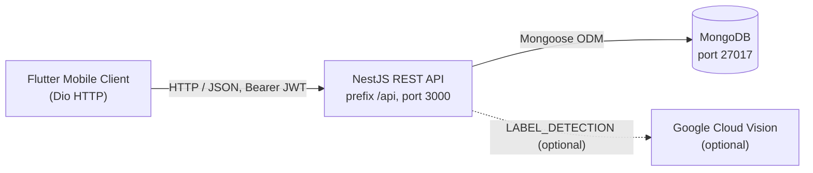
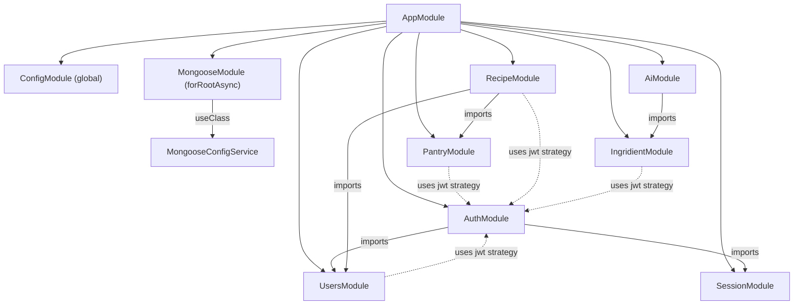

# PantryChef Architecture

PantryChef is a **monorepo** that pairs a server-rendered REST backend with a
native mobile client over a shared MongoDB data store. The backend is built on
NestJS 10 running on Express (`Source: backend/package.json:L26-L28`), the
mobile client is a Flutter / Dart 3.5 application that manages state with the
BLoC pattern (`Source: mobile/pubspec.yaml:L22`), and persistence is
handled by MongoDB accessed through Mongoose 8
(`Source: backend/package.json:L30,L37`). An optional Google Cloud Vision
integration adds image-based ingredient recognition
(`Source: backend/package.json:L25`).

This document is **orientation / explanation** material. It explains how the
pieces fit together and how a request flows through each side, moving from a
high-level overview toward layer-by-layer detail. It does not enumerate every
endpoint, field, or environment variable — those live in the sibling reference
documents linked from [Related Documentation](#8-related-documentation). The
description here reflects the system exactly as built; it documents behavior and
known quirks rather than proposing changes.

## Table of Contents

- [1. System Context](#1-system-context)
- [2. Monorepo Layout](#2-monorepo-layout)
- [3. Backend Layered Architecture](#3-backend-layered-architecture)
- [4. Mobile Clean Architecture](#4-mobile-clean-architecture)
- [5. Cross-Cutting Concerns](#5-cross-cutting-concerns)
- [6. External Integrations](#6-external-integrations)
- [7. Bootstrap Sequence](#7-bootstrap-sequence)
- [8. Related Documentation](#8-related-documentation)

## 1. System Context

At the highest level PantryChef has four participants: the Flutter mobile
client, the NestJS REST API, the MongoDB database, and the optional Google Cloud
Vision service.

The mobile client talks to the backend exclusively over HTTP/JSON using a Dio
HTTP client (`Source: mobile/lib/core/utils/dio_client.dart:L40-L47`). The
backend exposes its routes under a configurable global prefix — `api` by default
(`Source: backend/src/main.ts:L14-L19`, `Source: backend/env_example:L4`) — and
listens on the port supplied by configuration, `3000` by default
(`Source: backend/src/main.ts:L33`, `Source: backend/env_example:L2`). The
backend reads and writes domain data in MongoDB through Mongoose, with the
connection assembled at startup (`Source: backend/src/app.module.ts:L25-L27`).
When an ingredient photo is submitted, the backend calls Google Cloud Vision to
label the image; this dependency is optional and degrades gracefully when its
credentials are absent (`Source: backend/src/ai/ai.service.ts:L53-L56`).



*Diagram: system context. Caption sources — `backend/src/main.ts`,
`mobile/lib/core/utils/dio_client.dart`, `backend/docker-compose.yml`.* The
default container topology binds MongoDB on `27017` and the NestJS service on
`3000` (`Source: backend/docker-compose.yml:L11-L12,L24-L25`). The dotted edge
to Vision denotes the optional path that is skipped when no service-account key
is present (`Source: backend/src/ai/ai.service.ts:L64-L67`).

## 2. Monorepo Layout

The repository root contains exactly two application packages plus this new
documentation folder. There is no root-level workspace tooling (no root
`package.json`, no Nx/Turborepo/Lerna configuration); the two packages are
independent projects that share only the HTTP contract and the data model.

| Path | Role |
|------|------|
| `backend/` | NestJS 10 + Express REST API and Mongoose persistence (`Source: backend/package.json:L26-L28,L37`) |
| `mobile/` | Flutter / Dart 3.5 BLoC client (`Source: mobile/pubspec.yaml:L22`) |
| `docs/` | This cross-cutting knowledge base (architecture, API, data models, deployment) |

The two packages organize their code on different but complementary principles:

- **Backend — per-module layered layout.** Each feature lives in its own
  directory under `backend/src/` (for example `auth/`, `users/`, `pantry/`,
  `recipe/`, `ingridient/`, `ai/`, `session/`) and internally separates a
  controller, a service, an abstract repository contract, a concrete document
  repository, and a Mongoose schema. This chain is detailed in
  [Backend Layered Architecture](#3-backend-layered-architecture).
- **Mobile — per-feature clean architecture.** Each feature under
  `mobile/lib/features/` is split into `domain/`, `data/`, and `presentation/`
  layers. This is detailed in
  [Mobile Clean Architecture](#4-mobile-clean-architecture).

### Preserved misspelled identifiers

Several identifiers are misspelled in the source tree. They are **stable
identifiers** that the running code depends on, so they are documented exactly as
they appear and are never silently "corrected" in documentation. The most
visible case is a deliberate-looking divergence between the two packages: the
backend names its module directory `ingridient/` while the mobile client names
the corresponding feature `ingredient/` (the conventionally correct spelling).
Both spellings are reproduced verbatim wherever they appear.

| Identifier (as written) | Location | Note |
|-------------------------|----------|------|
| `ingridient/` (directory) | `backend/src/ingridient/` | Backend module dir; misspelled |
| `ingrident.ts` | `backend/src/ingridient/domain/ingrident.ts` | Backend domain entity file; misspelled |
| `ingredient/` (directory) | `mobile/lib/features/ingredient/` | Mobile feature dir; correctly spelled |
| `patry_main.dart` | `mobile/lib/features/pantry/presentation/widgets/screens/patry_main.dart` | "pantry" transposed |
| `search_ingredietn.usecase.dart` | `mobile/lib/features/ingredient/domain/usecases/search_ingredietn.usecase.dart` | "ingredient" transposed |
| `profile.repositiry.dart` | `mobile/lib/features/profile/data/repositories/profile.repositiry.dart` | "repository" misspelled |
| `singup` (route constant) | `mobile/lib/core/constants/navigation.dart:L6` | "signup" transposed |

These names are referenced as-is throughout the rest of this document and across
the sibling reference docs.

## 3. Backend Layered Architecture

The backend follows a consistent layered pattern within every feature module.
Reading from the network edge inward, a request passes through five
responsibilities:

1. **Controller** — declares the HTTP routes, applies guards and Swagger
   decorators, and delegates immediately to the service.
2. **Service** — holds the business rules (validation, cross-entity
   orchestration) and delegates persistence to an abstract repository.
3. **Abstract repository** — a contract (`abstract class`) that names the
   persistence operations without binding them to any database technology.
4. **Document repository** — the concrete implementation of that contract that
   talks to a Mongoose model.
5. **Mongoose model / schema** — the document shape persisted in MongoDB.

The `recipe/` module is a representative example of this chain. The controller
is guarded by JWT, tagged for Swagger, and versioned at `v1`
(`Source: backend/src/recipe/recipe.controller.ts:L27-L33`); it injects the
service and forwards each route to it — for instance the `POST` create handler
simply calls `recipeService.create(...)`
(`Source: backend/src/recipe/recipe.controller.ts:L37-L41`). The service owns the
rules: when creating a recipe it rejects a duplicate title with a `422
Unprocessable Entity` before persisting
(`Source: backend/src/recipe/recipe.service.ts:L27-L41`), and its `matches`
method first loads the caller's preferences and pantry, then delegates the
scoring query (`Source: backend/src/recipe/recipe.service.ts:L67-L76`).

Persistence is expressed against a contract rather than the database directly.
`RecipeRepository` is declared as an abstract class enumerating `create`,
`findManyWithPagination`, `matches`, `findOne`, `update`, and `softDelete`
(`Source: backend/src/recipe/infrastructure/recipe.repository.ts:L11-L42`). The
concrete `RecipeDocumentRepository implements RecipeRepository` and receives the
Mongoose model through `@InjectModel`
(`Source: backend/src/recipe/infrastructure/document/repositories/recipe.repository.ts:L16-L21`).
Documents are translated to and from the domain shape by a mapper, so the rest
of the backend works with domain objects rather than Mongoose documents
(`Source: backend/src/recipe/infrastructure/document/repositories/recipe.repository.ts:L23-L30`).

Each module repeats the same internal folders: `dto/` for request/response
shapes, `domain/` for the domain entity, and
`infrastructure/document/{entities,mappers,repositories}` for the persistence
implementation
(`Source: backend/src/recipe/infrastructure/recipe.repository.ts:L1-L42`,
`Source: backend/src/recipe/infrastructure/document/repositories/recipe.repository.ts:L20-L30`).
Note the preserved backend misspelling here: the ingredient module directory is
`ingridient/` and its domain entity file is `ingrident.ts`
(`Source: backend/src/ingridient/domain/ingrident.ts:L2`).

### Module wiring

All feature modules are assembled in the root `AppModule`. It imports the global
`ConfigModule`, wires Mongoose asynchronously through `MongooseConfigService`,
and registers the feature modules `AuthModule`, `SessionModule`, `UsersModule`,
`IngridientModule`, `PantryModule`, `RecipeModule`, and `AiModule`
(`Source: backend/src/app.module.ts:L18-L35`). Several feature modules import
one another directly. `AiModule` imports `IngridientModule` so the vision
service can resolve recognized labels to stored ingredients
(`Source: backend/src/ai/ai.module.ts:L4,L7`); `AuthModule` imports both
`UsersModule` and `SessionModule` to validate credentials and manage refresh
sessions (`Source: backend/src/auth/auth.module.ts:L6-L7,L14-L15`); and
`RecipeModule` imports `UsersModule` and `PantryModule` to read user data and
pantry contents during recipe matching
(`Source: backend/src/recipe/recipe.module.ts:L5-L6,L9`).



*Diagram: backend module dependencies. Caption sources —
`backend/src/app.module.ts:L18-L35`, `backend/src/ai/ai.module.ts:L4,L7`,
`backend/src/auth/auth.module.ts:L6-L7,L14-L15`,
`backend/src/recipe/recipe.module.ts:L5-L6,L9`.* Solid
edges are NestJS module imports; the dotted edges indicate that the guarded
controllers in those modules depend at runtime on the `jwt` Passport strategy
that `AuthModule` registers — they apply `@UseGuards(AuthGuard('jwt'))` rather
than importing `AuthModule` directly
(`Source: backend/src/users/users.controller.ts:L26-L27`). See
[Cross-Cutting Concerns](#5-cross-cutting-concerns) for the guard details.

### Request lifecycle

The following sequence traces a recipe read from the client to MongoDB and back,
using the controller → service → document repository → model chain established
above.

```mermaid
sequenceDiagram
    participant Client
    participant Controller as RecipeController
    participant Service as RecipeService
    participant Repo as RecipeDocumentRepository
    participant Model as Mongoose Model
    participant DB as MongoDB

    Client->>Controller: HTTP request (GET /api/recipe)
    Controller->>Service: delegate (findManyWithPagination)
    Service->>Repo: call RecipeRepository method
    Repo->>Model: query injected Model&lt;RecipeSchemaClass&gt;
    Model->>DB: Mongoose query
    DB-->>Model: documents
    Model-->>Repo: documents
    Repo-->>Service: domain Recipe[] (via RecipeMapper)
    Service-->>Controller: domain Recipe[]
    Controller-->>Client: JSON response
```

*Diagram: request lifecycle. Caption sources —
`backend/src/recipe/recipe.controller.ts:L50-L72`, `backend/src/recipe/recipe.service.ts:L47-L61`,
`backend/src/recipe/infrastructure/document/repositories/recipe.repository.ts:L48-L90`.*
The served path is `/api/recipe` with no `/v1/` segment: although
`RecipeController` declares `version: '1'`
(`Source: backend/src/recipe/recipe.controller.ts:L31-L33`), `main.ts` never
calls `app.enableVersioning()`, so the version property is not URI-effective and
no version segment is added (`Source: backend/src/main.ts:L10-L34`).
The controller delegates to the service
(`Source: backend/src/recipe/recipe.controller.ts:L50-L72`), the service forwards
to the repository contract (`Source: backend/src/recipe/recipe.service.ts:L47-L61`),
and the document repository runs the query through the injected model and maps
the results back to the domain type
(`Source: backend/src/recipe/infrastructure/document/repositories/recipe.repository.ts:L48-L90`).
The most intricate variant of this flow — the `GET /matches` scoring pipeline — is
explained in detail in [./API_REFERENCE.md](./API_REFERENCE.md) and the recipe
module source at [`backend/src/recipe/`](../backend/src/recipe/).


## 4. Mobile Clean Architecture

The Flutter client organizes each feature under `mobile/lib/features/<feature>/`
into three clean-architecture layers. The five features are `authentication/`,
`pantry/`, `recipe/`, `ingredient/`, and `profile/`.

- **`domain/`** — the technology-agnostic core: model classes, repository
  *interfaces*, and use cases that express a single application action. The
  ingredient search use case lives here, under the preserved misspelled filename
  `search_ingredietn.usecase.dart`
  (`Source: mobile/lib/features/ingredient/domain/usecases/search_ingredietn.usecase.dart:L7`).
- **`data/`** — the outward-facing implementation: `api/` clients, `dto/`
  data-transfer objects, and concrete `repositories/` that implement the domain
  interfaces. The profile feature's implementation carries the preserved
  misspelled filename `profile.repositiry.dart`
  (`Source: mobile/lib/features/profile/data/repositories/profile.repositiry.dart:L6`).
- **`presentation/`** — the UI and its state: `bloc/` (events, states, and the
  BLoC itself) plus `widgets/screens/`. The pantry main screen carries the
  preserved misspelled filename `patry_main.dart`
  (`Source: mobile/lib/features/pantry/presentation/widgets/screens/patry_main.dart:L12`).

State is managed with the BLoC pattern via the `bloc` and `flutter_bloc`
packages, and persisted state (such as profile preferences) uses `hydrated_bloc`
(`Source: mobile/pubspec.yaml:L39,L43`). The persisted-state storage is
initialized once at startup — see [Bootstrap Sequence](#7-bootstrap-sequence).

### Dependency injection

Cross-cutting singletons are resolved through the `get_it` service locator. A
single `getIt = GetIt.instance` is exposed
(`Source: mobile/lib/core/utils/service_locator.dart:L10`) and `setupLocator()`
registers the shared services at startup: `SharedPreferences` (registered as an
async singleton), a `SharedPreferencesHelper` wrapper, and the `DioClient`
(`Source: mobile/lib/core/utils/service_locator.dart:L34-L40`). Features obtain
these dependencies by resolving them from `getIt` rather than constructing them
directly, which keeps the HTTP client and persistence helpers as process-wide
singletons.

The client's navigation routes are defined as constants in
`mobile/lib/core/constants/navigation.dart`, including the preserved misspelled
route `singup` (`Source: mobile/lib/core/constants/navigation.dart:L6`). The
flow inside each feature — UI event → BLoC → use case → repository →
`DioClient` → API — is described per feature in each feature's source, for
example [`mobile/lib/features/ingredient/`](../mobile/lib/features/ingredient/)
and [`mobile/lib/features/recipe/`](../mobile/lib/features/recipe/).


## 5. Cross-Cutting Concerns

Several concerns are applied uniformly rather than per feature. They are
configured once during bootstrap and then implicitly affect every request.

- **CORS.** Cross-origin requests are enabled globally when the application is
  created with `NestFactory.create(AppModule, { cors: true })`
  (`Source: backend/src/main.ts:L11`).
- **Global validation.** A single `ValidationPipe` is registered for the whole
  app with shared validation options, so incoming DTOs are validated everywhere
  (`Source: backend/src/main.ts:L21`). Because `class-validator` is wired into
  Nest's container via `useContainer(...)`, validators can themselves use
  dependency injection (`Source: backend/src/main.ts:L12`).
- **Configuration.** `ConfigModule.forRoot(...)` is registered as global and
  loads the database, auth, and app configuration namespaces from `.env`
  (`Source: backend/src/app.module.ts:L20-L24`). The global API prefix is read
  from this configuration (`Source: backend/src/main.ts:L14-L19`).
- **Authentication guards.** Protected controllers apply
  `@UseGuards(AuthGuard('jwt'))` together with `@ApiBearerAuth()`; the users
  controller is one example (`Source: backend/src/users/users.controller.ts:L26-L27`)
  and the recipe controller applies the same pair
  (`Source: backend/src/recipe/recipe.controller.ts:L27-L28`). The guard resolves
  one of three Passport strategies that live in `backend/src/auth/strategies/` —
  `jwt.strategy.ts`, `jwt-refresh.strategy.ts`, and `anonymous.strategy.ts`.
  Strategy details are documented in the auth module source at
  [`backend/src/auth/`](../backend/src/auth/) and
  [./API_REFERENCE.md](./API_REFERENCE.md).

### Mobile HTTP client and interceptors

On the mobile side the cross-cutting HTTP concern is the `DioClient`, which
configures a base URL, connect/receive timeouts, and JSON headers
(`Source: mobile/lib/core/utils/dio_client.dart:L40-L47`). It installs an
`InterceptorsWrapper` that attaches `Authorization: Bearer <token>` to outgoing
requests when an access token is present
(`Source: mobile/lib/core/utils/dio_client.dart:L66-L69`) and, on a
`tokenExpired` or `unauthorized` response, transparently refreshes the token and
retries the original request
(`Source: mobile/lib/core/utils/dio_client.dart:L73-L84`,
`Source: mobile/lib/core/utils/dio_client.dart:L129-L155`).

> **SECURITY NOTE:** A `LogInterceptor` is added **unconditionally** to both the
> main Dio instance and the dedicated refresh instance, in each case with
> `requestHeader: true`
> (`Source: mobile/lib/core/utils/dio_client.dart:L48-L60`,
> `Source: mobile/lib/core/utils/dio_client.dart:L99-L111`). Because the
> request-attaching interceptor sets the `Authorization: Bearer <token>` header,
> these bearer tokens are written to the logs in **all** builds, including
> release builds. This behavior is documented here as it exists in the codebase;
> it is not modified by this documentation.


## 6. External Integrations

PantryChef depends on two external systems: a required MongoDB database and an
optional Google Cloud Vision service.

### MongoDB via Mongoose

The database connection is configured asynchronously. `AppModule` registers
`MongooseModule.forRootAsync({ useClass: MongooseConfigService })`
(`Source: backend/src/app.module.ts:L25-L27`), and `MongooseConfigService`
implements `MongooseOptionsFactory`, assembling the connection options from the
`database` configuration namespace — returning the `uri`, `dbName`, `user`, and
`pass` derived from `configService.get('database')`
(`Source: backend/src/database/mongoose-config.service.ts:L13-L19`). The
persisted entities and their relationships are catalogued in
[./DATA_MODELS.md](./DATA_MODELS.md), and the environment variables that feed
this configuration are documented in [./DEPLOYMENT.md](./DEPLOYMENT.md).

### Google Cloud Vision (optional, graceful degradation)

The `ai/` module adds image-based ingredient recognition. `AiService`
constructs an `ImageAnnotatorClient` from a service-account key expected at
`src/config/ai.json`. If that key file is missing, the service logs the
condition and sets `isGoogleVisionEnabled = false` rather than failing startup
(`Source: backend/src/ai/ai.service.ts:L51-L61`). When vision is disabled,
`detectIngredientsFromBuffer` short-circuits and returns an empty object `{}`,
so the rest of the system keeps working without the integration
(`Source: backend/src/ai/ai.service.ts:L64-L67`).

When vision is enabled, the service requests `LABEL_DETECTION` with a maximum of
ten results (`Source: backend/src/ai/ai.service.ts:L73-L78`), then matches the
returned labels against an internal in-memory ingredient dictionary and resolves
the recognized label to a stored ingredient through `IngridientService`
(`Source: backend/src/ai/ai.service.ts:L88-L113`). This is why `AiModule`
imports `IngridientModule` (`Source: backend/src/ai/ai.module.ts:L4,L7`). The
key-provisioning workflow for `ai.json` is described in
[./DEPLOYMENT.md](./DEPLOYMENT.md) and the AI module source at
[`backend/src/ai/`](../backend/src/ai/).


## 7. Bootstrap Sequence

Each side has a single, well-defined startup path.

### Backend — `backend/src/main.ts`

The `bootstrap()` function brings the application up in order:

1. Create the Nest application from `AppModule` with CORS enabled
   (`Source: backend/src/main.ts:L11`).
2. Wire `class-validator` into Nest's DI container so validators can inject
   providers (`Source: backend/src/main.ts:L12`).
3. Read configuration and apply the global API prefix, excluding the root path
   `/` (`Source: backend/src/main.ts:L14-L19`).
4. Register the global `ValidationPipe`
   (`Source: backend/src/main.ts:L21`).
5. Build the Swagger document (title `API`, bearer auth) and mount the UI
   (`Source: backend/src/main.ts:L23-L31`).
6. Listen on the configured port (`Source: backend/src/main.ts:L33`).

The Swagger UI is mounted at `docs` via `SwaggerModule.setup('docs', ...)`, which
serves it at `/docs` — the global API prefix is **not** applied to the Swagger
route (`Source: backend/src/main.ts:L31`).

> **KNOWN ISSUE:** The Swagger UI is served at `/docs`, not at `/api/docs`. Some
> task wording refers to `/api/docs`; the actual path is `/docs` because the
> global prefix does not apply to the Swagger route
> (`Source: backend/src/main.ts:L14-L19`, `Source: backend/src/main.ts:L31`).
> Endpoint-level detail is deferred to [./API_REFERENCE.md](./API_REFERENCE.md).

### Mobile — `mobile/lib/main.dart`

`main()` runs the entire startup inside `runZonedGuarded` so uncaught errors are
funneled to a single handler (`Source: mobile/lib/main.dart:L31-L48`). Inside the
guarded zone it:

1. Ensures the Flutter binding is initialized
   (`Source: mobile/lib/main.dart:L33`).
2. Preserves the native splash screen during initialization
   (`Source: mobile/lib/main.dart:L34`).
3. Initializes `HydratedBloc.storage` from a temporary directory so persisted
   BLoC state survives restarts (`Source: mobile/lib/main.dart:L35-L37`).
4. Locks the app to portrait orientation
   (`Source: mobile/lib/main.dart:L38`, `Source: mobile/lib/main.dart:L57-L61`).
5. Runs the `get_it` service-locator setup
   (`Source: mobile/lib/main.dart:L39`).
6. Launches the widget tree with `runApp(const App())`
   (`Source: mobile/lib/main.dart:L40`).

The zone's error handler prints uncaught errors
(`Source: mobile/lib/main.dart:L41-L48`). The compile-time API base URL the
client connects to is resolved from `EnvConfig.apiBaseUrl`, an environment value
read with `String.fromEnvironment('API_BASE_URL', ...)` whose default targets a
LAN address (`Source: mobile/lib/env_config.dart:L23`); overriding it at build
time is covered in [./DEPLOYMENT.md](./DEPLOYMENT.md) and
[../mobile/README.md](../mobile/README.md).

## 8. Related Documentation

This document is the orientation entry point. For task-specific detail, follow
these sibling references and package READMEs:

- [./API_REFERENCE.md](./API_REFERENCE.md) — every REST endpoint, request/response
  shape, and the Swagger UI location.
- [./DATA_MODELS.md](./DATA_MODELS.md) — Mongoose entities and Dart models with
  field tables and relationships.
- [./DEPLOYMENT.md](./DEPLOYMENT.md) — Docker Compose bring-up, environment
  variables, database seeding, and the `ai.json` Vision key workflow.
- [../backend/README.md](../backend/README.md) — backend project overview and
  local development.
- [../mobile/README.md](../mobile/README.md) — mobile project overview, run
  steps, and the `--dart-define API_BASE_URL` override.

Per-module and per-feature source directories provide the deepest detail, for
example [`backend/src/recipe/`](../backend/src/recipe/),
[`backend/src/ai/`](../backend/src/ai/), and
[`mobile/lib/features/ingredient/`](../mobile/lib/features/ingredient/).

