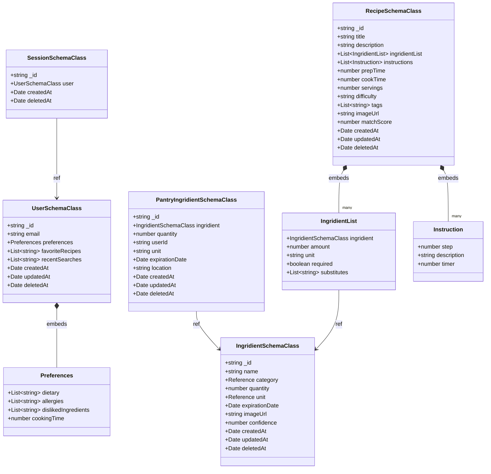

# PantryChef Data Models Reference

This document is the **persistence-model reference** for the PantryChef
monorepo. It is **reference material**: neutral, present-tense, and
table-driven. It catalogs every persisted MongoDB/Mongoose entity on the
backend and every `@JsonSerializable` Dart model on the mobile client, with
field-level tables, declared indexes, the embedded/reference relationships
between entities, and the soft-delete-vs-hard-delete behavior matrix.

Each technical claim carries an inline `Source: <path>:<line>` citation, using
repository-root-relative paths, so that every statement is traceable to the
implementation. For the REST surface that returns these shapes, see
[./API_REFERENCE.md](./API_REFERENCE.md); for how the layers fit together, see
[./ARCHITECTURE.md](./ARCHITECTURE.md).

> This reference documents the models **as built**. Where runtime behavior
> diverges from a field name or a method name, the divergence is recorded with
> a `KNOWN ISSUE:` callout rather than corrected.

## Table of Contents

- [1. Overview](#1-overview)
- [2. Entity Relationship Diagram](#2-entity-relationship-diagram)
- [3. User and Embedded Preferences](#3-user-and-embedded-preferences)
- [4. Session](#4-session)
- [5. Ingridient](#5-ingridient)
- [6. PantryIngridient](#6-pantryingridient)
- [7. Recipe](#7-recipe)
- [8. Indexes](#8-indexes)
- [9. Soft-delete vs Hard-delete Matrix](#9-soft-delete-vs-hard-delete-matrix)
- [10. Mobile Dart Models](#10-mobile-dart-models)
- [11. Related Documentation](#11-related-documentation)

## 1. Overview

PantryChef persists data across two model layers: the **backend Mongoose
schemas** that define the MongoDB collections, and the **mobile Dart models**
that decode and encode the JSON exchanged with the REST API.

### Backend Mongoose schemas

The backend stores data in MongoDB accessed through Mongoose 8
(`Source: backend/package.json:L37` — `mongoose ^8.8.0`) via the
`@nestjs/mongoose` integration (`Source: backend/package.json:L30` —
`@nestjs/mongoose ^10.1.0`). Schemas live under
`backend/src/<module>/infrastructure/document/entities/*.schema.ts`.

Every collection-backing schema class extends `EntityDocumentHelper`
(`Source: backend/src/utils/document-entity-helper.ts:L3`), which exposes a
public `_id` whose value is serialized to a string through a `@Transform`
applied on plain serialization
(`Source: backend/src/utils/document-entity-helper.ts:L4-L17`). As a result,
every document exposes a string `_id` in its serialized JSON. Embedded
subdocument classes do not extend it — for example the recipe `IngridientList`
subdocument is a plain `@Schema()` class with no `EntityDocumentHelper` base
(`Source: backend/src/recipe/infrastructure/document/entities/recipe.schema.ts:L6-L7`).

The collection-backing classes are decorated with
`@Schema({ timestamps: true, toJSON: { virtuals: true, getters: true } })`,
which enables Mongoose timestamps and applies virtuals and getters on JSON
serialization (`Source: backend/src/users/infrastructure/document/entities/user.schema.ts:L22-L28`,
`Source: backend/src/session/infrastructure/document/entities/session.schema.ts:L8-L14`,
`Source: backend/src/ingridient/infrastructure/document/entities/ingridient.schema.ts:L9-L15`,
`Source: backend/src/pantry/infrastructure/document/entities/pantryIngridient.schema.ts:L9-L15`).
The `Recipe` schema additionally declares a matching `toObject` option
(`Source: backend/src/recipe/infrastructure/document/entities/recipe.schema.ts:L46-L56`).
Because each schema sets `timestamps: true`, Mongoose maintains `createdAt` and
`updatedAt` at runtime. Most schema classes also declare these as explicit class
fields (with `default: now`) alongside a `deletedAt` field; `SessionSchemaClass`,
however, declares only `createdAt` and `deletedAt` as class fields and relies on
`timestamps: true` to supply `updatedAt`
(`Source: backend/src/session/infrastructure/document/entities/session.schema.ts:L8-L9,L19-L23`).

### Mobile Dart models

The mobile client models live under
`mobile/lib/features/<feature>/domain/models/*.dart`. Each model is annotated
`@JsonSerializable` and is decoded through `json_serializable`
(`Source: mobile/pubspec.yaml:L62` — `json_serializable ^6.7.1`) on top of
`json_annotation` (`Source: mobile/pubspec.yaml:L40` —
`json_annotation ^4.9.0`); the generated code is produced by `build_runner`
(`Source: mobile/pubspec.yaml:L63` — `build_runner ^2.4.6`). Each model
declares a `part '*.g.dart'` directive and exposes a `fromJson` factory and a
`toJson` method that delegate to the generated `_$...FromJson` / `_$...ToJson`
functions. The Dart models mirror the JSON the backend serializes; the
field-by-field mapping appears in [Section 10](#10-mobile-dart-models).

> **Note on identifier spelling.** The backend module directory is spelled
> `ingridient/` and the embedded recipe subdocument class is named
> `IngridientList`; the mobile client mixes the correctly spelled `Ingredient`
> class with a misspelled field `ingridient`, a misspelled list field
> `ingridientList`, and a misspelled class `InstractionItem`. These spellings
> are stable identifiers and are reproduced exactly throughout this document
> (`Source: backend/src/ingridient/infrastructure/document/entities/ingridient.schema.ts:L16`,
> `Source: mobile/lib/features/recipe/domain/models/recipe.dart:L12-L13`).

## 2. Entity Relationship Diagram

The diagram below uses the **schema class names** exactly as they appear in the
backend code (`UserSchemaClass`, `SessionSchemaClass`, `IngridientSchemaClass`,
`PantryIngridientSchemaClass`, `RecipeSchemaClass`) together with the embedded
subdocument classes (`Preferences`, `IngridientList`, `Instruction`).
Composition (`*--`) marks an embedded subdocument; an arrow (`-->`) marks an
`ObjectId` reference to another collection.

_Diagram sources: `Source: backend/src/users/infrastructure/document/entities/user.schema.ts:L8-L69`,
`Source: backend/src/session/infrastructure/document/entities/session.schema.ts:L15-L24`,
`Source: backend/src/ingridient/infrastructure/document/entities/ingridient.schema.ts:L16-L50`,
`Source: backend/src/pantry/infrastructure/document/entities/pantryIngridient.schema.ts:L16-L43`,
`Source: backend/src/recipe/infrastructure/document/entities/recipe.schema.ts:L6-L102`._

## 3. User and Embedded Preferences

The `User` collection is backed by `UserSchemaClass`, which extends
`EntityDocumentHelper`
(`Source: backend/src/users/infrastructure/document/entities/user.schema.ts:L29`).
It embeds a `Preferences` subdocument by value and tracks the user's favorite
recipes and recent searches as string arrays.

Owning module source: [`backend/src/users/`](../backend/src/users/).

### `UserSchemaClass`

| Field | Type | Notes | Source |
|---|---|---|---|
| `_id` | `string` | Inherited from `EntityDocumentHelper`; serialized to a string | `backend/src/utils/document-entity-helper.ts:L17` |
| `email` | `string \| null` | `unique: true`; carries `@Expose({ toPlainOnly: true })` | `user.schema.ts:L30-L35` |
| `password` | `string?` | `@Exclude({ toPlainOnly: true })` — omitted from serialized output | `user.schema.ts:L37-L39` |
| `preferences` | `Preferences` | Embedded subdocument; defaults to an object with empty arrays and `cookingTime: 0` | `user.schema.ts:L41-L50` |
| `favoriteRecipes` | `string[]` | Default `[]` | `user.schema.ts:L52-L56` |
| `recentSearches` | `string[]` | Default `[]` | `user.schema.ts:L58-L59` |
| `createdAt` | `Date` | `default: now` | `user.schema.ts:L61-L62` |
| `updatedAt` | `Date` | `default: now` | `user.schema.ts:L64-L65` |
| `deletedAt` | `Date?` | Declared for soft deletion; see [Section 9](#9-soft-delete-vs-hard-delete-matrix) | `user.schema.ts:L67-L68` |

The schema declares a `deletedAt` field intended for soft deletion
(`Source: backend/src/users/infrastructure/document/entities/user.schema.ts:L67-L68`),
but the repository removes user documents physically; this divergence is
documented in [Section 9](#9-soft-delete-vs-hard-delete-matrix).

### `Preferences` (embedded subdocument)

`Preferences` is a plain class embedded inside `UserSchemaClass.preferences`
(`Source: backend/src/users/infrastructure/document/entities/user.schema.ts:L8-L20`).

| Field | Type | Notes | Source |
|---|---|---|---|
| `dietary` | `string[]` | Default `[]` | `user.schema.ts:L9-L10` |
| `allergies` | `string[]` | Default `[]` | `user.schema.ts:L12-L13` |
| `dislikedIngredients` | `string[]` | Default `[]` | `user.schema.ts:L15-L16` |
| `cookingTime` | `number?` | Default `0` | `user.schema.ts:L18-L19` |

The mobile client mirrors this subdocument with its own `Preferences` model;
see [Section 10](#10-mobile-dart-models).

## 4. Session

The `Session` collection is backed by `SessionSchemaClass`, which extends
`EntityDocumentHelper`
(`Source: backend/src/session/infrastructure/document/entities/session.schema.ts:L15`).
A session references the owning user by `ObjectId` and backs refresh-token
issuance.

Owning module source: [`backend/src/session/`](../backend/src/session/).

### `SessionSchemaClass`

| Field | Type | Notes | Source |
|---|---|---|---|
| `_id` | `string` | Inherited from `EntityDocumentHelper` | `backend/src/utils/document-entity-helper.ts:L17` |
| `user` | `UserSchemaClass` | `ObjectId` reference, `ref: 'UserSchemaClass'` | `session.schema.ts:L16-L17` |
| `createdAt` | `Date` | `default: now` | `session.schema.ts:L19-L20` |
| `deletedAt` | `Date` | Declared field; see [Section 9](#9-soft-delete-vs-hard-delete-matrix) | `session.schema.ts:L22-L23` |

The schema declares a secondary index on `{ user: 1 }`
(`Source: backend/src/session/infrastructure/document/entities/session.schema.ts:L28`);
see [Section 8](#8-indexes).

## 5. Ingridient

> The backend module directory, schema file, and schema class preserve the
> spelling `Ingridient` (`Source: backend/src/ingridient/infrastructure/document/entities/ingridient.schema.ts:L16`).
> This spelling is a stable identifier and is reproduced exactly.

The `Ingridient` collection is backed by `IngridientSchemaClass`, which extends
`EntityDocumentHelper`
(`Source: backend/src/ingridient/infrastructure/document/entities/ingridient.schema.ts:L16`).
Several fields carry `@Exclude({ toPlainOnly: true })`, so they are omitted from
serialized output.

Owning module source: [`backend/src/ingridient/`](../backend/src/ingridient/).

### `IngridientSchemaClass`

| Field | Type | Notes | Source |
|---|---|---|---|
| `_id` | `string` | Inherited from `EntityDocumentHelper` | `backend/src/utils/document-entity-helper.ts:L17` |
| `name` | `string` | Ingredient display name | `ingridient.schema.ts:L17-L18` |
| `category` | `Reference` | Stored via `@Prop({ type: { id: Number, name: String } })`; `Reference` is `{ id: string; name: string }` | `ingridient.schema.ts:L20-L21`, `backend/src/common/types.ts:L1-L4` |
| `quantity` | `number?` | Optional quantity | `ingridient.schema.ts:L23-L24` |
| `unit` | `Reference?` | `@Exclude({ toPlainOnly: true })`; stored via `@Prop({ type: { id: Number, name: String } })` | `ingridient.schema.ts:L26-L28` |
| `expirationDate` | `Date?` | `@Exclude({ toPlainOnly: true })` | `ingridient.schema.ts:L30-L32` |
| `imageUrl` | `string?` | `@Exclude({ toPlainOnly: true })` | `ingridient.schema.ts:L34-L36` |
| `confidence` | `number` | `@Exclude({ toPlainOnly: true })`; AI-detection confidence on the `0`–`1` scale | `ingridient.schema.ts:L38-L40` |
| `createdAt` | `Date` | `default: now` | `ingridient.schema.ts:L42-L43` |
| `updatedAt` | `Date` | `default: now` | `ingridient.schema.ts:L45-L46` |
| `deletedAt` | `Date?` | Declared field | `ingridient.schema.ts:L48-L49` |

The `Ingridient` schema declares no secondary index — `SchemaFactory.createForClass`
is the final statement and no `.index(...)` call follows
(`Source: backend/src/ingridient/infrastructure/document/entities/ingridient.schema.ts:L52-L54`);
see [Section 8](#8-indexes).

## 6. PantryIngridient

The `PantryIngridient` collection is backed by `PantryIngridientSchemaClass`,
which extends `EntityDocumentHelper`
(`Source: backend/src/pantry/infrastructure/document/entities/pantryIngridient.schema.ts:L16`).
Each pantry record references an `Ingridient` by `ObjectId`, is scoped to a user
through `userId`, and carries a storage `location` enum.

Owning module source: [`backend/src/pantry/`](../backend/src/pantry/).

### `PantryIngridientSchemaClass`

| Field | Type | Notes | Source |
|---|---|---|---|
| `_id` | `string` | Inherited from `EntityDocumentHelper` | `backend/src/utils/document-entity-helper.ts:L17` |
| `ingridient` | `IngridientSchemaClass` | `ObjectId` reference, `ref: 'IngridientSchemaClass'` | `pantryIngridient.schema.ts:L17-L18` |
| `quantity` | `number` | Amount on hand | `pantryIngridient.schema.ts:L20-L21` |
| `userId` | `string` | Owning user identifier | `pantryIngridient.schema.ts:L23-L24` |
| `unit` | `string` | Unit of measure | `pantryIngridient.schema.ts:L26-L27` |
| `expirationDate` | `Date?` | Optional expiry | `pantryIngridient.schema.ts:L29-L30` |
| `location` | `'fridge' \| 'freezer' \| 'pantry'` | Enum-constrained storage location | `pantryIngridient.schema.ts:L32-L33` |
| `createdAt` | `Date` | `default: now` | `pantryIngridient.schema.ts:L35-L36` |
| `updatedAt` | `Date` | `default: now` | `pantryIngridient.schema.ts:L38-L39` |
| `deletedAt` | `Date?` | Declared for soft deletion; see [Section 9](#9-soft-delete-vs-hard-delete-matrix) | `pantryIngridient.schema.ts:L41-L42` |

The schema declares a secondary index on `{ userId: 1 }`
(`Source: backend/src/pantry/infrastructure/document/entities/pantryIngridient.schema.ts:L49`);
see [Section 8](#8-indexes). The schema declares a `deletedAt` field, but the
repository removes pantry documents physically; see
[Section 9](#9-soft-delete-vs-hard-delete-matrix).

## 7. Recipe

The `Recipe` collection is backed by `RecipeSchemaClass`, which extends
`EntityDocumentHelper`
(`Source: backend/src/recipe/infrastructure/document/entities/recipe.schema.ts:L57`).
It composes two embedded subdocument arrays — `IngridientList` (the misspelling
is preserved) and `Instruction` — and is the only entity whose repository
honors the `deletedAt` soft-delete column at runtime
(see [Section 9](#9-soft-delete-vs-hard-delete-matrix)).

Owning module source: [`backend/src/recipe/`](../backend/src/recipe/).

### `IngridientList` (embedded subdocument)

`IngridientList` is declared with a bare `@Schema()` and compiled to
`IngridientListSchema`
(`Source: backend/src/recipe/infrastructure/document/entities/recipe.schema.ts:L6-L29`).
It is embedded as an array on `RecipeSchemaClass.ingridientList`.

| Field | Type | Notes | Source |
|---|---|---|---|
| `ingridient` | `IngridientSchemaClass` | `ObjectId` reference, `ref: 'IngridientSchemaClass'`, `required: true` | `recipe.schema.ts:L8-L13` |
| `amount` | `number` | `required: true` | `recipe.schema.ts:L15-L16` |
| `unit` | `string` | `required: true` | `recipe.schema.ts:L18-L19` |
| `required` | `boolean` | `required: true` | `recipe.schema.ts:L21-L22` |
| `substitutes` | `string[]?` | Default `[]` | `recipe.schema.ts:L24-L25` |

### `Instruction` (embedded subdocument)

`Instruction` is a plain class embedded as an array on
`RecipeSchemaClass.instructions`
(`Source: backend/src/recipe/infrastructure/document/entities/recipe.schema.ts:L31-L40`).

| Field | Type | Notes | Source |
|---|---|---|---|
| `step` | `number` | `required: true` | `recipe.schema.ts:L32-L33` |
| `description` | `string` | `required: true` | `recipe.schema.ts:L35-L36` |
| `timer` | `number?` | Optional duration | `recipe.schema.ts:L38-L39` |

### `RecipeSchemaClass`

The recipe difficulty is constrained by the type alias
`Difficulty = 'easy' | 'medium' | 'hard'`
(`Source: backend/src/recipe/infrastructure/document/entities/recipe.schema.ts:L42`).

| Field | Type | Notes | Source |
|---|---|---|---|
| `_id` | `string` | Inherited from `EntityDocumentHelper` | `backend/src/utils/document-entity-helper.ts:L17` |
| `id` | `string` | `ObjectId`-typed property | `recipe.schema.ts:L58-L59` |
| `title` | `string` | `required: true` | `recipe.schema.ts:L61-L62` |
| `description` | `string` | Free-text description | `recipe.schema.ts:L64-L65` |
| `ingridientList` | `IngridientList[]` | Embedded array, `required: true` | `recipe.schema.ts:L67-L68` |
| `instructions` | `Instruction[]` | Embedded array, `required: true` | `recipe.schema.ts:L70-L71` |
| `prepTime` | `number` | Preparation time | `recipe.schema.ts:L73-L74` |
| `cookTime` | `number` | Cooking time | `recipe.schema.ts:L76-L77` |
| `servings` | `number` | Serving count | `recipe.schema.ts:L79-L80` |
| `difficulty` | `Difficulty` | Enum `'easy' \| 'medium' \| 'hard'`, `required: true` | `recipe.schema.ts:L82-L83` |
| `tags` | `string[]` | Tag list | `recipe.schema.ts:L85-L86` |
| `imageUrl` | `string` | Image URL | `recipe.schema.ts:L88-L89` |
| `matchScore` | `number?` | Optional; populated by the matching engine | `recipe.schema.ts:L91-L92` |
| `createdAt` | `Date` | `default: now` | `recipe.schema.ts:L94-L95` |
| `updatedAt` | `Date` | `default: now` | `recipe.schema.ts:L97-L98` |
| `deletedAt` | `Date?` | Honored at runtime (true soft delete); see [Section 9](#9-soft-delete-vs-hard-delete-matrix) | `recipe.schema.ts:L100-L101` |

The schema declares a secondary index on `{ title: 1 }`
(`Source: backend/src/recipe/infrastructure/document/entities/recipe.schema.ts:L106`);
see [Section 8](#8-indexes).

## 8. Indexes

The table below lists every index declared on the backend schemas. The `_id`
index that MongoDB creates implicitly on every collection is omitted.

| Collection | Index | Source |
|---|---|---|
| Users | `email` unique | `backend/src/users/infrastructure/document/entities/user.schema.ts:L32` |
| Sessions | `{ user: 1 }` | `backend/src/session/infrastructure/document/entities/session.schema.ts:L28` |
| PantryIngridients | `{ userId: 1 }` | `backend/src/pantry/infrastructure/document/entities/pantryIngridient.schema.ts:L49` |
| Recipes | `{ title: 1 }` | `backend/src/recipe/infrastructure/document/entities/recipe.schema.ts:L106` |
| Ingridients | (none declared) | `backend/src/ingridient/infrastructure/document/entities/ingridient.schema.ts` |

The `email` uniqueness constraint is declared inline on the property with
`unique: true`
(`Source: backend/src/users/infrastructure/document/entities/user.schema.ts:L30-L35`),
while the `Session`, `PantryIngridient`, and `Recipe` secondary indexes are
declared with explicit `Schema.index(...)` calls.

## 9. Soft-delete vs Hard-delete Matrix

Each repository exposes a deletion operation, but the runtime behavior diverges
across entities. Only the `Recipe` repository performs a true soft delete by
setting the `deletedAt` column; the `User`, `PantryIngridient`, and `Session`
repositories physically remove documents even though their schemas declare a
`deletedAt` field.

| Entity | Method | Actual behavior | Source |
|---|---|---|---|
| Recipe | `softDelete` | **True soft delete** — `updateOne({ _id: id }, { deletedAt: new Date() })`; reads filter on `deletedAt: null` | `recipe.repository.ts:L184-L186`; read filter `recipe.repository.ts:L71` |
| User | `softDelete` | **KNOWN ISSUE: hard delete** — calls `deleteOne({ _id: id })` despite the schema's `deletedAt` field | `user.repository.ts:L80-L82` (`deleteOne` at `L81`); schema field `user.schema.ts:L67-L68` |
| PantryIngridient | `softDelete` | **KNOWN ISSUE: hard delete** — calls `deleteOne({ _id: id })` despite the schema's `deletedAt` field | `pantryIngridient.repository.ts:L119-L121` (`deleteOne` at `L120`); schema field `pantryIngridient.schema.ts:L41-L42` |
| Session | session removal | **KNOWN ISSUE: hard delete** — calls `deleteMany(transformedCriteria)` despite the schema's `deletedAt` field | `session.repository.ts:L54`; schema field `session.schema.ts:L22-L23` |

**KNOWN ISSUE:** Only `Recipe` honors the `deletedAt` soft-delete column at
runtime (`Source: backend/src/recipe/infrastructure/document/repositories/recipe.repository.ts:L184-L186`).
`User`, `PantryIngridient`, and `Session` documents are physically removed by
`deleteOne` / `deleteMany`, so their `deletedAt` columns are never populated
even though the schemas declare them
(`Source: backend/src/users/infrastructure/document/repositories/user.repository.ts:L80-L82`,
`Source: backend/src/pantry/infrastructure/document/repositories/pantryIngridient.repository.ts:L119-L121`,
`Source: backend/src/session/infrastructure/document/repositories/session.repository.ts:L54`).
This matrix records the behavior as built; it does not prescribe a change.

## 10. Mobile Dart Models

The mobile client decodes API responses into `@JsonSerializable` Dart models.
Each model declares a `part '*.g.dart'` directive and exposes a `fromJson`
factory plus a `toJson` method. The tables below map each model field to its
Dart type. Misspelled identifiers (`ingridient`, `ingridientList`,
`InstractionItem`) are reproduced exactly.

### `Recipe`

`Recipe` is annotated `@JsonSerializable`
(`Source: mobile/lib/features/recipe/domain/models/recipe.dart:L7-L58`). It
composes a list of `IngredientListItem` through the misspelled field
`ingridientList` and a list of the misspelled class `InstractionItem`.

| Field | Dart type | Notes | Source |
|---|---|---|---|
| `id` | `String` | Recipe identifier | `recipe.dart:L9` |
| `title` | `String` | Recipe title | `recipe.dart:L10` |
| `description` | `String` | Description | `recipe.dart:L11` |
| `ingridientList` | `List<IngredientListItem>` | Misspelled field name (preserved) | `recipe.dart:L12` |
| `instructions` | `List<InstractionItem>` | Misspelled element class (preserved) | `recipe.dart:L13` |
| `prepTime` | `int` | Preparation time | `recipe.dart:L14` |
| `cookTime` | `int` | Cooking time | `recipe.dart:L15` |
| `servings` | `int` | Serving count | `recipe.dart:L16` |
| `difficulty` | `String` | Difficulty label | `recipe.dart:L17` |
| `tags` | `List<String>` | Tag list | `recipe.dart:L18` |
| `imageUrl` | `String` | Image URL | `recipe.dart:L19` |
| `matchScore` | `double?` | Commented "how well it matches available ingredients" | `recipe.dart:L20` |

**KNOWN ISSUE:** `Recipe.copyWith` accepts a `bool? inFavorite` parameter but
never applies it — `Recipe` declares no `inFavorite` field, and the method
reconstructs an identical copy from the existing fields, so the parameter is a
no-op (`Source: mobile/lib/features/recipe/domain/models/recipe.dart:L37-L53`).
This is recorded as built; no change is prescribed. For a working `copyWith`
by contrast, see [`Profile`](#profile) below
(`Source: mobile/lib/features/profile/domain/models/profile.dart:L28-L34`).

### `InstractionItem`

> The class name `InstractionItem` preserves the misspelling and is a stable
> identifier (`Source: mobile/lib/features/recipe/domain/models/instraction_item.dart:L6`).

`InstractionItem` is annotated `@JsonSerializable`
(`Source: mobile/lib/features/recipe/domain/models/instraction_item.dart:L5-L20`).

| Field | Dart type | Notes | Source |
|---|---|---|---|
| `step` | `int` | Step ordinal | `instraction_item.dart:L7` |
| `description` | `String` | Step text | `instraction_item.dart:L8` |
| `timer` | `double?` | Optional timer | `instraction_item.dart:L9` |

### `IngredientListItem`

`IngredientListItem` is annotated `@JsonSerializable` and exposes the misspelled
field `ingridient`
(`Source: mobile/lib/features/recipe/domain/models/ingredient_list_item.dart:L6-L25`).

| Field | Dart type | Notes | Source |
|---|---|---|---|
| `ingridient` | `Ingredient` | Misspelled field name (preserved) | `ingredient_list_item.dart:L8` |
| `amount` | `double` | Quantity | `ingredient_list_item.dart:L9` |
| `unit` | `String` | Unit of measure | `ingredient_list_item.dart:L10` |
| `required` | `bool` | Whether the ingredient is required | `ingredient_list_item.dart:L11` |
| `substitutes` | `List<String>?` | Optional substitutes | `ingredient_list_item.dart:L12` |

### `Ingredient`

`Ingredient` is annotated `@JsonSerializable` and uses `@JsonKey` mappers for
its `category` and `unit` fields
(`Source: mobile/lib/features/ingredient/domain/models/ingredient.dart:L8-L37`).
This is the correctly spelled mobile class; the misspelling appears only on the
backend and on the `ingridient` field names that reference this class.

| Field | Dart type | Notes | Source |
|---|---|---|---|
| `id` | `String` | Ingredient identifier | `ingredient.dart:L10` |
| `name` | `String` | Display name | `ingredient.dart:L11` |
| `category` | `Category` | `@JsonKey(toJson: Mappers.categoryToJson)` | `ingredient.dart:L12-L13` |
| `confidence` | `double` | AI-detection confidence | `ingredient.dart:L14` |
| `createdAt` | `String?` | Creation timestamp | `ingredient.dart:L15` |
| `quantity` | `double?` | Optional quantity | `ingredient.dart:L16` |
| `unit` | `Unit` | `@JsonKey(toJson: Mappers.unitToJson)` | `ingredient.dart:L17-L18` |
| `imageUrl` | `String?` | Optional image URL | `ingredient.dart:L19` |
| `expirationDate` | `String?` | Optional expiry | `ingredient.dart:L20` |

### `PantryItem`

`PantryItem` is annotated `@JsonSerializable` and exposes the misspelled field
`ingridient`
(`Source: mobile/lib/features/pantry/domain/models/pantry_item.dart:L7-L29`).

| Field | Dart type | Notes | Source |
|---|---|---|---|
| `id` | `String` | Pantry item identifier | `pantry_item.dart:L8` |
| `ingridient` | `Ingredient` | Misspelled field name (preserved) | `pantry_item.dart:L9` |
| `quantity` | `double` | Amount on hand | `pantry_item.dart:L10` |
| `location` | `String` | Storage location | `pantry_item.dart:L11` |
| `createdAt` | `String` | Creation timestamp | `pantry_item.dart:L12` |
| `updatedAt` | `String` | Update timestamp | `pantry_item.dart:L13` |
| `expirationDate` | `String` | Expiry timestamp | `pantry_item.dart:L14` |

### `Profile`

`Profile` is annotated `@JsonSerializable` and uses a `@JsonKey` mapper for its
`preferences` field
(`Source: mobile/lib/features/profile/domain/models/profile.dart:L8-L34`).

| Field | Dart type | Notes | Source |
|---|---|---|---|
| `id` | `String` | User identifier | `profile.dart:L9` |
| `email` | `String` | User email | `profile.dart:L10` |
| `favoriteRecipes` | `List<String>` | Favorite recipe identifiers | `profile.dart:L11` |
| `recentSearches` | `List<String>` | Recent search terms | `profile.dart:L12` |
| `preferences` | `Preferences` | `@JsonKey(toJson: Mappers.preferencesToJson)` | `profile.dart:L13-L14` |

Unlike `Recipe.copyWith`, `Profile.copyWith({ List<String>? favoriteRecipes })`
applies its parameter via `favoriteRecipes ?? this.favoriteRecipes`, so it
produces an updated copy as expected
(`Source: mobile/lib/features/profile/domain/models/profile.dart:L28-L34`).

### `Preferences`

`Preferences` is annotated `@JsonSerializable` and mirrors the backend embedded
`Preferences` subdocument
(`Source: mobile/lib/features/profile/domain/models/preferences.dart:L6-L22`).

| Field | Dart type | Notes | Source |
|---|---|---|---|
| `dietary` | `List<String>` | Default `[]` | `preferences.dart:L7` |
| `allergies` | `List<String>` | Default `[]` | `preferences.dart:L8` |
| `dislikedIngredients` | `List<String>` | Default `[]` | `preferences.dart:L9` |
| `cookingTime` | `double?` | Optional cooking time | `preferences.dart:L10` |

## 11. Related Documentation

- [./API_REFERENCE.md](./API_REFERENCE.md) — REST endpoints that return and
  accept these model shapes.
- [./ARCHITECTURE.md](./ARCHITECTURE.md) — how the persistence layer fits into
  the backend and mobile architecture.

Entity-owning backend module sources:

- [`backend/src/users/`](../backend/src/users/) — `User` and embedded `Preferences`.
- [`backend/src/session/`](../backend/src/session/) — `Session`.
- [`backend/src/ingridient/`](../backend/src/ingridient/) — `Ingridient`.
- [`backend/src/pantry/`](../backend/src/pantry/) — `PantryIngridient`.
- [`backend/src/recipe/`](../backend/src/recipe/) — `Recipe`, `IngridientList`, `Instruction`.

Mobile feature sources:

- [`mobile/lib/features/recipe/`](../mobile/lib/features/recipe/) — `Recipe`, `InstractionItem`, `IngredientListItem`.
- [`mobile/lib/features/ingredient/`](../mobile/lib/features/ingredient/) — `Ingredient`.
- [`mobile/lib/features/pantry/`](../mobile/lib/features/pantry/) — `PantryItem`.
- [`mobile/lib/features/profile/`](../mobile/lib/features/profile/) — `Profile`, `Preferences`.
- [`mobile/lib/features/authentication/`](../mobile/lib/features/authentication/) — authentication flow that consumes `Profile`.

