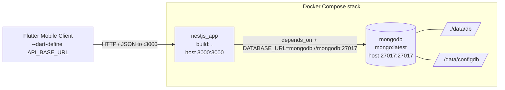

# PantryChef Deployment Guide

This guide takes you from a clean machine to a running PantryChef system. It is a
**how-to guide**: follow the numbered steps in order. The fastest path is the
two-service Docker Compose stack — a MongoDB container plus the NestJS API
container — after which you seed the database, optionally wire up Google Cloud
Vision, and build the Flutter client against your chosen API base URL.

PantryChef is a monorepo with a `backend/` NestJS 10 service and a `mobile/`
Flutter client (`Source: backend/package.json:L26-L28`,
`Source: mobile/pubspec.yaml:L22`). This document is **additive** — it
records the system exactly as built, including insecure defaults that ship in
the repository. Those defaults are flagged with `SECURITY NOTE:` callouts and
are **documented, not changed**. For the system design behind these steps, see
[./ARCHITECTURE.md](./ARCHITECTURE.md).

## Table of Contents

- [1. Prerequisites](#1-prerequisites)
- [2. Environment Variables](#2-environment-variables)
- [3. Docker Compose Bring-Up](#3-docker-compose-bring-up)
- [4. Database Seeding](#4-database-seeding)
- [5. Google Cloud Vision Setup](#5-google-cloud-vision-setup)
- [6. Mobile Build and API Base URL](#6-mobile-build-and-api-base-url)
- [7. Security: Default Credentials and Exposures](#7-security-default-credentials-and-exposures)
- [8. Compose Topology Diagram](#8-compose-topology-diagram)
- [9. Related Documentation](#9-related-documentation)

## 1. Prerequisites

Install the following before you begin. The Docker path (Section 3) is the
recommended quick start and needs only Docker; the Node and Flutter toolchains
are required for local non-Docker runs and for building the mobile client.

| Tool | Version / Notes | Why it is needed |
|------|-----------------|------------------|
| Docker Engine + Docker Compose | Any recent release supporting Compose file `version: '3.8'` (`Source: backend/docker-compose.yml:L1`) | Brings up the MongoDB + NestJS stack with a single command |
| Node.js | `node:20-alpine` is what the backend container builds on (`Source: backend/Dockerfile:L1`) | Required only for local, non-Docker backend runs |
| NestJS toolchain | NestJS 10 with `@nestjs/cli` ^10.0.0; build via `nest build`, run via `nest start` (`Source: backend/package.json:L9,L11`, `Source: backend/package.json:L47`) | Compiles and runs the API outside Docker |
| Flutter / Dart SDK | Dart SDK constraint `^3.5.1` (`Source: mobile/pubspec.yaml:L22`) | Builds and runs the mobile client |

The backend image is a development-style container: it runs `npm i && npm run
dev` on startup, where `dev` is `nest start --watch`
(`Source: backend/Dockerfile:L13`, `Source: backend/package.json:L12`). It is
intended for local development, not as a hardened production image.

> SECURITY NOTE: The shipped configuration uses development defaults throughout
> (default database credentials, predictable JWT secrets, an unauthenticated AI
> endpoint). Review [Section 7](#7-security-default-credentials-and-exposures)
> and change every default before any non-local deployment.

## 2. Environment Variables

The backend reads its configuration from a `.env` file. Copy the template first
(see [Section 3](#3-docker-compose-bring-up)), then adjust values as needed. The
table below lists every key in the template `env_example`, with the value shipped
in the repository (`Source: backend/env_example:L1-L23`).

| Variable | Example value | Purpose |
|----------|---------------|---------|
| `NODE_ENV` | `development` | Node runtime environment (`Source: backend/env_example:L1`) |
| `APP_PORT` | `3000` | Port the NestJS app listens on; matches the published container port `3000:3000` (`Source: backend/env_example:L2`, `Source: backend/docker-compose.yml:L24-L25`) |
| `APP_NAME` | `"NestJS API"` | Application name used in bootstrap/metadata (`Source: backend/env_example:L3`) |
| `API_PREFIX` | `api` | Global route prefix; routes are served under `/api/*` with no `/v1/` segment because `enableVersioning()` is never called (`Source: backend/env_example:L4`, `Source: backend/src/main.ts:L26-L35`, see [./API_REFERENCE.md](./API_REFERENCE.md)) |
| `DATABASE_TYPE` | `mongodb` | Persistence engine selector (`Source: backend/env_example:L6`) |
| `DATABASE_PORT` | `27017` | MongoDB port; matches the published container port `27017:27017` (`Source: backend/env_example:L7`, `Source: backend/docker-compose.yml:L11-L12`) |
| `DATABASE_USERNAME` | `admin` | MongoDB username — default credential (`Source: backend/env_example:L8`) |
| `DATABASE_PASSWORD` | `123456` | MongoDB password — default credential (`Source: backend/env_example:L9`) |
| `DATABASE_NAME` | `blitzy` | Database name (`Source: backend/env_example:L10`) |
| `DATABASE_URL` | `mongodb://localhost:27017` | Mongo connection string; inside Compose it is overridden to `mongodb://mongodb:27017` (`Source: backend/env_example:L11`, `Source: backend/docker-compose.yml:L29`) |
| `FILE_DRIVER` | `local` | File storage driver; supports `local`, `s3`, `s3-presigned` (`Source: backend/env_example:L13-L14`) |
| `ACCESS_KEY_ID` | _(blank)_ | AWS access key, used when `FILE_DRIVER` is an S3 mode (`Source: backend/env_example:L15`) |
| `SECRET_ACCESS_KEY` | _(blank)_ | AWS secret key, used when `FILE_DRIVER` is an S3 mode (`Source: backend/env_example:L16`) |
| `AWS_S3_REGION` | _(blank)_ | AWS S3 region (`Source: backend/env_example:L17`) |
| `AWS_DEFAULT_S3_BUCKET` | _(blank)_ | AWS S3 bucket name (`Source: backend/env_example:L18`) |
| `AUTH_JWT_SECRET` | `secret` | Signing secret for access tokens — default credential (`Source: backend/env_example:L20`) |
| `AUTH_JWT_TOKEN_EXPIRES_IN` | `15m` | Access-token lifetime (15 minutes) (`Source: backend/env_example:L21`) |
| `AUTH_REFRESH_SECRET` | `secret_for_refresh` | Signing secret for refresh tokens — default credential (`Source: backend/env_example:L22`) |
| `AUTH_REFRESH_TOKEN_EXPIRES_IN` | `3650d` | Refresh-token lifetime (3650 days) (`Source: backend/env_example:L23`) |

> SECURITY NOTE: `DATABASE_USERNAME`/`DATABASE_PASSWORD` (`admin`/`123456`) and
> the JWT secrets (`secret`, `secret_for_refresh`) are insecure defaults shipped
> for local development. They are documented here exactly as they appear in the
> repository and **must be changed** before any shared or production deployment —
> see [Section 7](#7-security-default-credentials-and-exposures).

## 3. Docker Compose Bring-Up

The repository ships a two-service Compose stack: a `mongodb` service and a
`nestjs` service (`Source: backend/docker-compose.yml:L3-L29`). The `nestjs`
service declares `depends_on: mongodb`, so Compose starts the database first
(`Source: backend/docker-compose.yml:L21-L22`).

**The two services**

- **`mongodb`** — image `mongo:latest`, container name `mongodb`,
  `restart: unless-stopped`, root credentials `admin` / `123456`, host port
  `27017:27017`, and persistent volumes `./data/db:/data/db` and
  `./data/configdb:/data/configdb`
  (`Source: backend/docker-compose.yml:L4-L15`).
- **`nestjs`** — `build: .` (uses `backend/Dockerfile`), container name
  `nestjs_app`, `restart: unless-stopped`, `env_file: ./.env`, host port
  `3000:3000`, bind mount `./:/home/node/app`, and an inline
  `environment: DATABASE_URL: mongodb://mongodb:27017`
  (`Source: backend/docker-compose.yml:L17-L29`).

The inline `DATABASE_URL` on the `nestjs` service overrides the `.env` value so
the app reaches Mongo over the Compose network by service name (`mongodb`)
rather than `localhost` (`Source: backend/docker-compose.yml:L29`,
`Source: backend/env_example:L11`).

The `nestjs` container is built from `backend/Dockerfile`: `FROM node:20-alpine`,
runs as `USER node`, `WORKDIR /home/node/app`, sets `ENV HOST=0.0.0.0 PORT=3000`,
`EXPOSE ${PORT}`, and finally `CMD npm i && npm run dev` — installing
dependencies and launching `nest start --watch` on every start
(`Source: backend/Dockerfile:L1-L13`, `Source: backend/package.json:L12`).
Because of the `./:/home/node/app` bind mount, the container runs against your
working-tree source (`Source: backend/docker-compose.yml:L26-L27`).

**Quick start (canonical steps)**

Run these from the `backend/` directory. They mirror the substance of the
existing project README (`Source: backend/README.md:L1-L19`).

1. Copy the environment template to `.env` (the `nestjs` service loads
   `./.env`) (`Source: backend/README.md:L5`,
   `Source: backend/docker-compose.yml:L23`):

   ```bash
   cp env_example .env
   ```

2. Seed the database (details in [Section 4](#4-database-seeding))
   (`Source: backend/README.md:L121`):

   ```bash
   npm run seed:run:document
   ```

3. Bring up the stack (`Source: backend/README.md:L13`):

   ```bash
   docker-compose up
   ```

After `docker-compose up`, the API is reachable on the host at
`http://localhost:3000` and MongoDB on `localhost:27017`
(`Source: backend/docker-compose.yml:L24-L25,L11-L12`). The API serves its
routes under the `/api` prefix (`Source: backend/env_example:L4`); see
[./API_REFERENCE.md](./API_REFERENCE.md) for the full surface and the Swagger UI
location.

> Note on ordering: copy `.env` first so the `nestjs` service has its
> `env_file` present. Seeding (`npm run seed:run:document`) connects using the
> `.env` `DATABASE_URL`; run it against a reachable MongoDB — either start the
> `mongodb` service first (`docker-compose up mongodb`) or point `DATABASE_URL`
> at a local Mongo instance before seeding
> (`Source: backend/docker-compose.yml:L29`, `Source: backend/env_example:L11`).

**Running the backend without Docker (optional)**

If you prefer a local Node run instead of the container, ensure a MongoDB
instance is reachable at your `.env` `DATABASE_URL`, then use the NestJS scripts
(`Source: backend/package.json:L9-L14`):

```bash
npm install
npm run start        # nest start
# or, with file watching:
npm run dev          # nest start --watch
# production build + run:
npm run build        # nest build
npm run start:prod   # node dist/main
```

See [../backend/README.md](../backend/README.md) for the backend project
overview.

## 4. Database Seeding

Seed reference data with the document seeder
(`Source: backend/README.md:L121`, `Source: backend/package.json:L16`):

```bash
npm run seed:run:document
```

This script resolves to `ts-node -r tsconfig-paths/register
./src/database/seeds/run-seed.ts`, so it runs the TypeScript seeder directly via
`ts-node` (`Source: backend/package.json:L16`). It connects using the
`.env` `DATABASE_URL`, so make sure MongoDB is reachable before running it:
bring up only the database first with `docker-compose up mongodb`, or run the
seeder against a local Mongo whose URL matches `.env`
(`Source: backend/docker-compose.yml:L4-L15`, `Source: backend/env_example:L11`).

For the entities created by seeding and their relationships, see
[./DATA_MODELS.md](./DATA_MODELS.md).

## 5. Google Cloud Vision Setup

The AI ingredient-recognition feature uses Google Cloud Vision and is
**optional** — the stack runs without it; only image recognition is disabled
when the key is absent.

**Provisioning the key** (`Source: backend/README.md:L16-L19`):

1. Enable the Cloud Vision API in your Google Cloud project.
2. Create a service-account key file for that project.
3. Rename the downloaded key file to `ai.json`.
4. Copy it to `backend/src/config/ai.json`.

**Graceful degradation when the key is absent.** On startup, `AiService`
resolves the key path with `path.join(__dirname, '../config/ai.json')` and
checks `existsSync`; if the file is missing it logs an error and sets
`isGoogleVisionEnabled = false` (`Source: backend/src/ai/ai.service.ts:L70-L76`).
When Vision is disabled, `detectIngredientsFromBuffer` returns an empty object
`{}` instead of throwing, so `POST /api/ai/vision` still responds without
crashing — it simply returns no detected ingredients
(`Source: backend/src/ai/ai.service.ts:L104-L106`).

Because the key is optional, you can defer this step entirely for a local stack
that does not need image recognition. For the endpoint contract see
[./API_REFERENCE.md](./API_REFERENCE.md), and for the module internals see the
AI module source at [`backend/src/ai/`](../backend/src/ai/).

> SECURITY NOTE: `POST /api/ai/vision` has no JWT guard and accepts uploads up
> to 10 MB; see [Section 7](#7-security-default-credentials-and-exposures).


## 6. Mobile Build and API Base URL

The Flutter client targets a single, compile-time API base URL.
`EnvConfig.apiBaseUrl` is defined as
`String.fromEnvironment('API_BASE_URL', defaultValue:
'http://192.168.2.20:3000/api')` (`Source: mobile/lib/env_config.dart:L19`). The
default points at a LAN IP and already includes the `/api` prefix, so override
it to match your backend host.

**Build and run steps** (run from the `mobile/` directory):

1. Fetch packages:

   ```bash
   flutter pub get
   ```

2. Generate code for the `@JsonSerializable` models (via `json_serializable`
   ^6.7.1 and `build_runner` ^2.4.6)
   (`Source: mobile/pubspec.yaml:L62-L63`):

   ```bash
   dart run build_runner build --delete-conflicting-outputs
   ```

3. Run (or build) with the API base URL overridden through `--dart-define`:

   ```bash
   # Run on a connected device / emulator:
   flutter run --dart-define API_BASE_URL=http://<host>:3000/api

   # Build a release APK with the same override:
   flutter build apk --dart-define API_BASE_URL=http://<host>:3000/api
   ```

Replace `<host>` with an address reachable from the device or emulator: a LAN IP
(for a physical device on the same network) or `10.0.2.2` for the Android
emulator to reach the host machine's `localhost`. Keep the trailing `/api`
prefix so requests resolve under the backend's global prefix
(`Source: mobile/lib/env_config.dart:L19`, `Source: backend/env_example:L4`).

If you omit `--dart-define`, the client falls back to the default
`http://192.168.2.20:3000/api` (`Source: mobile/lib/env_config.dart:L19`). For the
mobile project overview and run details, see
[../mobile/README.md](../mobile/README.md).

## 7. Security: Default Credentials and Exposures

The repository ships development defaults that are insecure for any shared or
production environment. They are documented here exactly as they appear in
source and are **not** modified by this guide. Address each before deploying.

> SECURITY NOTE: **Default database credentials.** The MongoDB root credentials
> are `admin` / `123456`, present in both the environment template
> (`Source: backend/env_example:L8-L9`) and the Compose file
> (`Source: backend/docker-compose.yml:L9-L10`). Change them before any
> non-local deployment, and update `DATABASE_USERNAME`/`DATABASE_PASSWORD`
> accordingly.

> SECURITY NOTE: **Predictable JWT signing secrets.** The access-token secret is
> `AUTH_JWT_SECRET=secret` (`Source: backend/env_example:L20`) and the
> refresh-token secret is `AUTH_REFRESH_SECRET=secret_for_refresh`
> (`Source: backend/env_example:L22`). These literal, guessable secrets must be
> rotated to strong random values before deployment.

> SECURITY NOTE: **Unauthenticated AI endpoint.** `POST /api/ai/vision` is
> declared with `@Controller('ai')` and `@Post('vision')` and carries no JWT
> guard (`Source: backend/src/ai/ai.controller.ts:L26-L43`); it accepts image
> uploads up to 10 MB (`Source: backend/src/ai/ai.controller.ts:L59`). Expose it
> with care — place it behind authentication or a gateway before any public
> deployment. See [./API_REFERENCE.md](./API_REFERENCE.md).

> SECURITY NOTE: **Bearer tokens in mobile logs.** The mobile Dio client attaches
> a `LogInterceptor` with `requestHeader: true` in all builds, which logs the
> `Authorization` bearer token (`Source: mobile/lib/core/utils/dio_client.dart:L42-L53,L99-L111`).
> This detail is covered in [./ARCHITECTURE.md](./ARCHITECTURE.md); avoid
> shipping verbose logs in release builds.

## 8. Compose Topology Diagram

The diagram below summarizes the Docker Compose stack: the Flutter client
reaches the `nestjs_app` container on host port `3000`, which talks to the
`mongodb` container on the Compose network via
`DATABASE_URL=mongodb://mongodb:27017`, while Mongo persists to the named host
volumes `./data/db` and `./data/configdb`.



_Diagram source: `backend/docker-compose.yml:L4-L29`._

## 9. Related Documentation

- [./ARCHITECTURE.md](./ARCHITECTURE.md) — system design, layered/clean
  architecture, and the bootstrap sequence behind these deployment steps.
- [./API_REFERENCE.md](./API_REFERENCE.md) — every REST endpoint, the `/api`
  base path (no `/v1/` segment), and the Swagger UI location.
- [./DATA_MODELS.md](./DATA_MODELS.md) — Mongoose entities and Dart models seeded
  and served by the stack.
- [../backend/README.md](../backend/README.md) — backend project overview and
  local development.
- [../mobile/README.md](../mobile/README.md) — mobile project overview, run
  steps, and the `--dart-define API_BASE_URL` override.
- [`backend/src/ai/`](../backend/src/ai/) — AI module source internals
  and the Google Cloud Vision `ai.json` workflow.

