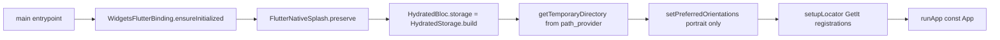

# PantryChef Mobile Client

## Module Purpose

The PantryChef mobile client is a Flutter app delivering pantry management and recipe discovery across Android, iOS, and Web. The package is `pantry_chef` v`1.0.0+1`, private, targeting the Flutter/Dart SDK `^3.5.1` (Source: `mobile/pubspec.yaml:L1,L5,L22`). It uses BLoC for state, HydratedBloc for persistence, GetIt for dependency injection, and Dio for HTTP. Five feature modules under `lib/features/` — `authentication`, `ingredient` (mobile-side correct spelling, versus the backend's verbatim-preserved `ingridient`), `pantry`, `profile`, and `recipe` — sit over a shared `lib/core/` infrastructure subtree.

## Key Components

| Path | Type | Responsibility |
| --- | --- | --- |
| `lib/main.dart` | Bootstrap | App entrypoint inside `runZonedGuarded`: binds the engine, preserves the splash, builds HydratedBloc storage, locks portrait, runs `setupLocator()`, and calls `runApp(const App())` (Source: `mobile/lib/main.dart:L23-L36`) |
| `lib/env_config.dart` | Compile-time Config | Exposes `EnvConfig.apiBaseUrl` via `String.fromEnvironment('API_BASE_URL', defaultValue: 'http://192.168.2.20:3000/api')` (Source: `mobile/lib/env_config.dart:L11`) |
| `lib/core/` | Shared Infrastructure | Cross-cutting layer: navigation, styles, constants, utils, presentation primitives, DTOs, shared domain models (see [`lib/core/README.md`](lib/core/README.md)) |
| `lib/features/authentication/` | Feature Module | Sign-in + sign-up flows, JWT token persistence (`lib/features/authentication/`; README pending a later checkpoint) |
| `lib/features/ingredient/` | Feature Module | Ingredient search, creation, AI-assisted camera capture (`lib/features/ingredient/`; README pending a later checkpoint) |
| `lib/features/pantry/` | Feature Module | User-scoped pantry CRUD with hydrated state (`lib/features/pantry/`; README pending a later checkpoint) |
| `lib/features/profile/` | Feature Module | Profile, preferences, favorites, logout (see [`lib/features/profile/README.md`](lib/features/profile/README.md)) |
| `lib/features/recipe/` | Feature Module | Recipe browsing, detail, pantry-aware matching, favorites (see [`lib/features/recipe/README.md`](lib/features/recipe/README.md)) |
| `pubspec.yaml` | Manifest | Package identity `pantry_chef` v1.0.0+1, SDK `^3.5.1`, runtime + dev dependencies, launcher-icon config (Source: `mobile/pubspec.yaml:L1-L77`) |
| `analysis_options.yaml` | Lint Policy | Inherits `package:flutter_lints/flutter.yaml`, excludes `**/*.g.dart`, elevates five diagnostics to errors (Source: `mobile/analysis_options.yaml:L10-L20`) |
| `flutter_native_splash.yaml` | Build Config | Splash generation for Android + iOS; image `assets/logo.png`, white background (Source: `mobile/flutter_native_splash.yaml:L1-L8`) |
| `i10n.yaml` | Build Config | Localization codegen; reads ARB files from `lib/l10n`, template `app_en.arb`, output `app_localizations.dart` (Source: `mobile/i10n.yaml:L1-L4`) |
| `android/`, `ios/`, `web/` | Platform Hosts | Native platform scaffolding (Gradle, Xcode, PWA bootstrap) — out of scope for this documentation pass |
| `test/widget_test.dart` | Widget Test | Default counter smoke test from the Flutter scaffold — minimal coverage |

## Architecture Fit

The client follows **clean architecture per feature**: each feature splits into `domain/` (contracts, use cases, entities), `data/` (Dio clients, DTOs, repository implementations), and `presentation/` (BLoC, screens, widgets). The shared `lib/core/` layer supplies the cross-cutting infrastructure every feature uses — `dio_client.dart` for authenticated HTTP, `service_locator.dart` for GetIt, `shared_preferences_helper.dart` for JWT persistence, and `navigation.dart` for routes. On a `401`, `DioClient` refreshes via `POST /api/auth/refresh` and retries. See [`../ARCHITECTURE.md`](../ARCHITECTURE.md) for the full request path.

## Dependencies

### Internal

Shared primitives every feature imports from `lib/core/`:

- `core/utils/dio_client.dart` — Dio client with the JWT interceptor and refresh flow.
- `core/utils/service_locator.dart` — `setupLocator()` GetIt registrations.
- `core/utils/shared_preferences_helper.dart` — typed `SharedPreferences` wrapper for tokens.
- `core/constants/endpoints.dart` — backend endpoint path constants.
- `core/constants/navigation.dart` — named routes, including `singup` (spelling preserved verbatim — `navigation.dart:L28`).
- `core/navigation.dart` — route resolution.

### External

Runtime dependencies, versions verbatim from `mobile/pubspec.yaml:L30-L56`:

| Package | Version | Purpose |
| --- | --- | --- |
| `flutter` | sdk: flutter | Flutter SDK |
| `flutter_platform_widgets` | ^7.0.1 | Platform-adaptive widget abstractions |
| `get_it` | ^8.0.2 | Dependency injection service locator |
| `shared_preferences` | ^2.3.2 | Persistent key/value storage for JWT tokens |
| `flutter_localizations` | sdk: flutter | Built-in localization |
| `bloc` | ^8.1.4 | Core BLoC pattern |
| `flutter_bloc` | ^8.1.6 | Flutter bindings for BLoC |
| `json_annotation` | ^4.9.0 | JSON serialization annotations (generated `.g.dart` excluded from DartDoc) |
| `equatable` | ^2.0.5 | Value equality for BLoC events/states |
| `loader_overlay` | ^4.0.3 | Global loading overlay |
| `hydrated_bloc` | ^9.1.5 | BLoC state persistence via `HydratedStorage` |
| `shimmer` | ^3.0.0 | Skeleton loading animations |
| `cached_network_image` | ^3.4.1 | Image caching for recipe/ingredient thumbnails |
| `camera` | ^0.11.0+2 | Photo capture for AI ingredient recognition |
| `flutter_native_splash` | ^2.4.2 | Native splash screen generation |
| `path` | ^1.8.3 | Path manipulation utilities |
| `path_provider` | ^2.1.5 | Filesystem path resolution (HydratedBloc temp dir) |
| `dio` | ^5.7.0 | HTTP client with interceptor chain |
| `grouped_list` | ^6.0.0 | Grouped list rendering for ingredient browsing |
| `cupertino_icons` | ^1.0.8 | iOS-style icon set |
| `intl` | any | Internationalization formatting |

### Development

Dev dependencies from `mobile/pubspec.yaml:L58-L76`:

| Package | Version | Purpose |
| --- | --- | --- |
| `flutter_test` | sdk: flutter | Widget testing |
| `flutter_launcher_icons` | ^0.14.1 | Launcher icon generation |
| `json_serializable` | ^6.7.1 | Codegen for JSON DTOs (`*.g.dart`, excluded from DartDoc) |
| `build_runner` | ^2.4.6 | Codegen driver |
| `flutter_lints` | ^4.0.0 | Lint rule set consumed via `analysis_options.yaml` |

## Primary Use Cases

- **App bootstrap** — `main()` runs async steps in `runZonedGuarded`: bind engine → preserve splash → build `HydratedBloc.storage` → lock portrait → `setupLocator()` → `runApp` (Source: `mobile/lib/main.dart:L23-L32`).
- **Authentication** — sign up via `Navigation.singup` (spelling preserved verbatim), log in, persist JWT access + refresh tokens, auto-refresh on `401`.
- **Pantry management** — add items manually or via camera, edit, and browse a hydrated list of `PantryIngridient` records (spelling preserved verbatim).
- **Recipe browsing and matching** — list and filter recipes, request matches via `GET /api/recipe/matches`, view detail using `InstractionItem` from `instraction_item.dart` (spelling preserved verbatim), toggle favorite (see [`lib/features/recipe/README.md`](lib/features/recipe/README.md)).
- **AI ingredient capture** — photograph an item, upload to `POST /api/ai/vision`, confirm the label-detection result, persist.
- **Profile** — edit preferences, allergies, disliked ingredients, cooking time; sync favorites; log out via `POST /api/auth/logout` (see [`lib/features/profile/README.md`](lib/features/profile/README.md)).

## API / Endpoint Reference

This mobile-side reference lists the **backend endpoints consumed** by the client. All paths use the global prefix `/api`; the backend never calls `app.enableVersioning()`, so **no `/v1` segment exists today** despite the controllers' `version: '1'` metadata.

| Method | Path | Consumed By |
| --- | --- | --- |
| `POST` | `/api/auth/email/login` | `lib/features/authentication/` |
| `POST` | `/api/auth/email/register` | `lib/features/authentication/` |
| `GET` | `/api/auth/me` | `lib/features/authentication/`, `lib/features/profile/` |
| `POST` | `/api/auth/refresh` | `lib/core/utils/dio_client.dart` (interceptor on 401) |
| `POST` | `/api/auth/logout` | `lib/features/authentication/`, `lib/features/profile/` |
| `PATCH` | `/api/users` | `lib/features/profile/` (`ProfileApi.updateProfile`) |
| `GET` | `/api/recipe` | `lib/features/recipe/` |
| `GET` | `/api/recipe/matches` | `lib/features/recipe/` (pantry-aware matching) |
| `GET` | `/api/recipe/:id` | `lib/features/recipe/` |
| `GET` | `/api/pantry` | `lib/features/pantry/` |
| `POST` | `/api/pantry` | `lib/features/pantry/` |
| `PATCH` | `/api/pantry/:id` | `lib/features/pantry/` |
| `DELETE` | `/api/pantry/:id` | `lib/features/pantry/` |
| `GET` | `/api/ingredient/creation-data` | `lib/features/ingredient/` (categories + units reference data) |
| `GET` | `/api/ingredient` | `lib/features/ingredient/` |
| `POST` | `/api/ingredient` | `lib/features/ingredient/` |
| `POST` | `/api/ai/vision` | `lib/features/ingredient/` (multipart image upload; **endpoint is unguarded** — see Known Limitations) |

## Data Flows

The diagram traces the startup steps `main()` runs inside `runZonedGuarded` before the first frame (Source: `mobile/lib/main.dart:L23-L32`); each depends on the binding, storage, and DI established earlier. After `App` mounts, transitions dispatch through `Navigation.<route>` named routes resolved by `core/navigation.dart` (see [`../ARCHITECTURE.md`](../ARCHITECTURE.md)).



## Configuration

The client is configured at **compile time** through Dart's `--dart-define`; the only runtime configuration is user input. There is no `.env` on mobile — the env-driven half of the system is the backend (see [`../PRODUCTION_READINESS.md`](../PRODUCTION_READINESS.md)). The key value is `API_BASE_URL`, read once into a compile-time constant:

```dart
// Source: mobile/lib/env_config.dart:L5,L11
class EnvConfig {
  static const String apiBaseUrl = String.fromEnvironment('API_BASE_URL', defaultValue: 'http://192.168.2.20:3000/api');
}
```

| Variable | Default | Purpose |
| --- | --- | --- |
| `API_BASE_URL` | `http://192.168.2.20:3000/api` | Backend root URL — production must override |

Build commands:

```bash
# Development against the local backend on host 192.168.2.20
flutter run

# Override for staging
flutter run --dart-define=API_BASE_URL=https://staging.pantry-chef.com/api

# Release builds for production
flutter build apk --release --dart-define=API_BASE_URL=https://api.pantry-chef.com/api
flutter build ios --release --dart-define=API_BASE_URL=https://api.pantry-chef.com/api
flutter build web --release --dart-define=API_BASE_URL=https://api.pantry-chef.com/api
```

### Build-time Codegen

| Tool | Config | Output |
| --- | --- | --- |
| `flutter_native_splash` | `flutter_native_splash.yaml` | Native splash screens for Android + iOS (web disabled) |
| `flutter_launcher_icons` | `pubspec.yaml:L65-L69` | Launcher icons (Android `launcher_icon`, iOS `true`, min-SDK 21) |
| `flutter gen-l10n` | `i10n.yaml` | `app_localizations.dart` from `lib/l10n/app_en.arb` |
| `build_runner` + `json_serializable` | `pubspec.yaml:L62-L63` | `*.g.dart` JSON DTO serializers |

```bash
flutter pub run flutter_native_splash:create
flutter pub run flutter_launcher_icons
flutter pub run build_runner build --delete-conflicting-outputs
flutter gen-l10n
```

### Lint Policy

`flutter_lints` ^4.0.0 with five diagnostics elevated to errors; generated `**/*.g.dart` files are excluded from analysis (Source: `mobile/analysis_options.yaml:L14`).

| Lint Rule | Severity | Source |
| --- | --- | --- |
| `require_trailing_commas` | error | `mobile/analysis_options.yaml:L16` |
| `always_use_package_imports` | error | `mobile/analysis_options.yaml:L17` |
| `avoid_dynamic_calls` | error | `mobile/analysis_options.yaml:L18` |
| `avoid_print` | error | `mobile/analysis_options.yaml:L19` |
| `cancel_subscriptions` | error | `mobile/analysis_options.yaml:L20` |

## Known Limitations and Implementation Gaps

> ⚠️ **API base URL default is a LAN IP** — `EnvConfig.apiBaseUrl` defaults to `http://192.168.2.20:3000/api` (Source: `mobile/lib/env_config.dart:L11`), unreachable off the developer's network. Production builds MUST override it via `--dart-define=API_BASE_URL=...`.

> ⚠️ **No API versioning today** — routes resolve under `/api` (e.g. `/api/recipe/matches`), not `/api/v1`; the backend never calls `app.enableVersioning()`, so `version: '1'` is inert.

> ⚠️ **Preserved spelling variants** — stable identifiers that must NOT be corrected: `singup` (route — `navigation.dart:L28`), `InstractionItem` (`instraction_item.dart:L13`), and `ingridientList` (`Recipe` field — `recipe.dart:L34`).

> ⚠️ **Mobile vs. backend spelling** — mobile uses correct `lib/features/ingredient/`; the backend uses verbatim-preserved `backend/src/ingridient/`. Both intentional; do not unify.

> ⚠️ **`Recipe.copyWith` no-op on `inFavorite`** — `recipe.dart:L92-L108` accepts an `inFavorite` parameter but never assigns it (no such field). Documented inline with `// NOTE:`/`// FIXME:`, not fixed here.

> ⚠️ **Hydrated state in the OS temp directory** — `HydratedBloc.storage` uses `getTemporaryDirectory()` (Source: `mobile/lib/main.dart:L27-L29`), so persisted state can be evicted under low storage. Treat it as a cache.

> ⚠️ **Minimal test coverage** — only the scaffold counter smoke test in `mobile/test/widget_test.dart`; no BLoC unit, golden, or integration tests.

## Production Readiness Status

> 🚧 See [`../PRODUCTION_READINESS.md`](../PRODUCTION_READINESS.md) for the complete checklist (❌/⚠️/✅) across eleven categories — **Mobile Release** is the primary section for this client.

> 🚧 **Mobile Release** (❌) — no Flutter release pipeline. Production builds require `flutter build apk --release --dart-define=API_BASE_URL=...` (and iOS + web); no Fastlane / Codemagic / Bitrise integration exists.

> 🚧 **Signing configs missing** — no Play Store keystore in `mobile/android/app/build.gradle` (debug only) and no App Store profile in `mobile/ios/Runner.xcodeproj`.

> 🚧 **PWA manifest placeholders** — `mobile/web/manifest.json` ships default scaffolding; review name, description, theme color, and icons before deployment.

> 🚧 **API base URL override required** — the default LAN IP is unreachable in production; every non-development build must inject `API_BASE_URL`.

> 🚧 **Schema-related blockers** — see [`../DATA_MODEL.md`](../DATA_MODEL.md); the client mirrors the backend schemas, including the preserved spellings above.
