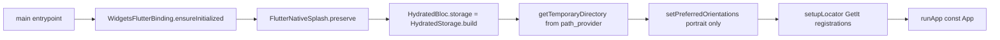

# PantryChef Mobile Client

## Module Purpose

The PantryChef mobile client is a Flutter application that delivers a unified pantry-management and recipe-discovery experience across Android, iOS, and Web. The package is identified as `pantry_chef` version `1.0.0+1` (Source: `mobile/pubspec.yaml:L1,L19`) and is private, marked `publish_to: 'none'` (Source: `mobile/pubspec.yaml:L5`). It targets the Flutter/Dart SDK `^3.5.1` (Source: `mobile/pubspec.yaml:L22`) and relies on BLoC for state management, HydratedBloc for state persistence, GetIt for dependency injection, and Dio for HTTP communication with the PantryChef NestJS backend. Five feature modules live under `lib/features/` — `authentication`, `ingredient` (mobile-side correct spelling, in deliberate contrast to the backend's verbatim-preserved `ingridient` module), `pantry`, `profile`, and `recipe` — while a shared `lib/core/` subtree supplies navigation, theme tokens, constants, utilities, the DI service locator, and HTTP plumbing.

## Key Components

| Path | Type | Responsibility |
| --- | --- | --- |
| `lib/main.dart` | Bootstrap | Application entrypoint inside `runZonedGuarded`: initializes the Flutter binding, preserves the splash, builds HydratedBloc storage, locks portrait orientation, runs `setupLocator()`, and calls `runApp(const App())` (Source: `mobile/lib/main.dart:L10-L23`) |
| `lib/env_config.dart` | Compile-time Config | Exposes `EnvConfig.apiBaseUrl` via `String.fromEnvironment('API_BASE_URL', defaultValue: 'http://192.168.2.20:3000/api')` (Source: `mobile/lib/env_config.dart:L2`) |
| `lib/core/` | Shared Infrastructure | Cross-cutting layer: navigation, styles, constants, utils, presentation primitives, DTOs, shared domain models (see [`lib/core/README.md`](lib/core/README.md)) |
| `lib/features/authentication/` | Feature Module | Sign-in + sign-up flows, JWT token persistence (see [`lib/features/authentication/README.md`](lib/features/authentication/README.md)) |
| `lib/features/ingredient/` | Feature Module | Ingredient search, creation, AI-assisted camera capture (see [`lib/features/ingredient/README.md`](lib/features/ingredient/README.md)) |
| `lib/features/pantry/` | Feature Module | User-scoped pantry CRUD with hydrated state (see [`lib/features/pantry/README.md`](lib/features/pantry/README.md)) |
| `lib/features/profile/` | Feature Module | Profile, preferences, favorites, logout (see [`lib/features/profile/README.md`](lib/features/profile/README.md)) |
| `lib/features/recipe/` | Feature Module | Recipe browsing, detail, pantry-aware matching, favorites (see [`lib/features/recipe/README.md`](lib/features/recipe/README.md)) |
| `pubspec.yaml` | Manifest | Package identity `pantry_chef` v1.0.0+1, SDK `^3.5.1`, runtime + dev dependencies, launcher-icon config (Source: `mobile/pubspec.yaml:L1-L77`) |
| `analysis_options.yaml` | Lint Policy | Inherits `package:flutter_lints/flutter.yaml`, excludes `**/*.g.dart`, elevates five diagnostics to errors (Source: `mobile/analysis_options.yaml:L10-L20`) |
| `flutter_native_splash.yaml` | Build Config | Splash generation for Android + iOS; image `assets/logo.png`, white background (Source: `mobile/flutter_native_splash.yaml:L1-L8`) |
| `i10n.yaml` | Build Config | Localization codegen; reads ARB files from `lib/l10n`, template `app_en.arb`, output `app_localizations.dart` (Source: `mobile/i10n.yaml:L1-L4`) |
| `android/`, `ios/`, `web/` | Platform Hosts | Native platform scaffolding (Gradle, Xcode, PWA bootstrap) — out of scope for this documentation pass |
| `test/widget_test.dart` | Widget Test | Default counter smoke test from the Flutter scaffold — minimal coverage |

## Architecture Fit

The mobile client follows a **clean architecture per feature**: each feature under `lib/features/` is split into `domain/` (repository contracts, use cases, and immutable entities), `data/` (Dio API clients, JSON DTOs, and repository implementations), and `presentation/` (BLoC plus screens and widgets). The shared `lib/core/` namespace provides the cross-cutting infrastructure that every feature depends upon — `core/utils/dio_client.dart` for authenticated HTTP, `core/utils/service_locator.dart` for GetIt registration, `core/utils/shared_preferences_helper.dart` for JWT token persistence, and `core/navigation.dart` for named-route resolution. The client talks to the NestJS backend using JWT access and refresh tokens; when a request returns `401`, `DioClient` transparently attempts a token refresh via `POST /api/v1/auth/refresh` and then retries the original request. See [`../ARCHITECTURE.md`](../ARCHITECTURE.md) for the full system request path (Flutter UI → BLoC → repository → DioClient → bearer JWT → NestJS → feature controller → MongoDB or Google Cloud Vision).

## Dependencies

### Internal

Every feature module imports the same cross-cutting primitives from `lib/core/`:

- `lib/core/utils/dio_client.dart` — Dio HTTP client wired with the JWT interceptor and refresh flow.
- `lib/core/utils/service_locator.dart` — `setupLocator()` GetIt registrations.
- `lib/core/utils/shared_preferences_helper.dart` — typed wrapper over `SharedPreferences` for tokens and persisted state.
- `lib/core/constants/endpoints.dart` — backend endpoint path constants.
- `lib/core/constants/navigation.dart` — named routes, including the `singup` route (spelling preserved verbatim — Source: `mobile/lib/core/constants/navigation.dart:L6`).
- `lib/core/navigation.dart` — named-route resolution.

### External

Runtime dependencies, with versions verbatim from `mobile/pubspec.yaml:L30-L56`:

| Package | Version | Purpose |
| --- | --- | --- |
| `flutter` | sdk: flutter | Flutter SDK |
| `flutter_platform_widgets` | ^7.0.1 | Platform-adaptive widget abstractions |
| `get_it` | ^8.0.2 | Dependency injection service locator |
| `shared_preferences` | ^2.3.2 | Persistent key/value storage for JWT tokens |
| `flutter_localizations` | sdk: flutter | Built-in localization |
| `bloc` | ^8.1.4 | Core BLoC pattern |
| `flutter_bloc` | ^8.1.6 | Flutter bindings for BLoC |
| `json_annotation` | ^4.9.0 | JSON serialization annotations (generated `.g.dart` files excluded from DartDoc) |
| `equatable` | ^2.0.5 | Value equality for BLoC events/states |
| `loader_overlay` | ^4.0.3 | Global loading overlay |
| `hydrated_bloc` | ^9.1.5 | BLoC state persistence via `HydratedStorage` |
| `shimmer` | ^3.0.0 | Skeleton loading animations |
| `cached_network_image` | ^3.4.1 | Image caching for recipe/ingredient thumbnails |
| `camera` | ^0.11.0+2 | Photo capture for AI ingredient recognition |
| `flutter_native_splash` | ^2.4.2 | Native splash screen generation |
| `path` | ^1.8.3 | Path manipulation utilities |
| `path_provider` | ^2.1.5 | Filesystem path resolution (HydratedBloc temp dir) |
| `dio` | ^5.7.0 | HTTP client with interceptor chain |
| `grouped_list` | ^6.0.0 | Grouped list rendering for ingredient browsing |
| `cupertino_icons` | ^1.0.8 | iOS-style icon set |
| `intl` | any | Internationalization formatting |

### Development

Dev dependencies from `mobile/pubspec.yaml:L58-L76`:

- `flutter_test` (sdk: flutter) — widget testing (Source: `mobile/pubspec.yaml:L59-L60`).
- `flutter_launcher_icons` ^0.14.1 — launcher icon generation (Source: `mobile/pubspec.yaml:L61`).
- `json_serializable` ^6.7.1 — codegen for JSON DTOs, producing `*.g.dart` files that are excluded from inline DartDoc (Source: `mobile/pubspec.yaml:L62`).
- `build_runner` ^2.4.6 — codegen driver (Source: `mobile/pubspec.yaml:L63`).
- `flutter_lints` ^4.0.0 — lint rule set consumed via `analysis_options.yaml` (Source: `mobile/pubspec.yaml:L76`).

## Primary Use Cases

- **App bootstrap** — `main()` runs five sequential async steps inside `runZonedGuarded`: `WidgetsFlutterBinding.ensureInitialized()` → `FlutterNativeSplash.preserve(widgetsBinding: widgetsBinding)` → build `HydratedBloc.storage` via `HydratedStorage.build(storageDirectory: await getTemporaryDirectory())` → `setPreferredOrientations()` (portrait lock) → `setupLocator()` → `runApp(const App())` (Source: `mobile/lib/main.dart:L11-L19`).
- **Authentication** — sign up through the `Navigation.singup` route (spelling preserved verbatim), log in, persist JWT access + refresh tokens, and auto-refresh on `401` (see [`lib/features/authentication/README.md`](lib/features/authentication/README.md)).
- **Pantry management** — add items manually or via camera capture, edit them, and browse a hydrated list of `PantryIngridient` records (spelling preserved verbatim from the backend; the mobile client mirrors backend field names) (see [`lib/features/pantry/README.md`](lib/features/pantry/README.md)).
- **Recipe browsing and matching** — list recipes, filter by tags, request pantry-aware matches via `GET /api/v1/recipe/matches`, and view detail whose `instructions[]` use the `InstractionItem` class from `instraction_item.dart` (spelling preserved verbatim), then toggle favorite (see [`lib/features/recipe/README.md`](lib/features/recipe/README.md)).
- **AI-assisted ingredient capture** — open the camera, take a photo, upload it to `POST /api/v1/ai/vision`, receive label-detection results, then confirm and persist (see [`lib/features/ingredient/README.md`](lib/features/ingredient/README.md)).
- **Profile and preferences** — update dietary preferences, allergies, disliked ingredients, and cooking time; synchronize favorite recipes; and log out via `POST /api/v1/auth/logout` (see [`lib/features/profile/README.md`](lib/features/profile/README.md)).

## API / Endpoint Reference

This is a mobile-side document, so the reference below lists the **backend endpoints consumed** by the client; the authoritative endpoint definitions live in each `backend/src/<module>/README.md`. All paths are served under the backend global prefix `/api/v1`.

| Method | Path | Consumed By |
| --- | --- | --- |
| `POST` | `/api/v1/auth/email/login` | `lib/features/authentication/` |
| `POST` | `/api/v1/auth/email/register` | `lib/features/authentication/` |
| `GET` | `/api/v1/auth/me` | `lib/features/authentication/`, `lib/features/profile/` |
| `POST` | `/api/v1/auth/refresh` | `lib/core/utils/dio_client.dart` (interceptor on 401) |
| `POST` | `/api/v1/auth/logout` | `lib/features/authentication/`, `lib/features/profile/` |
| `PATCH` | `/api/v1/auth/me` | `lib/features/profile/` |
| `DELETE` | `/api/v1/auth/me` | `lib/features/profile/` |
| `GET` | `/api/v1/recipe` | `lib/features/recipe/` |
| `GET` | `/api/v1/recipe/matches` | `lib/features/recipe/` (pantry-aware matching) |
| `GET` | `/api/v1/recipe/:id` | `lib/features/recipe/` |
| `GET` | `/api/v1/pantry` | `lib/features/pantry/` |
| `POST` | `/api/v1/pantry` | `lib/features/pantry/` |
| `PATCH` | `/api/v1/pantry/:id` | `lib/features/pantry/` |
| `DELETE` | `/api/v1/pantry/:id` | `lib/features/pantry/` |
| `GET` | `/api/v1/ingredient/creation-data` | `lib/features/ingredient/` (categories + units reference data) |
| `GET` | `/api/v1/ingredient` | `lib/features/ingredient/` |
| `POST` | `/api/v1/ingredient` | `lib/features/ingredient/` |
| `POST` | `/api/v1/ai/vision` | `lib/features/ingredient/` (multipart image upload; **endpoint is unguarded** — see Known Limitations) |

## Data Flows

The diagram below traces the sequential startup steps executed by `main()` inside `runZonedGuarded` before the first widget is rendered (Source: `mobile/lib/main.dart:L11-L19`). Each step must complete before the next begins because later steps depend on the binding, storage, and DI registrations established earlier.



Once the `App` widget mounts, screen transitions are dispatched through `Navigation.<route>` named routes declared in `core/constants/navigation.dart` and resolved by `core/navigation.dart`. See [`../ARCHITECTURE.md`](../ARCHITECTURE.md) for the full end-to-end request path through the system (Flutter UI → BLoC → DioClient → bearer JWT → NestJS).

## Configuration

The mobile client is configured at **compile time** through Dart's `--dart-define` mechanism; the only runtime configuration is what the user enters through the UI (preferences, favorites, and so on). There is no `.env` file on the mobile side — the env-driven half of the system is the backend, documented in [`../PRODUCTION_READINESS.md`](../PRODUCTION_READINESS.md).

### Compile-time API Base URL

The single most important configuration is `API_BASE_URL`, read once into a compile-time constant:

```dart
// Source: mobile/lib/env_config.dart:L1-L3
class EnvConfig {
  static const String apiBaseUrl = String.fromEnvironment('API_BASE_URL', defaultValue: 'http://192.168.2.20:3000/api');
}
```

| Variable | Default | Purpose |
| --- | --- | --- |
| `API_BASE_URL` | `http://192.168.2.20:3000/api` | Backend root URL — production must override |

Build commands:

```bash
# Development against the local backend on host 192.168.2.20
flutter run

# Override for staging
flutter run --dart-define=API_BASE_URL=https://staging.pantry-chef.com/api

# Release builds for production
flutter build apk --release --dart-define=API_BASE_URL=https://api.pantry-chef.com/api
flutter build ios --release --dart-define=API_BASE_URL=https://api.pantry-chef.com/api
flutter build web --release --dart-define=API_BASE_URL=https://api.pantry-chef.com/api
```

### Build-time Codegen

| Tool | Config | Output |
| --- | --- | --- |
| `flutter_native_splash` | `flutter_native_splash.yaml` | Native splash screens for Android + iOS (web disabled) |
| `flutter_launcher_icons` | `pubspec.yaml:L65-L69` | Launcher icons (Android `launcher_icon`, iOS `true`, min-SDK 21) |
| `flutter gen-l10n` | `i10n.yaml` | `app_localizations.dart` from `lib/l10n/app_en.arb` |
| `build_runner` + `json_serializable` | `pubspec.yaml:L62-L63` | `*.g.dart` JSON DTO serializers |

Run codegen with:

```bash
flutter pub run flutter_native_splash:create
flutter pub run flutter_launcher_icons
flutter pub run build_runner build --delete-conflicting-outputs
flutter gen-l10n
```

### Lint Policy

The project uses `flutter_lints` ^4.0.0 with five diagnostics elevated to errors:

| Lint Rule | Severity | Source |
| --- | --- | --- |
| `require_trailing_commas` | error | `mobile/analysis_options.yaml:L16` |
| `always_use_package_imports` | error | `mobile/analysis_options.yaml:L17` |
| `avoid_dynamic_calls` | error | `mobile/analysis_options.yaml:L18` |
| `avoid_print` | error | `mobile/analysis_options.yaml:L19` |
| `cancel_subscriptions` | error | `mobile/analysis_options.yaml:L20` |

Generated `**/*.g.dart` files are excluded from analysis (Source: `mobile/analysis_options.yaml:L14`).

## Known Limitations and Implementation Gaps

> ⚠️ **API base URL default is a local LAN IP** — `EnvConfig.apiBaseUrl` defaults to `http://192.168.2.20:3000/api` (Source: `mobile/lib/env_config.dart:L2`). This is a developer's local machine IP that is unreachable from any other network. Production builds MUST override it via `--dart-define=API_BASE_URL=...`.

> ⚠️ **Preserved spelling variants** — the codebase intentionally retains the following non-standard spellings, which are stable identifiers and must NOT be corrected during this documentation pass:
> - `singup` (route name — Source: `mobile/lib/core/constants/navigation.dart:L6`)
> - `InstractionItem` (class name — Source: `mobile/lib/features/recipe/domain/models/instraction_item.dart:L6`)
> - `instraction_item.dart` (file name)
> - `ingridientList` (field name on the `Recipe` model mirroring the backend schema — Source: `mobile/lib/features/recipe/domain/models/recipe.dart:L12`)

> ⚠️ **Mobile vs. backend spelling divergence** — the mobile feature folder uses the CORRECT spelling `lib/features/ingredient/`, whereas the backend module uses the VERBATIM-PRESERVED spelling `backend/src/ingridient/`. Both spellings are intentional; do not unify them.

> ⚠️ **Default test coverage is minimal** — `mobile/test/widget_test.dart` contains only the Flutter scaffold counter smoke test. There are no BLoC unit tests, golden tests, or integration tests in the mobile project at this time.

> ⚠️ **`Recipe.copyWith` no-op on `inFavorite`** — `mobile/lib/features/recipe/domain/models/recipe.dart:L37-L53` accepts an `inFavorite` parameter but never assigns it (the `Recipe` entity has no such field). This is documented inline with `// NOTE:` and `// FIXME:` markers per the tag taxonomy and is NOT fixed in this pass.

> ⚠️ **Hydrated state lives in the OS temp directory** — `HydratedBloc.storage` is built over `getTemporaryDirectory()` (Source: `mobile/lib/main.dart:L14-L16`), so persisted BLoC state can be evicted by the operating system under low-storage conditions. Treat hydrated state as a cache, not durable storage.

## Production Readiness Status

> 🚧 See [`../PRODUCTION_READINESS.md`](../PRODUCTION_READINESS.md) for the complete production-readiness checklist with status indicators (❌/⚠️/✅) across eleven categories — the **Mobile Release** category is the primary section for this client.

> 🚧 **Build & Runtime — Mobile Release** (❌) — no Flutter release pipeline is configured. Production builds require `flutter build apk --release --dart-define=API_BASE_URL=...` and equivalents for iOS + web. No Fastlane / Codemagic / Bitrise integration exists.

> 🚧 **Signing configs missing** — no Play Store keystore is configured in `mobile/android/app/build.gradle` (only debug signing), and no App Store provisioning profile is wired in `mobile/ios/Runner.xcodeproj`. Both must be set up before store submission.

> 🚧 **PWA manifest values are placeholders** — `mobile/web/manifest.json` ships with default Flutter scaffolding values. Review the name, description, theme color, and icon variants before production deployment.

> 🚧 **API base URL override required** — see Known Limitations above; the default LAN IP is not reachable from any production environment, so every non-development build must inject `API_BASE_URL`.

> 🚧 **Schema-related blockers documented elsewhere** — refer to [`../DATA_MODEL.md`](../DATA_MODEL.md) for the canonical schema diagram; the mobile client mirrors the backend schemas, including the preserved spellings noted above.
