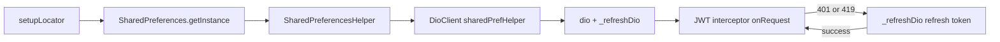

# core/ — Shared Infrastructure Layer

## Module Purpose

The `core/` directory is the cross-cutting shared infrastructure layer of the PantryChef Flutter mobile client (project `pantry_chef` v1.0.0+1 — Source: `mobile/pubspec.yaml:L1,L19`). It centralises what every feature needs but none owns: navigation (route resolution and route-name constants), theme tokens, application constants, HTTP and persistence utilities (`DioClient`, `SharedPreferencesHelper`, and the GetIt service locator), preference keys, shared widgets, shared DTOs, and shared domain models. Every feature module under `mobile/lib/features/` depends on this layer, while `core/` itself imports no feature module — that one-way dependency is the foundational direction of the whole client. The layer supplies primitives and wiring rather than user-facing screens.

## Key Components

| Path | Type | Responsibility |
|------|------|----------------|
| **`core/` (root)** | | |
| `core/navigation.dart` | Route Resolver | `onGenerateRoute(BuildContext, RouteSettings)` resolves `Navigation.*` named routes into platform-adaptive `platformPageRoute` instances via `flutter_platform_widgets`; provides typed `getArguments<T>()` and a safe fallback to `AuthenticationStart`. Source: `mobile/lib/core/navigation.dart:L17-L48`. |
| **`core/constants/`** | | |
| `constants/common.dart` | UI Constants | `CommonConstants`: `appName='PantryChef'`, `pagePadding=16.0`, `homeAppBarHeight=24`, `fetchScrollOffset=150`. Source: `mobile/lib/core/constants/common.dart:L4-L7`. |
| `constants/endpoints.dart` | API Endpoints | `Endpoints`: `apiBaseUrl`, `connectionTimeout=30s`, `receiveTimeout=15s`, plus full auth/recipe/ingredient/pantry/ai URLs. Source: `mobile/lib/core/constants/endpoints.dart`. |
| `constants/error_message.dart` | Error Codes | `ErrorMessage`: `incorrectPassword`, `notFound`, `emailAlreadyExists` (consumed by `get_email_error_text.dart`). Source: `mobile/lib/core/constants/error_message.dart:L4-L6`. |
| `constants/icons.dart` | Icon Assets | `IconsAsset` (named `IconsAsset`, not `Icons`, to avoid colliding with Flutter's `Icons` class): `cross`, `noImage`. Source: `mobile/lib/core/constants/icons.dart:L1-L5`. |
| `constants/images.dart` | Image Assets | `Images`: `logo='assets/images/logo.png'`, `emptyPantry='assets/images/empty_pantry.webp'`. Source: `mobile/lib/core/constants/images.dart:L4-L5`. |
| `constants/ingredient_location.dart` | Location Vocabulary | top-level mutable `List<String> ingredientLocation = ['fridge', 'freezer', 'pantry']`; values mirror the backend `PantryIngridient` (spelling preserved verbatim from the backend schema) `location` enum. Source: `mobile/lib/core/constants/ingredient_location.dart:L1`. |
| `constants/navigation.dart` | Route Names | `Navigation`: ten route-name constants including `singup` (spelling preserved verbatim from `mobile/lib/core/constants/navigation.dart:L6`), plus `authenticationStart`, `login`, `home`, `recipeDetailed`, `ingredientDetecting`, `ingredientAdding`, `pantryItemEdit`, `preferences`, `favoriteRecipes`. Source: `mobile/lib/core/constants/navigation.dart:L4-L13`. |
| `constants/preferences.dart` | SharedPreferences Keys | `Preferences.accessToken`, `refreshToken`, `preferredLanguage`. Source: `mobile/lib/core/constants/preferences.dart:L4-L6`. |
| `constants/status_codes.dart` | HTTP Status Codes | `StatusCodes`: `ok=200` … `tokenExpired=419` (custom) … `serverBeingUpdated=503`. Source: `mobile/lib/core/constants/status_codes.dart:L5-L15`. |
| **`core/utils/`** | | |
| `utils/available_languages.dart` | Locale Registry | top-level `List<AppLanguage> availableLanguages = const [AppLanguage(title: 'English', locale: 'en', code: 'en')]`. Source: `mobile/lib/core/utils/available_languages.dart:L3-L5`. |
| `utils/dio_client.dart` | Authenticated HTTP Client | `DioClient` exposes `late final Dio dio` (primary client) and private `_refreshDio` (a separate instance so refresh calls do not re-enter the JWT interceptor and recurse); injects a bearer token on every request and refreshes on `tokenExpired`/`unauthorized`. Source: `mobile/lib/core/utils/dio_client.dart:L6-L98`. |
| `utils/get_email_error_text.dart` | Email Validation Helper | `String? getEmailErrorText(BuildContext, AuthState)` maps `emailWrongFormat`, `emailAlreadyExists`, and `notFound` to localized strings via `AppLocalizations`. Source: `mobile/lib/core/utils/get_email_error_text.dart:L6-L17`. |
| `utils/mappers.dart` | Shared JSON Mappers | `Mappers` static class: `categoryToJson`, `unitToJson`, `preferencesToJson` (delegate to `.toJson()`), and `orderToJson(List<OrderDto>?)` (null-guarded `json.encode`). Source: `mobile/lib/core/utils/mappers.dart:L8-L19`. |
| `utils/nullable_wrapper.dart` | Optional Sentinel | `Nullable<T>` with `const Nullable.value(this.value)`; distinguishes "set to null" from "absent" in `copyWith` patterns. Source: `mobile/lib/core/utils/nullable_wrapper.dart:L1-L4`. |
| `utils/reg_exp.dart` | Regex Helpers | `RegExps.email = RegExp(r'^[^@]+@[^@]+\.[^@]+$')`. Source: `mobile/lib/core/utils/reg_exp.dart:L4`. |
| `utils/service_locator.dart` | GetIt Bootstrap | global `getIt = GetIt.instance` and async `setupLocator()` registering `SharedPreferences` → `SharedPreferencesHelper` → `DioClient` in that exact order. Source: `mobile/lib/core/utils/service_locator.dart:L6-L15`. |
| `utils/shared_preferences_helper.dart` | Token Storage Wrapper | `SharedPreferencesHelper(SharedPreferences)`: `accessToken`/`refreshToken` getters, `saveAccessToken`/`saveRefreshToken`, `removeAccessToken`/`removeRefreshToken`. Source: `mobile/lib/core/utils/shared_preferences_helper.dart:L4-L26`. |
| `utils/usercase.dart` (filename spelling preserved verbatim — typo retained for codebase stability) | UseCase Contracts | abstract `UseCase<Type> { Future<Type> call(); }` and `UseCaseWithParams<Type, Params> { Future<Type> call(Params); }`. The class names `UseCase` and `UseCaseWithParams` are correctly spelled; only the filename carries the typo. Source: `mobile/lib/core/utils/usercase.dart:L1-L7`. |
| **`core/styles/`** (narrative only) | | |
| `styles/app_palette.dart` | Color Tokens | `AppPalette`: twelve named colors (beige, grey, green, white, darkGrey, black, lightGreen, red, lightGrey, darkBeige, lightOrange, brightRed). Source: `mobile/lib/core/styles/app_palette.dart:L4-L15`. |
| `styles/app_theme.dart` | Theme Preset | `AppTheme.light`; exposes `appColors`/`appTextTheme` via a `ThemeData` extension and a `BuildContext.theme` convenience getter. Source: `mobile/lib/core/styles/app_theme.dart:L8,L39-L46`. |
| `styles/app_typography.dart` | Text Styles | `AppTypography`: five `TextStyle` getters (`regular14`, `semiBold18`, `regular16`, `semiBold12`, `semiBold14`). Source: `mobile/lib/core/styles/app_typography.dart:L5-L45`. |
| `styles/colors_extenstions.dart` (filename spelling preserved verbatim — typo retained) | Theme Extension | `AppColorsExtension` (a Flutter `ThemeExtension`) with `copyWith`/`lerp` for animated theme transitions. The class name `AppColorsExtension` is correctly spelled. Source: `mobile/lib/core/styles/colors_extenstions.dart`. |
| `styles/typography_extensions.dart` | Theme Extension | `AppTextThemeExtension` (a Flutter `ThemeExtension`) for typography. Source: `mobile/lib/core/styles/typography_extensions.dart`. |
| **`core/presentation/`** (narrative only) | | |
| `presentation/widgets/` | Shared Widgets | root `App` (consumed by `main.dart`), `Home`, `ActionButton`, `AppBarWidget`, `AppIconButton`, `ConfirmationDialog`, `DatePickerField`, `ImageWidget` (cached_network_image wrapper), `SelectDialog<T>`/`SelectDialogButton<T>`/`SelectField<T>`, shimmer skeletons, `TextFieldInput`. Source: `mobile/lib/core/presentation/widgets/`. |
| `presentation/bloc/home/` | Home Tab State | `HomeBloc`, `HomeEvent`, `HomeState` for cross-feature home-tab state. Source: `mobile/lib/core/presentation/bloc/home/`. |
| **`core/data/dto/`** (narrative only) | | |
| `data/dto/order.dto.dart` | Sort DTO | `OrderDto` (`orderBy`, `order`) with the `json_serializable` companion `order.dto.g.dart`. Source: `mobile/lib/core/data/dto/order.dto.dart`. |
| `data/dto/search.dto.dart` | Search DTO | `SearchDto` (`query`, `page`, `limit`, optional `sort`) with `@JsonKey(toJson: Mappers.orderToJson)` on `sort`. Source: `mobile/lib/core/data/dto/search.dto.dart:L12-L13`. |
| `data/dto/index.dart` | Barrel | Re-exports both DTOs. Source: `mobile/lib/core/data/dto/index.dart`. |
| **`core/domain/models/`** (narrative only) | | |
| `domain/models/app_language.dart` | Locale Model | immutable `AppLanguage { title, locale, code }`. Source: `mobile/lib/core/domain/models/app_language.dart:L1-L11`. |
| `domain/models/select_field_item.dart` | Select Model | `SelectFieldItem<T> extends Equatable` (value equality) used by `SelectField<T>`/`SelectDialog<T>`. Source: `mobile/lib/core/domain/models/select_field_item.dart:L3-L15`. |

## Architecture Fit

`core/` is the foundation of the client's clean-architecture stack: the dependency direction is always `features/` → `core/`, never the reverse. Every feature's `data/` layer issues HTTP requests through the shared `DioClient` resolved from GetIt (`getIt<DioClient>().dio`), and reads or writes JWT tokens through `SharedPreferencesHelper`. Navigation is uniform: features push `Navigation.*` named routes, which `core/navigation.dart`'s `onGenerateRoute` resolves into platform-adaptive page routes (Source: `mobile/lib/core/navigation.dart:L17-L48`). The `core/styles/` tokens and `core/presentation/widgets/` library form the design system shared across all screens. See [../../../ARCHITECTURE.md](../../../ARCHITECTURE.md) for the full system topology, including the JWT auth flow and the GetIt registration sequence.

## Dependencies

### External

Versions are pinned verbatim from `mobile/pubspec.yaml`.

| Package | Version | Consumed By |
|---------|---------|-------------|
| `get_it` | ^8.0.2 | `utils/service_locator.dart` |
| `dio` | ^5.7.0 | `utils/dio_client.dart` |
| `shared_preferences` | ^2.3.2 | `utils/shared_preferences_helper.dart` |
| `bloc` | ^8.1.4 | `presentation/bloc/home/` |
| `flutter_bloc` | ^8.1.6 | `presentation/bloc/home/` + downstream features |
| `equatable` | ^2.0.5 | bloc states + `domain/models/select_field_item.dart` |
| `flutter_platform_widgets` | ^7.0.1 | `navigation.dart` + `presentation/widgets/` |
| `cached_network_image` | ^3.4.1 | `presentation/widgets/image_widget.dart` |
| `shimmer` | ^3.0.0 | `presentation/widgets/shimmer_*.dart` |
| `loader_overlay` | ^4.0.3 | global loading overlay (`presentation/widgets/app.dart`) |
| `json_annotation` | ^4.9.0 | `data/dto/*.dart` |
| `hydrated_bloc` | ^9.1.5 | downstream consumers; storage built in `main.dart` |

### Internal

None. `core/` is the foundational layer; feature modules depend on it, not the reverse. The only couplings are intra-`core/` — for example, `dio_client.dart` imports `endpoints.dart`, `status_codes.dart`, and `shared_preferences_helper.dart` (Source: `mobile/lib/core/utils/dio_client.dart:L2-L4`).

## Primary Use Cases

- **Register dependencies** at app bootstrap via `setupLocator()` (invoked from `mobile/lib/main.dart:L31`), in the order `SharedPreferences` (async) → `SharedPreferencesHelper` (sync) → `DioClient` (sync) — Source: `mobile/lib/core/utils/service_locator.dart:L6-L15`.
- **Perform authenticated HTTP requests** via `getIt<DioClient>().dio`; the bearer token from `SharedPreferencesHelper.accessToken` is auto-attached by the request interceptor (Source: `mobile/lib/core/utils/dio_client.dart:L36-L41`).
- **Auto-refresh the JWT on 401/`tokenExpired`** through the error interceptor (`dio_client.dart:L44-L51`) that delegates to `_refreshToken()` (`dio_client.dart:L71-L97`) on the separate `_refreshDio` instance.
- **Resolve named routes** through `onGenerateRoute`; e.g. `Navigator.of(context).pushNamed(Navigation.singup)` navigates to the signup screen (Source: `mobile/lib/core/navigation.dart:L29-L30`).
- **Persist or clear JWT tokens** with `SharedPreferencesHelper`'s `accessToken`/`refreshToken` getters and `saveAccessToken`/`saveRefreshToken` setters (Source: `mobile/lib/core/utils/shared_preferences_helper.dart:L9-L25`).

## API / Endpoint Reference

`core/` exposes no HTTP endpoints of its own — it is shared infrastructure. The cross-cutting constants feature modules use to address the backend are below (Source: `mobile/lib/core/constants/endpoints.dart`).

| Constant | Value / Resolution | Purpose |
|----------|--------------------|---------|
| `Endpoints.apiBaseUrl` | `EnvConfig.apiBaseUrl` (compile-time `--dart-define`, default `http://192.168.2.20:3000/api`) | Root URL for all backend calls |
| `Endpoints.refreshToken` | `/api/auth/refresh` | Used by `_refreshDio` on 401/`tokenExpired` |
| `Endpoints.login` | `/api/auth/email/login` | Email login |
| `Endpoints.signup` | `/api/auth/email/register` | Email register |
| `Endpoints.logout` | `/api/auth/logout` | Logout |
| `Endpoints.profile` | `/api/auth/me` | Current user profile |
| `Endpoints.updateProfile` | `/api/users` | Update user profile |
| `Endpoints.recipe` | `/api/recipe` | Recipe module root |
| `Endpoints.ingredient` | `/api/ingredient` | Ingredient module root |
| `Endpoints.ingredientCreationData` | `/api/ingredient/creation-data` | Category/unit reference data |
| `Endpoints.pantry` | `/api/pantry` | Pantry module root |
| `Endpoints.ai` | `/api/ai` | AI vision module root |
| `Endpoints.connectionTimeout` | `Duration(seconds: 30)` | Dio connect timeout |
| `Endpoints.receiveTimeout` | `Duration(seconds: 15)` | Dio receive timeout |

The auto-refresh flow issues `POST {Endpoints.refreshToken}` with `queryParameters: {'token': refreshToken}` (Source: `mobile/lib/core/utils/dio_client.dart:L78-L81`).

## Data Flows

`setupLocator()` wires the singletons in dependency order; the `DioClient` interceptor chain then governs every outbound request. The request interceptor injects the bearer token; the error interceptor coalesces `401`/`419` responses into a refresh on the dedicated `_refreshDio`, then replays the original request.

See [../../../ARCHITECTURE.md](../../../ARCHITECTURE.md) §§ GetIt Dependency Injection and JWT Authentication Flow for the full end-to-end path through the backend NestJS pipeline.

## Configuration

All values resolve at compile time or from constants — `core/` has no runtime configuration surface.

| Variable | Default | Source | Notes |
|----------|---------|--------|-------|
| `API_BASE_URL` (compile-time `--dart-define`) | `http://192.168.2.20:3000/api` | `mobile/lib/env_config.dart:L11` | Developer LAN IP; override for production |
| `Endpoints.apiBaseUrl` | resolves from `EnvConfig.apiBaseUrl` | `mobile/lib/core/constants/endpoints.dart:L6` | Indirection layer |
| `Endpoints.refreshToken` | `/api/auth/refresh` | `mobile/lib/core/constants/endpoints.dart:L11` | Triggered on 401/419 |
| `Endpoints.connectionTimeout` | `Duration(seconds: 30)` | `mobile/lib/core/constants/endpoints.dart:L8` | Dio connect timeout |
| `Endpoints.receiveTimeout` | `Duration(seconds: 15)` | `mobile/lib/core/constants/endpoints.dart:L7` | Dio receive timeout |
| `StatusCodes.unauthorized` | `401` | `mobile/lib/core/constants/status_codes.dart:L9` | Standard HTTP 401 |
| `StatusCodes.tokenExpired` | `419` | `mobile/lib/core/constants/status_codes.dart:L11` | Custom code |
| `Preferences.accessToken` | `"accessToken"` | `mobile/lib/core/constants/preferences.dart:L4` | SharedPreferences key |
| `Preferences.refreshToken` | `"refreshToken"` | `mobile/lib/core/constants/preferences.dart:L5` | SharedPreferences key |
| `Preferences.preferredLanguage` | `"preferredLanguage"` | `mobile/lib/core/constants/preferences.dart:L6` | SharedPreferences key |

## Known Limitations and Implementation Gaps

> ⚠️ **`singup` route preserved verbatim** — `Navigation.singup = '/singup'` (Source: `mobile/lib/core/constants/navigation.dart:L6`) is a stable route key consumed by the core resolver (`mobile/lib/core/navigation.dart:L29-L30`) and by `authentication_start.dart`. Do not rename it.

> ⚠️ **Token refresh has no concurrency lock** — the error interceptor (`mobile/lib/core/utils/dio_client.dart:L44-L51,L71-L97`) does not guard against simultaneous `401`s. Several in-flight requests each fire their own `_refreshToken()`; the backend session model may invalidate all but one, evicting the user.

> ⚠️ **`usercase.dart` filename preserved verbatim** — the file `mobile/lib/core/utils/usercase.dart` is imported by every feature's `*.usecase.dart`. The class names `UseCase` and `UseCaseWithParams` are correctly spelled; only the filename carries the typo (Source: `mobile/lib/core/utils/usercase.dart:L1-L7`).

> ⚠️ **`colors_extenstions.dart` filename preserved verbatim** — `mobile/lib/core/styles/colors_extenstions.dart` retains the typo; the class name `AppColorsExtension` is correctly spelled.

> ⚠️ **HydratedBloc storage uses the temporary directory** — `mobile/lib/main.dart:L27-L29` builds `HydratedBloc.storage` from `getTemporaryDirectory()` (`path_provider`). The OS can clear this directory under low-storage pressure, evicting hydrated state (pantry list, profile, favorites).

> ⚠️ **`ingredientLocation` list is mutable** — `mobile/lib/core/constants/ingredient_location.dart:L1` declares `List<String> ingredientLocation = ['fridge', 'freezer', 'pantry']` without `const`, so the runtime permits mutation even though callers should treat it as immutable shared data. Its values mirror the backend `PantryIngridient.location` enum (see [../../../DATA_MODEL.md](../../../DATA_MODEL.md)).

## Production Readiness Status

> 🚧 **Single-flight refresh** — add a token-lock semaphore to `DioClient` so concurrent `401` responses coalesce into a single `/api/auth/refresh` call. Maps to [../../../PRODUCTION_READINESS.md](../../../PRODUCTION_READINESS.md) § Security Hardening.

> 🚧 **HydratedBloc storage location** — switch from `getTemporaryDirectory()` to `getApplicationSupportDirectory()` (also from `path_provider`) for release builds; update `mobile/lib/main.dart:L27-L29`. Maps to [../../../PRODUCTION_READINESS.md](../../../PRODUCTION_READINESS.md) § Mobile Release.

> 🚧 **`LogInterceptor` token leakage** — `mobile/lib/core/utils/dio_client.dart:L28-L34` logs full request/response bodies and headers, including `Authorization: Bearer …` tokens, to the device console. Gate it behind `kDebugMode` for release builds to prevent leakage in production logs. Maps to [../../../PRODUCTION_READINESS.md](../../../PRODUCTION_READINESS.md) §§ Security Hardening and Observability.

> 🚧 **`API_BASE_URL` default is a developer LAN IP** — `mobile/lib/env_config.dart:L11` defaults to `http://192.168.2.20:3000/api`. Release builds MUST override it with `--dart-define=API_BASE_URL=https://api.pantry-chef.com/api`. Maps to [../../../PRODUCTION_READINESS.md](../../../PRODUCTION_READINESS.md) § Mobile Release.

> 🚧 See [../../../PRODUCTION_READINESS.md](../../../PRODUCTION_READINESS.md) for the full production gap inventory across eleven categories (Build & Runtime, Secrets Management, Networking & TLS, Infrastructure & Orchestration, File Storage, Security Hardening, Observability, CI/CD, Database, Testing, Mobile Release).
