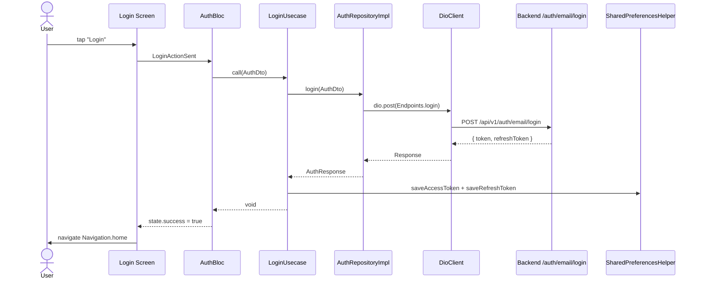

# Authentication Feature

## Module Purpose

The authentication feature implements login and signup for the PantryChef Flutter client, integrating with the NestJS backend's email-login and email-registration endpoints. It exchanges email and password for a JWT access and refresh token; on success both are persisted via `SharedPreferencesHelper` (resolved from the GetIt service locator) so sessions survive app restarts. Validation, form state, and async orchestration use BLoC; authenticated traffic is carried by the cross-cutting JWT interceptor in `dio_client.dart` (Source: `mobile/lib/core/utils/dio_client.dart:L74-L93`).

## Key Components

| Path | Type | Responsibility |
|------|------|----------------|
| `domain/repositories/auth.repository.dart` | Abstract Repository Contract | Declares `Future<AuthResponse> login(AuthDto)` and `Future<AuthResponse> signup(AuthDto)`. Source: `mobile/lib/features/authentication/domain/repositories/auth.repository.dart:L4-L8`. |
| `domain/usecases/login.usecase.dart` | UseCase | `LoginUsecase implements UseCaseWithParams<void, AuthDto>` — calls `AuthRepositoryImpl().login()`, then persists `result.token` / `result.refreshToken` via `SharedPreferencesHelper`. Source: `mobile/lib/features/authentication/domain/usecases/login.usecase.dart:L9-L18`. |
| `domain/usecases/signup.usecase.dart` | UseCase | `SignupUsecase implements UseCaseWithParams<void, AuthDto>` — identical shape to `LoginUsecase` but calls `signup()`. Source: `mobile/lib/features/authentication/domain/usecases/signup.usecase.dart:L9-L18`. |
| `domain/entities/auth_response.entity.dart` | Entity | `@JsonSerializable() AuthResponse { token, refreshToken }` — two fields only (no `tokenExpires` / `user`). Source: `mobile/lib/features/authentication/domain/entities/auth_response.entity.dart:L5-L16`. |
| `data/api/authentication.api.dart` | Dio API Client | `AuthenticationApi.login(AuthDto)` / `signup(AuthDto)` wrap `dio.post(Endpoints.login \| signup, data: dto.toJson())`; `_dio` comes from `getIt<DioClient>().dio`. Source: `mobile/lib/features/authentication/data/api/authentication.api.dart:L7-L29`. |
| `data/dto/auth.dto.dart` | Request DTO | `@JsonSerializable() AuthDto { email, password }` — a single DTO drives both login and signup (two fields only; no `firstName` / `lastName`). Source: `mobile/lib/features/authentication/data/dto/auth.dto.dart:L5-L16`. |
| `data/repositories/auth.repository.dart` | Repository Implementation | `AuthRepositoryImpl extends AuthRepository` — instantiates `AuthenticationApi()` per call and deserializes via `AuthResponse.fromJson`. Source: `mobile/lib/features/authentication/data/repositories/auth.repository.dart:L6-L20`. |
| `presentation/bloc/auth/auth_bloc.dart` | BLoC | `AuthBloc extends Bloc<AuthEvent, AuthState>` — handles `AuthFormValueChanged`, `LoginActionSent`, `SignupActionSend`; validates email with `RegExps.email` and signup password length ≥ 6; catches `DioException` 422. Source: `mobile/lib/features/authentication/presentation/bloc/auth/auth_bloc.dart:L14-L71`. |
| `presentation/bloc/auth/auth_event.dart` | Sealed Event Hierarchy | `sealed class AuthEvent extends Equatable` with `AuthFormValueChanged`, `LoginActionSent`, `SignupActionSend`. Source: `mobile/lib/features/authentication/presentation/bloc/auth/auth_event.dart:L3-L22`. |
| `presentation/bloc/auth/auth_state.dart` | State | `AuthState extends Equatable` (`email`, `password`, `errorMessage?`, `success`, `emailWrongFormat`, `passwordToShort`, `isFetching`); `copyWith` uses `Nullable<String>?` to distinguish "set null" from "absent". Source: `mobile/lib/features/authentication/presentation/bloc/auth/auth_state.dart:L3-L51`. |
| `presentation/widgets/screens/authentication_start.dart` | Entry Screen | StatelessWidget with a logo and two `ActionButton`s; pushes `Navigation.singup` (spelling preserved verbatim from `mobile/lib/core/constants/navigation.dart:L28`) at L36 and `Navigation.login` at L43. Source: `mobile/lib/features/authentication/presentation/widgets/screens/authentication_start.dart:L10-L56`. |
| `presentation/widgets/screens/login.dart` | Login Screen | Wraps `BlocProvider(create: AuthBloc())` + `MultiBlocListener`; on `state.success` runs `pushNamedAndRemoveUntil(Navigation.home)`, on `state.isFetching` toggles `loaderOverlay`. Source: `mobile/lib/features/authentication/presentation/widgets/screens/login.dart:L15-L122`. |
| `presentation/widgets/screens/signup.dart` | Signup Screen | Structurally mirrors `Login`; the submit button dispatches `SignupActionSend`. Source: `mobile/lib/features/authentication/presentation/widgets/screens/signup.dart:L14-L121`. |

## Architecture Fit

The feature uses the standard mobile clean-architecture layering — `presentation/` → `domain/` → `data/` — but uses no constructor injection. `AuthBloc` instantiates `LoginUsecase()` / `SignupUsecase()` directly (Source: `mobile/lib/features/authentication/presentation/bloc/auth/auth_bloc.dart:L34,L62`); each use case instantiates `AuthRepositoryImpl()` (Source: `mobile/lib/features/authentication/domain/usecases/login.usecase.dart:L12`), which instantiates `AuthenticationApi()` and resolves the shared client via `getIt<DioClient>().dio`. Token persistence lives inside the use case, not the BLoC (Source: `mobile/lib/features/authentication/domain/usecases/login.usecase.dart:L14-L16`):

```dart
SharedPreferencesHelper _sharedPreferencesHelper = getIt<SharedPreferencesHelper>();
_sharedPreferencesHelper.saveAccessToken(result.token);
_sharedPreferencesHelper.saveRefreshToken(result.refreshToken);
```

`Login` and `Signup` each create their own `AuthBloc`; no instance is shared. See [../../../../ARCHITECTURE.md](../../../../ARCHITECTURE.md) § JWT Authentication Flow for the full token-refresh chain.

## Dependencies

### Internal

- `core/utils/dio_client.dart` — authenticated HTTP client, JWT bearer injection, and 401/419 refresh (Source: `mobile/lib/core/utils/dio_client.dart:L74-L93,L117-L143`).
- `core/utils/shared_preferences_helper.dart` — token persistence via `saveAccessToken` (L40) and `saveRefreshToken` (L56).
- `core/utils/service_locator.dart` — GetIt registration of `DioClient` and `SharedPreferencesHelper` (Source: `mobile/lib/core/utils/service_locator.dart:L39-L46`).
- `core/utils/usercase.dart` — the `UseCaseWithParams` contract; file name preserved verbatim, class name correct (Source: `mobile/lib/core/utils/usercase.dart:L27`).
- `core/utils/nullable_wrapper.dart` — `Nullable<T>` sentinel for `AuthState.copyWith` (Source: `mobile/lib/core/utils/nullable_wrapper.dart:L14`).
- `core/utils/reg_exp.dart` — `RegExps.email` for email validation (Source: `mobile/lib/core/utils/reg_exp.dart:L16`).
- `core/constants/navigation.dart` — route names, including `singup` (L28).
- `core/constants/endpoints.dart` — `login`, `signup`, `refreshToken` URLs.
- `core/constants/status_codes.dart` — `unauthorized` (401), `tokenExpired` (419), `unprocessableEntity` (422).
- `core/constants/error_message.dart` — `ErrorMessage.incorrectPassword` (Source: `mobile/lib/core/constants/error_message.dart:L23`).
- `core/presentation/widgets/` — shared `ActionButton`, `TextFieldInput`, app-bar widget.

### External

| Package | Version | Source | Consumed By |
|---------|---------|--------|-------------|
| `bloc` | ^8.1.4 | `mobile/pubspec.yaml:L38` | `presentation/bloc/auth/auth_bloc.dart` |
| `flutter_bloc` | ^8.1.6 | `mobile/pubspec.yaml:L39` | `login.dart`, `signup.dart` (`BlocProvider`, `BlocBuilder`, `BlocListener`) |
| `dio` | ^5.7.0 | `mobile/pubspec.yaml:L50` | `data/api/authentication.api.dart` (via `DioClient`); `DioException` handling in `auth_bloc.dart` |
| `shared_preferences` | ^2.3.2 | `mobile/pubspec.yaml:L35` | indirectly, via `SharedPreferencesHelper` |
| `equatable` | ^2.0.5 | `mobile/pubspec.yaml:L41` | `auth_event.dart`, `auth_state.dart` (value equality) |
| `flutter_platform_widgets` | ^7.0.1 | `mobile/pubspec.yaml:L33` | screens use `PlatformScaffold` |
| `json_annotation` | ^4.9.0 | `mobile/pubspec.yaml:L40` | DTO + entity (`@JsonSerializable`) |
| `loader_overlay` | ^4.0.3 | `mobile/pubspec.yaml:L42` | `login.dart`, `signup.dart` (`context.loaderOverlay.show/hide`) |

Dev-time only: `json_serializable: ^6.7.1` (Source: `mobile/pubspec.yaml:L62`) generates the DTO/entity `*.g.dart` files (out of documentation scope).

## Primary Use Cases

- **Sign up** via the `Navigation.singup` route — `AuthenticationStart` pushes `Signup` (Source: `mobile/lib/features/authentication/presentation/widgets/screens/authentication_start.dart:L36`).
- **Log in** with email/password — `Login` dispatches `LoginActionSent` to `AuthBloc` (Source: `mobile/lib/features/authentication/presentation/bloc/auth/auth_bloc.dart:L28-L51`).
- **Persist JWT tokens** via `SharedPreferencesHelper`, inside `LoginUsecase.call` / `SignupUsecase.call` (Source: `mobile/lib/features/authentication/domain/usecases/login.usecase.dart:L14-L16`).
- **Auto-refresh on 401 / `tokenExpired` (419)** via the `DioClient` interceptor, which POSTs the refresh token through a separate `_refreshDio` (Source: `mobile/lib/core/utils/dio_client.dart:L85-L92,L117-L143`).
- **Navigate home on success** — both screens call `pushNamedAndRemoveUntil(Navigation.home, (_) => false)` (Source: `mobile/lib/features/authentication/presentation/widgets/screens/login.dart:L28`).
- **Log out** — clears tokens and calls the logout endpoint; owned by the profile feature, not this one.

## API / Endpoint Reference

All URLs are built from `Endpoints.apiBaseUrl` (default `http://192.168.2.20:3000/api`). `AuthController` declares `@Controller({ path: 'auth', version: '1' })` (Source: `backend/src/auth/auth.controller.ts:L40`), so under the global `api` prefix (Source: `backend/src/main.ts:L14-L19`) the effective paths are `/api/v1/auth/<route>`.

| Method | Path | Guard | Consumed By This Feature | Description |
|--------|------|-------|--------------------------|-------------|
| `POST` | `/api/v1/auth/email/login` | none | ✅ Direct (`AuthenticationApi.login`) | Email + password login; returns `{ token, refreshToken }`. URL: `mobile/lib/core/constants/endpoints.dart:L46`. |
| `POST` | `/api/v1/auth/email/register` | none | ✅ Direct (`AuthenticationApi.signup`) | Email + password registration; returns `{ token, refreshToken }`. URL: `mobile/lib/core/constants/endpoints.dart:L52`. |
| `POST` | `/api/v1/auth/refresh` | `AuthGuard('jwt-refresh')` | 🔄 Cross-cutting (`DioClient._refreshToken` on 401/419) | Issues a fresh access + refresh token pair. URL: `mobile/lib/core/constants/endpoints.dart:L41`. |
| `GET` | `/api/v1/auth/me` | `AuthGuard('jwt')` | ❌ Profile feature | Current-user profile. URL: `mobile/lib/core/constants/endpoints.dart:L60`. |
| `POST` | `/api/v1/auth/logout` | `AuthGuard('jwt-refresh')` | ❌ Profile feature | Server-side session invalidation. URL: `mobile/lib/core/constants/endpoints.dart:L56`. |

## Data Flows

A login starts when the user taps submit on `Login`, dispatching `LoginActionSent` to `AuthBloc`. The bloc validates the email, sets `isFetching`, and invokes `LoginUsecase`, which calls through the repository and Dio client to the backend; on success it persists the tokens and emits `success` to drive navigation home.



If a later request returns 401 or the custom `tokenExpired` (419), the `DioClient` interceptor transparently refreshes the tokens and replays the request (Source: `mobile/lib/core/utils/dio_client.dart:L85-L92,L117-L143`); see [../../../../ARCHITECTURE.md](../../../../ARCHITECTURE.md) § JWT Authentication Flow. Each token pair maps to a backend `Session` linked to a `User` — see [../../../../DATA_MODEL.md](../../../../DATA_MODEL.md) § Session and § User.

## Configuration

- `API_BASE_URL` — compile-time `--dart-define`, default `http://192.168.2.20:3000/api` (Source: `mobile/lib/env_config.dart:L11`). All authentication traffic is prefixed by this value through `Endpoints.apiBaseUrl`.
- Endpoint constants (Source: `mobile/lib/core/constants/endpoints.dart:L41-L60`): `refreshToken` (L41), `login` (L46), `signup` (L52), `logout` (L56), `profile` (L60).
- JWT storage keys (Source: `mobile/lib/core/constants/preferences.dart:L28,L35`): `accessToken = "accessToken"` (L28) and `refreshToken = "refreshToken"` (L35), both read/written by `SharedPreferencesHelper`.
- Status codes (Source: `mobile/lib/core/constants/status_codes.dart`): `unauthorized` 401 (L27) and `tokenExpired` 419 (L42) trigger refresh; `unprocessableEntity` 422 (L46) is caught by `AuthBloc` for field errors.

## Known Limitations and Implementation Gaps

> ⚠️ **Route constant `singup` is preserved verbatim** — `Navigation.singup = '/singup'` (`mobile/lib/core/constants/navigation.dart:L28`) is an intentional misspelling kept for route stability; consumed in `authentication_start.dart:L36`, marked with `// NOTE:` at `navigation.dart:L22`. Do not rename.

> ⚠️ **Backend password reset is not wired** — the DTOs exist (`backend/src/auth/dto/auth-forgot-password.dto.ts`, `auth-reset-password.dto.ts`) but no routes are exposed and there is no "Forgot password" UI. See `backend/src/auth/README.md` § Known Limitations.

> ⚠️ **No biometric or 2FA support** — only email and password are accepted; no FaceID/TouchID (`local_auth`), TOTP, or SMS OTP.

> ⚠️ **No "remember me" toggle** — refresh tokens persist in SharedPreferences across restarts with no opt-out.

## Production Readiness Status

> 🚧 **No biometric/2FA and no password-reset UI.** See [../../../../PRODUCTION_READINESS.md](../../../../PRODUCTION_READINESS.md) § Security Hardening.

> 🚧 **Refresh token TTL is `3650d` (~10 years)** per backend defaults (`backend/env_example:L23`, `AUTH_REFRESH_TOKEN_EXPIRES_IN=3650d`) — far too long for production. See [../../../../PRODUCTION_READINESS.md](../../../../PRODUCTION_READINESS.md) § Secrets Management.

> 🚧 **No rate limiting on the auth endpoints** — `POST /api/v1/auth/email/login` and `/api/v1/auth/email/register` are unprotected against brute force; the backend should add `@nestjs/throttler`. See [../../../../PRODUCTION_READINESS.md](../../../../PRODUCTION_READINESS.md) § Security Hardening.
