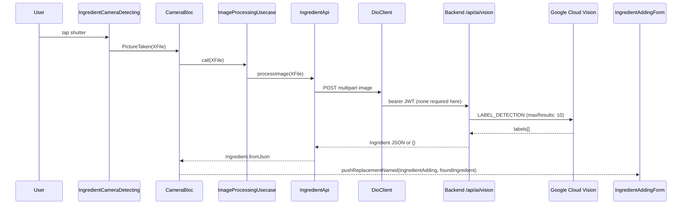

# Ingredient Feature (Mobile)

## Module Purpose

The ingredient feature is the mobile module for ingredient discovery, manual creation, and AI-assisted recognition. It owns the full user-facing flow: camera capture, upload to the backend AI vision endpoint, label detection via Google Cloud Vision, ingredient resolution against the backend's MongoDB `Ingridient` (spelling preserved verbatim from the backend schema) collection, user confirmation, and persistence (the confirmed item becomes a pantry entry). The module follows mobile clean architecture (domain/data/presentation) and integrates with two backend modules: the `IngridientController` (spelling preserved verbatim from the backend) at `/api/v1/ingredient/*` and the `AiController` at `/api/ai/vision`. Note that the mobile folder uses the correct spelling `ingredient/` (class `Ingredient`) while the backend uses the verbatim-preserved spelling `ingridient/` (class `Ingridient`); this divergence is intentional and is discussed further in §9.

## Key Components

| Path | Type | Responsibility |
| --- | --- | --- |
| `domain/models/ingredient.dart` | Model | `Ingredient` (mobile-side correct spelling): `id`, `name`, `category`, `confidence`, `createdAt?`, `quantity?`, `unit`, `imageUrl?`, `expirationDate?`. JSON-serializable via `@JsonSerializable()`. |
| `domain/models/category.dart` | Model | `Category` (`id: int`, `name: String`). JSON-serializable. |
| `domain/models/unit.dart` | Model | `Unit` (`id: int`, `name: String`). JSON-serializable. |
| `domain/models/ingredient_add_data.dart` | Model | `IngredientAddData` aggregate `{ categories, units }` for the add-form bootstrap. |
| `domain/repositories/ingredient.repository.dart` | Repository contract | `abstract class IngredientRepository` exposes `getCategoriesAndUnits()`, `searchIngredient(SearchDto)`, `createingredient(CreateIngredientDto)`, `processImage(XFile)`. Source: `domain/repositories/ingredient.repository.dart:L7-L15`. |
| `domain/usecases/create_ingredient.usecase.dart` | UseCase | `CreateIngredientUsecase` implements `UseCaseWithParams<Ingredient, CreateIngredientDto>`. |
| `domain/usecases/get_creation_data.usecase.dart` | UseCase | `GetIngredientCategoriesAndUnitsUsecase` implements `UseCase<IngredientAddData>` — fetches categories + units reference data. |
| `domain/usecases/image_processing.usecase.dart` | UseCase | `ImageProcessingUsecase` implements `UseCaseWithParams<Ingredient, XFile>` — uploads image to AI vision endpoint. |
| `domain/usecases/search_ingredietn.usecase.dart` | UseCase | `SearchIngredientUsecase` — file name `search_ingredietn.usecase.dart` (file name spelling preserved verbatim — 'ingredietn' typo retained for compile-time stability). Class name `SearchIngredientUsecase` is correctly spelled. |
| `domain/usecases/index.dart` | Barrel | Exports the four use cases above. |
| `data/api/ingredient.api.dart` | Dio API client | `IngredientApi` wraps Dio calls: `getCategoriesAndUnits` (GET creation-data), `searchIngredient` (GET with `SearchDto`), `createIngredient` (POST), `processImage` (POST multipart to `${Endpoints.ai}/vision`). |
| `data/dto/create_ingredient.dto.dart` | DTO | `CreateIngredientDto` (`name`, `category` w/ `Mappers.categoryToJson`, `quantity`, `unit` w/ `Mappers.unitToJson`, `imageUrl?`, `expirationDate?`, `confidence=1`). |
| `data/dto/index.dart` | Barrel | Exports `create_ingredient.dto.dart`. |
| `data/repositories/ingredient.repository.dart` | Repository impl | `IngredientRepositoryImpl` implements the domain contract; instantiates `IngredientApi()` per call. |
| `presentation/bloc/camera/camera_bloc.dart` | BLoC | `CameraBloc` manages camera state; handles `PictureTaken` → `ImageProcessingUsecase` → emits `ImagedProcessed(foundIngredient)` or `ImageProcessingError`. Source: `presentation/bloc/camera/camera_bloc.dart:L10-L22`. |
| `presentation/bloc/camera/camera_event.dart` | Event | `sealed class CameraEvent` + `PictureTaken({required this.image})`. |
| `presentation/bloc/camera/camera_state.dart` | State | `sealed class CameraState`: `CameraInitial`, `ImagedProcessed({required foundIngredient})`, `ImageProcessingError`. |
| `presentation/bloc/ingredient_add/ingredient_add_bloc.dart` | BLoC | `IngredientAddBloc` handles `CategoriesAndUnitsFetched`, `DataChanged`, `IngredientSearch` (paginated, page+=1 on scroll), `IngredientCreated`. Source: `presentation/bloc/ingredient_add/ingredient_add_bloc.dart:L14-L85`. |
| `presentation/bloc/ingredient_add/ingredient_add_event.dart` | Event | Four sealed events including `DataChanged` with `Nullable<T>` semantics. |
| `presentation/bloc/ingredient_add/ingredient_add_state.dart` | State | `IngredientAddState` with `searchResult`, `page`, `limit=20`, `isNextPageAvailable`, `isFetching=true` default, `createdIngredient`. `copyWith` uses `Nullable<T>` for nullable fields. |
| `presentation/widgets/screens/ingredient_camera_detecting.dart` | Screen | Camera capture + detection screen. Initializes `CameraController(cameras[0], ResolutionPreset.max)`, dispatches `PictureTaken`, navigates to `Navigation.ingredientAdding` on result. |
| `presentation/widgets/screens/ingredient_adding_form.dart` | Screen | Confirm + edit ingredient form (282 lines). Builds `IngredientAddBloc`, listens for `createdIngredient`, dispatches `PantryItemAdded` on the upstream `PantryBloc` to persist. |
| `presentation/widgets/ingredient_search_dialog.dart` | Widget | `SearchDialog` modal with infinite-scroll pagination via `_scrollController` listener (offset `CommonConstants.fetchScrollOffset=150`). Returns either a selected `Ingredient` or the typed query string. |
| `presentation/widgets/ingredient_search_field.dart` | Widget | `IngredientSearchField` picker-style field that opens `SearchDialog` as a bottom sheet. |
| `presentation/widgets/ingredient_search_result_item.dart` | Widget | `IngredientSearchResultItem` list row showing `item.name`; taps `pop(item)`. |

## Architecture Fit

The feature follows mobile clean architecture: `presentation/` (UI widgets + BLoC state) depends on `domain/` (contracts, models, use cases), which is realized by `data/` (the Dio API client, DTOs, and repository implementation). The presentation layer reads `Ingredient` instances from the domain layer, and the data layer maps backend `Ingridient` JSON responses into the mobile-correct `Ingredient` class. `IngredientApi` resolves its Dio instance via `getIt<DioClient>().dio` (Source: `data/api/ingredient.api.dart:L12-L14`), so every request automatically inherits the JWT interceptor and refresh logic configured in `mobile/lib/core/utils/dio_client.dart`. The module carries no business logic of its own beyond form orchestration — it is a thin client over two backend modules.

See [`../../../../ARCHITECTURE.md`](../../../../ARCHITECTURE.md) §§ Full Request Path, JWT Authentication Flow, and BLoC State Management for the system-level view. The backend counterpart is documented in [`../../../../backend/src/ingridient/README.md`](../../../../backend/src/ingridient/README.md) and [`../../../../backend/src/ai/README.md`](../../../../backend/src/ai/README.md), and the shared HTTP layer in [`../../../../mobile/lib/core/README.md`](../../../../mobile/lib/core/README.md).

## Dependencies

### Internal

- `mobile/lib/core/utils/dio_client.dart` — Dio HTTP client (JWT interceptor + refresh) resolved via `getIt<DioClient>().dio`.
- `mobile/lib/core/constants/endpoints.dart` — `Endpoints.ingredient`, `Endpoints.ingredientCreationData`, `Endpoints.ai` (Source: `mobile/lib/core/constants/endpoints.dart:L80-L99`).
- `mobile/lib/core/utils/service_locator.dart` — GetIt resolution for `DioClient`.
- `mobile/lib/core/utils/usercase.dart` (file name spelling preserved verbatim — typo retained) — provides `UseCase<T>` and `UseCaseWithParams<T, P>` contracts that the four use cases implement.
- `mobile/lib/core/utils/mappers.dart` — `Mappers.categoryToJson` and `Mappers.unitToJson` used in `Ingredient` and `CreateIngredientDto` JSON serialization.
- `mobile/lib/core/utils/nullable_wrapper.dart` — `Nullable<T>` used in `DataChanged` event + `IngredientAddState.copyWith`.
- `mobile/lib/core/constants/ingredient_location.dart` — provides the `ingredientLocation` list (`['fridge', 'freezer', 'pantry']`) used as the location dropdown source and initial value (`ingredientLocation[0] = 'fridge'`).
- `mobile/lib/core/constants/navigation.dart` — `Navigation.ingredientDetecting`, `Navigation.ingredientAdding`.
- `mobile/lib/core/data/dto/index.dart` — `SearchDto`, `OrderDto` for paginated search.
- `mobile/lib/core/presentation/widgets/*` — shared widgets (`ActionButton`, `TextFieldInput`, `SelectField`, `DatePickerField`, `AppIconButton`, `AppBarWidget`).
- `mobile/lib/features/pantry/data/dto/create_pantry_item.dto.dart` — `CreatePantryItemDto` whose `ingridient` (field name preserved verbatim from the backend wire-format) field accepts the mobile `Ingredient` model.
- `mobile/lib/features/pantry/presentation/bloc/pantry/pantry_bloc.dart` — `PantryBloc` + `PantryItemAdded` event dispatched from the adding-form screen on creation.

### External

| Package | Version | Used For |
| --- | --- | --- |
| `camera` | `^0.11.0+2` | `CameraController`, `XFile`, `availableCameras()` for capture flow |
| `dio` | `^5.7.0` | HTTP client, `FormData`, `MultipartFile` for multipart image upload |
| `bloc` | `^8.1.4` | `Bloc<Event, State>` base class for `CameraBloc` and `IngredientAddBloc` |
| `flutter_bloc` | `^8.1.6` | `BlocProvider`, `BlocBuilder`, `BlocListener`, `MultiBlocListener` in screens |
| `equatable` | `^2.0.5` | Value equality on event/state classes |
| `json_annotation` | `^4.9.0` | `@JsonSerializable()`, `@JsonKey(toJson: ...)` on models and DTOs |
| `flutter_platform_widgets` | `^7.0.1` | `PlatformScaffold`, `PlatformCircularProgressIndicator` for cross-platform UI |
| `loader_overlay` | `^4.0.3` | Full-screen loading overlay during AI vision processing |

All versions verified against `mobile/pubspec.yaml`.

## Primary Use Cases

- **Open camera, capture image** of a pantry item (Source: `presentation/widgets/screens/ingredient_camera_detecting.dart:L43-L44` initializes `CameraController(_cameras[0], ResolutionPreset.max)`; L145-L146 takes the picture and emits `PictureTaken`).
- **Upload to backend AI vision** (multipart, form field `image`) via `IngredientApi.processImage` → `${Endpoints.ai}/vision` (Source: `data/api/ingredient.api.dart:L31-L41`).
- **Receive ingredient suggestion** from Google Cloud Vision label detection plus a server-side dictionary lookup performed by `IngridientService` (spelling preserved verbatim from the backend) via `findManyWithPagination`; the mobile client receives the resolved JSON `Ingridient` or `{}` and maps it through `Ingredient.fromJson`.
- **Confirm + persist ingredient** (POST `/api/v1/ingredient` via `IngredientApi.createIngredient` → maps response to `Ingredient.fromJson`). Source: `data/api/ingredient.api.dart:L26-L29`.
- **Search existing ingredients** (paginated, GET `/api/v1/ingredient` with `SearchDto` query params). The dialog scroll listener requests the next page when within `CommonConstants.fetchScrollOffset=150` of the bottom. Source: `presentation/widgets/ingredient_search_dialog.dart:L29-L43`.
- **Create ingredient manually** via the add form when AI detection fails or the user opts out — a fallback button on the camera screen routes to `Navigation.ingredientAdding` without an argument. Source: `presentation/widgets/screens/ingredient_camera_detecting.dart:L83,L154`.

## API / Endpoint Reference

> The mobile feature consumes endpoints from two backend modules: the `IngridientController` (spelling preserved verbatim) at `/api/v1/ingredient/*`, and the `AiController` at `/api/ai/vision`. `IngridientController` declares `@Controller({ path: 'ingredient', version: '1' })`, so its routes carry the `/v1` segment under the global `api` prefix; the `AiController` declares `@Controller('ai')` (Source: `backend/src/ai/ai.controller.ts:L22`) with no `version` parameter, so it resolves at `/api/ai/vision`. This matches the backend's own [`../../../../backend/src/ingridient/README.md`](../../../../backend/src/ingridient/README.md).

| Method | Path | Guard | Description |
| --- | --- | --- | --- |
| GET | `/api/v1/ingredient/creation-data` | `@UseGuards(AuthGuard('jwt'))` (class-level) | Categories + units reference data. **Note:** lists are hardcoded in `IngridientController.getCreationData` (5 categories, 9 units) — see `backend/src/ingridient/ingridient.controller.ts:L62-L93`. |
| GET | `/api/v1/ingredient` | `@UseGuards(AuthGuard('jwt'))` (class-level) | Paginated ingredient list (`SearchDto` query params). Used by `SearchDialog` infinite scroll. |
| GET | `/api/v1/ingredient/:id` | `@UseGuards(AuthGuard('jwt'))` (class-level) | Fetch single ingredient by id. Not currently called from this feature but available on the contract. |
| POST | `/api/v1/ingredient` | `@UseGuards(AuthGuard('jwt'))` (class-level) | Create a new Ingridient (spelling preserved verbatim). Mobile sends `CreateIngredientDto` body. |
| POST | `/api/ai/vision` | **NONE — UNGUARDED** | Multipart image upload (form field `image`, ≤10MB) returning a resolved Ingridient or `{}`. See [`../../../../backend/src/ai/README.md`](../../../../backend/src/ai/README.md) for the upstream gap. |

## Data Flows

> The diagram below traces an end-to-end camera-driven ingredient detection from the Flutter UI, through the unguarded AI vision endpoint, to Google Cloud Vision, and back to the confirmation screen.

> When Google Cloud Vision is disabled or finds no match, the backend returns `{}` (Source: `backend/src/ai/ai.service.ts:L107,L126`) and the mobile flow still navigates to the add form — but `Ingredient.fromJson({})` will throw, which the BLoC catches and emits `ImageProcessingError`, routing the user to the manual entry form anyway (Source: `presentation/bloc/camera/camera_bloc.dart:L14-L19`).

## Configuration

| Variable / Constant | Value | Source | Notes |
| --- | --- | --- | --- |
| `API_BASE_URL` (compile-time `--dart-define`) | default `http://192.168.2.20:3000/api` | `mobile/lib/env_config.dart:L11` | Developer LAN IP; override for production via `flutter run --dart-define=API_BASE_URL=https://…`. |
| `Endpoints.ingredient` | `$apiBaseUrl/ingredient` | `mobile/lib/core/constants/endpoints.dart:L80` | Routes to backend `/api/v1/ingredient`. |
| `Endpoints.ingredientCreationData` | `$ingredient/creation-data` | `mobile/lib/core/constants/endpoints.dart:L85` | Routes to backend `/api/v1/ingredient/creation-data`. |
| `Endpoints.ai` | `$apiBaseUrl/ai` | `mobile/lib/core/constants/endpoints.dart:L99` | Mobile appends `/vision` for the upload (Source: `data/api/ingredient.api.dart:L35`). |
| iOS camera permission | `NSCameraUsageDescription = "Application using camera for ingredient identification"` | `mobile/ios/Runner/Info.plist` | Required for camera access on iOS. |
| Android camera permission | `<uses-permission android:name="android.permission.CAMERA" />` | `mobile/android/app/src/main/AndroidManifest.xml` | Required for camera access on Android. |
| `ingredientLocation[0]` | `'fridge'` | `mobile/lib/core/constants/ingredient_location.dart:L23` | Default location applied by `IngredientAddBloc` initializer (Source: `presentation/bloc/ingredient_add/ingredient_add_bloc.dart:L20`). |
| Search page size | `limit = 20` | `presentation/bloc/ingredient_add/ingredient_add_state.dart:L34` | Used by `IngredientSearch` event. |
| Scroll prefetch offset | `CommonConstants.fetchScrollOffset = 150` | `mobile/lib/core/constants/common.dart:L21` | When dialog is within 150 px of bottom, fetches next page. |

## Known Limitations and Implementation Gaps

> Most of the listed gaps are owned upstream by the backend AI module. The cross-cutting risks below are documented here so a mobile reader has the full picture, with cross-links to the canonical owners.

> ⚠️ **Backend AI endpoint is unguarded.** `POST /api/ai/vision` has no `@UseGuards(AuthGuard('jwt'))` decorator (Source: `backend/src/ai/ai.controller.ts:L22-L77`). The mobile client sends the JWT header via the `DioClient` interceptor, but the backend does not verify it. See [`../../../../backend/src/ai/README.md`](../../../../backend/src/ai/README.md) and [`../../../../PRODUCTION_READINESS.md`](../../../../PRODUCTION_READINESS.md) § Security Hardening.

> ⚠️ **Backend AI ingredient dictionary is small.** ~36 hardcoded English terms in the dictionary (Source: `backend/src/ai/ai.service.ts:L24-L62`). Most real-world food items will not resolve, and the mobile flow will fall back to the manual add form. No mobile-side mitigation is possible; tracked in [`../../../../backend/src/ai/README.md`](../../../../backend/src/ai/README.md).

> ⚠️ **Backend MIME-type filter is commented out.** The `fileFilter` restricting uploads to `image/jpeg`/`image/png` is present but commented out (Source: `backend/src/ai/ai.controller.ts:L51-L61`). The mobile client uses `MultipartFile.fromFile(image.path, filename: image.name)` (Source: `data/api/ingredient.api.dart:L34`) which sends whatever the camera writes; arbitrary file types would also be accepted.

> ⚠️ **Mobile-vs-backend spelling divergence.** This mobile feature folder uses the correct spelling `ingredient/` and the class `Ingredient`. The backend uses the verbatim-preserved spelling `ingridient/` and the class `Ingridient` (spelling preserved verbatim from the backend schema). Both spellings are intentional. The cross-feature DTO `mobile/lib/features/pantry/data/dto/create_pantry_item.dto.dart:L26` declares its field as `final Ingredient ingridient;` (field name preserved verbatim from the backend wire-format) — mixing the mobile-correct class name with the backend-verbatim field name. **Do not unify.**

> ⚠️ **Verbatim file name `search_ingredietn.usecase.dart`** (file name spelling preserved verbatim — 'ingredietn' typo retained for compile-time stability). The class inside the file is correctly named `SearchIngredientUsecase`; only the file name carries the typo. Renaming the file would break the barrel export at `domain/usecases/index.dart:L3`. Documented in source with a `// NOTE:` annotation at the top of the file.

> ⚠️ **No offline image queue.** If the user captures a photo while offline, the multipart upload at `data/api/ingredient.api.dart:L31-L41` rethrows the Dio error, the BLoC emits `ImageProcessingError` (Source: `presentation/bloc/camera/camera_bloc.dart:L18`), and the captured image is discarded with no retry. Hydrated state does not cover in-flight requests.

## Production Readiness Status

> Each gap maps to one or more categories in [`../../../../PRODUCTION_READINESS.md`](../../../../PRODUCTION_READINESS.md). The headline mobile-facing risk is the unguarded AI endpoint (owned by the backend AI module).

> 🚧 **Security Hardening** — Add `@UseGuards(AuthGuard('jwt'))` to the backend `AiController` before relying on it in production. The mobile JWT is already sent on every request via the `DioClient` interceptor, so no mobile change is needed. See [`../../../../PRODUCTION_READINESS.md`](../../../../PRODUCTION_READINESS.md) § Security Hardening and [`../../../../backend/src/ai/README.md`](../../../../backend/src/ai/README.md).

> 🚧 **Security Hardening** — Enforce MIME-type validation on the backend AI endpoint by uncommenting the `fileFilter` block at `backend/src/ai/ai.controller.ts:L51-L61`. Once enforced, the mobile client should also restrict `MultipartFile` content-type to `image/jpeg` for compatibility.

> 🚧 **Coverage / Quality** — Expand the backend AI ingredient dictionary (currently ~36 terms at `backend/src/ai/ai.service.ts:L24-L62`) to handle production vocabulary. Consider a managed ML model or a labeled dataset rather than a hardcoded list. No mobile change required.

> 🚧 **Security Hardening** — Add file-size and per-user rate limits on the image upload (`@nestjs/throttler` on the backend) to mitigate cost + abuse, since the current 10MB upload limit at `backend/src/ai/ai.controller.ts:L62` combined with an unguarded endpoint creates an anonymous DoS vector. See [`../../../../PRODUCTION_READINESS.md`](../../../../PRODUCTION_READINESS.md) § Security Hardening.

> See [`../../../../PRODUCTION_READINESS.md`](../../../../PRODUCTION_READINESS.md) for the full gap inventory and [`../../../../ARCHITECTURE.md`](../../../../ARCHITECTURE.md) §§ Full Request Path and JWT Authentication Flow for end-to-end context. The `Ingridient` schema referenced throughout this README is documented in [`../../../../DATA_MODEL.md`](../../../../DATA_MODEL.md).
