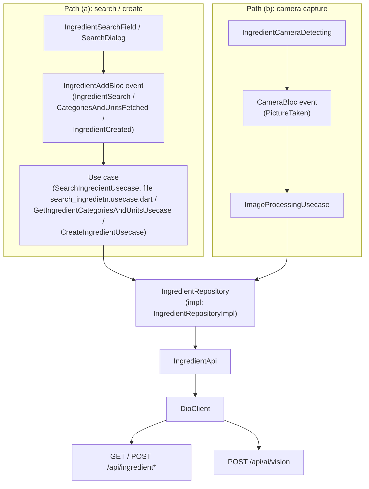

# Ingredient feature

The `ingredient/` feature is the PantryChef mobile client's entry point for
getting ingredients into the system. It combines two complementary
capabilities behind one feature directory and feeds the ingredients a user
selects, creates, or photographs into the pantry add flow.

## Purpose

This feature provides two complementary ways to obtain an ingredient:

- **Text search and manual creation.** Users search the existing ingredient
  catalog through a modal search dialog and search field, and when no match
  exists they create a new ingredient through the add form.
  `Source: mobile/lib/features/ingredient/presentation/widgets/ingredient_search_dialog.dart:L11`,
  `Source: mobile/lib/features/ingredient/presentation/widgets/screens/ingredient_adding_form.dart:L23`.
- **Camera / AI capture.** Users photograph an ingredient with the device
  camera, and the image is sent to the backend AI vision endpoint, which
  returns a recognized `Ingredient`.
  `Source: mobile/lib/features/ingredient/presentation/widgets/screens/ingredient_camera_detecting.dart:L17`,
  `Source: mobile/lib/features/ingredient/presentation/bloc/camera/camera_bloc.dart:L10`.

In both paths the recognized or selected ingredient is handed to the add form,
which submits it into the pantry: the add form dispatches a `PantryItemAdded`
event to the pantry feature on success.
`Source: mobile/lib/features/ingredient/presentation/widgets/screens/ingredient_adding_form.dart:L47`.

> **Spelling note.** This mobile feature directory is correctly spelled
> `ingredient/`, intentionally diverging from the backend's misspelled module
> `ingridient/`. The divergence is intentional and is documented here as a
> fact; it is never reconciled or "corrected."

## Key components

The feature is organized into the standard clean-architecture layers. The
table below lists the public surface; subsequent sections expand on the most
important pieces.

### BLoCs

| Component | Role | Source |
|-----------|------|--------|
| `CameraBloc` | Drives the camera/AI recognition path; handles `PictureTaken` and emits a recognized ingredient or an error state | `Source: mobile/lib/features/ingredient/presentation/bloc/camera/camera_bloc.dart:L10` |
| `IngredientAddBloc` | Drives metadata loading, search, field edits, and creation for the add form | `Source: mobile/lib/features/ingredient/presentation/bloc/ingredient_add/ingredient_add_bloc.dart:L14` |

`CameraBloc` consumes one event, `PictureTaken { XFile image }`
(`Source: mobile/lib/features/ingredient/presentation/bloc/camera/camera_event.dart:L10`),
and exposes three states: `CameraInitial`, `ImagedProcessed { Ingredient
foundIngredient }`, and `ImageProcessingError`
(`Source: mobile/lib/features/ingredient/presentation/bloc/camera/camera_state.dart:L10-L18`).
The state class name `ImagedProcessed` is reproduced exactly as it appears in
the source.

`IngredientAddBloc` consumes four events — `CategoriesAndUnitsFetched`,
`IngredientSearch`, `DataChanged`, and `IngredientCreated`
(`Source: mobile/lib/features/ingredient/presentation/bloc/ingredient_add/ingredient_add_event.dart:L10,L12,L22,L59`)
— and exposes a single immutable `IngredientAddState`
(`Source: mobile/lib/features/ingredient/presentation/bloc/ingredient_add/ingredient_add_state.dart:L3`).

### Domain

| Component | Role | Source |
|-----------|------|--------|
| `Ingredient` | Core ingredient model | `Source: mobile/lib/features/ingredient/domain/models/ingredient.dart:L9` |
| `Category` | Ingredient category reference | `Source: mobile/lib/features/ingredient/domain/models/category.dart:L6` |
| `Unit` | Measurement unit reference | `Source: mobile/lib/features/ingredient/domain/models/unit.dart:L6` |
| `IngredientAddData` | Aggregates the categories + units used by the add form | `Source: mobile/lib/features/ingredient/domain/models/ingredient_add_data.dart:L8` |
| `IngredientRepository` | Abstract repository contract | `Source: mobile/lib/features/ingredient/domain/repositories/ingredient.repository.dart:L7` |
| `CreateIngredientUsecase` | Wraps ingredient creation | `Source: mobile/lib/features/ingredient/domain/usecases/create_ingredient.usecase.dart:L7` |
| `GetIngredientCategoriesAndUnitsUsecase` | Wraps creation-data loading | `Source: mobile/lib/features/ingredient/domain/usecases/get_creation_data.usecase.dart:L6` |
| `ImageProcessingUsecase` | Wraps camera image recognition | `Source: mobile/lib/features/ingredient/domain/usecases/image_processing.usecase.dart:L7` |
| `SearchIngredientUsecase` | Wraps ingredient search | `Source: mobile/lib/features/ingredient/domain/usecases/search_ingredietn.usecase.dart:L7` |

The use-case file `search_ingredietn.usecase.dart` is misspelled, while the
class it declares, `SearchIngredientUsecase`, is correctly spelled. Both are
preserved exactly as-is and must never be renamed.
`Source: mobile/lib/features/ingredient/domain/usecases/search_ingredietn.usecase.dart:L7`.
The four use cases are re-exported through a barrel file.
`Source: mobile/lib/features/ingredient/domain/usecases/index.dart`.

### Data

| Component | Role | Source |
|-----------|------|--------|
| `IngredientApi` | Dio-based HTTP access to the ingredient and AI endpoints | `Source: mobile/lib/features/ingredient/data/api/ingredient.api.dart:L9` |
| `IngredientRepositoryImpl` | Concrete repository mapping API responses to models | `Source: mobile/lib/features/ingredient/data/repositories/ingredient.repository.dart:L11` |
| `CreateIngredientDto` | Request payload for ingredient creation | `Source: mobile/lib/features/ingredient/data/dto/create_ingredient.dto.dart:L9` |

The DTO is re-exported through a barrel file.
`Source: mobile/lib/features/ingredient/data/dto/index.dart`.

### Presentation widgets and screens

| Component | Role | Source |
|-----------|------|--------|
| `SearchDialog` | Modal bottom-sheet search/create dialog | `Source: mobile/lib/features/ingredient/presentation/widgets/ingredient_search_dialog.dart:L11` |
| `IngredientSearchField` | Tappable field that opens the search dialog | `Source: mobile/lib/features/ingredient/presentation/widgets/ingredient_search_field.dart:L6` |
| `IngredientSearchResultItem` | A single tappable search result row | `Source: mobile/lib/features/ingredient/presentation/widgets/ingredient_search_result_item.dart:L6` |
| `IngredientAddingForm` | Screen that hosts `IngredientAddBloc` and submits into the pantry | `Source: mobile/lib/features/ingredient/presentation/widgets/screens/ingredient_adding_form.dart:L23` |
| `IngredientCameraDetecting` | Screen that captures a photo for AI recognition | `Source: mobile/lib/features/ingredient/presentation/widgets/screens/ingredient_camera_detecting.dart:L17` |

The class declared in `ingredient_search_dialog.dart` is named `SearchDialog`.
`Source: mobile/lib/features/ingredient/presentation/widgets/ingredient_search_dialog.dart:L11`.

## Architecture fit

The feature follows the project's **clean-architecture** layout, with
dependencies pointing inward from presentation to domain:

- `domain/` holds the models, the abstract `IngredientRepository` contract, and
  the use cases.
  `Source: mobile/lib/features/ingredient/domain/repositories/ingredient.repository.dart:L7`.
- `data/` holds the `IngredientApi` HTTP client, the `CreateIngredientDto`, and
  `IngredientRepositoryImpl`, which implements the domain contract.
  `Source: mobile/lib/features/ingredient/data/repositories/ingredient.repository.dart:L11`.
- `presentation/` holds the two BLoCs, the widgets, and the screens.
  `Source: mobile/lib/features/ingredient/presentation/bloc/ingredient_add/ingredient_add_bloc.dart:L14`.

Networking is centralized through dependency injection. The API layer resolves
the shared `DioClient` from the `get_it` service locator —
`_dio = getIt<DioClient>().dio`.
`Source: mobile/lib/features/ingredient/data/api/ingredient.api.dart:L13`.
The `DioClient` singleton is registered during startup in `setupLocator()`.
`Source: mobile/lib/core/utils/service_locator.dart:L13-L14`.

The use cases, by contrast, instantiate `IngredientRepositoryImpl()` directly
rather than resolving it from `get_it`.
`Source: mobile/lib/features/ingredient/domain/usecases/search_ingredietn.usecase.dart:L10`.
This is documented here as the current behavior.

For the full system view, see [docs/ARCHITECTURE.md](../../../../docs/ARCHITECTURE.md).

## Data models

All feature models are `@JsonSerializable` and declare a `part '*.g.dart'`
directive, so each relies on a generated serializer file. Those generated
`*.g.dart` files are produced by `build_runner`, are never edited by hand, and
may be absent until codegen runs.

### `Ingredient`

`Source: mobile/lib/features/ingredient/domain/models/ingredient.dart:L9-L20`.

| Field | Type | Notes | Source |
|-------|------|-------|--------|
| `id` | `String` | Ingredient identifier | `Source: .../domain/models/ingredient.dart:L10` |
| `name` | `String` | Ingredient name | `Source: .../domain/models/ingredient.dart:L11` |
| `category` | `Category` | Serialized via `@JsonKey(toJson: Mappers.categoryToJson)` | `Source: .../domain/models/ingredient.dart:L12-L13` |
| `confidence` | `double` | Recognition confidence, range 0–1 | `Source: .../domain/models/ingredient.dart:L14` |
| `createdAt` | `String?` | Creation timestamp | `Source: .../domain/models/ingredient.dart:L15` |
| `quantity` | `double?` | Optional quantity | `Source: .../domain/models/ingredient.dart:L16` |
| `unit` | `Unit` | Serialized via `@JsonKey(toJson: Mappers.unitToJson)` | `Source: .../domain/models/ingredient.dart:L17-L18` |
| `imageUrl` | `String?` | Optional image URL | `Source: .../domain/models/ingredient.dart:L19` |
| `expirationDate` | `String?` | Optional expiration date | `Source: .../domain/models/ingredient.dart:L20` |

### `Category`

`Source: mobile/lib/features/ingredient/domain/models/category.dart:L6-L8`.

| Field | Type | Source |
|-------|------|--------|
| `id` | `int` | `Source: .../domain/models/category.dart:L7` |
| `name` | `String` | `Source: .../domain/models/category.dart:L8` |

### `Unit`

`Source: mobile/lib/features/ingredient/domain/models/unit.dart:L6-L8`.

| Field | Type | Source |
|-------|------|--------|
| `id` | `int` | `Source: .../domain/models/unit.dart:L7` |
| `name` | `String` | `Source: .../domain/models/unit.dart:L8` |

### `IngredientAddData`

This model aggregates the category + unit metadata used by the add form.
`Source: mobile/lib/features/ingredient/domain/models/ingredient_add_data.dart:L8-L10`.

| Field | Type | Source |
|-------|------|--------|
| `categories` | `List<Category>` | `Source: .../domain/models/ingredient_add_data.dart:L9` |
| `units` | `List<Unit>` | `Source: .../domain/models/ingredient_add_data.dart:L10` |

`IngredientAddData` declares only a `fromJson` factory and no `toJson`, because
it is read from the backend but never serialized back.
`Source: mobile/lib/features/ingredient/domain/models/ingredient_add_data.dart:L17`.

### `CreateIngredientDto` (request payload)

The creation request payload mirrors most of `Ingredient`'s fields and is
covered more fully under "API endpoints / public interface."
`Source: mobile/lib/features/ingredient/data/dto/create_ingredient.dto.dart:L9-L18`.

| Field | Type | Notes | Source |
|-------|------|-------|--------|
| `name` | `String` | Required | `Source: .../data/dto/create_ingredient.dto.dart:L10` |
| `category` | `Category` | Serialized via `@JsonKey(toJson: Mappers.categoryToJson)` | `Source: .../data/dto/create_ingredient.dto.dart:L11-L12` |
| `quantity` | `double` | Required | `Source: .../data/dto/create_ingredient.dto.dart:L13` |
| `unit` | `Unit` | Serialized via `@JsonKey(toJson: Mappers.unitToJson)` | `Source: .../data/dto/create_ingredient.dto.dart:L14-L15` |
| `imageUrl` | `String?` | Optional | `Source: .../data/dto/create_ingredient.dto.dart:L16` |
| `expirationDate` | `String?` | Optional | `Source: .../data/dto/create_ingredient.dto.dart:L17` |
| `confidence` | `double` | Defaults to `1` | `Source: .../data/dto/create_ingredient.dto.dart:L18,L27` |

For the full cross-package model reference, see
[docs/DATA_MODELS.md](../../../../docs/DATA_MODELS.md).

## API endpoints / public interface

### Public Dart interface

The feature's public Dart contract is the abstract `IngredientRepository`.
`Source: mobile/lib/features/ingredient/domain/repositories/ingredient.repository.dart:L7-L14`.

| Method | Signature | Source |
|--------|-----------|--------|
| `getCategoriesAndUnits` | `Future<IngredientAddData> getCategoriesAndUnits()` | `Source: .../domain/repositories/ingredient.repository.dart:L8` |
| `searchIngredient` | `Future<List<Ingredient>> searchIngredient(SearchDto dto)` | `Source: .../domain/repositories/ingredient.repository.dart:L10` |
| `createingredient` | `Future<Ingredient> createingredient(CreateIngredientDto dto)` | `Source: .../domain/repositories/ingredient.repository.dart:L12` |
| `processImage` | `Future<Ingredient> processImage(XFile image)` | `Source: .../domain/repositories/ingredient.repository.dart:L14` |

The repository method `createingredient` is spelled in all-lowercase in the
source; it is reproduced exactly here and never renamed.
`Source: mobile/lib/features/ingredient/domain/repositories/ingredient.repository.dart:L12`.
Each of the four use cases wraps one repository method one-to-one.

### Backend REST endpoints called

The `IngredientApi` issues the HTTP calls behind the repository.
`Source: mobile/lib/features/ingredient/data/api/ingredient.api.dart`.

| Method | Path | Purpose | Source |
|--------|------|---------|--------|
| `GET` | `/api/ingredient/creation-data` | Loads category + unit metadata (the backend exposes 5 categories and 9 units) | `Source: mobile/lib/core/constants/endpoints.dart:L23`, used at `.../data/api/ingredient.api.dart:L17` |
| `GET` | `/api/ingredient` | Searches ingredients using query parameters from `SearchDto.toJson()` | `Source: mobile/lib/core/constants/endpoints.dart:L22`, used at `.../data/api/ingredient.api.dart:L22` |
| `POST` | `/api/ingredient` | Creates an ingredient | `Source: mobile/lib/core/constants/endpoints.dart:L22`, used at `.../data/api/ingredient.api.dart:L27` |
| `POST` | `/api/ai/vision` | Uploads the captured image as a multipart `image` field built with `FormData` / `MultipartFile.fromFile` | `Source: mobile/lib/features/ingredient/data/api/ingredient.api.dart:L33-L35`; base `Source: mobile/lib/core/constants/endpoints.dart:L29` |

Endpoints follow the convention `/api/<resource>` with **no `/v1/` segment**:
the client builds paths as `"$apiBaseUrl/<resource>"`, and `apiBaseUrl` already
ends in `/api`.
`Source: mobile/lib/core/constants/endpoints.dart:L22-L23,L29`.
Full request/response detail lives in
[docs/API_REFERENCE.md](../../../../docs/API_REFERENCE.md).

## Configuration

- **API base URL.** The base URL is `EnvConfig.apiBaseUrl`, a compile-time
  constant resolved via
  `String.fromEnvironment('API_BASE_URL', defaultValue: 'http://192.168.2.20:3000/api')`;
  the default already includes the `/api` prefix.
  `Source: mobile/lib/env_config.dart:L2`.
- **Camera.** Camera capture uses the `camera` package: it enumerates devices
  with `availableCameras()` and drives a `CameraController`.
  `Source: mobile/lib/features/ingredient/presentation/widgets/screens/ingredient_camera_detecting.dart:L41-L45`.
- **Image upload.** Captured image bytes are posted as multipart form data to
  the AI vision endpoint.
  `Source: mobile/lib/features/ingredient/data/api/ingredient.api.dart:L33-L35`.

## Data flow

The feature has two request paths that converge on the same repository and Dio
client. Path (a) is the search/create flow driven by `IngredientAddBloc`; path
(b) is the camera capture flow driven by `CameraBloc`.



*Diagram sources:
`Source: mobile/lib/features/ingredient/presentation/bloc/ingredient_add/ingredient_add_bloc.dart:L50-L83`,
`mobile/lib/features/ingredient/presentation/bloc/camera/camera_bloc.dart:L12-L20`,
`mobile/lib/features/ingredient/data/api/ingredient.api.dart:L16-L41`.*

## Design patterns used

- **BLoC.** Two BLoCs separate concerns: `CameraBloc` drives recognition and
  `IngredientAddBloc` drives metadata loading, search, and creation.
  `Source: mobile/lib/features/ingredient/presentation/bloc/camera/camera_bloc.dart:L10`,
  `Source: mobile/lib/features/ingredient/presentation/bloc/ingredient_add/ingredient_add_bloc.dart:L14`.
- **Repository.** An abstract `IngredientRepository` interface is implemented by
  `IngredientRepositoryImpl`, isolating the domain from the data layer.
  `Source: mobile/lib/features/ingredient/domain/repositories/ingredient.repository.dart:L7`,
  `Source: mobile/lib/features/ingredient/data/repositories/ingredient.repository.dart:L11`.
- **Use Case.** Each action is a single-responsibility use case implementing the
  core `UseCase` / `UseCaseWithParams` contracts.
  `Source: mobile/lib/core/utils/usercase.dart:L1-L6`.
- **Dependency Injection via `get_it`.** The shared `DioClient` is resolved from
  the service locator instead of being constructed per call.
  `Source: mobile/lib/features/ingredient/data/api/ingredient.api.dart:L13`,
  `Source: mobile/lib/core/utils/service_locator.dart:L13-L14`.
- **DTO mapping.** `CreateIngredientDto.toJson()` serializes the request, with
  nested `Category` and `Unit` mapped through `Mappers.categoryToJson` and
  `Mappers.unitToJson`.
  `Source: mobile/lib/features/ingredient/data/dto/create_ingredient.dto.dart:L11-L15,L30`.

## Known limitations / gaps

- The use-case file `search_ingredietn.usecase.dart` is misspelled and is
  preserved as a stable identifier; the class it declares,
  `SearchIngredientUsecase`, is correctly spelled.
  `Source: mobile/lib/features/ingredient/domain/usecases/search_ingredietn.usecase.dart:L7`.
- The mobile `ingredient/` feature and the backend `ingridient/` module differ
  in spelling intentionally; this divergence is documented and never
  reconciled.
- The backend AI vision endpoint `POST /api/ai/vision` is unauthenticated — see
  the SECURITY note in
  [docs/API_REFERENCE.md](../../../../docs/API_REFERENCE.md).
- `KNOWN ISSUE:` the camera state class is named `ImagedProcessed` (sic).
  `Source: mobile/lib/features/ingredient/presentation/bloc/camera/camera_state.dart:L12`.
- `KNOWN ISSUE:` the search-field callback parameter is named `onChaged` (sic).
  `Source: mobile/lib/features/ingredient/presentation/widgets/ingredient_search_field.dart:L8`.
- `KNOWN ISSUE:` `IngredientApi.processImage` calls `print(err)` unconditionally
  in its catch block before rethrowing.
  `Source: mobile/lib/features/ingredient/data/api/ingredient.api.dart:L38`.
- `KNOWN ISSUE:` in `IngredientAddBloc`'s `IngredientCreated` handler, the unit
  is looked up by `state.categoryId` rather than `state.unitId`.
  `Source: mobile/lib/features/ingredient/presentation/bloc/ingredient_add/ingredient_add_bloc.dart:L79`.

## Local development

```sh
flutter pub get
```

Installs the feature's dependencies.

```sh
dart run build_runner build --delete-conflicting-outputs
```

Regenerates the `@JsonSerializable` `*.g.dart` files for `Ingredient`,
`Category`, `Unit`, `IngredientAddData`, and `CreateIngredientDto`; the models
do not compile without them.

```sh
flutter run --dart-define API_BASE_URL=http://<host>:3000/api
```

Runs the app against a backend. `<host>` must be reachable from the device or
emulator (a LAN IP, or `10.0.2.2` for the Android emulator).
`Source: mobile/lib/env_config.dart:L2`.

Camera capture requires a physical device or an emulator with camera access; if
no camera is available, the detect screen renders its unavailable state.
`Source: mobile/lib/features/ingredient/presentation/widgets/screens/ingredient_camera_detecting.dart:L41-L50`.

For project-wide setup and the full feature map, see the
[mobile README](../../../README.md).
