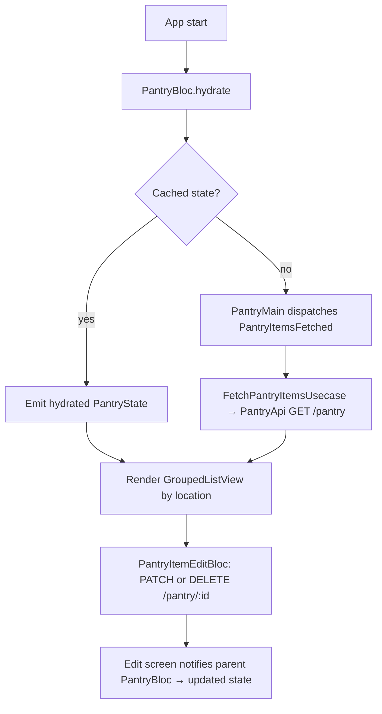

# Pantry Feature

## Module Purpose

The pantry feature provides full CRUD over the authenticated user's stored ingredients — the "pantry items." Every request is user-scoped: the backend's `AuthGuard('jwt')` derives the `userId` from the bearer JWT, so the client never sends a user identifier. It mirrors the backend `PantryIngridient` schema (spelling preserved verbatim from the backend codebase); the model's `ingridient` field name (sic) matches that backend spelling so JSON round-trips without remapping (Source: `domain/models/pantry_item.dart:L9`). Items are categorised across three buckets — `fridge`, `freezer`, and `pantry` (Source: `mobile/lib/core/constants/ingredient_location.dart:L23`) — and the list is persisted across launches with `hydrated_bloc` for an offline-first first paint.

## Key Components

| Path | Type | Responsibility |
|------|------|----------------|
| `domain/models/pantry_item.dart` | Model | `PantryItem` immutable JSON-serializable model with `ingridient` field (sic — mirrors backend `PantryIngridient` schema, spelling preserved verbatim) |
| `domain/repositories/pantry.repository.dart` | Repository contract | Abstract `PantryRepository` defining `fetchPantryItems`, `createPantryItem`, `updatePantryItem`, `deletePantryItem` |
| `domain/usecases/add_to_pantry.usecase.dart` | UseCase | `AddToPantryUsecase` wrapping `createPantryItem` |
| `domain/usecases/pantry_item_update.usecase.dart` | UseCase | `PantryItemUpdateUsecase` wrapping `updatePantryItem` |
| `domain/usecases/pantry_item_delete.usecase.dart` | UseCase | `PantryItemDeleteUsecase` wrapping `deletePantryItem` |
| `domain/usecases/pantry_items_fetch.usecase.dart` | UseCase | `FetchPantryItemsUsecase` wrapping `fetchPantryItems` |
| `domain/usecases/index.dart` | Barrel | Re-exports the four usecase modules |
| `data/api/pantry.api.dart` | Dio API client | `PantryApi` issues GET/POST/PATCH/DELETE against `Endpoints.pantry` via `getIt<DioClient>().dio` (Source: `data/api/pantry.api.dart:L11`) |
| `data/dto/create_pantry_item.dto.dart` | DTO | `CreatePantryItemDto` for the POST payload with a custom `_ingredientToJson` serializer (Source: `data/dto/create_pantry_item.dto.dart:L25`) |
| `data/dto/update_pantry_item.dto.dart` | DTO | `UpdatePantryItemDto` for the PATCH payload |
| `data/dto/index.dart` | Barrel | Re-exports the two DTO modules |
| `data/repositories/pantry.repository.dart` | Repository impl | `PantryRepositoryImpl` adapts API responses into `PantryItem` domain models |
| `presentation/bloc/pantry/pantry_bloc.dart` | BLoC | `PantryBloc` (extends `Bloc` with `HydratedMixin`) — handles 5 events; persists state automatically |
| `presentation/bloc/pantry/pantry_event.dart` | Events | Sealed `PantryEvent` hierarchy: `PantryItemsFetched`, `PantryItemAdded`, `PantryItemUpdated`, `PantryItemDeleted`, `PantryListReseted` |
| `presentation/bloc/pantry/pantry_state.dart` | State | `PantryState` with nullable `List<PantryItem>? items` and `copyWith` |
| `presentation/bloc/pantry_edit_item/pantry_item_edit_bloc.dart` | BLoC | `PantryItemEditBloc` — manages a single-item edit form; handles `DataChanged` / `ChangedDataSaved` / `DeleteConfirmed` |
| `presentation/bloc/pantry_edit_item/pantry_item_edit_event.dart` | Events | Sealed `PantryItemEditEvent` hierarchy |
| `presentation/bloc/pantry_edit_item/pantry_item_edit_state.dart` | State | `PantryItemEditState` with validation flags + result tracking |
| `presentation/widgets/pantry_item_card.dart` | Widget | `PantryItemCard` stateless widget — Material card rendering of a `PantryItem`; navigates to the edit screen |
| `presentation/widgets/screens/patry_main.dart` | Screen | `PantryMain` overview screen (file name sic — `patry` typo preserved verbatim for compile-time stability) |
| `presentation/widgets/screens/pantry_item_edit.dart` | Screen | `PantryItemEdit` form screen — quantity, location, expirationDate, and delete confirmation |

## Architecture Fit

The feature follows the standard mobile clean-architecture layering: `presentation` → `domain` → `data`. Widgets and BLoCs depend only on `domain/` abstractions (`PantryRepository`, the use cases); `PantryRepositoryImpl` and `PantryApi` in `data/` are the only layer aware of Dio and JSON. The one deliberate deviation from a plain BLoC is the list-level `PantryBloc`, which extends `Bloc<PantryEvent, PantryState>` with `HydratedMixin` (Source: `presentation/bloc/pantry/pantry_bloc.dart:L11`) to serialise its state to local storage automatically. That storage is built at startup via `HydratedStorage.build()` over `getTemporaryDirectory()` (Source: `mobile/lib/main.dart:L27-L29`); the constructor calls `hydrate()` (Source: `presentation/bloc/pantry/pantry_bloc.dart:L13`), and `PantryMain` dispatches `PantryItemsFetched` only when `state.items` is still `null` (Source: `presentation/widgets/screens/patry_main.dart:L21-L22`). Edits run through a separate `PantryItemEditBloc` that never mutates the list directly — the edit screen listens for its result and dispatches `PantryItemUpdated` / `PantryItemDeleted` back to the parent `PantryBloc` (Source: `presentation/widgets/screens/pantry_item_edit.dart:L62,L69`). See [`../../../../ARCHITECTURE.md`](../../../../ARCHITECTURE.md) § BLoC State Management.

## Dependencies

### Internal

- `mobile/lib/core/utils/dio_client.dart` — bearer-token HTTP client, consumed by `PantryApi`.
- `mobile/lib/core/constants/endpoints.dart:L92` — the `Endpoints.pantry` URL constant.
- `mobile/lib/core/constants/ingredient_location.dart:L23` — `ingredientLocation` (`['fridge', 'freezer', 'pantry']`).
- `mobile/lib/core/utils/service_locator.dart` — GetIt DI container resolved by `PantryApi` (`getIt<DioClient>()`).
- `mobile/lib/core/utils/usercase.dart` — abstract `UseCase` / `UseCaseWithParams` interfaces (file name preserved verbatim).
- `mobile/lib/features/ingredient/domain/models/ingredient.dart` — the `Ingredient` model embedded in `PantryItem.ingridient`.

### External

- `hydrated_bloc ^9.1.5` — Source: `mobile/pubspec.yaml:L43`
- `bloc ^8.1.4` — Source: `mobile/pubspec.yaml:L38`
- `flutter_bloc ^8.1.6` — Source: `mobile/pubspec.yaml:L39`
- `dio ^5.7.0` — Source: `mobile/pubspec.yaml:L50`
- `equatable ^2.0.5` — Source: `mobile/pubspec.yaml:L41`
- `json_annotation ^4.9.0` — Source: `mobile/pubspec.yaml:L40`
- `intl: any` — drives `DateFormat('dd.MM.yyyy')` in `pantry_item_card.dart` (Source: `mobile/pubspec.yaml:L56`)
- `path_provider ^2.1.5` — supplies the temp directory backing HydratedBloc storage (Source: `mobile/pubspec.yaml:L49`)

## Primary Use Cases

- Browse all pantry items grouped by storage location through a `GroupedListView` (Source: `presentation/widgets/screens/patry_main.dart:L52-L66`).
- Add a pantry item manually via the edit form (Source: `domain/usecases/add_to_pantry.usecase.dart`).
- Add a pantry item from the camera + AI-vision workflow — that flow lives in the ingredient feature, but the resulting `POST /api/pantry` is handled here.
- Edit an existing item's quantity, location, and expiration date (Source: `presentation/widgets/screens/pantry_item_edit.dart`).
- Delete a pantry item — the route name implies soft-delete, but the backend physically removes the row (see Known Limitations).
- Rehydrate the cached pantry list on app launch (Source: `presentation/bloc/pantry/pantry_bloc.dart:L13` — the `hydrate()` call).

## API / Endpoint Reference

All routes sit under `/api/pantry` — there is **no `/v1` segment**, because the backend declares `@Controller({ path: 'pantry', version: '1' })` but never calls `app.enableVersioning()`, leaving the version inert (Source: `mobile/lib/core/constants/endpoints.dart:L92`). Every endpoint is JWT-protected by a class-level guard (Source: `backend/src/pantry/pantry.controller.ts:L42`).

| Method | Path | Guard | Description |
|--------|------|-------|-------------|
| `GET` | `/api/pantry` | `AuthGuard('jwt')` | List the authenticated user's pantry items (paginated; backend caps `limit` at 50) |
| `POST` | `/api/pantry` | `AuthGuard('jwt')` | Add a pantry item; consumes `CreatePantryItemDto` |
| `GET` | `/api/pantry/:id` | `AuthGuard('jwt')` | Fetch a single pantry item by id |
| `PATCH` | `/api/pantry/:id` | `AuthGuard('jwt')` | Update an existing pantry item; consumes `UpdatePantryItemDto` |
| `DELETE` | `/api/pantry/:id` | `AuthGuard('jwt')` | Delete a pantry item (see Known Limitations — the backend physically deletes) |

The mobile `PantryApi` (Source: `data/api/pantry.api.dart`) issues these calls through the shared `DioClient`, which injects the bearer JWT.

## Data Flows

App start triggers HydratedBloc rehydration; a cached snapshot renders immediately without waiting on the network. The first time the list builds with `state.items == null`, `PantryMain` dispatches `PantryItemsFetched` to sync with the backend. Edit and delete run through `PantryItemEditBloc`, and on success the edit screen — not the edit bloc — notifies the parent `PantryBloc` via `PantryItemUpdated` or `PantryItemDeleted` (Source: `presentation/widgets/screens/pantry_item_edit.dart:L62,L69`).

## Configuration

| Source | Value | Reference |
|--------|-------|-----------|
| `API_BASE_URL` | Compile-time base URL, supplied via `--dart-define API_BASE_URL=…` | `mobile/lib/env_config.dart` |
| `Endpoints.pantry` | Backend pantry route URL constant | `mobile/lib/core/constants/endpoints.dart:L92` |
| `ingredientLocation` | Valid location strings `['fridge', 'freezer', 'pantry']` | `mobile/lib/core/constants/ingredient_location.dart:L23` |
| HydratedBloc storage | Backed by `path_provider`'s `getTemporaryDirectory()` | `mobile/lib/main.dart:L27-L29` |

## Known Limitations and Implementation Gaps

> ⚠️ **Backend `softDelete` is destructive** — it calls `deleteOne()` instead of setting `deletedAt` (Source: `backend/src/pantry/infrastructure/document/repositories/pantryIngridient.repository.ts:L200-L204`), so the mobile `DELETE /api/pantry/:id` physically removes the record despite the route name implying soft-delete. See [`../../../../DATA_MODEL.md`](../../../../DATA_MODEL.md) § Soft-Delete (deletedAt).

> ⚠️ **Location enum strings are not validated client-side** — `'fridge'`, `'freezer'`, and `'pantry'` come from `mobile/lib/core/constants/ingredient_location.dart:L23`, with no compile-time enum or exhaustiveness check; a value mismatch fails only on the backend.

> ⚠️ **`PantryIngridient` schema name (backend, sic) is preserved verbatim** — the mobile model is correctly named `PantryItem`, but its backend resource is `PantryIngridient`, and the `ingridient` field name (sic) on both `PantryItem` and `CreatePantryItemDto` is likewise verbatim (Source: `domain/models/pantry_item.dart:L9`).

> ⚠️ **File name `patry_main.dart` is preserved verbatim** (sic — the `patry` typo is retained for compile-time stability); renaming it would break the navigation imports that reference it.

> ⚠️ **HydratedBloc storage uses the OS temporary directory** — the OS may evict it under low-storage pressure, so persisted pantry state can be lost silently with no warning (Source: `mobile/lib/main.dart:L27-L29`).

> ⚠️ **A pagination cap of 50 applies to the list endpoint** — the controller clamps `limit` to 50 (Source: `backend/src/pantry/pantry.controller.ts:L93-L95`) and the client does not page explicitly, so a user with more than 50 items sees only the first page.

## Production Readiness Status

> 🚧 **No offline mutation queue** — adds, edits, or deletes made while offline are lost rather than replayed when connectivity returns. See [`../../../../PRODUCTION_READINESS.md`](../../../../PRODUCTION_READINESS.md) § Mobile Release.

> 🚧 **Backend destructive `softDelete` must be fixed before the client can rely on soft-delete semantics** — the current behaviour contradicts the route name. See [`../../../../DATA_MODEL.md`](../../../../DATA_MODEL.md) § Soft-Delete (deletedAt) and [`../../../../PRODUCTION_READINESS.md`](../../../../PRODUCTION_READINESS.md) § Database.

> 🚧 **Add server-side validation feedback to the edit form** — backend validation errors (e.g. a location enum mismatch) should surface as field-level errors instead of failing silently. See [`../../../../PRODUCTION_READINESS.md`](../../../../PRODUCTION_READINESS.md) § Security Hardening.

> 🚧 **Migrate HydratedBloc storage to the application documents directory** — the temporary directory is evictable; `path_provider.getApplicationDocumentsDirectory()` is more durable for production. See [`../../../../PRODUCTION_READINESS.md`](../../../../PRODUCTION_READINESS.md) § Mobile Release.
