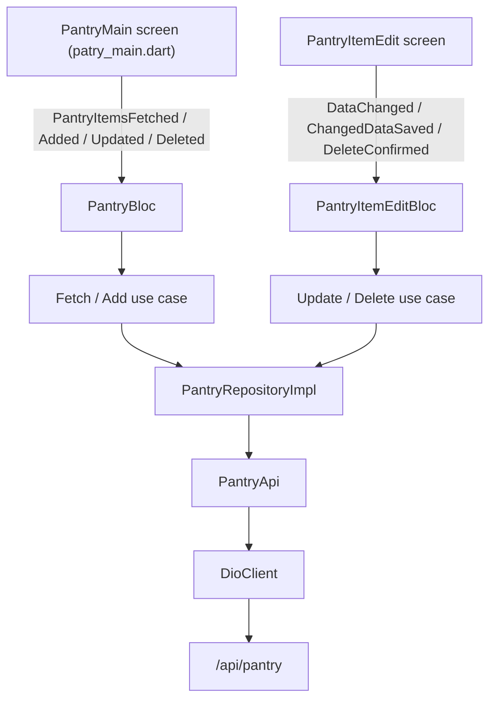

# Pantry Feature

## Purpose

The Pantry feature manages a user's pantry inventory on the PantryChef mobile
client: it lists the pantry items, adds new items, and edits or deletes a single
item. It is built on a clean-architecture stack in which the `presentation`
layer (screens/widgets plus BLoC) drives `domain` use cases, the use cases call a
`data`-layer repository, and the repository talks to the backend over Dio against
the `/api/pantry` resource (`Source: mobile/lib/features/pantry/data/api/pantry.api.dart:L14-L38`).

Listing is paginated **server-side**, so the feature does not implement a
client-side pagination control; the request/response detail for the cap is
deferred to the [API reference](../../../../docs/API_REFERENCE.md). This README
orients a contributor to the feature's components, data models, public interface,
data flow, design patterns, and how to run it locally.

## Key components

The feature is organized into the three clean-architecture layers. Each component
below is listed with the source that defines it.

**Presentation**

- **List BLoC** — `PantryBloc` manages the pantry collection and lives under
  `presentation/bloc/pantry/`
  (`Source: mobile/lib/features/pantry/presentation/bloc/pantry/pantry_bloc.dart:L11`),
  with its events declared in `pantry_event.dart`
  (`Source: mobile/lib/features/pantry/presentation/bloc/pantry/pantry_event.dart:L3`)
  and its state in `pantry_state.dart`
  (`Source: mobile/lib/features/pantry/presentation/bloc/pantry/pantry_state.dart:L3`).
- **Edit-form BLoC** — `PantryItemEditBloc` manages editing a single item and
  lives under `presentation/bloc/pantry_edit_item/`
  (`Source: mobile/lib/features/pantry/presentation/bloc/pantry_edit_item/pantry_item_edit_bloc.dart:L10`),
  with `pantry_item_edit_event.dart`
  (`Source: mobile/lib/features/pantry/presentation/bloc/pantry_edit_item/pantry_item_edit_event.dart:L3`)
  and `pantry_item_edit_state.dart`
  (`Source: mobile/lib/features/pantry/presentation/bloc/pantry_edit_item/pantry_item_edit_state.dart:L3`).
- **Widgets / screens** — `PantryItemCard` renders a single pantry row
  (`Source: mobile/lib/features/pantry/presentation/widgets/pantry_item_card.dart:L9`);
  the screens are `PantryItemEdit`
  (`Source: mobile/lib/features/pantry/presentation/widgets/screens/pantry_item_edit.dart:L21`)
  and `PantryMain`
  (`Source: mobile/lib/features/pantry/presentation/widgets/screens/patry_main.dart:L12`).

**Domain**

- **Model** — `PantryItem`
  (`Source: mobile/lib/features/pantry/domain/models/pantry_item.dart:L7`).
- **Repository interface** — the abstract `PantryRepository`
  (`Source: mobile/lib/features/pantry/domain/repositories/pantry.repository.dart:L4`).
- **Use cases** — `AddToPantryUsecase`
  (`Source: mobile/lib/features/pantry/domain/usecases/add_to_pantry.usecase.dart:L7`),
  `PantryItemUpdateUsecase`
  (`Source: mobile/lib/features/pantry/domain/usecases/pantry_item_update.usecase.dart:L7`),
  `PantryItemDeleteUsecase`
  (`Source: mobile/lib/features/pantry/domain/usecases/pantry_item_delete.usecase.dart:L5`),
  and `FetchPantryItemsUsecase`
  (`Source: mobile/lib/features/pantry/domain/usecases/pantry_items_fetch.usecase.dart:L6`),
  re-exported through the barrel `domain/usecases/index.dart`
  (`Source: mobile/lib/features/pantry/domain/usecases/index.dart:L1-L4`).

**Data**

- **API client** — `PantryApi` issues the Dio HTTP calls
  (`Source: mobile/lib/features/pantry/data/api/pantry.api.dart:L7`).
- **Repository implementation** — `PantryRepositoryImpl` maps API responses to
  `PantryItem`
  (`Source: mobile/lib/features/pantry/data/repositories/pantry.repository.dart:L6`).
- **DTOs** — `CreatePantryItemDto`
  (`Source: mobile/lib/features/pantry/data/dto/create_pantry_item.dto.dart:L7`)
  and `UpdatePantryItemDto`
  (`Source: mobile/lib/features/pantry/data/dto/update_pantry_item.dto.dart:L6`),
  re-exported through the barrel `data/dto/index.dart`
  (`Source: mobile/lib/features/pantry/data/dto/index.dart:L1-L2`).

> **Stable identifier — do not rename.** The main screen file is spelled
> `patry_main.dart` (sic — "patry", not "pantry"). This is an intentional,
> stable identifier and must **never** be renamed
> (`Source: mobile/lib/features/pantry/presentation/widgets/screens/patry_main.dart`).

## Architecture fit

The feature follows clean architecture with three layers: `domain/` holds the
model, the repository interface, and the use cases; `data/` holds the API client,
the DTOs, and the repository implementation; and `presentation/` holds the BLoCs
together with the widgets and screens. Dependencies point inward — `presentation`
depends on `domain` use cases, the use cases depend on the `domain` repository
interface, and the `data` implementation satisfies that interface.

Dependency injection is handled through `get_it`: the data API resolves the
shared Dio client from the service locator with `_dio = getIt<DioClient>().dio`
(`Source: mobile/lib/features/pantry/data/api/pantry.api.dart:L11`). The list
BLoC is **hydrated** — `PantryBloc` mixes in `HydratedMixin` and calls
`hydrate()` in its constructor, so the pantry list is restored from local storage
across app launches
(`Source: mobile/lib/features/pantry/presentation/bloc/pantry/pantry_bloc.dart:L11,L13`).
For how this feature sits within the wider system, see the
[architecture guide](../../../../docs/ARCHITECTURE.md).

## Data models

The feature's primary model is `PantryItem`
(`Source: mobile/lib/features/pantry/domain/models/pantry_item.dart`). Its fields
are reproduced exactly below, including the embedded field's spelling.

| Field | Type | Source |
|---|---|---|
| `id` | `String` | `pantry_item.dart:L8` |
| `ingridient` (sic) | `Ingredient` | `pantry_item.dart:L9` |
| `quantity` | `double` | `pantry_item.dart:L10` |
| `location` | `String` | `pantry_item.dart:L11` |
| `createdAt` | `String` | `pantry_item.dart:L12` |
| `updatedAt` | `String` | `pantry_item.dart:L13` |
| `expirationDate` | `String` | `pantry_item.dart:L14` |

`PantryItem` is annotated `@JsonSerializable`
(`Source: mobile/lib/features/pantry/domain/models/pantry_item.dart:L6`), declares
`part 'pantry_item.g.dart'`
(`Source: mobile/lib/features/pantry/domain/models/pantry_item.dart:L4`), and
exposes `fromJson`
(`Source: mobile/lib/features/pantry/domain/models/pantry_item.dart:L26`) and
`toJson`
(`Source: mobile/lib/features/pantry/domain/models/pantry_item.dart:L28`).

> **Stable identifier — do not rename.** The embedded field name `ingridient`
> (sic — typed `Ingredient`) is misspelled but is a deliberate, stable identifier;
> describe it, never rename it
> (`Source: mobile/lib/features/pantry/domain/models/pantry_item.dart:L9`).
> The generated `pantry_item.g.dart` file is build_runner output and must
> **never** be hand-edited.

The write paths use two dedicated DTOs. `CreatePantryItemDto` carries
`ingridient` (sic), `quantity`, `unit`, `location`, and `expirationDate`
(`Source: mobile/lib/features/pantry/data/dto/create_pantry_item.dto.dart:L9-L13`),
while `UpdatePantryItemDto` carries `id`, `location`, `quantity`, and
`expirationDate`
(`Source: mobile/lib/features/pantry/data/dto/update_pantry_item.dto.dart:L7-L10`).
For the full cross-package model catalog, see the
[data-models reference](../../../../docs/DATA_MODELS.md).

## API endpoints / public interface

The feature consumes the backend pantry resource through the `pantry` base
constant `'$apiBaseUrl/pantry'`
(`Source: mobile/lib/core/constants/endpoints.dart:L26`). Routes resolve to
`/api/<resource>` with **no `/v1/` segment**: the backend declares a controller
version but does not enable versioning, and the mobile client targets `/api/...`
directly. Each operation maps to a `PantryApi` method.

| Operation | HTTP | Path | Method | Source |
|---|---|---|---|---|
| Add item | `POST` | `/api/pantry` | `createPantryItem` | `pantry.api.dart:L19-L25` |
| List items | `GET` | `/api/pantry` | `fetchPantryItems` | `pantry.api.dart:L14-L17` |
| Update item | `PATCH` | `/api/pantry/:id` | `updatePantryItem` | `pantry.api.dart:L27-L33` |
| Delete item | `DELETE` | `/api/pantry/:id` | `deletePantryItem` | `pantry.api.dart:L35-L38` |

The list response payload is unwrapped from `response.data['data']`
(`Source: mobile/lib/features/pantry/data/api/pantry.api.dart:L16`). The update
and delete paths are built by interpolating the identifier onto the base
constant — `'${Endpoints.pantry}/${dto.id}'` for update and
`'${Endpoints.pantry}/$id'` for delete
(`Source: mobile/lib/features/pantry/data/api/pantry.api.dart:L29,L36`). List
pagination is enforced **server-side (cap 50)**; the full request/response detail
is documented in the [API reference](../../../../docs/API_REFERENCE.md).

## Configuration

The API base URL comes from `EnvConfig.apiBaseUrl`, a compile-time constant
defined as `String.fromEnvironment('API_BASE_URL', defaultValue: 'http://192.168.2.20:3000/api')`
(`Source: mobile/lib/env_config.dart:L2`). It is surfaced to the feature through
`Endpoints.apiBaseUrl`, which re-exports the same value for the Dio client
(`Source: mobile/lib/core/constants/endpoints.dart:L6`). Because the default
already includes the `/api` prefix, every pantry route resolves under `/api`.

The pantry `location` is a **free-form `String`** on the client at the model's
type level
(`Source: mobile/lib/features/pantry/domain/models/pantry_item.dart:L11`). The
edit screen offers a fixed, selectable list sourced from
`core/constants/ingredient_location.dart`
(`Source: mobile/lib/features/pantry/presentation/widgets/screens/pantry_item_edit.dart:L153-L162`),
whereas the backend constrains `location` to the enum
`fridge | freezer | pantry`
(`Source: backend/src/pantry/infrastructure/document/entities/pantryIngridient.schema.ts:L32-L33`).
This client-versus-server difference is stated here as a fact; the feature does
not attempt to reconcile it.

## Data flow

A pantry action originates at a screen, is dispatched as a BLoC event, is handled
by invoking a use case, flows through the repository to the API client, and is
sent over the shared Dio client to `/api/pantry`.



*Diagram sources: `mobile/lib/features/pantry/presentation/**`, `domain/**`, and `data/**`.*

The flow is anchored in the code as follows. `PantryMain` dispatches
`PantryItemsFetched` when `state.items == null`
(`Source: mobile/lib/features/pantry/presentation/widgets/screens/patry_main.dart:L21-L24`).
The `PantryBloc` handlers invoke `FetchPantryItemsUsecase` and
`AddToPantryUsecase`
(`Source: mobile/lib/features/pantry/presentation/bloc/pantry/pantry_bloc.dart:L15-L26`).
On the edit path, `PantryItemEditBloc`'s `ChangedDataSaved` handler builds an
`UpdatePantryItemDto` and calls `PantryItemUpdateUsecase`
(`Source: mobile/lib/features/pantry/presentation/bloc/pantry_edit_item/pantry_item_edit_bloc.dart:L35-L55`).
The use cases instantiate `PantryRepositoryImpl`
(`Source: mobile/lib/features/pantry/domain/usecases/add_to_pantry.usecase.dart:L10-L11`),
the implementation calls `PantryApi` and maps the result via `PantryItem.fromJson`
(`Source: mobile/lib/features/pantry/data/repositories/pantry.repository.dart:L8-L18`),
and `PantryApi` issues the request through the injected Dio client
(`Source: mobile/lib/features/pantry/data/api/pantry.api.dart:L11`).

## Design patterns used

- **BLoC** — event-driven state management; the list state is additionally
  **hydrated** so it survives app restarts
  (`Source: mobile/lib/features/pantry/presentation/bloc/pantry/pantry_bloc.dart:L11`).
- **Repository** — the interface is declared in `domain/`
  (`Source: mobile/lib/features/pantry/domain/repositories/pantry.repository.dart:L4`)
  and implemented in `data/`
  (`Source: mobile/lib/features/pantry/data/repositories/pantry.repository.dart:L6`).
- **Use Case** — thin orchestration wrappers over the repository, one per action
  (`Source: mobile/lib/features/pantry/domain/usecases/add_to_pantry.usecase.dart:L7`).
- **Dependency Injection via `get_it`** — the API resolves the shared Dio client
  from the service locator
  (`Source: mobile/lib/features/pantry/data/api/pantry.api.dart:L11`).
- **DTO mapping** — typed request payloads are serialized to JSON before being
  sent
  (`Source: mobile/lib/features/pantry/data/dto/create_pantry_item.dto.dart:L23`).

## Known limitations / gaps

The following are documented as facts; this README does not propose fixes.

- The main screen file is spelled `patry_main.dart` (sic) and is preserved as a
  stable identifier — it must never be renamed
  (`Source: mobile/lib/features/pantry/presentation/widgets/screens/patry_main.dart`).
- The `PantryItem.ingridient` field is spelled `ingridient` (sic) and is preserved
  as a stable identifier — it must never be renamed
  (`Source: mobile/lib/features/pantry/domain/models/pantry_item.dart:L9`).
- Pagination is enforced server-side (cap 50); the client does not implement its
  own paging control — see the
  [API reference](../../../../docs/API_REFERENCE.md).
- The `location` field is an unconstrained `String` on the client while the
  backend uses a `fridge | freezer | pantry` enum
  (`Source: mobile/lib/features/pantry/domain/models/pantry_item.dart:L11`).

## Local development

1. Install dependencies:

   ```bash
   flutter pub get
   ```

2. Regenerate the serialization code. `PantryItem` and the DTOs rely on
   `@JsonSerializable` codegen
   (`Source: mobile/lib/features/pantry/domain/models/pantry_item.dart:L4,L6`), so
   run build_runner whenever those files change. **Never hand-edit the generated
   `*.g.dart` files.**

   ```bash
   dart run build_runner build --delete-conflicting-outputs
   ```

3. Run the app pointed at a backend. The base URL is a compile-time define
   (`Source: mobile/lib/env_config.dart:L2`), and `<host>` must be reachable from
   the device or emulator.

   ```bash
   flutter run --dart-define API_BASE_URL=http://<host>:3000/api
   ```

For the full project run guide, see the
[mobile root README](../../../README.md).
