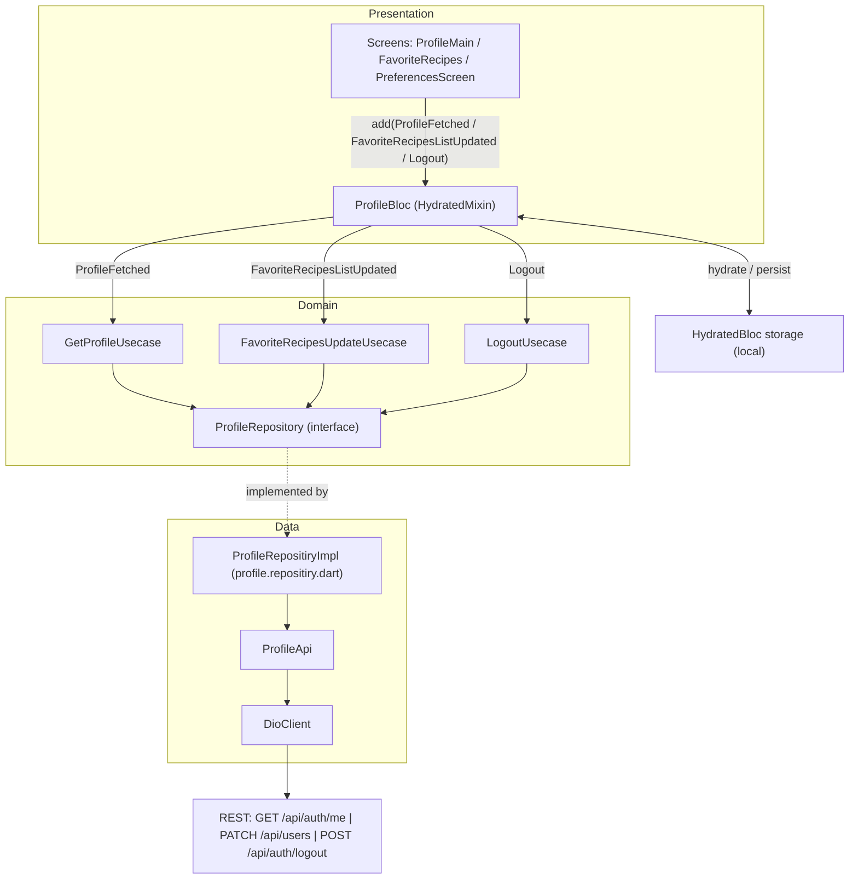

# Profile Feature (`mobile/lib/features/profile`)

The `profile/` feature owns everything related to the authenticated user's
account surface: viewing the profile, navigating to preferences, managing the
favorite-recipes list, and tearing the session down on logout. It is one of the
five mobile feature modules described in the project overview
([`../../../README.md`](../../../README.md)) and follows the same
clean-architecture layering used across the app, explained system-wide in
[`../../../../docs/ARCHITECTURE.md`](../../../../docs/ARCHITECTURE.md).

## Purpose

The feature presents the signed-in user's profile and exposes the actions that
operate on it. It loads the profile from the backend, renders the user's email
and an avatar, links out to a Preferences screen and a Favorite Recipes screen,
toggles recipes in and out of the favorites list, and performs a full
logout/session teardown.

State is managed by `ProfileBloc`, a BLoC that mixes in `HydratedMixin` so the
profile and favorites survive app restarts
(`Source: mobile/lib/features/profile/presentation/bloc/profile/profile_bloc.dart:L19`).
The three domain operations are encapsulated as use cases:
`GetProfileUsecase`
(`Source: mobile/lib/features/profile/domain/usecases/get_profile.usecase.dart:L10`),
`FavoriteRecipesUpdateUsecase`
(`Source: mobile/lib/features/profile/domain/usecases/favorite_recipes_update.usecase.dart:L14`),
and `LogoutUsecase`
(`Source: mobile/lib/features/profile/domain/usecases/logout.usecase.dart:L20`).

## Key components

The feature is split across the `domain/`, `data/`, and `presentation/` layers.
Each component below is listed with its source location.

**Presentation — BLoC**

- `ProfileBloc` — the `HydratedMixin` BLoC that drives the feature
  (`Source: mobile/lib/features/profile/presentation/bloc/profile/profile_bloc.dart:L19`).
- `ProfileEvent` and its events — the `sealed` event hierarchy
  (`Source: mobile/lib/features/profile/presentation/bloc/profile/profile_event.dart:L4`).
- `ProfileState` — the immutable state with `userProfile` and `favoriteRecipes`
  (`Source: mobile/lib/features/profile/presentation/bloc/profile/profile_state.dart:L5`).

**Domain — models, repository interface, use cases**

- `Profile` model
  (`Source: mobile/lib/features/profile/domain/models/profile.dart:L13-L54`).
- `Preferences` model
  (`Source: mobile/lib/features/profile/domain/models/preferences.dart:L11-L33`).
- `ProfileRepository` — the abstract repository interface, correctly spelled
  (`Source: mobile/lib/features/profile/domain/repositories/profile.repository.dart:L14`).
- `GetProfileUsecase`
  (`Source: mobile/lib/features/profile/domain/usecases/get_profile.usecase.dart:L10`),
  `FavoriteRecipesUpdateUsecase`
  (`Source: mobile/lib/features/profile/domain/usecases/favorite_recipes_update.usecase.dart:L14`),
  and `LogoutUsecase`
  (`Source: mobile/lib/features/profile/domain/usecases/logout.usecase.dart:L20`).
- `index.dart` barrel — re-exports only `get_profile.usecase.dart` and
  `logout.usecase.dart`
  (`Source: mobile/lib/features/profile/domain/usecases/index.dart:L10-L11`).

**Data — api, repository implementation, DTOs**

- `ProfileApi` — the Dio-backed HTTP client for the feature
  (`Source: mobile/lib/features/profile/data/api/profile.api.dart:L13`).
- `ProfileRepositiryImpl` — the concrete repository implementation
  (`Source: mobile/lib/features/profile/data/repositories/profile.repositiry.dart:L18`).
- `ProfileUpdateDto` — the patch-style update DTO
  (`Source: mobile/lib/features/profile/data/dto/profile_update.dto.dart:L12`).
- `FavoriteRecipesUpdateDto` — a plain (non-serialized) parameter object
  (`Source: mobile/lib/features/profile/data/dto/favorite_recipes_update.dto.dart:L6`).

**Presentation — widgets and screens**

- `ProfileAvatar` — a circular avatar widget
  (`Source: mobile/lib/features/profile/presentation/widgets/profile_avatar.dart:L11`).
- `ProfileNavigationItem` — a tappable navigation row
  (`Source: mobile/lib/features/profile/presentation/widgets/profile_navigation_item.dart:L9`).
- `ProfileMain` — the profile home screen
  (`Source: mobile/lib/features/profile/presentation/widgets/screens/profile_main.dart:L22`).
- `FavoriteRecipes` — the favorites list screen
  (`Source: mobile/lib/features/profile/presentation/widgets/screens/favorite_recipes.dart:L22`).
- `PreferencesScreen` — the preferences screen (see Known limitations / gaps)
  (`Source: mobile/lib/features/profile/presentation/widgets/screens/preferences.dart:L11`).

**Naming note (preserved as-is).** Both the data-layer file
`profile.repositiry.dart` and its implementation class `ProfileRepositiryImpl`
carry the "Repositiry" misspelling, while the domain interface they implement,
`ProfileRepository`, is correctly spelled. All three are intentional, stable
identifiers and are documented exactly as they appear; none is renamed
(`Source: mobile/lib/features/profile/data/repositories/profile.repositiry.dart:L18`).

## Architecture fit

The feature applies the clean-architecture split used throughout the mobile
client, with strict dependency direction from the outer layers inward:

- `domain/` holds the framework-agnostic core — the `Profile` and `Preferences`
  models, the `ProfileRepository` interface
  (`Source: mobile/lib/features/profile/domain/repositories/profile.repository.dart:L14`),
  and the use cases that orchestrate a single operation each.
- `data/` implements the domain contracts — `ProfileRepositiryImpl` realizes
  `ProfileRepository`
  (`Source: mobile/lib/features/profile/data/repositories/profile.repositiry.dart:L18`)
  and delegates transport to `ProfileApi`.
- `presentation/` hosts the `ProfileBloc`, widgets, and screens that the user
  interacts with.

Within `presentation/`, state is owned by `ProfileBloc`, which extends
`Bloc<ProfileEvent, ProfileState>` and mixes in `HydratedMixin` so the profile
and favorites are rehydrated from local storage on startup
(`Source: mobile/lib/features/profile/presentation/bloc/profile/profile_bloc.dart:L19`).
Networking is resolved through dependency injection: `ProfileApi` obtains its
Dio instance from the `get_it` service locator via `getIt<DioClient>().dio`
(`Source: mobile/lib/features/profile/data/api/profile.api.dart:L19`). For the
end-to-end, system-wide view of how the mobile client, the NestJS backend, and
MongoDB fit together, see
[`../../../../docs/ARCHITECTURE.md`](../../../../docs/ARCHITECTURE.md).

## Data models

The feature defines two `@JsonSerializable` models. Their JSON
serialization/deserialization is generated by `build_runner` into companion
`*.g.dart` part files, which are never hand-edited. Full schema detail
(including the backend Mongoose entities) lives in
[`../../../../docs/DATA_MODELS.md`](../../../../docs/DATA_MODELS.md).

**`Profile`** (`Source: mobile/lib/features/profile/domain/models/profile.dart:L13-L54`),
annotated `@JsonSerializable()` with `part 'profile.g.dart';`
(`Source: mobile/lib/features/profile/domain/models/profile.dart:L5`).

| Field | Type | Notes | Source |
|-------|------|-------|--------|
| `id` | `String` | User identifier | `Source: mobile/lib/features/profile/domain/models/profile.dart:L15` |
| `email` | `String` | User email | `Source: mobile/lib/features/profile/domain/models/profile.dart:L17` |
| `favoriteRecipes` | `List<String>` | Favorite recipe identifiers | `Source: mobile/lib/features/profile/domain/models/profile.dart:L19` |
| `recentSearches` | `List<String>` | Recent search terms | `Source: mobile/lib/features/profile/domain/models/profile.dart:L21` |
| `preferences` | `Preferences` | `@JsonKey(toJson: Mappers.preferencesToJson)` | `Source: mobile/lib/features/profile/domain/models/profile.dart:L23-L24` |

`Profile.fromJson` and `toJson` delegate to the generated code
(`Source: mobile/lib/features/profile/domain/models/profile.dart:L35`,
`Source: mobile/lib/features/profile/domain/models/profile.dart:L38`).

`Profile.copyWith({final List<String>? favoriteRecipes})` works correctly: it
applies `favoriteRecipes ?? this.favoriteRecipes` and carries every other field
(`id`, `email`, `recentSearches`, `preferences`) through unchanged
(`Source: mobile/lib/features/profile/domain/models/profile.dart:L47-L53`,
`Source: mobile/lib/features/profile/domain/models/profile.dart:L50`). This is
the correct contrast to the Recipe model's `copyWith`, whose `inFavorite`
parameter is a documented no-op described in
[`../../../../docs/DATA_MODELS.md`](../../../../docs/DATA_MODELS.md).

**`Preferences`** (`Source: mobile/lib/features/profile/domain/models/preferences.dart:L11-L33`),
annotated `@JsonSerializable()` with `part 'preferences.g.dart';`
(`Source: mobile/lib/features/profile/domain/models/preferences.dart:L10`,
`Source: mobile/lib/features/profile/domain/models/preferences.dart:L3`).

| Field | Type | Default | Source |
|-------|------|---------|--------|
| `dietary` | `List<String>` | `const []` | `Source: mobile/lib/features/profile/domain/models/preferences.dart:L13` |
| `allergies` | `List<String>` | `const []` | `Source: mobile/lib/features/profile/domain/models/preferences.dart:L15` |
| `dislikedIngredients` | `List<String>` | `const []` | `Source: mobile/lib/features/profile/domain/models/preferences.dart:L17` |
| `cookingTime` | `double?` | none (nullable) | `Source: mobile/lib/features/profile/domain/models/preferences.dart:L19` |

## API endpoints / public interface

**Consumed REST endpoints.** The feature calls three backend routes through
`ProfileApi`. The mobile base URL already includes the `/api` prefix, so these
routes resolve to `/api/<resource>` with **no `/v1/` segment**. Full
request/response detail lives in
[`../../../../docs/API_REFERENCE.md`](../../../../docs/API_REFERENCE.md).

| Method | Path | Purpose | Source |
|--------|------|---------|--------|
| `GET` | `/api/auth/me` | Fetch the current user's profile | `Source: mobile/lib/core/constants/endpoints.dart:L47` (`ProfileApi.getProfile`, `Source: mobile/lib/features/profile/data/api/profile.api.dart:L24-L27`) |
| `PATCH` | `/api/users` | Update the profile (patch body omits null fields) | `Source: mobile/lib/core/constants/endpoints.dart:L50` (`ProfileApi.updateProfile`, `Source: mobile/lib/features/profile/data/api/profile.api.dart:L32-L34`) |
| `POST` | `/api/auth/logout` | Server-side logout | `Source: mobile/lib/core/constants/endpoints.dart:L44` (`ProfileApi.logout`, `Source: mobile/lib/features/profile/data/api/profile.api.dart:L38-L40`) |

**Public Dart interface.** The feature's domain surface is the abstract
`ProfileRepository`, which declares three methods: `getProfile()`,
`updateFavoriteRecipesList(List<String> list)`, and `logout()`
(`Source: mobile/lib/features/profile/domain/repositories/profile.repository.dart:L16`,
`Source: mobile/lib/features/profile/domain/repositories/profile.repository.dart:L21`,
`Source: mobile/lib/features/profile/domain/repositories/profile.repository.dart:L24`).
Callers typically invoke these through the use cases rather than the repository
directly:

- `GetProfileUsecase.call()` instantiates `ProfileRepositiryImpl()` and returns
  `repo.getProfile()`
  (`Source: mobile/lib/features/profile/domain/usecases/get_profile.usecase.dart:L19-L21`).
- `FavoriteRecipesUpdateUsecase.call(dto)` calls
  `updateFavoriteRecipesList(dto.favoriteList)` and, when `dto.addedId != null`,
  fetches the newly added recipe via the Recipe repository and returns it
  (`Source: mobile/lib/features/profile/domain/usecases/favorite_recipes_update.usecase.dart:L25`,
  `Source: mobile/lib/features/profile/domain/usecases/favorite_recipes_update.usecase.dart:L30-L35`).
- `LogoutUsecase.call(context)` logs out server-side, removes the persisted
  tokens, resets the Pantry/Recipe/Profile/Home BLoCs, clears hydrated storage,
  and routes to the authentication entry point
  (`Source: mobile/lib/features/profile/domain/usecases/logout.usecase.dart:L27-L46`).

## Configuration

The feature itself declares no configuration values; it relies on two
app-level mechanisms:

- **API base URL.** The backend root comes from `EnvConfig.apiBaseUrl`, a
  compile-time constant resolved with `String.fromEnvironment('API_BASE_URL')`
  and defaulting to `http://192.168.2.20:3000/api`
  (`Source: mobile/lib/env_config.dart:L23`). `ProfileApi` reaches the network
  through the shared `DioClient`, which is configured from this base URL
  (`Source: mobile/lib/features/profile/data/api/profile.api.dart:L19`).
- **Persisted state.** Hydrated storage is built once during app startup —
  `HydratedBloc.storage = await HydratedStorage.build(...)` in `main.dart`
  (`Source: mobile/lib/main.dart:L35-L37`). `ProfileBloc` opts into that storage
  by calling `hydrate()` in its constructor, which is what makes the profile and
  favorites survive restarts
  (`Source: mobile/lib/features/profile/presentation/bloc/profile/profile_bloc.dart:L22`).

Override the API base URL at build/run time with
`--dart-define API_BASE_URL=http://<host>:3000/api`
(`Source: mobile/lib/env_config.dart:L23`); see Local development below.

## Data flow

A user action on a screen dispatches a `ProfileEvent` to `ProfileBloc`. The
BLoC's handler invokes the matching use case, which calls the
`ProfileRepository` interface — realized by `ProfileRepositiryImpl` (the
preserved misspelling) in `profile.repositiry.dart`. The implementation delegates
to `ProfileApi`, which issues the HTTP request through the shared `DioClient` to
the REST backend. Persisted state is rehydrated from `HydratedBloc` storage on
startup rather than from the network.



_Diagram sources: `ProfileBloc` event handlers
(`Source: mobile/lib/features/profile/presentation/bloc/profile/profile_bloc.dart:L19-L86`),
`ProfileRepositiryImpl`
(`Source: mobile/lib/features/profile/data/repositories/profile.repositiry.dart:L18-L53`),
`ProfileApi`
(`Source: mobile/lib/features/profile/data/api/profile.api.dart:L13-L41`),
and the endpoint constants
(`Source: mobile/lib/core/constants/endpoints.dart:L44-L50`)._

Three representative flows make the diagram concrete:

- **Load profile.** `ProfileFetched` triggers `GetProfileUsecase`, which calls
  `getProfile()` and emits the result into `state.userProfile`
  (`Source: mobile/lib/features/profile/presentation/bloc/profile/profile_bloc.dart:L24-L30`).
- **Toggle a favorite.** `FavoriteRecipesListUpdated` rebuilds the favorite-id
  list (inserting or removing the recipe), invokes `FavoriteRecipesUpdateUsecase`,
  and emits the updated profile and favorites
  (`Source: mobile/lib/features/profile/presentation/bloc/profile/profile_bloc.dart:L44-L74`).
  An empty favorites list short-circuits the fetch path
  (`Source: mobile/lib/features/profile/presentation/bloc/profile/profile_bloc.dart:L32-L42`).
- **Logout.** `Logout` runs `LogoutUsecase`, and `ProfileDataReseted` emits a
  fresh `ProfileState`
  (`Source: mobile/lib/features/profile/presentation/bloc/profile/profile_bloc.dart:L76-L85`).

## Design patterns used

- **BLoC with persisted state.** `ProfileBloc` extends
  `Bloc<ProfileEvent, ProfileState>` and mixes in `HydratedMixin`, overriding
  `fromJson`/`toJson` to persist `userProfile` and `favoriteRecipes`
  (`Source: mobile/lib/features/profile/presentation/bloc/profile/profile_bloc.dart:L19`,
  `Source: mobile/lib/features/profile/presentation/bloc/profile/profile_bloc.dart:L90-L98`,
  `Source: mobile/lib/features/profile/presentation/bloc/profile/profile_bloc.dart:L101-L107`).
- **Repository pattern.** The domain interface `ProfileRepository`
  (`Source: mobile/lib/features/profile/domain/repositories/profile.repository.dart:L14`)
  is implemented by `ProfileRepositiryImpl`
  (`Source: mobile/lib/features/profile/data/repositories/profile.repositiry.dart:L18`),
  decoupling the domain from the transport.
- **Use Case pattern.** Each operation is a single-responsibility use case:
  `GetProfileUsecase implements UseCase<Profile>`
  (`Source: mobile/lib/features/profile/domain/usecases/get_profile.usecase.dart:L10`),
  while `FavoriteRecipesUpdateUsecase` and `LogoutUsecase` implement
  `UseCaseWithParams`
  (`Source: mobile/lib/features/profile/domain/usecases/favorite_recipes_update.usecase.dart:L14`,
  `Source: mobile/lib/features/profile/domain/usecases/logout.usecase.dart:L20`).
- **Dependency injection.** Cross-cutting collaborators are resolved through the
  `get_it` service locator — for example `getIt<DioClient>().dio`
  (`Source: mobile/lib/features/profile/data/api/profile.api.dart:L19`).
- **DTO mapping.** `ProfileUpdateDto.toJsonWithoutNullFields()` builds a
  patch-style payload that omits null fields for the `PATCH /api/users` request
  (`Source: mobile/lib/features/profile/data/dto/profile_update.dto.dart:L36-L57`).

## Known limitations / gaps

**KNOWN ISSUE: the Preferences screen renders no content.**
`PreferencesScreen.build` returns a `PlatformScaffold` whose only argument is an
app bar (`getAppBarWidget`); it supplies **no `body`**, so the screen displays an
app bar over an empty page
(`Source: mobile/lib/features/profile/presentation/widgets/screens/preferences.dart:L15-L26`).
This behavior is documented as-is and is not modified here.

**Preserved misspelled identifiers.** The data-layer file
`profile.repositiry.dart` and its class `ProfileRepositiryImpl` both retain the
"Repositiry" misspelling, whereas the domain interface `ProfileRepository` is
correctly spelled
(`Source: mobile/lib/features/profile/data/repositories/profile.repositiry.dart:L18`).
These are intentional, stable identifiers and must not be renamed.

**Use-case barrel omission.** The `domain/usecases/index.dart` barrel re-exports
only `get_profile.usecase.dart` and `logout.usecase.dart`; it does not export
`favorite_recipes_update.usecase.dart`, so consumers import that use case
directly
(`Source: mobile/lib/features/profile/domain/usecases/index.dart:L10-L11`).

## Local development

The feature compiles as part of the mobile client. From the `mobile/` directory:

1. Install dependencies:

   ```bash
   flutter pub get
   ```

2. Generate the `@JsonSerializable` code for the models and DTO — `Profile`,
   `Preferences`, and `ProfileUpdateDto` each rely on a generated `*.g.dart`
   part file
   (`Source: mobile/lib/features/profile/domain/models/profile.dart:L5`,
   `Source: mobile/lib/features/profile/domain/models/preferences.dart:L3`,
   `Source: mobile/lib/features/profile/data/dto/profile_update.dto.dart:L4`):

   ```bash
   dart run build_runner build --delete-conflicting-outputs
   ```

3. Run the app, pointing it at a reachable backend
   (`Source: mobile/lib/env_config.dart:L23`):

   ```bash
   flutter run --dart-define API_BASE_URL=http://<host>:3000/api
   ```

When adding inline Dartdoc to this feature's sources, keep `dart analyze` green:
`mobile/analysis_options.yaml` elevates lints such as
`always_use_package_imports`, `require_trailing_commas`, and `avoid_print` to
errors and excludes `**/*.g.dart` from analysis. Never hand-edit the generated
`*.g.dart` files; regenerate them with `build_runner` instead.
