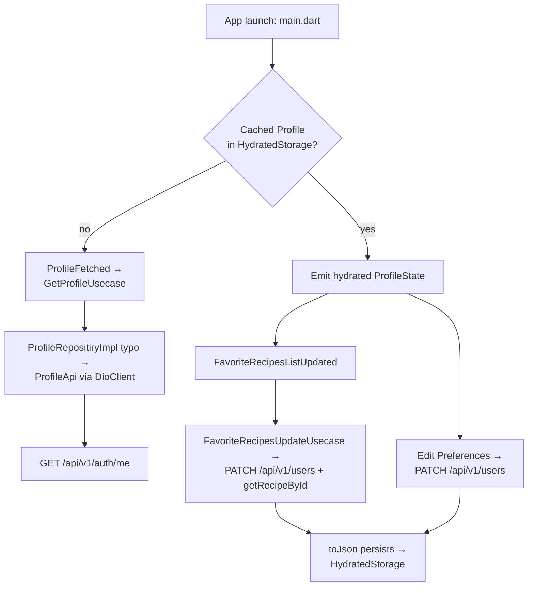

# Profile Feature

## Module Purpose

The Profile feature manages the authenticated user's profile state — the embedded `Preferences` value object (dietary, allergies, disliked ingredients, cooking time) plus the favorite-recipes list — and renders the profile dashboard, preferences page, and favorites list. State is offline-first: `ProfileBloc` is a `Bloc` with `HydratedMixin` (functionally equivalent to a `HydratedBloc`) that serializes itself to `HydratedBloc.storage`, configured in `mobile/lib/main.dart:L14-L16` against the `path_provider` temporary directory. It also coordinates favorite-recipe synchronization with the backend `User.favoriteRecipes` array and owns the multi-step logout flow (Source: `mobile/lib/features/profile/domain/usecases/logout.usecase.dart:L17-L28`). Note: `data/repositories/profile.repositiry.dart` and its class `ProfileRepositiryImpl` carry an intentional typo — "repositiry" — preserved verbatim per AAP §0.10 and must not be renamed (Source: `mobile/lib/features/profile/data/repositories/profile.repositiry.dart:L6`).

## Key Components

| Path | Type | Responsibility |
|------|------|----------------|
| `domain/models/profile.dart` | Model | `Profile` domain entity mirroring backend `User`; carries `id`, `email`, `favoriteRecipes`, `recentSearches`, embedded `preferences`. |
| `domain/models/preferences.dart` | Model | `Preferences` value object: `dietary[]`, `allergies[]`, `dislikedIngredients[]`, `cookingTime?`. Mirrors backend embedded subdocument. |
| `domain/repositories/profile.repository.dart` | Repository (contract) | Abstract repository declaring `getProfile`, `updateFavoriteRecipesList`, `logout`. |
| `domain/usecases/get_profile.usecase.dart` | UseCase | Implements `UseCase<Profile>`; orchestrates `GET /auth/me`. |
| `domain/usecases/favorite_recipes_update.usecase.dart` | UseCase | Implements `UseCaseWithParams<Recipe?, FavoriteRecipesUpdateDto>`; updates favorites and fetches the newly added recipe. |
| `domain/usecases/logout.usecase.dart` | UseCase | Orchestrates multi-step logout: API call + SharedPreferences clear + BLoC resets + HydratedBloc storage clear + navigation. |
| `domain/usecases/index.dart` | Barrel export | Re-exports `get_profile.usecase.dart` and `logout.usecase.dart` only; `favorite_recipes_update.usecase.dart` is intentionally absent and is imported directly (Source: `index.dart:L1-L2`). |
| `data/api/profile.api.dart` | Dio API client | Wraps Dio calls to `/auth/me`, `/users`, `/auth/logout` via the shared `DioClient` from GetIt. |
| `data/dto/profile_update.dto.dart` | Request DTO | Optional fields with `toJsonWithoutNullFields()` for PATCH-style requests. |
| `data/dto/favorite_recipes_update.dto.dart` | Request DTO | Plain class carrying `favoriteList: List<String>` and `addedId: String?`. |
| `data/repositories/profile.repositiry.dart` (file name preserved verbatim — typo retained) | Repository (implementation) | Concrete `ProfileRepositiryImpl` (class name also preserves the typo) that implements `ProfileRepository`. |
| `presentation/bloc/profile/profile_bloc.dart` | BLoC | `ProfileBloc` (`Bloc` with `HydratedMixin`) that handles profile fetch, favorites fetch/update, logout, reset; `fromJson`/`toJson` persist state via `HydratedBloc.storage`. |
| `presentation/bloc/profile/profile_event.dart` | Events | Sealed events: `ProfileFetched`, `FavoriteRecipesFetched`, `FavoriteRecipesListUpdated`, `Logout`, `ProfileDataReseted`. |
| `presentation/bloc/profile/profile_state.dart` | State | `ProfileState` with `userProfile: Profile?`, `favoriteRecipes: List<Recipe>?`. |
| `presentation/widgets/profile_avatar.dart` | Widget | Themed 100×100 placeholder avatar with person icon. |
| `presentation/widgets/profile_navigation_item.dart` | Widget | Tappable row with title + chevron; navigates via `Navigator.pushNamed`. |
| `presentation/widgets/screens/profile_main.dart` | Screen | Profile dashboard composing avatar, email, navigation items, and logout button. |
| `presentation/widgets/screens/preferences.dart` | Screen | Preferences edit page (currently a stub with `PlatformScaffold` and app bar only). |
| `presentation/widgets/screens/favorite_recipes.dart` | Screen | Favorites list with shimmer loading, empty state, and `RecipeCard` list. |

## Architecture Fit

This feature follows the mobile clean-architecture layering in [../../../../ARCHITECTURE.md](../../../../ARCHITECTURE.md) § BLoC State Management: `presentation` → `domain` → `data`. `ProfileBloc` is hydrated through `HydratedMixin` and persists across launches via `HydratedBloc.storage` (configured in `mobile/lib/main.dart:L14-L16`), making Profile the canonical example of offline-first user data. The client-side `Preferences` model mirrors the backend's embedded `Preferences` subdocument 1:1; see [../../../../DATA_MODEL.md](../../../../DATA_MODEL.md) § Preferences (embedded subdocument) for the canonical schema.

## Dependencies

### Internal

- `mobile/lib/core/utils/dio_client.dart` — shared `DioClient` consumed via `getIt<DioClient>().dio`.
- `mobile/lib/core/utils/shared_preferences_helper.dart` — JWT access/refresh token clearing on logout.
- `mobile/lib/core/utils/service_locator.dart` — GetIt DI bootstrap (resolves `DioClient` and `SharedPreferencesHelper`).
- `mobile/lib/core/utils/usercase.dart` (file name verbatim) — `UseCase<T>` and `UseCaseWithParams<T, P>` interfaces.
- `mobile/lib/core/constants/endpoints.dart` — `/auth/me` (L15), `/users` (L16), `/auth/logout` (L14).
- `mobile/lib/core/constants/preferences.dart` — SharedPreferences storage keys for tokens.
- `mobile/lib/core/constants/navigation.dart` — `Navigation.preferences`, `Navigation.favoriteRecipes`, `Navigation.authenticationStart`.
- `mobile/lib/features/recipe/` — `Recipe` model and `RecipeRepositoryImpl.getRecipeById()` used by `FavoriteRecipesUpdateUsecase`; `RecipeBloc` reset on logout.
- `mobile/lib/features/pantry/` — `PantryBloc` reset on logout.
- `mobile/lib/core/presentation/bloc/home/home_bloc.dart` — `HomeBloc` tab reset on logout.

### External

| Package | Version | Source |
|---------|---------|--------|
| `bloc` | `^8.1.4` | `mobile/pubspec.yaml:L38` |
| `flutter_bloc` | `^8.1.6` | `mobile/pubspec.yaml:L39` |
| `hydrated_bloc` | `^9.1.5` | `mobile/pubspec.yaml:L43` |
| `equatable` | `^2.0.5` | `mobile/pubspec.yaml:L41` |
| `json_annotation` | `^4.9.0` | `mobile/pubspec.yaml:L40` |
| `dio` | `^5.7.0` | `mobile/pubspec.yaml:L50` |
| `path_provider` | `^2.1.5` | `mobile/pubspec.yaml:L49` (indirect — backs `HydratedStorage` temp directory) |
| `flutter_platform_widgets` | `^7.0.1` | `mobile/pubspec.yaml:L33` (used by screens for `PlatformScaffold`) |

## Primary Use Cases

- **Load profile on app start** — `ProfileBloc.hydrate()` rehydrates persisted state via `fromJson`; if none is cached, the UI dispatches `ProfileFetched` → `GetProfileUsecase` → `ProfileRepositiryImpl.getProfile()` → `ProfileApi.getProfile()` → `GET /api/v1/auth/me` (Source: `profile_bloc.dart:L16-L22`).
- **View and edit preferences** — from `ProfileMain`, `Navigation.preferences` opens `PreferencesScreen`, presently a stub of `PlatformScaffold` plus an app bar only (Source: `preferences.dart:L11-L17`).
- **Update profile / preferences** — updates go through `ProfileApi.updateProfile(ProfileUpdateDto)` → `PATCH /api/v1/users` using `toJsonWithoutNullFields()` for null-safe partial updates (Source: `profile.api.dart:L19-L21`).
- **Manage favorite recipes** — `FavoriteRecipesListUpdated(recipeId, isFavorite)` drives `FavoriteRecipesUpdateUsecase`, which updates favorites server-side via `PATCH /api/v1/users` and fetches the added recipe via `RecipeRepositoryImpl.getRecipeById()` to enrich BLoC state (Source: `favorite_recipes_update.usecase.dart:L11-L20`).
- **View favorites list** — the `FavoriteRecipes` screen renders cached recipes with shimmer loading and empty states, lazily dispatching `FavoriteRecipesFetched` when the list is null (Source: `favorite_recipes.dart:L25-L29`).
- **Logout** — `Logout(context)` → `LogoutUsecase`: (1) `POST /api/v1/auth/logout`; (2) `SharedPreferencesHelper.removeAccessToken()`/`removeRefreshToken()`; (3) reset events to `PantryBloc`, `RecipeBloc`, `ProfileBloc`, and `HomeBloc`; (4) `HydratedBloc.storage.clear()`; (5) `Navigator.pushNamedAndRemoveUntil(Navigation.authenticationStart, (_) => false)` (Source: `logout.usecase.dart:L17-L28`).
- **Reset profile state** — the `ProfileDataReseted` event resets `ProfileState` to its empty default, invoked during logout teardown (Source: `profile_bloc.dart:L67-L69`).

## API / Endpoint Reference

| Method | Path | Guard | Description |
|--------|------|-------|-------------|
| GET | `/api/v1/auth/me` | JWT (Bearer) | Returns the current `User` including embedded `Preferences` and the `favoriteRecipes` array. Source: `mobile/lib/features/profile/data/api/profile.api.dart:L14-L17`, `mobile/lib/core/constants/endpoints.dart:L15`. |
| PATCH | `/api/v1/users` | JWT (Bearer) | Updates the current user's mutable fields (`email`, `password`, `preferences`, `favoriteRecipes`). Body produced via `ProfileUpdateDto.toJsonWithoutNullFields()`. Source: `mobile/lib/features/profile/data/api/profile.api.dart:L19-L21`, `mobile/lib/core/constants/endpoints.dart:L16`. |
| POST | `/api/v1/auth/logout` | JWT (Bearer) | Invalidates the refresh session server-side. Source: `mobile/lib/features/profile/data/api/profile.api.dart:L23-L25`, `mobile/lib/core/constants/endpoints.dart:L14`. |

## Data Flows

## Configuration

| Configuration | Default / Value | Source | Notes |
|---------------|------------------|--------|-------|
| `API_BASE_URL` (compile-time) | `http://192.168.2.20:3000/api` | `mobile/lib/env_config.dart:L2` | Set via `--dart-define API_BASE_URL=...` at Flutter build time. |
| `Endpoints.profile` | `$apiBaseUrl/auth/me` | `mobile/lib/core/constants/endpoints.dart:L15` | Loads current profile. |
| `Endpoints.updateProfile` | `$apiBaseUrl/users` | `mobile/lib/core/constants/endpoints.dart:L16` | PATCH profile and preferences. |
| `Endpoints.logout` | `$apiBaseUrl/auth/logout` | `mobile/lib/core/constants/endpoints.dart:L14` | Invalidates server-side refresh session. |
| `Preferences.accessToken` | `"accessToken"` | `mobile/lib/core/constants/preferences.dart:L4` | SharedPreferences key for the JWT access token (cleared on logout). |
| `Preferences.refreshToken` | `"refreshToken"` | `mobile/lib/core/constants/preferences.dart:L5` | SharedPreferences key for the JWT refresh token (cleared on logout). |
| `HydratedBloc.storage` directory | `getTemporaryDirectory()` | `mobile/lib/main.dart:L14-L16` | OS temp dir via `path_provider`; eviction-prone under storage pressure. |

## Known Limitations and Implementation Gaps

> ⚠️ **Favorites client/server divergence risk.** Favorites are stored both client-side (in the hydrated `ProfileBloc` state) and server-side (`User.favoriteRecipes` array). Reconciliation is event-driven only — if a server-side update happens out-of-band (e.g., another device, admin tool, or background job), the two stores may drift until the next `ProfileFetched` cycle.

> ⚠️ **`profile.repositiry.dart` file name preserved verbatim.** The file at `mobile/lib/features/profile/data/repositories/profile.repositiry.dart` (and its inner class `ProfileRepositiryImpl`) carries the intentional typo "repositiry" instead of "repository". This is a stable file-system contract and must not be renamed (Source: `mobile/lib/features/profile/data/repositories/profile.repositiry.dart:L6`).

> ⚠️ **`Preferences` mirrors backend embedded subdocument.** The `Preferences` value object on mobile maps directly to the backend's embedded `Preferences` subdocument (`dietary[]`, `allergies[]`, `dislikedIngredients[]`, `cookingTime`). Field names and types must stay in lockstep with the backend `user.schema.ts` definition. See [../../../../DATA_MODEL.md](../../../../DATA_MODEL.md) § Preferences (embedded subdocument) for the canonical schema.

> ⚠️ **No `HydratedBloc.storage` rotation across user switches.** While `LogoutUsecase` does call `HydratedBloc.storage.clear()` (Source: `mobile/lib/features/profile/domain/usecases/logout.usecase.dart:L27`), it does not *rotate* the storage namespace per user. On a shared device, a brief window between sessions could expose stale hydrated state if the clear is interrupted or another isolate writes before the clear completes.

## Production Readiness Status

> 🚧 **No account deletion confirmation UX; no GDPR data export flow.** The `DELETE /api/v1/users/:id` endpoint exists but no UI is wired to call it, and there is no in-app data-export workflow for compliance. See [../../../../PRODUCTION_READINESS.md](../../../../PRODUCTION_READINESS.md) § Mobile Release.

> 🚧 **Logout storage rotation hardening.** While `HydratedBloc.storage.clear()` is invoked during logout, production should additionally rotate the storage namespace per user (e.g., a per-user storage directory or namespaced key prefix) to eliminate the risk of stale profile data leaking across users on a shared device. See [../../../../PRODUCTION_READINESS.md](../../../../PRODUCTION_READINESS.md) § Security Hardening.

> 🚧 **Hydrated storage in OS temp directory.** `HydratedBloc.storage` is built against `getTemporaryDirectory()` (Source: `mobile/lib/main.dart:L14-L16`), which the operating system may evict under low-storage pressure, causing a forced refetch on cold start. See [../../../../ARCHITECTURE.md](../../../../ARCHITECTURE.md) § BLoC State Management.

> 🚧 **Favorites reconciliation strategy.** The current sync is event-driven only. An explicit "sync on app foreground" event is recommended for multi-device scenarios where favorites may have changed out-of-band. See [../../../../PRODUCTION_READINESS.md](../../../../PRODUCTION_READINESS.md) § Mobile Release.
