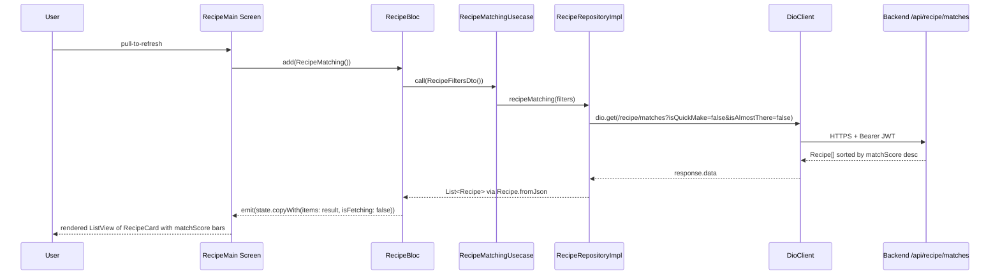

# Recipe Feature (Mobile)

## Module Purpose

The `mobile/lib/features/recipe/` feature implements recipe browsing, detail, and pantry-aware matching for the PantryChef Flutter client. It consumes the backend `/api/recipe` family — most notably `GET /api/recipe/matches`, which scores recipes against the user's pantry and `Preferences` (see [ARCHITECTURE.md](../../../../ARCHITECTURE.md) § Recipe Matching Pipeline). The domain layer preserves backend spellings verbatim (`ingridientList`, `InstractionItem`, `instraction_item.dart`) and contains a documented `Recipe.copyWith` no-op on `inFavorite` (see Known Limitations), surfaced but not fixed here.

## Key Components

| Path | Type | Responsibility |
| --- | --- | --- |
| `domain/models/recipe.dart` | Model | `Recipe` domain model; `ingridientList` field (sic, L34) and `instructions: List<InstractionItem>` (sic, L41); contains the `copyWith` no-op on `inFavorite` (L92-L108). |
| `domain/models/instraction_item.dart` | Model | `InstractionItem` class (filename + class name both preserved verbatim); fields `step`, `description`, optional `timer`. |
| `domain/models/ingredient_list_item.dart` | Model | `IngredientListItem` (correct mobile spelling) maps to backend's verbatim `IngridientList` sub-schema; its `ingridient` field (lowercase, sic) is preserved to match backend JSON. |
| `domain/repositories/recipe.repository.dart` | Repository contract | Abstract `RecipeRepository` with `getRecipeList`, `getFavoriteList`, `recipeMatching`, `getRecipeById`. |
| `domain/usecases/get_recipe_list.usecase.dart` | UseCase | `GetRecipeListUsecase` — paginated list. |
| `domain/usecases/get_favorite_recipe_list.usecase.dart` | UseCase | `GetFavoriteRecipeListUsecase` — resolves favorite IDs. |
| `domain/usecases/recipe_matching.usecase.dart` | UseCase | `RecipeMatchingUsecase` — pantry-aware matches. |
| `domain/usecases/index.dart` | Barrel | Re-exports the three use cases. |
| `data/api/recipe.api.dart` | Dio API client | `RecipeApi` wraps `getIt<DioClient>().dio`; calls `Endpoints.recipe` plus `/matches`, `/:id` suffixes. |
| `data/dto/query_recipe.dto.dart` | DTO | `QueryRecipeDto` for pagination (`page`, `limit`, `query`, `ids`, `sort`). |
| `data/dto/recipe_filters.dto.dart` | DTO | `RecipeFiltersDto` for backend's `isQuickMake` and `isAlmostThere` query flags. |
| `data/dto/index.dart` | Barrel | Re-exports `recipe_filters.dto.dart`. |
| `data/repositories/recipe.repository.dart` | Repository impl | `RecipeRepositoryImpl` adapts API payloads to `Recipe.fromJson`. |
| `presentation/bloc/recipe/recipe_bloc.dart` | BLoC | `RecipeBloc` handles `RecipeListFetched`, `RecipeMatching`, `RecipeDetailedSelected`, `RecipeListReseted`. |
| `presentation/bloc/recipe/recipe_event.dart` | Events | Four sealed events extending `Equatable`. |
| `presentation/bloc/recipe/recipe_state.dart` | State | `RecipeState` with `items?`, `isFetching`, `detailedItemId?`. |
| `presentation/widgets/recipe_card.dart` | Widget | List card with image, title, prep/cook/servings, `matchScore` progress bar, favorite toggle (talks to `ProfileBloc`). |
| `presentation/widgets/screens/recipe_main.dart` | Screen | Recipe list / matches screen with `ShimmerList`, empty state, `RefreshIndicator`. |
| `presentation/widgets/screens/recipe_detailed.dart` | Screen | Recipe detail screen rendering `ingridientList` (sic) and `instructions` (typed `List<InstractionItem>`, sic). |

## Architecture Fit

The feature follows the standard mobile clean-architecture pattern: `presentation/` (BLoC, widgets, screens) calls `domain/` use cases over the abstract `RecipeRepository`, bound to the `data/` layer's `RecipeRepositoryImpl`. Backend integration funnels through `RecipeApi` over the app-wide `getIt<DioClient>().dio` instance with its JWT bearer interceptor (see [ARCHITECTURE.md](../../../../ARCHITECTURE.md) § JWT Authentication Flow). The **matching algorithm runs entirely on the server**; the mobile feature is a thin consumer that issues `GET /api/recipe/matches` and renders the sorted result (see [ARCHITECTURE.md](../../../../ARCHITECTURE.md) § Recipe Matching Pipeline).

## Dependencies

### Internal

| Path | Purpose |
| --- | --- |
| `core/utils/dio_client.dart` | Shared `DioClient` with the JWT bearer interceptor |
| `core/utils/service_locator.dart` | `getIt<DioClient>()` resolution |
| `core/constants/endpoints.dart` | `recipe` endpoint constant (L71); `/matches` and `/:id` suffixes appended at the API client |
| `core/utils/usercase.dart` | `UseCase`/`UseCaseWithParams` interfaces used by the three use cases |
| `features/ingredient/domain/models/ingredient.dart` | `IngredientListItem.ingridient` is typed `Ingredient` |
| `features/profile/presentation/bloc/profile/profile_bloc.dart` | `RecipeCard` dispatches `FavoriteRecipesListUpdated` to it |
| `core/constants/navigation.dart` | `Navigation.recipeDetailed` route used by `RecipeCard` |

### External

Versions pinned exactly per `mobile/pubspec.yaml`:

| Package | Version | Source |
| --- | --- | --- |
| `bloc` | ^8.1.4 | `mobile/pubspec.yaml:L38` |
| `flutter_bloc` | ^8.1.6 | `mobile/pubspec.yaml:L39` |
| `hydrated_bloc` | ^9.1.5 | `mobile/pubspec.yaml:L43` (imported by `recipe_bloc.dart`) |
| `json_annotation` | ^4.9.0 | `mobile/pubspec.yaml:L40` |
| `equatable` | ^2.0.5 | `mobile/pubspec.yaml:L41` |
| `cached_network_image` | ^3.4.1 | `mobile/pubspec.yaml:L45` |
| `dio` | ^5.7.0 | `mobile/pubspec.yaml:L50` |
| `flutter_platform_widgets` | ^7.0.1 | `mobile/pubspec.yaml:L33` |

## Primary Use Cases

- **Browse recipes** — `RecipeMain` shows a paginated list of `RecipeCard` items with `imageUrl`, `title`, `description`, `prepTime`, `cookTime`, `servings`, and a `matchScore` progress bar coloured by `_getProgressBarColor` (≥0.7 green, 0.3–0.7 orange, <0.3 red).
- **Get pantry-aware matches** — `GET /api/recipe/matches` with optional `isQuickMake`/`isAlmostThere` flags; the server sorts by `matchScore` desc and `RecipeBloc` emits the items list.
- **View recipe detail** — `RecipeDetailed` renders `ingridientList` (spelling preserved verbatim) as `"<name>, <amount> <unit>"` lines, then `instructions` (`List<InstractionItem>`, preserved verbatim) as `"<step>. <description>"` lines.
- **Filter by quick-make / almost-there** — `RecipeFiltersDto` exposes the two boolean flags, serialized via `toJson()` (see the contract caveat in Known Limitations).
- **Toggle favorite** — `RecipeCard` does NOT mutate `Recipe`; it dispatches `FavoriteRecipesListUpdated(recipeId, isFavorite)` to `ProfileBloc`, which manages `User.favoriteRecipes` (see [DATA_MODEL.md](../../../../DATA_MODEL.md) § User).

## API / Endpoint Reference

Endpoints consumed via `RecipeApi`, all under `/api/recipe` — the `recipe` controller declares `version: '1'`, but that argument is **inert** because the backend never calls `app.enableVersioning()`, so the routes carry no `/v1/` segment under the global `api` prefix (Source: `backend/src/main.ts:L10-L35`). Each requires JWT auth (`@UseGuards(AuthGuard('jwt'))`); the bearer header is attached by the shared `DioClient` interceptor.

| Method | Path | Backend Guard | Mobile Method |
| --- | --- | --- | --- |
| `GET` | `/api/recipe/matches` | `AuthGuard('jwt')` | `RecipeApi.recipeMatching(filters)` — query params from `RecipeFiltersDto.toJson()` |
| `GET` | `/api/recipe` | `AuthGuard('jwt')` | `RecipeApi.getRecipeList()` and `RecipeApi.getFavoriteList(ids)` (the latter passes `QueryRecipeDto(ids: ids)`) |
| `GET` | `/api/recipe/:id` | `AuthGuard('jwt')` | `RecipeApi.getRecipeById(id)` |

> Note: the backend also exposes `POST /api/recipe` (create), but `RecipeApi` has **no** create method and the mobile UI does not surface it — it is intentionally excluded from the consumed list above.

Backend pagination caps `limit` at 50 per page; mobile `QueryRecipeDto.limit` defaults to 500 and the backend silently clamps it. See [backend recipe README](../../../../backend/src/recipe/README.md).

## Data Flows

The diagram traces a pantry-aware match request from pull-to-refresh to the rendered list. The full server-side algorithm lives in [ARCHITECTURE.md](../../../../ARCHITECTURE.md) § Recipe Matching Pipeline — the mobile feature is a thin consumer.

## Configuration

The recipe feature has no per-feature configuration; it inherits the app-wide compile-time configuration:

| Option | Source | Notes |
| --- | --- | --- |
| `API_BASE_URL` | `mobile/lib/env_config.dart` — compile-time via `--dart-define API_BASE_URL=<value>` | Default `http://192.168.2.20:3000/api` (local network IP); production builds must override. |
| `Endpoints.recipe` | `mobile/lib/core/constants/endpoints.dart:L71` — `'$apiBaseUrl/recipe'` | Used by `RecipeApi`; `/matches` and `/:id` suffixes appended at call sites. |
| `isQuickMake`, `isAlmostThere` | `RecipeFiltersDto` query params | Both default to `false` and are ALWAYS serialized via `toJson()`; the backend treats the query string truthily — see Known Limitations. |

## Known Limitations and Implementation Gaps

> ⚠️ **Preserved spellings (verbatim from backend)** — do NOT rename: `instraction_item.dart` and its `InstractionItem` class (`instraction_item.dart:L13`); the import at `recipe.dart:L5`; the `ingridientList` field (`recipe.dart:L34`); `instructions: List<InstractionItem>` (`recipe.dart:L41`); and the lowercase `ingridient` field on `IngredientListItem` (`ingredient_list_item.dart:L19`), preserved to keep JSON aligned with backend's `IngridientList.ingridient`. The class name `IngredientListItem` stays corrected (see [DATA_MODEL.md](../../../../DATA_MODEL.md) § Recipe).

> ⚠️ **Boolean match-filter contract mismatch** — `RecipeFiltersDto.toJson()` always serializes both flags, so a default matches request sends `?isQuickMake=false&isAlmostThere=false`. The backend receives these as raw query **strings**, and `RecipeDocumentRepository.matches()` applies JavaScript truthiness — the non-empty string `"false"` is truthy — so the intended "no filter → return all" branch (`!isQuickMake && !isAlmostThere`) is never taken when the flags are sent. This is a genuine contract bug, documented here and inline with `// NOTE:`/`// FIXME:`, and NOT fixed in this pass. A code fix is tracked in [PRODUCTION_READINESS.md](../../../../PRODUCTION_READINESS.md).

> ⚠️ **`Recipe.copyWith` no-op on `inFavorite`** — the method at `recipe.dart:L92-L108` accepts a `final bool? inFavorite` parameter but never uses it (`Recipe` has no such field). Documented inline with `// NOTE:`/`// FIXME:` and **deliberately NOT fixed** here; favorites are managed via `ProfileBloc` and `User.favoriteRecipes`. See [PRODUCTION_READINESS.md](../../../../PRODUCTION_READINESS.md).

> ⚠️ **Backend exact `_id` matching only** — the server's `RecipeDocumentRepository.matches()` compares pantry `Ingridient._id` against `IngridientList.ingridient._id` directly; substitutes are ignored and there is no unit normalization or quantity sufficiency check. The mobile feature renders whatever the backend returns (see [ARCHITECTURE.md](../../../../ARCHITECTURE.md) § Recipe Matching Pipeline).

## Production Readiness Status

> 🚧 **No offline cache for the recipe list or matches** — `RecipeBloc` extends plain `Bloc` and discards state on restart; network failures during pull-to-refresh leave an ephemeral loading state with no fallback.

> 🚧 **`Recipe.copyWith` no-op must be fixed before any UI relies on it** — no caller uses `copyWith(inFavorite: …)` today, but tying in-card favoriting to `Recipe` later would be a functional regression. Fix by dropping the parameter or adding an `inFavorite` field.

> 🚧 **`cached_network_image` cache has no eviction policy** — `RecipeCard` uses default settings; large recipe sets can balloon disk usage. Configure `CacheManager` with bounded limits for production.

> 🚧 **Server-side matching gaps require backend work** — the false-flag truthiness bug, exact `_id` matching, and missing unit/quantity logic are all server-side (see [backend recipe README](../../../../backend/src/recipe/README.md)).
