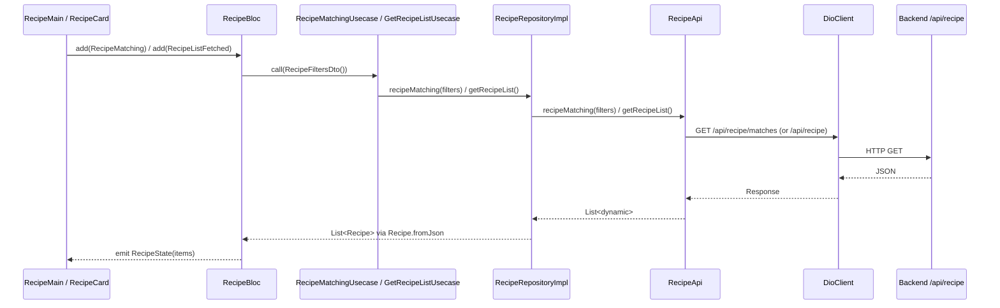

# Recipe feature

> Part of the PantryChef mobile client. See the
> [Mobile app README](../../../README.md) for the project overview and
> cross-feature setup.

The `recipe/` feature provides recipe browsing, matching recipes against the
user's available pantry ingredients, and detail viewing, alongside
favorite-related interactions surfaced on each recipe card.

## Purpose

The feature lets a user browse recipes the backend has matched against their
pantry, open any recipe to read its full detail, and toggle a recipe as a
favorite directly from its card.

- The main list screen, `RecipeMain`, renders matched recipes and supports
  pull-to-refresh
  (Source: mobile/lib/features/recipe/presentation/widgets/screens/recipe_main.dart:L11).
  On first display it dispatches a `RecipeMatching` event so the matched list
  loads automatically
  (Source: mobile/lib/features/recipe/presentation/widgets/screens/recipe_main.dart:L20-L26).
- Tapping a card opens the detail view rendered by `RecipeDetailed`
  (Source: mobile/lib/features/recipe/presentation/widgets/screens/recipe_detailed.dart:L11).
- A favorite button on each card toggles the recipe in the user's favorites.
  The action is dispatched to the profile feature's `ProfileBloc` via
  `FavoriteRecipesListUpdated`, so favorite state is owned cross-feature rather
  than by the recipe BLoC
  (Source: mobile/lib/features/recipe/presentation/widgets/recipe_card.dart:L143-L150).

## Key components

| Layer | Component | Source |
|-------|-----------|--------|
| Presentation / BLoC | `RecipeBloc` (`Bloc<RecipeEvent, RecipeState>`) with handlers for `RecipeListFetched`, `RecipeMatching`, `RecipeDetailedSelected`, `RecipeListReseted` | mobile/lib/features/recipe/presentation/bloc/recipe/recipe_bloc.dart:L10-L41 |
| Presentation / BLoC | `RecipeEvent` hierarchy | mobile/lib/features/recipe/presentation/bloc/recipe/recipe_event.dart:L3-L23 |
| Presentation / BLoC | `RecipeState` (`items`, `isFetching`, `detailedItemId`) | mobile/lib/features/recipe/presentation/bloc/recipe/recipe_state.dart:L3-L31 |
| Domain / model | `Recipe` | mobile/lib/features/recipe/domain/models/recipe.dart:L8 |
| Domain / model | `IngredientListItem` | mobile/lib/features/recipe/domain/models/ingredient_list_item.dart:L7 |
| Domain / model | `InstractionItem` (sic) | mobile/lib/features/recipe/domain/models/instraction_item.dart:L6 |
| Domain / repository | abstract `RecipeRepository` | mobile/lib/features/recipe/domain/repositories/recipe.repository.dart:L4-L12 |
| Domain / use case | `GetRecipeListUsecase` | mobile/lib/features/recipe/domain/usecases/get_recipe_list.usecase.dart:L6 |
| Domain / use case | `GetFavoriteRecipeListUsecase` | mobile/lib/features/recipe/domain/usecases/get_favorite_recipe_list.usecase.dart:L6 |
| Domain / use case | `RecipeMatchingUsecase` | mobile/lib/features/recipe/domain/usecases/recipe_matching.usecase.dart:L7 |
| Domain / use case | use-case barrel | mobile/lib/features/recipe/domain/usecases/index.dart:L1-L3 |
| Data / api | `RecipeApi` | mobile/lib/features/recipe/data/api/recipe.api.dart:L8 |
| Data / repository | `RecipeRepositoryImpl` | mobile/lib/features/recipe/data/repositories/recipe.repository.dart:L6 |
| Data / dto | `RecipeFiltersDto` | mobile/lib/features/recipe/data/dto/recipe_filters.dto.dart:L6 |
| Data / dto | `QueryRecipeDto` | mobile/lib/features/recipe/data/dto/query_recipe.dto.dart:L8 |
| Data / dto | dto barrel | mobile/lib/features/recipe/data/dto/index.dart:L1 |
| Widget / screen | `RecipeCard` | mobile/lib/features/recipe/presentation/widgets/recipe_card.dart:L12 |
| Widget / screen | `RecipeMain` | mobile/lib/features/recipe/presentation/widgets/screens/recipe_main.dart:L11 |
| Widget / screen | `RecipeDetailed` | mobile/lib/features/recipe/presentation/widgets/screens/recipe_detailed.dart:L11 |

## Architecture fit

The feature follows clean architecture with three layers, mirroring the
monorepo-wide per-feature convention:

- `domain/` — models, the `RecipeRepository` interface, and use cases.
- `data/` — `RecipeApi`, DTOs, and the `RecipeRepositoryImpl`.
- `presentation/` — `RecipeBloc`, widgets, and screens.

Dependencies flow inward. The presentation layer dispatches BLoC events that
invoke use cases, which call the domain `RecipeRepository`
(Source: mobile/lib/features/recipe/domain/repositories/recipe.repository.dart:L4-L12);
that interface is fulfilled by `RecipeRepositoryImpl` in `data/`
(Source: mobile/lib/features/recipe/data/repositories/recipe.repository.dart:L6).
Dependency injection uses `get_it`: `RecipeApi` resolves the shared HTTP client
through `getIt<DioClient>().dio`
(Source: mobile/lib/features/recipe/data/api/recipe.api.dart:L11-L13).

For the full system picture, see [Architecture](../../../../docs/ARCHITECTURE.md).

## Data models

All three models are `@JsonSerializable` and rely on a generated `part '*.g.dart'`
file produced by `build_runner`; those generated files are not hand-edited
(Source: mobile/lib/features/recipe/domain/models/recipe.dart:L5,
Source: mobile/lib/features/recipe/domain/models/instraction_item.dart:L3,
Source: mobile/lib/features/recipe/domain/models/ingredient_list_item.dart:L4).

### `Recipe`

Source: mobile/lib/features/recipe/domain/models/recipe.dart:L7-L58

| Field | Type | Source line |
|-------|------|-------------|
| `id` | `String` | recipe.dart:L9 |
| `title` | `String` | recipe.dart:L10 |
| `description` | `String` | recipe.dart:L11 |
| `ingridientList` (sic) | `List<IngredientListItem>` | recipe.dart:L12 |
| `instructions` | `List<InstractionItem>` (sic) | recipe.dart:L13 |
| `prepTime` | `int` | recipe.dart:L14 |
| `cookTime` | `int` | recipe.dart:L15 |
| `servings` | `int` | recipe.dart:L16 |
| `difficulty` | `String` | recipe.dart:L17 |
| `tags` | `List<String>` | recipe.dart:L18 |
| `imageUrl` | `String` | recipe.dart:L19 |
| `matchScore` | `double?` | recipe.dart:L20 |

The `matchScore` field carries the codebase's own inline description,
`// how well it matches available ingredients`, preserved verbatim in source
(Source: mobile/lib/features/recipe/domain/models/recipe.dart:L20). The field
name `ingridientList` is misspelled in source; this spelling is intentional and
stable, and is preserved as-is and never renamed
(Source: mobile/lib/features/recipe/domain/models/recipe.dart:L12).

### `IngredientListItem`

Source: mobile/lib/features/recipe/domain/models/ingredient_list_item.dart:L6-L25

| Field | Type | Source line |
|-------|------|-------------|
| `ingridient` (sic) | `Ingredient` | ingredient_list_item.dart:L8 |
| `amount` | `double` | ingredient_list_item.dart:L9 |
| `unit` | `String` | ingredient_list_item.dart:L10 |
| `required` | `bool` | ingredient_list_item.dart:L11 |
| `substitutes` | `List<String>?` | ingredient_list_item.dart:L12 |

The field name `ingridient` is misspelled in source; it is intentional and
preserved as-is. The `Ingredient` type itself is owned by the `ingredient/`
feature and imported from there
(Source: mobile/lib/features/recipe/domain/models/ingredient_list_item.dart:L2);
its full field table is cross-referenced in
[Data models](../../../../docs/DATA_MODELS.md).

### `InstractionItem` (sic)

Source: mobile/lib/features/recipe/domain/models/instraction_item.dart:L5-L20

The class name spelling `InstractionItem` is intentional and stable; it is
preserved as-is and never renamed.

| Field | Type | Source line |
|-------|------|-------------|
| `step` | `int` | instraction_item.dart:L7 |
| `description` | `String` | instraction_item.dart:L8 |
| `timer` | `double?` | instraction_item.dart:L9 |

For the full persisted-schema field tables (backend Mongoose entities plus the
Dart models), see [Data models](../../../../docs/DATA_MODELS.md).

## API endpoints / public interface

Recipe endpoints resolve to `/api/recipe`, built from
`Endpoints.recipe = "$apiBaseUrl/recipe"`
(Source: mobile/lib/core/constants/endpoints.dart:L19), where `apiBaseUrl`
defaults to `http://192.168.2.20:3000/api`
(Source: mobile/lib/env_config.dart:L2). Because the base URL already includes
the `/api` prefix, every route is `/api/<resource>` with no `/v1/` segment.

The mobile client consumes the backend through `RecipeApi`, whose methods all
issue HTTP `GET` requests:

| Method | Request | Source |
|--------|---------|--------|
| `getRecipeList()` | `GET /api/recipe` — returns `response.data['data']` | recipe.api.dart:L15-L20 |
| `recipeMatching(filters)` | `GET /api/recipe/matches` — sends `RecipeFiltersDto` as query params via `filters.toJson()` | recipe.api.dart:L22-L25 |
| `getRecipeById(id)` | `GET /api/recipe/:id` — single recipe by id | recipe.api.dart:L27-L30 |
| `getFavoriteList(ids)` | `GET /api/recipe` — reuses the list route with a `QueryRecipeDto(ids: ...)` query | recipe.api.dart:L32-L39 |

`recipeMatching` is invoked through `RecipeMatchingUsecase`
(Source: mobile/lib/features/recipe/domain/usecases/recipe_matching.usecase.dart:L9-L12),
and favorites are surfaced through `GetFavoriteRecipeListUsecase`
(Source: mobile/lib/features/recipe/domain/usecases/get_favorite_recipe_list.usecase.dart:L6-L11).

The domain contract `RecipeRepository` declares `getRecipeList()`,
`getFavoriteList(List<String> ids)`, `recipeMatching(RecipeFiltersDto filters)`,
and `getRecipeById(String id)`
(Source: mobile/lib/features/recipe/domain/repositories/recipe.repository.dart:L4-L12).

The list endpoint is paginated and the server enforces a result cap of 50; that
server-side detail, together with recipe match-scoring, is documented in
[API reference](../../../../docs/API_REFERENCE.md).

Accuracy note: the mobile `RecipeApi` issues read (`GET`) requests only. The
backend recipe resource additionally supports `POST` / `PATCH` / `DELETE`, but
those are not called from this feature and are documented in
[API reference](../../../../docs/API_REFERENCE.md); the mobile client does not
perform recipe create, update, or delete.

## Configuration

- The API base URL comes from `EnvConfig.apiBaseUrl`, a compile-time constant
  defined as
  `String.fromEnvironment('API_BASE_URL', defaultValue: 'http://192.168.2.20:3000/api')`
  (Source: mobile/lib/env_config.dart:L2), and is consumed through
  `Endpoints.recipe` (Source: mobile/lib/core/constants/endpoints.dart:L19).
- `RecipeFiltersDto` carries the matching flags `isQuickMake` (default `false`)
  and `isAlmostThere` (default `false`)
  (Source: mobile/lib/features/recipe/data/dto/recipe_filters.dto.dart:L6-L13),
  serialized to the `/matches` query via `toJson()`
  (Source: mobile/lib/features/recipe/data/dto/recipe_filters.dto.dart:L15).
- `QueryRecipeDto` drives list/pagination query params: `page` (default `1`),
  `limit` (default `500`), `query` (default `''`), optional `ids`, and `sort`
  (mapped via `Mappers.orderToJson`)
  (Source: mobile/lib/features/recipe/data/dto/query_recipe.dto.dart:L8-L24).
  Although the client default `limit` is `500`, the backend caps results at 50
  (see [API reference](../../../../docs/API_REFERENCE.md)).

## Data flow

A list or match request travels from the UI through the BLoC and a use case
into the repository, which delegates to `RecipeApi` and the shared `DioClient`,
returning parsed `Recipe` instances back to the UI as emitted state.



Flow citations: list/match dispatch
(Source: mobile/lib/features/recipe/presentation/widgets/screens/recipe_main.dart:L20-L26);
BLoC handlers
(Source: mobile/lib/features/recipe/presentation/bloc/recipe/recipe_bloc.dart:L12-L32);
use case
(Source: mobile/lib/features/recipe/domain/usecases/recipe_matching.usecase.dart:L9-L12);
repository
(Source: mobile/lib/features/recipe/data/repositories/recipe.repository.dart:L8-L26);
api (Source: mobile/lib/features/recipe/data/api/recipe.api.dart:L15-L25);
endpoint (Source: mobile/lib/core/constants/endpoints.dart:L19).

A detail-selection sub-flow runs alongside the list flow: tapping a card
dispatches `RecipeDetailedSelected(id: item.id)` and navigates to the detail
route
(Source: mobile/lib/features/recipe/presentation/widgets/recipe_card.dart:L37-L40),
and `RecipeDetailed` then renders the recipe whose `id` equals
`state.detailedItemId`
(Source: mobile/lib/features/recipe/presentation/widgets/screens/recipe_detailed.dart:L18).

## Design patterns used

- **BLoC (event/state)** — `RecipeBloc` maps events to emitted `RecipeState`s
  (Source: mobile/lib/features/recipe/presentation/bloc/recipe/recipe_bloc.dart:L10-L41).
- **Repository** — an abstract `RecipeRepository`
  (Source: mobile/lib/features/recipe/domain/repositories/recipe.repository.dart:L4-L12)
  decouples the domain from data access, implemented by `RecipeRepositoryImpl`
  (Source: mobile/lib/features/recipe/data/repositories/recipe.repository.dart:L6).
- **Use Case** — single-purpose `UseCase` / `UseCaseWithParams` implementations
  encapsulate each operation
  (Source: mobile/lib/features/recipe/domain/usecases/get_recipe_list.usecase.dart:L6,
  Source: mobile/lib/features/recipe/domain/usecases/recipe_matching.usecase.dart:L7).
- **Dependency injection (`get_it`)** — the shared `DioClient` is resolved via
  `getIt` rather than constructed directly
  (Source: mobile/lib/features/recipe/data/api/recipe.api.dart:L11-L13).
- **DTO-based filtering** — `RecipeFiltersDto` and `QueryRecipeDto` serialize
  query parameters for the matching and list routes
  (Source: mobile/lib/features/recipe/data/dto/recipe_filters.dto.dart:L6-L15,
  Source: mobile/lib/features/recipe/data/dto/query_recipe.dto.dart:L8-L24).

## Known limitations / gaps

KNOWN ISSUE: `Recipe.copyWith({final bool? inFavorite})` accepts an `inFavorite`
argument but never applies it. The `Recipe` class has no `inFavorite` field, so
the method copies every existing field unchanged and returns an identical copy —
a no-op (Source: mobile/lib/features/recipe/domain/models/recipe.dart:L37-L38;
full method Source: mobile/lib/features/recipe/domain/models/recipe.dart:L37-L53).
This behavior is documented here as-is and is not corrected.

- **Preserved misspelled identifiers** — the class `InstractionItem`, and the
  `Recipe` field/usages `ingridientList` and `ingridient`, are misspelled in
  source. These spellings are intentional and stable; they are documented as-is
  and never renamed
  (Source: mobile/lib/features/recipe/domain/models/recipe.dart:L12-L13,
  Source: mobile/lib/features/recipe/domain/models/ingredient_list_item.dart:L8).
- **Matching is server-side and exact-ingredient based** — the client only
  sends the `isQuickMake` / `isAlmostThere` flags; the match scoring
  (`matchScore`, the quick-make/almost-there derivation, and exact `_id`
  matching with no unit normalization) is computed by the backend. That detail
  is documented in [API reference](../../../../docs/API_REFERENCE.md).

## Local development

```bash
flutter pub get
dart run build_runner build --delete-conflicting-outputs
flutter run --dart-define API_BASE_URL=http://<host>:3000/api
```

- `flutter pub get` installs dependencies.
- `dart run build_runner build --delete-conflicting-outputs` regenerates the
  `*.g.dart` files, required because the models use codegen (`@JsonSerializable`
  with `part '*.g.dart'`).
- `flutter run --dart-define API_BASE_URL=http://<host>:3000/api` overrides the
  compile-time API base (Source: mobile/lib/env_config.dart:L2). `<host>` must
  be reachable from the device or emulator (a LAN IP, or `10.0.2.2` for the
  Android emulator).
- Keep static analysis clean with `flutter analyze` (equivalently
  `dart analyze`). This feature's models, BLoC, and DTOs are unchanged by
  documentation; only this README is added.

For the project overview and cross-feature setup, see the
[Mobile app README](../../../README.md). For system-wide context, see
[Architecture](../../../../docs/ARCHITECTURE.md),
[API reference](../../../../docs/API_REFERENCE.md), and
[Data models](../../../../docs/DATA_MODELS.md).
