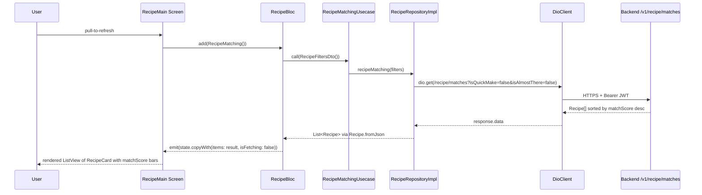

# Recipe Feature (Mobile)

## Module Purpose

The `mobile/lib/features/recipe/` feature implements recipe browsing,
detail, and pantry-aware matching for the PantryChef Flutter client. It
consumes the backend `/api/v1/recipe` endpoint family — most notably
`GET /api/v1/recipe/matches`, which scores recipes against the
user's current pantry and `Preferences` (see
[../../../../ARCHITECTURE.md](../../../../ARCHITECTURE.md) § Recipe Matching
Pipeline for the full server-side algorithm). The domain layer preserves
backend's verbatim spellings — the `ingridientList` field (spelling preserved
verbatim from backend), the `InstractionItem` class (spelling preserved
verbatim), and the `instraction_item.dart` file (filename preserved verbatim).
The feature also contains a documented `Recipe.copyWith` no-op bug on the
`inFavorite` parameter (see Known Limitations and Implementation Gaps below),
surfaced but not fixed in this pass.

## Key Components

| Path | Type | Responsibility |
| --- | --- | --- |
| `domain/models/recipe.dart` | Model | `Recipe` domain model; `ingridientList` field (sic, L12) and `instructions: List<InstractionItem>` (sic, L13); contains the `copyWith` no-op on `inFavorite` (L37-L53). |
| `domain/models/instraction_item.dart` | Model | `InstractionItem` class (filename + class name both preserved verbatim); fields `step`, `description`, optional `timer`. |
| `domain/models/ingredient_list_item.dart` | Model | `IngredientListItem` (correct mobile spelling) maps to backend's verbatim `IngridientList` sub-schema; its `ingridient` field (lowercase, sic) is preserved to match backend JSON. |
| `domain/repositories/recipe.repository.dart` | Repository contract | Abstract `RecipeRepository` with `getRecipeList`, `getFavoriteList`, `recipeMatching`, `getRecipeById`. |
| `domain/usecases/get_recipe_list.usecase.dart` | UseCase | `GetRecipeListUsecase` — paginated list. |
| `domain/usecases/get_favorite_recipe_list.usecase.dart` | UseCase | `GetFavoriteRecipeListUsecase` — resolves favorite IDs. |
| `domain/usecases/recipe_matching.usecase.dart` | UseCase | `RecipeMatchingUsecase` — pantry-aware matches. |
| `domain/usecases/index.dart` | Barrel | Re-exports the three use cases. |
| `data/api/recipe.api.dart` | Dio API client | `RecipeApi` wraps `getIt<DioClient>().dio`; calls `Endpoints.recipe` plus `/matches`, `/:id` suffixes. |
| `data/dto/query_recipe.dto.dart` | DTO | `QueryRecipeDto` for pagination (`page`, `limit`, `query`, `ids`, `sort`). |
| `data/dto/recipe_filters.dto.dart` | DTO | `RecipeFiltersDto` for backend's `isQuickMake` and `isAlmostThere` query flags. |
| `data/dto/index.dart` | Barrel | Re-exports `recipe_filters.dto.dart`. |
| `data/repositories/recipe.repository.dart` | Repository impl | `RecipeRepositoryImpl` adapts API payloads to `Recipe.fromJson`. |
| `presentation/bloc/recipe/recipe_bloc.dart` | BLoC | `RecipeBloc` handles `RecipeListFetched`, `RecipeMatching`, `RecipeDetailedSelected`, `RecipeListReseted`. |
| `presentation/bloc/recipe/recipe_event.dart` | Events | Four sealed events extending `Equatable`. |
| `presentation/bloc/recipe/recipe_state.dart` | State | `RecipeState` with `items?`, `isFetching`, `detailedItemId?`. |
| `presentation/widgets/recipe_card.dart` | Widget | List card with image, title, prep/cook/servings, `matchScore` progress bar, favorite toggle (talks to `ProfileBloc`). |
| `presentation/widgets/screens/recipe_main.dart` | Screen | Recipe list / matches screen with `ShimmerList`, empty state, `RefreshIndicator`. |
| `presentation/widgets/screens/recipe_detailed.dart` | Screen | Recipe detail screen rendering `ingridientList` (sic) and `instructions` (typed as `List<InstractionItem>`, sic). |

## Architecture Fit

The feature follows the standard mobile clean-architecture pattern: the
`presentation/` layer (BLoC plus widgets and screens) calls into the
`domain/` layer (use cases over the abstract `RecipeRepository`), which is
bound to the `data/` layer's `RecipeRepositoryImpl`. Backend integration is
funnelled through `RecipeApi`, which uses the app-wide
`getIt<DioClient>().dio` instance — the JWT bearer interceptor on that client
is documented in
[../../../../ARCHITECTURE.md](../../../../ARCHITECTURE.md) § JWT Authentication
Flow. Importantly, the **recipe matching algorithm runs entirely on the
server** — the mobile feature is a thin consumer that issues
`GET /api/v1/recipe/matches` and renders the sorted result. See
[../../../../ARCHITECTURE.md](../../../../ARCHITECTURE.md) § Recipe Matching
Pipeline for the four Mongo pre-filters, the per-recipe scoring loop, and the
`isQuickMake`/`isAlmostThere` derivation.

## Dependencies

### Internal

- `mobile/lib/core/utils/dio_client.dart` — shared `DioClient` with the JWT bearer interceptor.
- `mobile/lib/core/utils/service_locator.dart` — `getIt<DioClient>()` resolution.
- `mobile/lib/core/constants/endpoints.dart` — the `recipe` endpoint constant at L70; `/matches` and `/:id` suffixes are appended at the API client.
- `mobile/lib/core/utils/usercase.dart` — shared `UseCase`/`UseCaseWithParams` interfaces consumed by the three use cases.
- `mobile/lib/features/ingredient/domain/models/ingredient.dart` — `IngredientListItem.ingridient` is typed `Ingredient`.
- `mobile/lib/features/profile/presentation/bloc/profile/profile_bloc.dart` — `RecipeCard` dispatches `FavoriteRecipesListUpdated` to it.
- `mobile/lib/core/constants/navigation.dart` — `Navigation.recipeDetailed` route key used by `RecipeCard`.

### External

Versions pinned exactly per `mobile/pubspec.yaml`:

- `bloc ^8.1.4` (`mobile/pubspec.yaml:L38`)
- `flutter_bloc ^8.1.6` (`mobile/pubspec.yaml:L39`)
- `json_annotation ^4.9.0` (`mobile/pubspec.yaml:L40`)
- `equatable ^2.0.5` (`mobile/pubspec.yaml:L41`)
- `cached_network_image ^3.4.1` (`mobile/pubspec.yaml:L45`)
- `dio ^5.7.0` (`mobile/pubspec.yaml:L50`)
- `flutter_platform_widgets ^7.0.1` (`mobile/pubspec.yaml:L33`)

## Primary Use Cases

- **Browse recipes** — `RecipeMain` screen shows a paginated list of `RecipeCard` items. The card displays `imageUrl`, `title`, `description`, `prepTime`, `cookTime`, `servings`, and the `matchScore` progress bar coloured by `_getProgressBarColor(context)` (≥0.7 green, 0.3–0.7 orange, <0.3 red).
- **Get pantry-aware matches** — `GET /api/v1/recipe/matches` with optional `isQuickMake` and `isAlmostThere` flags. The response is sorted by `matchScore` desc on the server; `RecipeBloc` simply emits the items list.
- **View recipe detail** — `RecipeDetailed` screen renders the `ingridientList` (spelling preserved verbatim) as `"<name>, <amount> <unit>"` lines, followed by `instructions` (typed `List<InstractionItem>`, spelling preserved verbatim) rendered as `"<step>. <description>"` lines.
- **Filter by quick-make / almost-there** — `RecipeFiltersDto` exposes `isQuickMake` and `isAlmostThere` boolean flags, serialized as query params via `toJson()`.
- **Toggle favorite** — `RecipeCard` does NOT mutate the `Recipe` model; it dispatches `FavoriteRecipesListUpdated(recipeId, isFavorite)` to `ProfileBloc`, which manages favorites in the `User.favoriteRecipes` array (see [../../../../DATA_MODEL.md](../../../../DATA_MODEL.md) § User).

## API / Endpoint Reference

All endpoints are consumed via `RecipeApi` and are under the global prefix `/api/v1/recipe`. Every endpoint requires JWT authentication on the backend (`@UseGuards(AuthGuard('jwt'))`) — the JWT bearer header is attached automatically by the shared `DioClient` interceptor.

| Method | Path | Backend Guard | Mobile Method |
| --- | --- | --- | --- |
| `GET` | `/api/v1/recipe/matches` | `AuthGuard('jwt')` | `RecipeApi.recipeMatching(filters)` — query params from `RecipeFiltersDto.toJson()` |
| `GET` | `/api/v1/recipe` | `AuthGuard('jwt')` | `RecipeApi.getRecipeList()` and `RecipeApi.getFavoriteList(ids)` (the latter passes `QueryRecipeDto(ids: ids)` as query params) |
| `GET` | `/api/v1/recipe/:id` | `AuthGuard('jwt')` | `RecipeApi.getRecipeById(id)` |
| `POST` | `/api/v1/recipe` | `AuthGuard('jwt')` | Not currently surfaced in mobile UI (backend supports it). |

Backend pagination caps `limit` at 50 per page. The mobile `QueryRecipeDto.limit` defaults to 500 — the backend will silently clamp it. See [../../../../backend/src/recipe/README.md](../../../../backend/src/recipe/README.md) for the backend-side controller details.

## Data Flows

The diagram below traces a pantry-aware match request from the user tapping
the refresh control through to the rendered list. The full server-side
matching algorithm (four Mongo pre-filters, per-recipe scoring loop,
`isQuickMake`/`isAlmostThere` derivation, post-filter, sort) lives in
[../../../../ARCHITECTURE.md](../../../../ARCHITECTURE.md) § Recipe Matching
Pipeline and is not duplicated here — the mobile feature is a thin consumer.

## Configuration

The mobile recipe feature has no per-feature configuration; it inherits the
app-wide compile-time configuration:

| Option | Source | Notes |
| --- | --- | --- |
| `API_BASE_URL` | `mobile/lib/env_config.dart` — compile-time via `--dart-define API_BASE_URL=<value>` | Default `http://192.168.2.20:3000/api` (local network IP); production builds must override. |
| `Endpoints.recipe` | `mobile/lib/core/constants/endpoints.dart:L70` — `'$apiBaseUrl/recipe'` | Used by `RecipeApi`; `/matches` and `/:id` suffixes are appended at call sites. |
| `isQuickMake`, `isAlmostThere` | `RecipeFiltersDto` query params | Both default to `false`; sent through `toJson()` as standard Dio query parameters. |

## Known Limitations and Implementation Gaps

> ⚠️ **Preserved spellings (verbatim from backend)** — the mobile recipe
> domain mirrors backend schema names exactly. Do NOT rename any of the
> following:
> - `mobile/lib/features/recipe/domain/models/instraction_item.dart` —
>   filename preserved verbatim.
> - `InstractionItem` class declaration in
>   `mobile/lib/features/recipe/domain/models/instraction_item.dart:L6` —
>   class name preserved verbatim.
> - `import '.../instraction_item.dart'` at
>   `mobile/lib/features/recipe/domain/models/recipe.dart:L3` — import path
>   preserved verbatim.
> - `final List<IngredientListItem> ingridientList;` at
>   `mobile/lib/features/recipe/domain/models/recipe.dart:L12` — field name
>   preserved verbatim (matches backend Recipe schema's `ingridientList`).
> - `final List<InstractionItem> instructions;` at
>   `mobile/lib/features/recipe/domain/models/recipe.dart:L13` — type name
>   preserved verbatim.
> - `final Ingredient ingridient;` at
>   `mobile/lib/features/recipe/domain/models/ingredient_list_item.dart:L8`
>   — field name `ingridient` (lowercase, sic) preserved verbatim to keep
>   JSON serialization aligned with the backend `IngridientList.ingridient`
>   property.

> ⚠️ **`Recipe.copyWith` no-op on `inFavorite`** — the method at
> `mobile/lib/features/recipe/domain/models/recipe.dart:L37-L53` accepts a
> `final bool? inFavorite,` parameter but does NOT use it because `Recipe`
> has no `inFavorite` field. The body reconstructs a `Recipe` from existing
> fields. It is documented inline with `// NOTE:` and `// FIXME:` tags and
> **deliberately NOT fixed** in this pass. Favorites are managed separately via
> `ProfileBloc.FavoriteRecipesListUpdated` and the `User.favoriteRecipes`
> field. See
> [../../../../PRODUCTION_READINESS.md](../../../../PRODUCTION_READINESS.md)
> for the follow-up task.

> ⚠️ **Backend exact `_id` matching only** — the server's
> `RecipeDocumentRepository.matches()` algorithm compares pantry
> `Ingridient._id.toString()` against `IngridientList.ingridient._id`
> directly; substitutes and equivalent ingredients are ignored. It performs
> no unit normalization and no quantity sufficiency check. See
> [../../../../ARCHITECTURE.md](../../../../ARCHITECTURE.md) § Recipe Matching
> Pipeline and
> [../../../../backend/src/recipe/README.md](../../../../backend/src/recipe/README.md)
> for the full algorithm. The mobile feature renders whatever the backend
> returns.

> ⚠️ **`IngredientListItem` ↔ backend `IngridientList`** — the Dart model
> uses the correct spelling `IngredientListItem`, but its `ingridient` field
> (lowercase, sic) preserves backend's spelling for JSON alignment. The class
> name stays corrected because backend's `IngridientList` sub-schema is
> referenced only through its embedded fields, not by name; see
> [../../../../DATA_MODEL.md](../../../../DATA_MODEL.md) § Recipe.

## Production Readiness Status

> 🚧 **No offline cache for the recipe list or matches** — `RecipeBloc`
> extends `Bloc<RecipeEvent, RecipeState>` and discards state on app restart.
> Network failures during pull-to-refresh leave the UI in an ephemeral
> loading state with no fallback. See
> [../../../../PRODUCTION_READINESS.md](../../../../PRODUCTION_READINESS.md)
> § Mobile Release.

> 🚧 **`Recipe.copyWith` no-op bug must be addressed before any UI feature
> depends on it** — no caller relies on `copyWith(inFavorite: …)` today
> because the `Profile` feature manages favorites via `User.favoriteRecipes`.
> If a future UI ties in-card favoriting to the `Recipe` model directly, this
> becomes a functional regression. The fix is to either drop the `inFavorite`
> parameter from `copyWith` or add an `inFavorite` field to `Recipe` and
> propagate it through the constructor and `fromJson`.

> 🚧 **`cached_network_image` image cache has no eviction policy** —
> `RecipeCard` uses `ImageWidget` which delegates to `cached_network_image`
> with default settings (no `maxNrOfCacheObjects`, no `stalePeriod`). Large
> recipe sets can balloon disk usage over long sessions; production builds
> should configure `CacheManager.defaultCacheManager` with bounded limits.

> 🚧 **Backend matching algorithm gaps require server-side work** — exact
> `_id` matching, missing unit normalization, and missing quantity
> sufficiency are all server-side limitations. See
> [../../../../backend/src/recipe/README.md](../../../../backend/src/recipe/README.md)
> for the backend-side production-readiness items. The mobile feature renders
> whatever the backend returns and is otherwise correct.
